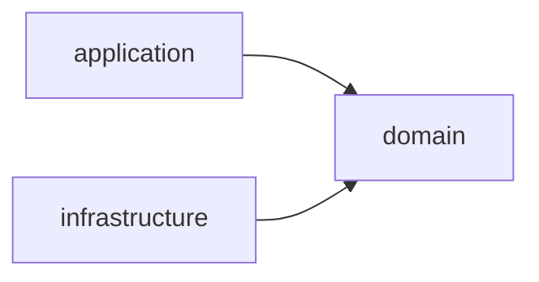

# 0002. Hexagonal architecture for the server

## Status
Accepted

## Context
The server ([ADR-0001](0001-backend-stack.md)) ingests data from an external source, applies analysis, and
exposes it through a REST API and exports. These responsibilities pull in different
directions: scraping and persistence are volatile infrastructure concerns, while the
contract/tender model and analysis rules are the stable core of the system. We want
the core to be independent of frameworks, transport and storage so it can be tested
in isolation and so adapters (HTTP, DB, scrapers, exporters) can change without
touching business rules. Independence here means independence from transport and
storage concerns — the domain may still use the DI container's annotations.

## Decision
Structure the server using **hexagonal architecture (ports & adapters)**, split into
three modules:

- **domain** — the core model and business rules (entities, value objects, domain
  services). Free of transport and persistence concerns, though domain classes **may**
  carry Micronaut dependency-injection annotations.
- **application** — the **driving side / entry points**: REST endpoints, schedulers
  and other triggers, plus the use-case orchestration they invoke to coordinate the
  domain.
- **infrastructure** — the **driven side**: the **ports and adapters** for reaching
  external services — PostgreSQL persistence, external scrapers/ingestors, exporters
  — and the Micronaut wiring/configuration for them.

Both **application** and **infrastructure** depend on **domain**, and on nothing else:
**application does not depend on infrastructure**, and **infrastructure does not depend
on application**. The **domain** depends on nothing. The two outer modules are decoupled
siblings, meeting only through domain abstractions and Micronaut's DI container at
runtime.

Domain types cross the module boundaries directly. **DTOs are not introduced in the
application or infrastructure modules unless a concrete need arises** (e.g. an external
contract that diverges from the domain shape); a DTO is added only where it earns its
place, not as a default mapping layer.

## Consequences
+ The domain and use cases are testable without a database, HTTP server or network.
+ Infrastructure can be swapped (e.g. a different export format or scraping source)
  by adding/replacing adapters, not by editing core logic.
+ Clear boundaries make the dependency rule enforceable (e.g. via module boundaries
  / build configuration).
− More upfront structure and indirection (ports/adapters) than a single-module layered
  app; small features cost a little more ceremony.
+ Application and infrastructure are independently replaceable: a driving adapter (REST,
  scheduler) and a driven adapter (DB, scraper, exporter) can change without affecting
  each other.
− Requires discipline to keep transport and persistence types out of the domain module
  (Micronaut DI annotations on domain classes are allowed).
