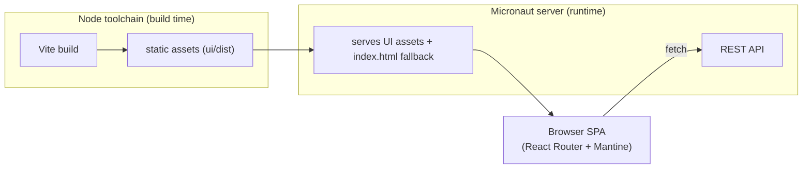

# 0004. UI stack: Vite build, React Router (library mode) SPA, Mantine components

## Status
Accepted

## Context
[ADR-0003](0003-react-router-ui-served-by-backend.md) decided the UI is a **React Router** application **served by the Micronaut
backend** as a single deployable artifact. It deliberately left open *how* the UI is
built and *which* component/design system it uses. Those are cross-cutting decisions
that shape every screen and the build pipeline, so they need recording before any UI
code exists.

Forces at play:

- **Single artifact, single origin ([ADR-0003](0003-react-router-ui-served-by-backend.md)).** The backend serves the UI's built
  assets. The simplest fit is a set of **static assets** (HTML/JS/CSS) the server can
  expose from the classpath — no Node runtime in production, no SSR server to host.
- **Relational, query-heavy domain.** The UI browses, searches, filters and exports
  contract data from the REST API. It needs solid data tables, forms, inputs, filters,
  modals and navigation out of the box, with accessibility handled.
- **JVM + Node toolchains ([ADR-0003](0003-react-router-ui-served-by-backend.md)).** The build pipeline already spans two
  toolchains; the Node side should be fast, conventional and low-ceremony.
- **Galician-language, public-sector UI.** Accessibility and a consistent, themeable
  look matter; we prefer a batteries-included library over assembling primitives.

## Decision
- **Build tool: Vite** (React + TypeScript template). The UI builds to **static assets**.
- **Routing: React Router in library mode** — `createBrowserRouter` + `RouterProvider`,
  a **client-side SPA**. We do **not** adopt React Router *framework mode* (its Vite
  plugin / SSR), because that expects a Node server at runtime and conflicts with the
  "static assets served by Micronaut" delivery in [ADR-0003](0003-react-router-ui-served-by-backend.md).
- **Design framework: Mantine** (`@mantine/core` + `@mantine/hooks`), themed via a
  single `MantineProvider` + `createTheme`, with `postcss-preset-mantine`. Pre-built
  blocks from [ui.mantine.dev](https://ui.mantine.dev) are used as composition
  starting points.
- **Package manager: npm.** Ubiquitous, no extra CI tooling.
- **Location: `ui/`** (per the [README](../../README.md)'s module layout), a sibling of `server/`.

History routing (not hash) is used; the backend must serve `index.html` as the
SPA fallback for unknown non-API paths so client-side routes deep-link correctly.

## Consequences
+ Static-asset output drops straight into the single Micronaut artifact ([ADR-0003](0003-react-router-ui-served-by-backend.md))
  with no production Node runtime and no SSR server to operate.
+ Mantine provides accessible data tables, forms, inputs, filters and navigation out
  of the box, plus ready-made blocks from ui.mantine.dev — fast UI delivery.
+ Vite gives fast dev/HMR and a conventional, well-supported React+TS setup.
+ npm needs no extra CI provisioning beyond Node.
− Library-mode SPA forgoes server-side rendering and route-level data loaders/SSR;
  initial load ships the app bundle and fetches data client-side. Acceptable for an
  internal/analytical tool; revisit with a new ADR if SEO or first-paint on data
  pages becomes a requirement.
− Commits the UI to Mantine's component model and theming conventions.
− The backend build must consume `ui/dist` and configure an SPA history fallback;
  that wiring is owned by the server module and its governing work, not this ADR.
