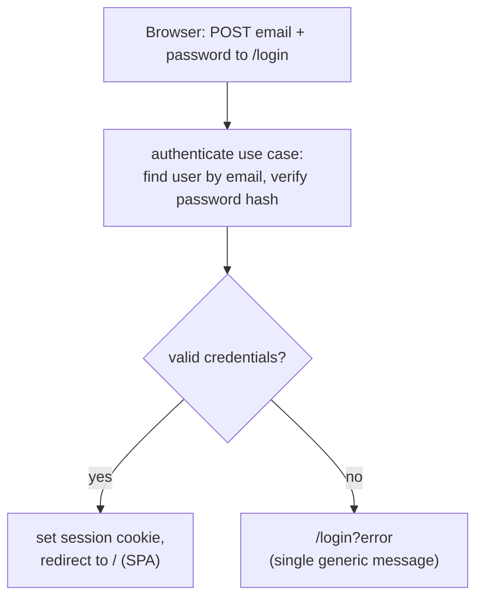

# 0005. Session-based authentication with Micronaut Security

## Status
Accepted

## Context
[SPEC-002](../specs/SPEC-002-user-authentication.md) requires email + password
authentication, `USER`/`ADMIN` roles, sessions that persist across requests, logout,
and passwords that are never stored or exposed in a recoverable form. We must decide
the authentication **mechanism** (server-side session vs. stateless token/JWT), where
the **login UI** lives, and how credentials are protected.

Forces at play:

- **Single artifact, single origin ([ADR-0003](0003-react-router-ui-served-by-backend.md)).**
  The Micronaut server serves both the SPA and the REST API from one origin, so a
  session **cookie** is carried automatically on every request with no cross-origin
  token handling.
- **Micronaut backend ([ADR-0001](0001-backend-stack.md)), hexagonal
  ([ADR-0002](0002-hexagonal-architecture.md)).** Authentication is a cross-cutting
  concern that must respect the module boundaries: the identity model and the
  credential check are domain rules; the user store, password hashing and the security
  framework are driven adapters.
- **Credential safety (SPEC-002).** Passwords must never reach client-side JavaScript
  as plaintext, never be stored recoverably, and never leak in logs or responses.
- **Revocation.** A user must be able to log out and immediately lose access; an
  administrator-invalidated or expired session must stop working at once.

## Decision
Use **session-based authentication** with **Micronaut Security in session mode**:

- **Server-side session + cookie.** A successful login establishes a server-held
  session identified by a cookie; the user stays authenticated across requests without
  re-sending credentials. Logout invalidates the session server-side.
- **Server-rendered login, outside the SPA.** `GET/POST /login` is rendered by the
  server (not the React SPA), so credentials are submitted by a plain form and never
  handled by application JavaScript. The SPA bundle is served only once a session
  exists.
- **CSRF protection** is enabled for the form-login flow.
- **Passwords stored as salted hashes.** Verification compares hashes; plaintext is
  never stored, logged or returned. A failed login is **indistinct** — an unknown email
  and a wrong password are not separable, and the password check is not short-circuited
  when the email is unknown.
- **Role enforcement via `@Secured`.** `USER` sees data/analysis; `ADMIN` (a strict
  superset) additionally reaches the admin area; `/login` is anonymous.
- **XHR/API returns 401, not a redirect,** when the session is absent or expired, so
  the SPA can detect a gone session and route the browser to `/login`.
- **Hexagonal placement ([ADR-0002](0002-hexagonal-architecture.md)):** the **domain**
  owns `User`, `Role`, the authenticate use case and the `UserRepository` /
  `PasswordEncoder` ports; **infrastructure** provides the PostgreSQL user store, the
  password-hashing adapter and the Micronaut Security wiring; the **application**
  (driving) side exposes the login/logout endpoints and `@Secured` rules.

We deliberately **do not** adopt stateless JWT/bearer tokens: with a single origin a
cookie is the simpler fit, browser token storage adds an XSS token-theft surface, and
server-held sessions make logout and revocation trivial.

## Consequences
+ Single origin + session cookie is the natural fit; no browser token storage and no
  cross-origin token juggling.
+ A server-rendered login keeps credentials out of the SPA and its JavaScript.
+ Server-held session state makes logout and revocation immediate.
+ Micronaut Security provides session management, `@Secured` rules and CSRF out of the
  box, and the domain stays free of the framework behind ports ([ADR-0002](0002-hexagonal-architecture.md)).
− Sessions are **stateful**: running more than one server instance needs a shared
  session store; revisit with a new ADR if the service is scaled out horizontally.
− Two UI styles coexist: a server-rendered login/forbidden page and the SPA app.
− Form posts require CSRF handling that a stateless token API would not.
− If a stateless API for third-party/native clients is later required, this decision
  must be revisited (a token mechanism added alongside, via a new ADR).
