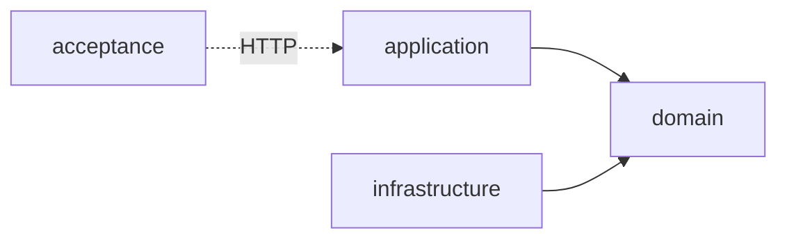

# 0007. Acceptance testing module using REST-assured against a real running instance

## Status
Accepted

## Context
The server has unit tests inside each hexagonal module ([ADR-0002](0002-hexagonal-architecture.md))
and a handful of Micronaut HTTP-client tests inside `application/src/test` (e.g.
`ApplicationTest`, and the routing-matrix test added by
`docs/tasks/FEAT-0003/TASK-0004-vite-base-path-and-integration-test.md`). None of these
exercise the *packaged* application as an outside caller would: they run inside the
module's own test source set, in the same JVM/build context as unit tests, and can reach
internal types directly.

As the server grows (authentication, contract ingestion from contratosdegalicia.gal,
exports), we want black-box coverage of high-value user scenarios — hit real HTTP
endpoints of a genuinely running instance, with external dependencies (the
contratosdegalicia.gal source, and any future downstream integration) replaced by mocks
and the database seeded with a fixed dataset — independent of how the three hexagonal
modules are internally wired. This is a new kind of test (black-box, whole-application)
and needs its own home so it isn't confused with the per-module unit tests or the
in-process Micronaut client tests already living in `application`.

## Decision
Add a new top-level Gradle module, **`acceptance`**, sibling to `domain`, `application`
and `infrastructure`:

- `acceptance` has **no compile-time dependency** on `domain`, `application` or
  `infrastructure` — it is outside the hexagonal dependency graph entirely. It only
  depends on test tooling: REST-assured (HTTP-driving), AssertJ (assertions), JUnit 5.
- Tests **expect the application, and any downstream mocks it's configured to call, to
  already be running externally** (docker-compose, a deployed environment, or started
  manually for a local run) before the suite executes. `acceptance` does not boot,
  build a distribution of, or otherwise manage the lifecycle of the application, its
  database, or its mocked downstreams — it only knows their base URLs, supplied via
  system properties/environment variables (with `http://localhost:8080` as the local-dev
  default for the application, matching `application.yml`'s configured port).
- Downstream services the running instance would otherwise call out to (starting with
  contratosdegalicia.gal) are replaced, in that external environment, by mocks (e.g.
  WireMock); tests may use a WireMock *client* pointed at the mock's base URL to program
  stubs and verify recorded requests. The database is a real PostgreSQL seeded with a
  fixed dataset per scenario, using file fixtures for canned HTTP/DB payloads; how it's
  (re)seeded before a run is the external environment's responsibility, not this module's.
- Test method names are snake_case; assertions use AssertJ; HTTP calls use
  REST-assured — matching this repo's `backend:java-acceptance-test` convention.
- `acceptance` is registered in `settings.gradle` and runs via its own custom Gradle
  task, `./gradlew :acceptance:acceptance` — not the conventional `test` task. The
  built-in `test` task is disabled, so the plain `check`/`build` commands the other
  three modules use (and CI's `./gradlew build`) skip this suite entirely, since it
  requires that external environment to be up first. How that environment is stood up
  (docker-compose file, CI job, local script) is left to the implementing task.

## Consequences
+ Full-stack, deployment-shaped coverage of user scenarios, decoupled from internal
  module boundaries — the hexagonal split can be refactored without touching these
  tests as long as the HTTP contract holds.
+ A single, discoverable home for black-box tests, distinct from per-module unit tests
  and the in-process integration tests already in `application`.
+ The test suite itself stays simple — no process/container lifecycle code to write or
  maintain — and mirrors how the app is actually run in CI/production: as an externally
  started, already-running instance.
+ Mocked downstream services and fixed datasets make scenarios deterministic and
  independent of the real contratosdegalicia.gal site.
− Requires an external orchestration mechanism (docker-compose, CI job, or documented
  manual steps) to exist; `acceptance` cannot run standalone from a clean checkout with
  a single Gradle command the way the other three modules' `test` tasks can.
− The suite provides no automatic teardown/reset between runs — whatever starts the
  external environment (or the tests themselves, via admin APIs like WireMock's reset
  endpoint or a reseed script run before the suite) is responsible for known-good state.
− Duplicate coverage risk with the existing `application`-module integration tests
  (e.g. the routing-matrix test in TASK-0004) until it's decided whether those move into
  `acceptance` or continue to serve a narrower, faster-feedback purpose.
