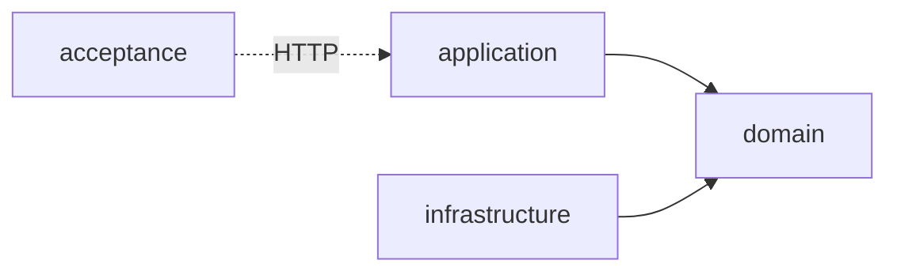

# 0007. Acceptance testing module: REST-assured for the API, Playwright for the served UI

## Status
Accepted

## Context
The server has unit tests inside each hexagonal module ([ADR-0002](0002-hexagonal-architecture.md))
and a handful of Micronaut HTTP-client tests inside `application/src/test` and
`application/src/integrationTest` (e.g. `ApplicationTest`, `SpaHistoryFallbackTest`).
None of these exercise the *packaged* application as an outside caller would: they run
inside the module's own test source set, in the same JVM/build context as unit tests,
and can reach internal types directly.

As the server grows (authentication, contract ingestion from contratosdegalicia.gal,
exports), we want black-box coverage of high-value user scenarios — hit real HTTP
endpoints of a genuinely running instance, with external dependencies (the
contratosdegalicia.gal source, and any future downstream integration) replaced by mocks
and the database seeded with a fixed dataset — independent of how the three hexagonal
modules are internally wired. This is a new kind of test (black-box, whole-application)
and needs its own home so it isn't confused with the per-module unit tests or the
in-process Micronaut client tests already living in `application`.

[FEAT-0003](../features/FEAT-0003-backend-serves-ui-application/README.md) adds a second
kind of black-box scenario an HTTP client can't cover: the same instance also serves the
built SPA (ADR-0003/ADR-0004), and the thing worth proving there — a served page's asset
references actually resolve, and the SPA hydrates and client-side-routes correctly — can
only be observed by an actual browser, not by asserting on raw HTTP responses.

## Decision
Add a new top-level Gradle module, **`acceptance`**, sibling to `domain`, `application`
and `infrastructure`:

- `acceptance` has **no compile-time dependency** on `domain`, `application` or
  `infrastructure` — it is outside the hexagonal dependency graph entirely. It depends
  on test tooling scoped to what each scenario drives: **REST-assured** for every
  `/api/**` scenario, and **Playwright** (a real, scriptable browser) for scenarios that
  exercise the static UI shell Micronaut serves at `/` — plus AssertJ (assertions) and
  JUnit 5 throughout.
- **Playwright is scoped to the served UI only, never the API.** Every `/api/**`
  scenario is driven with REST-assured, matching every other black-box HTTP test in this
  repo; Playwright is reserved for the cases REST-assured structurally cannot cover —
  real browser rendering, asset resolution, and client-side SPA routing — not used as a
  general-purpose HTTP client.
- Tests **expect the application, and any downstream mocks it's configured to call, to
  already be running externally** (docker-compose, a deployed environment, or started
  manually for a local run) before the suite executes. `acceptance` does not boot,
  build a distribution of, or otherwise manage the lifecycle of the application, its
  database, or its mocked downstreams — it only knows their base URLs, supplied via
  system properties/environment variables (with `http://localhost:8080` as the local-dev
  default for the application, matching `application.yml`'s configured port).
- Downstream services the running instance would otherwise call out to (starting with
  contratosdegalicia.gal) are replaced, in that external environment, by mocks (e.g.
  WireMock); tests may use a WireMock *client* pointed at the mock's base URL to program
  stubs and verify recorded requests. The database is a real PostgreSQL seeded with a
  fixed dataset per scenario, using file fixtures for canned HTTP/DB payloads; how it's
  (re)seeded before a run is the external environment's responsibility, not this module's.
- **A scenario owns the rows it creates.** Bringing the environment up stays external, but
  a scenario that writes state through the application's own API must remove that state
  afterwards, connecting to the instance's database directly — the API deliberately offers
  no delete for some of it (accounts are never deleted, per
  [SPEC-0003](../specs/SPEC-0003-administration-area.md)), so the datastore is the only
  route back. Those credentials arrive the same way the base URL does, as system
  properties; because the two are supplied independently, a suite must refuse to run
  rather than drive one instance while cleaning up another's datastore. This narrows the
  "no automatic teardown" consequence below: the environment still owns the *baseline*,
  and a scenario owns only its own writes.
- Test method names are snake_case; assertions use AssertJ. API scenarios drive HTTP
  with REST-assured, matching this repo's `backend:java-acceptance-test` convention;
  the UI scenario drives a real browser with Playwright instead, since that convention
  assumes an HTTP-only black box and doesn't apply where the thing under test is
  browser-rendered.
- `acceptance` is registered in `settings.gradle` and runs via its own custom Gradle
  task, `./gradlew :acceptance:acceptance` — not the conventional `test` task. The
  built-in `test` task is disabled, so the plain `check`/`build` commands the other
  three modules use (and CI's `./gradlew build`) skip this suite entirely, since it
  requires that external environment to be up first. How that environment is stood up
  (docker-compose file, CI job, local script) is left to the implementing task.

## Consequences

### Pros
- Full-stack, deployment-shaped coverage of user scenarios, decoupled from internal
  module boundaries — the hexagonal split can be refactored without touching these
  tests as long as the HTTP contract holds.
- A single, discoverable home for black-box tests, distinct from per-module unit tests
  and the in-process integration tests already in `application`.
- The test suite itself stays simple — no process/container lifecycle code to write or
  maintain — and mirrors how the app is actually run in CI/production: as an externally
  started, already-running instance.
- Mocked downstream services and fixed datasets make scenarios deterministic and
  independent of the real contratosdegalicia.gal site.
- Playwright's browser-driven scenario catches real UI regressions — a misconfigured
  Vite asset base path, a broken SPA hydration — that no HTTP client, REST-assured
  included, can observe from response bytes alone.

### Cons
- Requires an external orchestration mechanism (docker-compose, CI job, or documented
  manual steps) to exist; `acceptance` cannot run standalone from a clean checkout with
  a single Gradle command the way the other three modules' `test` tasks can.
- The suite resets no more than its own writes — whatever starts the external environment
  (or the tests themselves, via admin APIs like WireMock's reset endpoint or a reseed
  script run before the suite) is responsible for the known-good baseline. Owning its
  writes costs the module a JDBC dependency and a second set of connection settings per
  environment, which must be kept pointing at the same instance as the base URL.
- A second HTTP-driving toolchain: unlike REST-assured, Playwright's first run downloads
  a real Chromium binary (network-dependent, tens of seconds to minutes), so the module
  is no longer JVM-only at test time. Confined to the UI scenario for now.
- Duplicate coverage risk between `application`'s `SpaHistoryFallbackTest` integration
  test (fast, in-process, no browser — same status-code matrix) and `acceptance`'s
  browser-driven UI scenario (TASK-0004) — kept deliberately: the former is the
  fast-feedback check, the latter is the one black-box proof that real asset resolution
  and hydration work against the packaged artifact.
