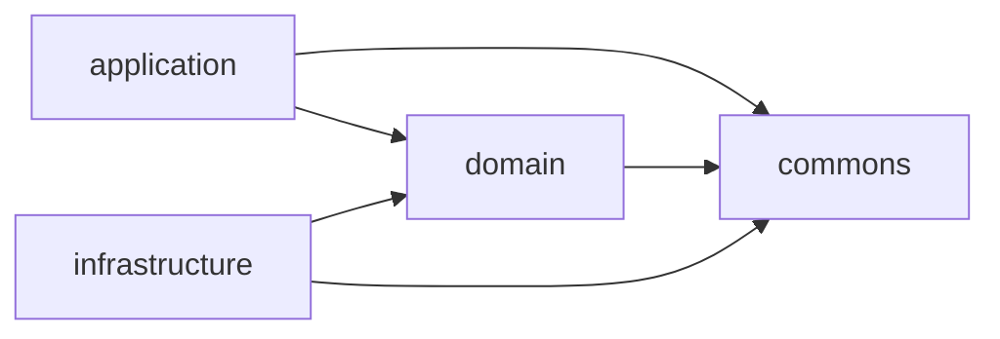

# 0013. Shared commons module for cross-cutting utility code

## Status
Proposed

## Context
[ADR-0002](0002-hexagonal-architecture.md) splits the server into three modules —
`domain`, `application`, `infrastructure` — and states plainly that **the domain
depends on nothing**. That rule is what makes the domain testable without a database,
HTTP server or network, and is enforced by `:architecture:test`.

Small, framework-free helpers that have nothing to do with business rules —
argument validation such as "this number must not be negative", for instance —
don't belong to any one module's responsibility. `RuntimeMetrics`
(`server/domain/.../metrics/RuntimeMetrics.java`) currently carries a private
`requireNotNegative` static method used by four of its nested records. As more
value types gain the same kind of guard, and as `application`/`infrastructure` need
the same style of check, the choice is between duplicating this kind of helper in
every module, bolting it onto `domain` as an implicit shared library, or naming a
place for it explicitly.

`domain`'s "depends on nothing" rule is about keeping transport, persistence and
framework concerns out of the core, not about forbidding *any* dependency
whatsoever — the ADR already carves out an exception for Micronaut DI annotations.
A module of pure, dependency-free utility code is the same kind of narrow exception:
it carries no transport, persistence or business-rule concerns of its own.

## Decision
Add a fourth module, **commons**, to the server's hexagonal architecture:

- **commons** — small, pure, framework-free utility code shared across the other
  modules (e.g. argument-validation helpers). No transport, persistence, DI,
  or business-rule content. Depends on nothing, same as `domain` did under
  ADR-0002.

`domain`, `application` and `infrastructure` may each depend on `commons`.
`commons` depends on nothing. This narrows `domain`'s original rule from
"depends on nothing" to "depends on nothing but commons":

Everything else decided in ADR-0002 — the driving/driven split between
`application` and `infrastructure`, the ban on a compile-time edge between them,
and the no-DTO-by-default rule — is unchanged and carries forward unmodified.

`commons` holds only code with no reasonable alternative home in `domain`,
`application` or `infrastructure` individually — a validation helper used by
value types in more than one module is the motivating case. It is not a general
dumping ground: business rules, entities and ports still belong in `domain`.

## Consequences

### Pros
- One place for small, dependency-free helpers (validation, and similar pure
  utility code) instead of duplicating them per module or growing `domain` into
  an implicit shared library.
- `commons` is trivially unit-testable in isolation, same as `domain` under
  ADR-0002 — no context, database or network.
- `domain`'s independence from transport and persistence concerns is preserved;
  only its dependency-free *count* changes, not its purity.

### Cons
- A fourth module adds build/wiring ceremony (another Gradle subproject,
  another entry in `:architecture:test`'s rules) for what may start as a single
  utility class.
- Risk of `commons` becoming a miscellaneous dumping ground over time if its
  scope (pure, dependency-free, no business rules) isn't enforced in review.
- `:architecture:test`'s ArchUnit rules need a new rule so `commons` cannot
  depend on `domain`, `application` or `infrastructure` — an omission would
  silently allow a cyclic or backwards dependency.
