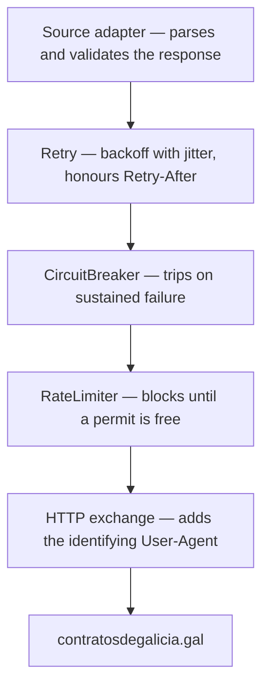

# 0014. Wrap outbound source calls in a retrying, self-throttling HTTP client

## Status
Proposed

## Context
conxugal's data comes from a single external site it does not control,
contratosdegalicia.gal. The outbound client that reaches it — built by a `@Factory` in
`infrastructure` and driven by the Órganos source adapter
([TASK-0003](../features/FEAT-0006-organos-catalogue-import/TASK-0003-source-port-and-adapter.md))
— sets a read timeout and nothing else. It sends one request, and any failure of that
request becomes a failed import.

Three gaps follow from that, and all three get worse rather than better as the product grows.

**Transient faults are indistinguishable from permanent ones.** A dropped connection, a
momentary 503 during the source's own maintenance window, or a read timeout under load all
surface as the same typed failure as a genuinely missing page. Once the import runs
unattended overnight
([TASK-0006](../features/FEAT-0006-organos-catalogue-import/TASK-0006-scheduled-import-trigger.md)),
a single packet loss at 04:00 means a day with no refreshed catalogue and nobody watching.
The cheapest correct answer — try again in a moment — is not available anywhere in the stack.

**Nothing paces us.** Today the Órganos import is one `GET` per run, so the site cannot
tell us apart from a browser. That is temporary. Órganos taxonomy work
([FEAT-0007](../features/FEAT-0007-organos-taxonomy-classification/README.md)) and the
contract ingestion this platform exists for both fan out to a request per Órgano or per
result page — hundreds to thousands of requests, issued as fast as the JVM can make them,
at whatever hour the scheduler fires. A public administration site with no published rate
limits does not respond to that with a `429`; it responds with an IP block, and we would
find out days later when the catalogue silently stopped refreshing. Politeness has to be
built before the fan-out lands, not retrofitted after we are blocked.

**We are anonymous.** The client sends the framework's default `User-Agent`. An operator
looking at their access log sees unattributed automated traffic with no way to contact
whoever is generating it. Their only available response is to block it.

None of this is specific to the Órganos adapter. Every driven adapter that speaks HTTP to
an external source — the ones that exist and the ones FEAT-0007 and contract ingestion will
add — needs the same answer, and it should not be a decision each one re-makes. That makes
it a cross-cutting pattern on the driven side of
[ADR-0002](0002-hexagonal-architecture.md)'s hexagon, and a decision to record once.

Two existing decisions shape the available options.
[ADR-0011](0011-blocking-io-virtual-threads.md) already runs all I/O blocking on virtual
threads, explicitly naming outbound scraping as a motivating case: a thread that *waits*
unmounts and costs almost nothing, so blocking until a request is allowed to proceed is the
natural mechanism here rather than reactive backpressure. And the ingestion jobs run
in-process alongside the API in one JVM, so a process-local budget is a correct
implementation of "our total outbound rate", not an approximation of one.

This must not be confused with [ADR-0012](0012-rate-limit-http-contract.md), which points
the other way: that decision governs the rate limit **conxugal advertises to its own
callers** on `/api/**`, in `RateLimit-*` headers and a `429` response. This ADR governs how
conxugal behaves **as a client of somebody else's server**. They share vocabulary and
nothing else.

Finally, a constraint on *how* the chosen library is used.
[Resilience4j](https://resilience4j.readme.io/) publishes a Micronaut integration
(`resilience4j-micronaut`) offering `@Retry`, `@RateLimiter` and `@CircuitBreaker`
annotations with AOP interceptors and a `resilience4j:` YAML namespace. Its current release,
2.3.0, declares `io.micronaut.platform:micronaut-platform:4.1.6` and depends on Micronaut 4
internals including `micronaut-retry` and `micronaut-discovery-core`. This project runs
Micronaut **5.0.2** — a major version ahead, across a line that changed annotation
processing and AOP internals. Adopting the annotation module would drag a stale platform
BOM into the dependency graph in exchange for interceptors that are not validated against
the framework version we run.

## Decision
Route every outbound call to an external source through a **resilience decorator in
`infrastructure` that wraps the Micronaut `BlockingHttpClient`**, built on **Resilience4j
2.3.0 used as a plain library**.

**Resilience4j is consumed programmatically, not through its Micronaut starter.** The
`resilience4j-bom` is imported so individual module entries in the version catalogue stay
version-free, matching how the Micronaut platform BOM is already used; only
`resilience4j-retry`, `resilience4j-ratelimiter` and `resilience4j-circuitbreaker` are
declared. The `resilience4j-micronaut` annotation module is **not** adopted, for the version
reason above. Policies are composed in code with `Decorators` and configured from this
project's own `@ConfigurationProperties` records — not the library's `resilience4j:` YAML
namespace — so there remains exactly one place to look for a knob.

**The three policies nest in a fixed order: retry outermost, rate limiter innermost.**

The order is load-bearing, not incidental:

- The **rate limiter is innermost** so that *every* attempt that reaches the network
  consumes a permit, retried attempts included. Any other position lets a retry storm
  outrun the pacing at exactly the moment the source is least able to absorb it — the
  failure mode this decision exists to prevent.
- The **circuit breaker sits between them** so that an open circuit rejects a call *before*
  it consumes rate budget, and so the breaker's window records real network attempts rather
  than retry bookkeeping.
- **Retry is outermost**, which is also Resilience4j's own aspect ordering, so a retried
  attempt re-enters the breaker and re-acquires a permit rather than bypassing either.

**The decorator sits below parsing, above transport.** Source adapters keep the contract
they have today: they parse and validate the response, and the domain-level failure
(`OrganoSourceUnavailableException` and its future siblings) remains the only exception
type that escapes them. This placement also settles what is retryable for free — an adapter's
content judgements, such as the Órganos adapter rejecting an implausibly small list, happen
*above* the decorator and are never retried, because a source that answers successfully with
the wrong content is not having a transient fault.

**Retryability is declared by the adapter, not inferred from the HTTP method.**
contratosdegalicia exposes its contract searches over `POST` with the query in the request
body; those are pure retrieval and safe to repeat, and a method-based rule would exclude
precisely the fan-out that motivates this decision. So: `GET` and `HEAD` are retryable by
default, and any other method is retried **only** when the adapter issuing it explicitly
declares the request idempotent. A non-safe request carrying no such declaration is never
retried, so the policy can never silently double-submit a future state-changing call.

**Retryable failures are named explicitly**: connection failures, resets and read timeouts,
plus HTTP `408`, `425`, `429`, `500`, `502`, `503` and `504`. Every other response —
`400`, `401`, `403`, `404`, `410` — is permanent and fails on the first attempt. Retrying a
`404` only wastes the source's capacity to keep answering `404`.

**The source's own instruction beats our backoff curve.** When a `429` or `503` carries
`Retry-After`, that value determines the wait, via Resilience4j's `intervalBiFunction`
reading the header off the failed response. Absent the header, the wait is exponential
backoff **with jitter** — jitter is mandatory, not a refinement, because an unjittered
curve re-synchronises a fanned-out batch into a second simultaneous burst.

**Every request carries an identifying `User-Agent`** naming the project and a contact URL,
set once in the decorator so no adapter can forget it. An operator who can see who we are
and reach us has the option of asking us to slow down; an operator who cannot has only the
option of blocking us.

**Saturation blocks, with a bound.** Waiting for a permit is the normal, expected path and
the calling virtual thread simply waits. The wait is capped by a configured maximum; if a
call cannot obtain a permit within it, the run fails loudly rather than hanging, and that is
a signal that the configured rate no longer matches the work being asked of it.

**All of it is configurable per source**: requests per period, the period, the maximum wait
for a permit, retry attempts, initial backoff and multiplier, and the breaker's thresholds
and open-state duration. Defaults are deliberately conservative and belong to the
implementing task, not to this record — the site publishes no limits, so the first values
are estimates that will be tuned against observed behaviour without a code change.

**Deliberately out of scope**, to be decided if and when they are needed: rate limiting
shared across processes (irrelevant while ingestion runs in one JVM, and a new decision the
day it does not), robots.txt fetching and interpretation, and exporting Resilience4j's
metrics — `resilience4j-micrometer` is the obvious later feed for
[ADR-0009](0009-sse-admin-realtime-metrics.md)'s admin metrics, but wiring it is not decided
here.

## Consequences

### Pros
- Transient faults stop costing whole overnight runs. The most common real failure — a
  momentary network or 5xx blip — is absorbed silently instead of producing a stale
  catalogue and a morning investigation.
- The pacing cannot be outrun by retries. Because the limiter is innermost, the ordering
  makes that a structural property of the composition rather than something each adapter
  has to be careful about.
- Being identified and self-throttling makes us a client an operator can *manage* rather
  than one they can only block — which is the actual mitigation for the blacklisting risk,
  more than any particular rate value.
- Honouring `Retry-After` means that when the source does tell us what it wants, we obey it
  instead of guessing, which is both more effective and more defensible than our own curve.
- One policy every future source adapter inherits. FEAT-0007 and contract ingestion get
  resilience and politeness by construction, with no per-adapter decision and no chance of
  a new adapter quietly shipping without them.
- Declaring retryability at the adapter rather than by method keeps `POST`-based searches
  retryable without opening the door to double-submitting a state-changing request.
- Every value is configuration, so tuning against the source's observed tolerance is a
  deployment change rather than a release.

### Cons
- A **third-party dependency outside the Micronaut platform BOM** — a version to track and
  upgrade in `libs.versions.toml`, where almost everything else is resolved for us.
- We are using Resilience4j **in a way its own Micronaut documentation does not describe**,
  because that documentation targets a framework version we are past. The programmatic API
  is the library's stable core so the risk is low, but we forgo the annotation ergonomics
  and inherit no upstream guidance for this combination.
- **The circuit breaker is close to inert today.** One request per daily run will never
  reach a meaningful `minimumNumberOfCalls`, and its open-state duration is meaningless
  across runs that are a day apart. It is configured now so the policy does not have to be
  reopened when fan-out arrives — but until then it is machinery that earns nothing.
- Retry being outermost means one logical failure records **several** failures in the
  breaker's window. That is the right accounting for an outbound client, where each attempt
  really was a failed call, but the thresholds only make sense when read with that in mind.
- Blocking on a permit **occupies a virtual thread** — cheap under
  [ADR-0011](0011-blocking-io-virtual-threads.md), but not free, and a maximum wait set too
  generously converts a fast, visible failure into a slow, silent one.
- Another layer between adapter and transport is **another thing to reason about** when
  diagnosing a failed import, and it invalidates the existing unit tests that stub
  `HttpClient.toBlocking()` directly.
- The initial rate, backoff and breaker settings are **educated guesses**. The source
  documents no limits, so the only way to learn the right values is to run against it and
  watch — which means the first configuration is provisional by construction.
- Retryability being an adapter-declared property rather than a mechanical rule puts a
  correctness burden on each adapter author: a `POST` wrongly declared idempotent would be
  retried, and nothing but review catches that.
