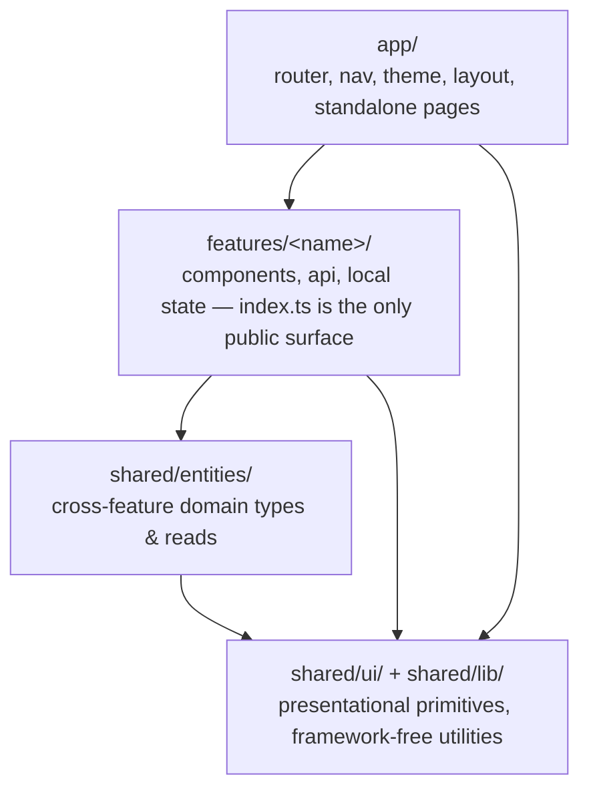

# 0015. Frontend modularization: feature-based slices with a shared core

## Status
Accepted

## Context
[ADR-0004](0004-ui-stack-vite-mantine.md) settled the UI's build tool, router and
component library but left `ui/src`'s internal folder structure unstated. Today
`ui/src` is small — one real feature (`routes/admin/`, the FEAT-0004
user-administration screens: `AdminRoute`, `DashboardPage`, `UsersPage`,
`UsersTable`, `CreateUserModal`, `ErrorAlert`), a couple of standalone pages
(`HomePage`, `AboutPage`, `NotFoundPage`), and two **type-based** folders —
`api/` (`currentUser.ts`, `users.ts`, `systemStatus.ts`, `httpClient.ts`,
`queryClient.ts`) and
`commons/` (`avatar.ts`, `date.ts`, `httpError.ts`) — plus top-level
composition files (`router.tsx`, `nav.ts`, `theme.ts`, `strings.ts`,
`layout/AppLayout.tsx`).

That works at the current size, but the project overview commits this app to
extracting, storing, analysing and exporting public-contract data — search,
analysis and export screens are coming, each with their own API calls, forms and
state. Grouping by technical layer (`api/`, `commons/`) means every new feature
smears its files across those two folders, nothing stops one feature's code from
reaching into another's internals, and deleting or relocating a feature later
means archaeology across the whole tree. The backend already answered the
equivalent question for itself: [ADR-0002](0002-hexagonal-architecture.md) groups
by bounded module with an enforced, one-directional dependency rule, and
[ADR-0013](0013-shared-commons-module.md) named an explicit shared layer rather
than letting cross-cutting helpers leak into a domain module. The frontend has no
such rule yet, and the cost of introducing one only grows as more features land.

Forces at play:

- **More features are coming, not fewer.** Contract search, analysis and export
  are all implied by the project's stated purpose; `routes/admin/` will not stay
  the only feature.
- **`api/` and `commons/` are already type-based folders in disguise.** `users.ts`
  belongs to the admin feature specifically; `httpClient.ts` and `queryClient.ts`
  are genuinely cross-feature infrastructure. Nothing currently distinguishes
  the two.
- **No enforcement exists.** TypeScript/ESLint do not stop a future feature from
  importing another feature's internals; only convention would.
- **The team already accepts this kind of boundary rule.** [ADR-0002](0002-hexagonal-architecture.md)
  and [ADR-0013](0013-shared-commons-module.md) apply the same discipline — bounded
  modules, one-directional dependencies, a narrow shared layer, mechanically
  checked — to the backend. Mirroring it in the frontend keeps the two halves of
  the codebase legible in the same way.

## Decision
Restructure `ui/src` into **feature slices with a shared core**, matching the
layering used elsewhere in this codebase:

```
app → features → shared/entities → shared/ui + shared/lib
```

Dependencies point only downward. A feature never imports from another feature;
cross-feature code moves down into `shared/` or up into `app/` instead. The four
layers:

- **`app/`** — the composition root: router (`router.tsx`), navigation config
  (`nav.ts`), theming (`theme.ts`), the app shell (`layout/AppLayout.tsx`), and
  route-level pages that carry no feature-specific state or API calls of their
  own (`HomePage`, `AboutPage`, `NotFoundPage`). May import from every layer
  below it.
- **`features/<feature-name>/`** — one folder per buildable feature (e.g.
  `features/administration/` for today's `routes/admin/`). Each slice owns
  its components, API calls and local state, and exposes a single `index.ts`
  barrel as its public surface; everything else in the folder is private to the
  slice. May import from `shared/` and from its own internals only.
- **`shared/entities/`** — cross-feature domain data shapes and the reads that
  produce them (e.g. `currentUser`, used by both `app/layout` and any feature
  that needs the signed-in user). Starts thin; a type only moves here once a
  second feature needs it — until then it stays local to the one feature using
  it.
- **`shared/ui/`** and **`shared/lib/`** — the base of the stack, depending on
  nothing above it. `shared/ui/` holds business-agnostic presentational
  components (`ErrorAlert`, avatar rendering); `shared/lib/` holds
  framework-free utilities and infrastructure (`httpClient`, `queryClient`,
  `date`, `httpError`, `strings`).



Illustrative target layout (folder/file tree; not a migration mandate — moving
existing files into it is follow-up task work). One placement has since moved:
`AdminRoute.tsx` now lives in `app/`, because the router imports it statically
and a static import of a feature barrel pulls that whole slice into the eager
chunk, defeating route-level code splitting. The layering rule is unchanged —
the guard reads only `shared/entities/currentUser` and takes its fallback as a
prop, so it remains a composition-root concern.

```
ui/src/
  app/
    router.tsx
    nav.ts
    theme.ts
    layout/
      AppLayout.tsx
    pages/
      HomePage.tsx
      AboutPage.tsx
      NotFoundPage.tsx
  features/
    administration/
      index.ts
      AdminRoute.tsx
      DashboardPage.tsx
      UsersPage.tsx
      UsersTable.tsx
      CreateUserModal.tsx
      users.ts
      systemStatus.ts
  shared/
    entities/
      currentUser.ts
    ui/
      ErrorAlert.tsx
      avatar.ts
    lib/
      httpClient.ts
      queryClient.ts
      date.ts
      httpError.ts
      strings.ts
```

**Enforcement:** wire [`eslint-plugin-boundaries`](https://github.com/javierbrea/eslint-plugin-boundaries)
into the existing flat `eslint.config.js`, tagging `app`, `features/*`,
`shared/entities`, `shared/ui` and `shared/lib` as element types and whitelisting
only the downward edges above. This runs through the `lint` script already wired
into CI — no new toolchain, no new CI step. `dependency-cruiser` is not adopted:
it would duplicate what ESLint already enforces in this repo, and the heavier
package/monorepo split (ADR-0002's closest frontend analogue) is deliberately
deferred until multiple teams or build times justify it, per the same threshold
this codebase already applies on the backend.

Migrating existing files into this layout, and adding the ESLint boundary rules,
are follow-up task work traced to whichever feature or maintenance task picks
this up — this ADR fixes the target shape and the rule, not the migration steps.

## Consequences

### Pros
- New features (search, analysis, export) get an obvious, bounded home instead
  of smearing across `api/`/`commons/`; deleting or relocating a feature stays
  local to its folder.
- The dependency direction is mechanically checked via ESLint, the same
  enforcement mechanism the project already runs in CI — no silent drift back
  into cross-feature or upward imports.
- `shared/` splits into three narrow layers (`entities`, `ui`, `lib`) instead of
  one catch-all, which keeps it defensible against becoming a junk drawer per
  [ADR-0013](0013-shared-commons-module.md)'s equivalent warning for the backend.
- Mirrors the layering discipline already applied to the server
  ([ADR-0002](0002-hexagonal-architecture.md), [ADR-0013](0013-shared-commons-module.md)),
  so the codebase reads consistently across its two halves.

### Cons
- More upfront convention than the current flat structure; each new file needs a
  layer decision (does this belong to one feature, or does it move to
  `shared/`?), and that judgment call is manual even with lint rules in place.
- `eslint-plugin-boundaries` is a new dependency and a new block of ESLint
  config to maintain, and its element-type tags need updating every time a
  feature folder is added or renamed.
- Migrating the current tree into this shape touches nearly every existing file
  path (28 of the 33 files under `ui/src` move, counting co-located tests; only
  `main.tsx`, `vite-env.d.ts`, `App.test.tsx` and `test/` stay put), which is
  churn for a codebase this small — accepted
  now because the cost only grows as more features land, not because today's
  size demands it on its own.
- `shared/entities/` starts with a single, thin file (`currentUser.ts`); until a
  second feature needs shared domain data, the layer's payoff is speculative.
