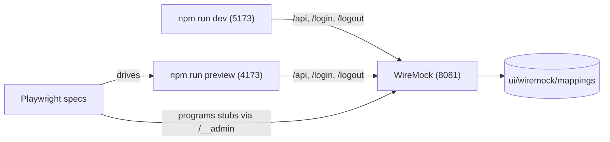

# 0017. Frontend acceptance tests: the SPA driven against a stubbed API

## Status
Accepted

## Context
[ADR-0007](0007-acceptance-testing-module.md) established `server/acceptance` as the home
for black-box tests: REST-assured for `/api/**`, Playwright-for-Java for the served UI,
against an externally started instance backed by a real PostgreSQL. That suite proves the
*whole system* works, and it should keep doing so.

It is, however, an expensive place to cover **UI journeys**. A scenario in the FEAT-0004
administration area needs a running Micronaut instance, a migrated database, and a seeded
`ADMIN` whose password the test knows. Worse, several states the UI is *designed* to
render can't be produced from the outside at all: an account whose `lastLoginAt` is still
null, a datastore reported unreachable, a refusal to disable the last enabled
administrator. Reaching those means seeding fixtures through the very code under test, or
not covering them.

Meanwhile the SPA has no local API at all. `ui/vite.config.ts` declares no proxy, and the
app calls same-origin relative paths (`/api/me`, `/api/admin/*`, `POST /logout`) because in
production one Micronaut instance serves both the built assets and the API
([ADR-0003](0003-react-router-ui-served-by-backend.md),
[ADR-0006](0006-reserved-api-url-prefix.md)). So `npm run dev` cannot render the
administration area at all — every request 404s against Vite's own dev server — and a
frontend developer must build and run the entire backend to look at a page they are
editing.

Both problems have the same shape: the SPA is a separately buildable artifact
([ADR-0004](0004-ui-stack-vite-mantine.md)) whose only coupling to the server is an HTTP
contract that is already written down and linted
([ADR-0010](0010-design-first-openapi-contract.md), `docs/api/openapi.yaml`). Anything that
speaks that contract can stand in for the backend.

## Decision
Introduce **WireMock as the frontend's local stand-in for the API**, declared in
`ui/docker-compose.yml`, and build a frontend acceptance suite on top of it.

- **One stub server, three consumers.** The WireMock service lives in `ui/docker-compose.yml`
  — the *default* compose file, started with a plain `docker compose up -d` from `ui/` — and
  is consumed identically by `npm run dev`, `npm run preview`, and the acceptance suite. It
  is a development dependency first and a test dependency second; it is deliberately **not**
  an e2e-only artifact.
- **Vite proxies to it.** `server.proxy` and `preview.proxy` route `/api`, `/login` and
  `/logout` to `UI_API_TARGET` (default `http://localhost:8081`), preserving the
  same-origin assumption the app is written against. Pointing at a real backend instead
  stays a one-liner: `UI_API_TARGET=http://localhost:8080 npm run dev`.
- **Default state is versioned on disk.** `ui/wiremock/mappings/*.json` holds the canonical
  fixture — an `ADMIN` session, a healthy system status, and a user list that deliberately
  includes a disabled account and one that has never logged in. Payloads are derived from
  the examples in `docs/api/openapi.yaml` so the stubs and the contract drift together, not
  apart.
- **Scenarios program stubs through `/__admin`.** A test needing a specific response
  (a `USER` session, a 409 from the last-admin rule) posts a mapping before driving the UI
  and resets to the on-disk defaults afterwards, so every scenario is reproducible in
  isolation.
- **The suite is Node `@playwright/test`**, living in `ui/e2e`, driving the **production
  build** through `vite preview`. It is black box: it interacts only through the rendered
  page — accessible roles, labels and Galician copy from `ui/src/shared/lib/strings.ts` —
  and never reaches into stores, component internals or the query cache. Where a request is
  part of the contract, it is verified via WireMock's `/__admin/requests`.
- **This complements ADR-0007, it does not supersede it.** The two suites answer different
  questions and both are kept:

  | | `server/acceptance` (ADR-0007) | `ui/e2e` (this ADR) |
  | --- | --- | --- |
  | Under test | packaged app + real PostgreSQL | built SPA alone |
  | API | real | WireMock |
  | Answers | "does the system work?" | "does the UI journey work?" |
  | Cost | docker image build, DB, seeded users | `docker compose up` |

- **Its own CI workflow.** `.github/workflows/ui-acceptance.yml` runs the suite on pull
  requests and pushes to `trunk` that touch the SPA's sources, the suite and its stubs, or
  the UI's dependencies — a narrower trigger than `ui-ci.yml`'s `ui/**`, since this job
  boots a container and a browser. `ui-ci.yml` keeps its lint/test/build responsibility.

## Consequences

### Pros
- The administration area becomes developable and demoable with **no backend and no
  database** — the gap that made `npm run dev` useless for these pages closes as a side
  effect of the test harness, for the same fixtures.
- API states that are awkward or impossible to stage against a real server — a null
  `lastLoginAt`, an unreachable datastore, the last-admin refusal — become one JSON mapping.
- Journeys run in seconds against a static build, so UI regressions (a broken modal flow, a
  row that stops reflecting its new state) are caught without the whole-stack tax.
- The fixture set is shared, so a stub that drifts from reality gets noticed during ordinary
  development, not only in a test run.
- ADR-0007's suite is left intact and unambiguous: it keeps the whole-system proof,
  including the parts this suite structurally cannot see.

### Cons
- **A second Playwright toolchain**, in a second language binding — Node `@playwright/test`
  here, Playwright-for-Java in `server/acceptance`. Two sets of conventions, two browser
  downloads, and a reader has to know which suite owns a given scenario.
- **Stubs can lie.** Nothing mechanically checks `ui/wiremock/mappings` against
  `docs/api/openapi.yaml`; a contract change that the server honours can leave these tests
  green against a shape the API no longer returns. Mitigated but not solved by deriving the
  fixtures from the OpenAPI examples and by ADR-0007's suite exercising the real contract.
- These tests prove **nothing about the server** — not authorization, not the `@Secured`
  rules, not persistence. The admin-nav gating scenario asserts only the cosmetic
  client-side gate; the real gate remains the server's, covered elsewhere
  ([SPEC-0003](../specs/SPEC-0003-administration-area.md) R1).
- One more process to run locally, and a `docker compose up` that a developer can forget —
  the failure mode (proxy connection refused) is not obviously distinguishable from the
  no-proxy 404s it replaces.
- Vite's config now carries a proxy that is inert in production builds but still has to be
  understood and maintained.
