# 0022. A 1-based paged-collection contract, mapped from Micronaut Data at the application layer

## Status
Accepted

## Context

Nothing in this system is paged. `docs/api/openapi.yaml` declares no query parameter at all —
its only `components.parameters` are `UserId`, `TermoId` and `OrganoId`, every one of them
`in: path` — and no server code references `Pageable`, `Page` or `Slice`. Every collection read
shipped so far returns a whole table, which
[FEAT-0007](../features/FEAT-0007-organos-taxonomia-classification/README.md) took as a
deliberate decision *for the catalogue and the taxonomy at their size*, explicitly declining to
bind anything larger.

Three specs now need paging, and they need the **same** paging:

- [SPEC-0005](../specs/SPEC-0005-import-browse-contratos-menores.md) **R17** defines the control
  — first, previous, next, last, jump to a page, the entry count and the page total — and states
  in as many words that it is not a rule about contratos menores but *"the control **every**
  paginated list in this system takes"*;
- [SPEC-0006](../specs/SPEC-0006-operadores-economicos.md) R11 and
  [SPEC-0007](../specs/SPEC-0007-monitor-import-runs.md) both **cite R17 rather than defining
  their own**.

So the wire shape is settled once or three times. R17 says why that matters: *"A reader meets
several of these lists in one session, and one of them paging differently from the rest is a
defect they would experience as inconsistency rather than as a design."* The same holds for the
features building them — three teams reading three sibling design sections is how three
envelopes get born.

That makes the query-parameter spelling, the response envelope, the base of the page number, and
the default and maximum page size a **cross-cutting public-contract pattern** — the bar
[ADR-0012](0012-rate-limit-http-contract.md) cleared for rate-limit headers and
[ADR-0020](0020-actions-as-verbs-in-rest-paths.md) for path naming, both with a narrower blast
radius than this. Under [ADR-0010](0010-design-first-openapi-contract.md) the contract is
authoritative and CI-enforced, and [ADR-0021](0021-openapi-contract-testing-with-schemathesis.md)
validates live responses against it, so whatever is chosen is enforced on every operation from
the first one.

**What is not in question here.** SPEC-0005's *Decisions taken* already settles that reads are
paged **by position**, and that the cost is **measured before it is optimised** — it fixes the
conditions under which latency is measured and deliberately fixes no budget. This ADR decides
the *contract*, not the mechanism, and it must not be read as adopting a performance target.

**The obvious economy is to publish Micronaut Data's `Page<T>` directly**, since the repository
layer produces one anyway. Measured against micronaut-data 5.0.4 on this project's resolved
classpath, that would publish exactly `content` / `pageable` / `totalSize`, with a **0-based**
`pageable.number`, **no `totalPages`**, an always-empty `pageable.sort` (see the ordering
invariant below), a `mode` field nothing here uses, and a shape produced by a class annotated
`@Internal` whose own javadoc calls it *"a workaround for micronaut-serialization issue 307"*.

Every one of those is a cost paid by three specs' clients so that one server-side mapper need not
be written. The two numbers R17 requires a reader to be given — the entry count and the page
span — would be one field and one client-side division, and the number every UI displays would be
one greater than the number the API takes.

## Decision

**Publish a paged-collection contract of our own, 1-based, and map to it from Micronaut Data's
`Page` in the application layer.** The framework computes the page; it does not define the wire.

```mermaid
flowchart LR
    req["GET …?page=3&amp;size=50&amp;sort=publicationDate,desc"]
    ctl["controller — the only converter<br/>in: validate → Pageable (0-based, unsorted)<br/>out: Page&lt;T&gt; → envelope (1-based, both totals)"]
    uc["use case<br/>(maps sort to a fixed ordering)"]
    repo["repository → Page&lt;T&gt;"]
    res["&#123; items, page, size, totalItems, totalPages &#125;"]
    req --> ctl --> uc --> repo --> ctl --> res
```



**Request** — explicit query parameters, declared and validated by the operation itself. No
`Pageable` argument is bound from the request:

| Parameter | Required | Default | Rule |
| --- | --- | --- | --- |
| `page` | no | `1` | **1-based**; `< 1` is a **400** |
| `size` | no | `50` | `1`–`100`; outside that is a **400** |
| `sort` | no | per operation | `property,direction`; anything outside the operation's closed set is a **400** |

**Response** — one envelope, the same for every paged operation:

```json
{ "items": [ … ], "page": 3, "size": 50, "totalItems": 1832, "totalPages": 37 }
```

- **`page` is 1-based**, so the number the API takes, the number a shared URL carries and the
  number a control displays are one number. The conversion to Micronaut's 0-based `Pageable`
  happens **once, in the application layer**, which is the layer whose job is translating between
  the outside world and the domain.
- **Both totals are on the wire.** `totalPages` is what R17's control renders; `totalItems` is
  what R16 requires a list to state about its selection — *how many contracts this Órgano awarded
  in this year* is an answer a reader wants, not an intermediate value. `Page.getTotalPages()`
  already computes the first from the second, so surfacing it invents no arithmetic; it moves a
  division off three clients.
- **`items`, not `content`.** The envelope names what the domain has, not what the framework calls
  its field.

**Micronaut Data still does the work beneath the contract.** Repository methods take a `Pageable`
and return a `Page<T>`, which is what supplies `LIMIT`, `OFFSET` and — for derived finders — the
count query. `Pageable` and `Page` on a domain port are the leak
[ADR-0008](0008-domain-entities-carry-persistence-mapping-annotations.md) already accepted;
`server/domain/build.gradle.kts` declares `api(libs.micronaut.data.model)` today.

**`micronaut-data-model` lives in two modules — `domain` and `application` — and both declare it.**
The domain needs `Pageable` and `Page` on its ports; the application needs them because the
controller is what builds the one and reads the other. `server/application/build.gradle.kts`
declares **no** Micronaut Data dependency today and resolves these types only through the domain's
`api(...)`, which is a dependency arriving by accident of a neighbour's graph rather than by
statement. A module that names a type in its own signatures declares the library it comes from.

**`micronaut-data-runtime` stays out of `application`.** It holds
`PageableRequestArgumentBinder`, and nothing binds a `Pageable` from a request, so the module that
would have dragged a persistence library's *HTTP* layer behind a driving adapter is not needed.
The distinction is the point: the application layer knows the persistence library's **model**,
because it converts to and from it, and knows nothing of its runtime.

**The controller is the only place the two vocabularies meet.** Inbound it validates the contract's
parameters and builds a 0-based, unsorted `Pageable`; outbound it maps a `Page<T>` onto the
envelope, adding one to the page number and taking `getTotalPages()` for the span. Nothing above
the controller sees a `Pageable`, and nothing below it sees the envelope, so the conversion has
exactly one home and an off-by-one has exactly one place to be.

**`Sort` is never constructed from raw input, and never reaches a repository.** Each operation
declares a **closed set** of orderings, maps a validated `sort` value onto one of them, and calls
the repository with an unsorted `Pageable`.

This is a **security invariant**, not a tidiness rule. Micronaut Data validates property names not
at all and silently degrades an unrecognised direction to ascending. For a derived query an
unknown property throws and surfaces as a 500; for a **native** `@Query` the property name is
interpolated into `ORDER BY` **verbatim and unescaped** — `?sort=1 DESC; DROP TABLE …; --` appears
in the emitted SQL. Not binding `Pageable` from the request removes the mechanism by which
unvalidated input could reach a query at all, and this rule keeps it removed when someone later
adds a "dynamic" ordering.

Passing an unsorted `Pageable` also avoids a correctness bug: the framework appends `ORDER BY`
from a sorted `Pageable` to a `@Query` that already has one, emitting two.

**A `@Query` returning `Page<T>` must declare `countQuery`.** Annotation processing fails
otherwise — *"Query returns a Page and does not specify a 'countQuery' member"*. Derived finders
get their count generated; explicit queries never do. Any operation whose ordering cannot be
expressed by method name — which is any ordering needing `NULLS LAST` or a tiebreaker — writes and
maintains its own count query.

**The envelope is a shared, generic response type** declared once in the application layer and
referenced from `openapi.yaml` as a reusable schema, so the three specs' operations cannot each
describe a slightly different one.

## Consequences

### Pros

- **One shape three specs cannot drift from**, and it is a shape we control — the failure R17
  names is a reader meeting several lists in one session and finding one of them different.
- **The number is the same everywhere.** 1-based on the wire, in the URL and in the control, so no
  layer has to remember which side of the boundary it is on. Off-by-one bugs in paging are
  invisible until someone reaches the last page.
- **The client computes nothing.** Both numbers R17 requires are served, so no division is
  duplicated across three clients — or done differently by one of them.
- **The public contract carries no framework vocabulary and no framework risk.** Nothing publishes
  `pageable`, `mode`, an always-empty `sort`, or the output of an `@Internal` serialiser that a
  patch release could change.
- **The application module needs no persistence *runtime*.** Because no `Pageable` is bound from
  the request, `micronaut-data-runtime`'s argument binder is not required, and the coupling that
  would have put a persistence library's **HTTP** module behind a driving adapter does not arise.
  What it does take — `micronaut-data-model` — it declares, rather than inheriting it from the
  domain's `api(...)` by accident.
- **The conversion has one home.** Both directions live in the controller, so no other layer has to
  know which base it is holding, and the seam is somewhere a test can stand rather than spread
  across a call chain.
- **Bad input is refused, not corrected.** `page=0` and `size=5000` are 400s that say so, rather
  than being silently answered with something else — which is what the framework binder would do.
- **The security invariant is stated once**, where every feature that pages must read it, and the
  contract's shape makes it structural rather than remembered.

### Cons

- **An envelope, a mapper and a validation rule per paged operation are ours to write and test.**
  This is the cost the framework's own shape would have avoided, and it is paid once per operation
  rather than once in total.
- **Two representations of a page exist inside the server** — the framework's 0-based `Pageable` /
  `Page` beneath the contract, and the 1-based envelope on it. The conversion is one line in each
  direction and lives in one class, but it is a seam, and a seam is somewhere a mistake can hide.
- **The application layer now knows a persistence library's types**, which widens what
  [ADR-0008](0008-domain-entities-carry-persistence-mapping-annotations.md) accepted: that ADR put
  Micronaut Data annotations on domain entities, not Micronaut Data types in a driving adapter's
  signatures. The widening is deliberate and bounded to `Pageable` and `Page` — the alternative is
  a third paging type, owned by us, existing only to carry two integers across one module
  boundary — but it is a widening, and a later ADR that wants the application layer framework-free
  will have to unpick it.
- **`totalItems` and `totalPages` can disagree if a mapper is written twice.** They are derived
  from one `Page`, so the shared mapper is what keeps them consistent; an operation that builds the
  envelope by hand could produce a pair that does not.
- **Every paged read pays for a count.** `Page<T>` runs a count query alongside the page, and
  `totalItems` makes that visible in the contract rather than optional. SPEC-0005 R24 measures it;
  no budget is set here.
- **Explicit `@Query` orderings pay for their own counts**, and each count must stay in step with
  its `WHERE` clause — a real per-operation cost falling on exactly the operations complex enough
  to need explicit SQL.
- **The maximum page size is a refusal, not a clamp**, so a caller that asks for too much gets an
  error rather than a smaller answer. That is the honest behaviour, and it is a behaviour a naïve
  client will meet.
