# 0022. Page collections with Micronaut Data's `Pageable` and `Page`

## Status
Proposed

## Context

Nothing in this system is paged. `docs/api/openapi.yaml` declares no query parameter at all —
its only `components.parameters` are `UserId`, `TermoId` and `OrganoId`, every one of them
`in: path` — and no server code references `Pageable`, `Page` or `Slice`. Every collection read
shipped so far returns a whole table, which
[FEAT-0007](../features/FEAT-0007-organos-taxonomia-classification/README.md) took as a
deliberate decision *for the catalogue and the taxonomy at their size*, explicitly declining to
bind anything larger.

Three specs now need paging, and they need the **same** paging:

- [SPEC-0005](../specs/SPEC-0005-import-browse-contratos-menores.md) **R17** defines the control
  — first, previous, next, last, jump to a page, the entry count and the page total — and states
  in as many words that it is not a rule about contratos menores but *"the control **every**
  paginated list in this system takes"*;
- [SPEC-0006](../specs/SPEC-0006-operadores-economicos.md) R11 and
  [SPEC-0007](../specs/SPEC-0007-monitor-import-runs.md) both **cite R17 rather than defining
  their own**.

So the wire shape is settled once or three times. R17 says why that matters: *"A reader meets
several of these lists in one session, and one of them paging differently from the rest is a
defect they would experience as inconsistency rather than as a design."* The same holds for the
features building them — three teams reading three sibling design sections is how three
envelopes get born.

That makes the query-parameter spelling, the response envelope, 0- versus 1-based page numbers,
and the default and maximum page size a **cross-cutting public-contract pattern** — the bar
[ADR-0012](0012-rate-limit-http-contract.md) cleared for rate-limit headers and
[ADR-0020](0020-actions-as-verbs-in-rest-paths.md) for path naming, both with a narrower blast
radius than this. Under [ADR-0010](0010-design-first-openapi-contract.md) the contract is
authoritative and CI-enforced, and [ADR-0021](0021-openapi-contract-testing-with-schemathesis.md)
validates live responses against it, so whatever is chosen is enforced on every operation from
the first one.

**What is not in question here.** SPEC-0005's *Decisions taken* already settles that reads are
paged **by position**, and that the cost is **measured before it is optimised** — it fixes the
conditions under which latency is measured and deliberately fixes no budget. This ADR decides
the *contract*, not the mechanism, and it must not be read as adopting a performance target.

The alternative to a framework type is an envelope of our own — `{items, total, page, size,
pages}`, 1-based, which is what
[FEAT-0011](../features/FEAT-0011-contratos-menores-browsing/README.md) proposed in draft. It
reads better than what Micronaut Data emits. It also has to be written, serialised, documented
and kept identical across three features, and its page arithmetic reimplements what the
framework already computes.

## Decision

**Page collections with Micronaut Data's own types**: controllers take a `Pageable` argument and
return a `Page<T>`. The parameter names, the binding rules and the response shape are the
framework's, not ours.

```mermaid
flowchart LR
    req["GET …?page=2&amp;size=50&amp;sort=publicationDate,desc"]
    binder["PageableRequestArgumentBinder"]
    uc["use case<br/>(maps + validates sort,<br/>then withoutSort)"]
    repo["repository → Page&lt;T&gt;"]
    res["&#123; content, pageable, totalSize &#125;"]
    req --> binder --> uc --> repo --> res
```



**Request.** `page` (0-based), `size` and `sort` (`property,direction`, repeatable), bound by
`PageableRequestArgumentBinder`. Configured under `micronaut.data.pageable`:
**`default-page-size: 50`** and **`max-page-size: 100`** — the framework's own maximum, kept
rather than raised. `default-page-size` has no independent default and falls back to
`max-page-size`, so it must be set explicitly or the documented default is a lie.

**Response.** `Page<T>` exactly as its serialiser emits it — **three keys**: `content`,
`pageable`, `totalSize`.

```json
{ "content": [ … ], "pageable": { "size": 50, "number": 2, "sort": {}, "mode": "OFFSET" }, "totalSize": 1832 }
```

**Four consequences of that shape are part of this decision, not surprises to be discovered.**
Each was verified against micronaut-data 5.0.4 on this project's resolved classpath:

1. **Page numbers are 0-based on the wire**, and a URL that carries a selection carries the
   API's spelling. A client converts to a 1-based number only where it *displays* one.
2. **`totalPages` is not serialised.** `Page.getTotalPages()` exists on the interface, but the
   serialiser emits only the three keys above. R17's *how many pages it spans* is therefore
   **derived by the client** as `ceil(totalSize / size)`. R17 requires the reader be told; it
   does not require the server to be the one that counts.
3. **`page` and `size` are corrected, never refused.** The binder floors `page` at 0 and clamps
   `size` to `max-page-size`; a zero, negative or non-numeric `size` falls back to the default.
   No operation declares a 400 for them. `pageable.size` states the size actually applied.
4. **The response cannot state which ordering it applied**, because of the invariant below: the
   `pageable` echoed back is the one handed to the repository, and that one has no sort. Clients
   are authoritative on ordering.

**`Sort` is request vocabulary; it never reaches a repository.** Every operation validates the
bound `Sort` against a closed set of orderings the operation offers, **refuses anything else
with a 400**, and calls the repository with `pageable.withoutSort()`.

This is a **security invariant**, not a tidiness rule. Micronaut Data validates property names
not at all, and silently degrades an unrecognised direction to ascending. For a derived query an
unknown property throws and surfaces as a 500; for a **native** `@Query` the property name is
interpolated into `ORDER BY` **verbatim and unescaped** — `?sort=1 DESC; DROP TABLE …; --`
appears in the emitted SQL. Passing a bound `Pageable` straight through, or adding a
"dynamic" ordering later, reopens it.

The same call also avoids a correctness bug: the framework appends `ORDER BY` from a sorted
`Pageable` to a `@Query` that already has one, emitting two.

**A `@Query` returning `Page<T>` must declare `countQuery`.** Annotation processing fails
otherwise — *"Query returns a Page and does not specify a 'countQuery' member"*. Derived finders
get their count generated; explicit queries never do. Any operation whose ordering cannot be
expressed by method name — which is any ordering needing `NULLS LAST` or a tiebreaker — writes
and maintains its own count query.

**`openapi.yaml` describes the `pageable` object as the serialiser actually emits it**, verified
against a running instance rather than transcribed from the type. In particular `sort` is
**polymorphic** — `{"orderBy":[…]}` when sorted, bare `{}` when not — and the schema must admit
both, or ADR-0021's Schemathesis run fails.

**The driving adapter declares its dependency.** `PageableRequestArgumentBinder` lives in
`micronaut-data-runtime`, which reaches `server/application` today only as a runtime-only
transitive of `runtimeOnly(project(":infrastructure"))` → `micronaut-data-jdbc`. It resolves by
accident of another module's dependency graph; the module that binds the argument declares it.

## Consequences

### Pros

- **One shape three specs cannot drift from.** A framework type has no per-feature variant, which
  is exactly the failure R17 names — a reader meeting several lists in one session and finding one
  of them different.
- **The domain already depends on it.** `server/domain/build.gradle.kts` declares
  `api(libs.micronaut.data.model)`, and
  [ADR-0008](0008-domain-entities-carry-persistence-mapping-annotations.md) already accepted
  Micronaut Data inside the domain. `Page` and `Pageable` on a port are that leak, not a new one.
- **Less to build and keep correct.** `LIMIT`, `OFFSET`, page arithmetic and — for derived
  finders — the count query come from the framework, rather than being written and tested once
  per paged read across three specs.
- **The security invariant is stated once**, where every feature that pages must read it, instead
  of being rediscovered per operation or not at all.

### Cons

- **The public contract carries a framework's shape, including fields we have no use for.**
  `pageable` exposes `mode` and an always-empty `sort`; `content` and `totalSize` are Micronaut's
  vocabulary, not the domain's. Clients and generated types inherit it.
- **The response shape rests on an `@Internal` class.** `PageSerializer` is annotated
  `@Internal` and its own javadoc calls it *"a workaround for
  micronaut-serialization issue 307"*. A patch release could change what three specs publish.
  ADR-0021's contract test is the mitigation — it would fail on the change rather than let it
  ship silently — and that is the whole of the mitigation.
- **`totalPages` being absent puts arithmetic in every client.** One shared reader per client
  keeps it in one place, but the contract itself does not carry a number R17 requires the reader
  to be given.
- **Clamping means the API can answer a slightly different question from the one asked**, and
  says so only through `pageable.size`. A caller asking for 5 000 rows gets 100 and no error.
- **A driving adapter now depends on a persistence library's HTTP module** — a coupling
  [ADR-0008](0008-domain-entities-carry-persistence-mapping-annotations.md) did not bless, since
  it was about entities carrying mapping annotations, not about controllers binding framework
  types.
- **Explicit `@Query` orderings pay for their own counts**, and each count must stay in step with
  its `WHERE` clause. This is a real per-operation cost that the framework does not absorb, and it
  falls on exactly the operations complex enough to need explicit SQL.
- **0-based page numbers are what a shared URL carries**, so a link a user copies does not read
  the way the control they copied it from looks.
