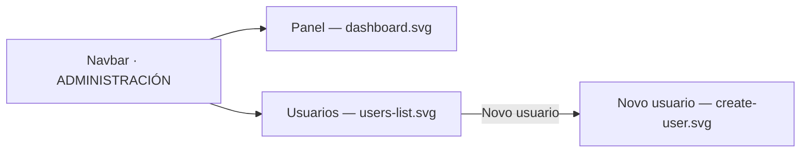

# Visual design — Administration area

The reference mockups for the `ADMIN`-only administration area: **Panel** (system status)
and **Usuarios** (list + create + activar/desactivar). They are the canonical picture of the
conxugal design language at full-screen scale — the `frontend-design` skill states the rules
in prose and points here for what a whole screen assembled from them looks like.

These are **design artifacts, not code**: hand-authored SVG mirroring the real Mantine
`AppShell`, `Card`, `Table`, `Badge`, `Button` and `Modal` components with the project theme
([ADR-0004](../../architecture/0004-ui-stack-vite-mantine.md)). The buildable screens live in
`ui/src/features/administration/`, and their per-component states are stored in Storybook.

## Screens

| File | Screen | Route |
| --- | --- | --- |
| [`dashboard.svg`](dashboard.svg) | System status panel | `/administracion` |
| [`users-list.svg`](users-list.svg) | User list with activar/desactivar | `/administracion/usuarios` |
| [`create-user.svg`](create-user.svg) | *Novo usuario* dialog over the list | `/administracion/usuarios` |



## What the mockups are authoritative for

The design tokens, chrome and component patterns they render are stated as rules in the
[`frontend-design` skill](../../../.claude/skills/frontend-design/SKILL.md) — read that first;
it is the source of truth for *what to do*, and these files show *what the result looks like*.
Where the two ever disagree, the skill and the shipped screens win and the mockup is stale.

Three things are worth reading off the images specifically, because they are compositional
rather than per-component:

- **The panel's card rhythm** — two status cards side by side, then a full-width runtime card,
  each with an uppercase dimmed label, a large value with an optional status dot, a badge, a
  hairline divider and a dimmed caption.
- **The list's disabled rows** — dimmed avatar and text, badge in neutral grey, row still
  present. Accounts are never removed from the list, only deactivated, and the caption under
  the table says so.
- **The blocked action** — the sole remaining enabled administrator's *Desactivar* is a
  disabled button with a lock affordance and a tooltip, never a hidden one.

## Copy

All chrome and copy is **Galician**, and the shipped strings live in
`ui/src/shared/lib/strings.ts` — the mockups reproduce them but do not own them. Add or change
user-facing text there.

## Regenerating previews

The SVGs are self-contained (no external assets) and open directly in a browser. To rasterise
for review:

```sh
inkscape dashboard.svg --export-type=png --export-filename=dashboard.png -w 1280
```

<!-- distilled-from: FEAT-0004 @ 7402d8a -->
