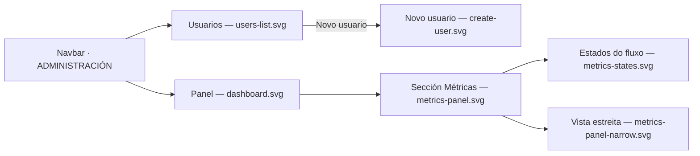

# Visual design — Administration area

The reference mockups for the `ADMIN`-only administration area: **Panel** (system status
above a live real-time metrics section) and **Usuarios** (list + create + activar/desactivar).
They are the canonical picture of the conxugal design language at full-screen scale — the
`frontend-design` skill states the rules in prose and points here for what a whole screen
assembled from them looks like.

These are **design artifacts, not code**: hand-authored SVG mirroring the real Mantine
`AppShell`, `Card`, `Table`, `Badge`, `Button` and `Modal` components with the project theme
([ADR-0004](../../architecture/0004-ui-stack-vite-mantine.md)). The buildable screens live in
`ui/src/features/administration/`, and their per-component states are stored in Storybook.

## Screens

| File | Screen | Route |
| --- | --- | --- |
| [`dashboard.svg`](dashboard.svg) | System status panel | `/administracion` |
| [`users-list.svg`](users-list.svg) | User list with activar/desactivar | `/administracion/usuarios` |
| [`create-user.svg`](create-user.svg) | *Novo usuario* dialog over the list | `/administracion/usuarios` |
| [`metrics-panel.svg`](metrics-panel.svg) | The métricas section, live, below the status cards | `/administracion` |
| [`metrics-states.svg`](metrics-states.svg) | Stream states + sparkline anatomy | `/administracion` |
| [`metrics-panel-narrow.svg`](metrics-panel-narrow.svg) | The same section at ~420 px, single-column | `/administracion` |



## What the mockups are authoritative for

The design tokens, chrome and component patterns they render are stated as rules in the
[`frontend-design` skill](../../../.claude/skills/frontend-design/SKILL.md) — read that first;
it is the source of truth for *what to do*, and these files show *what the result looks like*.
Where the two ever disagree, the skill and the shipped screens win and the mockup is stale.

Three things are worth reading off the images specifically, because they are compositional
rather than per-component:

- **The panel's card rhythm** — two status cards side by side, then a full-width runtime card,
  each with an uppercase dimmed label, a large value with an optional status dot, a badge, a
  hairline divider and a dimmed caption.
- **The list's disabled rows** — dimmed avatar and text, badge in neutral grey, row still
  present. Accounts are never removed from the list, only deactivated, and the caption under
  the table says so.
- **The blocked action** — the sole remaining enabled administrator's *Desactivar* is a
  disabled button with a lock affordance and a tooltip, never a hidden one.

## The métricas section

The metrics section is **not** one big card: it is a section heading plus the same card
vocabulary the dashboard already uses, sitting below the FEAT-0004 status cards on the same
`/administracion` screen — an addition to that page, not a new one.

- **Section header** — `Métricas en tempo real` (weight 600) with a one-line dimmed subtitle,
  and on the right the **liveness pair**: the arrival time of the last sample
  (`Mostra recibida ás 12:45:07 · cada 5 s`) beside a state `Badge`. The cadence is shown
  because the server chooses it; there is deliberately no control to change it, no refresh
  button, no date range — the values move on their own.
- **Four stat tiles** (`SimpleGrid cols={{ base: 1, sm: 2, lg: 4 }}`) — heap, system load,
  live threads and HTTP requests. Each is the stat-card shape above, with a sparkline of the
  client-side buffer at the bottom.
- **Three detail cards** — *Memoria e recolección de lixo* (heap bar, non-heap, GC count and
  time, uptime), *Conexións co almacén de datos* (segmented pool bar with legend), and
  *Actividade HTTP* (totals, errors, error rate with its severity badge). Together with the
  tiles they cover every field of the `RuntimeMetrics` schema in the
  [OpenAPI document](../../api/openapi.yaml).
- **Footer notes** — one lock note (no secrets) and one history note (the buffer lives in the
  browser only), in the dashboard's icon + dimmed-caption style. A second lock note sits
  inside the pool card, which is where a reader would most expect a connection string.

### Sparklines

A single series, so **no legend and no axes** — the tile's label names the data. As shipped:
`strokeWidth={2}`, `color="indigo.6"` (`indigo.2` while stale) and `fillOpacity={0.4}`, over a
`gray.1` baseline hairline. The buffer holds the last 250 samples; with fewer, the line spans
only the elapsed part of the box, which is how "the history is still filling up" reads.

Two things the mockups draw that the shipped panel does not have, because Mantine's
`Sparkline` cannot express them: a **separate `indigo.0` area fill** (one `--chart-color`
drives stroke and fill together, hence `fillOpacity`) and a **dot on the newest sample**
(the component exposes no dot prop). Read those as intent, not as spec.

They are **decorative and hidden from assistive technology** (`inert aria-hidden`): the
number above a sparkline is always the accessible source of truth. There is no hover
crosshair or tooltip — `metrics-states.svg` draws one, and the shipped panel does not have
it. `@mantine/charts`'s `Sparkline` renders recharts with `accessibilityLayer` on and exposes
no prop to disable it, so `inert` is what keeps each chart out of the tab order and the
accessibility tree; an interactive tooltip would mean reversing that and giving the chart a
real accessible name first.

### Stream states

| State | Badge | Values | Sparkline |
| --- | --- | --- | --- |
| Connecting | `gray` `CONECTANDO` | Mantine `Skeleton` placeholders | empty box, `sen historial aínda` |
| Live | `green` `EN DIRECTO` + pulse dot | current sample | indigo, dot on newest sample |
| Reconnecting | `yellow` `RECONECTANDO` | last known values, dimmed | dimmed (`indigo.2`), history kept |

The section is **never hidden or replaced by an error state** while the stream is down: the
browser's `EventSource` reconnects on its own, so the design keeps the last sample visible and
says when it arrived (`Última mostra ás 12:45:07 · hai 18 s`). `yellow` marks *stale but not
broken* — neither green (healthy) nor red (a fault to act on).

The *Actividade HTTP* card's error rate is banded rather than badged green unconditionally:
`normal` under 1 %, `elevated` 1–5 %, `high` at or above 5 %. [SPEC-0003](../../specs/SPEC-0003-administration-area.md)
R22 asks for the normal-vs-concerning distinction; the cut-offs themselves are a design call
and live in the [`frontend-design` skill](../../../.claude/skills/frontend-design/SKILL.md).

## Copy

All chrome and copy is **Galician**, and the shipped strings live in
`ui/src/shared/lib/strings.ts` — the mockups reproduce them but do not own them. Add or change
user-facing text there. The metrics section's copy sits under `admin.dashboard.metrics.*`:
title, subtitle, the three state labels, the sample-arrival and cadence captions, every metric
label and caption, the error-rate badges, and the two footer notes.

## Regenerating previews

The SVGs are self-contained (no external assets) and open directly in a browser. To rasterise
for review:

```sh
inkscape dashboard.svg --export-type=png --export-filename=dashboard.png -w 1280
```

<!-- distilled-from: FEAT-0004 @ 7402d8a -->
<!-- distilled-from: FEAT-0005 @ 525bdaa -->
