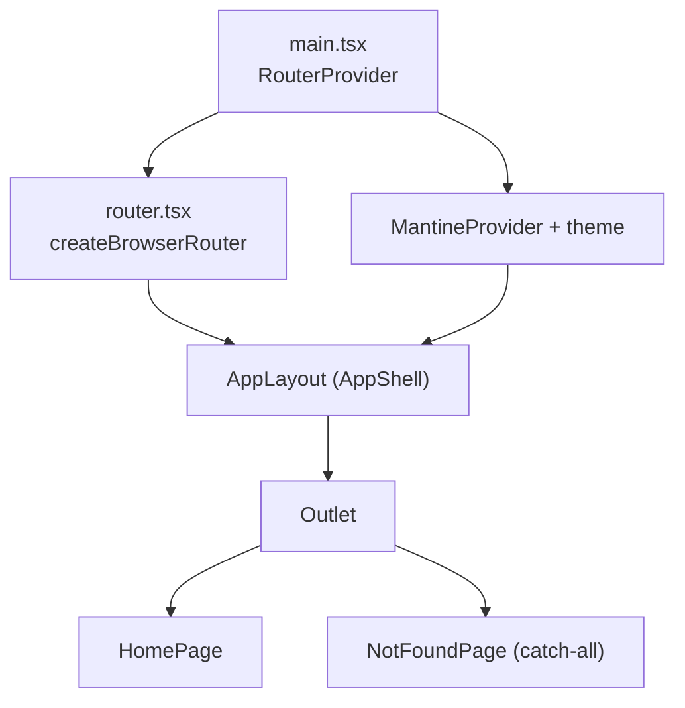

# FEAT-0001. UI application scaffolding

## Goal
Stand up the `ui/` module: a buildable, runnable React Router SPA with the Mantine
theme and an application shell, satisfying the *reachable, navigable, themed shell*
requirements of **[SPEC-0001](../../specs/SPEC-0001-web-ui.md)** and the stack decided in
**[ADR-0003](../../architecture/0003-react-router-ui-served-by-backend.md)** (React Router served
by the backend) and **[ADR-0004](../../architecture/0004-ui-stack-vite-mantine.md)** (Vite build, library-mode SPA, Mantine, npm).

This is the foundation; data browsing/search/export features build on top of it later.

## Scope
- A new `ui/` module: Vite + React + TypeScript, npm.
- Mantine wired through a single `MantineProvider` + a project `theme`.
- React Router in library mode (`createBrowserRouter` + `RouterProvider`).
- An `AppShell`-based layout (header + navbar) as the persistent shell.
- A landing/home section, plus a catch-all not-found route — both inside the shell.
- Galician interface chrome.
- Lint + format + a smoke test, and an npm `build` that emits static assets.

**Out of scope (separate features):** real contract listing/search/detail/export
screens, API client wiring, auth, the backend change that serves `ui/dist` and the SPA
history fallback (owned by the server module).

## Module layout

```
ui/
  package.json
  tsconfig.json
  tsconfig.node.json
  vite.config.ts
  postcss.config.cjs
  index.html
  src/
    main.tsx          # ReactDOM root + RouterProvider
    router.tsx        # createBrowserRouter route tree
    theme.ts          # createTheme — colors, fonts, defaults
    layout/
      AppLayout.tsx   # Mantine AppShell: header + navbar + <Outlet/>
    routes/
      HomePage.tsx
      NotFoundPage.tsx
    components/        # shared presentational components (grows later)
  src/test/setup.ts
```

## Design

### Composition


### Routing (library mode, [ADR-0004](../../architecture/0004-ui-stack-vite-mantine.md))
- `createBrowserRouter` with a single layout route (`path: "/"`, element `<AppLayout/>`).
  - `index: true` → `HomePage` (R1).
  - `path: "*"` → `NotFoundPage` (R3 / AC4), rendered inside the shell.
- History routing (not hash). Deep-linking depends on the backend serving `index.html`
  as the SPA fallback for non-API paths — **flagged for the server feature**, not built
  here. Dev uses Vite's dev server, which already does SPA fallback.

### Theme (R4)
- `theme.ts` exports `createTheme({...})`: primary color, default radius, font family.
  Wrapped once in `main.tsx` via `<MantineProvider theme={theme}>` with
  `<ColorSchemeScript>` for color-scheme support. `import '@mantine/core/styles.css'`.

### Layout / shell (R1, R2, R5)
- `AppLayout` uses Mantine `AppShell` with a `header` (product name "conxugal") and a
  `navbar` carrying primary navigation built from a route list, plus a burger toggle so
  the navbar collapses on narrow viewports (AC6). Active link reflects the current path.
- Content area renders `<Outlet/>`.

### Internationalisation (R6)
- Interface chrome strings (nav labels, not-found copy) are authored in **Galician**
  directly for the scaffold. A full i18n library is out of scope; strings are kept in a
  single module so a later i18n feature can lift them without restructuring.

## Tooling & scripts
- **PostCSS:** `postcss-preset-mantine` + `postcss-simple-vars` (Mantine breakpoints).
- **Lint/format:** ESLint (typescript-eslint, react-hooks, react-refresh) + Prettier.
- **Test:** Vitest + Testing Library + jsdom; one smoke test asserting the shell renders
  the product name and that the not-found route shows the Galician message.
- **npm scripts:** `dev`, `build` (`tsc -b && vite build` → `ui/dist`), `preview`,
  `lint`, `format`, `test`.

## Sequencing (tasks, one small change each)
This foundational scaffold shipped as a single self-contained task rather than the
finer-grained split originally envisaged:

1. **[TASK-0001](TASK-0001-bootstrap-ui-module-and-themed-app-shell.md)** —
   Bootstrap the `ui/` module and themed app shell: Vite React-TS project (npm, tsconfig,
   ESLint/Prettier, baseline scripts), Mantine wired via `theme.ts` + `MantineProvider` +
   `ColorSchemeScript`, React Router with `AppLayout`/`HomePage`/`NotFoundPage` and Galician
   chrome, plus the Vitest smoke test and responsive/a11y pass.
   *([SPEC-0001](../../specs/SPEC-0001-web-ui.md) R1–R6; [ADR-0003](../../architecture/0003-react-router-ui-served-by-backend.md), [ADR-0004](../../architecture/0004-ui-stack-vite-mantine.md))*

## Edge cases
- **Unknown deep link in production** → blank/404 unless backend serves `index.html`
  fallback. Mitigation: tracked as a dependency on
  **[FEAT-0003](../FEAT-0003-backend-serves-ui-application/README.md)** (R3 fully holds only once
  that lands); in dev it already works.
- **Color-scheme flash** → mitigated by `ColorSchemeScript`.
- **Asset base path** when served under a sub-path by Micronaut → Vite `base` may need
  configuring; tracked in
  **[FEAT-0003](../FEAT-0003-backend-serves-ui-application/README.md)**.
