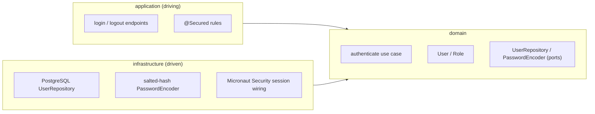

# FEAT-0002. User authentication

## Goal
Implement email + password authentication with `USER`/`ADMIN` roles and server-side
sessions, satisfying **[SPEC-0002](../../specs/SPEC-0002-user-authentication.md)**. The
mechanism is session-based auth via Micronaut Security
(**[ADR-0005](../../architecture/0005-session-based-authentication.md)**), placed inside
the hexagonal server (**[ADR-0002](../../architecture/0002-hexagonal-architecture.md)**):
the identity model and credential check are domain rules; the user store, password
hashing and security wiring are driven adapters; the login/logout endpoints and
`@Secured` rules are the driving side.

## Scope
- **Domain:** `User`, `Role` (`USER`, `ADMIN`), the authenticate use case, and the
  `UserRepository` / `PasswordEncoder` ports.
- **Infrastructure:** a PostgreSQL user store, a salted-hash `PasswordEncoder` adapter,
  and the Micronaut Security session wiring.
- **Application / driving side:** a server-rendered login page and forbidden page,
  logout, `@Secured` rules, and the SPA's 401-handling redirect to login.

**Out of scope (separate features):** user self-registration, password reset, admin
user management/CRUD, and the actual contents of the admin area (this feature only
gates access to it).

## Design

### Hexagonal placement ([ADR-0002](../../architecture/0002-hexagonal-architecture.md))

### Authentication ([ADR-0005](../../architecture/0005-session-based-authentication.md))
- A successful login establishes a **server-side session** identified by a cookie; the
  user stays authenticated across requests. Logout invalidates the session.
- The **login page is server-rendered, outside the SPA** — credentials are submitted by
  a plain form and never touch application JavaScript. The SPA bundle loads only after a
  session exists.
- A failed login is **indistinct**: an unknown email and a wrong password produce the
  same single generic error, and the password check is not short-circuited when the
  email is unknown.
- **CSRF** is enabled for the form-login flow.

### Authorization
- `@Secured` rules: data/analysis and the SPA require `IS_AUTHENTICATED`; admin routes
  require `ADMIN`; `/login` is `IS_ANONYMOUS`. `ADMIN` is a strict superset of `USER`.

### Sessions
- A session **expires after 30 minutes of inactivity**; the next request is treated as
  unauthenticated and requires logging in again (SPEC-0002 #8). The window is enforced by
  the Micronaut session configuration in [TASK-0003](TASK-0003-security-config-session-auth.md).

### Session loss
- Protected XHR/API routes return **401 (not an HTML redirect)** when the session is
  absent or expired; the SPA treats a 401 as *session gone* and navigates the browser to
  `/login`.

### Credentials
- Passwords are stored as **salted hashes**; verification compares hashes. Plaintext is
  never stored, logged, or returned.

## Sequencing (tasks, one small change each)
1. **[TASK-0001](TASK-0001-auth-domain-user-role-authenticate.md)** —
   Auth domain: `User`, `Role` and the authenticate use case with its ports. *(domain only)*
2. **[TASK-0002](TASK-0002-auth-infrastructure-postgres-user-store.md)** —
   PostgreSQL user store + password-hashing adapters implementing the domain ports.
   *(SPEC-0002 #9)*
3. **[TASK-0003](TASK-0003-security-config-session-auth.md)** —
   Security config: session auth, `AuthenticationProvider`, `@Secured` rules, CSRF,
   30-minute idle session timeout. *(SPEC-0002 #2, #4–#6, #8)*
4. **[TASK-0004](TASK-0004-server-rendered-login-forbidden-pages.md)** —
   Server-rendered login + forbidden pages and the login form. *(SPEC-0002 #1, #3)*
5. **[TASK-0005](TASK-0005-logout-and-spa-401-handling.md)** —
   Logout and the SPA 401-handling redirect to login. *(SPEC-0002 #7)*
6. **[TASK-0006](TASK-0006-run-authentication-off-the-event-loop.md)** —
   Dispatch `UserAuthenticationProvider`'s blocking credential check onto the blocking
   executor instead of the event loop. *(SPEC-0002 #2–#3)*

## Edge cases
- **Indistinct failure** — unknown email vs. wrong password must not be separable; the
  password check runs even when the email is unknown so timing and messaging do not
  disclose which field was wrong (SPEC-0002 #3).
- **Expired session mid-use** — an XHR gets a 401 and the SPA sends the user back to
  `/login` rather than failing silently (SPEC-0002 #7).
- **Already-authenticated visitor of `/login`** — redirected to `/` (the SPA) instead of
  being shown the login form again.
- **No plaintext anywhere** — passwords never appear in storage, logs, error messages or
  responses (SPEC-0002 #9).
