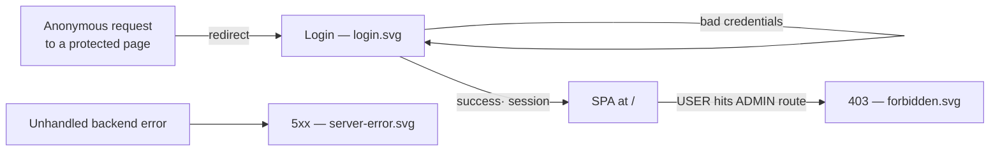

# Visual design — Server-rendered static pages

Static visual mockups for the pages the **server renders outside the SPA** — the ones a
visitor can see before (or instead of) the React application. They render the
server-rendered surfaces of [FEAT-0002](../README.md) (the login page and the forbidden
page, [TASK-0004](../TASK-0004-server-rendered-login-forbidden-pages.md)) plus the
generic backend error page, using the project's design tokens
([ADR-0004](../../../architecture/0004-ui-stack-vite-mantine.md)) so implementation has a
concrete target.

These are **design artifacts, not code**: hand-authored SVG. Unlike the
[FEAT-0004 admin mockups](../../FEAT-0004-administration-area/design/README.md), these
pages deliberately **do not** sit inside the Mantine `AppShell` — they are plain
server-rendered HTML with no navbar, header chrome, or application JavaScript. They only
share the *tokens* (colour, radius, type, Galician copy), so the seam between "before
the app" and "inside the app" is invisible.

## Why these live outside the SPA

Per [ADR-0005](../../../architecture/0005-session-based-authentication.md) and
FEAT-0002's design, **the login page is server-rendered and outside the SPA** —
credentials are posted by a plain form and never touch application JavaScript; the SPA
bundle loads only once a session exists. The forbidden and error pages follow the same
rule so a failure or a denied request never depends on the app being able to boot.

## Screens

| File | Page | Route / trigger | Owner |
| --- | --- | --- | --- |
| [`login.svg`](login.svg) | Login | `GET /login` (anonymous) | FEAT-0002 · TASK-0004 |
| [`forbidden.svg`](forbidden.svg) | Access denied (403) | a `USER` requests an `ADMIN` route | FEAT-0002 · TASK-0004 |
| [`server-error.svg`](server-error.svg) | Server error (5xx) | any unhandled backend error | shared error template |



The forbidden and server-error pages share **one error template** — a centred brand,
a soft `indigo.0` status glyph, an `ERRO NNN` label, a title, one or two lines of
Galician explanation, a primary action and a secondary link. The same template also
backs a real backend **404** (a no-match under `/api/**`, per
[FEAT-0003](../../FEAT-0003-backend-serves-ui-application/README.md)) and a **503**
maintenance page — swap the glyph, code, title and copy. (Client-side "page not found"
for SPA routes stays inside the app: `NotFoundPage`, SPEC-0001 R3.)

## Design language

The pages reuse the theme tokens from `ui/src/theme.ts` so they read as the same
product as the SPA, without borrowing its chrome.

### Tokens (from the Mantine theme)

- **Primary colour:** `indigo` — the filled primary button and the login submit use
  `indigo.6` (`#4c6ef5`); the status glyph sits in an `indigo.0` (`#edf2ff`) disc and
  the `ERRO NNN` label / secondary links use `indigo.6`.
- **Radius:** `md` (`8px`) on inputs and buttons; the login card uses a slightly larger
  `12px` to read as an elevated surface.
- **Neutrals:** page background `gray.0` (`#f8f9fa`), the login surface white with a
  soft shadow and a `gray.2` hairline, body text `gray.9` (`#212529`), dimmed text
  `gray.6` (`#868e96`), input borders `gray.4` (`#ced4da`).
- **Type:** the theme's system font stack; the page/section titles at weight 600–700.

### Status semantics

Following the project rule that **red is reserved for destructive/required, not for
merely-error states**, the 403 and 5xx pages render their glyph, code and actions in
calm **indigo**, not red — a denied route or a transient server fault is a system state,
not something the user broke. Red appears only in one place: the login form's **generic
failure alert** (`red.0`/`red.3` tint, `red.9` text), which is genuinely a
validation-style error the user must act on.

## How the design meets the spec

- **Login (SPEC-0002 R1, R3):** email + password fields and a single **Entrar** submit.
  A failed attempt is shown as **one generic alert** — *"Correo electrónico ou
  contrasinal incorrectos."* — that never says which field was wrong, satisfying the
  indistinct-failure rule (SPEC-0002 #3, TASK-0004 AC). The password field masks input
  (dots + a visibility toggle) and the copy never implies a recoverable password
  (R11/R12). The mockup shows the `/login?error` state; the default `GET /login` is
  identical without the alert.
- **Forbidden (SPEC-0002 R7):** an authenticated `USER` who requests an `ADMIN` route
  gets a clear **403 · Acceso denegado** with a route back to the app and a **Pechar
  sesión** secondary (so the user can switch to an authorised account) — access is
  denied, never silently blank.
- **Server error (delivery layer):** an unhandled backend fault renders **500 · Algo foi
  mal** with a **Reintentar** primary action, rather than a raw stack trace or a
  framework default — and, like every surface here, it exposes **no credentials,
  connection strings, or internal detail** (SPEC-0002 R12).

## Copy

All copy is **Galician**, consistent with `ui/src/strings.ts` (SPEC-0001 R6). When these
pages are implemented, their strings should be authored alongside the existing chrome
copy so a later i18n pass lifts them together.

## Regenerating previews

The SVGs are self-contained (no external assets) and open directly in a browser. To
rasterise for review:

```sh
inkscape design/login.svg --export-type=png --export-filename=login.png -w 1280
```
