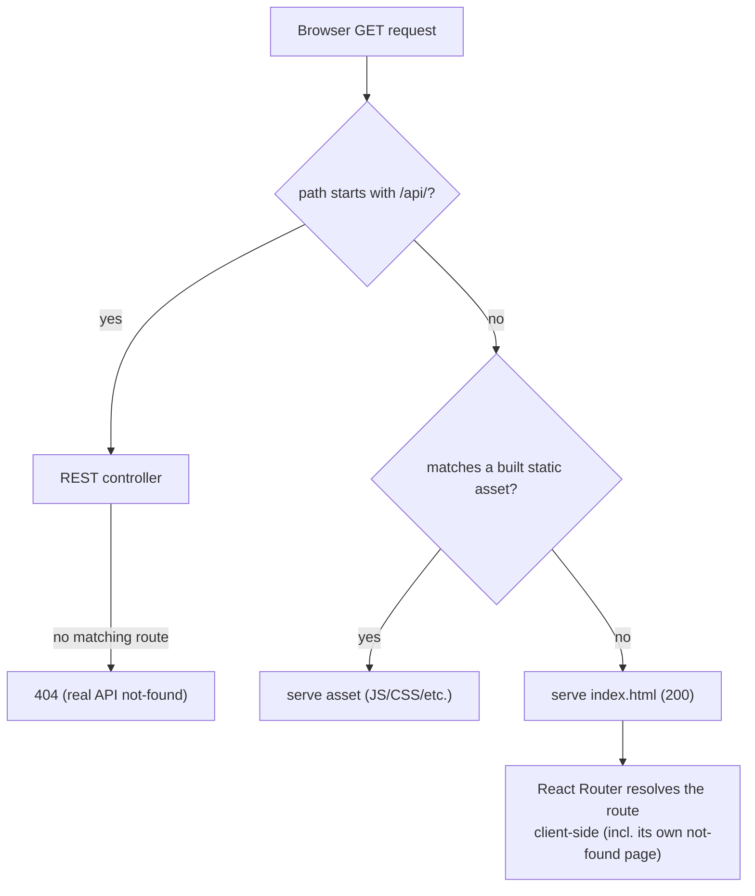

# FEAT-0003. Backend serves the UI application

## Goal
Make the Micronaut `application` module the single deployable artifact and single
origin for both the REST API and the built UI, as decided in
**[ADR-0003](../architecture/0003-react-router-ui-served-by-backend.md)** (serve the UI
from the backend) and **[ADR-0004](../architecture/0004-ui-stack-vite-mantine.md)**
(static-asset build, history routing, backend-owned SPA fallback and asset base path).

`docs/features/FEAT-0001-ui-application-scaffolding.md` built the UI shell and
explicitly deferred this wiring; without it, **[SPEC-0001](../specs/SPEC-0001-web-ui.md)**
R2/AC2 and R3/AC4 only hold in Vite's dev server, not in a production build.

## Scope
- A Gradle step that consumes the UI's `npm run build` output (`ui/dist`) and packages
  it into the `application` module's runnable/deployable artifact.
- Micronaut static-resource serving of those assets at the origin root (`/`).
- A reserved `/api/` path prefix for all current and future REST endpoints, so the
  fallback below can unambiguously tell "no such API route" (a real 404) apart from
  "an SPA client-side route" (serve the app shell).
- An SPA history fallback: any unmatched **GET** request outside `/api/**` and not
  matching a static asset returns `index.html` (200), so React Router's client-side
  routes deep-link and survive a reload in production (SPEC-0001 AC2, AC4).
- Confirming/setting Vite's `base` for root-path serving, closing the "asset base path"
  edge case FEAT-0001 deferred here.

**Out of scope (separate features):** any actual REST API endpoints or business logic
behind `/api/`; authentication/authorization for either the API or the SPA shell
(`docs/features/FEAT-0002-user-authentication.md`); caching/CDN or other production
hardening beyond functional correctness.

## Design

### Request routing (application module, driving side — [ADR-0002](../architecture/0002-hexagonal-architecture.md))

This is pure delivery-mechanism plumbing inside the `application` module (ADR-0002); it
adds no domain or infrastructure code.

### Build wiring
- The server build (`./gradlew build`/`run` from `server/`) must produce `ui/dist`
  (running the UI's own `npm run build`, or consuming a pre-built `ui/dist` — the task
  below decides which) and copy it into a location Micronaut serves statically, so the
  packaged artifact is self-contained and `./gradlew run` serves a working UI without a
  separate `npm run dev`.

### API prefix convention
- Reserving `/api/` is a cross-cutting convention every future REST endpoint must
  follow, not just this feature's concern. It is governed by
  **[ADR-0006](../architecture/0006-reserved-api-url-prefix.md)** and restated in
  `server/CLAUDE.md` once implemented; this feature is its first consumer.

## Sequencing (tasks, one small change each)
1. **[TASK-0001](../tasks/FEAT-0003/TASK-0001-wire-ui-build-into-server-artifact.md)** —
   Gradle wiring: consume `ui/dist` and package it into the `application` module's
   artifact.
2. **[TASK-0002](../tasks/FEAT-0003/TASK-0002-static-asset-serving-and-api-prefix.md)** —
   Micronaut static-resource serving at `/`, plus reserving and documenting the `/api/`
   prefix.
3. **[TASK-0003](../tasks/FEAT-0003/TASK-0003-spa-history-fallback.md)** —
   SPA history-fallback for unmatched non-`/api/` GET requests. *(SPEC-0001 R2, R3,
   AC2, AC4)*
4. **[TASK-0004](../tasks/FEAT-0003/TASK-0004-vite-base-path-and-integration-test.md)** —
   Confirm Vite's `base` path and add an end-to-end integration test covering the
   routing matrix above.

## Edge cases
- **Deep link / reload on a client-side route** (e.g. `/acerca`) → falls back to
  `index.html`; React Router then renders the matching section, satisfying SPEC-0001
  AC2's "reload returns to the same section" in production, not just in dev.
- **Unknown path** (no client-side route matches either) → also falls back to
  `index.html`; the UI's own `NotFoundPage` renders the in-shell Galician not-found
  state (SPEC-0001 AC4) — the backend does not need to know the client's route table.
- **Unknown `/api/` path** → must return a genuine 404, never the SPA fallback, or API
  clients/tests would see misleading 200 HTML responses for typos/removed endpoints.
- **Static asset filenames colliding with a future client route** → Vite's hashed
  filenames (`assets/index-<hash>.js`) make this practically impossible; static-asset
  matching still takes priority over the fallback either way.
