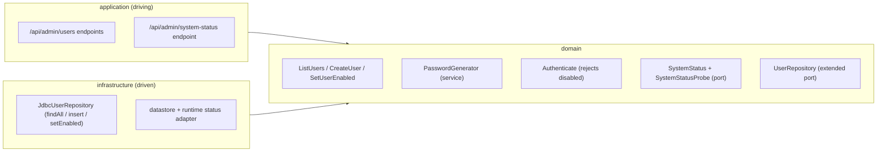

# FEAT-0004. Administration area

## Goal
Build the `ADMIN`-only administration area described by
**[SPEC-0003](../../specs/SPEC-0003-administration-area.md)**: a system dashboard
reporting server status and user administration (list, create, disable/enable — never
delete). It lives inside the server and the React Router
SPA (**[ADR-0003](../../architecture/0003-react-router-ui-served-by-backend.md)**,
**[ADR-0004](../../architecture/0004-ui-stack-vite-mantine.md)**), with the admin REST
endpoints under the reserved `/api/` prefix
(**[ADR-0006](../../architecture/0006-reserved-api-url-prefix.md)**). Access is gated by
the `@Secured(ADMIN)` rules already delivered in
[FEAT-0002](../FEAT-0002-user-authentication/README.md).

## Scope
- **Domain (auth):** extend `User` with an `enabled` state and a creation timestamp; add the account-management
  use cases (list, create, disable, enable) and extend the `UserRepository` port; add a
  `PasswordGenerator` domain service that produces a random initial password for new
  accounts; make the existing `Authenticate` use case reject disabled accounts.
- **Domain (system status):** a `SystemStatus` model and a port that reports overall
  service state and datastore reachability.
- **Infrastructure:** a migration adding the `enabled` and `created_at` columns; extend
  `JdbcUserRepository`; a driven adapter that assembles system status (datastore probe +
  runtime info) without exposing secrets.
- **Application (driving):** `ADMIN`-only REST endpoints for user administration and for
  system status under `/api/admin/`.
- **UI:** an admin section in the SPA — dashboard page, user-list page, create-user form,
  and a disable/enable action — with Galician chrome, shown only to administrators.

**Out of scope (future specs/features):** editing an existing account's email or role,
password reset / self-service credential change, self-registration, audit logging of
admin actions, and any hard-delete of accounts (explicitly excluded by SPEC-0003 R11).

## Design

### Hexagonal placement ([ADR-0002](../../architecture/0002-hexagonal-architecture.md))

### Account state
- `User` gains an `enabled` boolean and a `createdAt` timestamp. The `UserRepository`
  port grows `findAll()`, an insert for new accounts, and an operation to set an
  account's `enabled` state.
- `CreateUser` stamps `createdAt` from an injected clock at insert time (rather than
  relying on a database default) so the value is deterministic and unit-testable. The
  migration backfills pre-existing rows with a column default (see infrastructure task).
- `Authenticate` denies a disabled account **after** the password check so the outcome
  stays indistinct from a wrong-password failure (SPEC-0002 R3): a disabled account is
  never a distinguishable signal.
- `CreateUser` generates a random initial password through the `PasswordGenerator`
  service, enforces email uniqueness (SPEC-0003 R8), and stores only a salted hash via
  the existing `PasswordEncoder` (SPEC-0003 R13). The generated plaintext is returned
  **once** in the creation result so the admin can relay it to the new user; it is never
  persisted, logged, or retrievable afterwards (SPEC-0003 R16).
- `PasswordGenerator` draws from a cryptographically secure RNG (`SecureRandom`) and
  applies the fixed strength policy of SPEC-0003 R15 — at least 16 characters spanning
  uppercase, lowercase, digits, and symbols — so every generated password clears the same
  bar (SPEC-0003 R14). The RNG source is injected so the policy is unit-testable.
- `SetUserEnabled` refuses to disable the last enabled `ADMIN` (SPEC-0003 R12); the
  count is checked in the same transaction as the update.

### System status
- A `SystemStatusProbe` port returns overall service state plus datastore reachability,
  assembled fresh per request (SPEC-0003 R4). The adapter runs a lightweight datastore
  connectivity check and reports coarse runtime info only — **never** connection strings,
  passwords, or other secrets (SPEC-0003 R5).
- **Open decision:** whether to source this from Micronaut's management endpoints
  (`micronaut-management` health/info) or a custom probe. If we adopt the management
  module as a cross-cutting choice, record an ADR first (see *Open questions*).

### API surface ([ADR-0006](../../architecture/0006-reserved-api-url-prefix.md))
- `GET  /api/admin/users` — list accounts (email, role, enabled, created date).
- `POST /api/admin/users` — create account (email, role); the server generates the
  initial password and returns it once in the creation response.
- `POST /api/admin/users/{id}/enabled` — set enabled true/false.
- `GET  /api/admin/system-status` — current system status.
- All carry `@Secured("ADMIN")`; a `USER` gets 403 (SPEC-0003 R1).

### UI ([ADR-0004](../../architecture/0004-ui-stack-vite-mantine.md))
- A new admin section (routes + nav entry) shown only when the session role is `ADMIN`;
  the server rules remain the real gate. Pages: **Dashboard** (status), **Users** (list showing
  email, role, state, and created date + create form + disable/enable). The create form
  asks only for email and role (no password
  field); on success it shows the server-generated password once, with a copy affordance
  and a warning that it will not be shown again. Chrome and messages in Galician
  (consistent with SPEC-0001 R6).

## Sequencing (tasks, one small change each)
1. **Account-lifecycle domain** — add `enabled` and `createdAt` to `User`; add `ListUsers`,
   `CreateUser`, `SetUserEnabled` use cases and extend `UserRepository`; add the
   `PasswordGenerator` service and have `CreateUser` generate and return the initial
   password once and stamp `createdAt` from an injected clock; make `Authenticate` reject
   disabled accounts. *(SPEC-0003 #6–#9, #11, #12; SPEC-0002 #3)*
2. **User-store infrastructure** — migration adding the `enabled` column (default true) and
   the `created_at` column (default current timestamp, to backfill existing rows); extend
   `JdbcUserRepository` with `findAll`, insert, and set-enabled. *(SPEC-0003 #5–#9)*
3. **User-administration REST endpoints** — `@Secured(ADMIN)` endpoints for list, create,
   and enable/disable under `/api/admin/users`; the create response carries the generated
   password once. *(SPEC-0003 #1, #5–#8, #11, #12)*
4. **System-status probe + endpoint** — `SystemStatus` model, `SystemStatusProbe` port,
   datastore/runtime adapter, and `GET /api/admin/system-status`. *(SPEC-0003 #1–#4)*
5. **Admin UI shell + dashboard** — admin section, admin-only nav gating, and the
   dashboard page consuming system status. *(SPEC-0003 #1, #2)*
6. **User-administration UI** — user list (email, role, state, created date), create-user
   form (email + role only), the one-time generated-password reveal after creation, and
   the disable/enable action. *(SPEC-0003 #5–#7, #9, #10)*

## Edge cases
- **Disabled account is indistinct at login** — a disabled account produces the same
  generic failure as a wrong password (SPEC-0002 #3), not a distinct "account disabled"
  message.
- **Duplicate email on create** — rejected with the existing account left unchanged
  (SPEC-0003 #7); the check and insert are atomic to avoid a race creating two accounts.
- **Last-admin lockout** — disabling the only enabled `ADMIN` is refused (SPEC-0003 #11);
  covers an admin trying to disable their own account when no other admin is enabled.
- **No secret leakage in status** — the status payload is asserted to contain no
  credential/connection-secret values (SPEC-0003 #4).
- **Generated password shown once** — the plaintext is returned only in the create
  response and never stored or exposed again (not in the list, logs, or any later
  read). If the admin loses it before relaying it, there is no recovery path in this
  feature — credential reset is out of scope, so the account must be recreated.
- **UI is not the gate** — hiding the admin nav from a `USER` is cosmetic; a `USER`
  hitting an admin route or `/api/admin/*` directly is still denied by the server
  (SPEC-0003 #1).

## Open questions
- **System-status source:** adopt `micronaut-management` (health/info) or a custom probe?
  If the management module is introduced, propose an ADR before task 4.
- **Disabling a currently logged-in user:** should disabling also invalidate that user's
  active session immediately, or only block the next authentication? SPEC-0003 #8 requires
  only the latter; confirm whether stronger behaviour is wanted.
