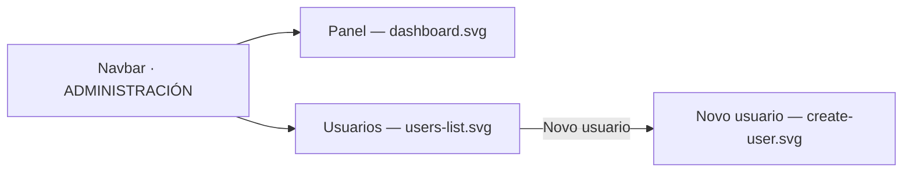

# Visual design — Administration area

Static visual mockups for the `ADMIN`-only administration area of
[FEAT-0004](../README.md). They render the screens described in the feature's *UI*
section — **Dashboard** (system status) and **Users** (list + create + enable/disable)
— using the project's Mantine stack ([ADR-0004](../../../architecture/0004-ui-stack-vite-mantine.md))
so implementation has a concrete, faithful target.

These are **design artifacts, not code**: hand-authored SVG that mirrors the real
Mantine `AppShell`, `Card`, `Table`, `Badge`, `Button` and `Modal` components with the
project theme. They are impl-agnostic reference; the buildable UI is delivered by the
feature's UI tasks (sequencing #5–#6).

## Screens

| File | Screen | Feature page |
| --- | --- | --- |
| [`dashboard.svg`](dashboard.svg) | System dashboard | Dashboard (status) |
| [`users-list.svg`](users-list.svg) | User list with enable/disable | Users |
| [`create-user.svg`](create-user.svg) | Create-user dialog over the list | Users (create form) |



## Design language

The mockups reuse the existing `AppShell` chrome (header + collapsible navbar) from
`ui/src/layout/AppLayout.tsx` and the theme in `ui/src/theme.ts`, so the admin section
reads as part of the same product rather than a bolt-on.

### Tokens (from the Mantine theme)

- **Primary colour:** `indigo` — filled primary buttons and the active nav item use
  `indigo.6` (`#4c6ef5`); active nav background is `indigo.0` (`#edf2ff`) with
  `indigo.8` text, matching Mantine's `light` variant.
- **Radius:** `md` (`8px`) on cards, inputs, buttons and the modal, per the theme's
  `defaultRadius`.
- **Font:** the theme's system stack; headings at weight 600.
- **Neutrals:** page background `gray.0` (`#f8f9fa`), surfaces white, borders
  `gray.3` (`#dee2e6`), body text `gray.9` (`#212529`), dimmed text `gray.6`
  (`#868e96`).
- **Status semantics:** healthy/enabled use `green` (`#40c057` dot, `#ebfbee`/`#2b8a3e`
  badge); disabled accounts use a neutral `gray` badge (they are inert, not errors);
  required-field markers and destructive emphasis use `red` (`#fa5252`).

### Chrome

- **Header** carries the product name + tagline and the signed-in administrator
  (email, role, avatar) — a visible reminder that admin screens run in an `ADMIN`
  session.
- **Navbar** keeps the primary nav (*Inicio*, *Acerca de*) and adds an
  **ADMINISTRACIÓN** section (*Panel*, *Usuarios*). This section is shown only to an
  `ADMIN`; the navbar gate is cosmetic — the server rules are the real gate
  (SPEC-0003 R1, feature *edge cases*).
- All chrome and copy is **Galician**, consistent with `ui/src/strings.ts` (SPEC-0001 R6).

## How the design meets the spec

- **Dashboard (R2–R5):** overall service state (*Sistema operativo*) and datastore
  reachability (*Base de datos · Accesible*) are the two primary cards; a *Comprobado
  o …* timestamp and refresh affordance convey the status is live, not stale (R4). The
  runtime card shows only coarse info (version, environment, uptime, memory, OS) and
  states explicitly that **no credentials or connection strings** are ever shown (R5).
- **User list (R6, R11):** every account is listed with email, role, state, created date
  and last login date (the most recent successful login recorded per SPEC-0002 R13,
  shown as *Nunca* when the account has never logged in); disabled rows are dimmed but
  present (never removed), and the caption reinforces that accounts are only disabled,
  never deleted.
- **Create user (R7, R8, R13):** the *Novo usuario* dialog collects email, role and an
  initial password; the password field notes it is stored encrypted and never shown in
  clear (R13). Uniqueness (R8) surfaces at submit time as a field error (not mocked here).
- **Enable/disable (R9, R10, R12):** enabled accounts show *Desactivar*; disabled
  accounts show *Activar*. The sole remaining enabled administrator's *Desactivar* is
  disabled (lock affordance), so the area can never be locked out (R12).

## Regenerating previews

The SVGs are self-contained (no external assets) and open directly in a browser. To
rasterise for review:

```sh
inkscape design/dashboard.svg --export-type=png --export-filename=dashboard.png -w 1280
```
