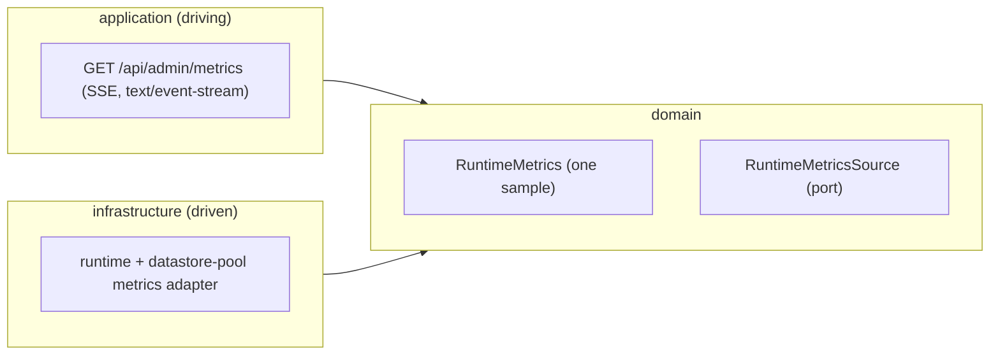

# FEAT-0005. Admin real-time metrics

## Goal
Give administrators a **live view of detailed runtime metrics** for debugging a running
instance, as required by **[SPEC-0003](../../specs/SPEC-0003-administration-area.md)**
R17–R21. The metrics are pushed to the admin browser over **Server-Sent Events**
(**[ADR-0009](../../architecture/0009-sse-admin-realtime-metrics.md)**) under the reserved
`/api/` prefix (**[ADR-0006](../../architecture/0006-reserved-api-url-prefix.md)**), gated
by `@Secured("ADMIN")` and authenticated by the existing session cookie
(**[ADR-0005](../../architecture/0005-session-based-authentication.md)**). They are
**assembled on demand and never stored by the backend**; any short history lives only in
the viewing client, for that admin's debugging, and is discarded on reload.

## Scope
- **Domain:** a `RuntimeMetrics` model capturing a single detailed sample, and a
  `RuntimeMetricsSource` port that assembles the current sample on demand (no storage, no
  history).
- **Infrastructure:** a driven adapter that reads the sample from the running instance —
  JVM memory, threads, uptime, GC, system load, HTTP request/error counters, and
  datastore-pool usage — excluding any secret or connection value.
- **Application (driving):** an `ADMIN`-only SSE endpoint under `/api/admin/` that streams
  successive `RuntimeMetrics` samples plus a heartbeat, and closes cleanly when the client
  disconnects.
- **UI:** a metrics panel on the admin dashboard that subscribes to the stream via
  `EventSource`, renders each sample live, and keeps a small **client-side** rolling
  history for debugging (e.g. recent-samples sparklines), cleared on reload. Galician
  chrome.

**Out of scope (owned elsewhere):** the coarse operational status snapshot
`GET /api/admin/system-status` and its `SystemStatusProbe`
([SPEC-0003](../../specs/SPEC-0003-administration-area.md) R2–R5, delivered by the retired
FEAT-0004); any **server-side** persistence,
historical query, or alerting on metrics (explicitly excluded by SPEC-0003 R20 — no future
feature stores them without a new spec); and metrics for non-admin users.

## Design

### Hexagonal placement ([ADR-0002](../../architecture/0002-hexagonal-architecture.md))

### Metrics model and source
- `RuntimeMetrics` is an immutable snapshot of the instance's current state: JVM heap and
  non-heap memory, live thread count, uptime, recent GC activity, system/CPU load, HTTP
  request and error counters, and datastore connection-pool usage. It is a plain value —
  nothing about it is persisted.
- `RuntimeMetricsSource` returns the **current** sample each time it is asked; there is no
  accumulation or history behind the port (SPEC-0003 R20). The adapter reads the values
  from the running JVM and the datastore pool and **omits every secret** — no connection
  strings, credentials, tokens, or keys ever enter a sample (SPEC-0003 R21, same rule as
  the status probe).
- The figures are read **directly** — `java.lang.management` MXBeans for JVM and system
  values, the connection pool's own gauges for pool usage — with **no metrics library**. The
  sample set is small and fixed, so adopting a cross-cutting metrics module (Micrometer)
  is not warranted here; doing so later would need its own ADR.
- The instance keeps no HTTP counters of its own, so the request/error totals come from a
  lightweight in-memory counter fed by a server filter, added alongside the adapter.

### SSE endpoint ([ADR-0009](../../architecture/0009-sse-admin-realtime-metrics.md))
- `GET /api/admin/metrics` produces `text/event-stream`. It emits an initial sample
  immediately, then a fresh sample on a fixed interval, interleaved with a periodic
  **heartbeat** comment so a dropped connection is detected and the browser can reconnect.
- The interval is **server-chosen** — a configuration property with a sane default. The
  client cannot request a different cadence, and the OpenAPI operation exposes no parameter
  for one; making it client-selectable would be a contract change.
- The endpoint carries `@Secured("ADMIN")`; a `USER` or unauthenticated request is denied
  like any other `/api/admin/**` call (SPEC-0003 R19). The session cookie authenticates the
  `EventSource` connection, so no new credential path is introduced (ADR-0009).
- The stream **subscribes to nothing durable**: each sample is assembled on demand via
  `RuntimeMetricsSource`. When the client disconnects, the server-side subscription is
  cancelled so the connection and its timer are released.
- The endpoint and the `RuntimeMetrics` payload are defined in the
  [OpenAPI document](../../api/openapi.yaml).

### UI ([ADR-0004](../../architecture/0004-ui-stack-vite-mantine.md))
- A **Metrics** panel on the admin dashboard (admin-only, like the rest of the section)
  opens an `EventSource` to `/api/admin/metrics`, updates the displayed values on each
  event, and shows a small rolling history (recent samples) for spotting trends while
  debugging.
- The screens are mocked in [`design/`](design/README.md): the live panel on the dashboard,
  the connecting/live/reconnecting states with the sparkline anatomy, and the narrow-viewport
  stacking.
- That history is held **only in component state in the browser** and is bounded to a fixed
  number of recent samples; navigating away or reloading discards it (SPEC-0003 R20). The
  panel closes the `EventSource` on unmount, and relies on `EventSource`'s built-in
  reconnection if the stream drops. Chrome and messages in Galician (consistent with
  SPEC-0001 R6).

## Sequencing (tasks, one small change each)
1. **[TASK-0001](TASK-0001-runtime-metrics-domain.md) — Metrics domain** *(backend)*: the
   `RuntimeMetrics` model and the `RuntimeMetricsSource` port that assembles the current
   sample on demand (no storage). *(SPEC-0003 #17, #18)*
2. **[TASK-0002](TASK-0002-http-request-error-counters.md) — HTTP request/error counters**
   *(backend)*: in-memory totals fed by a server filter, since the instance produces none.
   *(SPEC-0003 #15, #17, #18)*
3. **[TASK-0003](TASK-0003-runtime-metrics-source-adapter.md) — Metrics source adapter**
   *(backend)*: a driven adapter filling a sample from the JVM MXBeans, the datastore pool's
   gauges and those counters, asserting no secret/credential value is included.
   *(SPEC-0003 #15, #17, #18)*
4. **[TASK-0004](TASK-0004-metrics-sse-endpoint.md) — Metrics SSE endpoint** *(backend)*:
   `@Secured(ADMIN)` `GET /api/admin/metrics` producing `text/event-stream` — initial sample,
   periodic samples, heartbeat, and clean teardown on disconnect. *(SPEC-0003 #15, #16, #17, #18)*
5. **[TASK-0005](TASK-0005-metrics-ui-panel.md) — Metrics UI panel** *(frontend)*: an admin
   dashboard panel that subscribes via `EventSource`, renders samples live, keeps a bounded
   client-side history cleared on reload, and closes the stream on unmount.
   *(SPEC-0003 #15, #16, #17, #18)*
6. **[TASK-0006](TASK-0006-frontend-acceptance-tests.md) — Frontend acceptance tests**
   *(frontend)*: black-box Playwright coverage of the panel against a WireMock-served
   stream ([ADR-0018](../../architecture/0018-frontend-acceptance-tests-against-a-stubbed-api.md))
   — live samples, the client-side history and its loss on reload, reconnection, and no
   secret on screen. *(SPEC-0003 #15, #16, #17, #18)*

## Edge cases
- **Non-admin subscribing** — a `USER` or unauthenticated request to `/api/admin/metrics`
  is denied by the server; the SSE endpoint is no different from any other admin route
  (SPEC-0003 #16). Hiding the panel in the UI is cosmetic only.
- **No secret leakage** — every emitted sample is asserted to contain no
  credential/connection-secret value (SPEC-0003 #18).
- **Nothing persisted** — there is no store or endpoint that returns a past sample; the
  only history is the bounded client-side buffer, which a reload clears (SPEC-0003 #17).
- **Connection drop / reconnect** — the heartbeat lets both ends notice a dead connection;
  the browser `EventSource` reconnects automatically, and a reconnect starts from the
  current sample with no server-side replay of what was missed (ADR-0009).
- **Leaked server connections** — each open dashboard holds a long-lived connection; the
  server cancels the subscription and releases the timer on client disconnect, and the
  concurrent-stream count stays bounded because only administrators can open one (ADR-0009).

## Resolved questions
- **No numeric cap on concurrent streams.** [ADR-0009](../../architecture/0009-sse-admin-realtime-metrics.md)
  records, among its consequences, that the connection count "must be capped and closed
  cleanly". This feature implements the closing half and **deliberately not the capping
  half**: the endpoint is `@Secured("ADMIN")`, administrators are few and each dashboard
  opens one stream, so the ceiling is the number of administrators — a limit the access rule
  already sets. Adding a configurable maximum would be a moving part with no evidence behind
  it. If concurrent streams ever become a real pressure, the cap is its own small task, and a
  measured one. Read the ADR's wording as the risk to keep in view, not as an unmet obligation.
- **Sample cadence** — a single **server-chosen** interval, set by a configuration property
  with a sane default. The client cannot request a coarser one; the OpenAPI operation exposes
  no parameter for it, so making the cadence client-selectable would be a contract change.
- **Metrics library** — none. The figures are read directly via `java.lang.management`, the
  pool's own gauges, and a small in-house HTTP counter. The sample set is small and fixed, so
  adopting a cross-cutting metrics module is not justified; introducing Micrometer later would
  need its own ADR.
