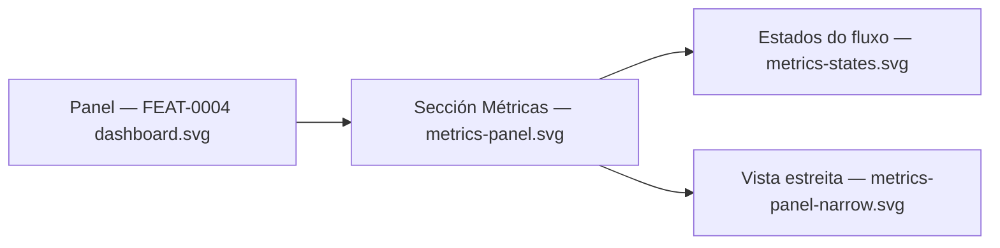

# Visual design — Admin real-time metrics

Static visual mockups for the **Métricas** panel of
[FEAT-0005](../README.md). They render the feature's *UI* section — a live panel on the
existing admin dashboard fed by the `GET /api/admin/metrics` SSE stream
([ADR-0009](../../../architecture/0009-sse-admin-realtime-metrics.md)) — using the
project's Mantine stack
([ADR-0004](../../../architecture/0004-ui-stack-vite-mantine.md)), so
[TASK-0005](../TASK-0005-metrics-ui-panel.md) has a concrete, faithful target.

These are **design artifacts, not code**: hand-authored SVG that mirrors the real
Mantine `AppShell`, `Card`, `Badge` and `SimpleGrid` components with the project theme.
They continue the [FEAT-0004 mockups](../../FEAT-0004-administration-area/design/README.md)
— the dashboard chrome above the metrics section is reproduced unchanged from
`dashboard.svg`, so the panel reads as an addition to that page rather than a new screen.

## Screens

| File | Screen | Shows |
| --- | --- | --- |
| [`metrics-panel.svg`](metrics-panel.svg) | Dashboard with the metrics section | The live (`EN DIRECTO`) state at desktop width, below the FEAT-0004 status cards |
| [`metrics-states.svg`](metrics-states.svg) | Stream states + sparkline anatomy | `CONECTANDO`, `EN DIRECTO` (partial buffer), `RECONECTANDO`, and how a sparkline is drawn |
| [`metrics-panel-narrow.svg`](metrics-panel-narrow.svg) | Same panel at ~420 px | Single-column stacking with the navbar collapsed behind the burger |



## Anatomy of the section

The panel is **not** one big card: it is a section heading plus the same card
vocabulary the dashboard already uses.

- **Section header** — `Métricas en tempo real` (weight 600) with a one-line dimmed
  subtitle, and on the right the **liveness pair**: the arrival time of the last sample
  (`Mostra recibida ás 12:45:07 · cada 5 s`) beside a state `Badge`. The cadence is shown
  because the server chooses it; there is no control to change it, and no manual refresh
  button — the values move on their own.
- **Four stat tiles** (`SimpleGrid cols={{ base: 1, sm: 2, lg: 4 }}`) — heap, system load,
  live threads and HTTP requests. Each is the dashboard's stat-card shape (uppercase
  dimmed label, large value, dimmed caption) with a **sparkline of the client-side
  buffer** at the bottom.
- **Three detail cards** — *Memoria e recolección de lixo* (heap bar, non-heap, GC count
  and time, uptime), *Conexións co almacén de datos* (segmented pool bar with legend), and
  *Actividade HTTP* (totals, errors, error rate). Together with the tiles they cover every
  field of the `RuntimeMetrics` schema in the [OpenAPI document](../../../api/openapi.yaml).
- **Footer notes** — one lock note (no secrets) and one history note (buffer lives in the
  browser only), in the dashboard's icon + dimmed-caption style.

### Sparklines

Each sparkline is a single series, so it carries **no legend and no axes** — the tile's
label names the data. It is drawn as a 2 px `indigo.6` line over an `indigo.0` fill,
anchored to a `gray.1` baseline hairline, with the newest sample marked by a dot ringed in
the surface colour. Hovering a sparkline shows a crosshair and a tooltip with that
sample's time and value (`metrics-states.svg`). The buffer holds the **last 30 samples**;
with fewer samples the line only spans the elapsed part of the box, which is how "the
history is still filling up" is communicated instead of stretching six points across the
full width.

### Stream states

| State | Badge | Values | Sparkline |
| --- | --- | --- | --- |
| Connecting | `gray` `CONECTANDO` | Mantine `Skeleton` placeholders | empty box, `sen historial aínda` |
| Live | `green` `EN DIRECTO` + pulse dot | current sample | indigo, dot on newest sample |
| Reconnecting | `yellow` `RECONECTANDO` | last known values, dimmed | dimmed (`indigo.2`), history kept |

The panel is **never replaced by an error state or hidden** while the stream is down: the
browser's `EventSource` reconnects on its own, so the design keeps the last sample visible
and says when it arrived (`Última mostra ás 12:45:07 · hai 18 s`). `yellow` is the one
token added beyond the FEAT-0004 set — it marks *stale but not broken*, which is neither
green (healthy) nor red (destructive). It is Mantine's stock `yellow`, so no theme change
is needed.

## Design language

Tokens are unchanged from the
[FEAT-0004 design language](../../FEAT-0004-administration-area/design/README.md): primary
`indigo`, radius `md`, page background `gray.0` on white surfaces, borders `gray.3`,
hairlines `gray.1`, body `gray.9`, dimmed `gray.6`, green for healthy. The metrics section
adds only:

- **`indigo.0` (`#edf2ff`)** as the sparkline area fill and **`indigo.2` (`#bac8ff`)** as
  the secondary/stale line and the "idle connections" segment of the pool bar.
- **`yellow`** (`#fff9db` / `#e67700`) for the reconnecting badge.
- Segmented bars leave a **2 px surface gap** between segments so adjacent fills stay
  readable, and the segments are labelled in a legend (`En uso` / `Inactivas` / `Libres`)
  rather than identified by colour alone.

Icons in the shipped panel come from `@tabler/icons-react` (the raw SVG paths here exist
only because these are static artifacts). The state badge's meaning is carried by its
text, not just its colour, and the sparkline is decorative relative to the value it sits
under — the number above it is always the accessible source of truth.

## How the design meets the spec

- **Live updates without refresh ([SPEC-0003](../../../specs/SPEC-0003-administration-area.md) R17):**
  every value in the section comes from the stream; the only affordance in the header is
  the arrival time of the last sample. There is deliberately no refresh button, no date
  range and no cadence selector.
- **Detailed runtime figures (R17, R18):** the tiles and detail cards render the whole
  `RuntimeMetrics` sample — heap and non-heap memory, threads, uptime, GC count and time,
  system load, HTTP request/error counters, and datastore-pool usage.
- **Nothing persisted (R20):** the footer states that the 30-sample history lives in the
  browser and that a reload starts the panel empty; `metrics-states.svg` shows exactly
  that empty starting state. No screen offers a past sample, an export, or a time range.
- **No secrets (R21):** a lock note under the section, and a second one inside the pool
  card, state that only counts are shown — no URL, user or password. The pool card is the
  place a reader would most expect a connection string, so the note sits there too.
- **Admin only (R19):** the section is drawn inside the `ADMIN` navbar's *Panel* screen. A
  `USER` never sees it, but that hiding is cosmetic — the server denies the stream.

## Copy

All copy is Galician and belongs in `ui/src/shared/lib/strings.ts` under
`admin.dashboard.metrics.*` (title, subtitle, the three state labels, the sample-arrival
and cadence captions, every metric label and caption, and the two footer notes). The
mockups are the source for the exact wording; nothing here should be inlined in a
component.

## Regenerating previews

The SVGs are self-contained (no external assets) and open directly in a browser. To
rasterise for review:

```sh
inkscape design/metrics-panel.svg --export-type=png --export-filename=metrics-panel.png -w 1280
```
