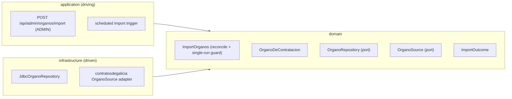

# FEAT-0006. Órganos de Contratación catalogue import

## Goal
Build the backend that imports the list of **Órganos de Contratación** published by
contratosdegalicia.gal and maintains it as the system's own catalogue, per
**[SPEC-0004](../../specs/SPEC-0004-import-manage-organos-contratacion.md)**. It delivers
the source-retrieval adapter, the stored catalogue, the reconciliation rules that keep
administrators' work safe across runs, and the two ways the import is triggered — an
`ADMIN`-only manual endpoint and a recurring scheduler.

It exposes **no user-facing read endpoint**: authenticated users read the catalogue
through FEAT-0007's `GET /api/organos`, which returns each Órgano together with the
taxonomy placement this feature does not yet model. The read ships once, complete, rather
than shipping here without the placement and being widened a feature later.

The design sits in the hexagonal server of
**[ADR-0002](../../architecture/0002-hexagonal-architecture.md)**: the scraper is a
driven adapter behind a port, the scheduler and REST endpoints are driving entry points,
and the Órgano aggregate maps 1:1 to a single table with its own persistence annotations
(**[ADR-0008](../../architecture/0008-domain-entities-carry-persistence-mapping-annotations.md)**).
Outbound retrieval is blocking I/O over virtual threads
(**[ADR-0011](../../architecture/0011-blocking-io-virtual-threads.md)**), the REST
surface lives under the reserved `/api/` prefix
(**[ADR-0006](../../architecture/0006-reserved-api-url-prefix.md)**), is guarded by the
session security of
**[ADR-0005](../../architecture/0005-session-based-authentication.md)**, and is specified
contract-first in the [OpenAPI document](../../api/openapi.yaml)
(**[ADR-0010](../../architecture/0010-design-first-openapi-contract.md)**).

## Scope
- **Domain:** an `OrganoDeContratacion` aggregate — a system-assigned identity (UUID), a
  **stable source key** used to recognise the same body across imports, its name, and an
  active/inactive state — plus the `OrganoRepository` port (read all, look up by source
  key, insert, update in place, set active).
- **Domain (source port):** an `OrganoSource` port returning the flat list of source
  entries (source key, name) as domain values, independent of how they are fetched.
- **Domain (use case):** an `ImportOrganos` use case that pulls from the source and
  **reconciles** it against the repository — add new, refresh existing attributes in
  place, mark absent bodies inactive, reactivate returning ones — idempotently and
  atomically, producing an `ImportOutcome` summary; and a single-run guard so only one
  import executes at a time.
- **Infrastructure:** a migration creating the catalogue table; the Micronaut Data JDBC
  implementation of `OrganoRepository`; and the `OrganoSource` adapter that retrieves and
  parses the published list from contratosdegalicia.gal — embedded, charset ISO-8859-1,
  in the static `portada.jsp` HTML itself — failing cleanly when the source is
  unreachable or its response is unusable.
- **Application (driving):**
  - `POST /api/admin/organos/import` — **`ADMIN`-only**: runs an import and returns its
    outcome (SPEC-0004 R1, R10).
  - a scheduled trigger that runs the import on a recurring interval through the same use
    case and guard (SPEC-0004 R11).

**Out of scope (owned by future features):**
- The **taxonomy of categories, classifying Órganos into it, both authenticated read
  endpoints, and the admin UI** — the read contract of SPEC-0004 R2, R8
  and R9, the admin management tree, the catalogue table, the import-trigger button, and
  the outcome display (SPEC-0004 R1 write ops, R14–R18) — belong to a separate feature,
  *FEAT-0007. Órganos taxonomy & classification*. This feature stops at the stored
  catalogue those screens consume. In particular, **both** authenticated reads —
  `GET /api/organos` and `GET /api/organos/taxonomia` — are FEAT-0007's: a catalogue view
  without the placement would not satisfy R8 anyway, so the read ships with the placement
  rather than here. The `USER`-facing tree of R9 is built later still, as the Órgano filter
  of the contratos list.
- Importing **contracts/tenders** themselves (a different spec), and authentication /
  the `USER`/`ADMIN` roles (delivered by
  [FEAT-0002](../FEAT-0002-user-authentication/README.md)).

## Design

### Hexagonal placement ([ADR-0002](../../architecture/0002-hexagonal-architecture.md))

### Stable identity and reconciliation
- The published source gives each body a **name** and its own numeric id (the `value` of
  its `<option>` in the source's HTML). Reconciliation keys on that id as the **stable
  source key**; the domain treats it as opaque, and the adapter's concern is only how it
  is read off the source. Two source entries with the same source key are the same
  Órgano.
- The system's own identity is a separate UUID assigned on first import; downstream
  references (a future taxonomy placement) point at the UUID, not the source key, so a
  source-side rename never breaks them.
- Reconciliation is **update-in-place, never delete-and-reinsert**: an existing row is
  matched by source key and its name/active fields are updated on the same row. This is
  what preserves everything else attached to that row — critically the **taxonomy
  placement** a later feature will add as a column here — across every re-import (SPEC-0004
  R5, R6). A new source key inserts a new row **starting active**; a stored key missing
  from the source flips `active` to false; a key deactivated that way and later reappearing
  flips it back to true.
- The catalogue table gives `source_key` a **unique** constraint, so idempotency and
  "no duplicates" (SPEC-0004 R7) hold at the store level, not only in use-case logic.

### Import as an atomic, single-run operation
- `ImportOrganos` fetches the **entire** source list first, and only then reconciles,
  within a single transaction. If the fetch fails or yields an unusable response, nothing
  is written — the previously stored catalogue, states, and (future) placements are left
  exactly as they were (SPEC-0004 R13). The catalogue is never partially cleared as a step
  of a run.
- A **single-run guard** ensures at most one import proceeds at a time. A manual trigger
  arriving while any import (manual or scheduled) is in progress does not start a second
  concurrent run; it returns an "already running" outcome rather than duplicating work
  (SPEC-0004 R12). The guard is owned by the use case so both the endpoint and the
  scheduler honour it identically.
- The use case returns an `ImportOutcome`: success/failure and counts of **added**,
  **refreshed**, and **deactivated** bodies (SPEC-0004 R10), plus a distinct "already
  running" result for the guarded case.

### API surface ([ADR-0006](../../architecture/0006-reserved-api-url-prefix.md), [ADR-0010](../../architecture/0010-design-first-openapi-contract.md))
- `POST /api/admin/organos/import` — `@Secured("ADMIN")`: trigger an import; returns the
  `ImportOutcome` (success + added/refreshed/deactivated counts, or "already running").
  A `USER` or anonymous caller gets 403 (SPEC-0004 R1).
- **No read endpoint.** The authenticated read of the catalogue is FEAT-0007's
  `GET /api/organos`, added there because it carries each Órgano's taxonomy placement; an
  Órgano is serialised by exactly one endpoint.
- The contract is authored in [`docs/api/openapi.yaml`](../../api/openapi.yaml) before the
  controller exists, and CI enforces conformance (ADR-0010).

### Scheduled trigger ([ADR-0011](../../architecture/0011-blocking-io-virtual-threads.md))
- A Micronaut `@Scheduled` job in the application module runs the import on a configurable
  schedule — defaulting to **once daily, overnight** (an early-morning run in the source's
  Europe/Madrid time, during off-peak hours) — invoking the **same** `ImportOrganos` use
  case and single-run guard as the endpoint (SPEC-0004 R11). It runs on a dedicated
  single-thread virtual-thread executor, kept separate from the shared HTTP
  request-serving executor, so the outbound fetch and JDBC writes block safely without
  occupying an event-loop thread or constraining request-serving capacity.

## Sequencing (tasks, one small change each)
1. **Órgano domain model + repository port** — the `OrganoDeContratacion` aggregate
   (UUID identity, source key, name, active flag) with its persistence annotations, and
   the `OrganoRepository` port (find all, find by source key, insert, update in place,
   set active). *(SPEC-0004 #3, #8)*
2. **Catalogue store infrastructure** — a migration creating the
   `organo_contratacion` table (UUID id, unique `source_key`, name, `active` default
   true — a newly discovered Órgano starts active) and the Micronaut Data JDBC
   implementation of `OrganoRepository`. *(SPEC-0004 #3, #4, #6, #7)*
3. **Source port + contratosdegalicia adapter** — the `OrganoSource` port and its driven
   adapter that retrieves and parses the published list (ISO-8859-1, embedded in the
   static `portada.jsp`), reading each entry's stable source key off the source's own
   id, and reports a clear failure when the source is unreachable or the response is
   unusable. *(SPEC-0004 #3, #13)*
4. **Import & reconciliation use case** — `ImportOrganos`: fetch-then-reconcile in one
   atomic transaction (add / refresh-in-place / deactivate / reactivate), idempotent,
   with the single-run guard, returning an `ImportOutcome`. *(SPEC-0004 #4, #5, #6, #7,
   #12, #13)*
5. **Import REST endpoint** — OpenAPI-first `POST /api/admin/organos/import`
   (`ADMIN`-only, returns the outcome). *(SPEC-0004 #1, #10, #12)*
6. **Scheduled import trigger** — a `@Scheduled` job running the import on a recurring,
   configurable interval through the same use case and guard. *(SPEC-0004 #11, #12)*
7. **Resilient, self-throttling outbound HTTP client** — the shared client every source
   adapter calls through: retry on transient failures, rate limiting, circuit breaking,
   an identifying `User-Agent`, and `Retry-After` support, per ADR-0014. Adds the
   capability without touching any adapter. *(SPEC-0004 #13)*
8. **Adopt the resilient client in the source adapter** — move the Órganos adapter onto
   that client, count an unusable response against the breaker, and add the ArchUnit rule
   that makes bypassing the policy a build failure. *(SPEC-0004 #3, #13)*

## Edge cases
- **Source unreachable or unusable** — the whole run fails before any write; the stored
  catalogue, states, and placements are unchanged, and the outcome reports failure
  (SPEC-0004 #13). Fetch-all-then-write, in one transaction, makes a partial wipe
  impossible.
- **Implausibly small source response** — a truncated or near-empty list (e.g. a source
  glitch returning a handful of entries) would otherwise mass-deactivate valid bodies via
  the R6 rule. The adapter/use case treats a suspiciously small or empty result as
  **unusable** and fails the run rather than deactivating the catalogue wholesale — a
  refinement of the SPEC-0004 R13 "unusable response" guard, protecting R6 from acting on
  bad data.
- **Body disappears then returns** — an entry absent from one import is marked inactive
  and kept; a later import that includes it again reactivates the **same** row, preserving
  its UUID and placement (SPEC-0004 #6).
- **Name changes at source** — matched by source key and updated in place; the UUID
  identity and any taxonomy placement on that row are untouched (SPEC-0004 #4, #5).
- **Idempotent re-run** — importing the same list twice adds nothing and creates no
  duplicate, enforced by both the reconcile logic and the `source_key` unique constraint
  (SPEC-0004 #7).
- **Concurrent triggers** — a manual trigger overlapping a running import (manual or
  scheduled), or two scheduled ticks overlapping, do not run two imports at once; the
  extra trigger returns "already running" (SPEC-0004 #12).
- **Accented names** — the source is ISO-8859-1; names are decoded and stored without
  mojibake so the catalogue is stable.
- **Nothing here is user-readable** — this feature's only endpoint is the `ADMIN` import
  trigger, denied to a `USER` at the server; the authenticated read that SPEC-0004 #2 and
  #8 call for arrives with FEAT-0007's catalogue endpoint. Until then the catalogue is
  populated but unreadable over HTTP, which is deliberate: both features land before the
  system is user-complete for SPEC-0004 (SPEC-0004 #1, #2).
