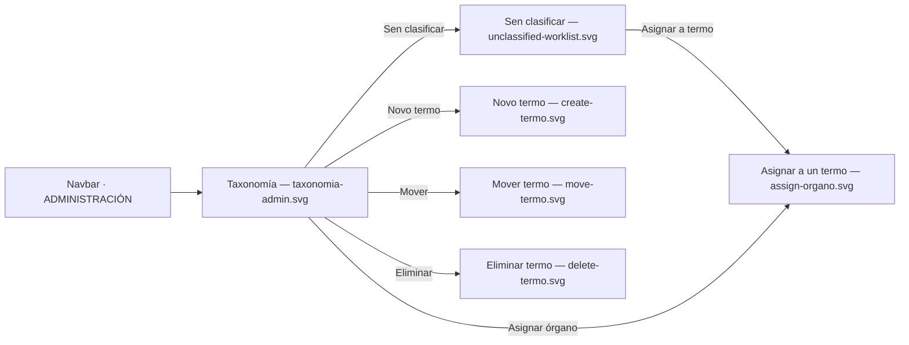

# Visual design — Órganos taxonomía admin UI

Static visual mockups for the `ADMIN`-only **Órganos** section of
[FEAT-0007](../README.md). They render the taxonomy tree, the Órgano catalogue and
unclassified worklist, the term create/rename/move/delete flows — including the two refusal
states — the assign-to-term flow, and the import trigger with its outcome, using the
project's Mantine stack
([ADR-0004](../../../architecture/0004-ui-stack-vite-mantine.md)) so implementation has a
concrete, faithful target.

These are **design artifacts, not code**: hand-authored SVG that mirrors the real
Mantine `AppShell`, `Card`, `Table`, `Badge`, `Button`, `Select` and `Modal` components
with the project theme. They are impl-agnostic reference; the buildable UI is delivered by
four tasks — [TASK-0007](../TASK-0007-organos-section-and-tree-view.md) (section, tree,
states), [TASK-0008](../TASK-0008-taxonomia-management-ui.md) (term management),
[TASK-0009](../TASK-0009-classification-ui.md) (assign/clear and the worklist) and
[TASK-0010](../TASK-0010-import-trigger-ui.md) (import) — each naming the screens above as
its visual target.

## Elements shown here that are deliberately not built

Two rendered details have no contract behind them, and the implementing tasks say so rather
than leaving someone to build against a picture:

- The persistent **"última importación … 42 engadidos · 15 actualizados · 3 desactivados"**
  caption needs a stored last-import read that FEAT-0006 does not expose and SPEC-0004 does
  not require. TASK-0010 ships the post-trigger banner, which is what R10 asks for, and
  omits the caption.
- The **NOVO** badge in `unclassified-worklist.svg` needs a `createdAt` (or
  first-seen) field the Órgano contract does not carry. The worklist itself is the queue;
  the badge is illustration.

## Screens

| File | Screen | Covers |
| --- | --- | --- |
| [`taxonomia-admin.svg`](taxonomia-admin.svg) | Taxonomía tree + a term's Órganos | Tree navigation, term selection, `Quitar do termo` (SPEC-0004 #14, #17) |
| [`unclassified-worklist.svg`](unclassified-worklist.svg) | Sen clasificar worklist + import outcome | The unclassified collection as filing queue, `Asignar a termo`, import success banner and the "already running" annotated state (SPEC-0004 #8, #10, #18) |
| [`create-termo.svg`](create-termo.svg) | Novo termo dialog | `CreateTermo` at root or under a parent (SPEC-0004 #14) |
| [`move-termo.svg`](move-termo.svg) | Mover termo dialog, cycle refusal | `MoveTermo`'s cycle guard shown as an explanatory message (SPEC-0004 #15) |
| [`delete-termo.svg`](delete-termo.svg) | Eliminar termo dialog, blocked by children | `DeleteTermo`'s child-term refusal, plus the allowed empty-term case as an annotation (SPEC-0004 #16) |
| [`assign-organo.svg`](assign-organo.svg) | Asignar a un termo dialog | `AssignOrganoToTermo` / reassignment via a searchable tree picker (SPEC-0004 #17, #18) |



## Design language

The mockups reuse the existing `AppShell` chrome (header + collapsible navbar) from
`ui/src/layout/AppLayout.tsx` and the theme in `ui/src/theme.ts`, and follow the same
tokens, chrome and status semantics documented in
[the administration-area design README](../../../design/administration-area/README.md) —
`indigo` primary, `md` radius, `gray.0`/white surfaces, green/grey/red status
semantics, Galician chrome throughout. The navbar's **ADMINISTRACIÓN** section gains an
**Órganos** entry (a small sitemap glyph) alongside the existing *Panel* and *Usuarios*
links; that gating is cosmetic, `/api/admin/**` is the real gate (feature *edge cases*).

### Layout added by this feature

- **Two-pane admin layout**: a `Taxonomía` tree card (left) and a content card (right)
  that shows whatever is selected in the tree — a real term's Órganos, or the pinned
  **Sen clasificar** entry's worklist. Selecting either is the same interaction; the
  unclassified collection is not a separate screen or admin-only call. It is the
  null-`termoId` slice of the `GET /api/organos` response the section already holds —
  the server has no unclassified endpoint, query or field, and the taxonomy read carries no
  Órganos at all (feature *Design*).
- **Tree rows** show an expand/collapse chevron (root/parent terms) and a count badge;
  the selected term swaps its badge for inline **rename / move / delete** icon actions.
  `Novo termo` at the tree header creates at the root, or under the selected term.
- **Term content header** carries a breadcrumb, the term's action buttons
  (`Renomear`/`Mover`/`Eliminar`/`Asignar órgano`), and a table of its Órganos with a
  `Quitar do termo` action per row — inactive Órganos are dimmed, never removed, per the
  existing table convention.
- **Import**: a toolbar button; triggering it surfaces a success banner with the
  added/refreshed/deactivated counts. `unclassified-worklist.svg` also annotates the
  disabled/"already running" button state in a dashed inset — not a separate screen, since
  it is the same button mid-action. The "última importación" caption beside the button is
  **not built** (see above).

## How the design meets the spec

- **Tree management (#14)** — create at root or under a parent, rename, move, delete are
  all one click from the tree row or the selected term's action bar
  (`taxonomia-admin.svg`, `create-termo.svg`).
- **Cycle guard (#15)** — `move-termo.svg` shows the exact refusal: attempting to move a
  term under its own child renders a red `Alert` naming both terms and explaining why,
  with the primary action disabled rather than a silent no-op. **This is the specified
  behaviour**, and [TASK-0008](../TASK-0008-taxonomia-management-ui.md) follows it: an
  invalid target stays selectable so the refusal can explain itself. Filtering such targets
  out of the picker would be the obvious alternative and is deliberately not taken — it
  makes the rule unreachable through the UI and leaves the admin guessing why a destination
  is missing.
- **Delete rules (#16)** — `delete-termo.svg` shows the blocked case (term has children,
  explanatory alert, disabled primary) and annotates the allowed case (empty term,
  directly-assigned Órganos return to unclassified, delete stays enabled) so both branches
  of the rule are visible in one artifact.
- **Classification (#17, #18)** — `assign-organo.svg`'s tree picker is reachable both from
  a term's `Asignar órgano` action and from a worklist row's `Asignar a termo`, covering
  first assignment and reassignment (the dialog always replaces, never adds, a placement).
  `unclassified-worklist.svg` shows the worklist itself, including a freshly imported,
  still-unclassified Órgano.
- **Import trigger and outcome (#10, #12, #13)** — the toolbar button, the success banner
  and the annotated "already running" button state. Note the mockups show **two** of the
  three outcomes the endpoint returns: there is no `FAILURE` state drawn, and
  [TASK-0010](../TASK-0010-import-trigger-ui.md) must build one anyway — an import that
  fails would otherwise render as a success with zero counts. The mockups are behind the
  contract here, not ahead of it.
- **Galician chrome (SPEC-0001 AC7)** — all labels, empty-state and refusal copy are in
  Galician, consistent with `ui/src/strings.ts`.

## Regenerating previews

The SVGs are self-contained (no external assets) and open directly in a browser. To
rasterise for review:

```sh
inkscape design/taxonomia-admin.svg --export-type=png --export-filename=taxonomy-admin.png -w 1280
```
