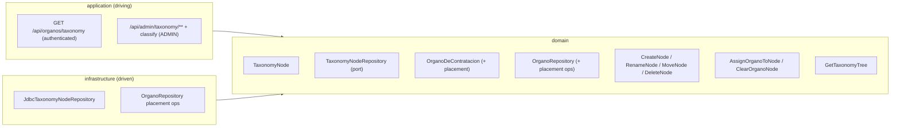

# FEAT-0007. Órganos taxonomy & classification

## Goal
Let administrators organise the imported catalogue into a **multilevel taxonomy** and let
every authenticated user browse it, per
**[SPEC-0004](../../specs/SPEC-0004-import-manage-organos-contratacion.md)** (R1 write
operations, R9, R14–R18, and the taxonomy-placement part of R8). It adds the taxonomy of
category nodes, the single-node classification of Órganos, the unclassified set, and the
two user interfaces: a **read-only Órganos browser** any user opens to explore the tree
and pick an Órgano, and an **admin management** section to build the taxonomy, classify
Órganos, and run imports.

It builds directly on **[FEAT-0006](../FEAT-0006-organos-catalogue-import/README.md)**,
which delivers the stored catalogue, the `GET /api/organos` read endpoint, and the import
trigger this feature's admin UI drives. The backend follows the hexagonal split of
**[ADR-0002](../../architecture/0002-hexagonal-architecture.md)** with the taxonomy
aggregate mapped 1:1 to its table
(**[ADR-0008](../../architecture/0008-domain-entities-carry-persistence-mapping-annotations.md)**);
REST lives under the reserved `/api/` prefix
(**[ADR-0006](../../architecture/0006-reserved-api-url-prefix.md)**), authored
contract-first (**[ADR-0010](../../architecture/0010-design-first-openapi-contract.md)**)
and guarded by session security
(**[ADR-0005](../../architecture/0005-session-based-authentication.md)**). The UI is the
React Router SPA served by the backend
(**[ADR-0003](../../architecture/0003-react-router-ui-served-by-backend.md)**) built with
Vite + Mantine (**[ADR-0004](../../architecture/0004-ui-stack-vite-mantine.md)**), in
Galician.

## Scope
- **Domain (taxonomy):** a `TaxonomyNode` aggregate — UUID identity, name, and an optional
  parent node — forming a tree; a `TaxonomyNodeRepository` port (read the tree, insert,
  rename, re-parent, delete).
- **Domain (placement):** extend the `OrganoDeContratacion` aggregate and
  `OrganoRepository` (from FEAT-0006) with an **optional** taxonomy-node placement, plus
  queries to list Órganos by node and to list the **unclassified** ones.
- **Domain (use cases):** taxonomy management (`CreateNode`, `RenameNode`, `MoveNode` with
  the cycle guard, `DeleteNode` with the child/reassignment rules) and classification
  (`AssignOrganoToNode`, `ClearOrganoNode`), plus a read that assembles the tree with the
  Órganos in each node.
- **Infrastructure:** a migration adding the `taxonomy_node` table (self-referencing
  parent) and a nullable `taxonomy_node_id` on the catalogue table; the Micronaut Data JDBC
  `TaxonomyNodeRepository` and the `OrganoRepository` placement operations.
- **Application (driving):**
  - **Read (any authenticated user):** `GET /api/organos/taxonomy` — the tree of nodes
    with the Órganos in each (SPEC-0004 R2, R9); and the placement field added to the
    `GET /api/organos` catalogue response (SPEC-0004 R8).
  - **Manage (`ADMIN` only):** node create/rename/move/delete, Órgano assign/clear, and
    the unclassified listing (SPEC-0004 R1, R14–R18).
- **UI:**
  - **Órganos browser (any authenticated user):** a main-app section that shows the
    read-only taxonomy tree and the catalogue, from which a user selects an Órgano
    (SPEC-0004 R9). Read-only: no create/rename/move/delete/reassign controls.
  - **Taxonomy admin (`ADMIN` only):** manage the tree (create, rename, move, delete),
    classify Órganos, work the unclassified set, and trigger an import (reusing FEAT-0006's
    endpoint) with its outcome shown (SPEC-0004 R1, R10 surfacing, R14–R18).

**Out of scope (owned by other specs/features):**
- The **contract-query screens** that consume a selected Órgano to filter contracts — a
  future contract-browsing spec/feature. This feature delivers the reusable Órgano
  selector and the browse view; wiring it into contract search is not here.
- **Importing and reconciling** the catalogue and the import endpoint/scheduler — owned by
  [FEAT-0006](../FEAT-0006-organos-catalogue-import/README.md). This feature only *drives*
  the existing import endpoint from the admin UI and *reads* the catalogue it maintains.
- **Multiple placements** for one Órgano — SPEC-0004 R17 fixes single placement; not a
  configurable option here.

## Design

### Hexagonal placement ([ADR-0002](../../architecture/0002-hexagonal-architecture.md))

### Taxonomy as a tree
- A `TaxonomyNode` has a UUID identity, a name, and an **optional parent** — a null parent
  is a root node, so the taxonomy has many roots and any depth (SPEC-0004 R14). The
  self-referencing `parent_id` keeps it a single-table mapping (ADR-0008).
- `MoveNode` enforces the tree invariant: a node cannot be re-parented to **itself or any
  of its descendants**, which would create a cycle; the move is rejected and nothing
  changes (SPEC-0004 R15). Every node has at most one parent by construction.
- `DeleteNode` applies the R16 rules: it is **rejected while the node has child nodes**
  (the admin must move or remove them first); deleting an otherwise-empty node **returns
  any Órganos assigned directly to it to the unclassified set**. Deleting a node never
  deletes an Órgano.

### Placement and classification
- Placement is an **optional** `taxonomy_node_id` on the catalogue row — exactly one node
  or none (SPEC-0004 R17). Because it lives on the Órgano row that FEAT-0006 reconciles
  **in place**, an import never disturbs it (SPEC-0004 R5, R6).
- `AssignOrganoToNode` sets the placement (replacing any current one — never additive);
  `ClearOrganoNode` removes it. An Órgano with no placement is **unclassified**; every
  newly imported Órgano starts there, and the unclassified set is a first-class listing so
  admins can find and file them (SPEC-0004 R18).
- When the target node is deleted, the reassignment rule above returns its Órganos to
  unclassified rather than orphaning them against a missing node.

### API surface ([ADR-0006](../../architecture/0006-reserved-api-url-prefix.md), [ADR-0010](../../architecture/0010-design-first-openapi-contract.md))
- `GET /api/organos/taxonomy` — `@Secured(IS_AUTHENTICATED)`: the tree of nodes with the
  Órganos in each, for the read-only browser (SPEC-0004 R2, R9).
- `GET /api/organos` — the FEAT-0006 catalogue list, its response **extended here** to
  carry each Órgano's placement (node, or unclassified) (SPEC-0004 R8).
- `/api/admin/taxonomy/**` and the Órgano-classification operations — `@Secured("ADMIN")`:
  create/rename/move/delete nodes, assign/clear an Órgano's node, and list the unclassified
  set (SPEC-0004 R1, R14–R18). A `USER` gets 403.
- All contracts are authored in [`docs/api/openapi.yaml`](../../api/openapi.yaml) before the
  controllers, and CI enforces conformance (ADR-0010).

### UI ([ADR-0003](../../architecture/0003-react-router-ui-served-by-backend.md), [ADR-0004](../../architecture/0004-ui-stack-vite-mantine.md))
- **Órganos browser** — a new main-app section (route + nav entry) available to any
  authenticated user: a read-only tree of the taxonomy with the Órganos under each node and
  the catalogue, from which the user selects an Órgano. The selector is built as a reusable
  component so the future contract-query screens can embed it. No mutation controls are
  rendered for a `USER`; the server rules remain the real gate (SPEC-0004 R9).
- **Taxonomy admin** — an `ADMIN`-only section: the tree with create/rename/move/delete
  controls, an assign-to-node action and the unclassified worklist for classifying Órganos,
  and an **import** button that calls FEAT-0006's `POST /api/admin/organos/import` and shows
  the returned outcome (added/refreshed/deactivated, or "already running"). Chrome and
  messages in Galician (SPEC-0001 R6). Admin-only nav gating is cosmetic; `/api/admin/**`
  stays server-gated.

## Sequencing (tasks, one small change each)
1. **Taxonomy node domain model + repository port** — the `TaxonomyNode` aggregate (UUID,
   name, optional parent) and the `TaxonomyNodeRepository` port (read tree, insert, rename,
   re-parent, delete). *(SPEC-0004 #14, #15)*
2. **Taxonomy store infrastructure** — a migration adding the `taxonomy_node` table
   (self-referencing parent) and a nullable `taxonomy_node_id` on the catalogue table; the
   JDBC `TaxonomyNodeRepository` and the `OrganoRepository` placement operations
   (set/clear node, list by node, list unclassified). *(SPEC-0004 #14, #17, #18)*
3. **Taxonomy management use cases** — `CreateNode`, `RenameNode`, `MoveNode` (cycle
   guard), `DeleteNode` (reject with children; return directly-assigned Órganos to
   unclassified). *(SPEC-0004 #14, #15, #16)*
4. **Órgano classification use cases** — `AssignOrganoToNode` (single placement, replaces
   any current), `ClearOrganoNode`, and the unclassified listing. *(SPEC-0004 #17, #18)*
5. **Taxonomy & classification REST endpoints** — OpenAPI-first: read tree
   (`GET /api/organos/taxonomy`, authenticated), the placement field on `GET /api/organos`,
   and the `ADMIN` management + classify + unclassified endpoints under `/api/admin`.
   *(SPEC-0004 #1, #2, #8, #9, #14–#18)*
6. **Órganos browser UI** — a read-only main-app section (tree + catalogue + reusable
   Órgano selector) for any authenticated user. *(SPEC-0004 #2, #8, #9)*
7. **Taxonomy admin UI** — the `ADMIN` section: manage the tree, classify Órganos, work the
   unclassified set, and trigger an import with its outcome. *(SPEC-0004 #1, #10, #14–#18)*

## Edge cases
- **Cycle on move** — re-parenting a node under itself or a descendant is rejected and the
  taxonomy is unchanged (SPEC-0004 #15).
- **Delete a non-empty node** — deletion is rejected while the node has child nodes;
  deleting a node with directly-assigned Órganos returns those Órganos to unclassified and
  deletes no Órgano (SPEC-0004 #16).
- **Import preserves placement** — because placement is a column on the in-place-updated
  catalogue row (FEAT-0006), an Órgano keeps its node across re-imports, and an Órgano gone
  inactive keeps its placement (SPEC-0004 #5, #6).
- **Reassignment is a move, not a copy** — assigning an already-classified Órgano to a new
  node leaves it in only the new node; it is never in two at once (SPEC-0004 #17).
- **Newly imported Órgano is unclassified** — it appears in the unclassified worklist until
  an admin files it (SPEC-0004 #18).
- **Read is read-only for a USER** — the browser renders no mutation controls, and every
  mutation endpoint is `ADMIN`-gated at the server, so a `USER` cannot change the taxonomy
  or a placement even by calling the API directly (SPEC-0004 #1, #9).
- **Concurrent edits to the tree** — two admins moving/deleting overlapping nodes must not
  corrupt the tree or strand a placement against a just-deleted node; node moves/deletes and
  the reassignment they trigger are applied atomically.
