# FEAT-0007. Órganos taxonomy & classification

## Goal
Let administrators organise the imported catalogue into a **multilevel taxonomy**, and
expose that catalogue and taxonomy to any authenticated user as read endpoints, per
**[SPEC-0004](../../specs/SPEC-0004-import-manage-organos-contratacion.md)** (R1 write
operations, the R8 catalogue read, the data R9's tree is built from, and R14–R18). It
adds the taxonomy of category nodes, the single-node classification of Órganos, the two
read endpoints — `GET /api/organos` and `GET /api/taxonomy-nodes` — and one user
interface: an **admin management** section to build the taxonomy, classify Órganos, and
run imports.

Each read returns a **flat list of entities**, not a tree: the catalogue read returns every
Órgano with the id of the node it sits in (or none), and the taxonomy read returns every
node with the id of its parent (or none). Assembling the tree is the **client's** job. The
server never walks the taxonomy, never nests one entity inside another, and never computes
an unclassified set — each response is one table, serialised.

No user-facing Órganos browser is built here. The **admin section below is the first
consumer** of both reads, so each endpoint is exercised end-to-end — fetched, joined,
rendered and re-fetched after every mutation — inside this feature rather than shipping as
an unproven contract. The first **`USER`-facing** consumer is the **Órgano filter of the
contratos list**, delivered by the future contract-querying feature; this feature stops at
the two contracts that filter will call.

It builds directly on **[FEAT-0006](../FEAT-0006-organos-catalogue-import/README.md)**,
which delivers the stored catalogue and the import trigger this feature's admin UI
drives. The backend follows the hexagonal split of
**[ADR-0002](../../architecture/0002-hexagonal-architecture.md)** with the taxonomy
aggregate mapped 1:1 to its table
(**[ADR-0008](../../architecture/0008-domain-entities-carry-persistence-mapping-annotations.md)**);
REST lives under the reserved `/api/` prefix
(**[ADR-0006](../../architecture/0006-reserved-api-url-prefix.md)**), authored
contract-first (**[ADR-0010](../../architecture/0010-design-first-openapi-contract.md)**)
and guarded by session security
(**[ADR-0005](../../architecture/0005-session-based-authentication.md)**). The UI is the
React Router SPA served by the backend
(**[ADR-0003](../../architecture/0003-react-router-ui-served-by-backend.md)**) built with
Vite + Mantine (**[ADR-0004](../../architecture/0004-ui-stack-vite-mantine.md)**), in
Galician.

## Scope
- **Domain (taxonomy):** a `TaxonomyNode` aggregate — UUID identity, name, and an optional
  parent node — forming a tree; a `TaxonomyNodeRepository` port (read every node, insert,
  rename, re-parent, delete).
- **Domain (placement):** extend the `OrganoDeContratacion` aggregate and
  `OrganoRepository` (from FEAT-0006) with an **optional** taxonomy-node placement, plus
  the writes that set and clear it, and the **by-id read** the classification use cases
  need to reject an unknown Órgano (the port has none today — it matches on `sourceKey`).
- **Domain (use cases):** taxonomy management (`CreateNode`, `RenameNode`, `MoveNode` with
  the cycle guard, `DeleteNode` with the child/reassignment rules), classification
  (`AssignOrganoToNode`, `ClearOrganoNode`), and two thin reads — `ListOrganos` and
  `ListTaxonomyNodes` — each a straight whole-table read.
- **Infrastructure:** a migration adding the `taxonomy_node` table (self-referencing
  parent) and a nullable `taxonomy_node_id` on the catalogue table; the Micronaut Data JDBC
  `TaxonomyNodeRepository` and the `OrganoRepository` placement operations.
- **Application (driving):**
  - **Read (any authenticated user):** `GET /api/organos` — every Órgano with its name,
    active state and its `taxonomyNodeId` or null; and `GET /api/taxonomy-nodes` — every
    node with its name and its `parentId` or null. Together they cover the R8 view and carry
    everything an R9 tree needs, though no `USER` tree is rendered here (SPEC-0004 R2, R8).
  - **Manage (`ADMIN` only):** node create/rename/move/delete and Órgano assign/clear
    (SPEC-0004 R1, R14–R18).
- **UI — taxonomy admin (`ADMIN` only):** build the tree in the browser from the two flat
  reads, manage it (create, rename, move, delete), classify Órganos, work the unclassified
  set, and trigger an import (reusing FEAT-0006's endpoint) with its outcome shown
  (SPEC-0004 R1, R10 surfacing, R14–R18). This is the only UI in this feature.

**Out of scope (owned by other specs/features):**
- The **user-facing taxonomy browsing UI** — SPEC-0004 R9's *presentation* for a `USER`.
  There is no Órganos browser section: the tree a user navigates to pick an Órgano is the
  **Órgano filter of the contratos list**, so it is built by the future contract-querying
  feature, against the endpoints delivered here. No reusable Órgano-selector component is
  built in advance — it has no consumer yet, and its shape is the filter's to decide.
  What is in scope is the **data** that tree is built from: the two authenticated reads.
  Because that feature will trace to a **different spec**, SPEC-0004 cannot reach
  `implemented` on the filesystem trace while #9 belongs to nobody — so the deferral is
  recorded in SPEC-0004 itself, next to the criterion, rather than only here where the
  owning spec cannot see it.
  Stated plainly, **SPEC-0004 acceptance criterion #9 is not satisfied by this feature** —
  "a user can browse the taxonomy tree and select an Órgano from it" needs a rendered tree
  offering no management controls, and this feature builds no `USER` surface at all. The
  split makes the gap wider than it was: the server now emits neither the tree nor the
  node→Órgano association, so nothing here can be tested against #9. It is met by the
  contract-querying feature that renders the filter, against these contracts.
- **Server-side tree assembly, filtering, paging or search** over **these two reads**. Both
  return the whole table, unfiltered and unpaged: the catalogue is a few hundred rows and
  the taxonomy fewer, so a client holds both comfortably and re-slices them without a round
  trip. This is a decision about *these two endpoints at this data size*, not a standing
  rule for the API — it deliberately does not bind the contract-querying feature, whose
  volumes are a different order of magnitude and which will decide its own read shape. Were
  it meant to bind every future endpoint, it would need an ADR, which is the bar
  [ADR-0016](../../architecture/0016-rest-resource-naming.md) had to clear.
- The **contract-query screens** themselves — a future contract-browsing spec/feature.
- **Importing and reconciling** the catalogue and the import endpoint/scheduler — owned by
  [FEAT-0006](../FEAT-0006-organos-catalogue-import/README.md). This feature only *drives*
  the existing import endpoint from the admin UI and *reads* the catalogue it maintains.
- **Multiple placements** for one Órgano — SPEC-0004 R17 fixes single placement; not a
  configurable option here.

## Design

### Hexagonal placement ([ADR-0002](../../architecture/0002-hexagonal-architecture.md))

```mermaid
flowchart LR
    subgraph application["application (driving)"]
        organosApi["GET /api/organos (authenticated)"]
        taxonomyApi["GET /api/taxonomy-nodes (authenticated)"]
        manageApi["/api/admin/taxonomy-node(s) + /api/admin/organo/&#123;id&#125;/taxonomy-node (ADMIN)"]
    end
    subgraph domain["domain"]
        node["TaxonomyNode"]
        nodeRepo["TaxonomyNodeRepository (port)"]
        organo["OrganoDeContratacion (+ placement)"]
        organoRepo["OrganoRepository (+ placement ops)"]
        manageUC["CreateNode / RenameNode / MoveNode / DeleteNode"]
        classifyUC["AssignOrganoToNode / ClearOrganoNode"]
        readUC["ListOrganos / ListTaxonomyNodes"]
    end
    subgraph infrastructure["infrastructure (driven)"]
        jdbcNode["JdbcTaxonomyNodeRepository"]
        jdbcOrgano["OrganoRepository placement ops"]
    end
    application --> domain
    infrastructure --> domain
```

### Taxonomy as a tree
- A `TaxonomyNode` has a UUID identity, a name, and an **optional parent** — a null parent
  is a root node, so the taxonomy has many roots and any depth (SPEC-0004 R14). The
  self-referencing `parent_id` keeps it a single-table mapping (ADR-0008).
- `MoveNode` enforces the tree invariant: a node cannot be re-parented to **itself or any
  of its descendants**, which would create a cycle; the move is rejected and nothing
  changes (SPEC-0004 R15). Every node has at most one parent by construction.
- `DeleteNode` applies the R16 rules: it is **rejected while the node has child nodes**
  (the admin must move or remove them first); deleting an otherwise-empty node **returns
  any Órganos assigned directly to it to the unclassified set**. Deleting a node never
  deletes an Órgano.

**Node names.** A name is required and must be non-blank once trimmed; it is stored
trimmed, capped at 255 characters to match the column, and **siblings may not share a
name** (case-insensitively) — the tree is navigated by name and two identical children of
one parent are indistinguishable to the admin reading it. Roots count as siblings of each
other. The same rule applies to a create, a rename, and the re-parent that moves a node
next to a new set of siblings. Names are *not* globally unique: the same node name under
two different parents is legitimate and common. Validation is rejected at the edge with
`@NotBlank`/`@Size` on the request record (the `CreateUserRequest` precedent) and the
sibling rule in the use case, where the repository read it needs lives — backed by a unique
index on `(parent_id, lower(name))` so a concurrent create cannot slip past a check-then-write.
The index needs `NULLS NOT DISTINCT` to cover the roots, whose `parent_id` is null.

### Placement and classification
- Placement is an **optional** `taxonomy_node_id` on the catalogue row — exactly one node
  or none (SPEC-0004 R17). Because it lives on the Órgano row that FEAT-0006 reconciles
  **in place**, an import never disturbs it (SPEC-0004 R5, R6).
- `AssignOrganoToNode` sets the placement (replacing any current one — never additive);
  `ClearOrganoNode` removes it. An Órgano with no placement is **unclassified**; every
  newly imported Órgano starts there.
- **Unclassified is a null, not a collection.** The server has no unclassified endpoint,
  query or response field: an Órgano whose `taxonomyNodeId` is null *is* unclassified, and
  it arrives in `GET /api/organos` like every other. Clients filter for it — the admin
  worklist and any future user view are both `taxonomyNodeId == null` over a list they
  already hold. R8 and R18 are met by the catalogue read carrying the placement, so nothing
  in the catalogue is unreachable and no Órgano can go missing between two collections
  (SPEC-0004 R8, R18).
- When the target node is deleted, the reassignment rule above returns its Órganos to
  unclassified rather than orphaning them against a missing node.

**How the placement is cleared on delete — decided here, not in a task.** The foreign key
on `organo_contratacion.taxonomy_node_id` is declared with **no `ON DELETE` action** (so
PostgreSQL's default `NO ACTION`), and `DeleteNode` clears the placements itself in the
same transaction as the delete. The clearing is a domain rule with a use case that owns it
and a port operation that expresses it, so putting it in the schema would state the same
rule twice and let a future caller delete a node without going through `DeleteNode`.
Declining `ON DELETE SET NULL` costs nothing and buys a loud failure: with `NO ACTION`, a
delete that skipped the clearing raises a constraint violation instead of silently
unclassifying rows nobody meant to touch. `ON DELETE CASCADE` is forbidden outright — it
would delete Órganos, which R16 prohibits. The migration in
[TASK-0001](TASK-0001-taxonomy-node-domain-model-and-placement.md) writes the foreign key
this way; no later task revisits it.

### API surface ([ADR-0006](../../architecture/0006-reserved-api-url-prefix.md), [ADR-0010](../../architecture/0010-design-first-openapi-contract.md), [ADR-0016](../../architecture/0016-rest-resource-naming.md))
Two reads, each `@Secured(IS_AUTHENTICATED)`, each a **flat list of one entity type**:

- `GET /api/organos` — every stored Órgano: `id`, `name`, `active`, and `taxonomyNodeId`
  (null when unclassified). This is the R8 catalogue view: name, state, and placement or
  the absence of one, for every Órgano (SPEC-0004 R2, R8).
- `GET /api/taxonomy-nodes` — every taxonomy node: `id`, `name`, and `parentId` (null for
  a root). No Órganos, no nesting — this is the data an R9 tree is built from, not the tree
  (SPEC-0004 R2).

**Why `/api/taxonomy-nodes` and not `/api/organos/taxonomy`.** This feature is the reason
[ADR-0016](../../architecture/0016-rest-resource-naming.md) exists: the taxonomy read was
first drafted as `GET /api/organos/taxonomy`, which parks a *different* resource exactly
where `/api/organos`' member path `/api/organos/{id}` has to go — forcing every client to
special-case one literal segment and reserving `"taxonomy"` against ever being an Órgano
id. The nodes are their own collection and get their own plural path. Under ADR-0010 the
contract is authoritative and CI-enforced, so this is free to fix now and a breaking change
once published.

**Why two flat reads rather than one tree.** Each response is exactly one table's rows,
so the server does no assembly at all: no descendant walk, no grouping, no unclassified
partition, no recursive DTO to serialise. The client joins the two by id — the same join
it must do anyway to re-render after every create, move or reassign, and one it does over
data already in memory instead of by re-fetching an assembled tree. The two lists are also
independently cacheable and independently useful: the contratos filter needs the tree, an
Órgano picker or an admin table needs the catalogue, and neither pays for the other's
shape. The cost is that the client owns tree-building and the two responses can be a beat
apart (see *Edge cases*) — accepted deliberately, because the join is a handful of lines
in the browser against recursive assembly and a nested contract on the server.

**Neither response promises an order.** Each is `findAll()` serialised, and PostgreSQL
guarantees no stable order without an `ORDER BY`; the contract says so explicitly rather
than letting clients infer one from what they happen to observe. **Presentation order is
the client's**, decided with the rest of the presentation: the admin section sorts nodes
and Órganos by name with locale-aware collation (`localeCompare`, Galician locale), which
is what keeps the tree from reshuffling on the refetch that follows every mutation. Sorting
in the browser also keeps accented Galician names correct without depending on the
database's collation configuration. Should a future consumer need a server-side order, it
is added as an explicit contract change.

**The edge is stored once.** `taxonomyNodeId` on the Órgano and `parentId` on the node
each mirror a column exactly; no response repeats an edge from the other side (a node
never lists its children or its Órganos), so no two fields can disagree and the serialiser
has nothing to keep in step.

Six `@Secured("ADMIN")` operations, named here rather than left as a `/api/admin/**`
wildcard — the paths *are* the decision, and leaving them as prose in a task is exactly how
the collision above happened the first time (SPEC-0004 R1, R14–R18):

| Operation | Path |
| --- | --- |
| Create a node (root or under a parent) | `POST /api/admin/taxonomy-nodes` |
| Rename a node | `PATCH /api/admin/taxonomy-node/{id}` |
| Move a node (re-parent, or to the root) | `PUT /api/admin/taxonomy-node/{id}/parent` |
| Delete a node | `DELETE /api/admin/taxonomy-node/{id}` |
| Place an Órgano in a node | `PUT /api/admin/organo/{id}/taxonomy-node` |
| Clear an Órgano's placement | `DELETE /api/admin/organo/{id}/taxonomy-node` |

Note that the two classification operations sit under `/api/admin/organo/{id}/…`, **not**
under a taxonomy path — they change the Órgano, not the node, so a security rule shaped
around `/api/admin/taxonomy-node/**` would miss them entirely. A `USER` gets 403 on all
six. There is no admin-specific listing: an admin manages the same two lists every
authenticated caller receives, and files from the ones whose `taxonomyNodeId` is null
(SPEC-0004 R18).

**Success responses, fixed here for the same reason the paths are.** A path with no
declared success shape is half a decision, and under ADR-0010 the contract is what CI
enforces:

| Operation | Success | Body |
| --- | --- | --- |
| `GET /api/organos` | 200 | array of `{id, name, active, taxonomyNodeId}` |
| `GET /api/taxonomy-nodes` | 200 | array of `{id, name, parentId}` |
| `POST /api/admin/taxonomy-nodes` | 201 | the created node — **the id is required**: the UI selects and expands the new node without a refetch |
| `PATCH /api/admin/taxonomy-node/{id}` | 200 | the updated node |
| `PUT /api/admin/taxonomy-node/{id}/parent` | 204 | none |
| `DELETE /api/admin/taxonomy-node/{id}` | 204 | none |
| `PUT /api/admin/organo/{id}/taxonomy-node` | 204 | none |
| `DELETE /api/admin/organo/{id}/taxonomy-node` | 204 | none |

Two request bodies carry a single field each: `{parentId}` on the move (null meaning
*at the root*) and `{taxonomyNodeId}` on the placement. A **null `parentId` is a value, not
an omission** — the contract must distinguish "move to the root" from "field absent", or
moving a node out to the root becomes unexpressible.

**Why a null-`parentId` `PUT` for the move but a `DELETE` for the placement**, side by side
in one table: re-parenting and moving-to-the-root are one use case (`MoveNode`) with one
argument that happens to be nullable, so splitting them across two methods would make every
client branch on null to call the same operation. Assign and clear are two use cases with
different rules — clear is idempotent, assign is not — so they get two methods.

**Failure contract.** Refusals are RFC 9457 `application/problem+json`, matching the
`urn:conxugal:problem-type:duplicate-email` precedent already in the contract. Status alone
cannot carry the distinction the admin UI must render — a cycle and a
blocked-by-children delete are both 409 — so each rejection gets its own `type`:

| Problem type | Status | Raised by |
| --- | --- | --- |
| `urn:conxugal:problem-type:taxonomy-node-not-found` | 404 | any operation naming an unknown node |
| `urn:conxugal:problem-type:organo-not-found` | 404 | assign/clear naming an unknown Órgano |
| `urn:conxugal:problem-type:taxonomy-cycle` | 409 | a move onto the node itself or a descendant |
| `urn:conxugal:problem-type:taxonomy-node-has-children` | 409 | a delete of a node with child nodes |
| `urn:conxugal:problem-type:duplicate-sibling-name` | 409 | a create/rename/move colliding with a sibling name |

**Who declares each exception.** The four node-scoped types are
[TASK-0003](TASK-0003-taxonomy-management-use-cases.md)'s, in `domain.taxonomy`.
`organo-not-found` is **[TASK-0004](TASK-0004-organo-classification-use-cases.md)'s**, in
`domain.organo` — it is about an Órgano, and putting it in the taxonomy package to satisfy
"one owner" would misfile it. What TASK-0004 must not do is declare a *second*
unknown-**node** type; that one it reuses. Five types, five distinct statuses-plus-`type`
pairs, no duplicates.

**The database backstops must reach the same contract.** Two refusals can arrive as
constraint violations rather than as a use case's own check — the unique index when two
creates race, and the placement foreign key when an assign races a delete. Left alone,
Micronaut Data raises a `DataAccessException` and the caller gets a **500**, which is
exactly what the admin surface promises never to do. So the **JDBC adapter
([TASK-0002](TASK-0002-taxonomy-store-infrastructure.md)) translates them**: a unique-index
violation on `(parent_id, lower(name))` becomes the duplicate-sibling-name exception, and a
foreign-key violation on `taxonomy_node_id` becomes the node-not-found one. Translating in
the adapter is what keeps the mapping honest under ADR-0002 — the exception types are the
domain's, the SQLSTATE knowledge stays in `infrastructure`, and the controllers need no
special case for "the same refusal, but raced".

- **Every operation carries the rate-limit contract** of
  [ADR-0012](../../architecture/0012-rate-limit-http-contract.md): the three `RateLimit-*`
  response headers on success and the shared `TooManyRequests` 429 response. This is not
  optional decoration — `.vacuum.yaml`'s ruleset fails `openapi-lint` without it, so all
  eight operations would be red on first push. The same ruleset (`vacuum:owasp`) also
  requires 400, 401 and 500 to be declared; `listUsers` is the worked example already in
  the contract.
- **Each refusal status must say which `type`s it can carry.** The shared `Error` schema
  has no `type` enum, so a 409 documented as just "conflict" leaves a generated client
  unable to tell a cycle from a duplicate name — which is precisely the distinction the
  five types exist to make. Enumerate them per operation.
- All contracts are authored in [`docs/api/openapi.yaml`](../../api/openapi.yaml) before the
  controllers, and CI enforces conformance (ADR-0010).

### UI ([ADR-0003](../../architecture/0003-react-router-ui-served-by-backend.md), [ADR-0004](../../architecture/0004-ui-stack-vite-mantine.md), [ADR-0015](../../architecture/0015-frontend-feature-based-shared-core-modularization.md))
- **Taxonomy admin** — the only UI here, an `ADMIN`-only section: the tree with create/rename/move/delete
  controls, an assign-to-node action and the unclassified worklist for classifying Órganos,
  and an **import** button that calls FEAT-0006's `POST /api/admin/organos/import` and shows
  the returned outcome. Chrome and messages in Galician (SPEC-0001 AC7). Admin-only nav
  gating is cosmetic; `/api/admin/**` stays server-gated. The visual target is the mockup
  set in [`design/`](design/README.md).
- **Tree assembly lives in the client** — the section fetches both lists and builds the tree
  in one pass: group nodes by `parentId` (null → root), group Órganos by `taxonomyNodeId`,
  and the null bucket is the unclassified worklist. It is a **pure function** of the two
  arrays, kept out of the components and unit-tested on its own, so a mutation re-renders by
  re-running it over refreshed data rather than by asking the server for a new shape.
- **No `USER` section** — a `USER` gains no new route or nav entry from this feature. They
  reach the catalogue and taxonomy only through the two reads, and will see them rendered
  when the contratos-list filter arrives.

**The import outcome is three-way, not two.** FEAT-0006's `ImportOutcome.Status` is
`SUCCESS`, `FAILURE` and `ALREADY_RUNNING`, and `ImportOrganos` **returns** a failure rather
than throwing — so a failed import can arrive with the same HTTP status as a successful one
and all-zero counts. Rendered as a success, a source outage would read *0 engadidos · 0
actualizados · 0 desactivados*: the most misleading possible report, and a silent failure of
SPEC-0004 R13's "the import reports failure". The section therefore distinguishes all three,
and treats a transport error as a fourth, local case. This depends on FEAT-0006's import
endpoint declaring the discriminator in its contract —
[TASK-0010](TASK-0010-import-trigger-ui.md) is blocked until it does.

**Where the code lands ([ADR-0015](../../architecture/0015-frontend-feature-based-shared-core-modularization.md)).**
That ADR is accepted and left its migration to "whichever feature or maintenance task picks
this up"; this is the first UI work since, so the feature answers it explicitly rather than
letting whoever types first decide. **New code follows the ADR layout; the existing tree is
not migrated here.** The section is a slice at `ui/src/features/organos/`, exposing one
`index.ts` barrel, owning its own components, API calls and local state, and importing
nothing from `routes/admin/`. `ui/src/api/`, `ui/src/commons/` and `ui/src/routes/admin/`
stay exactly where they are.

The trade-off is taken with open eyes: `ui/src` is left a **hybrid** of two layouts, and
because the old tree is untouched, `eslint-plugin-boundaries` is *not* wired up either —
there is nothing coherent for it to enforce yet, so the new slice's boundary rests on review
until the migration lands. The full migration and the lint wiring remain unowned, and this
feature does not claim them: they are still follow-up work for a maintenance task or the
next frontend feature, which will find one slice already in the target shape rather than
none.

**Three files move down, and they are the ones that carry behaviour.** The ADR's own trigger
for promoting a file is a second consumer appearing, and that is exactly what this slice is:

- **`ErrorAlert` → `shared/ui/`**, for the failed-fetch case below. It also gains the retry
  affordance it does not have today.
- **`httpClient.ts` (`apiFetch`, `HttpError`) and `httpError.ts` → `shared/lib/`**, with
  `api/queryClient.ts` repointed at the new location. This is not tidiness. The single
  `QueryClient` wired in `main.tsx` keys **both** of its cross-cutting policies on
  `error instanceof HttpError`: the retry policy, and the redirect to `/login` on a 401. A
  slice that honoured "import nothing from `api/`" by rolling its own error type would get
  three blind retries on every failed read whatever the status — slow enough to mask the
  failed-fetch state this feature designs so carefully — and would **silently lose the
  session-expiry redirect**. Exactly one `HttpError` class may exist in the app.

Three files is still not the migration, and ADR-0015 already lists all three under
`shared/ui/` and `shared/lib/`. Nothing else moves.

**The slice reads `problem+json`.** The five problem types exist so the UI can tell a cycle
from a blocked delete, and both are 409 — but `apiFetch` today throws away the response body
and the only existing refusal precedent keys on the status. So `shared/lib/` also gains a
`ProblemError` carrying `type`, `status` and `detail`, parsed from an
`application/problem+json` body and falling back to the plain `HttpError` behaviour when the
body is not one. Without it, every refusal message in TASK-0008 and TASK-0009 is
unimplementable as specified, and whoever picks up the first of those would invent the
plumbing mid-task for the other to find or duplicate. It is delivered by
[TASK-0007](TASK-0007-organos-section-and-tree-view.md) with the rest of the slice's HTTP
module.

## Sequencing (tasks, one small change each)
1. **[TASK-0001](TASK-0001-taxonomy-node-domain-model-and-placement.md) — Taxonomy node
   domain model + Órgano placement + schema migration** *(backend)*: the `TaxonomyNode`
   aggregate (UUID, name, optional parent) and the `TaxonomyNodeRepository` port (find all,
   find by id, insert, rename, re-parent, delete, child check, children-of-parent,
   `lockTaxonomy`), the placement field on `OrganoDeContratacion` and the matching
   `OrganoRepository` operations including the by-id read, **and the migration** adding the
   `taxonomy_node` table (self-referencing parent), the nullable `taxonomy_node_id` on the
   catalogue table and the sibling-name unique index. Under ADR-0008 the entity carries its
   own mapping, so widening the record without its column would break FEAT-0006's existing
   queries — model and schema move together or the task lands red.
   *(SPEC-0004 #5, #6, #8, #14, #15, #17, #18)*
2. **[TASK-0002](TASK-0002-taxonomy-store-infrastructure.md) — Taxonomy store
   infrastructure** *(backend)*: the JDBC `TaxonomyNodeRepository` (including
   `lockTaxonomy`) and the translation of the two constraint violations into domain
   exceptions, against the schema TASK-0001 created. Both repositories are bare derived
   interfaces, so Micronaut Data generates most method bodies from the port — this task's
   work is the two `@Query` operations that cannot derive, the translation layer, and
   proving the rest against a real database. Every endpoint task depends on it: without the
   adapter there is nothing for an HTTP integration test to run against.
   *(SPEC-0004 #14, #16, #17)*
3. **[TASK-0003](TASK-0003-taxonomy-management-use-cases.md) — Taxonomy management use
   cases** *(backend)*: `CreateNode`, `RenameNode`, `MoveNode` (cycle guard), `DeleteNode`
   (reject with children; return directly-assigned Órganos to unclassified), the serialising
   lock, the sibling-name rule, and **the rejection exceptions the whole feature shares**.
   *(SPEC-0004 #14, #15, #16)*
4. **[TASK-0004](TASK-0004-organo-classification-use-cases.md) — Órgano classification &
   catalogue reads** *(backend)*: `AssignOrganoToNode` (single placement, replaces any
   current), `ClearOrganoNode`, and the two thin reads `ListOrganos` / `ListTaxonomyNodes`.
   Depends on TASK-0003 for the shared exceptions. *(SPEC-0004 #17, #18)*
5. **[TASK-0005](TASK-0005-taxonomy-read-endpoints.md) — Taxonomy & catalogue read
   endpoints** *(backend)*: OpenAPI-first — the two authenticated reads, `GET /api/organos`
   with each Órgano's `taxonomyNodeId` and `GET /api/taxonomy-nodes` with each node's
   `parentId`. Also depends on TASK-0002 — an HTTP integration test needs a real adapter
   underneath. *(SPEC-0004 #2 access-control half, #8)*
6. **[TASK-0006](TASK-0006-taxonomy-admin-endpoints.md) — Taxonomy management &
   classification endpoints** *(backend)*: the six `ADMIN` operations, the problem-type
   contract for each refusal, and the `ADMIN` gate. Split from the reads because it is a
   different security posture, a different half of the contract, and six operations against
   two. *(SPEC-0004 #1, #14–#18)*
7. **[TASK-0007](TASK-0007-organos-section-and-tree-view.md) — Órganos section + tree view**
   *(frontend)*: the route, nav entry and `features/organos/` slice; the three promoted
   `shared/` files and the `ProblemError` reader; the slice's HTTP module and the refetch
   hook the later tasks call; the section chrome — tree card and node-content card — as
   containers with empty action rows; the pure tree builder over the two reads; the loading,
   empty, failed-fetch and dangling-id states; name ordering; and the unclassified worklist
   **rendered**. Read-only — no mutation controls.
   *(SPEC-0004 #1 nav gating, #8, #14, #18; SPEC-0001 AC6, AC7)*
8. **[TASK-0008](TASK-0008-taxonomy-management-ui.md) — Taxonomy management UI**
   *(frontend)*: create, rename, move and delete from the tree — filling the action row
   TASK-0007 left empty — with the cycle and blocked-by-children refusals shown as distinct
   explanatory messages. *(SPEC-0004 #14, #15, #16; SPEC-0001 AC7)*
9. **[TASK-0009](TASK-0009-classification-ui.md) — Classification UI** *(frontend)*: the
   assign-to-node picker, the clear action, and the **actions on** the unclassified worklist
   TASK-0007 already renders — plus the invariant that it stays in step after every
   assignment. *(SPEC-0004 #8 inactive display, #17, #18; SPEC-0001 AC7)*
10. **[TASK-0010](TASK-0010-import-trigger-ui.md) — Import trigger UI** *(frontend)*: the
    import button driving FEAT-0006's endpoint, and all three outcomes — success counts,
    failure, and "already running". *(SPEC-0004 #10 surfacing, #12, #13 admin-facing half,
    #18; SPEC-0001 AC7)*

**Why the UI is four tasks.** The mockups in [`design/`](design/README.md) cover six
screens; built as one task it would be the largest change in the repo by some margin — more
than the whole of today's `ui/src` — and its acceptance criteria would span tree assembly,
four mutation flows, two refusal states, a picker, a worklist and an import. FEAT-0004
already set the precedent of splitting a UI feature (shell and nav apart from the page
inside it), and the seams here are the mockups' own.

**TASK-0007 owns everything the other three share**, which is what makes them genuinely
parallel rather than nominally so: the slice and its barrel, the HTTP module including the
`problem+json` reader, the refetch hook, the section chrome with its empty action rows, and
the builder. TASK-0008 to TASK-0010 then add controls into structure that already exists,
and none of them needs anything from another. Left unassigned, those five surfaces would be
built by whichever of the three was picked up first — unreviewed, and either duplicated or
retrofitted by the next.

Two more shared decisions land in TASK-0007 for the same reason: the slice's **strings**
(the nav label has to go in `ui/src/strings.ts`, which `nav.ts` reads, while the section's
own copy stays in the slice — so it is a split, not a choice), and the **two node pickers**.
TASK-0008's move picker and TASK-0009's assign picker are *different controls* — one
excludes the node and its descendants and offers "at the root", the other is searchable and
always replaces — so they are two components by design, not an accident to be refactored
away later.

## Edge cases
- **Cycle on move** — re-parenting a node under itself or a descendant is rejected and the
  taxonomy is unchanged (SPEC-0004 #15).
- **Delete a non-empty node** — deletion is rejected while the node has child nodes;
  deleting a node with directly-assigned Órganos returns those Órganos to unclassified and
  deletes no Órgano (SPEC-0004 #16).
- **Import preserves placement** — because placement is a column on the in-place-updated
  catalogue row (FEAT-0006), an Órgano keeps its node across re-imports, and an Órgano gone
  inactive keeps its placement (SPEC-0004 #5, #6). Both halves are proven in
  [TASK-0001](TASK-0001-taxonomy-node-domain-model-and-placement.md), against the
  reconciliation write paths it must leave alone.
- **Reassignment is a move, not a copy** — assigning an already-classified Órgano to a new
  node leaves it in only the new node; it is never in two at once (SPEC-0004 #17).
- **Newly imported Órgano is unclassified** — it arrives in `GET /api/organos` with a null
  `taxonomyNodeId` until an admin files it, so it is visible to users and lands in the admin
  worklist without a second call (SPEC-0004 #8, #18).
- **Read is read-only for a USER** — every mutation endpoint is `ADMIN`-gated at the
  server, so a `USER` calling the API directly cannot change the taxonomy or a placement;
  they can only issue the two `GET`s. With no `USER` UI here, the server gate is the whole
  story; #9's "offers no controls" clause has no surface to bind until the filter is built
  (SPEC-0004 #1).
- **Empty taxonomy** — until an admin creates the first node, `GET /api/taxonomy-nodes`
  returns an **empty array** while `GET /api/organos` returns the entire catalogue with
  every `taxonomyNodeId` null. That is the normal state right after the first import, not a
  degenerate one, and the split makes it trivially correct: the catalogue read does not
  depend on a node existing (SPEC-0004 #8).
- **One read fails while the other succeeds** — the split makes this reachable for the first
  time: a 500 or a timeout on the taxonomy read leaves the client holding an empty node list,
  which the tolerance rule above would happily render as *the entire catalogue is
  unclassified* — pixel-identical to the legitimate empty-taxonomy state, and an admin would
  watch their taxonomy apparently vanish. A failed fetch must therefore never be rendered as
  an empty result: the section shows an error with a retry, and distinguishes "the taxonomy
  is empty" from "the taxonomy could not be loaded". The same holds if the catalogue read is
  the one that fails.
- **The two reads can disagree** — they are separate requests, so an admin's create, move or
  delete can land between them and a client can see an Órgano whose `taxonomyNodeId` names a
  node absent from the taxonomy list it holds (or a node whose Órganos it fetched a moment
  earlier). This is the price of the split. The **client** absorbs it: an unresolvable
  `taxonomyNodeId` is rendered as unclassified rather than dropped or crashed on, and a
  refresh re-fetches both. No Órgano can disappear from view, because the catalogue read is
  the one that lists them and it never depends on the taxonomy read.
- **Concurrent edits to the tree** — two admins moving/deleting overlapping nodes must not
  corrupt the tree or leave a placement pointing at a deleted node **in the database**. A
  dangling id in a *client's* pair of responses is the transient case above, not a stored
  one. Two guarantees, with different mechanisms:
  - **No cycle, ever.** A transaction alone does not deliver this: at PostgreSQL's default
    `READ COMMITTED`, two concurrent moves can each walk a tree that is still acyclic, each
    pass the guard, and jointly create a cycle — and no foreign key can catch it, unlike
    the delete cases the FKs do backstop. So **tree-shape mutations serialise**: `MoveNode`
    and `DeleteNode` call a `lockTaxonomy()` port operation before reading and hold it
    through the write. The port keeps the domain free of the mechanism
    ([ADR-0002](../../architecture/0002-hexagonal-architecture.md)); the JDBC adapter
    implements it as a transaction-scoped PostgreSQL advisory lock. These are rare,
    admin-initiated
    operations over a table of a few dozen rows, so serialising them outright costs nothing
    measurable and is far easier to reason about than retrying serialisation failures.
  - **No stored dangling placement.** `DeleteNode`'s delete and the placement clearing it
    triggers run in **one transaction**, and the non-cascading foreign key above is the
    backstop if that clearing is ever skipped. `AssignOrganoToNode` racing a `DeleteNode`
    is settled by the same lock plus the foreign key: the assign either commits before the
    delete (and is cleared by it) or fails against the vanished node.
  - **The transaction is part of the decision, not an implementation detail.** A
    transaction-scoped advisory lock taken with no ambient transaction is acquired and
    released inside its own statement: it serialises nothing, and it looks identical to a
    working lock in every single-threaded test. So `MoveNode` and `DeleteNode` carry
    `@Transactional` on the use-case method — the boundary the repo already uses for
    `SetUserEnabled` and `CreateUser` — and the lock, the reads and the writes all sit
    inside it. This is also what makes `DeleteNode`'s delete-plus-clearing atomic. It is
    proven the way `SetUserEnabledConcurrencyIntegrationTest` proves its equivalent:
    driving the injected use case from concurrent threads against a real database. A
    unit test against a test double cannot tell a held lock from a released one.
  - **A `MoveNode` racing a `DeleteNode` of its target parent** is settled by the same
    lock: whichever commits first, the second re-reads under the lock and either moves
    under a node that still exists or fails to find it.
  - Concurrent *classification* of two different Órganos does not serialise — they are
    independent row updates that cannot interact, and taking the tree lock for them would
    make the admin worklist needlessly sequential.
