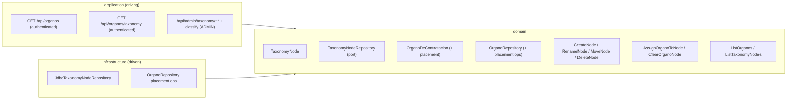

# FEAT-0007. Órganos taxonomy & classification

## Goal
Let administrators organise the imported catalogue into a **multilevel taxonomy**, and
expose that catalogue and taxonomy to any authenticated user as read endpoints, per
**[SPEC-0004](../../specs/SPEC-0004-import-manage-organos-contratacion.md)** (R1 write
operations, the R8 catalogue read, the data R9's tree is built from, and R14–R18). It
adds the taxonomy of category nodes, the single-node classification of Órganos, the two
read endpoints — `GET /api/organos` and `GET /api/organos/taxonomy` — and one user
interface: an **admin management** section to build the taxonomy, classify Órganos, and
run imports.

Each read returns a **flat list of entities**, not a tree: the catalogue read returns every
Órgano with the id of the node it sits in (or none), and the taxonomy read returns every
node with the id of its parent (or none). Assembling the tree is the **client's** job. The
server never walks the taxonomy, never nests one entity inside another, and never computes
an unclassified set — each response is one table, serialised.

No user-facing Órganos browser is built here. The **admin section below is the first
consumer** of both reads, so each endpoint is exercised end-to-end — fetched, joined,
rendered and re-fetched after every mutation — inside this feature rather than shipping as
an unproven contract. The first **`USER`-facing** consumer is the **Órgano filter of the
contratos list**, delivered by the future contract-querying feature; this feature stops at
the two contracts that filter will call.

It builds directly on **[FEAT-0006](../FEAT-0006-organos-catalogue-import/README.md)**,
which delivers the stored catalogue and the import trigger this feature's admin UI
drives. The backend follows the hexagonal split of
**[ADR-0002](../../architecture/0002-hexagonal-architecture.md)** with the taxonomy
aggregate mapped 1:1 to its table
(**[ADR-0008](../../architecture/0008-domain-entities-carry-persistence-mapping-annotations.md)**);
REST lives under the reserved `/api/` prefix
(**[ADR-0006](../../architecture/0006-reserved-api-url-prefix.md)**), authored
contract-first (**[ADR-0010](../../architecture/0010-design-first-openapi-contract.md)**)
and guarded by session security
(**[ADR-0005](../../architecture/0005-session-based-authentication.md)**). The UI is the
React Router SPA served by the backend
(**[ADR-0003](../../architecture/0003-react-router-ui-served-by-backend.md)**) built with
Vite + Mantine (**[ADR-0004](../../architecture/0004-ui-stack-vite-mantine.md)**), in
Galician.

## Scope
- **Domain (taxonomy):** a `TaxonomyNode` aggregate — UUID identity, name, and an optional
  parent node — forming a tree; a `TaxonomyNodeRepository` port (read every node, insert,
  rename, re-parent, delete).
- **Domain (placement):** extend the `OrganoDeContratacion` aggregate and
  `OrganoRepository` (from FEAT-0006) with an **optional** taxonomy-node placement, plus
  the writes that set and clear it.
- **Domain (use cases):** taxonomy management (`CreateNode`, `RenameNode`, `MoveNode` with
  the cycle guard, `DeleteNode` with the child/reassignment rules), classification
  (`AssignOrganoToNode`, `ClearOrganoNode`), and two thin reads — `ListOrganos` and
  `ListTaxonomyNodes` — each a straight whole-table read.
- **Infrastructure:** a migration adding the `taxonomy_node` table (self-referencing
  parent) and a nullable `taxonomy_node_id` on the catalogue table; the Micronaut Data JDBC
  `TaxonomyNodeRepository` and the `OrganoRepository` placement operations.
- **Application (driving):**
  - **Read (any authenticated user):** `GET /api/organos` — every Órgano with its name,
    active state and its `taxonomyNodeId` or null; and `GET /api/organos/taxonomy` — every
    node with its name and its `parentId` or null. Together they cover the R8 view and carry
    everything an R9 tree needs, though no `USER` tree is rendered here (SPEC-0004 R2, R8).
  - **Manage (`ADMIN` only):** node create/rename/move/delete and Órgano assign/clear
    (SPEC-0004 R1, R14–R18).
- **UI — taxonomy admin (`ADMIN` only):** build the tree in the browser from the two flat
  reads, manage it (create, rename, move, delete), classify Órganos, work the unclassified
  set, and trigger an import (reusing FEAT-0006's endpoint) with its outcome shown
  (SPEC-0004 R1, R10 surfacing, R14–R18). This is the only UI in this feature.

**Out of scope (owned by other specs/features):**
- The **user-facing taxonomy browsing UI** — SPEC-0004 R9's *presentation* for a `USER`.
  There is no Órganos browser section: the tree a user navigates to pick an Órgano is the
  **Órgano filter of the contratos list**, so it is built by the future contract-querying
  feature, against the endpoints delivered here. No reusable Órgano-selector component is
  built in advance — it has no consumer yet, and its shape is the filter's to decide.
  What is in scope is the **data** that tree is built from: the two authenticated reads.
  Stated plainly, **SPEC-0004 acceptance criterion #9 is not satisfied by this feature** —
  "a user can browse the taxonomy tree and select an Órgano from it" needs a rendered tree
  offering no management controls, and this feature builds no `USER` surface at all. The
  split makes the gap wider than it was: the server now emits neither the tree nor the
  node→Órgano association, so nothing here can be tested against #9. It is met by the
  contract-querying feature that renders the filter, against these contracts.
- **Server-side tree assembly, filtering, paging or search** over either read. Both return
  the whole table, unfiltered and unpaged: the catalogue is a few hundred rows and the
  taxonomy fewer, so a client holds both comfortably and re-slices them without a round
  trip. If a future consumer needs filtering, it is designed then, against a real
  requirement.
- The **contract-query screens** themselves — a future contract-browsing spec/feature.
- **Importing and reconciling** the catalogue and the import endpoint/scheduler — owned by
  [FEAT-0006](../FEAT-0006-organos-catalogue-import/README.md). This feature only *drives*
  the existing import endpoint from the admin UI and *reads* the catalogue it maintains.
- **Multiple placements** for one Órgano — SPEC-0004 R17 fixes single placement; not a
  configurable option here.

## Design

### Hexagonal placement ([ADR-0002](../../architecture/0002-hexagonal-architecture.md))

### Taxonomy as a tree
- A `TaxonomyNode` has a UUID identity, a name, and an **optional parent** — a null parent
  is a root node, so the taxonomy has many roots and any depth (SPEC-0004 R14). The
  self-referencing `parent_id` keeps it a single-table mapping (ADR-0008).
- `MoveNode` enforces the tree invariant: a node cannot be re-parented to **itself or any
  of its descendants**, which would create a cycle; the move is rejected and nothing
  changes (SPEC-0004 R15). Every node has at most one parent by construction.
- `DeleteNode` applies the R16 rules: it is **rejected while the node has child nodes**
  (the admin must move or remove them first); deleting an otherwise-empty node **returns
  any Órganos assigned directly to it to the unclassified set**. Deleting a node never
  deletes an Órgano.

### Placement and classification
- Placement is an **optional** `taxonomy_node_id` on the catalogue row — exactly one node
  or none (SPEC-0004 R17). Because it lives on the Órgano row that FEAT-0006 reconciles
  **in place**, an import never disturbs it (SPEC-0004 R5, R6).
- `AssignOrganoToNode` sets the placement (replacing any current one — never additive);
  `ClearOrganoNode` removes it. An Órgano with no placement is **unclassified**; every
  newly imported Órgano starts there.
- **Unclassified is a null, not a collection.** The server has no unclassified endpoint,
  query or response field: an Órgano whose `taxonomyNodeId` is null *is* unclassified, and
  it arrives in `GET /api/organos` like every other. Clients filter for it — the admin
  worklist and any future user view are both `taxonomyNodeId == null` over a list they
  already hold. R8 and R18 are met by the catalogue read carrying the placement, so nothing
  in the catalogue is unreachable and no Órgano can go missing between two collections
  (SPEC-0004 R8, R18).
- When the target node is deleted, the reassignment rule above returns its Órganos to
  unclassified rather than orphaning them against a missing node.

### API surface ([ADR-0006](../../architecture/0006-reserved-api-url-prefix.md), [ADR-0010](../../architecture/0010-design-first-openapi-contract.md))
Two reads, each `@Secured(IS_AUTHENTICATED)`, each a **flat list of one entity type**:

- `GET /api/organos` — every stored Órgano: `id`, `name`, `active`, and `taxonomyNodeId`
  (null when unclassified). This is the R8 catalogue view: name, state, and placement or
  the absence of one, for every Órgano (SPEC-0004 R2, R8).
- `GET /api/organos/taxonomy` — every taxonomy node: `id`, `name`, and `parentId` (null for
  a root). No Órganos, no nesting — this is the data an R9 tree is built from, not the tree
  (SPEC-0004 R2).

**Why two flat reads rather than one tree.** Each response is exactly one table's rows,
so the server does no assembly at all: no descendant walk, no grouping, no unclassified
partition, no recursive DTO to serialise. The client joins the two by id — the same join
it must do anyway to re-render after every create, move or reassign, and one it does over
data already in memory instead of by re-fetching an assembled tree. The two lists are also
independently cacheable and independently useful: the contratos filter needs the tree, an
Órgano picker or an admin table needs the catalogue, and neither pays for the other's
shape. The cost is that the client owns tree-building and the two responses can be a beat
apart (see *Edge cases*) — accepted deliberately, because the join is a handful of lines
in the browser against recursive assembly and a nested contract on the server.

**Neither response promises an order.** Each is `findAll()` serialised, and PostgreSQL
guarantees no stable order without an `ORDER BY`; the contract says so explicitly rather
than letting clients infer one from what they happen to observe. **Presentation order is
the client's**, decided with the rest of the presentation: the admin section sorts nodes
and Órganos by name with locale-aware collation (`localeCompare`, Galician locale), which
is what keeps the tree from reshuffling on the refetch that follows every mutation. Sorting
in the browser also keeps accented Galician names correct without depending on the
database's collation configuration. Should a future consumer need a server-side order, it
is added as an explicit contract change.

**The edge is stored once.** `taxonomyNodeId` on the Órgano and `parentId` on the node
each mirror a column exactly; no response repeats an edge from the other side (a node
never lists its children or its Órganos), so no two fields can disagree and the serialiser
has nothing to keep in step.

- `/api/admin/taxonomy/**` and the Órgano-classification operations — `@Secured("ADMIN")`:
  create/rename/move/delete nodes and assign/clear an Órgano's node (SPEC-0004 R1,
  R14–R18). A `USER` gets 403. There is no admin-specific listing: an admin manages the
  same two lists every authenticated caller receives, and files from the ones whose
  `taxonomyNodeId` is null (SPEC-0004 R18).
- All contracts are authored in [`docs/api/openapi.yaml`](../../api/openapi.yaml) before the
  controllers, and CI enforces conformance (ADR-0010).

### UI ([ADR-0003](../../architecture/0003-react-router-ui-served-by-backend.md), [ADR-0004](../../architecture/0004-ui-stack-vite-mantine.md))
- **Taxonomy admin** — the only UI here, an `ADMIN`-only section: the tree with create/rename/move/delete
  controls, an assign-to-node action and the unclassified worklist for classifying Órganos,
  and an **import** button that calls FEAT-0006's `POST /api/admin/organos/import` and shows
  the returned outcome (added/refreshed/deactivated, or "already running"). Chrome and
  messages in Galician (SPEC-0001 R6). Admin-only nav gating is cosmetic; `/api/admin/**`
  stays server-gated.
- **Tree assembly lives in the client** — the section fetches both lists and builds the tree
  in one pass: group nodes by `parentId` (null → root), group Órganos by `taxonomyNodeId`,
  and the null bucket is the unclassified worklist. It is a **pure function** of the two
  arrays, kept out of the components and unit-tested on its own, so a mutation re-renders by
  re-running it over refreshed data rather than by asking the server for a new shape.
- **No `USER` section** — a `USER` gains no new route or nav entry from this feature. They
  reach the catalogue and taxonomy only through the two reads, and will see them rendered
  when the contratos-list filter arrives.

## Sequencing (tasks, one small change each)
1. **[TASK-0001](TASK-0001-taxonomy-node-domain-model-and-placement.md) — Taxonomy node
   domain model + Órgano placement** *(backend)*: the `TaxonomyNode` aggregate (UUID, name,
   optional parent) and the `TaxonomyNodeRepository` port (find all, find by id, insert,
   rename, re-parent, delete, child check), plus the placement field on
   `OrganoDeContratacion` and the matching `OrganoRepository` operations.
   *(SPEC-0004 #14, #15, #17, #18)*
2. **[TASK-0002](TASK-0002-taxonomy-store-infrastructure.md) — Taxonomy store
   infrastructure** *(backend)*: a migration adding the `taxonomy_node` table
   (self-referencing parent) and a nullable `taxonomy_node_id` on the catalogue table; the
   JDBC `TaxonomyNodeRepository` and the `OrganoRepository` placement operations (set/clear
   an Órgano's node, clear every placement pointing at a node).
   *(SPEC-0004 #5, #14, #16, #17)*
3. **[TASK-0003](TASK-0003-taxonomy-management-use-cases.md) — Taxonomy management use
   cases** *(backend)*: `CreateNode`, `RenameNode`, `MoveNode` (cycle guard), `DeleteNode`
   (reject with children; return directly-assigned Órganos to unclassified).
   *(SPEC-0004 #14, #15, #16)*
4. **[TASK-0004](TASK-0004-organo-classification-use-cases.md) — Órgano classification &
   catalogue reads** *(backend)*: `AssignOrganoToNode` (single placement, replaces any
   current), `ClearOrganoNode`, and the two thin reads `ListOrganos` / `ListTaxonomyNodes`.
   *(SPEC-0004 #17, #18)*
5. **[TASK-0005](TASK-0005-taxonomy-and-classification-rest-endpoints.md) — Taxonomy &
   classification REST endpoints** *(backend)*: OpenAPI-first — the two authenticated reads
   (`GET /api/organos` with each Órgano's `taxonomyNodeId`, `GET /api/organos/taxonomy` with
   each node's `parentId`) and the `ADMIN` management + classify endpoints under
   `/api/admin`. *(SPEC-0004 #1, #2, #8, #14–#18)*
6. **[TASK-0006](TASK-0006-taxonomy-admin-ui.md) — Taxonomy admin UI** *(frontend)*: the
   `ADMIN` section — build the tree from the two reads, manage it, classify Órganos, work
   the unclassified set, and trigger an import with its outcome.
   *(SPEC-0004 #1, #8, #10, #14–#18; SPEC-0001 #6)*

## Edge cases
- **Cycle on move** — re-parenting a node under itself or a descendant is rejected and the
  taxonomy is unchanged (SPEC-0004 #15).
- **Delete a non-empty node** — deletion is rejected while the node has child nodes;
  deleting a node with directly-assigned Órganos returns those Órganos to unclassified and
  deletes no Órgano (SPEC-0004 #16).
- **Import preserves placement** — because placement is a column on the in-place-updated
  catalogue row (FEAT-0006), an Órgano keeps its node across re-imports, and an Órgano gone
  inactive keeps its placement (SPEC-0004 #5, #6).
- **Reassignment is a move, not a copy** — assigning an already-classified Órgano to a new
  node leaves it in only the new node; it is never in two at once (SPEC-0004 #17).
- **Newly imported Órgano is unclassified** — it arrives in `GET /api/organos` with a null
  `taxonomyNodeId` until an admin files it, so it is visible to users and lands in the admin
  worklist without a second call (SPEC-0004 #8, #18).
- **Read is read-only for a USER** — every mutation endpoint is `ADMIN`-gated at the
  server, so a `USER` calling the API directly cannot change the taxonomy or a placement;
  they can only issue the two `GET`s. With no `USER` UI here, the server gate is the whole
  story; #9's "offers no controls" clause has no surface to bind until the filter is built
  (SPEC-0004 #1).
- **Empty taxonomy** — until an admin creates the first node, `GET /api/organos/taxonomy`
  returns an **empty array** while `GET /api/organos` returns the entire catalogue with
  every `taxonomyNodeId` null. That is the normal state right after the first import, not a
  degenerate one, and the split makes it trivially correct: the catalogue read does not
  depend on a node existing (SPEC-0004 #8).
- **One read fails while the other succeeds** — the split makes this reachable for the first
  time: a 500 or a timeout on the taxonomy read leaves the client holding an empty node list,
  which the tolerance rule above would happily render as *the entire catalogue is
  unclassified* — pixel-identical to the legitimate empty-taxonomy state, and an admin would
  watch their taxonomy apparently vanish. A failed fetch must therefore never be rendered as
  an empty result: the section shows an error with a retry, and distinguishes "the taxonomy
  is empty" from "the taxonomy could not be loaded". The same holds if the catalogue read is
  the one that fails.
- **The two reads can disagree** — they are separate requests, so an admin's create, move or
  delete can land between them and a client can see an Órgano whose `taxonomyNodeId` names a
  node absent from the taxonomy list it holds (or a node whose Órganos it fetched a moment
  earlier). This is the price of the split. The **client** absorbs it: an unresolvable
  `taxonomyNodeId` is rendered as unclassified rather than dropped or crashed on, and a
  refresh re-fetches both. No Órgano can disappear from view, because the catalogue read is
  the one that lists them and it never depends on the taxonomy read.
- **Concurrent edits to the tree** — two admins moving/deleting overlapping nodes must not
  corrupt the tree or leave a placement pointing at a deleted node **in the database**; node
  moves/deletes and the reassignment they trigger are applied atomically. A dangling id in a
  *client's* pair of responses is the transient case above, not a stored one.
