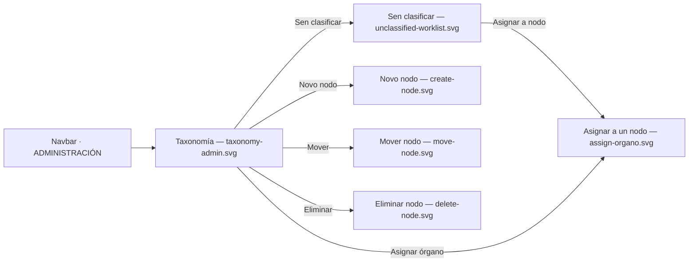

# Visual design — Órganos taxonomy admin UI

Static visual mockups for [TASK-0006](../TASK-0006-taxonomy-admin-ui.md)'s `ADMIN`-only
**Órganos** section of [FEAT-0007](../README.md). They render the taxonomy tree, the
Órgano catalogue and unclassified worklist, the node create/rename/move/delete flows —
including the two refusal states — the assign-to-node flow, and the import trigger with
its outcome, using the project's Mantine stack
([ADR-0004](../../../architecture/0004-ui-stack-vite-mantine.md)) so implementation has a
concrete, faithful target.

These are **design artifacts, not code**: hand-authored SVG that mirrors the real
Mantine `AppShell`, `Card`, `Table`, `Badge`, `Button`, `Select` and `Modal` components
with the project theme. They are impl-agnostic reference; the buildable UI is delivered
by TASK-0006.

## Screens

| File | Screen | Covers |
| --- | --- | --- |
| [`taxonomy-admin.svg`](taxonomy-admin.svg) | Taxonomy tree + a node's Órganos | Tree navigation, node selection, `Quitar do nodo` (SPEC-0004 #14, #17) |
| [`unclassified-worklist.svg`](unclassified-worklist.svg) | Sen clasificar worklist + import outcome | The unclassified collection as filing queue, `Asignar a nodo`, import success banner and the "already running" annotated state (SPEC-0004 #8, #10, #18) |
| [`create-node.svg`](create-node.svg) | Novo nodo dialog | `CreateNode` at root or under a parent (SPEC-0004 #14) |
| [`move-node.svg`](move-node.svg) | Mover nodo dialog, cycle refusal | `MoveNode`'s cycle guard shown as an explanatory message (SPEC-0004 #15) |
| [`delete-node.svg`](delete-node.svg) | Eliminar nodo dialog, blocked by children | `DeleteNode`'s child-node refusal, plus the allowed empty-node case as an annotation (SPEC-0004 #16) |
| [`assign-organo.svg`](assign-organo.svg) | Asignar a un nodo dialog | `AssignOrganoToNode` / reassignment via a searchable tree picker (SPEC-0004 #17, #18) |



## Design language

The mockups reuse the existing `AppShell` chrome (header + collapsible navbar) from
`ui/src/layout/AppLayout.tsx` and the theme in `ui/src/theme.ts`, and follow the same
tokens, chrome and status semantics documented in
[FEAT-0004's design README](../../FEAT-0004-administration-area/design/README.md) —
`indigo` primary, `md` radius, `gray.0`/white surfaces, green/grey/red status
semantics, Galician chrome throughout. The navbar's **ADMINISTRACIÓN** section gains an
**Órganos** entry (a small sitemap glyph) alongside the existing *Panel* and *Usuarios*
links; that gating is cosmetic, `/api/admin/**` is the real gate (feature *edge cases*).

### Layout added by this feature

- **Two-pane admin layout**: a `Taxonomía` tree card (left) and a content card (right)
  that shows whatever is selected in the tree — a real node's Órganos, or the pinned
  **Sen clasificar** entry's worklist. Selecting either is the same interaction; the
  unclassified collection is not a separate screen or admin-only call, it travels
  alongside the tree in the same `GET /api/organos/taxonomy` response (feature *Design*).
- **Tree rows** show an expand/collapse chevron (root/parent nodes) and a count badge;
  the selected node swaps its badge for inline **rename / move / delete** icon actions.
  `Novo nodo` at the tree header creates at the root, or under the selected node.
- **Node content header** carries a breadcrumb, the node's action buttons
  (`Renomear`/`Mover`/`Eliminar`/`Asignar órgano`), and a table of its Órganos with a
  `Quitar do nodo` action per row — inactive Órganos are dimmed, never removed, per the
  existing table convention.
- **Import**: a toolbar button beside a persistent "última importación" caption
  (counts, timestamp); triggering it surfaces a success banner with the same counts.
  `unclassified-worklist.svg` also annotates the disabled/"already running" button state
  in a dashed inset — not a separate screen, since it is the same button mid-action.

## How the design meets the spec

- **Tree management (#14)** — create at root or under a parent, rename, move, delete are
  all one click from the tree row or the selected node's action bar
  (`taxonomy-admin.svg`, `create-node.svg`).
- **Cycle guard (#15)** — `move-node.svg` shows the exact refusal: attempting to move a
  node under its own child renders a red `Alert` naming both nodes and explaining why,
  with the primary action disabled rather than a silent no-op.
- **Delete rules (#16)** — `delete-node.svg` shows the blocked case (node has children,
  explanatory alert, disabled primary) and annotates the allowed case (empty node,
  directly-assigned Órganos return to unclassified, delete stays enabled) so both branches
  of the rule are visible in one artifact.
- **Classification (#17, #18)** — `assign-organo.svg`'s tree picker is reachable both from
  a node's `Asignar órgano` action and from a worklist row's `Asignar a nodo`, covering
  first assignment and reassignment (the dialog always replaces, never adds, a placement).
  `unclassified-worklist.svg` shows the worklist itself, including a freshly imported,
  still-unclassified Órgano.
- **Import trigger and outcome (#10)** — the toolbar button, the persistent last-outcome
  caption, the success banner, and the annotated "already running" button state together
  cover every outcome TASK-0006 must surface.
- **Galician chrome (SPEC-0001 #6)** — all labels, empty-state and refusal copy are in
  Galician, consistent with `ui/src/strings.ts`.

## Regenerating previews

The SVGs are self-contained (no external assets) and open directly in a browser. To
rasterise for review:

```sh
inkscape design/taxonomy-admin.svg --export-type=png --export-filename=taxonomy-admin.png -w 1280
```
