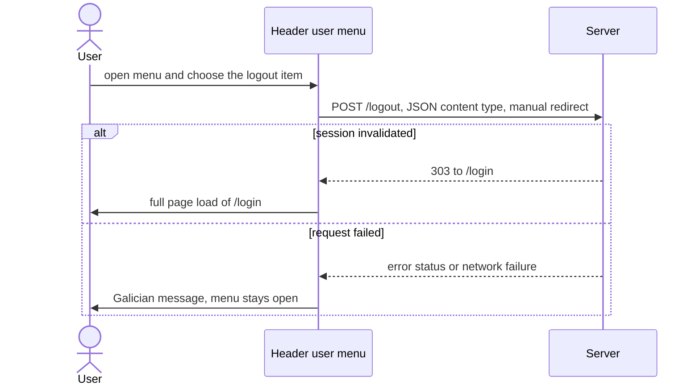

# FEAT-0008. In-app session menu

## Goal
Give an authenticated user a discoverable way to end their session from inside the
SPA, satisfying **[SPEC-0002](../../specs/SPEC-0002-user-authentication.md)** R15 and
criterion #12. The header's user block becomes a dropdown whose single item logs out.

The **session mechanism is already decided and built**
(**[ADR-0005](../../architecture/0005-session-based-authentication.md)**): a
server-side session behind a cookie, ended by `POST /logout`, which redirects to the
server-rendered `/login`. That endpoint, and the SPA's 401-on-session-loss redirect,
were delivered by
[FEAT-0002](../FEAT-0002-user-authentication/TASK-0005-logout-and-spa-401-handling.md)
and are not revisited here. What is missing is purely the affordance: until now the
only logout control in the product was on the server-rendered forbidden page, so a
user inside the app could only get out by waiting for the 30-minute idle timeout or
discarding their cookie. This feature is therefore a UI slice, placed in the app shell
per **[ADR-0015](../../architecture/0015-frontend-feature-based-shared-core-modularization.md)**
and built with the stack from
**[ADR-0004](../../architecture/0004-ui-stack-vite-mantine.md)**, served from the
single origin established by
**[ADR-0003](../../architecture/0003-react-router-ui-served-by-backend.md)**.

## Scope
- **UI — chrome:** the header user block becomes a Mantine `Menu`; its trigger stays
  present at every viewport width, and its dropdown names the signed-in account and
  offers one logout item.
- **UI — action:** the client-side call to `POST /logout` and the full-page navigation
  to `/login` that follows it, placed beside the existing session read in
  `shared/entities/currentUser.ts`.
- **UI — copy:** the Galician labels and failure message, in `shared/lib/strings.ts`.

**Out of scope (already delivered or owned elsewhere):**
- `POST /logout` itself, session invalidation, and the 401-on-XHR contract — owned by
  [FEAT-0002](../FEAT-0002-user-authentication/README.md), specifically
  [TASK-0005](../FEAT-0002-user-authentication/TASK-0005-logout-and-spa-401-handling.md),
  which stays `done`. No backend or configuration change belongs to this feature.
- Any account or profile screen. The dropdown holds exactly one item; adding "my
  account" would need a screen no spec asks for yet.
- A general CSRF-token seam for the SPA. Worth naming as a known follow-up: the whole
  SPA, including this logout, relies on the CSRF filter gating form-shaped requests
  only. If that is ever tightened to cover JSON, every SPA mutation breaks together
  and wants one shared fix, not a logout-specific one.
- Server-side session listing or "log out everywhere". Sessions are single-cookie
  today; a multi-session view would need its own spec requirement.

## Design

The screens are mocked in [`design/`](design/README.md): the open menu over the admin
dashboard, the same header at 360 px with the initials-only trigger, and the trigger and
item states — rest, hover/focus, in flight and failed — with the keyboard path.

### Trigger and placement ([ADR-0015](../../architecture/0015-frontend-feature-based-shared-core-modularization.md))
The user menu is **app-shell chrome, not a feature slice.** It lives at
`app/layout/UserMenu.tsx` next to `AppLayout.tsx`, and reads the session through
`shared/entities/currentUser.ts`. `app` importing `shared/entities` is a legal downward
edge; a `features/session/` slice would be the wrong shape for chrome the shell owns,
and `eslint-plugin-boundaries` enforces the direction either way.

Today's header renders the email, role label and initials avatar as a plain group that
is hidden below the `sm` breakpoint. That block becomes the menu trigger, with one
change: **only the email/role text keeps the breakpoint, not the whole group.** Below
`sm` the trigger survives as an initials-only button. Without this, logout would be
unreachable on a narrow viewport, which SPEC-0002 #12 forbids.

The dropdown repeats the email and role label as an identity header. That is redundant
beside a desktop trigger which already shows both, and deliberately so: on a narrow
viewport it is the *only* place the account is named, and R15 requires the account to
be identifiable wherever the control is.

### Ending the session ([ADR-0005](../../architecture/0005-session-based-authentication.md))
The request shape is constrained from two directions, and the obvious implementations
fail on both:

- **A plain HTML `form` post to `/logout` — the shape the server-rendered forbidden
  page uses — returns 403 from the SPA.** CSRF is enabled globally and the filter
  rejects form- and multipart-shaped state changes that carry no token. Only Thymeleaf
  views receive a token; the SPA's `index.html` gets none. The request must therefore
  carry a **JSON content type**, which the filter does not gate — the same reason the
  existing admin mutations work without a token.
- **The shared `apiFetch` helper cannot be used.** It sets `Accept: application/json`
  and throws on a non-ok response. `fetch` follows the `303` to `GET /login`, which is
  HTML-only, so an `application/json` request there answers **406** — turning a
  logout that actually succeeded into an error.

So the call posts a JSON content type with `redirect: 'manual'`, and treats **any
status below 400 as success**. That covers all three shapes the same response can take:
the opaque redirect a browser reports for an unfollowed `303`, the `303` itself, and the
`200` a followed redirect or a test double produces.

On success the browser leaves the SPA with a full-page load of `/login`, mirroring the
existing session-loss navigation. The React Query cache is **not** cleared first: the
page unloads regardless, and clearing it would refetch active queries against a session
that no longer exists, producing a 401 and a second redirect racing the first.

### Reporting failure
The action runs as a mutation, so a **401 is picked up by the shared session-loss
handler** already wired into the query client — correct behaviour, since a 401 means the
session was gone before the user clicked, and it redirects exactly once.

Any other failure keeps the user where they are and shows a Galician message in the
still-open dropdown. Redirecting optimistically would be wrong: the server-rendered
login page bounces an authenticated visitor straight back to the app, so a user whose
logout failed would be thrown into a confusing round trip instead of being told.

## Sequencing (tasks, one small change each)
1. **[TASK-0001](TASK-0001-session-logout-action.md)** —
   The session logout action and its navigation, beside the existing session read.
   *(frontend)* *(SPEC-0002 #7)*
2. **[TASK-0002](TASK-0002-header-user-menu.md)** —
   The header user menu: dropdown trigger, identity header, logout item and Galician
   copy. *(frontend)* *(SPEC-0002 #12)*

## Edge cases
- **Narrow viewport** — the trigger must not inherit the breakpoint that hides the
  email/role text, or logout becomes unreachable below `sm` (SPEC-0002 #12).
- **Already-expired session** — clicking logout when the session is already gone
  yields a 401; the shared session-loss handler redirects, and it must fire once, not
  once per handler.
- **Failed logout** — a 5xx or network failure must not navigate. The login page
  redirects an authenticated visitor back to the app, so an optimistic redirect would
  loop the user rather than inform them.
- **Repeat clicks** — the item is disabled while the request is in flight, so an
  impatient double-click cannot fire two logouts or two navigations.
- **Duplicated identity text** — the email and role appear in both the trigger and the
  open dropdown; component tests must scope their queries rather than assume a single
  match, and the existing header assertions must keep passing.
