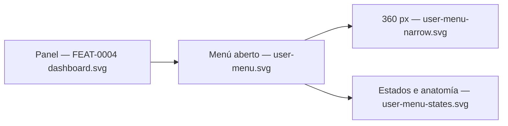

# Visual design — In-app session menu

Static visual mockups for the header **user menu** of [FEAT-0008](../README.md). They
render the feature's *Design* section — the header user block turned into a Mantine
`Menu` whose single item ends the session — using the project's Mantine stack
([ADR-0004](../../../architecture/0004-ui-stack-vite-mantine.md)), so
[TASK-0002](../TASK-0002-header-user-menu.md) has a concrete, faithful target.

These are **design artifacts, not code**: hand-authored SVG that mirrors the real
Mantine `AppShell`, `UnstyledButton`, `Menu` and `Avatar` components with the project
theme. They continue the [FEAT-0004 mockups](../../FEAT-0004-administration-area/design/README.md)
— the shell and the screen underneath are reproduced unchanged, so the menu reads as a
change to existing chrome rather than a new screen. The feature adds **no route and no
screen**; every mockup here is the same admin dashboard with the header behaving
differently.

## Screens

| File | Screen | Shows |
| --- | --- | --- |
| [`user-menu.svg`](user-menu.svg) | Header menu open, desktop | The trigger in its open state and the dropdown floating over the dashboard |
| [`user-menu-narrow.svg`](user-menu-narrow.svg) | Same header at 360 px | Closed and open side by side: initials-only trigger, dropdown naming the account |
| [`user-menu-states.svg`](user-menu-states.svg) | Trigger + item states, anatomy, keyboard | Rest / hover / open / below-`sm`, and idle / active / in-flight / failed |



## Anatomy

The menu is **not** a new surface vocabulary: it is the existing header user block made
pressable, plus a Mantine `Menu.Dropdown` on the card surface the rest of the product
already uses.

- **Trigger** — an `UnstyledButton` wrapping the email/role stack, the `initialsOf`
  avatar and a chevron. The chevron is the only added mark, and it exists because
  nothing else in the header says "this opens something". It inverts when open. Hover
  and keyboard focus give the same `gray.1` background, so a pointer user and a keyboard
  user see the same control.
- **Identity header** — the account email (`gray.9`) over the role label (`gray.6`),
  inside the dropdown. On a desktop trigger this repeats what is already visible;
  see *Why the identity is repeated* below.
- **Divider** — a `gray.2` hairline, separating "who you are" from "what you can do".
- **One item** — a leading `IconLogout` and the label *Pechar sesión*. The dropdown
  holds exactly one item; there is no account screen to link to and no spec asking for
  one.

The dropdown is anchored to the **right edge of the trigger** and carries the `md`
shadow, so it reads as floating over the page rather than as part of the header.

### The item is neutral, not red

Ending a session is **not destructive**: nothing is deleted, and signing back in undoes
it. Red in this product is reserved for destructive actions and required-field markers
([FEAT-0004 design language](../../FEAT-0004-administration-area/design/README.md)), so
the logout item uses the ordinary body colour. Red here would train users to read the
palette as decoration.

### Why the identity is repeated

At desktop width the dropdown's email and role duplicate the trigger's. That is
deliberate: **below the `sm` breakpoint the trigger is initials-only**, and the dropdown
becomes the only place the account is named — which SPEC-0002 R15 requires wherever the
control is. Repeating it at every width keeps one component instead of two, and it is
the reason the feature's *edge cases* warn that component tests must scope their
queries rather than assume a single match.

## States

| State | Trigger | Item | Message |
| --- | --- | --- | --- |
| Rest | text + avatar + chevron down, no background | plain | — |
| Hover / focus | `gray.1` background, focus ring | `gray.1` background, focus ring | — |
| Open | `gray.1` background, chevron up | — | — |
| In flight | unchanged | dimmed (`gray.5`) and disabled, trailing `Loader` | — |
| Failed (non-401) | unchanged, menu stays open | back to plain | red alert under the item |
| Below `sm` | initials + chevron only | unchanged | unchanged |

Three of these encode decisions from the feature's *Design* and *edge cases*:

- **In flight** — the item is disabled while the request is in flight, so an impatient
  double-click cannot fire two logouts or two navigations. The label does not change,
  so no fourth string is needed; the spinner carries the state.
- **Failed** — a non-401 failure keeps the user where they are and shows the message
  **inside the still-open dropdown**, where they just clicked. There is no optimistic
  redirect: the server-rendered login page bounces an authenticated visitor straight
  back to the app, so redirecting on failure would loop the user instead of informing
  them.
- **A 401 has no state here at all.** It means the session was already gone, and the
  shared session-loss handler in `shared/lib/queryClient.ts` redirects — exactly once.
  The success path likewise draws nothing: the browser leaves the SPA with a full-page
  load of `/login`.

The `sm` behaviour is the reason the trigger is drawn at both widths. Today the whole
user block is hidden below `sm`; if the menu inherited that, logout would be unreachable
on a narrow viewport, which SPEC-0002 #12 forbids. Only the email/role **text** keeps the
breakpoint.

## Design language

Tokens are unchanged from the
[FEAT-0004 design language](../../FEAT-0004-administration-area/design/README.md):
primary `indigo` (avatar `indigo.6` `#4c6ef5`, focus ring `#4c6ef5`), radius `md`,
surfaces white on a `gray.0` page, borders `gray.3` (`#dee2e6`), body `gray.9`
(`#212529`), dimmed `gray.6` (`#868e96`). The menu adds only:

- **`gray.1` (`#f1f3f5`)** as the pressed/hover background shared by the trigger and the
  item, and **`gray.2` (`#e9ecef`)** for the dropdown divider.
- **`red.0` / `red.3` / `red.9` (`#fff5f5` / `#ffc9c9` / `#c92a2a`)** for the failure
  alert — an error, which is exactly what red is for. The *item* stays neutral.
- The `md` **shadow** on the dropdown, the only floating surface the SPA has so far.

Icons in the shipped component come from `@tabler/icons-react` (`IconLogout`, plus the
chevron); the raw paths here exist only because these are static artifacts. Every state
is carried by text or shape as well as colour: the dimmed item is also disabled and
spinner-marked, and the failure alert is a sentence, not a red tint.

## How the design meets the spec

- **Reachable in one interaction ([SPEC-0002](../../../specs/SPEC-0002-user-authentication.md) #12):**
  the trigger sits in the persistent header on every authenticated screen, and the
  dropdown it opens contains the logout control directly — no submenu, no settings page.
- **Account identifiable wherever the control is (R15):** the trigger names the account
  at desktop width and the dropdown names it at every width.
- **Ends the session (SPEC-0002 #7):** activating the item posts to `/logout` and the
  browser lands on the server-rendered login page; nothing in the design implies a
  client-side "logged out" screen, because there is none.
- **Reachable at 360 px ([SPEC-0001](../../../specs/SPEC-0001-web-ui.md) #6):**
  `user-menu-narrow.svg` is drawn at exactly 360 px, with the dropdown fitting inside
  the viewport and nothing overflowing horizontally.
- **Keyboard operable (SPEC-0001 #5):** section 4 of `user-menu-states.svg` records the
  full path — `Tab` to the trigger, `Intro`/`Espazo` to open, arrows to move, `Intro` to
  activate, `Esc` to close and return focus.

## Copy

All copy is Galician and belongs in `ui/src/shared/lib/strings.ts` under a `userMenu`
key. The mockups are the source for the exact wording; nothing here should be inlined in
a component.

| Key | Text | Where |
| --- | --- | --- |
| `userMenu.trigger` | `Abrir o menú da conta` | accessible name of the trigger button |
| `userMenu.logout` | `Pechar sesión` | the single item's label |
| `userMenu.logoutError` | `Non foi posible pechar a sesión. Téntao de novo.` | failure alert inside the dropdown |

The email and the role label are **not** new strings: they come from the session and
from the existing `strings.roleLabel` map.

## Regenerating previews

The SVGs are self-contained (no external assets) and open directly in a browser. To
rasterise for review:

```sh
inkscape design/user-menu.svg --export-type=png --export-filename=user-menu.png -w 1280
```
