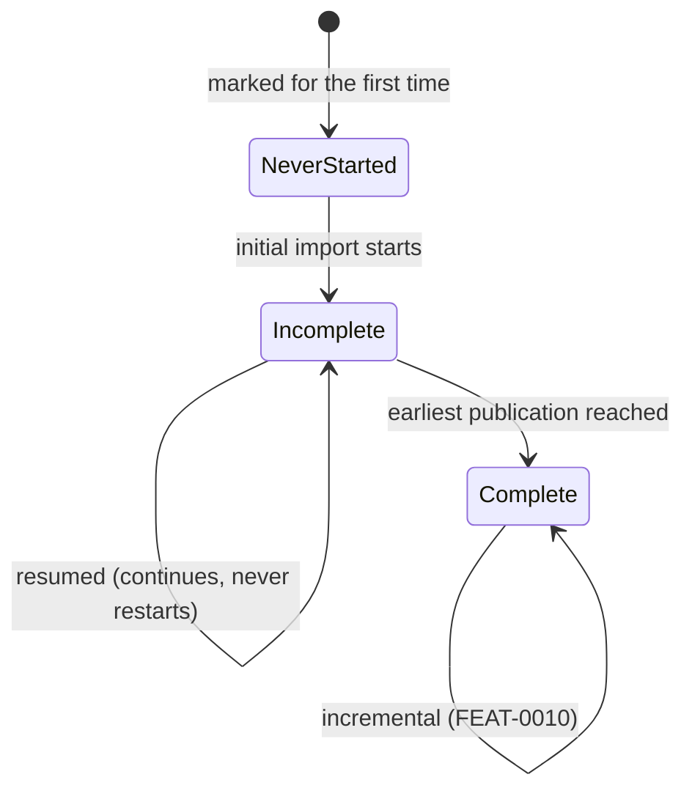

# FEAT-0009. Contratos menores: opt-in marking and initial import

## Goal
Make an Órgano's **contratos menores** loadable: an administrator marks the Órganos worth
importing, and the system retrieves each marked Órgano's **full published history** from
contratosdegalicia.gal and stores it, resuming on its own terms when a load measured in days is
interrupted. This is the first buildable slice of
**[SPEC-0005](../../specs/SPEC-0005-import-browse-contratos-menores.md)** — it delivers R3–R7,
R9, R11, R12, the *initial* and *resumed* modes of R8, the manual and mark triggers of R4 and
R20, and the system-wide guard of R22.

It exposes **no contract read endpoint**. Nothing browses contratos menores until the browsing
feature builds the family split, the year scoping, the sort and the paging control (R14–R19)
over the rows stored here — the same order FEAT-0006 and FEAT-0007 took for the Órgano
catalogue. What it does put on screen is the **mark itself**, added to FEAT-0007's admin
Órganos section, so opting an Órgano in is an administrator's action rather than a `curl`.

The design sits in the hexagonal server of
**[ADR-0002](../../architecture/0002-hexagonal-architecture.md)**: the contratos menores
scraper is a driven adapter behind a port, the REST endpoints are driving entry points, and the
`ContratoMenor` aggregate maps 1:1 to its own table
(**[ADR-0008](../../architecture/0008-domain-entities-carry-persistence-mapping-annotations.md)**).
Retrieval is blocking I/O over virtual threads
(**[ADR-0011](../../architecture/0011-blocking-io-virtual-threads.md)**) through the resilient,
self-throttling declarative client of
**[ADR-0014](../../architecture/0014-resilient-throttled-outbound-http-client.md)**, which is
what satisfies R25 without this feature choosing a rate. The run's durable state follows
**[ADR-0017](../../architecture/0017-import-run-state-in-postgresql.md)**. REST lives under the
reserved `/api/` prefix (**[ADR-0006](../../architecture/0006-reserved-api-url-prefix.md)**),
named per **[ADR-0016](../../architecture/0016-rest-resource-naming.md)**, authored
contract-first (**[ADR-0010](../../architecture/0010-design-first-openapi-contract.md)**) and
guarded by session security
(**[ADR-0005](../../architecture/0005-session-based-authentication.md)**). The UI is the React
Router SPA (**[ADR-0003](../../architecture/0003-react-router-ui-served-by-backend.md)**) built
with Vite + Mantine (**[ADR-0004](../../architecture/0004-ui-stack-vite-mantine.md)**) in the
feature-based layout of
**[ADR-0015](../../architecture/0015-frontend-feature-based-shared-core-modularization.md)**.

> **The prerequisites this feature builds onto are settled.**
> [ADR-0017](../../architecture/0017-import-run-state-in-postgresql.md) is `accepted`, so the
> run record, the resumption point and the guard rest on a decision that is no longer up for
> debate; and [SPEC-0005](../../specs/SPEC-0005-import-browse-contratos-menores.md) is `active`.

## Scope
- **Domain (the mark):** one administrator-managed attribute on `OrganoDeContratacion` —
  whether its contracts are imported — with the `OrganoRepository` reads and writes that set it,
  clear it, and list the marked Órganos (R4). SPEC-0004's catalogue reconciliation never touches
  it (R5).
- **Domain (the contract):** a `ContratoMenor` aggregate carrying the attributes the source
  publishes **as published** — the awarding Órgano, publication date, object, amount including
  VAT, stated duration, awardee name and awardee fiscal identifier — plus the source's own
  publication identifier as its stable identity (R7, R27), and a `ContratoMenorRepository` port.
- **Domain (source port):** a `ContratoMenorSource` port that answers one **(Órgano, date
  window)** slice at a time, because that is the only shape the source offers (SPEC-0005,
  *"retrievable only in bounded slices"*).
- **Domain (run state):** the durable import-run record of
  [ADR-0017](../../architecture/0017-import-run-state-in-postgresql.md) — one row per run plus
  one row per covered Órgano carrying its mode, its state, its resumption point and its progress
  — and the **system-wide single-import guard** that reads it (R22).
- **Domain (per-Órgano import state):** whether an Órgano's initial import has **never started**,
  **started and is incomplete**, or **completed**, and when it last imported successfully — the
  three-state fact R8's mode rule is decided from.
- **Domain (use case):** `ImportContratosMenores` — for each eligible Órgano in turn, walk its
  history in date windows, upsert each batch idempotently, advance the run record, and stop
  cleanly when the Órgano is unmarked mid-run (R3, R5, R9, R11, R12, R23).
- **Infrastructure:** migrations for the mark, the contratos menores table, the import-run
  record and the per-Órgano import state; their Micronaut Data JDBC repositories; and the
  contratosdegalicia.gal adapter behind `ContratoMenorSource`.
- **Application (driving):**
  - `PUT /api/admin/organo/{id}/importado` — **`ADMIN`-only**: mark or unmark, and request an
    import on marking (R1, R4).
  - `POST /api/admin/contratos-menores/import` — **`ADMIN`-only**: import every marked, active
    Órgano (R20).
  - `POST /api/admin/organo/{id}/contratos-menores/import` — **`ADMIN`-only**: import one named
    Órgano, refused with a stated reason when it is not eligible (R20).
  - the `importado` flag added to FEAT-0007's existing `GET /api/organos`, so the mark is
    readable wherever the catalogue is.
- **UI:** a mark/unmark control and a *marked* indicator in FEAT-0007's admin Órganos section,
  with the import outcome surfaced where its import-trigger feedback already lives.

**Out of scope (owned by later features):**
- **The incremental mode and the scheduler** — R8's window floor, R21's recurring run, and with
  them R9's *automatic* resumption — belong to the next feature, *FEAT-0010. Contratos menores
  incremental refresh*. The consequence is stated rather than hidden: **until it lands, a
  refused mark is not recovered by a scheduled run** (SPEC-0005 #33), an interrupted initial
  import resumes only when an administrator triggers it, and a loaded Órgano goes stale. That is
  the price of shipping the load before the refresh, and every mechanism the second feature needs
  — the mode rule, the per-Órgano state, the run record — is built here with its incremental
  branch left unimplemented rather than unanticipated.
- **The historical re-read (R10) and contract removal/restore (R13)** — the two administrator
  corrections — belong to a later curation feature. R13 in particular changes what a re-import
  may re-add, so it lands with the surface that shows a contract, not with the one that loads it.
- **Browsing (R14–R19)** — the family split, the mandatory year scoping, the sort, R17's paging
  control, the per-row link to the source and the crossing into an operador — and the R24
  latency measurement taken over them. All of it reads the rows this feature stores.
- **The import-run monitoring surface** — [SPEC-0007](../../specs/SPEC-0007-monitor-import-runs.md)'s
  run list, run detail, diagnostics, live progress and retention. This feature writes the record
  that spec reports; it renders none of it. Columns beyond what the resumer and the guard need
  are SPEC-0007's features to add to the same rows, which is exactly what ADR-0017 exists to
  make possible.
- **Operadores económicos** ([SPEC-0006](../../specs/SPEC-0006-operadores-economicos.md)) — this
  feature only owes them the awardee name and fiscal identifier stored on every contract (R7).

## Design

### Hexagonal placement ([ADR-0002](../../architecture/0002-hexagonal-architecture.md))

```mermaid
flowchart LR
    subgraph application["application (driving)"]
        markApi["PUT /api/admin/organo/&#123;id&#125;/importado (ADMIN)"]
        importApi["POST .../contratos-menores/import (ADMIN)"]
        organosUi["admin Órganos section: mark control"]
    end
    subgraph domain["domain"]
        useCase["ImportContratosMenores"]
        modeRule["mode rule (R8)"]
        guard["single-import guard (R22)"]
        contrato["ContratoMenor"]
        contratoRepo["ContratoMenorRepository (port)"]
        sourcePort["ContratoMenorSource (port)"]
        runRepo["ImportRunRepository (port)"]
    end
    subgraph infrastructure["infrastructure (driven)"]
        jdbcContratos["JdbcContratoMenorRepository"]
        jdbcRuns["JdbcImportRunRepository"]
        scraper["contratosdegalicia ContratoMenorSource adapter"]
    end
    application --> domain
    infrastructure --> domain
```

### The mark, and what it survives
- The mark is a boolean **column on `organo_contratacion`**, defaulting to false so a newly
  discovered Órgano is never imported by accident (R4). It sits on the same row the taxonomy
  placement does, and for the same reason: SPEC-0004's reconciliation is **update-in-place**, so
  a column added here survives every catalogue re-import without that import knowing it exists
  (R5). No task changes `OrganoReconciler`'s write set; that is what proves criterion #6.
- **Eligibility is `active && importado`** (R3), evaluated by the use case rather than by each
  trigger, so the manual trigger, the mark trigger and the future scheduler cannot disagree
  about it. An explicitly named Órgano that fails the test does not start a run and is told
  **why**, which is a different refusal from the guard being held (R20, #34).

### What a stored contract holds ([ADR-0008](../../architecture/0008-domain-entities-carry-persistence-mapping-annotations.md))
- The aggregate maps 1:1 to `contrato_menor`, keyed by a system-assigned UUID, with the
  **source's own publication identifier unique** — so "no duplicates" (R12) holds at the store
  level and not only in use-case logic, exactly as `source_key` does for the catalogue. The
  awarding Órgano is referenced by its **UUID**, not its source key.
- **Every published value is stored as published** (R27) — object, amount, duration, awardee
  name, awardee fiscal identifier, publication date — as text, with padding and casing intact.
- Alongside them the row carries **interpreted** columns: the publication date as a date and the
  amount as a number, **nullable**. R27 permits reading a published value as a number or a date
  for *ordering, filtering and counting only*, and forbids storing the interpretation in place of
  the publication; two columns is what keeps both true. A value that cannot be interpreted leaves
  its interpreted column null — the contract is stored anyway (#42), and the browsing feature is
  what gives a null date its *undated* selection (R19) and a null amount its last place in an
  amount sort.
- The interpreted publication date is what the browsing feature's mandatory year scoping will
  index on; this feature creates the index it will need, because adding one to a table of
  millions later is a different operation from creating it empty.

### One run record, read by the resumer and the guard ([ADR-0017](../../architecture/0017-import-run-state-in-postgresql.md))
- A run is recorded **when it is triggered**, with one child row per **covered Órgano**
  enumerated up front, each carrying its mode, its state, its resumption point, its progress
  counters and when they last advanced. That is ADR-0017's decision and SPEC-0007 R3's shape;
  building it any narrower would mean SPEC-0007 reshaping it later.
- **Contracts commit in batches; the run record advances afterwards, in its own short
  transaction.** A failed progress write is logged and abandoned, never propagated into the
  import — the import wins and the record is what is sacrificed (ADR-0017, SPEC-0007 R20).
- The resumption point is therefore **a conservative hint, not a ledger**: a crash between a data
  commit and its progress write leaves the cursor slightly behind what is stored, and the
  resumption re-reads that overlap harmlessly because R11 and R12 make re-reading an update in
  place. Batch size is the knob that trades throughput against re-read cost; it is chosen with
  the progress-write budget in mind and recorded in the task, not tuned speculatively.
- **The guard is a read of this state** (R22): a trigger that finds any live run — this
  feature's, or SPEC-0004's catalogue import — does not start, and is reported as refused with
  its reason. Because the state is durable, the guard survives a restart, which an in-process
  flag does not. FEAT-0006's `ImportOrganos` moves off its `AtomicBoolean` onto the same guard in
  the same task; a guard that spans only one of the two importers is not the guard R22 asks for.

### Mode selection: three states, not two
The mode is chosen **per Órgano**, from a durable per-Órgano fact rather than from the trigger
that arrived:

- **Never started** takes an *initial* import, **incomplete** takes a *resumed* one, **complete**
  takes an *incremental* one. Two states would collapse the first two, and a half-loaded Órgano
  would be treated as up to date — the defect R8 names explicitly.
- This fact lives with the **Órgano**, not with the run history, even though the resumption
  *point* lives on the run record. The reason is retention: SPEC-0007 R17 will age run records
  out, and "this Órgano's history is fully loaded" must not be a fact that expires with them.
  The run record answers *how far this run got*; the per-Órgano state answers *is this Órgano
  loaded*.
- FEAT-0010 implements the incremental branch and the window floor. This feature leaves the rule
  with that branch unimplemented and its three states already tracked.

### Walking a history in windows, newest first
- The source answers one bounded date range per request, so an initial import walks the Órgano's
  history in windows, **newest window first, backwards to the earliest publication**. The cursor
  is the oldest window completed.
- Newest-first is chosen because an initial import of a large Órgano runs for days: the
  most-consulted contracts become browsable within hours instead of at the end, R18's *partial*
  marker describes a list that is growing backwards rather than one missing everything recent,
  and R19's default year — the most recent the Órgano has contracts in — is meaningful from the
  first batch. The cost is that the incremental watermark does not coincide with the cursor;
  FEAT-0010 takes the run's **start** as the point its window floor measures from, which is
  conservative in the safe direction.
- The walk ends at the earliest window that yields nothing, floored by the source's own published
  history (which begins around 2018). Reaching that floor is what marks the initial import
  **complete**.

### API surface ([ADR-0016](../../architecture/0016-rest-resource-naming.md), [ADR-0010](../../architecture/0010-design-first-openapi-contract.md))

| Method & path | Role | Purpose |
| --- | --- | --- |
| `PUT /api/admin/organo/{id}/importado` | `ADMIN` | Mark or unmark; marking also requests an import (R4) |
| `POST /api/admin/contratos-menores/import` | `ADMIN` | Import every marked, active Órgano (R20) |
| `POST /api/admin/organo/{id}/contratos-menores/import` | `ADMIN` | Import one named Órgano (R20) |
| `GET /api/organos` | authenticated | FEAT-0007's catalogue read, widened with `importado` |

- A flag on one element takes the singular sub-resource path, following ADR-0016's
  `POST /api/admin/user/{id}/enabled` precedent; the collection-wide trigger takes the plural,
  following `POST /api/admin/organos/import`.
- Every trigger answers with the same **outcome**: succeeded, failed or **partially succeeded**,
  which Órganos were covered, which of them failed, and contracts added and refreshed (R20).
  Partial success is a first-class verdict, not an afterthought — R23 requires a run to carry on
  past a failing Órgano, so it is the likeliest verdict of a multi-Órgano run.
- A refusal is an outcome too, carrying **which** refusal it was: another import holds the guard,
  or the named Órgano is not eligible.
- The contract is authored in [`docs/api/openapi.yaml`](../../api/openapi.yaml) before the
  controllers exist, and CI enforces conformance (ADR-0010).

### Retrieval, pacing and failure ([ADR-0014](../../architecture/0014-resilient-throttled-outbound-http-client.md))
- The adapter **declares a client interface** and carries the `@ResilientClient` advice; it
  builds no request and holds no client. Retry, rate limiting and circuit breaking come with the
  declaration, which is what makes R25 a property of the wiring rather than a discipline each
  adapter has to remember. This feature configures no new rate: it consumes the source's existing
  policy, and the initial import is precisely the traffic that policy was bounded for.
- The exact query surface for contratos menores — the request shape, its date-range parameters
  and how a slice pages — is **confirmed against the live source as the first step of the
  adapter task**, not assumed here. What the domain depends on is only the port's shape: one
  (Órgano, window) slice at a time, ordered by publication date.
- An unusable response is the adapter's own judgement and surfaces as a domain failure (ADR-0014
  keeps response *content* outside the breaker). A failure aborts **that Órgano**, not the run:
  contracts already stored for it and for Órganos processed earlier stay intact, and the run
  continues to the next Órgano (R23).

## Sequencing (tasks, one small change each)
1. **Import mark on the Órgano catalogue** — a migration adding `importado` (not null, default
   false) to `organo_contratacion`, the field on the `OrganoDeContratacion` aggregate, and the
   `OrganoRepository` reads/writes for it, with `OrganoReconciler`'s write set deliberately
   untouched. *(SPEC-0005 #4, #6)*
2. **Mark administration API** — `MarkOrganoForImport` / `UnmarkOrganoForImport` use cases,
   `PUT /api/admin/organo/{id}/importado` (`ADMIN`-only, 403 otherwise), and `importado` added to
   `GET /api/organos` so the mark is readable with the catalogue. Marking does not yet trigger
   anything — task 8 wires that once there is something to trigger. *(SPEC-0005 #1, #4)*
3. **`ContratoMenor` domain model + repository port** — the aggregate (UUID identity, the
   source's publication identifier, the awarding Órgano's UUID, every published value as
   published, and the nullable interpreted date and amount) plus the `ContratoMenorRepository`
   port: batch upsert by publication identifier, and the lookups the use case needs.
   *(SPEC-0005 #11, #40, #42)*
4. **Contratos menores store** — the migration creating `contrato_menor` (unique publication
   identifier, FK to the Órgano, the index the year-scoped read will need) and the Micronaut Data
   JDBC implementation of the port, including the batch upsert that makes re-import idempotent.
   *(SPEC-0005 #17)*
5. **`ContratoMenorSource` port + contratosdegalicia adapter** — confirm the source's per-Órgano,
   date-bounded query surface, then the port and its declarative resilient-client adapter
   (ISO-8859-1, paged within a slice), failing cleanly when the source is unreachable or its
   response is unusable. *(SPEC-0005 #36, #38, #40)*
6. **Import run record + system-wide guard** — migrations and repository for the run and its
   per-Órgano coverage rows (mode, state, resumption point, progress, last-advanced); the guard
   that reads them; and FEAT-0006's `ImportOrganos` moved off its in-process flag onto it, so the
   guard spans both importers. *(SPEC-0005 #32)*
7. **Per-Órgano import state + the R8 mode rule** — the durable three-state fact and the last
   successful import instant, with the mode-selection function that reads them; the incremental
   branch is named and left to FEAT-0010. *(SPEC-0005 #46, #47)*
8. **`ImportContratosMenores`: initial and resumed** — eligibility filter, Órganos processed
   serially, the newest-first window walk, batch commit with the run record advanced afterwards,
   idempotent reconciliation, resumption from the cursor, a clean stop when the Órgano is
   unmarked mid-run, and per-Órgano failure isolation. *(SPEC-0005 #3, #8, #12, #14, #16, #17,
   #36, #46)*
9. **Import triggers** — `POST /api/admin/contratos-menores/import` and
   `POST /api/admin/organo/{id}/contratos-menores/import` (`ADMIN`-only), returning the
   succeeded / failed / partially-succeeded outcome with covered and failed Órganos and the
   counts; plus marking wired to the same use case so a mark requests an import and is refused,
   with its reason, when the guard is held. *(SPEC-0005 #1, #5, #29, #30, #34)*
10. **Admin marking UI** — the mark/unmark control and *marked* indicator in FEAT-0007's admin
    Órganos section, and the import outcome shown where that section already reports an import.
    Depends on FEAT-0007's Órganos section existing. *(SPEC-0005 #4)*

## Edge cases
- **Catalogue re-import while Órganos are marked** — SPEC-0004's reconciliation updates name and
  active state in place and writes nothing else, so every mark survives; a task that widens
  `OrganoReconciler`'s write set breaks criterion #6. *(SPEC-0005 #6)*
- **Unmarked mid-import** — the run checks eligibility between batches and stops that Órgano
  cleanly at a batch boundary, keeping everything already stored and leaving the cursor where it
  is. The Órgano stays **incomplete**, which is what makes a later re-mark resume rather than
  restart. *(SPEC-0005 #8, #46)*
- **Marked, unmarked while half-loaded, marked again** — resumed, never treated as up to date;
  it continues from the cursor, adds no duplicates and completes the full history. Contrast an
  Órgano whose initial import had **completed**: the same sequence takes the incremental mode,
  which FEAT-0010 delivers. *(SPEC-0005 #46, #44)*
- **Crash between a data commit and its progress write** — the cursor points slightly behind
  what is stored; the resumption re-reads the overlap and the upsert makes it a no-op.
  *(SPEC-0005 #14, #17)*
- **The same publication seen twice** — across a resumption overlap, a paging boundary or a
  straight re-run — upserts to the same row; the unique publication identifier makes a duplicate
  impossible even if the use-case logic slipped. *(SPEC-0005 #17)*
- **A publication absent from a later import** — retained unchanged. An import never deletes;
  absence is not evidence of withdrawal, and the explicit removal that *is* (R13) is a later
  feature's. *(SPEC-0005 #17)*
- **An attribute changed at the source** — matched by publication identifier and refreshed in
  place; identity and the row survive. *(SPEC-0005 #16)*
- **An uninterpretable amount or publication date** — stored and kept as published, with the
  interpreted column left null; the contract is never rejected. It is unreachable until the
  browsing feature ships R19's undated selection, which is why that feature owns the second half
  of criterion #42. *(SPEC-0005 #42)*
- **Source unreachable or unusable during a long run** — that Órgano's import fails and is
  recorded as failed; contracts already stored for it and for earlier Órganos are intact, and
  the run carries on to the remaining Órganos. *(SPEC-0005 #36)*
- **A trigger arriving while any import runs** — including SPEC-0004's catalogue import — is
  refused with the guard as its reason, and neither queued nor dropped silently. Until
  FEAT-0010's scheduler exists, a refused **mark** is not automatically recovered: the
  administrator is told it was refused and can trigger it again. *(SPEC-0005 #32; #33 completes
  with FEAT-0010)*
- **An explicitly named Órgano that is inactive or unmarked** — no import starts, and the reason
  reported is ineligibility, distinct from the guard refusal. *(SPEC-0005 #34)*
- **An Órgano that publishes no contratos menores at all** — the majority of the catalogue —
  completes its initial import having stored nothing. That is a completed import, not a failure,
  and it stays invisible to users because the browsing feature renders no empty section.
  *(SPEC-0005 #26, browsing half deferred)*
- **A source that back-dates a publication** — SPEC-0005 states the assumption that it does not,
  and marks it load-bearing rather than proven. A back-dated entry would fall behind the cursor
  and be reachable only by R10's historical re-read, which no feature owns yet. Recorded here so
  it is a known gap rather than a surprise. *(SPEC-0005 R8)*
- **Accented text** — the source is ISO-8859-1, as the Órganos adapter already found; objects
  and awardee names are decoded once, at the adapter, and stored without mojibake, since R27
  forbids correcting them afterwards. *(SPEC-0005 #40)*
