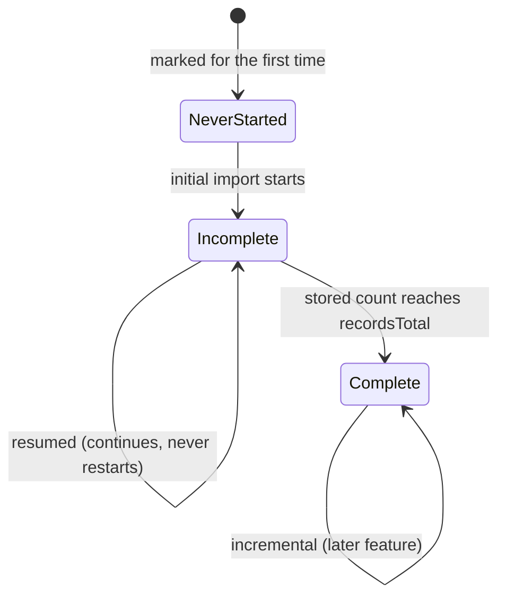

# FEAT-0009. Contratos menores: opt-in marking and initial import

## Goal
Make an Órgano's **contratos menores** loadable: an administrator marks the Órganos worth
importing, and the system retrieves each marked Órgano's **full published history** from
contratosdegalicia.gal and stores it, resuming when a load measured in days is interrupted.
This is the first buildable slice of
**[SPEC-0005](../../specs/SPEC-0005-import-browse-contratos-menores.md)**.

It delivers R3–R5 whole; **R6, R7 and R27's storage obligations** (what is stored, and that it
is stored as published — every *display* obligation is the browsing feature's); R11 and R12; the
**initial** and **resumed** modes of R8; **the on-demand half of R9** (an interrupted import
retains what it stored and is resumed by an administrator — automatic resumption needs the
scheduler and goes with it); the mark and manual triggers of R4 and R20; the system-wide guard
of R22; and R23's per-Órgano failure isolation.

It exposes **no contract read endpoint**. Nothing browses contratos menores until the browsing
feature builds the family split, the year scoping, the sort and the paging control (R14–R19)
over the rows stored here — the same order FEAT-0006 and FEAT-0007 took for the Órgano
catalogue. What it does put on screen is the **mark itself**, added to FEAT-0007's admin
Órganos section, so opting an Órgano in is an administrator's action rather than a `curl`.

The design sits in the hexagonal server of
**[ADR-0002](../../architecture/0002-hexagonal-architecture.md)**: the contratos menores
scraper is a driven adapter behind a port, the REST endpoints are driving entry points, and the
`ContratoMenor` aggregate maps 1:1 to its own table
(**[ADR-0008](../../architecture/0008-domain-entities-carry-persistence-mapping-annotations.md)**).
Retrieval is blocking I/O over virtual threads
(**[ADR-0011](../../architecture/0011-blocking-io-virtual-threads.md)**) through the resilient,
self-throttling declarative client of
**[ADR-0014](../../architecture/0014-resilient-throttled-outbound-http-client.md)**, which is
what satisfies R25 without this feature choosing a rate. The run's durable state follows
**[ADR-0017](../../architecture/0017-import-run-state-in-postgresql.md)**. REST lives under the
reserved `/api/` prefix (**[ADR-0006](../../architecture/0006-reserved-api-url-prefix.md)**),
named per **[ADR-0020](../../architecture/0020-actions-as-verbs-in-rest-paths.md)**, carries the
rate-limit contract of **[ADR-0012](../../architecture/0012-rate-limit-http-contract.md)**, is
authored contract-first
(**[ADR-0010](../../architecture/0010-design-first-openapi-contract.md)**) and guarded by
session security (**[ADR-0005](../../architecture/0005-session-based-authentication.md)**). The
UI is the React Router SPA
(**[ADR-0003](../../architecture/0003-react-router-ui-served-by-backend.md)**) built with Vite +
Mantine (**[ADR-0004](../../architecture/0004-ui-stack-vite-mantine.md)**) in the feature-based
layout of
**[ADR-0015](../../architecture/0015-frontend-feature-based-shared-core-modularization.md)**.

> **The prerequisites this feature builds onto are settled.**
> [ADR-0017](../../architecture/0017-import-run-state-in-postgresql.md) is `accepted`, so the
> run record and the guard rest on a decision that is no longer up for debate; and
> [SPEC-0005](../../specs/SPEC-0005-import-browse-contratos-menores.md) is `active`.
> **The source contract is confirmed**, not assumed: the page's tables are DataTables in
> `serverSide` mode over a public JSON API, measured against the live site and recorded in
> [`design/source-contract.md`](design/source-contract.md). Every window size, page size, field
> shape and limit cited below comes from that measurement.

## Scope
- **Domain (the mark):** one administrator-managed attribute on `OrganoDeContratacion` —
  whether its contracts are imported — with the `OrganoRepository` reads and writes that set it,
  clear it, and list the marked Órganos (R4). SPEC-0004's catalogue reconciliation never touches
  it (R5).
- **Domain (the contract):** a `ContratoMenor` aggregate carrying the attributes the source
  publishes **as published** — the awarding Órgano, publication date, object, amount including
  VAT and stated duration — plus a **foreign-key association to its operador económico**, which
  is where the awardee's name and fiscal identifier live, once, rather than on every contract
  row; plus the source's own
  source identifier as its stable identity and whatever addresses that publication at the
  source (R7, R16, R27), and a `ContratoMenorRepository` port.
- **Domain (source port):** a `ContratoMenorSource` port that answers one **(Órgano, date
  window)** slice at a time, because that is the only shape the source offers (SPEC-0005,
  *"retrievable only in bounded slices"*).
- **Domain (per-Órgano import state):** the durable, retention-proof facts about an Órgano's
  load — whether its initial import has **never started**, **started and is incomplete**, or
  **completed**; the **cursor** an interrupted load resumes from; and the instant its history is
  **covered through**.
- **Domain (run state):** the durable import-run record of
  [ADR-0017](../../architecture/0017-import-run-state-in-postgresql.md) — one row per run with
  its per-Órgano coverage — the **derived-abandoned read rule** that keeps a dead run from
  wedging the system, and the **system-wide single-import guard** that reads both (R22).
- **Domain (use cases):** `ClaimContratosMenoresImport` decides who a run covers and whether it
  may start; `ExecuteContratosMenoresImport` walks them one at a time and settles the verdict;
  `ImportCoveredOrgano` takes one Órgano's turn — walk its history in date windows, upsert each
  batch idempotently, advance the state, and stop cleanly when the Órgano is unmarked mid-run
  (R3, R5, R9, R11, R12, R23).
- **Infrastructure:** migrations for the mark, the contratos menores table, the per-Órgano
  import state and the run record; their Micronaut Data JDBC repositories; and the
  contratosdegalicia.gal adapter behind `ContratoMenorSource`.
- **Application (driving):** the `ADMIN`-only endpoints of the *API surface* section below — the
  mark, the two triggers, the run read that makes a trigger answerable, and an administrator's
  catalogue read carrying the mark.
- **UI:** a mark/unmark control and a *marked* indicator in FEAT-0007's admin Órganos section,
  with the run outcome surfaced where its import-trigger feedback already lives. The visual
  target is the mockup set in [`design/`](design/README.md), which also records what it
  draws but deliberately does not build.

**Out of scope (owned by later features):**
- **The incremental mode and the scheduler** — R8's window floor, R21's recurring run, and with
  them R9's *automatic* resumption — belong to the next feature,
  [FEAT-0014](../FEAT-0014-contratos-menores-incremental-refresh/README.md). The consequence is
  stated rather than hidden: **until
  it lands, a refused mark is not recovered by a scheduled run** (SPEC-0005 #33), an interrupted
  import resumes only when an administrator triggers it, and a loaded Órgano goes stale. That is
  the price of shipping the load before the refresh, and every mechanism the second feature needs
  — the mode rule, the per-Órgano state, the covered-through instant, the run record — is built
  here with its incremental branch left unimplemented rather than unanticipated.
- **The historical re-read (R10) and contract removal/restore (R13)** — the two administrator
  corrections — belong to a later curation feature. R13 in particular changes what a re-import
  may re-add, so it lands with the surface that shows a contract, not with the one that loads it.
- **Browsing (R14–R19)** — the family split, the mandatory year scoping, the sort, R17's paging
  control, the per-row link to the source and the crossing into an operador — and the R24
  latency measurement taken over them. All of it reads the rows this feature stores.
- **The import-run monitoring surface** —
  [SPEC-0007](../../specs/SPEC-0007-monitor-import-runs.md)'s run list, its filters, run
  diagnostics, live progress and retention. This feature builds **only the run columns its own
  guard, its own resumer and R20's outcome need**, and one plain read of one run; SPEC-0007's
  features widen the same rows rather than opening a second store, which is the property ADR-0017
  exists to guarantee. Note that ADR-0017 decides *where* the state lives and says explicitly that
  the **schema is not decided there** — so no column here is justified by "SPEC-0007 will want it",
  and each is justified below by a requirement this feature meets.
- **Operadores económicos** ([SPEC-0006](../../specs/SPEC-0006-operadores-economicos.md)) — this
  feature owes them the awardee **as the source publishes it**, surfaced by its adapter, and the
  foreign key on every contract. Since the schema is normalised, the awardee's name and fiscal
  identifier are stored **only** on the operador row, so the catalogue and the *populating* of
  that key — both [FEAT-0010](../FEAT-0010-operadores-economicos-base/README.md)'s — are what
  make a contract's awardee knowable at all.

  **That feature's base goes first, not after.** Its aggregate and `operador_economico` table
  are prerequisites of tasks 3 and 4 here — its matching rules are not, being needed only when an
  award is resolved — so `contrato_menor` is **created carrying** a nullable
  `operador_economico_id` rather than having one added to a table of millions later — the same
  reasoning that creates the year index up front. This feature declares that column and that field
  and **never writes either**; FEAT-0010's derivation task, which does, is the one thing that still
  lands after this feature's import.

## Design

### Hexagonal placement ([ADR-0002](../../architecture/0002-hexagonal-architecture.md))

```mermaid
flowchart LR
    subgraph application["application (driving)"]
        markApi["PUT/DELETE /api/admin/organo/&#123;id&#125;/importable"]
        importApi["POST .../contratos-menores/import"]
        runApi["GET /api/admin/import-run/&#123;id&#125;"]
        organosUi["admin Órganos section: mark control"]
    end
    subgraph domain["domain"]
        useCase["Claim / Execute ContratosMenoresImport"]
        organoState["per-Órgano import state + mode rule (R8)"]
        guard["single-import guard (R22)"]
        contrato["ContratoMenor"]
        contratoRepo["ContratoMenorRepository (port)"]
        sourcePort["ContratoMenorSource (port)"]
        runRepo["ImportRunRepository (port)"]
    end
    subgraph infrastructure["infrastructure (driven)"]
        jdbcContratos["JdbcContratoMenorRepository"]
        jdbcRuns["JdbcImportRunRepository"]
        scraper["contratosdegalicia ContratoMenorSource adapter"]
    end
    application --> domain
    infrastructure --> domain
```

### The mark, and what it survives
- The mark is a boolean **column on `organo_contratacion`**, defaulting to false so a newly
  discovered Órgano is never imported by accident (R4). It sits on the same row the taxonomy
  placement does, and for the same reason: SPEC-0004's reconciliation is **update-in-place**, so
  a column added here survives every catalogue re-import without that import knowing it exists
  (R5). No task changes `OrganoReconciler`'s write set; that is what proves criterion #6.
- **Eligibility is `active && importable`** (R3), evaluated by the use case rather than by each
  trigger, so the manual trigger, the mark trigger and the future scheduler cannot disagree
  about it. An explicitly named Órgano that fails the test does not start a run and is told
  **why**, which is a different refusal from the guard being held (R20, #34).

### Identifiers are typed ([ADR-0019](../../architecture/0019-typed-aggregate-identifiers.md))
This feature threads three identifiers through one walk — a contract's, its Órgano's and the
run's — which is the condition under which same-typed `UUID`s get passed to the wrong method and
fail as a missing row rather than as a compile error. So its **new** aggregates take wrapper
types: `ContratoMenorId` and `ImportRunId`, each a record around a `UUID` with an
`AttributeConverter` onto an unchanged `uuid` column. The database still assigns the value and
an aggregate is still built with a null id, so nothing about the shipped convention moves.

Two consequences are deliberate. The **catalogue is not converted** — an Órgano is still
referenced by a bare `UUID` here, because typing a shipped aggregate is the business of whichever
feature next touches its identity, and this one has no reason to. And **wrappers stop at the REST
boundary**: request and response records carry plain UUIDs, so `openapi.yaml` and every client are
untouched. ADR-0019 also records the one risk this rests on — that Micronaut Data returns a
`@GeneratedValue` key through a converter — which task 3 proves before anything is built on it.

### What a stored contract holds ([ADR-0008](../../architecture/0008-domain-entities-carry-persistence-mapping-annotations.md))
- The aggregate maps 1:1 to `contrato_menor`, keyed by a system-assigned `ContratoMenorId`
  over an unchanged `uuid` column, with the
  **source's own source identifier unique** — so "no duplicates" (R12) holds at the store
  level and not only in use-case logic, exactly as `source_key` does for the catalogue. The
  awarding Órgano is referenced by its **UUID**, not its source key.
- **Every published value the contract keeps is stored as published** (R27) — object and duration,
  with the source's casing and internal spacing intact. Two bounded exceptions, both R27's and
  both taken at the adapter: **surrounding whitespace is stripped**, since the padding the source
  uses to fill its fixed-width fields is an artefact of serialisation rather than anything it
  published; and the **duration is capped at 64 characters**, so a value longer than the column
  loses its tail instead of failing the batch and rejecting a real award. The object carries no
  bound at any layer.
- **The awardee is a foreign key, and the schema is normalised.** The published name and fiscal
  identifier are held **once**, on the `operador_economico` row, and no contract repeats them: a
  large Órgano's million contracts carry a UUID each rather than two padded strings each. What that
  costs is stated rather than hidden — a contract no longer records the name **it** published —
  and **the specs say so**: R7 holds the awardee on the operador, R27 lists it among its
  exceptions, and [SPEC-0006](../../specs/SPEC-0006-operadores-economicos.md) #5 now describes rows
  showing the operador's name and its one canonical identifier. The name variance R27 refuses to
  correct is retained on the operador under SPEC-0006 R15; the identifier's is not retained at
  all, because R3 holds it canonical and rules its case meaningless.
- **The publication date is stored as a date, and only as a date** — one nullable column, parsed
  at the adapter from the source's `DD-MM-YYYY` text, with that text not retained.

  **R27 names this as its second exception**: the interpretation replaces the published string
  rather than accompanying it, so a date that cannot be interpreted leaves the column null and
  such a contract shows no date at all. What is kept is the half that matters more — the contract
  is **stored rather than rejected** (#42). What such a contract is *reachable by* has since
  changed and this feature is unaffected: SPEC-0005 **R28** makes it an **anomaly**, withheld from
  every browsing surface and surfaced to an administrator, where an earlier form of R19 reached it
  through an *undated* selection. Either way the import stores the row and nothing here decides
  what is shown.
- **The amount is likewise a single column, held as a `Money`.** The source publishes it as a
  JSON **number**, not as text, so no published spelling is lost by storing it numerically: one
  nullable `NUMERIC` column is both what was published and what R19 sorts on. In the domain it is
  a `Money` — a record wrapping a `BigDecimal`, mapped by an `AttributeConverter` exactly as
  [ADR-0019](../../architecture/0019-typed-aggregate-identifiers.md)'s identifiers are — so an
  amount cannot be added to a count or a year by accident, and the totals SPEC-0006 R9 and the
  browsing feature will sum are sums of a type that knows it is money. **No currency is stored**:
  every published figure is in euros, the source states no currency, and the system holds no
  second one to distinguish it from. It is VAT-inclusive, as R7 requires it to be labelled.
- **The route to the publication at the source is derived, not stored.** It is
  `licitacion?N={id}` — a constant and the source identifier the row already carries — so
  R16's per-row link costs no column. That is a measured fact about this source, not a general
  one: a family whose publications are not addressable from their identifier would have to
  capture the address at import, because it could not be retro-fitted onto millions of rows.
- The publication date is what the browsing feature's mandatory year scoping will index on; this
  feature creates the index it will need, on the same reasoning — adding one to a table of millions
  later is a different operation from creating it empty.

### State has two homes, and the split is decided by retention
[ADR-0017](../../architecture/0017-import-run-state-in-postgresql.md) settles that a run's state
is durable and lives in PostgreSQL. It leaves the schema open, and the schema question that
matters here is **which facts belong to the Órgano and which to the run**, because
[SPEC-0007](../../specs/SPEC-0007-monitor-import-runs.md) R17 will prune run history:

| Fact | Home | Why |
| --- | --- | --- |
| Initial import never started / incomplete / complete | Órgano | R8's mode rule; protected from pruning by SPEC-0007 R18 |
| Resumption **cursor** | Órgano | see below |
| **Covered-through** instant | Órgano | the incremental feature's window floor measures from it |
| Run identity, trigger, scope, times, state, counts | Run record | R20's outcome; SPEC-0007 reports the same rows |
| Last-advanced time | Run record | the guard's liveness bound (ADR-0017) |

- **The cursor belongs to the Órgano, not to the run.** SPEC-0007 R17 keeps, beyond its bound,
  the most recent run *in which that Órgano itself succeeded* — and an Órgano whose initial
  import was interrupted has no such run. Its run rows are therefore prunable, and a cursor
  living on them is prunable with them, leaving an `incomplete` Órgano with nowhere to resume
  from and no option but to restart a multi-day walk at one request per second. R18 protects
  *last imported successfully* and *ever attempted*; it does not protect a cursor, and this
  feature does not assume it will.
- **The covered-through instant is not "the last successful import".** Under a newest-first walk
  (below) an initial import covers `[cursor, T₀]`, where `T₀` is when its **first** window was taken
  — and an initial import spanning several resumptions has several run starts. If the incremental
  feature's floor measured from the latest of them, everything published between the first attempt
  and that resumption would fall outside every future window and be reachable only by R10, which no
  feature owns: R8's named "silent data-loss mechanism", reintroduced by an off-by-one in a
  timestamp. So the Órgano records `T₀` when the initial import first runs and **carries it across
  resumptions**, and that is the instant the incremental feature measures from.

### One run record, read by the guard and by whoever triggered
- A run is recorded **when it is triggered**, with its covered Órganos **enumerated then** —
  not discovered as the run reaches them. That is R20's requirement, not an anticipation of
  SPEC-0007: the outcome must name *which Órganos were covered and which of them failed*, and a
  run that dies at the fortieth of four hundred cannot reconstruct the list it was going to
  cover. Each covered Órgano's row carries its state and its counts.
- **Contracts commit in batches; the run record advances afterwards, in its own short
  transaction.** A failed progress write is logged and abandoned, never propagated into the
  import — the import wins and the record is what is sacrificed (ADR-0017).
- The cursor is advanced on the same beat and is **a conservative hint, not a ledger**: a crash
  between a data commit and a cursor write leaves it slightly behind what is stored, and the
  resumption re-reads that overlap harmlessly because R11 and R12 make re-reading an update in
  place.
- **Batch size and the abandonment bound are one decision, taken together** (ADR-0017): batches
  coarser than the bound would make a healthy run read as dead, and batches finer than necessary
  spend write load on the busiest path in the system. Task 7 chooses both and records the
  reasoning.

### The guard, and the two ways a naive one is worse than the flag it replaces
`ImportOrganos` today holds an in-process `AtomicBoolean`. R22's guard is system-wide across
both importers, so it has to be durable — but a durable guard that is only "is there a live
run?" fails in two ways the flag did not:

1. **A dead process must not wedge the system.** The `AtomicBoolean` at least cleared on
   restart. A row saying *in progress* does not, and SPEC-0007 R19 forbids editing run records —
   so one crash mid-run would block every import forever, with no operation to clear it.
   ADR-0017 already decided the answer: a run whose last advance is older than a configured
   bound **reads as abandoned**, applied in one place so no query can forget it. That rule is
   not monitoring polish that can wait for SPEC-0007; it is what makes the guard safe, so task 7
   builds it.
2. **The check and the write must be one act.** Two triggers — the mark control and an admin trigger
   today, the scheduler once the incremental feature lands — can both read *no live run* and both
   insert. The guard is the single thing standing between this system and a public source that
   [ADR-0014](../../architecture/0014-resilient-throttled-outbound-http-client.md) says owes us
   nothing, so it is serialised **in the database, by the transaction-scoped advisory lock the claim
   takes before it looks** — the mechanism
   [ADR-0017](../../architecture/0017-import-run-state-in-postgresql.md) decides, and the reason it
   is not a partial unique index — never by application-level checking.

**This changes shipped behaviour, deliberately.** `ImportOrganos` must now *write* a live run row
— a guard cannot see an import that records nothing — which makes the catalogue import's
recording this feature's business; `ImportOrganosTest`'s already-running case and
`ImportOrganosAtomicityIntegrationTest` change shape with it; and FEAT-0006's daily overnight
catalogue import will be **refused for the whole duration of every multi-day initial import**.
R22 accepts exactly that cost; it is written here so it is expected rather than discovered.

### Mode selection: three states, not two
The mode is chosen **per Órgano**, from a durable per-Órgano fact rather than from the trigger
that arrived:

- **Never started** takes an *initial* import, **incomplete** takes a *resumed* one, **complete**
  takes an *incremental* one. Two states would collapse the first two, and a half-loaded Órgano
  would be treated as up to date — the defect R8 names explicitly.
- The incremental feature implements that branch and the window floor. This feature leaves the rule
  with that branch unimplemented and its three states already tracked.

### Walking a history in windows, newest first
- The source answers **at most three months per request** and at most **100 rows per page**
  (measured — [`design/source-contract.md`](design/source-contract.md)), so an initial import
  walks the Órgano's history in three-month windows, **newest window first, backwards**, paging
  each window to exhaustion before stepping back.
- Newest-first is chosen because an initial import of a large Órgano runs for days: the
  most-consulted contracts become browsable within hours instead of at the end, R18's *partial*
  marker describes a list growing backwards rather than one missing everything recent, and R19's
  default year — the most recent the Órgano has contracts in — is meaningful from the first
  batch.
- **The walk ends when the Órgano's stored count reaches the source's `recordsTotal`**, and
  reaching it is what marks the initial import complete. Every response carries that figure — the
  Órgano's whole contratos menores count, independent of the window queried — so completeness is
  **checked against the source rather than inferred**. It also makes R9's progress a true
  fraction, and lets an administrator cost an Órgano before starting it, with one `length=1`
  request.
- It does **not** stop at the first empty window. An empty window is evidence of a gap, not of
  the earliest publication: for the small Órganos that are most of the catalogue a quarter with
  no contratos menores is ordinary, and stopping there would mark an Órgano complete with most
  of its history unread, failing #12 invisibly and leaving it thereafter on the incremental path.
- `recordsTotal` is **live**, not a constant: it grows while a multi-day import runs, so the walk
  cannot treat it as a fixed target to subtract from. It is a completeness *test*, evaluated when
  the walk believes it is done. A configured floor — the source's published history begins around
  2018 — remains as a backstop so a walk cannot run backwards forever if the two never converge,
  and a walk that reaches the floor without matching the count ends **incomplete** rather than
  silently complete.

### API surface

Named per [ADR-0020](../../architecture/0020-actions-as-verbs-in-rest-paths.md), authored
contract-first per [ADR-0010](../../architecture/0010-design-first-openapi-contract.md), carrying
the rate-limit contract of [ADR-0012](../../architecture/0012-rate-limit-http-contract.md).

| Method & path | Role | Purpose |
| --- | --- | --- |
| `PUT /api/admin/organo/{id}/importable` | `ADMIN` | Mark, and request an import (R4) |
| `DELETE /api/admin/organo/{id}/importable` | `ADMIN` | Unmark; stops a run in progress for it (R5) |
| `POST /api/admin/contratos-menores/import` | `ADMIN` | Import every marked, active Órgano (R20) |
| `POST /api/admin/organo/{id}/contratos-menores/import` | `ADMIN` | Import one named Órgano (R20) |
| `GET /api/admin/import-run/{id}` | `ADMIN` | The state and outcome of one run |
| `GET /api/admin/organos` | `ADMIN` | The catalogue as an administrator sees it, with `importable` |

- **Mark and unmark are two methods, not one flag with a body.** They are two use cases with
  genuinely different rules — marking requests an import and can be refused; unmarking stops one
  — which is FEAT-0007's stated reason for `PUT`/`DELETE` on the taxonomy placement. A mark
  triggers a **single-Órgano** import, not a sweep.
- **A trigger is asynchronous.** An initial import runs for days, so no trigger can carry R20's
  outcome in its response: each returns **`202` with the run's identifier**, and
  `GET /api/admin/import-run/{id}` is where succeeded / failed / **partially succeeded**, the
  covered Órganos, which of them failed, and the contracts added and refreshed are read. Partial
  success is a first-class verdict — R23 requires a run to carry on past a failing Órgano, so it
  is the likeliest verdict of a multi-Órgano run. That one read is why #29 and #30 are provable
  here at all; without it this feature would ship an importer whose outcome nobody, not even the
  administrator who triggered it, could see. SPEC-0007's run list, filters, diagnostics and live
  progress supersede it later, over the same rows.
- **A refusal is an outcome too**, and states which refusal it was: another import holds the
  guard, or the named Órgano is not eligible (R20, #34). A refused run has no start and no
  counts.
- **The outcome is a new schema, not the shipped `ImportOutcome`.** That one enumerates
  `[SUCCESS, ALREADY_RUNNING]` only, reports failure as a 500 problem, and caps its counts at
  100 000 — a bound SERGAS alone breaks by an order of magnitude. The new schema takes the full
  verdict set and no such cap.
- **The mark is exposed on an `ADMIN`-only catalogue read**, not on FEAT-0007's authenticated
  `GET /api/organos`. R18 deliberately leaves a `USER` unable to tell an unimported Órgano from
  one that awarded nothing, SPEC-0005 R1 puts *seeing which Órganos are marked* behind `ADMIN`,
  and SPEC-0007 R15 keeps Órgano-side import facts out of the shared views for the same reason.
  This does break FEAT-0007's "an Órgano is serialised by exactly one endpoint" rule; the trade
  is taken knowingly, because the alternative is handing a `USER` the one fact two specs
  independently decided to withhold.
- Every operation declares its statuses, its problem types and ADR-0012's rate-limit headers in
  [`docs/api/openapi.yaml`](../../api/openapi.yaml) **before** its controller exists (ADR-0010);
  the shared ruleset fails the lint without them.

### Retrieval, pacing and failure ([ADR-0014](../../architecture/0014-resilient-throttled-outbound-http-client.md))
- The adapter **declares a client interface** carrying the `@ResilientClient` advice; it builds
  no request and holds no client. It binds `@Client(id = "contratosdegalicia")` — the **same
  id** the Órganos adapter uses — so both share the one `RateLimiter`, `CircuitBreaker` and
  `Retry` that `ContratosDeGaliciaResilienceFactory` already publishes per source. That sharing
  is what makes "this feature configures no new rate" true rather than aspirational, and R25 a
  property of the wiring. Given the `@Named`-qualifier bite this project has already taken,
  binding the same id is called out here rather than left to the task.
- **Prerequisite:** FEAT-0006 TASK-0008 moves the Órganos adapter onto that declarative client.
  Until it lands, `ContratosDeGaliciaOrganoSourceAdapter` still injects a programmatic
  `@Named` client and the shared policy is not actually shared.
- **The adapter calls a JSON API, not a page.** The *Perfil do contratante* renders its tables
  client-side from `api/v1/organismos/{organismo}/contratosmenores/table`, an unauthenticated
  `GET` returning UTF-8 JSON, and `{organismo}` is **the same value the catalogue already stores
  as `sourceKey`** — verified against `portada.jsp`. So there is no HTML to parse, no JavaScript
  to execute, and no new identifier to map. The full contract, its limits and its caveats are in
  [`design/source-contract.md`](design/source-contract.md).
- The one thing the adapter must **not** do is discover the window limit from the source's
  behaviour: an over-wide window answers with a bare `500` and no machine-readable body,
  indistinguishable from a server fault. It stays inside three months by construction.
- A run executes on a **dedicated single-thread virtual-thread executor**, kept off the
  request-serving pool, following the precedent FEAT-0006 set for its scheduled import. A
  multi-day job must not occupy request-serving capacity.
- An unusable response is the adapter's own judgement and surfaces as a domain failure (ADR-0014
  keeps response *content* outside the breaker). A failure aborts **that Órgano**, not the run:
  contracts already stored for it and for Órganos processed earlier stay intact, and the run
  continues to the next Órgano (R23).

### UI ([ADR-0003](../../architecture/0003-react-router-ui-served-by-backend.md), [ADR-0004](../../architecture/0004-ui-stack-vite-mantine.md), [ADR-0015](../../architecture/0015-frontend-feature-based-shared-core-modularization.md))
The visual target is the mockup set in **[`design/`](design/README.md)** — four screens that
also record, in that folder's README, what they draw but deliberately do not build.

- **One column, not a screen.** FEAT-0007's term-Órganos table gains `CONTRATOS MENORES`
  between `ESTADO` and `ACCIÓNS`; `ACCIÓNS` keeps `Quitar do termo` untouched, and the count
  caption under the table gains the marked tally — the *listed as marked* half of #4, derived
  client-side from `GET /api/admin/organos` rather than from a new endpoint
  ([`organos-import-mark.svg`](design/organos-import-mark.svg)).
- **The control is a `Switch`**, because the mark is a durable attribute of the Órgano rather
  than a one-off action and maps 1:1 onto the two endpoints; it is also the only control
  narrow enough to add a fifth column without pushing Órgano names to three lines. Being
  icon-only, it carries an `aria-label`. Turning it on opens a confirmation naming what the
  mark costs — days of walking, and every other import refused meanwhile
  ([`mark-organo.svg`](design/mark-organo.svg)). R4 does not require that dialog; it is a
  design decision, taken because `Marcar e importar` is the honest name for what the `PUT`
  does.
- **The badge vocabulary is the three-state rule made visible** — `MARCADO`, `PARCIAL`,
  `IMPORTADO` — so a half-loaded Órgano can never read as up to date on screen either, plus
  **`SEN ACTUALIZAR`** for an Órgano that holds contracts but is no longer marked, and a dimmed
  `—` only when there is nothing stored at all. The fourth badge exists because R5 **keeps**
  the contracts of an unmarked Órgano: collapsing it into the dash would render an Órgano
  holding a million rows identically to one never touched, and #7 requires the surface to say
  it is no longer being updated. Which of the two stored states it holds — resumable or
  complete, the difference between a later re-mark resuming and it running incrementally —
  stays reachable on the badge's tooltip rather than costing a fifth badge. An inactive Órgano
  keeps its row, dimmed, with the switch **disabled and explaining itself**, never hidden and
  never red ([`mark-states.svg`](design/mark-states.svg)).
- **The outcome banner sits where FEAT-0007's import feedback already lives**, reading
  `GET /api/admin/import-run/{id}` on demand: in progress, succeeded, **partially succeeded**,
  failed, and the two refusals — guard-held and not-eligible — rendered neutral, with no
  counts, because a refusal is an outcome and not an error (#29, #30, #34). While either
  import runs, both toolbar triggers are disabled with the guard as the stated reason: R22's
  shipped cost, drawn rather than discovered
  ([`import-run-outcome.svg`](design/import-run-outcome.svg)).
- **Two absences are deliberate.** No progress indicator of any kind — that is
  [SPEC-0007](../../specs/SPEC-0007-monitor-import-runs.md)'s, and this feature builds only
  the run columns its own guard, resumer and outcome need. And because the only run read is
  by identifier, the banner is bound to the run triggered in that session: a reload loses it,
  and a persistent *última importación* caption would need a read no endpoint here offers —
  the same gap FEAT-0007's design recorded for the catalogue import.
- All copy is Galician and belongs in `ui/src/shared/lib/strings.ts`, not inline (SPEC-0001
  AC7).

## Sequencing (tasks, one small change each)
1. **Import mark on the Órgano catalogue** — a migration adding `importable` (not null, default
   false) to `organo_contratacion`, the field on the `OrganoDeContratacion` aggregate, and the
   `OrganoRepository` reads/writes for it, with `OrganoReconciler`'s write set deliberately
   untouched. *(SPEC-0005 #4 storage half, #6)*
2. **Mark administration API** — `MarkOrganoForImport` / `UnmarkOrganoForImport` use cases,
   `PUT`/`DELETE /api/admin/organo/{id}/importable`, and an `ADMIN`-only `GET /api/admin/organos`
   carrying the mark, both authored in `openapi.yaml` first. Marking does not yet trigger
   anything — task 11 wires that once there is something to trigger. *(SPEC-0005 #1 mark half,
   #4)*
3. **`ContratoMenor` domain model + repository port** — the aggregate (a `ContratoMenorId`
   identity, the source identifier, the awarding Órgano's UUID, every published
   value as published, the nullable publication date and the `Money` amount) plus
   the nullable operador reference, plus the `ContratoMenorRepository` port. It also introduces
   ADR-0019's identifier wrapper and **proves the converter mechanism** the run record then
   reuses. *Depends on FEAT-0010's operador domain model.* *(SPEC-0005 #11 storage half,
   #40 storage half, #42 storage half)*
4. **Contratos menores store** — the migration creating `contrato_menor` (unique publication
   identifier, FK to the Órgano, the nullable `operador_economico_id` FK this feature never writes,
   and the index the year-scoped read will need) and the Micronaut Data JDBC implementation of the
   port, including the batch upsert that makes re-import idempotent. *Depends on FEAT-0010's
   operador store.* *(SPEC-0005 #17 no-duplicates half)*
5. **`ContratoMenorSource` port + contratosdegalicia adapter** — the port answering one
   (Órgano, three-month window, page) slice, and its declarative `@ResilientClient` adapter on
   the shared `contratosdegalicia` id, against the API of
   [`design/source-contract.md`](design/source-contract.md); surfaces `recordsTotal` alongside
   the rows, and fails cleanly when the source is unreachable or its response is unusable.
   *Depends on FEAT-0006 TASK-0008.* *(SPEC-0005 #36 source-failure half, #38 initial-import mode
   only, #40 as-published half)*
6. **Per-Órgano import state + the R8 mode rule** — a migration and repository for the
   three-state fact, the cursor and the covered-through instant, with the mode-selection function
   that reads them; the incremental branch is named and left to that feature. *(SPEC-0005 #46 state
   half, #47 initial/resumed half only — the other two modes are not built)*
7. **Import run record, abandoned rule and system-wide guard** — `ImportRunId`; migration and
   repository for the run and its per-Órgano coverage rows; the derived-abandoned read applied
   in one place; the advisory-lock claim admitting one live run; and the
   batch-size/abandonment-bound decision recorded. *(SPEC-0005 #32 guard half)*
8. **Adopt the guard in the catalogue import** — `ImportOrganos` off its `AtomicBoolean` onto the
   shared guard, recording a run row as it goes, with its unit and atomicity tests reshaped. Kept
   separate from task 7 on FEAT-0006's own build-then-adopt precedent. *(SPEC-0005 #32 spans both
   importers)*
9. **A single Órgano's initial import** — the newest-first walk in three-month windows, paged at
   100 rows, ending when the stored count reaches the source's `recordsTotal`; batch upsert,
   cursor and covered-through advanced after each batch, and resumption from the cursor adding no
   duplicates. *(SPEC-0005 #12, #14 retained-and-resumed-on-demand halves only,
   #16 storage half, #17, #46)*
10. **Multi-Órgano orchestration** — eligibility filtering, Órganos processed serially, a clean
    stop when the Órgano is unmarked mid-run, per-Órgano failure isolation, and the run's
    per-Órgano states and counts. *(SPEC-0005 #3, #7 first two clauses, #8, #32 serial half, #36)*
11. **Triggers and the run read** — `POST /api/admin/contratos-menores/import` and
    `POST /api/admin/organo/{id}/contratos-menores/import` returning `202` and a run identifier,
    `GET /api/admin/import-run/{id}` returning the verdict, covered and failed Órganos and the
    counts, and marking wired to the same use case so a mark requests an import and is refused,
    with its reason, when the guard is held. OpenAPI-first. *(SPEC-0005 #1 trigger half, #5
    immediate half only, #29 initial/resumed modes only, #30, #34)*
12. **Admin marking UI** — the mark/unmark control and *marked* indicator in FEAT-0007's admin
    Órganos section, and the run outcome shown where that section already reports an import,
    against the mockups in [`design/`](design/README.md).
    *Depends on FEAT-0007's Órganos section.* *(SPEC-0005 #4 UI half)*

**Criteria this feature deliberately leaves incomplete**, so no task is written against something
it cannot prove: #5's *next scheduled run* clause, #14's *without an administrator intervening*
clause, #29's *incrementally* clause, **#33's *next scheduled run* clause** — its *refused rather
than queued, and the mark kept* half is met here — #44 whole, and #38's re-read and incremental
modes all wait on the incremental feature; #14's progress-visibility half and #32's *recorded as a
refused run* half are SPEC-0007's; #1's re-read and remove/restore operations are the curation
feature's; and the *displayed* halves of #9, #11, #16, #26, #40 and #42 are the browsing feature's.

## Edge cases
- **Catalogue re-import while Órganos are marked** — SPEC-0004's reconciliation updates name and
  active state in place and writes nothing else, so every mark survives; a task that widens
  `OrganoReconciler`'s write set breaks criterion #6. *(SPEC-0005 #6)*
- **Unmarked mid-import** — the run checks eligibility between batches and stops that Órgano
  cleanly at a batch boundary, keeping everything already stored and leaving the cursor where it
  is. The Órgano stays **incomplete**, which is what makes a later re-mark resume rather than
  restart. *(SPEC-0005 #8, #46)*
- **Marked, unmarked while half-loaded, marked again** — resumed, never treated as up to date;
  it continues from the cursor, adds no duplicates and completes the full history. Contrast an
  Órgano whose initial import had **completed**: the same sequence takes the incremental mode,
  which the incremental feature delivers (#44 with it). *(SPEC-0005 #46)*
- **A run whose process dies** — its row still says *in progress*, and nothing sweeps it. The
  derived-abandoned read is what releases the guard after the configured bound; without it the
  first crash blocks every import in the system permanently. *(SPEC-0005 #32)*
- **Two triggers in the same instant** — the mark control and an admin trigger. The second waits
  on the claim's advisory lock and then finds the first's live run, so one run starts and the
  other is refused with the guard as its reason; neither reads *no live run* while the other is
  inserting. *(SPEC-0005 #32)*
- **Crash between a data commit and its cursor write** — the cursor points slightly behind what
  is stored; the resumption re-reads the overlap and the upsert makes it a no-op. *(SPEC-0005
  #14, #17)*
- **A resumption after a long gap** — the cursor and the covered-through instant live with the
  Órgano, so pruning run history under SPEC-0007 R17 cannot strand a half-loaded Órgano with
  nowhere to resume from. *(SPEC-0005 #14)*
- **An empty window mid-history** — ordinary for a small Órgano, and not a reason to stop: the
  walk continues, and only the stored count reaching `recordsTotal` ends it. *(SPEC-0005 #12)*
- **`recordsTotal` grows mid-walk**, because publications keep arriving during a multi-day
  import. The walk does not treat it as a fixed target: it is re-read on every response and
  tested when the walk believes it is done, so a figure that moved simply means the walk is not
  finished yet. *(SPEC-0005 #12)*
- **The count never converges** — a source-side quirk, or contracts the windows cannot reach.
  The configured history floor stops the walk, and the Órgano is left **incomplete** rather than
  marked complete, so it is resumed rather than quietly treated as loaded. *(SPEC-0005 #12, #46)*
- **The same publication seen twice** — across a resumption overlap, a paging boundary or a
  straight re-run — upserts to the same row; the unique source identifier makes a duplicate
  impossible even if the use-case logic slipped. *(SPEC-0005 #17)*
- **A publication absent from a later import** — retained unchanged. An import never deletes;
  absence is not evidence of withdrawal, and the explicit removal that *is* (R13) is a later
  feature's. *(SPEC-0005 #17)*
- **An attribute changed at the source** — matched by source identifier and refreshed in
  place; identity and the row survive. *(SPEC-0005 #16 storage half)*
- **An uninterpretable or absent amount or publication date** — the contract is stored with that
  column null and is never rejected. For the **date**, what the source published is not retained,
  which is the R27 departure recorded above. Either missing value makes the row an **anomaly**
  under R28 — **stored here, withheld from browsing there**, which is a rule about readers and
  changes nothing this feature does. *(SPEC-0005 #42, stored-not-rejected half)*
- **Source unreachable or unusable during a long run** — that Órgano's import fails and is
  recorded as failed; contracts already stored for it and for earlier Órganos are intact, and
  the run carries on to the remaining Órganos. *(SPEC-0005 #36)*
- **A trigger arriving while any import runs** — including SPEC-0004's catalogue import — is
  refused with the guard as its reason, and neither queued nor dropped silently. Until
  the incremental feature's scheduler exists, a refused **mark** is not automatically recovered: the
  administrator is told it was refused and can trigger it again. *(SPEC-0005 #32; #33 completes
  with that feature)*
- **An explicitly named Órgano that is inactive or unmarked** — no import starts, and the reason
  reported is ineligibility, distinct from the guard refusal. *(SPEC-0005 #34)*
- **An Órgano becoming inactive mid-run** — R5 requires the run to stop for it, and it cannot
  happen: only the catalogue import deactivates an Órgano, and the system-wide guard forbids it
  running while this one does. The obligation is met by the guard rather than by a check, which
  is worth knowing before someone writes the check. *(SPEC-0005 #3)*
- **An Órgano that publishes no contratos menores at all** — the majority of the catalogue —
  answers `recordsTotal: 0`, so its initial import completes after a single request rather than
  walking years of empty windows. That is a completed import, not a failure, and it stays
  invisible to users because the browsing feature renders no empty section. *(SPEC-0005 #26,
  browsing half deferred)*
- **A source that back-dates a publication** — SPEC-0005 states the assumption that it does not,
  and marks it load-bearing rather than proven. A back-dated entry would fall behind the cursor
  and be reachable only by R10's historical re-read, which no feature owns yet. Recorded here so
  it is a known gap rather than a surprise. *(SPEC-0005 R8)*
- **Accented text** — the contratos menores API answers in **UTF-8**, unlike the ISO-8859-1 HTML
  the Órganos adapter reads, so the two adapters must not share a charset assumption. Either way
  the text is decoded once, at the adapter, and stored without mojibake, since R27 forbids
  correcting it afterwards. *(SPEC-0005 #40)*
- **An over-wide window** — a bug, not a source condition — answers `500` with no
  machine-readable body, indistinguishable from a server fault, so it would be retried and
  counted against the circuit breaker. The window is bounded by construction rather than
  discovered from the response. *(No spec criterion: a malformed request of ours is not a source
  failure, so #36 does not cover it — the bound is measured in
  [`design/source-contract.md`](design/source-contract.md).)*
