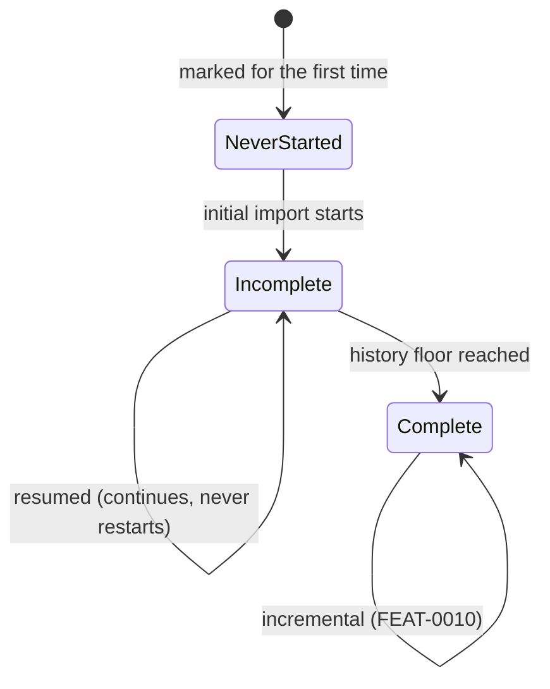

# FEAT-0009. Contratos menores: opt-in marking and initial import

## Goal
Make an Órgano's **contratos menores** loadable: an administrator marks the Órganos worth
importing, and the system retrieves each marked Órgano's **full published history** from
contratosdegalicia.gal and stores it, resuming when a load measured in days is interrupted.
This is the first buildable slice of
**[SPEC-0005](../../specs/SPEC-0005-import-browse-contratos-menores.md)**.

It delivers R3–R5 whole; **R6, R7 and R27's storage obligations** (what is stored, and that it
is stored as published — every *display* obligation is the browsing feature's); R11 and R12; the
**initial** and **resumed** modes of R8; **the on-demand half of R9** (an interrupted import
retains what it stored and is resumed by an administrator — automatic resumption needs the
scheduler and goes with it); the mark and manual triggers of R4 and R20; the system-wide guard
of R22; and R23's per-Órgano failure isolation.

It exposes **no contract read endpoint**. Nothing browses contratos menores until the browsing
feature builds the family split, the year scoping, the sort and the paging control (R14–R19)
over the rows stored here — the same order FEAT-0006 and FEAT-0007 took for the Órgano
catalogue. What it does put on screen is the **mark itself**, added to FEAT-0007's admin
Órganos section, so opting an Órgano in is an administrator's action rather than a `curl`.

The design sits in the hexagonal server of
**[ADR-0002](../../architecture/0002-hexagonal-architecture.md)**: the contratos menores
scraper is a driven adapter behind a port, the REST endpoints are driving entry points, and the
`ContratoMenor` aggregate maps 1:1 to its own table
(**[ADR-0008](../../architecture/0008-domain-entities-carry-persistence-mapping-annotations.md)**).
Retrieval is blocking I/O over virtual threads
(**[ADR-0011](../../architecture/0011-blocking-io-virtual-threads.md)**) through the resilient,
self-throttling declarative client of
**[ADR-0014](../../architecture/0014-resilient-throttled-outbound-http-client.md)**, which is
what satisfies R25 without this feature choosing a rate. The run's durable state follows
**[ADR-0017](../../architecture/0017-import-run-state-in-postgresql.md)**. REST lives under the
reserved `/api/` prefix (**[ADR-0006](../../architecture/0006-reserved-api-url-prefix.md)**),
named per **[ADR-0016](../../architecture/0016-rest-resource-naming.md)**, carries the
rate-limit contract of **[ADR-0012](../../architecture/0012-rate-limit-http-contract.md)**, is
authored contract-first
(**[ADR-0010](../../architecture/0010-design-first-openapi-contract.md)**) and guarded by
session security (**[ADR-0005](../../architecture/0005-session-based-authentication.md)**). The
UI is the React Router SPA
(**[ADR-0003](../../architecture/0003-react-router-ui-served-by-backend.md)**) built with Vite +
Mantine (**[ADR-0004](../../architecture/0004-ui-stack-vite-mantine.md)**) in the feature-based
layout of
**[ADR-0015](../../architecture/0015-frontend-feature-based-shared-core-modularization.md)**.

> **The prerequisites this feature builds onto are settled.**
> [ADR-0017](../../architecture/0017-import-run-state-in-postgresql.md) is `accepted`, so the
> run record and the guard rest on a decision that is no longer up for debate; and
> [SPEC-0005](../../specs/SPEC-0005-import-browse-contratos-menores.md) is `active`.
> One prerequisite is **not** settled and this feature does not settle it either: the source's
> query surface for contratos menores is unknown, which is why task 1 confirms it before any
> task commits to an identity, a constraint or a window size.

## Scope
- **Domain (the mark):** one administrator-managed attribute on `OrganoDeContratacion` —
  whether its contracts are imported — with the `OrganoRepository` reads and writes that set it,
  clear it, and list the marked Órganos (R4). SPEC-0004's catalogue reconciliation never touches
  it (R5).
- **Domain (the contract):** a `ContratoMenor` aggregate carrying the attributes the source
  publishes **as published** — the awarding Órgano, publication date, object, amount including
  VAT, stated duration, awardee name and awardee fiscal identifier — plus the source's own
  publication identifier as its stable identity and whatever addresses that publication at the
  source (R7, R16, R27), and a `ContratoMenorRepository` port.
- **Domain (source port):** a `ContratoMenorSource` port that answers one **(Órgano, date
  window)** slice at a time, because that is the only shape the source offers (SPEC-0005,
  *"retrievable only in bounded slices"*).
- **Domain (per-Órgano import state):** the durable, retention-proof facts about an Órgano's
  load — whether its initial import has **never started**, **started and is incomplete**, or
  **completed**; the **cursor** an interrupted load resumes from; and the instant its history is
  **covered through**.
- **Domain (run state):** the durable import-run record of
  [ADR-0017](../../architecture/0017-import-run-state-in-postgresql.md) — one row per run with
  its per-Órgano coverage — the **derived-abandoned read rule** that keeps a dead run from
  wedging the system, and the **system-wide single-import guard** that reads both (R22).
- **Domain (use case):** `ImportContratosMenores` — for each eligible Órgano in turn, walk its
  history in date windows, upsert each batch idempotently, advance the state, and stop cleanly
  when the Órgano is unmarked mid-run (R3, R5, R9, R11, R12, R23).
- **Infrastructure:** migrations for the mark, the contratos menores table, the per-Órgano
  import state and the run record; their Micronaut Data JDBC repositories; and the
  contratosdegalicia.gal adapter behind `ContratoMenorSource`.
- **Application (driving):** the `ADMIN`-only endpoints of the *API surface* section below — the
  mark, the two triggers, the run read that makes a trigger answerable, and an administrator's
  catalogue read carrying the mark.
- **UI:** a mark/unmark control and a *marked* indicator in FEAT-0007's admin Órganos section,
  with the run outcome surfaced where its import-trigger feedback already lives.

**Out of scope (owned by later features):**
- **The incremental mode and the scheduler** — R8's window floor, R21's recurring run, and with
  them R9's *automatic* resumption — belong to the next feature, *FEAT-0010. Contratos menores
  incremental refresh*. The consequence is stated rather than hidden: **until it lands, a
  refused mark is not recovered by a scheduled run** (SPEC-0005 #33), an interrupted initial
  import resumes only when an administrator triggers it, and a loaded Órgano goes stale. That is
  the price of shipping the load before the refresh, and every mechanism the second feature needs
  — the mode rule, the per-Órgano state, the covered-through instant, the run record — is built
  here with its incremental branch left unimplemented rather than unanticipated.
- **The historical re-read (R10) and contract removal/restore (R13)** — the two administrator
  corrections — belong to a later curation feature. R13 in particular changes what a re-import
  may re-add, so it lands with the surface that shows a contract, not with the one that loads it.
- **Browsing (R14–R19)** — the family split, the mandatory year scoping, the sort, R17's paging
  control, the per-row link to the source and the crossing into an operador — and the R24
  latency measurement taken over them. All of it reads the rows this feature stores.
- **The import-run monitoring surface** — [SPEC-0007](../../specs/SPEC-0007-monitor-import-runs.md)'s
  run list, its filters, run diagnostics, live progress and retention. This feature builds **only
  the run columns its own guard, its own resumer and R20's outcome need**, and one plain read of
  one run; SPEC-0007's features widen the same rows rather than opening a second store, which is
  the property ADR-0017 exists to guarantee. Note that ADR-0017 decides *where* the state lives
  and says explicitly that the **schema is not decided there** — so no column here is justified
  by "SPEC-0007 will want it", and each is justified below by a requirement this feature meets.
- **Operadores económicos** ([SPEC-0006](../../specs/SPEC-0006-operadores-economicos.md)) — this
  feature only owes them the awardee name and fiscal identifier stored on every contract (R7).

## Design

### Hexagonal placement ([ADR-0002](../../architecture/0002-hexagonal-architecture.md))

```mermaid
flowchart LR
    subgraph application["application (driving)"]
        markApi["PUT/DELETE /api/admin/organo/&#123;id&#125;/importado"]
        importApi["POST .../contratos-menores/import"]
        runApi["GET /api/admin/import-run/&#123;id&#125;"]
        organosUi["admin Órganos section: mark control"]
    end
    subgraph domain["domain"]
        useCase["ImportContratosMenores"]
        organoState["per-Órgano import state + mode rule (R8)"]
        guard["single-import guard (R22)"]
        contrato["ContratoMenor"]
        contratoRepo["ContratoMenorRepository (port)"]
        sourcePort["ContratoMenorSource (port)"]
        runRepo["ImportRunRepository (port)"]
    end
    subgraph infrastructure["infrastructure (driven)"]
        jdbcContratos["JdbcContratoMenorRepository"]
        jdbcRuns["JdbcImportRunRepository"]
        scraper["contratosdegalicia ContratoMenorSource adapter"]
    end
    application --> domain
    infrastructure --> domain
```

### The mark, and what it survives
- The mark is a boolean **column on `organo_contratacion`**, defaulting to false so a newly
  discovered Órgano is never imported by accident (R4). It sits on the same row the taxonomy
  placement does, and for the same reason: SPEC-0004's reconciliation is **update-in-place**, so
  a column added here survives every catalogue re-import without that import knowing it exists
  (R5). No task changes `OrganoReconciler`'s write set; that is what proves criterion #6.
- **Eligibility is `active && importado`** (R3), evaluated by the use case rather than by each
  trigger, so the manual trigger, the mark trigger and the future scheduler cannot disagree
  about it. An explicitly named Órgano that fails the test does not start a run and is told
  **why**, which is a different refusal from the guard being held (R20, #34).

### What a stored contract holds ([ADR-0008](../../architecture/0008-domain-entities-carry-persistence-mapping-annotations.md))
- The aggregate maps 1:1 to `contrato_menor`, keyed by a system-assigned UUID, with the
  **source's own publication identifier unique** — so "no duplicates" (R12) holds at the store
  level and not only in use-case logic, exactly as `source_key` does for the catalogue. The
  awarding Órgano is referenced by its **UUID**, not its source key.
- **Every published value is stored as published** (R27) — object, amount, duration, awardee
  name, awardee fiscal identifier, publication date — as text, with padding and casing intact.
- Alongside them the row carries **interpreted** columns: the publication date as a date and the
  amount as a number, **nullable**. R27 permits reading a published value as a number or a date
  for *ordering, filtering and counting only*, and forbids storing the interpretation in place of
  the publication; two columns is what keeps both true. A value that cannot be interpreted leaves
  its interpreted column null — the contract is stored anyway (#42), and the browsing feature is
  what gives a null date its *undated* selection (R19) and a null amount its last place in an
  amount sort.
- **Whatever addresses the publication at the source is captured at import time**, because it is
  visible only to the adapter and only then. R16 requires every row to offer a way to reach its
  original, and if the publication identifier alone does not construct that address, a browsing
  feature cannot retro-fit it onto millions of rows without re-importing them. Task 1 confirms
  what addressing takes; tasks 4 and 5 store it.
- The interpreted publication date is what the browsing feature's mandatory year scoping will
  index on; this feature creates the index it will need, on the same reasoning — adding one to a
  table of millions later is a different operation from creating it empty.

### State has two homes, and the split is decided by retention
[ADR-0017](../../architecture/0017-import-run-state-in-postgresql.md) settles that a run's state
is durable and lives in PostgreSQL. It leaves the schema open, and the schema question that
matters here is **which facts belong to the Órgano and which to the run**, because
[SPEC-0007](../../specs/SPEC-0007-monitor-import-runs.md) R17 will prune run history:

| Fact | Home | Why |
| --- | --- | --- |
| Initial import never started / incomplete / complete | Órgano | R8's mode rule; protected from pruning by SPEC-0007 R18 |
| Resumption **cursor** | Órgano | see below |
| **Covered-through** instant | Órgano | FEAT-0010's window floor measures from it |
| Run identity, trigger, scope, times, state, counts | Run record | R20's outcome; SPEC-0007 reports the same rows |
| Last-advanced time | Run record | the guard's liveness bound (ADR-0017) |

- **The cursor belongs to the Órgano, not to the run.** SPEC-0007 R17 keeps, beyond its bound,
  the most recent run *in which that Órgano itself succeeded* — and an Órgano whose initial
  import was interrupted has no such run. Its run rows are therefore prunable, and a cursor
  living on them is prunable with them, leaving an `incomplete` Órgano with nowhere to resume
  from and no option but to restart a multi-day walk at one request per second. R18 protects
  *last imported successfully* and *ever attempted*; it does not protect a cursor, and this
  feature does not assume it will.
- **The covered-through instant is not "the last successful import".** Under a newest-first walk
  (below) an initial import covers `[cursor, T₀]`, where `T₀` is when its **first** window was
  taken — and an initial import spanning several resumptions has several run starts. If
  FEAT-0010's floor measured from the latest of them, everything published between the first
  attempt and that resumption would fall outside every future window and be reachable only by
  R10, which no feature owns: R8's named "silent data-loss mechanism", reintroduced by an
  off-by-one in a timestamp. So the Órgano records `T₀` when the initial import first runs and
  **carries it across resumptions**, and that is the instant FEAT-0010 measures from.

### One run record, read by the guard and by whoever triggered
- A run is recorded **when it is triggered**, with its covered Órganos **enumerated then** —
  not discovered as the run reaches them. That is R20's requirement, not an anticipation of
  SPEC-0007: the outcome must name *which Órganos were covered and which of them failed*, and a
  run that dies at the fortieth of four hundred cannot reconstruct the list it was going to
  cover. Each covered Órgano's row carries its state and its counts.
- **Contracts commit in batches; the run record advances afterwards, in its own short
  transaction.** A failed progress write is logged and abandoned, never propagated into the
  import — the import wins and the record is what is sacrificed (ADR-0017).
- The cursor is advanced on the same beat and is **a conservative hint, not a ledger**: a crash
  between a data commit and a cursor write leaves it slightly behind what is stored, and the
  resumption re-reads that overlap harmlessly because R11 and R12 make re-reading an update in
  place.
- **Batch size and the abandonment bound are one decision, taken together** (ADR-0017): batches
  coarser than the bound would make a healthy run read as dead, and batches finer than necessary
  spend write load on the busiest path in the system. Task 8 chooses both and records the
  reasoning.

### The guard, and the two ways a naive one is worse than the flag it replaces
`ImportOrganos` today holds an in-process `AtomicBoolean`. R22's guard is system-wide across
both importers, so it has to be durable — but a durable guard that is only "is there a live
run?" fails in two ways the flag did not:

1. **A dead process must not wedge the system.** The `AtomicBoolean` at least cleared on
   restart. A row saying *in progress* does not, and SPEC-0007 R19 forbids editing run records —
   so one crash mid-run would block every import forever, with no operation to clear it.
   ADR-0017 already decided the answer: a run whose last advance is older than a configured
   bound **reads as abandoned**, applied in one place so no query can forget it. That rule is
   not monitoring polish that can wait for SPEC-0007; it is what makes the guard safe, so task 8
   builds it.
2. **The check and the write must be one act.** Two triggers — the mark control and an admin
   trigger today, the scheduler after FEAT-0010 — can both read *no live run* and both insert.
   The guard is the single thing standing between this system and a public source that
   [ADR-0014](../../architecture/0014-resilient-throttled-outbound-http-client.md) says owes us
   nothing, so it is serialised in the database by a **partial unique index admitting one live
   run row**, not by application-level checking.

**This changes shipped behaviour, deliberately.** `ImportOrganos` must now *write* a live run row
— a guard cannot see an import that records nothing — which makes the catalogue import's
recording this feature's business; `ImportOrganosTest`'s already-running case and
`ImportOrganosAtomicityIntegrationTest` change shape with it; and FEAT-0006's daily overnight
catalogue import will be **refused for the whole duration of every multi-day initial import**.
R22 accepts exactly that cost; it is written here so it is expected rather than discovered.

### Mode selection: three states, not two
The mode is chosen **per Órgano**, from a durable per-Órgano fact rather than from the trigger
that arrived:

- **Never started** takes an *initial* import, **incomplete** takes a *resumed* one, **complete**
  takes an *incremental* one. Two states would collapse the first two, and a half-loaded Órgano
  would be treated as up to date — the defect R8 names explicitly.
- FEAT-0010 implements the incremental branch and the window floor. This feature leaves the rule
  with that branch unimplemented and its three states already tracked.

### Walking a history in windows, newest first
- The source answers one bounded date range per request, so an initial import walks the Órgano's
  history in windows, **newest window first, backwards**. The window size is bounded by the
  source's own maximum range, which task 1 confirms.
- Newest-first is chosen because an initial import of a large Órgano runs for days: the
  most-consulted contracts become browsable within hours instead of at the end, R18's *partial*
  marker describes a list growing backwards rather than one missing everything recent, and R19's
  default year — the most recent the Órgano has contracts in — is meaningful from the first
  batch.
- **The walk ends at a configured history floor — the source's own published history, which
  begins around 2018 — and reaching that floor is what marks the initial import complete.** It
  does **not** stop at the first empty window. An empty window is evidence of a gap, not of the
  earliest publication: for the small Órganos that are most of the catalogue a month with no
  contratos menores is ordinary, and stopping there would mark an Órgano complete with most of
  its history unread, failing #12 invisibly and leaving it thereafter on the incremental path.
  If walking to the floor proves wasteful in practice, the alternative is *N consecutive* empty
  windows with N justified against observed data — not a single one.

### API surface ([ADR-0016](../../architecture/0016-rest-resource-naming.md), [ADR-0010](../../architecture/0010-design-first-openapi-contract.md), [ADR-0012](../../architecture/0012-rate-limit-http-contract.md))

| Method & path | Role | Purpose |
| --- | --- | --- |
| `PUT /api/admin/organo/{id}/importado` | `ADMIN` | Mark, and request an import (R4) |
| `DELETE /api/admin/organo/{id}/importado` | `ADMIN` | Unmark; stops a run in progress for it (R5) |
| `POST /api/admin/contratos-menores/import` | `ADMIN` | Import every marked, active Órgano (R20) |
| `POST /api/admin/organo/{id}/contratos-menores/import` | `ADMIN` | Import one named Órgano (R20) |
| `GET /api/admin/import-run/{id}` | `ADMIN` | The state and outcome of one run |
| `GET /api/admin/organos` | `ADMIN` | The catalogue as an administrator sees it, with `importado` |

- **Mark and unmark are two methods, not one flag with a body.** They are two use cases with
  genuinely different rules — marking requests an import and can be refused; unmarking stops one
  — which is FEAT-0007's stated reason for `PUT`/`DELETE` on the taxonomy placement. A mark
  triggers a **single-Órgano** import, not a sweep.
- **A trigger is asynchronous.** An initial import runs for days, so no trigger can carry R20's
  outcome in its response: each returns **`202` with the run's identifier**, and
  `GET /api/admin/import-run/{id}` is where succeeded / failed / **partially succeeded**, the
  covered Órganos, which of them failed, and the contracts added and refreshed are read. Partial
  success is a first-class verdict — R23 requires a run to carry on past a failing Órgano, so it
  is the likeliest verdict of a multi-Órgano run. That one read is why #29 and #30 are provable
  here at all; without it this feature would ship an importer whose outcome nobody, not even the
  administrator who triggered it, could see. SPEC-0007's run list, filters, diagnostics and live
  progress supersede it later, over the same rows.
- **A refusal is an outcome too**, and states which refusal it was: another import holds the
  guard, or the named Órgano is not eligible (R20, #34). A refused run has no start and no
  counts.
- **The outcome is a new schema, not the shipped `ImportOutcome`.** That one enumerates
  `[SUCCESS, ALREADY_RUNNING]` only, reports failure as a 500 problem, and caps its counts at
  100 000 — a bound SERGAS alone breaks by an order of magnitude. The new schema takes the full
  verdict set and no such cap.
- **The mark is exposed on an `ADMIN`-only catalogue read**, not on FEAT-0007's authenticated
  `GET /api/organos`. R18 deliberately leaves a `USER` unable to tell an unimported Órgano from
  one that awarded nothing, SPEC-0005 R1 puts *seeing which Órganos are marked* behind `ADMIN`,
  and SPEC-0007 R15 keeps Órgano-side import facts out of the shared views for the same reason.
  This does break FEAT-0007's "an Órgano is serialised by exactly one endpoint" rule; the trade
  is taken knowingly, because the alternative is handing a `USER` the one fact two specs
  independently decided to withhold.
- Every operation declares its statuses, its problem types and ADR-0012's rate-limit headers in
  [`docs/api/openapi.yaml`](../../api/openapi.yaml) **before** its controller exists (ADR-0010);
  the shared ruleset fails the lint without them.

### Retrieval, pacing and failure ([ADR-0014](../../architecture/0014-resilient-throttled-outbound-http-client.md))
- The adapter **declares a client interface** carrying the `@ResilientClient` advice; it builds
  no request and holds no client. It binds `@Client(id = "contratosdegalicia")` — the **same
  id** the Órganos adapter uses — so both share the one `RateLimiter`, `CircuitBreaker` and
  `Retry` that `ContratosDeGaliciaResilienceFactory` already publishes per source. That sharing
  is what makes "this feature configures no new rate" true rather than aspirational, and R25 a
  property of the wiring. Given the `@Named`-qualifier bite this project has already taken,
  binding the same id is called out here rather than left to the task.
- **Prerequisite:** FEAT-0006 TASK-0008 moves the Órganos adapter onto that declarative client.
  Until it lands, `ContratosDeGaliciaOrganoSourceAdapter` still injects a programmatic
  `@Named` client and the shared policy is not actually shared.
- The exact query surface — the request shape, its date-range parameters, its maximum range, how
  a slice pages, whether a publication carries a stable identifier, and how a publication is
  addressed — is **confirmed against the live source by task 1**, before any task commits to it.
- A run executes on a **dedicated single-thread virtual-thread executor**, kept off the
  request-serving pool, following the precedent FEAT-0006 set for its scheduled import. A
  multi-day job must not occupy request-serving capacity.
- An unusable response is the adapter's own judgement and surfaces as a domain failure (ADR-0014
  keeps response *content* outside the breaker). A failure aborts **that Órgano**, not the run:
  contracts already stored for it and for Órganos processed earlier stay intact, and the run
  continues to the next Órgano (R23).

## Sequencing (tasks, one small change each)
1. **Confirm the contratos menores source contract** — against the live source: the per-Órgano,
   date-bounded query shape and its maximum range, how a slice pages, whether each publication
   carries a stable identifier, and how a single publication is addressed. Everything downstream
   assumes an answer to each; the task's output is the recorded answer, not production code.
   *(enables SPEC-0005 #12, #17, #25)*
2. **Import mark on the Órgano catalogue** — a migration adding `importado` (not null, default
   false) to `organo_contratacion`, the field on the `OrganoDeContratacion` aggregate, and the
   `OrganoRepository` reads/writes for it, with `OrganoReconciler`'s write set deliberately
   untouched. *(SPEC-0005 #4 storage half, #6)*
3. **Mark administration API** — `MarkOrganoForImport` / `UnmarkOrganoForImport` use cases,
   `PUT`/`DELETE /api/admin/organo/{id}/importado`, and an `ADMIN`-only `GET /api/admin/organos`
   carrying the mark, both authored in `openapi.yaml` first. Marking does not yet trigger
   anything — task 12 wires that once there is something to trigger. *(SPEC-0005 #1 mark half,
   #4)*
4. **`ContratoMenor` domain model + repository port** — the aggregate (UUID identity, the
   source's publication identifier, whatever addresses it at the source, the awarding Órgano's
   UUID, every published value as published, and the nullable interpreted date and amount) plus
   the `ContratoMenorRepository` port. *Depends on task 1.* *(SPEC-0005 #11 storage half, #40
   storage half, #42 storage half)*
5. **Contratos menores store** — the migration creating `contrato_menor` (unique publication
   identifier, FK to the Órgano, the index the year-scoped read will need) and the Micronaut Data
   JDBC implementation of the port, including the batch upsert that makes re-import idempotent.
   *(SPEC-0005 #17 no-duplicates half)*
6. **`ContratoMenorSource` port + contratosdegalicia adapter** — the port and its declarative
   `@ResilientClient` adapter on the shared `contratosdegalicia` id (ISO-8859-1, paged within a
   slice), failing cleanly when the source is unreachable or its response is unusable. *Depends
   on task 1 and on FEAT-0006 TASK-0008.* *(SPEC-0005 #36 source-failure half, #38 initial-import
   mode only, #40 as-published half)*
7. **Per-Órgano import state + the R8 mode rule** — a migration and repository for the
   three-state fact, the cursor and the covered-through instant, with the mode-selection function
   that reads them; the incremental branch is named and left to FEAT-0010. *(SPEC-0005 #46 state
   half, #47 initial/resumed half only — the other two modes are not built)*
8. **Import run record, abandoned rule and system-wide guard** — migration and repository for the
   run and its per-Órgano coverage rows; the derived-abandoned read applied in one place; the
   partial unique index admitting one live run; and the batch-size/abandonment-bound decision
   recorded. *(SPEC-0005 #32 guard half)*
9. **Adopt the guard in the catalogue import** — `ImportOrganos` off its `AtomicBoolean` onto the
   shared guard, recording a run row as it goes, with its unit and atomicity tests reshaped. Kept
   separate from task 8 on FEAT-0006's own build-then-adopt precedent. *(SPEC-0005 #32 spans both
   importers)*
10. **A single Órgano's initial import** — the newest-first window walk to the history floor,
    batch upsert, cursor and covered-through advanced after each batch, and resumption from the
    cursor adding no duplicates. *(SPEC-0005 #12, #14 retained-and-resumed-on-demand halves only,
    #16 storage half, #17, #46)*
11. **Multi-Órgano orchestration** — eligibility filtering, Órganos processed serially, a clean
    stop when the Órgano is unmarked mid-run, per-Órgano failure isolation, and the run's
    per-Órgano states and counts. *(SPEC-0005 #3, #7 first two clauses, #8, #32 serial half, #36)*
12. **Triggers and the run read** — `POST /api/admin/contratos-menores/import` and
    `POST /api/admin/organo/{id}/contratos-menores/import` returning `202` and a run identifier,
    `GET /api/admin/import-run/{id}` returning the verdict, covered and failed Órganos and the
    counts, and marking wired to the same use case so a mark requests an import and is refused,
    with its reason, when the guard is held. OpenAPI-first. *(SPEC-0005 #1 trigger half, #5
    immediate half only, #29 initial/resumed modes only, #30, #34)*
13. **Admin marking UI** — the mark/unmark control and *marked* indicator in FEAT-0007's admin
    Órganos section, and the run outcome shown where that section already reports an import.
    *Depends on FEAT-0007's Órganos section.* *(SPEC-0005 #4 UI half)*

**Criteria this feature deliberately leaves incomplete**, so no task is written against something
it cannot prove: #5's *next scheduled run* clause, #14's *without an administrator intervening*
clause, #29's *incrementally* clause, #33 and #44 whole, and #38's re-read and incremental modes
all wait on FEAT-0010; #14's progress-visibility half and #32's *recorded as a refused run* half
are SPEC-0007's; #1's re-read and remove/restore operations are the curation feature's; and the
*displayed* halves of #9, #11, #16, #26, #40 and #42 are the browsing feature's.

## Edge cases
- **Catalogue re-import while Órganos are marked** — SPEC-0004's reconciliation updates name and
  active state in place and writes nothing else, so every mark survives; a task that widens
  `OrganoReconciler`'s write set breaks criterion #6. *(SPEC-0005 #6)*
- **Unmarked mid-import** — the run checks eligibility between batches and stops that Órgano
  cleanly at a batch boundary, keeping everything already stored and leaving the cursor where it
  is. The Órgano stays **incomplete**, which is what makes a later re-mark resume rather than
  restart. *(SPEC-0005 #8, #46)*
- **Marked, unmarked while half-loaded, marked again** — resumed, never treated as up to date;
  it continues from the cursor, adds no duplicates and completes the full history. Contrast an
  Órgano whose initial import had **completed**: the same sequence takes the incremental mode,
  which FEAT-0010 delivers (#44 with it). *(SPEC-0005 #46)*
- **A run whose process dies** — its row still says *in progress*, and nothing sweeps it. The
  derived-abandoned read is what releases the guard after the configured bound; without it the
  first crash blocks every import in the system permanently. *(SPEC-0005 #32)*
- **Two triggers in the same instant** — the mark control and an admin trigger both read *no live
  run*. The partial unique index rejects the second insert, so one run starts and the other is
  refused with the guard as its reason. *(SPEC-0005 #32)*
- **Crash between a data commit and its cursor write** — the cursor points slightly behind what
  is stored; the resumption re-reads the overlap and the upsert makes it a no-op. *(SPEC-0005
  #14, #17)*
- **A resumption after a long gap** — the cursor and the covered-through instant live with the
  Órgano, so pruning run history under SPEC-0007 R17 cannot strand a half-loaded Órgano with
  nowhere to resume from. *(SPEC-0005 #14)*
- **An empty window mid-history** — ordinary for a small Órgano, and not a reason to stop: the
  walk continues to the configured history floor, which is the only thing that marks an initial
  import complete. *(SPEC-0005 #12)*
- **The same publication seen twice** — across a resumption overlap, a paging boundary or a
  straight re-run — upserts to the same row; the unique publication identifier makes a duplicate
  impossible even if the use-case logic slipped. *(SPEC-0005 #17)*
- **A publication absent from a later import** — retained unchanged. An import never deletes;
  absence is not evidence of withdrawal, and the explicit removal that *is* (R13) is a later
  feature's. *(SPEC-0005 #17)*
- **An attribute changed at the source** — matched by publication identifier and refreshed in
  place; identity and the row survive. *(SPEC-0005 #16 storage half)*
- **An uninterpretable amount or publication date** — stored and kept as published, with the
  interpreted column left null; the contract is never rejected. It is unreachable until the
  browsing feature ships R19's undated selection, which is why that feature owns the second half
  of criterion #42. *(SPEC-0005 #42)*
- **Source unreachable or unusable during a long run** — that Órgano's import fails and is
  recorded as failed; contracts already stored for it and for earlier Órganos are intact, and
  the run carries on to the remaining Órganos. *(SPEC-0005 #36)*
- **A trigger arriving while any import runs** — including SPEC-0004's catalogue import — is
  refused with the guard as its reason, and neither queued nor dropped silently. Until
  FEAT-0010's scheduler exists, a refused **mark** is not automatically recovered: the
  administrator is told it was refused and can trigger it again. *(SPEC-0005 #32; #33 completes
  with FEAT-0010)*
- **An explicitly named Órgano that is inactive or unmarked** — no import starts, and the reason
  reported is ineligibility, distinct from the guard refusal. *(SPEC-0005 #34)*
- **An Órgano becoming inactive mid-run** — R5 requires the run to stop for it, and it cannot
  happen: only the catalogue import deactivates an Órgano, and the system-wide guard forbids it
  running while this one does. The obligation is met by the guard rather than by a check, which
  is worth knowing before someone writes the check. *(SPEC-0005 #3)*
- **An Órgano that publishes no contratos menores at all** — the majority of the catalogue —
  reaches the history floor having stored nothing. That is a completed import, not a failure, and
  it stays invisible to users because the browsing feature renders no empty section. *(SPEC-0005
  #26, browsing half deferred)*
- **A source that back-dates a publication** — SPEC-0005 states the assumption that it does not,
  and marks it load-bearing rather than proven. A back-dated entry would fall behind the cursor
  and be reachable only by R10's historical re-read, which no feature owns yet. Recorded here so
  it is a known gap rather than a surprise. *(SPEC-0005 R8)*
- **Accented text** — the source is ISO-8859-1, as the Órganos adapter already found; objects
  and awardee names are decoded once, at the adapter, and stored without mojibake, since R27
  forbids correcting them afterwards. *(SPEC-0005 #40)*
