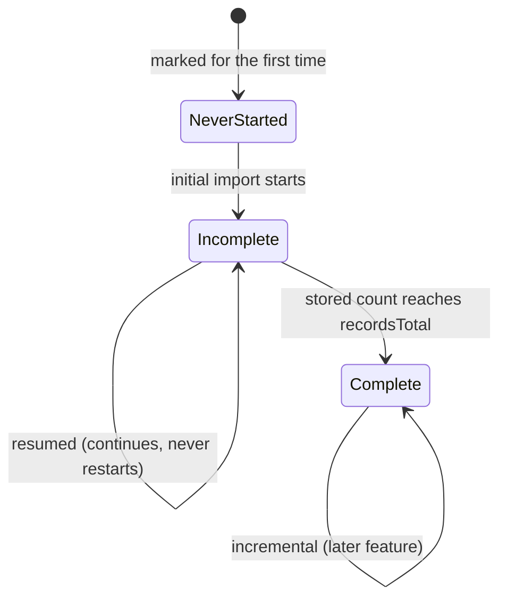

# Per-Órgano import state + the R8 mode rule

The durable, retention-proof facts about one Órgano's contratos menores load, and the function
that picks the mode from them. Governed by
[ADR-0017](../../architecture/0017-import-run-state-in-postgresql.md) — which decides that
this state is durable and lives in PostgreSQL, and explicitly leaves the schema open — and by
[ADR-0002](../../architecture/0002-hexagonal-architecture.md) /
[ADR-0008](../../architecture/0008-domain-entities-carry-persistence-mapping-annotations.md).
It also widens one shipped contract — the admin catalogue read of
[TASK-0002](TASK-0002-mark-administration-api.md), which is why it depends on that task and
carries its OpenAPI, naming, security and rate-limit records too. It touches `importable`
nowhere, so it does not depend on
[TASK-0001](TASK-0001-import-mark-on-organo-catalogue.md).

**Why these three facts live with the Órgano and not with the run** is the feature's *State has
two homes* section: [SPEC-0007](../../specs/SPEC-0007-monitor-import-runs.md) R17 prunes run
history, and an Órgano whose initial import was interrupted has no successful run to protect
its rows — so a cursor stored on a run is prunable, leaving a half-loaded Órgano with nowhere to
resume from and a multi-day walk to redo at one request per second.

## Scope
- A migration (next free `V` number) creating `contrato_menor_import_state`, keyed by
  `organo_id` (primary key, FK to `organo_contratacion`):
  - `state TEXT NOT NULL` — `NEVER_STARTED` / `INCOMPLETE` / `COMPLETE`;
  - `cursor_date DATE` — the point a resumption continues from;
  - `covered_through TIMESTAMPTZ` — **T₀**, when the initial import's *first* window was taken.

  It has **no identity of its own at all**: it is a **value inside the `OrganoDeContratacion`
  aggregate**, not an aggregate beside it. An Órgano has exactly one, nothing distinguishes two of
  them, and `organo_id` is the column that files the row under its owner — the table's key, not
  the value's. So it introduces no identifier type (a `ContratosMenoresImportStateId` would assert
  an identity this row does not have) and it **compares by its contents**, which is what makes a
  state read before an advance differ from the one read after. It keys on `OrganoId`, the Órgano's
  own type: this task was written expecting a raw `UUID`, on
  [ADR-0019](../../architecture/0019-typed-aggregate-identifiers.md)'s statement that the
  catalogue is not converted by this feature, but the catalogue has since been converted anyway.
  **ADR-0019's adoption paragraph is stale on this point** and wants a follow-up amendment; the
  column is `UUID` either way.

  Being a value of that aggregate, it is **loaded with the Órgano** — `OrganoRepository`
  left-joins it — rather than read separately and paired up by a caller. The state repository
  exists for the writes the walk makes.
- **Its own table, not three more columns on `organo_contratacion`.** The catalogue row is
  update-in-place territory for reconciliation and is read by every catalogue read; this row is
  rewritten after every batch for days. Separating them keeps that churn off the row the mark
  must survive on, and keeps each aggregate 1:1 with its table per ADR-0008. A row is created
  when an Órgano's import first starts; an Órgano with no row **is** `NEVER_STARTED`.
- The value and a `ContratosMenoresImportStateRepository` port: read one Órgano's state,
  create it at `INCOMPLETE` with T₀ on first start, advance the cursor, and mark `COMPLETE`.
- **T₀ is written once and carried across resumptions** — never re-stamped. Under the
  newest-first walk an initial import covers `[cursor, T₀]`, and an import spanning several
  resumptions has several run starts; measuring a future incremental window from the latest of
  them would leave everything published between the first attempt and that resumption outside
  every future window, reachable only by R10, which no feature owns. That is R8's named silent
  data-loss mechanism, reintroduced by an off-by-one.
- **The mode rule** — one pure function from the state to the mode, so the manual trigger, the
  mark trigger and the future scheduler cannot disagree about it:
  `NEVER_STARTED → INITIAL`, `INCOMPLETE → RESUMED`, `COMPLETE → INCREMENTAL`.

- **The `INCREMENTAL` branch is named here and implemented nowhere.** The mode is returned;
  the orchestrator of [TASK-0010](TASK-0010-multi-organo-orchestration.md) skips such an
  Órgano with that reason recorded rather than treating it as done or as a failure. The
  incremental feature implements it and the window floor that measures from `covered_through`.
  A historical re-read (R10) is not a value this function can return — no trigger selects it
  automatically, and no feature owns it yet.
- `GET /api/admin/organos` (from
  [TASK-0002](TASK-0002-mark-administration-api.md)) gains the Órgano's state, so the admin UI
  can render `MARCADO` / `PARCIAL` / `IMPORTADO` rather than inferring a half-loaded Órgano is
  up to date. Contract updated in `openapi.yaml` first, as before.

## Acceptance criteria
- An Órgano with no state row resolves to `NEVER_STARTED` and takes the **initial** mode; one
  at `INCOMPLETE` takes **resumed**; one at `COMPLETE` takes **incremental**. Three states, and
  a half-loaded Órgano is never treated as up to date by either the rule or the read.
  ([SPEC-0005](../../specs/SPEC-0005-import-browse-contratos-menores.md) #46, #47)
- `covered_through` is stamped when the state row is first created and is **unchanged** by
  every later advance, including one that follows a long gap; the cursor advances
  independently. (SPEC-0005 #46)
- The state row is **independent of any run record**: it carries no run identifier and no
  foreign key to one, so nothing that prunes run history can reach it. (That independence is
  exercised end-to-end by [TASK-0009](TASK-0009-single-organo-initial-import.md), which
  resumes after the run rows are deleted; here it is a property of the schema.)
- `GET /api/admin/organos` reports each Órgano's state, and an Órgano that has never been
  imported reports `NEVER_STARTED` whether or not it is marked. (SPEC-0005 #4)
- The mode rule is unit-tested as a pure function; the repository is integration-tested against
  PostgreSQL (Testcontainers).
