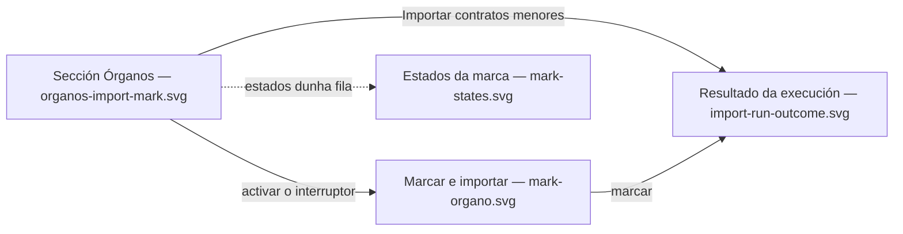

# Visual design — the import mark in the admin Órganos section

Static visual mockups for the only user interface
[FEAT-0009](../README.md) adds: the **mark that opts an Órgano into contratos menores
import**, and the **outcome of the run that mark or a manual trigger starts**. Both land
**inside FEAT-0007's admin Órganos section** — this feature opens no screen and no route
of its own, and browses no contract.

They render the mark control and its indicator on the term's Órganos table, the six states
a row can show, the confirmation the mark asks for, and every verdict the run read can
return — including the two refusals, which are deliberately not styled as errors. Built on
the project's Mantine stack
([ADR-0004](../../../architecture/0004-ui-stack-vite-mantine.md)) and the
[frontend design language](../../../../.claude/skills/frontend-design/SKILL.md), so
implementation has a concrete, faithful target.

These are **design artifacts, not code**: hand-authored SVG mirroring the real Mantine
`AppShell`, `Card`, `Table`, `Badge`, `Switch`, `Alert`, `Tooltip` and `Modal` components
with the project theme. The buildable UI is the feature's **task 12**, the last in its
sequencing; the four screens below are its visual target.

> The `source-contract.md` beside this README is **not** a design artifact — it is the
> measured contract of the contratosdegalicia.gal API the importer reads.

## Screens

| File | Screen | Covers |
| --- | --- | --- |
| [`organos-import-mark.svg`](organos-import-mark.svg) | The Órganos section with the new `CONTRATOS MENORES` column | The mark control, the *marked* indicator, the section-level trigger and a finished run's outcome (SPEC-0005 #4, #29, #30) |
| [`mark-states.svg`](mark-states.svg) | The six states of one row, and what each change does | Never started / incomplete / complete, the unmarked Órgano that keeps its contracts, the ineligible Órgano, and the mark ↔ unmark semantics (SPEC-0005 #3, #4, #6, #7, #8, #46) |
| [`mark-organo.svg`](mark-organo.svg) | *Marcar e importar* confirmation | What marking actually costs: a multi-day walk that holds the system-wide guard (SPEC-0005 #5, #32) |
| [`import-run-outcome.svg`](import-run-outcome.svg) | The six verdicts of one run | In progress, finished, **partially succeeded**, failed, and the two distinguishable refusals (SPEC-0005 #29, #30, #32, #33, #34) |



## What the design adds to FEAT-0007's section

- **One column, not a new screen.** The term's Órganos table gains `CONTRATOS MENORES`
  between `ESTADO` and `ACCIÓNS`; `ACCIÓNS` keeps FEAT-0007's `Quitar do termo` untouched.
  The count caption under the table gains the marked tally
  (*"4 órganos neste termo · 2 marcados para importar"*), which is the *listed as marked*
  half of criterion #4 and is derived client-side from the admin catalogue read.
- **A `Switch`, not a button pair.** The mark is a durable attribute of the Órgano, not a
  one-off action, and it maps 1:1 to the two endpoints (`PUT` on, `DELETE` off). It is also
  the only control narrow enough to add a column to an already four-column table without
  pushing the Órgano name to three lines. Icon-only, so it carries an `aria-label`.
- **A badge vocabulary that mirrors the three-state rule**, so the state the importer
  branches on is the state the administrator sees: `MARCADO` (indigo — nothing stored yet),
  `PARCIAL` (orange — stored and resumable), `IMPORTADO` (green — full published history).
  Two states would let a half-loaded Órgano read as up to date, which is the defect R8 names.
  A fourth badge, `SEN ACTUALIZAR` (grey — stored, no longer marked), keeps R5's retained
  contracts visible: the dimmed `—` is reserved for a row with **nothing** stored, so an
  Órgano holding a million contracts never reads like one never touched. Which of the two
  stored states it holds is on the tooltip rather than on a fifth badge.
- **A blocked mark is disabled and explains itself.** An inactive Órgano keeps its row,
  dimmed, with the switch disabled, a lock affordance and the reason on hover — never a
  hidden control, and never red: inactive is inert, not an error.
- **A second trigger beside the catalogue's.** `Importar contratos menores` is the outline
  peer of FEAT-0007's filled `Importar catálogo`. While either import runs, **both** are
  disabled with the guard as the stated reason — the shipped consequence of R22 that this
  feature accepts, drawn rather than discovered.
- **Refusals are grey, failures are red.** A run refused because the guard is held, or
  because the named Órgano is ineligible, is a normal outcome carrying no counts; only a run
  in which no Órgano could be imported is styled as a failure.

## Elements shown here that are deliberately not built

Rendered details with no contract behind them, called out so nobody builds against a
picture:

- **The banner survives no reload.** This feature exposes one run read, by identifier, and
  no *latest run* read. The outcome banner is therefore bound to the run the administrator
  triggered **in this session**: reloading the page loses it, and the mockups' banner is
  always a just-triggered run. A persistent *última importación de contratos menores*
  caption would need a read no endpoint offers — the same gap FEAT-0007's design recorded
  for the catalogue import.
- **No progress, anywhere.** No percentage, no *n de m órganos* counter, no bar, and
  nothing that refreshes itself. Progress and live run monitoring are
  [SPEC-0007](../../../specs/SPEC-0007-monitor-import-runs.md)'s, and this feature builds
  only the run columns its own guard, resumer and outcome need. `Actualizar` re-reads the
  one run on demand; the *consultado hai …* line exists so a reader can tell fresh from
  stale without one.
- **The confirmation quotes no size.** `mark-organo.svg` warns that the first import takes
  days and holds the guard, but names **no contract count** for the Órgano. The source
  reports one, and a single request could cost an Órgano before starting it — but no
  endpoint in this feature's API surface exposes it, so the modal states the cost
  qualitatively.
- **The confirmation itself is a design decision, not a requirement.** R4 asks for a mark;
  it does not ask for a dialog. It is drawn because the action is the most consequential in
  the admin area — days of walking, every other import refused meanwhile — and because
  `Marcar e importar` is the honest name for what the `PUT` does.

## How the design meets the spec

- **Mark, see marked, unmark (#4)** — the switch, the badge, and the marked tally under the
  table. A newly discovered Órgano arrives unmarked: `organos-import-mark.svg`'s third row is
  active, unmarked and shows nothing imported.
- **Marking imports immediately, or is refused (#5, #33)** — `mark-organo.svg` triggers it;
  `import-run-outcome.svg`'s *Rexeitada — garda* state is the other branch, and says the part
  the spec insists on: **the mark is kept**, the import is what was refused. It also states
  the consequence this feature ships with — no scheduled run recovers it yet, so the
  administrator must trigger it again.
- **The catalogue never touches the mark (#6)** — the design shows no place where an import
  of the catalogue writes it, and the toolbar's two triggers are drawn as peers precisely so
  the mark is not read as a property of the catalogue import.
- **Unmark keeps what was stored, and stops a run (#7, #8)** — `mark-states.svg`'s
  *Desmarcar* card states both, the `SEN ACTUALIZAR` row is what an unmarked Órgano's contracts
  read as, and its tooltip is where *partial* survives the unmark.
- **Three states, not two (#46)** — the state sheet is the mode rule made visible:
  marked-but-never-started and half-loaded are different badges, so an interrupted Órgano can
  never read as up to date.
- **The outcome names the verdict, the Órganos and the counts (#29, #30)** — four verdicts
  are drawn, with **partially succeeded** given the fullest layout because R23 makes it the
  likeliest result of a multi-Órgano run.
- **Two refusals, distinguishable (#32, #34)** — guard-held and not-eligible are separate
  states with separate copy; neither carries counts, and neither is styled as a failure.
- **Galician chrome (SPEC-0001 AC7)** — every label, badge, warning and refusal message is
  in Galician, and belongs in `ui/src/shared/lib/strings.ts` rather than inline.

## Regenerating previews

The SVGs are self-contained (no external assets) and open directly in a browser. To
rasterise for review:

```sh
inkscape design/organos-import-mark.svg --export-type=png --export-filename=organos-import-mark.png -w 1280
```
