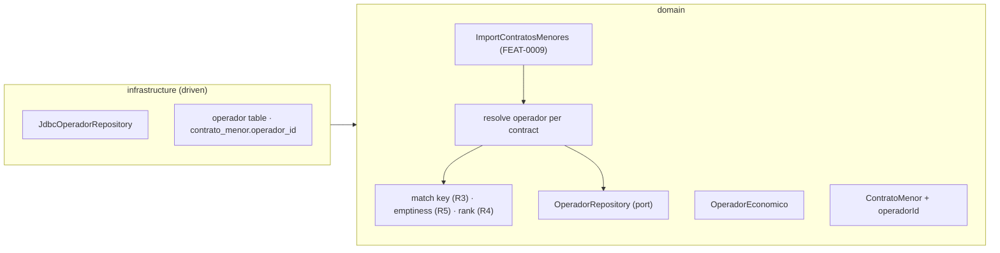
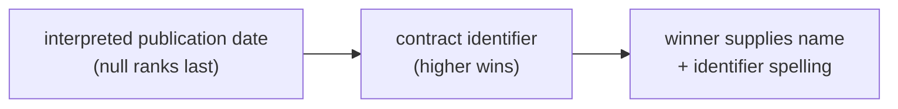

# FEAT-0010. Operadores económicos: the derived catalogue base

## Goal
Turn the awardee named on every contrato menor into a stored **operador económico**, so that the
contracts an import stores arrive already attached to the party they were awarded to. This is
the first slice of **[SPEC-0006](../../specs/SPEC-0006-operadores-economicos.md)** and it builds
the base the rest of that spec stands on: the catalogue itself (R2), the matching rule that
decides when two awards name the same operador (R3), the display rule that decides which
published spelling it is shown under (R4), the emptiness rule that decides when an award yields
no operador at all (R5), and the link from a contract to its operador.

It settles nothing about identity that
**[ADR-0018](../../architecture/0018-operadores-as-a-stored-projection.md)** has not settled:
the catalogue is **stored state maintained by the import**, keyed by the fiscal identifier under
R3's equivalence, with each contract carrying a foreign key to its operador.

**No operador is readable yet.** R8's list and lookup, R9's cross-Órgano contract history, R10's
filters and sorts and R11's paging are all later features — this one stops at the stored,
correctly-matched catalogue those surfaces will read, exactly as FEAT-0006 stopped at the stored
Órgano catalogue before anything read it.

It sits in the hexagonal server of
**[ADR-0002](../../architecture/0002-hexagonal-architecture.md)** — the operador aggregate maps
1:1 to its table with its own persistence annotations
(**[ADR-0008](../../architecture/0008-domain-entities-carry-persistence-mapping-annotations.md)**),
the matching and display rules are pure domain functions, and the derivation runs inside the
import use case
[FEAT-0009](../FEAT-0009-contratos-menores-initial-import/README.md) builds.

> **This feature must land before the first large initial import runs.** It adds a column to
> `contrato_menor` and it is the only thing that populates that column. Adding it to a table
> holding a million rows, and then backfilling those rows from data that is only correct if
> re-derived, is a materially different operation from creating it on an empty table — the same
> argument FEAT-0009 makes for creating its year index up front. The dependency is on FEAT-0009's
> store and import tasks, not on its whole delivery.

## Scope
- **Domain (the operador):** an `OperadorEconomico` aggregate — a system-assigned UUID, the
  **match key** (the fiscal identifier under R3's equivalence), and the **published name and
  published identifier spelling** it is displayed under, together with the rank those two were
  taken from — plus an `OperadorRepository` port (find by match key, insert, update the display
  fields).
- **Domain (the rules):** the R3 equivalence, the R5 emptiness test, and the R4 ranking, as pure
  functions with no store and no framework, unit-tested against the over-merge and under-merge
  cases SPEC-0006 states as separate criteria.
- **Domain (the link):** an optional operador reference on `ContratoMenor` — optional because R5
  requires an award with an unusable identifier to be stored with **no** operador rather than an
  invented one.
- **Domain (derivation):** resolving each stored contract to its operador as part of the import
  batch, creating the operador when no contract has named it before, and advancing its display
  fields when the contract outranks the incumbent.
- **Infrastructure:** a migration creating `operador` with a **unique** match key, adding the
  nullable `operador_id` foreign key to `contrato_menor`, and the Micronaut Data JDBC
  implementation of the port.

**Out of scope (owned by later features):**
- **Every read surface of SPEC-0006** — R8's operadores list, name and whole-identifier lookup
  and its fixed ordering; R9's contract history with its per-family sections, counts, totals and
  the two crossings; R10's year filter and sorts; R11's paging control; and R14's measurements
  over all of them. Nothing here is reachable over HTTP or on screen.
- **Driving R7's lifecycle when a change subtracts.** An operador is *reachable exactly as long
  as it has a visible contract*, and withdrawal is [SPEC-0005](../../specs/SPEC-0005-import-browse-contratos-menores.md)
  R13, which no feature builds yet. Until it does, no contract is ever invisible, so there is
  nothing for the lifecycle to subtract. What this feature owes the feature that builds it is
  stated in the design below, so the rule is not discovered late.
- **Demoting a stale display name.** Maintaining R4 forward — a newer contract wins — is a
  comparison this feature makes. Maintaining it *backward*, when the winning contract is
  withdrawn or corrected out of the operador, is the open half ADR-0018 names, and it belongs
  with the feature that makes a contract invisible in the first place.
- **Licitacións and any later family.** The catalogue is family-neutral by construction and this
  feature keeps it so, but contratos menores are the only family that exists to feed it.
- **Anything the contracts do not say** — SPEC-0006's Scope rules out enrichment, sector or size
  classification, entity linking, and any inference of whether an identifier belongs to a person
  or an entity. No column here records any of it (R6).

## Design

### Where the derivation sits ([ADR-0002](../../architecture/0002-hexagonal-architecture.md))

### Matching: exactly two things are ignored, and nothing else
- Two awards name the same operador when their published fiscal identifiers are equal
  **ignoring surrounding whitespace and letter case** (R3). That reduction is the **match key**,
  and it is what the `operador` table is unique on — so "the same operador never splits in two"
  holds at the store level, not only in whichever use case remembered to normalise. The spec is
  blunt about why it matters: matched naively "the aggregation fails silently, and a quiet
  undercount is worse than an error".
- **Nothing else is ignored.** Internal spacing, punctuation and any differing character produce
  **two** operadores, and SPEC-0006 makes that its own criterion (#4) alongside the merge one,
  because over-merging two real suppliers into one is as wrong as splitting one into two. The
  match-key function is where that line is drawn, and it is unit-tested from both sides.
- The match key is **never displayed** (R13). It exists to compare; what is shown is a published
  spelling, which is why the row carries both and why they are named so that reaching for the
  wrong one reads as wrong.
- An identifier that is **absent, or empty once trimmed**, is *unusable* (R5): the contract is
  stored, keeps its published awardee name, and gets **no operador** — never a placeholder, never
  a shared "unknown" row that would silently pool unrelated awards. Its `operador_id` stays null.
  Nothing beyond emptiness is validated: the source publishes irregular but genuine identifiers,
  and rejecting them would discard real awards.

### Display: one published spelling, chosen deterministically
R4 shows an operador under the name **and** the identifier spelling taken from its **most
recently published** contract, ties broken by the **higher** contract identifier, with contracts
whose publication date cannot be interpreted **ranked last**. So the rank is a triple:

- The operador row stores the winning **name**, the winning **identifier spelling**, and the
  **rank** they came from. When the import stores a contract, it compares that contract's rank
  against the row's; if it wins, the display fields and the rank move to it. That is one
  comparison per contract stored, rather than a top-1-per-operador computed on every read
  (ADR-0018).
- Storing the rank, not just the fields, is what makes the choice **deterministic across runs**
  (#7): without it, "is this contract newer than whatever won last time?" has no answer, and two
  imports over the same data could disagree.
- Ranking undated contracts last keeps R4 **total**: an operador all of whose contracts are
  undated still has exactly one deterministic display spelling, and one undated contract never
  displaces a dated one.
- The rule never invents a canonical form. `b12345678`, ` B12345678 ` and `B12345678` are one
  operador, displayed under whichever of those three its winning contract published.

### The link, and where it is written
- `contrato_menor.operador_id` is a **nullable** foreign key — null exactly when R5 says the
  award yields no operador.
- The import resolves it **inside the batch's transaction**: reduce the published identifier to a
  match key, find or create the operador, advance its display fields if this contract outranks
  the incumbent, and write the contract with the reference. Contract and link commit together,
  so a crash cannot leave a stored contract whose operador was never created — and re-running the
  batch is idempotent on both tables, because the contract upserts by publication identifier and
  the operador by match key.
- **A correction that changes a contract's published identifier repoints its foreign key**, and
  creates the operador the corrected identifier names if no contract named it before. That falls
  out of resolving on every upsert rather than only on insert, and it is half of SPEC-0006 #14.
  The other half — the previous operador becoming unreachable if that was its last contract — is
  R7's lifecycle and waits for the feature that makes a contract invisible.
- **What this feature owes that feature:** reachability is *has at least one visible contract*,
  and with the foreign key in place that is answerable either as a query or as a maintained count
  on the row. ADR-0018 leaves the choice open deliberately; what it fixes is that whatever
  answers it writes to **this** row, rather than introducing a second, computed notion of an
  operador alongside the stored one.

### Natural persons are not modelled as such
Roughly one in seven awardees is a natural person, and the kind of identifier published does in
practice distinguish them — which is exactly why R6 forbids recording it. **No column classifies
an operador**, and the derivation never branches on the shape of an identifier beyond R5's
emptiness test. Deriving that classification would be new information about identifiable people,
and the system declines to produce it even though it could. Criterion #10's *no stored attribute
records which it is* is proved here; its *no view distinguishes the two* half belongs to the
features that build views.

## Sequencing (tasks, one small change each)
1. **Matching, emptiness and ranking rules** — `OperadorMatchKey` (R3's equivalence and R5's
   emptiness test) and the R4 rank comparison, as pure domain functions with no store and no
   framework. Unit-tested from both sides: identifiers differing only in padding or case reduce
   to one key; identifiers differing in internal spacing, punctuation or any character do not.
   *(SPEC-0006 #3 matching half, #4, #9)*
2. **`OperadorEconomico` domain model + repository port** — the aggregate (UUID identity, match
   key, published display name, published identifier spelling, and the rank they were taken from)
   and the `OperadorRepository` port: find by match key, insert, update the display fields.
   *(SPEC-0006 #2, #10 stored-attribute half)*
3. **Operador store** — the migration creating `operador` with a **unique** match key, adding the
   nullable `operador_id` foreign key and its index to `contrato_menor`, and the Micronaut Data
   JDBC implementation of the port. *Depends on FEAT-0009's contratos menores store; must land
   before the first large initial import.* *(SPEC-0006 #3 one-operador half, #4)*
4. **Derivation during the contratos menores import** — resolve each stored contract to its
   operador inside the batch transaction: no operador for an unusable identifier, find-or-create
   otherwise, advance the display fields when the contract outranks the incumbent, and repoint the
   reference when a re-import changes a contract's published identifier. *Depends on FEAT-0009's
   single-Órgano import task.* *(SPEC-0006 #2, #6 storage half, #7, #8 no-operador half, #9, #14
   moves-and-creates half, #30 no-normalisation half)*

**Criteria this feature deliberately leaves incomplete**, so no task claims what it cannot prove:
every *displayed* and *reachable* half — criteria #1, #5, #6's display, #8's list appearance,
and #10's views, #11–#13, #15–#28, #31 and #32 — belongs to the read features, while #14's
*becomes unreachable* half and #29's erasure guarantee wait on R7's lifecycle and
SPEC-0005 R13's withdrawal.

## Edge cases
- **The same identifier under three spellings** — ` B12345678 `, `b12345678`, `B12345678` — is
  one operador, displayed under whichever its highest-ranked contract published, with every
  contract keeping its own published spelling on its own row. *(SPEC-0006 #3, #7)*
- **Identifiers differing by one character, or by internal spacing or punctuation** — two
  operadores. The match key ignores surrounding whitespace and case and nothing else.
  *(SPEC-0006 #4)*
- **An absent or whitespace-only identifier** — the contract is stored with its published awardee
  name and no operador; no placeholder row is created, and unrelated awards are never pooled under
  one. *(SPEC-0006 #8)*
- **An irregular but non-empty identifier** — a foreign VAT number, a malformed NIF — is attached
  to an operador like any other. Only emptiness disqualifies. *(SPEC-0006 #9)*
- **An operador all of whose contracts are undated** — still displayed under exactly one
  spelling, chosen by the higher contract identifier among them. *(SPEC-0006 #7)*
- **An undated contract stored after a dated one** — never displaces it, because undated ranks
  last however late it arrives. *(SPEC-0006 #7)*
- **The same batch replayed after a crash** — the contract upserts by publication identifier and
  the operador by match key, and the rank comparison is idempotent, so no duplicate operador and
  no display flapping. *(SPEC-0006 #2)*
- **A correction changing a contract's published identifier** — the reference moves to the
  operador the corrected identifier names, creating it if new. The previous operador is left
  behind with one fewer contract and, if it was the last one, in the state R7 will later make
  unreachable; today nothing is invisible, so nothing is stranded that the lifecycle feature will
  not find. *(SPEC-0006 #14 first half)*
- **A correction changing only the published name** — no new operador; the display name moves
  only if the corrected contract still outranks the incumbent. *(SPEC-0006 #6)*
- **Two contracts of the same batch naming a new operador** — the first creates it, the second
  finds it. There is one importer system-wide (SPEC-0005 R22), so the create-if-absent path rests
  on that guarantee rather than on the store; the unique match key is what catches it being wrong.
  *(SPEC-0006 #3)*
- **A natural person's identifier** — catalogued exactly as an entity's, with nothing recording
  which it is, deliberately and despite the source making it inferable. *(SPEC-0006 #10)*
