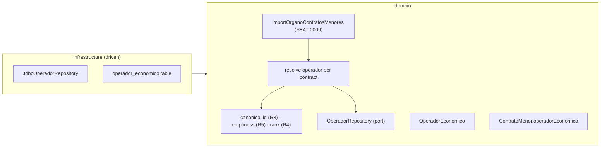
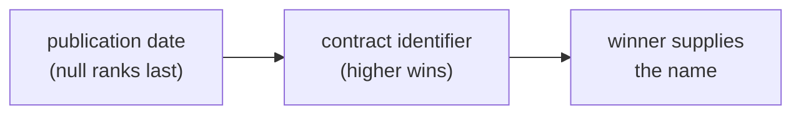
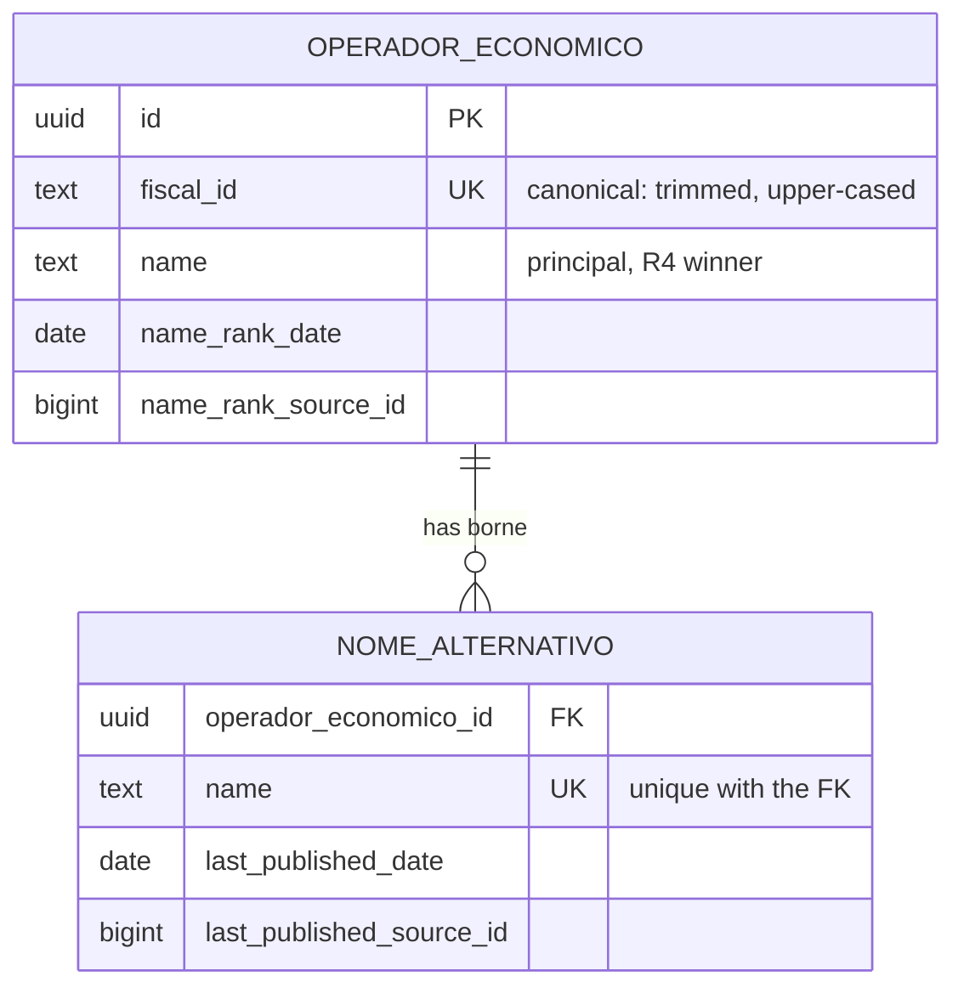

# FEAT-0010. Operadores económicos: the derived catalogue base

## Goal
Turn the awardee named on every contrato menor into a stored **operador económico**, so that the
contracts an import stores arrive already attached to the party they were awarded to. This is
the first slice of **[SPEC-0006](../../specs/SPEC-0006-operadores-economicos.md)** and it builds
the base the rest of that spec stands on: the catalogue itself (R2), the matching rule that
decides when two awards name the same operador (R3), the display rule that decides which
published name it is shown under (R4), the emptiness rule that decides when an award yields
no operador at all (R5), and the link from a contract to its operador.

It settles nothing about identity that
**[ADR-0023](../../architecture/0023-operadores-as-a-stored-projection.md)** has not settled:
the catalogue is **stored state maintained by the import**, keyed by the fiscal identifier in
R3's canonical form, with each contract carrying a foreign key to its operador.

> **The decision this feature builds onto is settled.**
> [ADR-0023](../../architecture/0023-operadores-as-a-stored-projection.md) is `accepted`, so the
> whole of tasks 2 to 4 — which rest on the catalogue being stored rather than computed — stand on
> a decision no longer up for debate. Nothing below hedges against it changing, and nothing needs
> to.

**No operador is readable yet.** R8's list and lookup, R9's cross-Órgano contract history, R10's
filters and sorts and R11's paging are all later features — this one stops at the stored,
correctly-matched catalogue those surfaces will read, exactly as FEAT-0006 stopped at the stored
Órgano catalogue before anything read it.

It sits in the hexagonal server of
**[ADR-0002](../../architecture/0002-hexagonal-architecture.md)** — the operador aggregate maps
1:1 to its table with its own persistence annotations
(**[ADR-0008](../../architecture/0008-domain-entities-carry-persistence-mapping-annotations.md)**),
the matching and display rules are pure domain functions, and the derivation runs inside the
import use case
[FEAT-0009](../FEAT-0009-contratos-menores-initial-import/README.md) builds.

> **Its base lands before the contratos menores store, not after it.** The link between the two
> tables is a foreign key on the **contract** side, so the ordering that avoids an `ALTER`
> entirely is: `operador_economico` exists first, and FEAT-0009 then **creates**
> `contrato_menor` with a nullable `operador_economico_id` already on it. Adding that column
> later to a table holding a million rows, and backfilling it from data that is only correct if
> re-derived, is a materially different operation — the same argument FEAT-0009 makes for
> creating its year index up front.
>
> So **tasks 2 and 3** — the aggregate and the `operador_economico` table — are the prerequisites
> of FEAT-0009's domain and store tasks: the first supplies the type its association points at, the
> second the table its foreign key points at. **Task 1 is not on that path.** Its three functions
> are needed only when an award is actually resolved, which is task 4, and task 4 is also the
> only one that waits on FEAT-0009's import. Nothing here references `contrato_menor`, so the two
> features interleave without a cycle.

## Scope
- **Domain (the operador):** an `OperadorEconomico` aggregate — a system-assigned `OperadorId`
  ([ADR-0019](../../architecture/0019-typed-aggregate-identifiers.md)), the **canonical fiscal
  identifier** it is both matched and displayed on (R3), and the **published name** with the rank
  it was taken from — plus an `OperadorRepository` port (find by fiscal identifier, insert, update
  the name, retain a published name).
- **Domain (the rules):** R3's canonicalisation, the R5 emptiness test, and the R4 ranking, as
  pure functions with no store and no framework, unit-tested against the over-merge and
  under-merge cases SPEC-0006 states as separate criteria.
- **Domain (the link):** `ContratoMenor.operadorEconomico`, a **foreign-key association** to this
  aggregate. The schema is normalised, so this row is where a contract's awardee name and fiscal
  identifier live — the contract keeps none of its own. The association is optional because R5
  requires an award with an unusable identifier to be stored with **no** operador rather than an
  invented one, which is also the case in which **no awardee is recorded anywhere**; see the
  design note below.
- **Domain (the name history):** every distinct name an operador's contracts have published,
  retained beside it with the most recent date each was published and the contract that did so
  (R15). The R4 winner is the operador's **principal name** and stays on the operador row; the
  rest are **alternative names** on a table of their own.
- **Domain (derivation):** resolving each stored contract to its operador as part of the import
  batch, creating the operador when no contract has named it before, advancing its name when the
  contract outranks the incumbent, and retaining the name it published.
- **Infrastructure:** a migration creating `operador_economico` with a **unique** fiscal
  identifier and `operador_economico_nome_alternativo` unique on (operador, `name`), and the
  Micronaut Data JDBC implementation of the ports. The nullable `operador_economico_id` foreign
  key is **created with `contrato_menor` by FEAT-0009**, not added here — see the ordering note
  above.

**Out of scope (owned by later features):**
- **Every read surface of SPEC-0006** — R8's operadores list, name and whole-identifier lookup
  and its fixed ordering; R9's contract history with its per-family sections, counts, totals and
  the two crossings; R10's year filter and sorts; R11's paging control; and R14's measurements
  over all of them. Nothing here is reachable over HTTP or on screen.
- **Driving R7's lifecycle when a change subtracts.** An operador is *reachable exactly as long
  as it has at least one visible contract, one visible participation or one visible UTE
  membership*, and withdrawal is [SPEC-0005](../../specs/SPEC-0005-import-browse-contratos-menores.md)
  R13, which no feature builds yet. Until it does, no contract is ever invisible, so there is
  nothing for the lifecycle to subtract. What this feature owes the feature that builds it is
  stated in the design below, so the rule is not discovered late.
- **Demoting a stale name.** Maintaining R4 forward — a newer contract wins — is a
  comparison this feature makes. Maintaining it *backward*, when the winning contract is
  withdrawn or corrected out of the operador, is the open half ADR-0023 names, and it belongs
  with the feature that makes a contract invisible in the first place.
- **Licitacións and any later family.** The catalogue is family-neutral by construction and this
  feature keeps it so, but contratos menores are the only family that exists to feed it.
- **Participation and UTE membership (R16), and the privacy analysis R17 attaches to them.** The
  two optional facts SPEC-0006 admits from a family able to supply them are held nowhere here: no
  participation relation, no membership relation, and no column on the operador recording either.
  Contratos menores can supply neither — the source publishes neither for that family — so the
  only family feeding this catalogue today could not exercise them, and the family that can is
  [SPEC-0008](../../specs/SPEC-0008-import-browse-licitacions.md)'s, which has no feature yet.

  **What their absence does not cost is the aggregate.** R16 makes a UTE **an operador in its own
  right**, identified by its own published fiscal identifier and matched under R3 exactly like any
  other, and a party that only ever bid and lost is an operador on the same rule. So the type this
  feature builds already models every party R16 catalogues; what is missing is the two **relations**
  between them, not a second kind of operador and not a flag distinguishing one. That is why R16
  costs this feature nothing to accommodate later, and it is the reason to state it rather than
  leave the silence to be read as an oversight.
- **Anything the contracts do not say** — SPEC-0006's Scope rules out enrichment, sector or size
  classification, entity linking, and any inference of whether an identifier belongs to a person
  or an entity. No column here records any of it (R6).

## Design

### Where the derivation sits ([ADR-0002](../../architecture/0002-hexagonal-architecture.md))

### Matching: exactly two things are ignored, and nothing else
- **The mapping is unambiguous.** Every published contract names its awardee with a **NIF/CIF**,
  and that identifier is what identifies the operador — never the name, never a similarity
  score. So an operador's identity is settled by its first contract and never revised as more
  arrive: no row written today is later discovered to be two operadores, or two rows one. That is
  what makes the stored catalogue of
  [ADR-0023](../../architecture/0023-operadores-as-a-stored-projection.md) safe to maintain
  incrementally, and it is why no task here has a merge, a split or a confidence threshold in it.
- Two awards name the same operador when their published fiscal identifiers are equal **once
  trimmed and upper-cased** (R3). That **canonical form is the identifier the row holds**, and it
  is what the `operador_economico` table is unique on — so "the same operador never splits in two"
  holds at the store level, not only in whichever use case remembered to normalise. The spec is
  blunt about why it matters: matched naively "the aggregation fails silently, and a quiet
  undercount is worse than an error".
- **Nothing else is normalised.** Internal spacing, punctuation and any differing character produce
  **two** operadores, and SPEC-0006 makes that its own criterion (#4) alongside the merge one,
  because over-merging two real suppliers into one is as wrong as splitting one into two. The
  canonicalising function is where that line is drawn, and it is unit-tested from both sides.
- **One column, matched on and displayed.** There is no separate match key beside a published
  spelling, so no reader can pick the wrong one — the con ADR-0023 carried in draft. The price is
  that the published **letter case is retained nowhere** and an operador published as `b12345678`
  shows as `B12345678`: a deliberate exception to R13, which states it, taken because case is the
  one difference R3 rules meaningless for identity.
- An identifier that is **absent, empty once trimmed, or a published placeholder** — a lone dash,
  a `TEMP-…` value — is *unusable* (R5): the contract is stored and gets **no operador** — never a
  placeholder, never a shared "unknown" row that would silently pool unrelated awards. Its
  `operador_economico_id` stays null, and because the schema is normalised that contract records
  **no awardee name either**, which the R5 branch did not cost when the contract carried its own.
  Nothing beyond emptiness **and the two published placeholder forms named above** is validated:
  the source publishes irregular but genuine identifiers, and rejecting those would discard real
  awards.

  The placeholder limb arrived after this feature shipped, with FEAT-0015's amendment 4, because
  the licitacións family is what meets those values. Under the emptiness-only test every
  dash-published contract would have pooled under one operador holding the fiscal identifier `-`
  — exactly the shared "unknown" row this bullet refuses. `FiscalIdentifier.of` is the factory
  both families call, so widening it covered this one too;
  [FEAT-0015](../FEAT-0015-licitacions-initial-import/README.md) task 19 carried the change.

  **This branch is expected never to be taken.** Every contract the source publishes names its
  awardee with a NIF/CIF, which is why the mapping is unambiguous in the first place; SPEC-0005
  lists the fiscal identifier among what the source *does* publish, and SPEC-0006 R5 guards
  against its absence anyway. The branch is kept rather than replaced by a `NOT NULL` constraint
  because the constraint would turn one malformed publication into a failed batch in a job
  measured in days, which SPEC-0005 R27 rules out on its own terms. It costs a nullable column
  and a test.

### Display: one published name, chosen deterministically
R4 shows an operador under the **name** taken from its **most recently published** contract, ties
broken by the **higher** contract identifier, with contracts whose publication date cannot be
interpreted **ranked last**. So the rank is a pair, compared in order, and what the winner
supplies is the consequence rather than a third component:

- **R4 ranks the name alone.** The fiscal identifier is canonical and reached from every contract
  identically, so there is no spelling to choose between and nothing about it to rank — which is
  why the winner supplies one value and not two.
- The operador row stores the winning **name** and the **rank** it came from. When the import
  stores a contract, it compares that contract's rank against the row's; if it wins, the name and
  the rank move to it together. That is one comparison per contract stored, rather than a
  top-1-per-operador computed on every read (ADR-0023).
- Storing the rank, not just the name, is what makes the choice **deterministic across runs**
  (#7): without it, "is this contract newer than whatever won last time?" has no answer, and two
  imports over the same data could disagree.
- Ranking undated contracts last keeps R4 **total**: an operador all of whose contracts are
  undated still has exactly one deterministic name, and one undated contract never displaces a
  dated one.

### Every name is kept, not only the winning one
R15 retains **every name an operador has been published under**. The R4 winner is its **principal
name** and stays on the operador row where the display already reads it; every other distinct name
its contracts have published is an **alternative name**, on a table of its own:

- **One row per distinct name, not per award.** The table is unique on (operador, `name`), so an
  operador with 10 000 contracts under one name holds **one** alternative-name row's worth of
  history, not 10 000. The retained fact is *this operador has been known by this name, most
  recently then* — which is why the write is an upsert that advances a date rather than an insert.
- **Each name carries the same rank pair the operador row does** — the publication date and the
  contract's source identifier. That is not symmetry for its own sake: R4 breaks date ties on the
  higher contract identifier and ranks undated contracts last, so a name holding only a date could
  not be ordered against a name sharing that date, and two names seen only on undated contracts
  could not be ordered at all. With both, **the principal name and the alternatives sort under one
  rule**, and the history cannot disagree with R4 about which name should be showing.
- **Distinctness is by the name exactly as published.** Two spellings that differ in case or
  internal spacing are two names. R13 forbids normalising a published name, and folding them here
  would invent a canonical form in the one place the system is meant to be remembering that
  several existed.
- **What this buys, stated plainly.** ADR-0023 names one thing as the projection's real price: a
  name is correct only while the contract that won R4 still wins it, and nothing can
  recompute it from stored data when a correction or withdrawal demotes that contract. With the
  names retained, that fallback becomes a choice among rows already held instead of a re-read of
  every contract. **This feature does not build the fallback** — R7's lifecycle is still out of
  scope below — it makes it buildable without a backfill that only a re-import could supply.
- **What it does not buy.** Knowing an operador has borne a name is not knowing *which contract*
  published it, so SPEC-0006 #25's per-row name spelling stays amended: a history row still shows
  the operador's one name. The **fiscal identifier needs no equivalent** — R3 holds one canonical
  form reached from every contract identically, so there is no spelling that could go stale and
  nothing to demote. **ADR-0023's open question is narrowed, not closed:** the data a backward fix
  needs now exists, but nothing performs the demotion, and R7's lifecycle still owns it.

### The link, and where it is written
- `contrato_menor.operador_economico_id` is a **nullable** foreign key — null exactly when R5 says
  the award yields no operador — and in the domain it is a `@Relation(MANY_TO_ONE)` association,
  not a loose id.
- **Because the schema is normalised, this row is the only record of an awardee.** A contract
  stores no published name or identifier of its own, so two things follow and neither is
  discovered late. An award whose identifier is unusable has a null key and therefore **no
  awardee recorded at all** — SPEC-0006 R5's branch, which SPEC-0005 lists as one the source
  never takes, now costs the published name rather than only the operador. An operador's **name**
  can no longer be re-derived from stored contracts, which is why R15 retains the names it has
  borne; its **identifier** never needed re-deriving, being canonical from every contract. Both
  specs carry this model: SPEC-0005 R7 and R27 hold the awardee here and name what it costs, and
  SPEC-0006 R13, #5 and #25 describe rows under one name.
- The import resolves it **inside the batch's transaction**: canonicalise the published
  identifier, find or create the operador, advance its name if this contract outranks the
  incumbent, and write the contract with the reference. Contract and link commit together,
  so a crash cannot leave a stored contract whose operador was never created — and re-running the
  batch is idempotent on both tables, because the contract upserts by source identifier and
  the operador by canonical fiscal identifier.
- **A correction that changes a contract's published identifier repoints its foreign key**, and
  creates the operador the corrected identifier names if no contract named it before. That falls
  out of resolving on every upsert rather than only on insert, and it is half of SPEC-0006 #14.
  The other half — the previous operador becoming unreachable if that was its last contract — is
  R7's lifecycle and waits for the feature that makes a contract invisible.
- **What this feature owes that feature:** reachability is *has at least one visible contract, one
  visible participation, or one visible UTE membership* (R7 under R16). With the foreign key in
  place, the **contract** third is answerable either as a query or as a maintained count on the
  row; ADR-0023 leaves that choice open deliberately, and what it fixes is that whatever answers
  it writes to **this** row, rather than introducing a second, computed notion of an operador
  alongside the stored one.

  **The other two thirds are not this feature's to owe, and are named anyway**, because the
  cheapest-looking answer to the first is wrong for all three: a `visible_contract_count`
  maintained on the row answers the whole predicate only while no family publishes participation
  or UTE membership, and it silently answers the wrong question the day one does. A firm that has
  only ever bid and lost, and one that has only ever been a **member** of an awarded UTE, both hold
  **no contract of their own** — they are exactly the case R7's three-part predicate exists for, and
  exactly the case a contract count would make unreachable. Whoever builds the lifecycle inherits
  the choice; what this note fixes is that it is a choice about three facts, not one.

### Natural persons are not modelled as such
Roughly one in seven awardees is a natural person, and the kind of identifier published does in
practice distinguish them — which is exactly why R6 forbids recording it. **No column classifies
an operador**, and the derivation never branches on the shape of an identifier beyond R5's
emptiness test. Deriving that classification would be new information about identifiable people,
and the system declines to produce it even though it could. Criterion #10's *no stored attribute
records which it is* is proved here; its *no view distinguishes the two* half belongs to the
features that build views.

## Sequencing (tasks, one small change each)
The numbering is the order the pieces make sense in, not a chain: **1 and 2 have no
dependencies**, and 2 and 3 are the ones FEAT-0009 waits on, so 2 can be taken first.

1. **Canonicalisation, emptiness and ranking rules** — the fiscal identifier's canonical form
   (R3) and R5's emptiness test, plus the R4 rank comparison, as pure domain functions with no
   store and no framework. Unit-tested from both sides: identifiers differing only in padding or
   case canonicalise to one value; identifiers differing in internal spacing, punctuation or any
   character do not.
   Needed by task 4, not by tasks 2 or 3. *(SPEC-0006 #3 matching half, #4, #7, #9 — the last
   only as R5 read before amendment 4 widened it; FEAT-0015 task 19 carried the widening, so #9
   holds as amended.)*
2. **`OperadorEconomico` domain model + repository port** — the aggregate (`OperadorId` identity,
   canonical fiscal identifier, published name, and the rank the name was taken from), the
   `NomeAlternativo` it holds many of (the published name plus the rank it was last seen at), and
   the `OperadorRepository` port: find by fiscal identifier, insert, update the name, retain a
   name. **The task that unblocks FEAT-0009**, whose contract aggregate declares
   an association to this type. *(SPEC-0006 #2, #3, #7, #10 stored-attribute half, #30, #33,
   #35, #36)*
3. **Operador store** — the migration creating `operador_economico` with a **unique** fiscal id
   and `operador_economico_nome_alternativo` **unique on (operador, `name`)**, and the Micronaut
   Data JDBC implementation of the port, including the name upsert that advances a date rather
   than inserting a duplicate. It touches `contrato_menor` **not at all**: the nullable
   `operador_economico_id` foreign key and its index are created by FEAT-0009's store task, which
   is why this one lands **before** it. *(SPEC-0006 #3 one-operador half, #4, #7, #30, #34,
   #35, #37)*
4. **Derivation during the contratos menores import** — resolve each stored contract to its
   operador inside the batch transaction: no operador for an unusable identifier, find-or-create
   otherwise, advance the name when the contract outranks the incumbent, **retain the
   name the contract published**, and repoint the reference when a re-import changes a contract's
   published identifier. *Depends on FEAT-0009's single-Órgano import task.* *(SPEC-0006 #2, #6
   storage half, #7, #8 no-operador half, #9, #14 moves-and-creates half, #33, #34, #37 — #8 and #9
   only as R5 read before amendment 4; FEAT-0015 task 19 carried the widening, so both hold as
   amended.)*

**Criteria this feature deliberately leaves incomplete**, so no task claims what it cannot prove:
every *displayed* and *reachable* half — criteria #1, #5, #6's display, #8's list appearance,
and #10's views, #11–#13, #15–#28, #31 and #32 — belongs to the read features, while #14's
*becomes unreachable* half and #29's erasure guarantee wait on R7's lifecycle and
SPEC-0005 R13's withdrawal.

**R16 and R17's criteria — #38 to #43 — are left whole**, and not only because the read surfaces
are elsewhere: they need a family that publishes participation or UTE membership, and no feature
builds one. #40 is the only one this feature contributes to, and it contributes a third of it: *a
party whose identifier is unusable produces no operador* is R5's emptiness rule, proved by tasks 1
and 4, while *no participation and no membership* names two relations that do not exist. The
criterion is therefore not claimed. Listing them here is what keeps them from looking covered by
the feature that owns the operador aggregate, which is the trap the paragraph above exists to
avoid.

## Edge cases
- **The same identifier under three spellings** — ` B12345678 `, `b12345678`, `B12345678` — is
  one operador holding `B12345678`, whichever of the three arrives first. No contract keeps the
  variant it published and the canonical form is reached from all three identically, so no
  arrival order changes it. *(SPEC-0006 #3, #7)*
- **Identifiers differing by one character, or by internal spacing or punctuation** — two
  operadores. Canonicalisation trims and upper-cases and does nothing else.
  *(SPEC-0006 #4)*
- **An absent or whitespace-only identifier** — the contract is stored with no operador and, in
  consequence, no awardee at all; no placeholder row is created, and unrelated awards are never
  pooled under one. *(SPEC-0006 #8)*
- **An irregular but non-empty identifier** — a foreign VAT number, a malformed NIF — is attached
  to an operador like any other. Emptiness disqualifies, and since R5's widening a **published
  placeholder** does too; nothing else does. **#8 and #9 are not fully met until
  [FEAT-0015](../FEAT-0015-licitacions-initial-import/README.md) task 19 lands**, which is recorded
  here rather than left for a reader to discover from a passing test suite. *(SPEC-0006 #9)*
- **An operador all of whose contracts are undated** — still displayed under exactly one
  name, chosen by the higher contract identifier among them. *(SPEC-0006 #7)*
- **An undated contract stored after a dated one** — never displaces it, because undated ranks
  last however late it arrives. *(SPEC-0006 #7)*
- **The same batch replayed after a crash** — the contract upserts by source identifier and
  the operador by canonical fiscal identifier, and the rank comparison is idempotent, so no
  duplicate operador and no name flapping. *(SPEC-0006 #2)*
- **A correction changing a contract's published identifier** — the reference moves to the
  operador the corrected identifier names, creating it if new. The previous operador is left
  behind with one fewer contract and, if it was the last one, in the state R7 will later make
  unreachable; today nothing is invisible, so nothing is stranded that the lifecycle feature will
  not find. *(SPEC-0006 #14 first half)*
- **A correction changing only the published name** — no new operador; the name moves
  only if the corrected contract still outranks the incumbent, and the displaced name is retained
  under R15. *(SPEC-0006 #6)*
- **Two contracts of the same batch naming a new operador** — the first creates it, the second
  finds it. There is one importer system-wide (SPEC-0005 R22), so the create-if-absent path rests
  on that guarantee rather than on the store; the unique fiscal identifier catches it being wrong.
  *(SPEC-0006 #3)*
- **A natural person's identifier** — catalogued exactly as an entity's, with nothing recording
  which it is, deliberately and despite the source making it inferable. *(SPEC-0006 #10)*
