# FEAT-0011. Finding and browsing contratos menores

## Goal
Make the contratos menores that [FEAT-0009](../FEAT-0009-contratos-menores-initial-import/README.md)
stores **readable**: an authenticated user reaches an Órgano de Contratación, opens its contracts,
and browses them one publication year at a time, sorted and paged. This is the *read* slice of
**[SPEC-0005](../../specs/SPEC-0005-import-browse-contratos-menores.md)** — its
**R14–R19** whole, R2's access rule, and the **display** halves of R7, R16, R26 and R27 that the
import feature deliberately left unproven.

It is the first surface in the system that reads a table measured in millions, and the first that
pages one. Two of its decisions therefore outlive it: **R17's paging control** is the one every
paginated list in the system takes — [SPEC-0006](../../specs/SPEC-0006-operadores-economicos.md)
R11 and [SPEC-0007](../../specs/SPEC-0007-monitor-import-runs.md) both cite it rather than
defining their own — and the **HTTP shape of a paged collection** is a contract those specs' features
will copy. The control is built once here, in `shared/ui`; the contract shape is **not this
feature's to decide alone** and is raised as an ADR below.

It also closes a hole SPEC-0004 left open. FEAT-0007 built the taxonomy and the two reads it is
assembled from but no `USER` surface at all, and recorded that **SPEC-0004 acceptance criterion #9
belongs to "the contract-querying feature"** — this one. R14 is where that lands: the read-only
taxonomy tree a `USER` browses to pick an Órgano is built here, against the contracts FEAT-0007
published and never rendered for a `USER`.

The design sits in the hexagonal server of
**[ADR-0002](../../architecture/0002-hexagonal-architecture.md)**: the read use cases are domain,
the paged queries are driven adapters behind the `ContratoMenorRepository` port, and the endpoints
are driving entry points under the reserved `/api/` prefix
(**[ADR-0006](../../architecture/0006-reserved-api-url-prefix.md)**), named per
**[ADR-0016](../../architecture/0016-rest-resource-naming.md)**, authored contract-first
(**[ADR-0010](../../architecture/0010-design-first-openapi-contract.md)**) and verified against the
running instance by Schemathesis
(**[ADR-0021](../../architecture/0021-openapi-contract-testing-with-schemathesis.md)**). Every read
is session-guarded (**[ADR-0005](../../architecture/0005-session-based-authentication.md)**) and
carries the rate-limit contract of
**[ADR-0012](../../architecture/0012-rate-limit-http-contract.md)**. The UI is the React Router SPA
(**[ADR-0003](../../architecture/0003-react-router-ui-served-by-backend.md)**) built with Vite +
Mantine (**[ADR-0004](../../architecture/0004-ui-stack-vite-mantine.md)**) in the feature-based
layout of
**[ADR-0015](../../architecture/0015-frontend-feature-based-shared-core-modularization.md)**, and
its journeys are proved against a stubbed API per
**[ADR-0018](../../architecture/0018-frontend-acceptance-tests-against-a-stubbed-api.md)**.

> **One prerequisite decision is missing, and this feature must not take it alone.**
> Nothing in the system is paged today — `docs/api/openapi.yaml` has no page parameter, no total and
> no envelope — and R17 is explicitly a rule **three specs share**. The query-parameter spelling, the
> response envelope, whether page numbers are 0- or 1-based, and the default and maximum page size
> are a **cross-cutting public-contract pattern**, which is the bar
> [ADR-0016](../../architecture/0016-rest-resource-naming.md) and
> [ADR-0012](../../architecture/0012-rate-limit-http-contract.md) both had to clear. An ADR — *the
> paged-collection HTTP contract* — should therefore be accepted **before task 4 publishes the first
> paged operation**; this feature proposes the shape under *API surface* below and does not
> consider itself the owner of it. Tasks 1–3 and 5–8 do not depend on it.
>
> **The shape proposed to that ADR is Micronaut Data's own**: `Pageable` bound from the request and
> `Page<T>` serialised as the response, rather than an envelope of our own design. The consequences
> are set out under *API surface*, and three of them are not free — the payload becomes 0-based,
> `totalPages` stops being on the wire, and an out-of-range `size` is silently clamped rather than
> refused.
>
> Note what is **not** open: SPEC-0005's *Decisions taken* settles that reads are **paged by
> position** and that the cost is **measured before it is optimised**. That mechanism needs no ADR,
> and no task here may quietly adopt a latency budget R24 declines to set.

## Scope
- **Domain (the selection):** the value types a read is asked for — a **year selection** (a
  four-digit year, or the *undated* selection R19 requires), a **sort key** (publication date or
  amount) and a **direction** — plus the page request and the paged result they produce. A
  selection with no year is unrepresentable, which is how R19's *there is no all-years list* is held
  as a type rather than as a validation everyone must remember.
- **Domain (the reads):** `ListContratosMenores`, which answers one Órgano's contracts of one year
  in one ordering, one page at a time, with the count of the whole selection (R16, R17, R19); and
  `DescribeContratosMenoresSection`, which answers whether the section exists at all, which years it
  offers, whether it offers the undated selection, and the two things R18 requires it to say about
  itself.
- **Domain (the section's state):** the two orthogonal facts R18 obliges the section to state —
  that what is shown is **partial** while the Órgano's initial import has not completed, and that
  the Órgano is **no longer being updated** when it is unmarked or inactive — derived from
  FEAT-0009's per-Órgano import state and the catalogue row, and exposed to a `USER` only in that
  narrow form (see *What a `USER` may learn about the import*).
- **Infrastructure:** the paged, ordered and counted reads on `ContratoMenorRepository`, and the
  year-facet aggregate the section read is built from — against the table and the
  `(organo_id, publication_date)` index FEAT-0009 already created, with **no new index added
  speculatively** (see *Indexes are the thing R24 measures, not the thing this feature guesses*).
- **Application (driving):** three `IS_AUTHENTICATED` reads — the section's shape, its paged
  contracts, and the ids of the Órganos that have contracts at all (SPEC-0004 R9) — authored in
  `openapi.yaml` first, and the configuration that composes each row's link to the publication at
  the source.
- **UI (`USER` and `ADMIN` alike):**
  - a **browse section** for Órganos: the read-only taxonomy tree of SPEC-0004 R9 — **scoped to
    the Órganos that have contracts**, holding unclassified ones at its root and pruning branches
    left empty — with the **name search** of SPEC-0004 R19 over the same set, offering no control
    to create, rename, move, delete or reassign anything, each Órgano opening its contracts (R14).
    **No `USER`-facing catalogue list**, which SPEC-0004 R2 removes;
  - an **Órgano contracts page** presenting its contracts **split by family**, omitting any family
    the system holds no data for (R15, R18);
  - the **contratos menores section**: the year chooser, the two sorts, the row carrying every
    attribute the system holds, its link to the official source, and R27's unreliability and
    VAT labels (R16, R19);
  - the **paging control** of R17, in `shared/ui` because two other specs take it.
- **Measurement:** R24's read-latency measurement over exactly the reads this feature builds, and
  the place its numbers are recorded.

**Out of scope (owned elsewhere):**
- **Everything that writes.** Marking, triggering, resuming, the scheduler and the incremental mode
  are [FEAT-0009](../FEAT-0009-contratos-menores-initial-import/README.md)'s and the incremental
  feature's; the **historical re-read (R10)** and **contract removal and restore (R13)** are the
  later curation feature's. This feature adds no `ADMIN` operation and no mutation of any kind. R13
  in particular changes what these lists may show — a removed contract disappears from every list —
  and the queries here are written so that adding its predicate later is a `WHERE` clause, not a
  redesign; nothing more is built for it.
- **The operador surface.** [SPEC-0006](../../specs/SPEC-0006-operadores-economicos.md) R8's list
  and lookup and R9's cross-Órgano contract history are its own read feature's.
  [FEAT-0010](../FEAT-0010-operadores-economicos-base/README.md) stores the operador every awardee
  resolves to and this feature **displays** it — the name SPEC-0006 R4 selects and the canonical
  identifier R3 holds — but the **crossing** R16 renders on the row has no target until that
  feature builds the operador route, so it lands there. See *Two crossings, one of which has
  nowhere to go yet*.
- **Licitacións.** R15's split is built with the second family in mind and the second family is a
  future spec's. Today the page renders one section, from a list that takes another by appending
  an entry.
- **Free-text search over contract objects, exporting, and any CPV filter.** SPEC-0005's Scope
  rules all three out — the first two as gaps it records rather than closes, the third because the
  source publishes no CPV for this family. **No control for any of them appears** (#27).
- **The import-run monitoring surface** — [SPEC-0007](../../specs/SPEC-0007-monitor-import-runs.md)'s
  run list, progress and diagnostics. R18's *partial* marker is not a progress indicator and does
  not become one here: it is one boolean about the data, not a fraction about a run.

## Design

### Hexagonal placement ([ADR-0002](../../architecture/0002-hexagonal-architecture.md))

```mermaid
flowchart LR
    subgraph application["application (driving)"]
        resumoApi["GET /api/organo/&#123;id&#125;/contratos-menores/resumo"]
        listApi["GET /api/organo/&#123;id&#125;/contratos-menores"]
        browseUi["Órganos browse: tree (unclassified at root) + name search"]
        pageUi["Órgano page: family split + contratos menores section"]
    end
    subgraph domain["domain"]
        listUc["ListContratosMenores"]
        resumoUc["DescribeContratosMenoresSection"]
        selection["YearSelection · SortKey · Direction"]
        contratoRepo["ContratoMenorRepository (port)"]
        stateRepo["ContratoMenorImportStateRepository (port)"]
        organoRepo["OrganoRepository (port)"]
    end
    subgraph infrastructure["infrastructure (driven)"]
        jdbcReads["paged + counted reads · year facets"]
    end
    application --> domain
    infrastructure --> domain
```


### Reaching an Órgano: the tree, and a name search beside it
A `USER` has **no catalogue list** — SPEC-0004 R2 removes it, leaving the tree as the only surface
that presents the catalogue. This feature builds that tree, and the search that spares a user from
walking it.

- **The read-only taxonomy tree** (SPEC-0004 R9), assembled in the browser from FEAT-0007's
  `GET /api/organos` and `GET /api/organos/taxonomia` by the **same pure builder the admin section
  already uses**. It offers a `USER` no control at all — no create, rename, move, delete or
  reassign — which is #19's second clause and the reason the tree is a *view* here rather than the
  admin tree with its buttons hidden.

  **Unclassified Órganos render at the root, beside the root terms**, which is what makes one route
  sufficient. SPEC-0004 R18 leaves every newly imported Órgano unclassified, so a tree of classified
  Órganos only would leave a marked, imported Órgano holding a million contracts reachable from
  nowhere — exactly what R14 forbids (#20). The builder already computes that bucket; what changes
  is that it is **rendered at the root** rather than as the admin section's separate worklist.
- **A name search** (SPEC-0004 R19): the user types, matching Órganos appear as they type, and
  choosing one opens the same Órgano the tree would. It is a way to *reach* an Órgano whose name is
  known, not a second place to discover one — so reachability rests on the tree, and the search
  rests on nothing.

The **third route** — following a contract row's awarding Órgano — has no surface here to build it
on: every list this feature renders is already scoped to one Órgano, so no row of it names an
awarding Órgano and **no row states one** (#21). It is proved by SPEC-0006's operador history,
which is the surface that has such rows.

**Both reuse FEAT-0007's endpoints unchanged, and the search needs no endpoint of its own.** The
catalogue is a few hundred rows and the taxonomy fewer, so the browse section holds both and
re-slices them client-side — the decision FEAT-0007 took for these two reads and explicitly declined
to bind this feature to. **The search is therefore a filter over data already in memory**: no
request per keystroke, no debounce against the server, no query endpoint, and no second definition
of what matches. That is the whole benefit of the whole-table read at this size, and it is why R19
costs a component rather than a contract. Were the catalogue ever to outgrow being held client-side,
the search would need a server-side read and that is a decision for the feature that hits the
limit — not one to pre-empt at a few hundred rows.

This feature takes the opposite decision for contracts below, where the volumes are five orders of
magnitude apart. **No new Órgano read is added**: the contracts page finds its Órgano's name in the
catalogue read it already holds, rather than paying for a member endpoint that would serve one
field.

**Matching is case- and accent-insensitive** (SPEC-0004 R19), which is not free in a browser: a
naïve `toLowerCase().includes()` fails `avila` → `Ávila`, and this catalogue is full of accents.
The comparison normalises both sides — decomposing and stripping diacritics — in a pure function
that is unit-tested from both sides, beside the tree builder. A **blank input offers nothing**,
which is the rule that keeps the search from becoming the list SPEC-0004 R2 just removed.

### The `USER` sees only Órganos that have contracts, and that needs one more read
SPEC-0004 R9 hides from a `USER` every Órgano the system holds no contract data for — most of the
catalogue. FEAT-0007's `GET /api/organos` returns the whole of it and knows nothing about
contracts, so **the browse section cannot apply this filter with the reads it has**.

The smallest thing that answers it is **one authenticated read returning the ids of the Órganos
that have contracts**, which the section intersects with the catalogue before building the tree:

| Method & path | Role | Purpose |
| --- | --- | --- |
| `GET /api/organos/con-contratos` | authenticated | the ids of the Órganos the system holds contracts for |

- **Ids only, not a second catalogue.** Names, states and placements already arrive from
  `GET /api/organos`; repeating them here would create a second serialisation of an Órgano that
  could disagree with the first, which is the rule FEAT-0007 set and FEAT-0009 broke only under
  protest.
- **It is family-neutral by construction**, which is what keeps R15's *additive* promise honest on
  this surface too: a licitación-only Órgano must become visible the day that family lands, and it
  will, because the read answers *has contracts* rather than *has contratos menores*. Today it is
  backed by `contrato_menor` alone; a later family adds a term to the same query rather than a
  second endpoint the client must union.
- **A few hundred ids is a small response**, and it is the same whole-table-read trade FEAT-0007
  took for the catalogue: cheap at this size, re-decided by whoever finds it is not.
- **It is not an access control.** It scopes what is *listed*; a typed URL still opens the Órgano
  and renders its no-contracts state (SPEC-0005 R14). Making it a refusal would mean a `403` on
  data the system is happy to show is empty.

**Two rules the builder gains**, both of them pure and both unit-tested with the builder rather
than in a component:

1. **Filter, then place.** An Órgano absent from the id set is dropped before the tree is built,
   so the unclassified-at-root bucket holds only visible ones and cannot render a root entry that
   leads nowhere.
2. **Prune empty branches.** A term whose whole subtree holds no visible Órgano is omitted
   (SPEC-0004 #21) — which is a *recursive* condition, not a per-term one: a parent whose own
   Órganos are all hidden still shows when a descendant has one. A single-level check would prune
   exactly the intermediate terms a deep taxonomy is made of.

**The admin section keeps the unfiltered tree it already renders**, and this is the one place the
two surfaces genuinely differ rather than differing by which buttons are on. It is also why the
filter lives in the browse section's builder call and not inside the shared builder itself: the
admin section files Órganos that have nothing yet, and a builder that dropped them would break the
worklist FEAT-0007 built.

### The family split, and how the second family joins it
R15 presents an Órgano's contracts as **one section per family**, each independently reachable, and
**omits** a family the system holds no data for rather than showing it empty.

The mechanism is deliberately the smallest thing that is genuinely additive: the page renders a
**list of families**, each entry owning its own presence read and its own section component, and
today that list has **one entry**. A family joins by appending one — it does not join by editing a
conditional. What is *not* built is a server-side "which families does this Órgano have" endpoint:
that would make every new family a change to a shared contract, which is the coupling R15's
*additive* wording is warning against, and it would answer a question each family already answers
for itself in the read it must make anyway.

**A page with no families at all is the page's own empty state, not an empty section.** An Órgano
the system holds no contracts for renders its identity and a plain statement that the system holds
none — R18 forbids an empty *section*, and says nothing about a page needing to be blank.

### The section exists, or it does not: `resumo`
Everything R18 and R19 decide about a section is answered by **one read**, before any contract is
fetched:

| Answer | Decides |
| --- | --- |
| the years the Órgano has contracts in, each with its count | which years the chooser offers (R19), **and whether the section exists at all** (R18) |
| whether any contract has no interpretable publication date | whether the *undated* selection is offered — **absent, not empty, when none exists** (#43) |
| `partial` | the initial import has not completed, so what is shown is incomplete (R18, #26) |
| `updating` | the Órgano is still being refreshed — it is active and marked |

- **Presence is derived, not asserted.** The section exists when the read returns at least one year
  **or** the undated selection; it does not exist otherwise, and there is no separate "has
  contracts" flag that could disagree with the years beside it. That is what makes *once the section
  is present it is never empty* true by construction: the chooser offers only selections that have
  contracts, so no choice a user can make produces an empty list.
- **`partial` and `updating` are two booleans, not one status.** They are orthogonal — an Órgano
  unmarked halfway through its initial import is both partial and no longer updated — and collapsing
  them into one enum would force a lie in exactly that case. R18 requires both statements and does
  not require them to be mutually exclusive.
- The years are returned **newest first**, which is the order the chooser shows and the order R19's
  default reads from: the **first** entry is the year the section opens on. Where an Órgano holds
  only undated contracts, the undated selection is the default, because it is the only selection
  there is.

### What a `USER` may learn about the import, and what they may not
This is the one place where SPEC-0005's access split has to be read carefully rather than applied by
reflex. FEAT-0009 put the **mark** behind `ADMIN` — R1 makes *seeing which Órganos are marked* an
administrator's, and SPEC-0007 R15 keeps Órgano-side import facts out of shared views — while R18
obliges **this** section to tell any reader that what it shows is partial, and that the Órgano is no
longer being updated.

The two are reconciled by what is disclosed and where:

- `partial` and `updating` are returned **only for an Órgano that already has a section**, which
  means only for an Órgano that already holds contracts. R18's protected question — *is this Órgano
  imported at all?* — is about Órganos with **no** section, and those return no flags because they
  return no section. A `USER` still cannot tell an unimported Órgano from one that awarded nothing:
  both simply have no section, which is R18's stated trade-off, intact.
- Neither flag is added to `GET /api/organos`. The catalogue read a `USER` browses stays exactly as
  FEAT-0007 shipped it, so nothing about the import leaks onto the list of every Órgano.
- `updating` says *this data is still being refreshed*; it does not say *an administrator marked
  this*. That the two coincide today is an implementation fact, not a contract, and the field is
  named for what a reader needs to know.

This is a **deliberate, spec-required narrowing** of FEAT-0009's ADMIN-only mark, recorded here so
that a reviewer meets it as a decision rather than as a leak.

### One year, one ordering, one page — and why the type says so
R19 makes the year **mandatory**, and the reason is load-bearing rather than editorial: it is what
bounds the size of every paged read, which is the bound R24 relies on when it declines to set a
latency budget. So the year is not a nullable filter with a default applied somewhere:

- the selection type is a **year or the undated selection**, with no third case and no absence;
- the endpoint's `year` parameter is **required**, and a request without it is a `400` rather than
  an all-years list — so no client, hand-written URL or generated caller can produce the read R19
  forbids (#27);
- the undated selection is the same parameter carrying the literal `undated`, not a second
  parameter that could be combined with a year into a selection R19 does not define.

**Filtering is a date range, not a function of the date.** A year selects
`publication_date >= 'YYYY-01-01' AND publication_date < 'YYYY+1-01-01'`, which the existing
`(organo_id, publication_date)` index answers by range scan; `EXTRACT(YEAR FROM publication_date)`
would answer the same question and use no index at all. The undated selection is
`publication_date IS NULL`, which that index also covers.

### Ordering has to be total, or paging does not denote
R17 is blunt about it: without a deterministic total order, *the next page* and *the last page* do
not mean anything, and exhaustive paging cannot be demonstrated. R19 offers two sort keys and two
directions; neither key is unique — a busy Órgano publishes hundreds of contracts on one date, and
round amounts repeat endlessly — so **every ordering appends the contract's `source_id` as its
final key**. It is unique at the store level, so the order is total, and #23's *none repeated, none
skipped* becomes a property of the query rather than a hope about the data.

**A contract missing the value it is sorted by is ordered last, in both directions.** R27 requires
it, and it is the one place PostgreSQL's default will silently do the wrong thing: `ORDER BY amount
DESC` puts nulls **first** unless `NULLS LAST` is written out. Both directions say it explicitly.

That gives a **closed set of four orderings** — date ascending, date descending, amount ascending,
amount descending — each with its tiebreaker and its null rule. They are written as four explicit
queries rather than assembled from a dynamic sort: the set cannot grow without R19 changing, a
built sort clause is where an unindexed or non-total ordering slips in unreviewed, and four
statements are each directly testable. Inside the **undated** selection a date sort is entirely
null, so the tiebreaker alone orders it — still total, still exhaustive.

**`Sort` is input vocabulary, not something the query is handed.** Adopting Micronaut Data's
pagination model means the request binder produces a `Pageable` that may carry a `Sort`, and
Micronaut appends `ORDER BY` from it to a `@Query` — which, on a statement that already carries its
own ordering and tiebreaker, would emit a second `ORDER BY` and fail. So the use case **maps** the
bound `Sort` onto one of the four queries and passes the repository a `Pageable` with the sort
removed (`withoutSort()`). The framework supplies the vocabulary and the offset/limit; the ordering
stays in the four statements that were written to be total.

That mapping has to **refuse**, not degrade, and this is the one place the framework's defaults
work against the requirement. The binder accepts **any** property name, and an unrecognised
direction **silently falls back to ascending** — so `?sort=obxecto` and `?sort=amount,descending`
both bind happily and would otherwise produce an ordering R19 does not offer, or the default one
under a label claiming otherwise. A `sort` naming anything but `publicationDate` or `amount`, or a
direction that is not `asc` or `desc`, is a **400** (see *API surface*). Refusing is what keeps R19's
two sorts a closed set on the wire rather than only in the domain.

### Paging is by position, and the count is honest
- A page is `LIMIT`/`OFFSET` over the ordered selection, with the selection's **total** from a
  matching `COUNT(*)` — which is exactly what a repository method returning `Page<T>` does, so the
  count query is the framework's rather than one this feature writes. R17 needs the total for the
  count it states and for the page total it derives, and SPEC-0005 settles that this straightforward
  positional read is the thing to build first — the bound is one Órgano's one family in one year,
  not the table.
- **The count is of the selection, not of the page** (#28): sorting by amount descending puts the
  largest contract of the **whole year** on the first page, because the ordering and the count are
  both applied to the year, and the page is a window onto the result.
- **Paging never changes the selection** (#24). The count, the page total and the ordering are
  functions of the selection alone, so moving between pages recomputes nothing about them. Changing
  the selection — the year, the sort key, the direction — **returns the reader to page 1**, which is
  a rule the UI holds in one place (see below).
- A page number beyond the last returns an **empty page carrying the true total** rather than an
  error or a silently clamped page: the response then says plainly that the request was out of
  range, and the UI clamps to the last page. Clamping server-side would make the response disagree
  with the request that produced it.

### Indexes are the thing R24 measures, not the thing this feature guesses
FEAT-0009 created `(organo_id, publication_date)` empty, on the sound argument that adding an index
to a table of millions is a different operation from creating one. It serves the year range scan,
the undated selection and both date orderings. It does **not** serve an amount ordering: sorting a
busy year by amount is a sort of that year's rows.

**No index is added for it here, deliberately.** R24 fixes the conditions under which that read is
measured and *deliberately fixes no budget*; CLAUDE.md forbids optimising before measurement shows
a straightforward implementation falls short; and the amount-sorted read over the largest Órgano's
busiest year is precisely the read R24 names as the one that actually breaks. Adding an index in
advance would settle by guess the question this feature exists to answer, and would do it on the
largest table in the system. The measurement task below is what produces the evidence, and the
index — if it is needed — is a small task raised against that evidence, in this feature or a
follow-up, exactly as SPEC-0005 R24 requires a budget to be set by revising the requirement rather
than by a task quietly adopting a number.

The same restraint applies to the year-facet aggregate: it groups an Órgano's rows by year, which
for the largest Órgano is a scan of its whole partition once per section open. It is measured
alongside the three reads R24 names, and nothing is cached or materialised until a number says it
must be.

### API surface

Named per [ADR-0016](../../architecture/0016-rest-resource-naming.md) — members at the singular
`/api/organo/{id}`, so nothing collides with a sub-resource of the plural set — authored
contract-first per [ADR-0010](../../architecture/0010-design-first-openapi-contract.md), carrying
[ADR-0012](../../architecture/0012-rate-limit-http-contract.md)'s three `RateLimit-*` headers and
its shared 429, and generated against by
[ADR-0021](../../architecture/0021-openapi-contract-testing-with-schemathesis.md)'s Schemathesis run.

| Method & path | Role | Purpose |
| --- | --- | --- |
| `GET /api/organos/con-contratos` | authenticated | The ids of the Órganos the system holds contracts for — the set a `USER`'s tree and search are scoped to (SPEC-0004 R9) |
| `GET /api/organo/{id}/contratos-menores/resumo` | authenticated | Does the section exist, which years does it offer, is there an undated selection, and R18's two statements |
| `GET /api/organo/{id}/contratos-menores` | authenticated | One page of one year's contracts in one ordering, with the selection's total |

Both are `@Secured(IS_AUTHENTICATED)`: R2 grants the read to `USER` and `ADMIN` alike and denies an
unauthenticated visitor, which is also the mitigation R26 rests on (#39). Neither grants any
ability to modify anything.

**Paging is Micronaut Data's model, not one of our own.** The controller takes a `Pageable`
argument and returns a `Page<T>`, so the parameter names, the binding rules and the response shape
are the framework's — `page`, `size` and `sort` bound by `PageableRequestArgumentBinder`, and
`content` / `pageable` / `totalSize` emitted by `Page`'s serialiser. The reasons are worth stating,
because three specs inherit them:

- **The domain module already depends on it.** `server/domain/build.gradle.kts` declares
  `api(libs.micronaut.data.model)`, and
  [ADR-0008](../../architecture/0008-domain-entities-carry-persistence-mapping-annotations.md)
  already accepted Micronaut Data inside the domain. `Pageable` and `Page` on a port are the same
  leak that ADR has, not a new one.
- **The repository derives its paging for free.** A method returning `Page<T>` gets its `LIMIT`,
  `OFFSET` and count query generated; a hand-rolled envelope means writing and testing that count
  ourselves on every paged read in three specs.
- **One less thing to invent.** SPEC-0006 and SPEC-0007 take the same control, and an in-house
  envelope is a shape each feature could drift from. A framework type cannot drift.

**Query parameters** on the list read:

| Parameter | Bound by | Required | Values |
| --- | --- | --- | --- |
| `year` | this feature | **yes** | `YYYY`, or `undated` — no absence, no third form (R19) |
| `sort` | `Pageable` | no | `publicationDate,desc` (default) — `property,direction`, comma-delimited |
| `page` | `Pageable` | no | **0-based**; default 0 |
| `size` | `Pageable` | no | default 50, maximum 100 |

`size` and its ceiling are `micronaut.data.pageable.default-page-size` and `max-page-size`;
**100 is the framework's own default** and is kept rather than raised, since nothing has asked for a
larger page and a bigger one only makes R24's deep read worse.

**Path segments are the domain's Galician nouns; fields and parameters are English.** That is the
convention already shipped — `/api/organos` beside `/api/admin/users`, `termoId` and `parentId`
beside `contratos-menores` — and this feature keeps it, with `obxecto` the single field name that
stays Galician because it already is one in the domain and the store.

**The response is `Page<T>` as Micronaut serialises it** — exactly three keys, verified against
`PageSerializer` in `micronaut-data-model` rather than assumed:

```
{ "content": [ … ], "pageable": { "number": 2, "size": 50, … }, "totalSize": 1832 }
```

**Three consequences, none of them free, all of them accepted here and offered to the ADR:**

1. **Page numbers are 0-based on the wire.** The reader is shown 1-based numbers and the URL carries
   what the API takes, so the conversion happens once, in the paging control's adapter, rather than
   in every client. This reverses the 1-based shape an earlier draft of this feature proposed:
   consistency with the framework that binds the parameter is worth more than a payload that reads
   the way the control looks.
2. **`totalPages` is not on the wire.** `Page.getTotalPages()` exists on the interface but the
   custom serialiser emits only `content`, `pageable` and `totalSize`, so R17's *how many pages it
   spans* is **derived by the client** as `ceil(totalSize / size)` — in the one shared reader named
   under *UI*, not in each list. R17 requires the reader be told; it does not require the server to
   be the one that counts.
3. **An oversized `size` is clamped, not refused.** The binder caps it at `max-page-size` and floors
   `page` at 0, so `?size=5000` silently yields 100. This is the framework's behaviour and it is
   **documented in the contract rather than fought**: a validation layer that refused what the
   binder has already corrected would be dead code, and clamping protects the read that R24 warns
   about. It is the one place the API answers a question slightly different from the one asked, and
   the response says so — `pageable.size` states the size actually applied.

The nested `pageable` object also carries fields this feature has no use for. They are **described
in `openapi.yaml` as the serialiser actually emits them**, verified against a running instance
rather than transcribed from the type, because
[ADR-0021](../../architecture/0021-openapi-contract-testing-with-schemathesis.md)'s Schemathesis run
validates live responses against the document and a hand-guessed schema fails the build.

**A row carries everything the system holds** (R16), because a contrato menor has no detail view:

| Field | Notes |
| --- | --- |
| `sourceId` | the source's own identifier — the contract's identifier, as published |
| `publicationDate` | the interpreted date, or **absent**; the published text was never retained (R27) |
| `obxecto` | as published |
| `amount` | as published, VAT-inclusive, or absent |
| `duration` | as published, capped at 64 characters at import |
| `awardee` | the operador's `id`, its R4-selected `name` and its canonical `fiscalId` — or **absent** |
| `sourceUrl` | absolute link to the publication at the official source |

- **`sourceUrl` is composed on the server, not in the browser.** FEAT-0009 established that the
  address is derivable from the `sourceId` the row already carries, so it costs no column; composing
  it server-side keeps the source's URL shape and host in configuration, in one place, where the
  contract test and the acceptance stubs can assert it — rather than hard-coding an external host in
  the SPA.
- **`awardee` absent is a valid row** (#11): R5 yields no operador for an unusable identifier, and
  because the schema is normalised such a contract records no awardee at all. It is shown like any
  other row, without an awardee and without a crossing that leads nowhere.
- **No field states the awarding Órgano** (#21). Every row of this list belongs to the Órgano
  already open.

**Failures** are RFC 9457 `application/problem+json`, following the precedent already in the
contract:

| Problem type | Status | Raised by |
| --- | --- | --- |
| `urn:conxugal:problem-type:organo-not-found` | 404 | either read naming an unknown Órgano — **reused**, not redeclared; FEAT-0007 owns it |
| *(validation)* | 400 | an absent or malformed `year`; a `sort` naming a property other than `publicationDate` or `amount`, or a direction other than `asc`/`desc` |

Note what is **not** in that table: a bad `page` or `size` never reaches a refusal, because the
binder has already floored and clamped them. Only `year` and `sort` are this feature's to validate.

An Órgano that exists but holds no contracts is **not** an error: `resumo` answers 200 with no
years and no undated selection, and that is how the client knows to render no section.

### UI ([ADR-0003](../../architecture/0003-react-router-ui-served-by-backend.md), [ADR-0004](../../architecture/0004-ui-stack-vite-mantine.md), [ADR-0015](../../architecture/0015-frontend-feature-based-shared-core-modularization.md))

Three routes, all authenticated, all in Galician (SPEC-0001 AC7) with copy in the slice's own
strings module rather than inline:

| Route | Slice | What it is |
| --- | --- | --- |
| `/organos` | `features/organos` | the browse section: read-only tree, unclassified at its root, plus the name search (R14) |
| `/organos/:id` | `features/contratos` | one Órgano's contracts, split by family (R15) |

**Where the code lands, and why the browse route joins the existing slice.** `eslint-plugin-boundaries`
forbids one feature slice importing another, so the question is not stylistic. The browse section
reads the *same two endpoints* the admin section reads and needs the *same pure tree builder*
(`taxonomiaTree.ts`) — so it belongs in `features/organos`, beside the admin surface, as a
read-only view over machinery that is already there. Promoting the builder to `shared/` to justify
a second Órgano slice would move code with no second owner. The **contracts** page is genuinely new
ground — a different read, a different volume, a different set of controls — and takes its own
slice, `features/contratos`, which reads `GET /api/organos` through its own thin API module. That is
endpoint reuse, which is free, rather than code reuse across a boundary, which is forbidden.

**A `USER`-visible nav entry** joins the ungrouped primary section of `ui/src/app/nav.ts` — the
first one that is not Home or About — with its label in the shared strings module the nav already
reads. The admin `/administracion/organos` entry stays exactly where it is: they are two surfaces
over one catalogue, and merging them would put management controls in front of a `USER` (#19).

**The selection lives in the URL query string** — `?year=2025&sort=amount&direction=desc&page=3`.
That is one decision doing four jobs: a contract list is shareable and deep-linkable; the browser's
back button walks paging history for free; the year, sort and page have exactly one home rather
than a component state that could disagree with a rendered control; and **R17's re-page rule becomes
a single rule about one transition** — any write to `year`, `sort` or `direction` drops `page`, so a
reader can never be left on a page number that no longer means what it did (#24). Held as component
state instead, that rule would have to be remembered at every control.

**The paging control is `shared/ui`, and it is the whole of R17.** First, previous, next, last and a
jump to a chosen page; the entry count and the page total stated; no *next* on the last page and no
*previous* on the first (#23). It takes a total, a page and a size and emits a page — it knows
nothing about contracts — because
[SPEC-0006](../../specs/SPEC-0006-operadores-economicos.md) R11 and
[SPEC-0007](../../specs/SPEC-0007-monitor-import-runs.md) take the same control and R17 says
plainly why: *a reader meets several of these lists in one session, and one of them paging
differently from the rest is a defect they would experience as inconsistency rather than as a
design.* The two ends are offered as controls of their own, not reached by counting, because they
are the two a user asks for by name — the newest and the oldest.

**A `shared/lib` reader stands between it and the wire**, and it exists because of the two
consequences the response shape carries: it maps `{content, pageable: {number, size}, totalSize}`
onto the control's props, **derives `pages`** as `ceil(totalSize / size)`, and converts the 0-based
`number` to the 1-based page the control shows and the URL carries. Both conversions live there and
nowhere else — SPEC-0006's and SPEC-0007's lists read the same envelope, and a page number that is
0-based in one list and 1-based in another is exactly the inconsistency R17 exists to prevent.

**What the row has to say about the values it shows**, all of it R27's and none of it optional:

- the amount column is labelled **including VAT** — `IVE incluído` — and so is any total derived
  from one, wherever one appears (#10). The legal thresholds that define a contrato menor are
  VAT-exclusive, so an unlabelled figure invites exactly the wrong comparison;
- the duration carries an indication that **the source frequently publishes a per-Órgano default
  rather than a per-contract value** (#41), so it is not read as a real contract term;
- an absent amount or date is shown as **absent** — never as `0`, never as a placeholder date, and
  for the date never as the text it arrived as, which was not retained;
- everything else is shown **exactly as stored**, with no truncation, case folding or reformatting
  the row invents (#40). A long `obxecto` wraps.

**Two absences a reader will notice, both deliberate**: there is no CPV filter and no free-text
search over contract objects (#27, and SPEC-0005's Scope). Neither is hidden, disabled or coming
soon; there is simply no control.

**Journeys are proved against a stubbed API**
([ADR-0018](../../architecture/0018-frontend-acceptance-tests-against-a-stubbed-api.md)), which is
what makes the hard cases cheap to hold: a year whose count is not a multiple of the page size, an
Órgano with only undated contracts, a partial section, a row with no awardee. None of them needs a
million rows to demonstrate.

### Two crossings, one of which has nowhere to go yet
R16 makes the row the place both of SPEC-0005's crossings are rendered: **out to the official
source**, and **in to the awardee's operador**.

The first is built here, whole. The second cannot be: the operador route belongs to
[SPEC-0006](../../specs/SPEC-0006-operadores-economicos.md) R8's read feature, which does not exist,
and a link to a route that 404s is worse than no link. So the row **states its awardee** — the name
SPEC-0006 R4 selects and the canonical identifier R3 holds, which is #21's second clause and #39 —
and the crossing is made a link by that feature, on the row this one already renders. #25's awardee
half is listed below as deliberately incomplete rather than claimed.

There is a second dependency worth naming plainly: **until
[FEAT-0010](../FEAT-0010-operadores-economicos-base/README.md)'s derivation task has run over the
stored contracts, every `operador_economico_id` is null**, so every row shows no awardee — which is
the R5 rendering, applied to every row rather than to the rare one. That is a data state, not a
defect in this feature, and the acceptance coverage for the awardee-present case depends on it.

## Sequencing (tasks, one small change each)
Backend first, then the shared control, then the surfaces — the order FEAT-0006/FEAT-0007 and
FEAT-0009 took. Tasks 1–3 and 5 have no dependency on the ADR raised above; **task 4 does**.

1. **Selection value types + read ports** *(backend)*: `YearSelection` (a year, or undated — with no
   representable absence) and `SortKey`/`Direction`, plus the mapping from a bound `Sort` onto one
   of the four orderings that **refuses** anything outside it; the `ContratoMenorRepository` port
   methods, taking a `Pageable` and returning a `Page`, for the four orderings and the year-facet
   read. Pure domain, unit-tested — including that a selection cannot be built without a year, and
   that an unknown sort property or direction is rejected rather than defaulted.
   *(SPEC-0005 #27 no-all-years half)*
2. **Paged, ordered and counted reads** *(backend)*: the JDBC implementation — the four orderings
   with the `source_id` tiebreaker and `NULLS LAST` in **both** directions, each taking its
   `Pageable` **sort-stripped** so the framework appends offset and limit but no second `ORDER BY`;
   the range predicate that uses the existing index, the undated predicate, and the year-facet
   aggregate. Integration-tested against PostgreSQL: exhaustive paging over a selection with ties,
   null amounts ordered last both ways, a year boundary that does not leak into its neighbour, and
   `totalSize` matching the selection rather than the page.
   *(SPEC-0005 #23 store half, #27 year-scoping half, #28, #42 ordering half)*
3. **The two read use cases** *(backend)*: `ListContratosMenores`, and
   `DescribeContratosMenoresSection` deriving the offered years, the undated selection's presence,
   and R18's `partial` and `updating` from the per-Órgano import state and the catalogue row.
   Unit-tested over the state combinations — never started, incomplete, complete, unmarked,
   inactive. *(SPEC-0005 #26 state half, #43)*
4. **The two read endpoints** *(backend, OpenAPI-first)*: `GET /api/organo/{id}/contratos-menores/resumo`
   and `GET /api/organo/{id}/contratos-menores`, authenticated, the controller taking a `Pageable`
   and returning a `Page`, with the required `year`, the `sort` refusal, the reused
   `organo-not-found`, ADR-0012's headers, the `micronaut.data.pageable` defaults, and the
   configuration that composes `sourceUrl`. The `Page` and `Pageable` schemas are written to match
   what the serialiser **actually emits**, proven by the Schemathesis run rather than by reading the
   type. **Blocked on the paged-collection ADR** — adopting the framework's model on the public
   contract is that decision. *(SPEC-0005 #2, #25 source half, #27 no-all-years half, #39
   authentication half)*
5. **Órganos-with-contracts read** *(backend, OpenAPI-first)*: `GET /api/organos/con-contratos`,
   authenticated, returning the ids of the Órganos the system holds contracts for — the set
   SPEC-0004 R9 scopes a `USER`'s tree and search to. Family-neutral by construction: it answers
   *has contracts*, backed today by `contrato_menor` alone. Not an access control — a typed URL
   still opens an Órgano outside the set. *(SPEC-0004 #20)*
6. **The paging control** *(frontend)*: the `shared/ui` component — first/previous/next/last and
   jump-to-page, the entry count and page total, the two ends disabled at the two ends — and the
   `shared/lib` reader that maps the `Page` envelope onto it, deriving `pages` and converting the
   0-based `number` to the 1-based page shown. Built with no contract knowledge beyond the envelope,
   because SPEC-0006 and SPEC-0007 take both. *(SPEC-0005 #23 control half)*
7. **Órganos browse section** *(frontend)*: the `/organos` route and nav entry, the read-only tree
   over FEAT-0007's two endpoints **scoped to the ids task 5 returns**, with **unclassified Órganos
   at its root** and **empty branches pruned recursively**, each Órgano opening its contracts, and
   the loading/empty/failed-fetch states. Offers no management control of any kind, and no list.
   *(SPEC-0005 #19, #20; SPEC-0004 #9, #19, #20, #21 and the deferred half of SPEC-0004 #2)*
8. **Órgano name search** *(frontend)*: the typeahead over the **same scoped set** the tree shows —
   matching as the user types, case- and accent-insensitively, each entry stating whether the
   Órgano is inactive, a stated no-matches result, and **nothing at all offered for a blank
   input**. Choosing an entry opens the same Órgano the tree would, and no name reaches an Órgano
   the tree withholds. *(SPEC-0004 #22, #23, #24)*
9. **Órgano contracts page + family split** *(frontend)*: the `/organos/:id` route and the
   `features/contratos` slice; the Órgano identity header; the family list that renders a section
   only where its family has data; and the page's own no-contracts state. *(SPEC-0005 #22, #26
   section-presence half)*
10. **The contratos menores section: year chooser + rows** *(frontend)*: the chooser offering only
   years the Órgano has contracts in, defaulting to the most recent, plus the undated selection only
   where it exists; the row with every attribute the system holds, its source link, the awardee as
   text, the VAT label and the duration's unreliability marker; and R18's partial / no-longer-updated
   statements. *(SPEC-0005 #9 display half, #10, #11 display half, #16 display half, #25 source
   half, #26, #27, #40, #41, #42 display half, #43)*
11. **Sorting and paging over the selection** *(frontend)*: the two sorts in both directions, the
   paging control wired to the list, all of it held in the URL query string, and the single rule
   that any change to the selection drops the page. *(SPEC-0005 #23, #24, #28)*
12. **R24 read-latency measurement** *(devops/backend)*: a repeatable measurement of the four reads
    R24 names — the first page and the count, a deep page, and both of those sorted by amount
    descending — plus the year-facet read, taken at the busiest year of the largest Órgano the
    system holds, against the **production deployment** under at least 10 concurrent readers, with
    the dataset volume recorded beside every number. It asserts no threshold, because R24 sets
    none; what it delivers is the method and the recorded numbers, and the numbers are re-taken as
    the dataset grows. *(SPEC-0005 #37)*

**Criteria this feature deliberately leaves incomplete**, so no task claims what it cannot prove:

- **#25's awardee half** — the crossing into an operador — waits on SPEC-0006's read feature, which
  owns the route it would target. The row states its awardee here; the link is added there.
- **#22's licitacións clause** — *contratos menores as one family among those the system knows
  about* is provable with one family; a second family's omission-and-no-error case is provable only
  when a second family exists.
- **#37** is met by the measurements **existing and being recorded**, and its conditions are
  relative to production — at least ten imported Órganos including the largest. Task 12 delivers the
  method and takes the measurement when production holds them; until then the criterion is open, and
  it is open **owned** rather than unowned.
- Every criterion about **importing** — #1 and #3–#8, #12–#18, #29–#36, #38, #44–#47 — belongs to
  FEAT-0009, the incremental feature, or the curation feature. This feature writes nothing.

## Edge cases
- **An Órgano with no contratos menores at all** — the majority of the catalogue — is reachable from
  the tree and by name, and its page renders **no contratos menores section**, equally so whether it
  was never imported or was imported and awarded none. *(SPEC-0005 #26)*
- **An Órgano holding only undated contracts** — the year list is empty but the section **exists**,
  and the **undated selection is the default**, since it is the only selection there is. *(SPEC-0005
  #42, #43)*
- **An Órgano holding no undated contracts** — the undated selection is **absent from the chooser**,
  not present and empty. *(SPEC-0005 #43)*
- **An Órgano whose initial import is still running** — the section states that what is shown is
  partial, distinguishably from a completed one, and the years it offers grow between visits.
  Because FEAT-0009 walks newest-first, the default year is meaningful from the first batch rather
  than the last. *(SPEC-0005 #26)*
- **An Órgano unmarked, or gone inactive, that retains contracts** — reachable, section intact, and
  it says it is no longer being updated. Both facts can hold at once with *partial*. *(SPEC-0005 #7
  browsing half, #20)*
- **An unclassified Órgano that has contracts** — shown at the **root** of the tree, findable by
  name, contracts fully reachable. This is the ordinary state of every newly imported Órgano, not an
  exception, and with no `USER` catalogue list to fall back on it is the whole of why R9 places it
  there. *(SPEC-0005 #20; SPEC-0004 #19)*
- **An Órgano with no contracts at all** — the majority of the catalogue — is **absent** from a
  `USER`'s tree and search entirely, while an administrator still sees it in their list and
  management tree. It appears for a `USER` the moment its first contract is stored, with no
  administrator action. *(SPEC-0004 #20)*
- **A term whose Órganos are all hidden** is pruned from a `USER`'s tree — but **only if its whole
  subtree is empty**. A parent whose own Órganos are hidden while a descendant has one still shows,
  which is why the prune is recursive; a per-term check would delete exactly the intermediate levels
  a deep taxonomy is made of. *(SPEC-0004 #21)*
- **A typed URL for an Órgano outside the visible set** — opens, and renders as holding nothing.
  The scoping rule governs what is listed, not what is permitted, so there is no `403` on data the
  system is willing to show is empty. *(SPEC-0005 #26)*
- **The catalogue read and the has-contracts read disagreeing** — two requests, so an import can
  land between them. An id present in one and absent from the other is resolved the safe way: an
  unknown id is treated as **not visible** rather than rendered as an entry with no name, and a
  refresh re-fetches both. The failure mode this avoids is a tree row that leads nowhere. *(No spec
  criterion; the same split-read hazard FEAT-0007 recorded for its two reads.)*
- **A search matching nothing, and a search box that has not been typed in** — the first says so,
  the second offers nothing. They must not render alike, and neither may fall back to listing the
  catalogue. *(SPEC-0004 #20)*
- **A name differing only by accent or case** — `avila` finds `Ávila`. The comparison normalises
  both sides; a plain lowercase match would fail exactly the users who know the name.
  *(SPEC-0004 #21)*
- **Ties on the sorted value** — hundreds of contracts on one publication date, or repeated round
  amounts — are ordered by the unique `source_id` tiebreaker, so paging the whole selection yields
  exactly the stated count with none repeated and none skipped. *(SPEC-0005 #23)*
- **A contract with no amount** is ordered **last** when sorting by amount, ascending **and**
  descending, and shows the amount as absent. A contract with no date appears in **no** year's
  selection and is reached only through the undated one. *(SPEC-0005 #42)*
- **A date sort inside the undated selection** — every value is null, so the tiebreaker alone
  orders it. Still total, still exhaustive; the control is not hidden, because R19 offers both
  sorts within whatever selection is in effect. *(SPEC-0005 #23, #28)*
- **A year boundary** — a contract published on 1 January belongs to that year and to no other, and
  the range predicate is half-open so no contract falls in two years or in none. *(SPEC-0005 #27)*
- **A request with no `year`, or with a malformed one** — refused with 400. There is no default
  applied server-side and no all-years list to fall back to; the *default year* is a client
  decision, taken from `resumo`. *(SPEC-0005 #27)*
- **A `sort` naming a property R19 does not offer**, or a direction the binder would quietly turn
  into ascending — refused with 400 rather than answered in an ordering nobody asked for. The
  framework's permissiveness is the reason this case has to be written down. *(SPEC-0005 #28)*
- **An oversized or negative `page`/`size`** — clamped by the binder, never refused, with
  `pageable.size` stating the size actually applied. The one place the API answers a slightly
  different question from the one asked, and it says so in the response. *(SPEC-0005 #23)*
- **A page number past the end** — an empty page carrying the selection's true total, and the UI
  clamps to the last page rather than showing an error. Reachable by a stale shared URL, or by an
  import that stored rows between two requests. *(SPEC-0005 #23)*
- **The count changes between the `resumo` read and the page read**, or between two pages, because
  an import is running. The total shown is the total at the moment the page was read; a reader may
  see a short page or a slightly different count on the next request. This is accepted rather than
  locked against: R18 already tells the reader the section is partial, and R12 guarantees nothing is
  ever removed from underneath them. *(SPEC-0005 #26)*
- **Changing the year, the sort or the direction while deep in a selection** returns the reader to
  page 1; moving between pages changes neither the count, the page total nor the ordering.
  *(SPEC-0005 #24)*
- **An unknown or deleted Órgano id in the URL** — 404 from both reads, and a not-found state in the
  page rather than an empty section. *(No spec criterion; a URL a user can type needs an answer.)*
- **An unauthenticated visitor** requesting either read, or navigating to either route, is denied
  and sent to login — the mitigation R26 relies on. *(SPEC-0005 #2, #39)*
- **A row whose awardee yielded no operador** — stored and browsable like any other, showing every
  attribute it holds and no awardee, and offering no awardee route that leads nowhere. Until
  FEAT-0010's derivation runs, this is the state of **every** row. *(SPEC-0005 #11)*
- **An `obxecto` that is a generic budget category rather than a description** — shown as published.
  The source's text quality varies and R27 forbids improving it. *(SPEC-0005 #40)*
- **A duration that is the Órgano's default rather than the contract's term** — the common case, and
  the reason the column is marked unreliable on every row rather than on the ones we could detect.
  *(SPEC-0005 #41)*
- **The largest Órgano's busiest year sorted by amount descending** — the read R24 names as the one
  that actually breaks, and the read this feature deliberately ships **unindexed for that ordering**
  so the measurement is taken against the straightforward implementation rather than against a
  guess. If it falls short, the index is a task raised on that evidence. *(SPEC-0005 #37)*
