# FEAT-0011. Finding and browsing contratos menores

## Goal
Make the contratos menores that [FEAT-0009](../FEAT-0009-contratos-menores-initial-import/README.md)
stores **readable**: an authenticated user reaches an Órgano de Contratación, opens its contracts,
and browses them one publication year at a time, sorted and paged. This is the *read* slice of
**[SPEC-0005](../../specs/SPEC-0005-import-browse-contratos-menores.md)** — its
**R14–R19** whole, R2's access rule, and the **display** halves of R7, R16, R26 and R27 that the
import feature deliberately left unproven.

It is the first surface in the system that reads a table measured in millions, and the first that
pages one. Two of its decisions therefore outlive it: **R17's paging control** is the one every
paginated list in the system takes — [SPEC-0006](../../specs/SPEC-0006-operadores-economicos.md)
R11 and [SPEC-0007](../../specs/SPEC-0007-monitor-import-runs.md) both cite it rather than
defining their own — and the **HTTP shape of a paged collection** is a contract those specs' features
will copy. The control is built once here, in `shared/ui`; the contract shape is **not this
feature's to decide alone** and is raised as an ADR below.

**It was drafted with the Órgano browse surfaces and split from them on review.** The tree, the
name search and the visible-set scoping trace to **SPEC-0004** and are
**[FEAT-0012](../FEAT-0012-organos-visible-set-and-browse/README.md)**'s; what remains here traces
to SPEC-0005 alone. The two meet where FEAT-0012's tree opens the contracts page this feature
builds.

The design sits in the hexagonal server of
**[ADR-0002](../../architecture/0002-hexagonal-architecture.md)**: the read use cases are domain,
the paged queries are driven adapters behind the `ContratoMenorRepository` port, and the endpoints
are driving entry points under the reserved `/api/` prefix
(**[ADR-0006](../../architecture/0006-reserved-api-url-prefix.md)**), named per
**[ADR-0020](../../architecture/0020-actions-as-verbs-in-rest-paths.md)** and the
**[ADR-0016](../../architecture/0016-rest-resource-naming.md)** it supersedes, authored
contract-first
(**[ADR-0010](../../architecture/0010-design-first-openapi-contract.md)**) and verified against the
running instance by Schemathesis
(**[ADR-0021](../../architecture/0021-openapi-contract-testing-with-schemathesis.md)**). Every read
is session-guarded (**[ADR-0005](../../architecture/0005-session-based-authentication.md)**) and
carries the rate-limit contract of
**[ADR-0012](../../architecture/0012-rate-limit-http-contract.md)**. The UI is the React Router SPA
(**[ADR-0003](../../architecture/0003-react-router-ui-served-by-backend.md)**) built with Vite +
Mantine (**[ADR-0004](../../architecture/0004-ui-stack-vite-mantine.md)**) in the feature-based
layout of
**[ADR-0015](../../architecture/0015-frontend-feature-based-shared-core-modularization.md)**, and
its journeys are proved against a stubbed API per
**[ADR-0018](../../architecture/0018-frontend-acceptance-tests-against-a-stubbed-api.md)**.

> **One decision this feature depends on is recorded as an ADR, not taken here.**
>
> **[ADR-0022](../../architecture/0022-paged-collection-contract-from-micronaut-data.md)** — the
> paged-collection HTTP contract. R17's control is a rule **three specs share**, so the wire shape
> is settled once or three times; the ADR publishes a 1-based envelope of our own, mapped from
> Micronaut Data's `Page` in the controller, and records what that costs. It is **`accepted`**, so
> tasks 7, 8 and 12 build directly onto it and nothing here is gated on a decision still in
> discussion. No task may restate or vary it: the envelope, the 1-based `page`, the refusal of
> out-of-range values and the `Sort` invariant are that ADR's, and SPEC-0006's and SPEC-0007's
> features will cite the same record.
>
> Note what is **not** open: SPEC-0005's *Decisions taken* settles that reads are **paged by
> position** and that the cost is **measured before it is optimised**. That mechanism needs no ADR,
> and no task here may quietly adopt a latency budget R24 declines to set.

## Scope
- **Domain (the selection):** the value types a read is asked for — a **year**, a **sort key**
  (publication date or amount) and a **direction** — plus the page request and the paged result
  they produce. The year is the whole of the selection: it has no second case and no absence,
  which is how R19's *there is no all-years list* is held as a type rather than as a validation
  everyone must remember.
- **Domain (the reads):** `ListContratosMenores`, which answers one Órgano's contracts of one year
  in one ordering, one page at a time, with the count of the whole selection (R16, R17, R19); and
  `DescribeContratosMenoresSection`, which answers whether the section exists at all, which years it
  offers, and the two things R18 requires it to say about itself.
- **Domain (the section's state):** the two orthogonal facts R18 obliges the section to state —
  that what is shown is **partial** while the Órgano's initial import has not completed, and that
  the Órgano is **no longer being updated** when it is unmarked or inactive — derived from
  FEAT-0009's per-Órgano import state and the catalogue row, and exposed to a `USER` only in that
  narrow form (see *What a `USER` may learn about the import*).
- **Infrastructure:** the paged, ordered and counted reads on `ContratoMenorRepository` and the
  year-facet read the section is built from — plus **the schema those reads need**: a stored
  `publication_year` generated column and the two composite indexes that make all four orderings,
  both counts and the facets index-ordered (see *Indexes*). This replaces the single
  `(organo_id, publication_date)` index FEAT-0009 created.
- **Application (driving):** one new `IS_AUTHENTICATED` read — the paged contracts — authored in
  `openapi.yaml` first; the **summary schema and port** FEAT-0013's member read publishes as this
  family's entry; and the configuration that composes each row's link to the publication at the
  source.
- **UI (`USER` and `ADMIN` alike):**
  - an **Órgano contracts page** presenting its contracts **split by family**, omitting any family
    the system holds no data for (R15, R18);
  - the **contratos menores section**: the year chooser, the two sorts, the row carrying every
    attribute the system holds, its link to the official source, and R27's unreliability and
    VAT labels (R16, R19);
  - the **paging control** of R17, in `shared/ui` because two other specs take it.
- **Measurement:** R24's read-latency measurement over exactly the reads this feature builds, and
  the place its numbers are recorded.

**Out of scope (owned elsewhere):**
- **Reaching an Órgano at all** — the read-only taxonomy tree (SPEC-0004 R9), the name search (R19),
  the narrowing of `GET /api/organos` to the visible set, and the move of the administration area
  onto `GET /api/admin/organos` — belongs to
  [FEAT-0012](../FEAT-0012-organos-visible-set-and-browse/README.md), which traces to SPEC-0004
  where those criteria live — and which renders them as a **picker in the left side panel** rather
  than a page of its own. **What that picker opens is [FEAT-0013](../FEAT-0013-organo-contracts-page/README.md)'s
  page**, not anything here — this feature's section is mounted inside it — so nothing in FEAT-0012
  depends on a task of this one, and nothing crosses the other way.
- **Everything that writes.** Marking, triggering, resuming, the scheduler and the incremental mode
  are [FEAT-0009](../FEAT-0009-contratos-menores-initial-import/README.md)'s and the incremental
  feature's; the **historical re-read (R10)** and **contract removal and restore (R13)** are the
  later curation feature's. This feature adds no `ADMIN` operation and no mutation of any kind. R13
  in particular changes what these lists may show — a removed contract disappears from every list —
  and the queries here are written so that adding its predicate later is a `WHERE` clause, not a
  redesign; nothing more is built for it.
- **The operador surface.** [SPEC-0006](../../specs/SPEC-0006-operadores-economicos.md) R8's list
  and lookup and R9's cross-Órgano contract history are its own read feature's.
  [FEAT-0010](../FEAT-0010-operadores-economicos-base/README.md) stores the operador every awardee
  resolves to and this feature **displays** it — the name SPEC-0006 R4 selects and the canonical
  identifier R3 holds — but the **crossing** R16 renders on the row has no target until that
  feature builds the operador route, so it lands there. See *Two crossings, one of which has
  nowhere to go yet*.
- **Licitacións.** R15's split is built with the second family in mind and the second family is a
  future spec's. Today the page renders one section, from a list that takes another by appending
  an entry.
- **Free-text search over contract objects, exporting, and any CPV filter.** SPEC-0005's Scope
  rules all three out — the first two as gaps it records rather than closes, the third because the
  source publishes no CPV for this family. **No control for any of them appears** (#27).
- **The import-run monitoring surface** — [SPEC-0007](../../specs/SPEC-0007-monitor-import-runs.md)'s
  run list, progress and diagnostics. R18's *partial* marker is not a progress indicator and does
  not become one here: it is one boolean about the data, not a fraction about a run.

## Design

### Hexagonal placement ([ADR-0002](../../architecture/0002-hexagonal-architecture.md))

```mermaid
flowchart TB
    subgraph application["application (driving)"]
        direction LR
        summaryPort["contratos menores summary<br/>carried by FEAT-0013: GET /api/organo/&#123;id&#125;"]
        listApi["GET /api/organo/&#123;id&#125;/contratos-menores"]
        sectionUi["/organo/&#123;id&#125;/contratos-menores<br/>the contratos menores section"]
    end
    subgraph domain["domain"]
        direction LR
        listUc["ListContratosMenores"]
        resumoUc["DescribeContratosMenoresSection"]
        selection["YearSelection · SortKey · Direction"]
        contratoRepo["ContratoMenorRepository (port)"]
        stateRepo["ContratosMenoresImportStateRepository (port)"]
        organoRepo["OrganoRepository (port)"]
    end
    subgraph infrastructure["infrastructure (driven)"]
        direction LR
        jdbcReads["paged + counted reads · year facets"]
    end
    application --> domain
    infrastructure --> domain
```


### Reaching an Órgano is FEAT-0012's, and it meets this feature at one point
A `USER` has **no catalogue list** — SPEC-0004 R2 removes it — and reaches an Órgano through the
read-only taxonomy tree (SPEC-0004 R9) or the name search (R19), over the **visible set** R9 scopes
them to. All of that is
**[FEAT-0012](../FEAT-0012-organos-visible-set-and-browse/README.md)**'s, and it renders both as one
**dropdown in the left side panel** rather than a page: the tree, its filter, the narrowing of
`GET /api/organos`, and the move of the administration area onto the read that still carries the
whole catalogue. It traces to SPEC-0004, which is where those criteria live.

The two features meet at **one point, running one way**: FEAT-0012's side-panel picker **opens the
contracts page this feature builds**. That is SPEC-0005 R14, satisfied from FEAT-0012's side and
proved by its criteria, so nothing here renders a tree and nothing there renders a contract.

The **third route** R14 names — following a contract row's awarding Órgano — has no surface in
either feature to build it on: every list this feature renders is already scoped to one Órgano, so
no row of it names an awarding Órgano and **no row states one** (#21). It is proved by SPEC-0006's
operador history, which is the surface that has such rows.

**One consequence lands here rather than there.** Because the catalogue read a `USER` receives is
narrowed to the visible set, the contracts page finds its Órgano's name in a list that is **shorter
than the catalogue** — which is exactly the set of Órganos whose contracts anyone can open. No
member endpoint is added to serve one field.

### The page and its tabs are FEAT-0013's; this feature fills one tab
R15's split — an Órgano's contracts presented one family at a time, a family with no data omitted —
is delivered by **[FEAT-0013](../FEAT-0013-organo-contracts-page/README.md)**: the `/organo/{id}`
layout route, the Órgano's name, the tab bar, and the redirect from the bare path to the first
family that has data.

**This feature builds the contratos menores section that fills that tab**, mounted at
`/organo/{id}/contratos-menores`. The wiring is a **child route declared in `app/router.tsx`**, not
an import: under [ADR-0015](../../architecture/0015-frontend-feature-based-shared-core-modularization.md)
neither slice may import the other, and the router — which is in `app/` and may import from every
feature — is what composes them. That is also what lets the licitacións feature add its own tab
without touching either.

So the page-level states are not this feature's to render. **An Órgano with no tab bar at all**,
and **the absence of a contratos menores tab**, are FEAT-0013's; what this feature owns begins
inside the tab, with R18's rules about whether the *section* has content and what it says about
itself.

### The section exists, or it does not: the summary, carried by the page's read
Everything R18 and R19 decide about a section is answered **before any contract is fetched** — and
not by an endpoint of this feature's. This feature produces a **contratos menores summary**; the
Órgano member read that [FEAT-0013](../FEAT-0013-organo-contracts-page/README.md) owns,
`GET /api/organo/{id}`, carries it as the `contratos-menores` entry of its `families` map, and the
page hands it to this section as outlet context.

**The schema and the port are this feature's; the endpoint is not.** FEAT-0011 declares what a
contratos menores summary contains and implements the port that produces it; FEAT-0013 composes the
per-family ports and publishes the envelope. That keeps *what a family says about itself* with the
family and *what the page needs to draw itself* with the page, and it is why a new family adds a
property to a map rather than an endpoint to the contract.

**An earlier draft gave this feature its own `GET /api/organo/{id}/contratos-menores/resumo`.** It
was a correct endpoint and one request too many: the page already had to read the families to know
the tab existed, and the Órgano's name came from a third place. What it answers is unchanged — only
who serves it.

The summary answers:

| Answer | Decides |
| --- | --- |
| the years the Órgano has visible contracts in | which years the chooser offers (R19), **and whether the section exists at all** (R18) |
| `partial` | the initial import has not completed, so what is shown is incomplete (R18, #26) |
| `updating` | the Órgano is still being refreshed — it is active and marked |

- **Presence is derived, not asserted.** The section exists when the read returns at least one
  year; it does not exist otherwise, and there is no separate "has contracts" flag that could
  disagree with the years beside it. That is what makes *once the section is present it is never
  empty* true by construction: the chooser offers only years that have contracts, so no choice a
  user can make produces an empty list.
- **`partial` and `updating` are two booleans, not one status.** They are orthogonal — an Órgano
  unmarked halfway through its initial import is both partial and no longer updated — and collapsing
  them into one enum would force a lie in exactly that case. R18 requires both statements and does
  not require them to be mutually exclusive.
- The years are returned **newest first**, which is the order the chooser shows and the order R19's
  default reads from: the **first** entry is the year the section opens on.

### An incomplete contract is withheld, and it is one predicate
**[SPEC-0005 R28](../../specs/SPEC-0005-import-browse-contratos-menores.md)** makes a contrato
menor missing **either** its publication date or its amount an **anomaly**: still stored —
FEAT-0009 made both columns nullable and stores exactly this — but **not a visible contract**. So
it appears in no year, in no count, and in nothing this feature renders.

**Every read here carries the same predicate**, and it is the definition of visible rather than a
filter bolted onto each query:

```sql
organo_id = ?
  AND publication_year = ?
  AND amount IS NOT NULL
  AND operador_economico_id IS NOT NULL
```

The date is free — `publication_year` is null exactly when `publication_date` is, so the equality
test already excludes an undated contract. **The other two are explicit conjuncts**, written the
same way in all six statements, and they are the thing a task author could omit from a `countQuery`
and so produce a total that disagrees with the pages under it. That is why task 3's tests seed a
contract missing each value **and one missing all three**.

**The payoff is in the schema, and it arrived twice.** Because no visible contract has a null
amount, R27's *nulls last in both directions* has nothing left to order: `NULLS LAST` disappears
from both amount orderings, and with it the reason they needed **two** indexes — one now serves
both, forward for ascending and backward for descending. And because the visible predicate is now
three conjuncts over two columns the index does not lead with, **both indexes become partial**:

```sql
WHERE amount IS NOT NULL AND operador_economico_id IS NOT NULL
```

- **Every browse query matches that predicate exactly**, so PostgreSQL can use the index and needs
  no heap fetch to re-check what the index's own definition already guarantees. Without it,
  `operador_economico_id` is in neither index and every candidate row would be fetched to test it —
  which would have cost the year facets their index-only scan.
- **The indexes shrink to the visible set** and skip maintenance for anomalous rows entirely, which
  is the write cost this feature adds to FEAT-0009's bulk import going back down again.
- **A row becoming visible enters the index** by ordinary maintenance when a re-import supplies the
  missing value; nothing rebuilds.
- **The administrator's view of R28 reads the complement** and is deliberately *not* served by
  these — it is a low-frequency admin read that can have its own index when the feature that owns
  #52 is built, rather than a reason to widen the ones every reader pays for.

**A rule about what readers see turned out twice to be a rule about what the table must maintain**,
and in both directions it made the schema smaller.

> **This replaced an *undated* selection**, which an earlier draft of this feature carried
> throughout: a second case in the selection type, a magic `year=undated` parameter value, an
> `IS NULL` branch in every query, a conditional entry in the chooser, and a degenerate ordering
> in which the date sort was entirely null and the tiebreaker did all the work. All of it existed
> for a case the source is not expected to produce, and all of it is gone. **Deleting a case is
> the whole benefit** — what remains is a year, and nothing else.

**What this feature does not build is the administrator's view of those anomalies.** R28 records
it and criterion **#52 is unowned by design** — no feature claims it yet. This feature's obligation
is only to withhold, which it does, and to not pretend the rows are absent from the store.

### What a `USER` may learn about the import, and what they may not
This is the one place where SPEC-0005's access split has to be read carefully rather than applied by
reflex. FEAT-0009 put the **mark** behind `ADMIN` — R1 makes *seeing which Órganos are marked* an
administrator's, and SPEC-0007 R15 keeps Órgano-side import facts out of shared views — while R18
obliges **this** section to tell any reader that what it shows is partial, and that the Órgano is no
longer being updated.

The two are reconciled by what is disclosed and where:

- `partial` and `updating` are returned **only for an Órgano that already has a section**, which
  means only for an Órgano that already holds contracts. R18's protected question — *is this Órgano
  imported at all?* — is about Órganos with **no** section, and those return no flags because they
  return no section. A `USER` still cannot tell an unimported Órgano from one that awarded nothing:
  both simply have no section, which is R18's stated trade-off, intact.
- Neither flag is added to `GET /api/organos`. The catalogue read a `USER` browses stays exactly as
  FEAT-0007 shipped it, so nothing about the import leaks onto the list of every Órgano.
- `updating` says *this data is still being refreshed*; it does not say *an administrator marked
  this*. That the two coincide today is an implementation fact, not a contract, and the field is
  named for what a reader needs to know.

This is a **deliberate, spec-required narrowing** of FEAT-0009's ADMIN-only mark, recorded here so
that a reviewer meets it as a decision rather than as a leak.

### One year, one ordering, one page — and why the type says so
R19 makes the year **mandatory**, and the reason is load-bearing rather than editorial: it is what
bounds the size of every paged read, which is the bound R24 relies on when it declines to set a
latency budget. So the year is not a nullable filter with a default applied somewhere:

- the selection type is a **year**, with no second case and no absence;
- the endpoint's `year` parameter is **required**, and a request without it is a `400` rather than
  an all-years list — so no client, hand-written URL or generated caller gets the read R19
  forbids (#27).

**Filtering is an equality test on a stored year**, `organo_id = ? AND publication_year = ?` —
not the half-open date range an earlier draft of this feature used. The reason is not taste, and it
is not the year predicate itself: **it is the amount orderings**, and it is explained under
*Indexes* below. A B-tree can order by a column only after the last column tested for **equality**,
so as long as the year is expressed as a range over `publication_date`, no index in any shape can
produce `ORDER BY amount` without sorting the whole year. Making the year an equality column is
what makes those two orderings indexable at all.

`publication_year` is a **stored generated column**, `EXTRACT(YEAR FROM publication_date)`, so it
cannot disagree with the date it is derived from and no import writes it. It also disposes of two
things the range form needed: the year-boundary arithmetic that had to be half-open to keep a
contract from falling in two years or none, and R28's exclusion — `publication_year` is null
exactly when `publication_date` is, so an equality test on it withholds every anomaly without
naming them.

### Ordering has to be total, or paging does not denote
R17 is blunt about it: without a deterministic total order, *the next page* and *the last page* do
not mean anything, and exhaustive paging cannot be demonstrated. R19 offers two sort keys and two
directions; neither key is unique — a busy Órgano publishes hundreds of contracts on one date, and
round amounts repeat endlessly — so **every ordering appends the contract's `source_id` as its
final key**. It is unique at the store level, so the order is total, and #23's *none repeated, none
skipped* becomes a property of the query rather than a hope about the data.

**The tiebreaker takes the direction of the key it breaks ties for**, so a descending sort ends
`…, source_id DESC` rather than `…, source_id ASC`. Either is total, so correctness does not choose
between them — the index does: `ORDER BY publication_date DESC, source_id ASC` is not the reverse
of anything a B-tree holds and forces a sort, while making both descending is a plain backward scan
of one index. This is a small rule with a large cost attached to getting it wrong, which is why it
is written here rather than left to whoever writes the fourth query.

That gives a **closed set of four orderings** — date ascending, date descending, amount ascending,
amount descending — each with its tiebreaker. They are written as four explicit
queries rather than assembled from a dynamic sort: the set cannot grow without R19 changing, a
built sort clause is where an unindexed or non-total ordering slips in unreviewed, and four
statements are each directly testable.

**No ordering has a null case, and none writes `NULLS LAST`.** Every contract in a selection
carries both a date and an amount, because R28 withholds one that does not — so there is no missing
value for either sort to place. An earlier draft of this feature spent a paragraph on
`ORDER BY amount DESC` putting nulls **first** unless told otherwise, which is a real PostgreSQL
trap and simply no longer reachable here. **The rule that removed it was a product rule, not a
query fix**, which is the better place for it to have been solved.

**`Sort` is input vocabulary, not something the query is handed.** Adopting Micronaut Data's
pagination model means the request binder produces a `Pageable` that may carry a `Sort`, and
Micronaut appends `ORDER BY` from it to a `@Query` — which, on a statement that already carries its
own ordering and tiebreaker, would emit a second `ORDER BY` and fail. So the use case **maps** the
bound `Sort` onto one of the four queries and passes the repository a `Pageable` with the sort
removed (`withoutSort()`). The framework supplies the vocabulary and the offset/limit; the ordering
stays in the four statements that were written to be total.

That mapping has to **refuse**, not degrade, and this is the one place the framework's defaults
work against the requirement. The binder accepts **any** property name, and an unrecognised
direction **silently falls back to ascending** — so `?sort=obxecto` and `?sort=amount,descending`
both bind happily and would otherwise produce an ordering R19 does not offer, or the default one
under a label claiming otherwise. A `sort` naming anything but `publicationDate` or `amount`, or a
direction that is not `asc` or `desc`, is a **400** (see *API surface*). Refusing is what keeps R19's
two sorts a closed set on the wire rather than only in the domain.

> **This is a security invariant, not tidiness, and tasks 1, 3 and 5 must treat it as one.** For a
> non-native `@Query` an unknown property throws and surfaces as a **500**, not the 400 promised
> above. For a **native** `@Query` — which these hand-written PostgreSQL statements are — the
> property name is interpolated into `ORDER BY` **verbatim and unescaped**, so a `Sort` carrying an
> attacker-supplied property is SQL injection. The design already forecloses it, and the rule is
> what must survive contact with a task author: **no `Sort` from the request binder ever reaches
> the repository**, and the refusal happens before the domain call. Adding a fifth "dynamic"
> ordering later, or passing the bound `Pageable` straight through, reopens it.

### Paging is by position, and the count is honest
- A page is `LIMIT`/`OFFSET` over the ordered selection, with the selection's **total** from a
  matching `COUNT(*)` — which is exactly what a repository method returning `Page<T>` does, so the
  count query is the framework's rather than one this feature writes. R17 needs the total for the
  count it states and for the page total it derives, and SPEC-0005 settles that this straightforward
  positional read is the thing to build first — the bound is one Órgano's one family in one year,
  not the table.
- **The count is of the selection, not of the page** (#28): sorting by amount descending puts the
  largest contract of the **whole year** on the first page, because the ordering and the count are
  both applied to the year, and the page is a window onto the result.
- **Paging never changes the selection** (#24). The count, the page total and the ordering are
  functions of the selection alone, so moving between pages recomputes nothing about them. Changing
  the selection — the year, the sort key, the direction — **returns the reader to page 1**, which is
  a rule the UI holds in one place (see below).
- A page number beyond the last returns an **empty page carrying the true total** rather than an
  error or a silently clamped page: the response then says plainly that the request was out of
  range, and the UI clamps to the last page. Clamping server-side would make the response disagree
  with the request that produced it.

### Indexes: the four orderings are a closed set, so they are indexed rather than measured first
An earlier draft of this feature shipped the amount orderings **unindexed on purpose**, arguing
that CLAUDE.md forbids optimising before measurement and that R24 exists to produce the evidence.
That argument does not survive its own numbers.

**The slice is not small.** R24 records that the largest publisher, SERGAS, has published on the
order of **1.4 million** contratos menores. One Órgano-year of that is on the order of **10⁵ rows**
— and that is exactly the selection R24 names as the read that breaks: *the busiest single year of
that largest Órgano, sorted by amount descending*. Unindexed, every page of it sorts those rows
from scratch, `OFFSET` re-sorts them for **each** page a reader steps through, and R24's condition
is **ten concurrent readers** doing it at once.

**And the queries are not a guess.** R19 fixes a closed set of four orderings over one predicate;
they cannot grow without the requirement changing. An index built for a query shape that is already
written down and fixed by a requirement is not a premature optimisation — it is the schema that
query needs. What CLAUDE.md's rule forbids is inventing a cache, a materialised view or a
denormalisation for a load nobody has seen, and none of those appears here.

**The timing argument runs the other way too, and it is the decisive one.** FEAT-0009 created its
index empty with the reasoning that *"adding it later to a table of millions is a different
operation from creating it now"*, and V13 says so in the migration. That reasoning applies with
full force here: the table is not yet loaded at scale, R24's measurement **cannot be taken until it
is**, and by the time the evidence exists the cheap moment to act on it has passed. Measure-first
would have us reach the conclusion at exactly the point it becomes expensive to apply.

**What is created** — one migration, replacing the index V13 created:

Both are **partial**, on `amount IS NOT NULL AND operador_economico_id IS NOT NULL`:

| Index (partial on the visibility predicate) | Serves |
| --- | --- |
| `(organo_id, publication_year, publication_date, source_id)` | date ascending; date descending as a backward scan; every `COUNT`; the year facets as an index-only scan; FEAT-0012's *does this Órgano hold a visible contrato menor* |
| `(organo_id, publication_year, amount, source_id)` | amount ascending; **amount descending as a backward scan** — including R24's named read |

- **The first replaces `(organo_id, publication_date)` rather than joining it**, since it leads with
  the same column and answers everything the old one did. That is a rebuild, not a third index.
- **One index covers both amount directions, and that is R28's doing.** An earlier draft needed
  **two**, because R27 wanted nulls last in both directions and a single B-tree cannot offer that —
  a backward scan of an `ASC` index yields `DESC NULLS FIRST`. Once a null amount stops being a
  visible contract there are no nulls in the index's range to place, so the plain backward scan is
  correct and the second index is not needed.
- **The year facets stay index-only because the index is partial.** `SELECT DISTINCT
  publication_year WHERE organo_id = ?` plus the visibility conjuncts reads the first two columns
  and never touches the table — which would not have held with `operador_economico_id` tested off
  the heap.
- **`contrato_menor_operador_economico_id_idx` stays as V13 created it.** It serves the foreign key
  and, later, SPEC-0006's operador history; nothing here replaces it.

**What this costs, stated rather than discovered:** two composite indexes on the largest table in
the system, maintained on every row of an import that inserts millions through FEAT-0009's batch
upsert. Import throughput is the price of read latency here, and if the initial import turns out to
be the thing that hurts, the remedy is operational — build the amount index after the initial load
rather than before — and belongs to whichever feature meets that problem, with a measurement behind
it.

**None of this sets a latency budget, so R24 is untouched.** Its obligation is to *measure and
record*, and a budget is still set only by revising the requirement. What changes is what gets
measured: the implementation the four orderings were designed to have, rather than one deliberately
left slow. **No ADR either** — this adds no module, no boundary and no public contract; it is one
table's schema serving one feature's queries, which is the same call made when the visible-set
derivation stayed a feature detail.

### API surface

Named per [ADR-0020](../../architecture/0020-actions-as-verbs-in-rest-paths.md) and the
[ADR-0016](../../architecture/0016-rest-resource-naming.md) it supersedes — members at the singular
`/api/organo/{id}`, so nothing collides with a sub-resource of the plural set — authored
contract-first per [ADR-0010](../../architecture/0010-design-first-openapi-contract.md), carrying
[ADR-0012](../../architecture/0012-rate-limit-http-contract.md)'s three `RateLimit-*` headers and
its shared 429, and generated against by
[ADR-0021](../../architecture/0021-openapi-contract-testing-with-schemathesis.md)'s Schemathesis run.

| Method & path | Role | Purpose |
| --- | --- | --- |
| `GET /api/organo/{id}/contratos-menores` | authenticated | One page of one year's contracts in one ordering, with its totals |

**This feature adds one endpoint, not two.** The section's summary — does it exist, which years, and
R18's two statements — is a **schema and a port** this feature owns, published as the
`contratos-menores` entry of FEAT-0013's `GET /api/organo/{id}`. It is declared in `openapi.yaml`
as a named schema here and referenced there, so one feature defines it and one endpoint serves it.

> **The year stays a query parameter, and the path form was considered and rejected.** Because R19
> makes it mandatory, the obvious move is a path segment — mandatory things look like address, and
> it would turn *there is no all-years list* from a validation into a fact about the URL space.
> Both spellings fail on the domain, in different ways. A bare `…/contratos-menores/{ano}` puts a
> variable directly under a plural, which is the one thing
> [ADR-0016](../../architecture/0016-rest-resource-naming.md) guarantees against — it is *"safe
> precisely because the plural namespace carries no identifiers"*, and that guarantee is what would
> let anything added beside the collection later be a sibling without being checked against whatever
> a year can look like. Naming the segment instead, `…/contratos-menores/ano/{ano}`, borrows the
> **member-path** shape for something that identifies no member: there is no `Ano` aggregate, no
> `ano` table and no `Ano` anywhere in the domain, and ADR-0016 requires a path to take *"the domain
> noun as the domain names it"*. **A year selects a subset; it does not identify a thing.** That is
> what a query parameter is for, and a required one is ordinary.

It is `@Secured(IS_AUTHENTICATED)`: R2 grants the read to `USER` and `ADMIN` alike and denies an
unauthenticated visitor, which is also the mitigation R26 rests on (#39). It grants no
ability to modify anything.

**Paging is [ADR-0022](../../architecture/0022-paged-collection-contract-from-micronaut-data.md)'s,
not this feature's.** The 1-based `page`, the shared envelope, the refusal of out-of-range values,
the mapping from Micronaut Data's `Page` in the application layer, and the `countQuery` obligation
on every explicit `@Query` are all recorded there with their costs. What this section fixes is only
what is **this feature's**: which parameters exist, which are required, and what a row carries.

**One of the ADR's rules bites hardest here and is repeated rather than assumed**: an explicit
`@Query` returning `Page<T>` fails annotation processing without a `countQuery`, so task 3
hand-writes one per ordering and keeps each in step with its `WHERE`. That is the price of the four
explicit statements the total ordering needs, not of the paging contract.

**Query parameters** on the list read — `page`, `size` and `sort` are ADR-0022's, declared and
validated by this operation rather than bound from a `Pageable`; `year` is this feature's:

| Parameter | Required | Default | Values |
| --- | --- | --- | --- |
| `year` | **yes** | — | `YYYY` — no absence and no alternative form (R19) |
| `sort` | no | `publicationDate,desc` | `publicationDate` or `amount`, `,asc` or `,desc` — nothing else |
| `page` | no | `1` | 1-based; `< 1` is a 400 |
| `size` | no | `50` | `1`–`100`; outside that is a 400 |

**Path segments are the domain's Galician nouns; fields and parameters are English.** That is the
convention already shipped — `/api/organos` beside `/api/admin/users`, `termoId` and `parentId`
beside `contratos-menores` — and this feature keeps it, with `obxecto` the single field name that
stays Galician because it already is one in the domain and the store.

**The response is ADR-0022's envelope**, the same one SPEC-0006's and SPEC-0007's lists will carry:

```
GET /api/organo/{id}/contratos-menores?year=2025&sort=amount,desc&page=3

{ "items": [ … ], "page": 3, "size": 50, "totalItems": 1832, "totalPages": 37 }
```

Both totals are served because R17 requires the reader be told both, and R16 makes the entry count
an answer in its own right: *how many contratos menores this Órgano awarded in this year* is a
question a reader has, not an intermediate value for computing a page span. Nothing here derives
either number, and the URL carries the same 1-based `page` the control shows.

**A row carries everything the system holds** (R16), because a contrato menor has no detail view:

| Field | Notes |
| --- | --- |
| `sourceId` | the source's own identifier — the contract's identifier, as published |
| `publicationDate` | the interpreted date — **never absent on a row this feature returns**, since a contract without one is withheld by R28 |
| `obxecto` | as published |
| `amount` | as published, VAT-inclusive — **never absent**, for the same reason as the date |
| `duration` | as published, capped at 64 characters at import |
| `awardee` | the operador's R4-selected `name` and its canonical `fiscalId` — **never absent**, for the same reason as the date and the amount |
| `sourceUrl` | absolute link to the publication at the official source |

- **`sourceUrl` is composed on the server, not in the browser.** FEAT-0009 established that the
  address is derivable from the `sourceId` the row already carries, so it costs no column; composing
  it server-side keeps the source's URL shape and host in configuration, in one place, where the
  contract test and the acceptance stubs can assert it — rather than hard-coding an external host in
  the SPA.

  **It must not reuse `micronaut.http.services.contratosdegalicia.url`.** That property is the
  *import client's* base URL and `server/docker-compose.yml` overrides it to the WireMock stub, so
  every public link would render as `http://contratosdegalicia:8080/...` in dev, preview and e2e.
  The link a user follows and the host the importer scrapes are two different facts that happen to
  coincide in production; they get two properties.
- **`awardee` is never absent** (#11, as R28 rewrote it): SPEC-0006 R5 yields no operador for an
  unusable identifier, and such a contract is **withheld** rather than shown without one. The
  awardee's optionality therefore leaves the wire shape entirely — a client needs no branch for it,
  and the crossing SPEC-0006's read feature adds later can never land on a row that has nothing to
  cross to. It still carries **no operador id**: nothing consumes one until that feature builds the
  operador route, and it adds the field with the crossing it enables rather than this one shipping
  a value no client reads.
- **No field states the awarding Órgano** (#21). Every row of this list belongs to the Órgano
  already open.

**Failures** are RFC 9457 `application/problem+json`, following the precedent already in the
contract:

| Problem type | Status | Raised by |
| --- | --- | --- |
| `urn:conxugal:problem-type:organo-not-found` | 404 | the read naming an unknown Órgano — **reused**, not redeclared; FEAT-0007 owns it |
| *(validation)* | 400 | an absent or malformed `year`; a `sort` naming a property other than `publicationDate` or `amount`, or a direction other than `asc`/`desc`; a `page` below 1 or a `size` outside 1–100 |

Every one of those is refused rather than corrected, which is ADR-0022's rule: the API answers the
question it was asked or says why it cannot.

An Órgano that exists but holds no visible contratos menores is **not** an error: it produces **no
summary**, so FEAT-0013's member read carries no `contratos-menores` entry, no tab is drawn and this
section never mounts. An Órgano holding **only** anomalous contracts behaves identically — R28
requires it to be indistinguishable from one holding none (#50).

### UI ([ADR-0003](../../architecture/0003-react-router-ui-served-by-backend.md), [ADR-0004](../../architecture/0004-ui-stack-vite-mantine.md), [ADR-0015](../../architecture/0015-frontend-feature-based-shared-core-modularization.md))

One route, authenticated, in Galician (SPEC-0001 AC7), with copy in the shared strings module under
a per-feature namespace — the pattern `ui/src/shared/lib/strings.ts` already uses — rather than
inline. It is a **child** of FEAT-0013's `/organo/:id`, which is singular because it addresses one
Órgano — the same rule [ADR-0016](../../architecture/0016-rest-resource-naming.md) applies to the
API, followed here so a reader of either address space meets one convention:

| Route | Slice | What it is |
| --- | --- | --- |
| `/organo/:id/contratos-menores` | `features/contratos-menores` | this family's section, mounted in FEAT-0013's outlet |

**It takes its own slice**, `features/contratos-menores`, named for the family it renders rather
than for contracts in general — because the licitacións section will be a sibling of it, not a
successor. `eslint-plugin-boundaries` forbids it importing FEAT-0013's page slice or being imported
by it; the router composes them.

**It reads the Órgano nowhere.** The name is rendered by the page above it, and the section's own
summary — its years, `partial` and `updating` — arrives as **outlet context** from that page's
member read, via `useOutletContext()`. So this slice makes exactly **one** request, for a page of
contracts, and holds only the id in its route. That is a consequence of the split worth stating:
the section is mounted, not navigated to on its own terms.

**The context is data, not an import.** FEAT-0013's page is a different slice and
[ADR-0015](../../architecture/0015-frontend-feature-based-shared-core-modularization.md) forbids
importing it; the router is what passes the value, and the type it is typed by lives in
`shared/entities`. This section narrows the opaque `families['contratos-menores']` entry to the
schema **it** owns — no other slice may, and `shared/` deliberately does not know the shape.

**It adds no nav entry and no route of its own beyond the child.** A reader arrives by choosing an
Órgano in FEAT-0012's picker, which lands on FEAT-0013's page, which redirects into this tab.

**The selection lives in the URL query string** — `/organo/:id/contratos-menores?year=2025&sort=amount,desc&page=3`
— spelled exactly as the API takes it. Because ADR-0022's `page` is 1-based, the number in the URL,
the number the API takes and the number the control shows are **one number**: a shared link is a
request, and nothing in the app converts between bases.

**The family is the path, not a parameter**, so the year, sort and page belong unambiguously to the
section mounted — only one ever is. Switching tab is a route change, which discards them along with
the page, for the same reason changing the year does: they describe a selection that no longer
exists.
That is one decision doing four jobs: a contract list is shareable and deep-linkable; the browser's
back button walks paging history for free; the year, sort and page have exactly one home rather
than a component state that could disagree with a rendered control; and **R17's re-page rule becomes
a single rule about one transition** — any write to `year` or `sort` drops `page`, so a
reader can never be left on a page number that no longer means what it did (#24). Held as component
state instead, that rule would have to be remembered at every control.

**The paging control is `shared/ui`, and it is the whole of R17.** First, previous, next, last and a
jump to a chosen page; the entry count and the page total stated; no *next* on the last page and no
*previous* on the first (#23). It takes a total, a page and a size and emits a page — it knows
nothing about contracts — because
[SPEC-0006](../../specs/SPEC-0006-operadores-economicos.md) R11 and
[SPEC-0007](../../specs/SPEC-0007-monitor-import-runs.md) take the same control and R17 says
plainly why: *a reader meets several of these lists in one session, and one of them paging
differently from the rest is a defect they would experience as inconsistency rather than as a
design.* The two ends are offered as controls of their own, not reached by counting, because they
are the two a user asks for by name — the newest and the oldest.

**The control reads ADR-0022's envelope directly**, and that is the point of the envelope being
ours: `page`, `size`, `totalItems` and `totalPages` are the four values it renders, in the base it
renders them in. There is no conversion and no arithmetic between the wire and the control, so
there is nowhere for SPEC-0006's and SPEC-0007's lists to diverge from this one — which is the
inconsistency R17 exists to prevent.

**The response does not state which ordering it applied**, since the envelope carries no sort. The
URL does, and the client is authoritative on it; a shared link is read back by the same parser that
wrote it.

**What the row has to say about the values it shows**, all of it R27's and none of it optional:

- the amount column is labelled **including VAT** — `IVE incluído` — and so is any total derived
  from one, wherever one appears (#10). The legal thresholds that define a contrato menor are
  VAT-exclusive, so an unlabelled figure invites exactly the wrong comparison;
- the duration carries an indication that **the source frequently publishes a per-Órgano default
  rather than a per-contract value** (#41), so it is not read as a real contract term;
- **no rule is needed for an absent amount or date**, because a row that reaches the client carries
  both (R28). Neither is ever rendered as `0`, as a placeholder or as an em dash, since neither can
  occur;
- everything else is shown **exactly as stored**, with no truncation, case folding or reformatting
  the row invents (#40). A long `obxecto` wraps.

**Two absences a reader will notice, both deliberate**: there is no CPV filter and no free-text
search over contract objects (#27, and SPEC-0005's Scope). Neither is hidden, disabled or coming
soon; there is simply no control.

**Journeys are proved against a stubbed API**
([ADR-0018](../../architecture/0018-frontend-acceptance-tests-against-a-stubbed-api.md)), which is
what makes the hard cases cheap to hold: a year whose count is not a multiple of the page size, an
Órgano whose only contracts are anomalous, a partial section, a year whose visible count differs
from what it holds. None of them
needs a million rows to demonstrate.

### Two crossings, one of which has nowhere to go yet
R16 makes the row the place both of SPEC-0005's crossings are rendered: **out to the official
source**, and **in to the awardee's operador**.

The first is built here, whole. The second cannot be: the operador route belongs to
[SPEC-0006](../../specs/SPEC-0006-operadores-economicos.md) R8's read feature, which does not exist,
and a link to a route that 404s is worse than no link. So the row **states its awardee** — the name
SPEC-0006 R4 selects and the canonical identifier R3 holds, which is #21's second clause and #39 —
and the crossing is made a link by that feature, on the row this one already renders. #25's awardee
half is listed below as deliberately incomplete rather than claimed.

### FEAT-0010's derivation is now a hard prerequisite, not a nicety
**[FEAT-0010](../FEAT-0010-operadores-economicos-base/README.md) TASK-0004 is `status: todo`, and
until it lands every `operador_economico_id` is null.** Before R28 covered the awardee that was a
cosmetic state — every row rendered without one. Under R28 it means **no contract is visible at
all**: this feature's section would not exist for any Órgano, and no acceptance journey over real
data could run. TASK-0004 is therefore a prerequisite of this whole feature, not of one task in it.

**Contracts already stored without an awardee cannot be repaired by re-importing.** That task's own
design says why: `contrato_menor` keeps no awardee name or identifier, so *"a derivation that tried
to run over already-stored contracts would find nothing to derive from"*. The published awardee is
in hand only while a batch is being imported. So a contract stored before TASK-0004 is permanently
anomalous until its Órgano gets a **full historical re-read** (SPEC-0005 R10) — which is
[SPEC-0005 #53](../../specs/SPEC-0005-import-browse-contratos-menores.md), and which no feature has
built yet.

**The cheap way to honour this is ordering, and it is only cheap now.** Land TASK-0004 before any
Órgano's contracts are imported for real, and no re-read is ever needed. FEAT-0009's import of a
single Órgano has shipped, so this is a live constraint rather than a theoretical one: **whatever
has already been imported will need re-reading, and the longer that grows the more it costs.**

## Sequencing (tasks, one small change each)
Backend first, then the shared control, then the surfaces — the order FEAT-0006/FEAT-0007 and
FEAT-0009 took. Each task names what it depends on; the numbering is that order, and nothing
depends on a task numbered after it. **No task is blocked on an open decision** — ADR-0022 is
accepted — so the whole feature is ready to be cut into task files.

> **One prerequisite sits outside this feature and gates all of it.**
> [FEAT-0010](../FEAT-0010-operadores-economicos-base/README.md) **TASK-0004** must land, and must
> land **before any Órgano's contracts are imported for real**. R28 withholds a contract with no
> awardee, that task is what supplies one, and what it stores cannot be reconstructed afterwards.
> Every task below is buildable and testable against seeded data without it; **nothing below is
> demonstrable against imported data until it lands.**

1. **Selection value types + read ports** *(backend)*: `YearSelection` (a year, with no
   representable absence and no second case), `SortKey` and `Direction` parsed from plain strings, and the
   `ContratoMenorRepository` port methods for the four orderings, taking a `Pageable` and returning
   a `Page`. Pure domain — **the bound `Sort` is not seen here**, since it is an HTTP-bound type and
   its refusal is a 400; task 6 owns that mapping and calls in with these types. Unit-tested,
   including that a selection cannot be built without a year. *(SPEC-0005 #27 no-all-years half)*
2. **The schema the reads need** *(backend, migration)*: `V16` adding `publication_year` as a
   **stored generated column** over `publication_date`, creating the two composite indexes of the
   *Indexes* section — **partial on `amount IS NOT NULL AND operador_economico_id IS NOT NULL`** —
   and **dropping V13's `(organo_id, publication_date)`**, which the first of
   them subsumes. No data is rewritten beyond the generated column's backfill, and nothing writes
   the column at import. Integration-tested for what an index is for: an `EXPLAIN` of each of the
   four orderings, its count and the facet read shows the intended **partial** index, **no sort
   node**, and for the facets **no heap fetch** — the last being what the partial predicate buys
   and what a later widening would silently lose.
   Landing before the queries is the point — they are written against these indexes, and an
   `EXPLAIN` assertion is only meaningful once both exist. *Depends on task 1.*
3. **Paged, ordered and counted reads** *(backend)*: the JDBC implementation of the four orderings
   — `source_id` tiebreaker **in the direction of the key it breaks**, equality on
   `publication_year`, and `amount IS NOT NULL AND operador_economico_id IS NOT NULL` — each with
   its **own `countQuery`** carrying **the same predicate**, which
   [ADR-0022](../../architecture/0022-paged-collection-contract-from-micronaut-data.md) requires of
   every explicit `@Query` returning a `Page`, and each taking its `Pageable` **sort-stripped**.
   Integration-tested against PostgreSQL: exhaustive paging over a selection with ties, a year
   boundary that does not leak into its neighbour, the `Page`'s
   count matching the whole selection rather than the page returned, and **a stored contract
   missing its date, one missing its amount, one missing its awardee and one missing all three
   appearing in no page and in no count** (R28) — the last of which is what catches a `countQuery`
   that dropped a conjunct.
   *Depends on tasks 1 and 2.* *(SPEC-0005 #23 store half, #27 year-scoping half, #28, #42 ordering half, #50 query half)*
4. **Year facets and the section's state** *(backend)*: the read returning the years an Órgano
   has **visible** contracts in — `DISTINCT publication_year`, index-only — plus
   `DescribeContratosMenoresSection` deriving from it — and from FEAT-0009's per-Órgano import state
   and the catalogue row — the offered years and R18's `partial` and `updating`. Kept apart
   from task 3 because it is a different query shape with a different test surface. Unit-tested over
   every state combination, **including an Órgano with no import-state row at all** — which is how
   *never started* is represented, there being no enum value for it — and **an Órgano holding only
   contracts with null dates, which must answer with no years at all** (#50). *Depends on tasks 1
   and 2.* *(SPEC-0005 #26 state half, #43, #50 facet half)*
5. **`ListContratosMenores`** *(backend)*: the use case answering one Órgano's contracts of one
   year in one ordering, one page at a time. *Depends on tasks 1 and 3.* *(SPEC-0005 #27, #28)*
6. **The section summary: its port and its schema** *(backend, OpenAPI-first)*: the driving port
   FEAT-0013's member read calls to obtain an Órgano's contratos menores summary — the offered
   years and R18's `partial` and `updating` — **producing nothing at all** for an Órgano with no
   visible contracts of this family, which is what makes its tab absent; plus the named
   `openapi.yaml` schema for that summary, declared here and `$ref`-ed by
   [FEAT-0013](../FEAT-0013-organo-contracts-page/README.md)'s endpoint. **This task ships no
   endpoint** — one feature owns the shape, another serves it. Not paged, so it does not wait on
   ADR-0022. *Depends on task 4.* *(SPEC-0005 #26 contract half, #43)*
7. **The paged contracts endpoint** *(backend, OpenAPI-first)*:
   `GET /api/organo/{id}/contratos-menores` with the **required `year`**; ADR-0022's `page`, `size`
   and `sort` **declared and validated by the operation** — a 400 for each, and the `sort` refusal that
   makes the security invariant structural, since no `Sort` is built from raw input; **both
   conversions in the controller** — the contract's parameters to a 0-based, unsorted `Pageable`,
   and the repository's `Page` to **ADR-0022's shared envelope**, which this task declares as a
   reusable `openapi.yaml` schema because two more specs will reference it; the `application`
   module **declaring `micronaut-data-model`** rather than inheriting it through the domain's
   `api(...)`; and the **separate property** composing `sourceUrl`. *Depends on task 5.* *(SPEC-0005 #2, #25 source half, #27 no-all-years half, #39 authentication
   half)*
8. **The paging control** *(frontend)*: the `shared/ui` component — first/previous/next/last and
   jump-to-page, the entry count and the page total stated, the two ends disabled at the two ends —
   reading ADR-0022's envelope directly, with no conversion and no arithmetic between wire and
   control. Built with no knowledge of what is being paged, because SPEC-0006 and SPEC-0007 take it
   unchanged. *(SPEC-0005 #23 control half)*
9. **Year chooser and the section's state** *(frontend)*: the chooser offering only years the
    Órgano has visible contracts in, defaulting to the most recent, and offering **nothing but
    years** — no *undated* entry and no equivalent (#43); and R18's *partial* and *no longer
    updated* statements. It **fetches none of this**: all three come from the outlet context
    FEAT-0013's page provides, which this task narrows to the schema task 6 declares. *Depends on
    task 6 and on [FEAT-0013](../FEAT-0013-organo-contracts-page/README.md)'s task 2.*
    *(SPEC-0005 #26, #43; #7 third clause — the list saying the Órgano is no
    longer being updated, which FEAT-0009 claims only the first two clauses of)*
10. **The contract row** *(frontend)*: every attribute the system holds, the link to the publication
    at the source, the awardee as text under the operador's R4-selected name and canonical
    identifier, the VAT label, the duration's unreliability marker, and absent values shown as
    absent. States **no awarding Órgano**, every row belonging to the Órgano open. *Depends on
    tasks 7 and 9.* *(SPEC-0005 #9 display half, #10, #11 display half, #16 display half, #21
    awardee-and-no-Órgano half, #25 source half, #27, #39 awardee-name half, #40, #41, #42 display
    half)*
11. **Sorting and paging over the selection** *(frontend)*: the two sorts in both directions, the
    paging control wired to the list, all of it held in the URL query string in the API's own
    spelling, and the single rule that any change to the selection drops the page. *Depends on tasks 7, 8 and 10.* *(SPEC-0005 #23, #24, #28)*
12. **The R24 measurement harness** *(devops)*: a repeatable, committed measurement of the reads R24
    names — the first page and the count, a deep page, both of those sorted by amount descending —
    plus the year-facet read, with the place its numbers are recorded. It now measures the
    **indexed** implementation, so what it records is the design's real latency rather than one
    deliberately left slow. It also records **how many contracts R28 withholds, split by which of
    the three values they are missing** — one query beside the timings, and the only evidence that
    will say whether R28 is withholding a handful of rows or a large fraction of the dataset.
    **Acceptance is that it runs and records against whatever production holds
    on the day it lands**, which is what makes it a task at all. *Depends on tasks 7 and 10.*

> **The measurement itself is an obligation, not a task.** R24's conditions — ten imported Órganos
> including the largest, under ten concurrent readers — cannot be created by any task here: they
> need FEAT-0009's remaining tasks, the incremental feature, and weeks of running. A task whose
> `status:` could never legitimately flip to `done` would hold this feature out of `implemented`
> for ever, so task 12 delivers the **method** and the recording place, and taking the measurement
> is discharged the way R24 says a budget is set — **by revising the requirement**. #37 stays open,
> and open **owned**.

**Criteria this feature deliberately leaves incomplete**, so no task claims what it cannot prove:

- **#25's awardee half** — the crossing into an operador — waits on SPEC-0006's read feature, which
  owns the route it would target. The row states its awardee here; the link is added there.
- **#52 is not this feature's, and is owned by nobody yet.** R28 obliges an administrator to be
  able to obtain an Órgano's anomalous contratos menores; this feature discharges only the
  *withholding* half (#50, #51) and builds no administrator surface. The spec carries #52 as
  explicitly unowned rather than letting it look claimed here — which is the same trap #7 fell
  into, noted below.

  **Each extension of R28 raised the stakes on that, and the awardee raised them most.** An
  undated contract should be a handful. A **blank amount is an ordinary empty field** and nobody
  has counted how often the source leaves it so. An **unusable fiscal identifier is common enough
  that SPEC-0006 R5 exists to define it** — so of the three, the awardee is the one most likely to
  withhold at scale, and it is the one whose anomalies **do not clear themselves** (#53). Task 3's
  integration tests prove the withholding works; they cannot say how much it withholds. **Task 12
  therefore records the anomalous count split by cause alongside its latency numbers**: one query
  against the same production dataset R24 already sends it to, and the thing that turns "should be
  rare" into a number that either closes the question or reopens R28.

- **#53 is nobody's yet either.** Clearing a pre-derivation anomaly needs SPEC-0005 R10's
  historical re-read, which belongs to the curation feature and does not exist. This feature can
  only ensure such contracts are not shown; it cannot repair them.
- **#22 whole**, and the page-level half of **#26** and **#49**, belong to
  [FEAT-0013](../FEAT-0013-organo-contracts-page/README.md): whether a *tab* exists is that
  feature's, what the *section* inside it says is this one's.
- **#37** is met by the measurements **existing and being recorded**, and its conditions are
  relative to production — at least ten imported Órganos including the largest. Task 12 delivers the
  method and the recording place; taking the measurement waits on production holding them, and is
  discharged by revising R24. The criterion stays open, and open **owned** rather than unowned.
- **#19, #20 and #48** — reaching an Órgano through the tree or the search — belong to
  [FEAT-0012](../FEAT-0012-organos-visible-set-and-browse/README.md), which builds both routes. This
  feature builds the page they open, and claims neither.
- Every criterion about **importing** — #1, #3–#6, #8, #12–#18, #29–#36, #38, #44–#47 — belongs to
  FEAT-0009, the incremental feature, or the curation feature. This feature writes nothing.

  **#7 is the one exception, and it was orphaned.** FEAT-0009 claims its *first two clauses* — the
  contracts stay stored, a later import retrieves nothing further — and disclaims the third:
  *the list says the Órgano is no longer being updated*. That is a display obligation over data this
  feature reads, so **task 9 claims it**. Without this note it belonged to neither feature while
  both cited it.

## Edge cases
- **An Órgano holding another family's contracts but no visible contratos menores** — the case R18
  now governs, once licitacións exist — has **no contratos menores tab**, which is
  [FEAT-0013](../FEAT-0013-organo-contracts-page/README.md)'s to render and this feature's to make
  true by reporting no data. Nothing here draws an empty section, because nothing mounts it.
  *(SPEC-0005 #26, #49)*
- **An Órgano holding only contracts with no interpretable date** — every one is anomalous under
  R28, so this feature produces **no summary**, the section does not exist, and FEAT-0013 draws no tab.
  It is presented exactly as an Órgano holding nothing, which is what #50 requires, and it is not
  in a `USER`'s visible set either. The rows remain stored. *(SPEC-0005 #50)*
- **An Órgano holding both** — the anomalous contracts are absent from every year's list and from
  every count, so a year's stated total and its pages agree with each other and with nothing else.
  No control hints that anything was withheld: to a reader there is nothing to withhold.
  *(SPEC-0005 #43, #50)*
- **A contract whose date becomes interpretable on a later import** — R11 refreshes it in place and
  it simply appears in its year, in that year's count and in the section, with no administrator
  action and no second row. If it is that Órgano's first visible contract, the section and the tab
  come into existence with it. *(SPEC-0005 #51)*
- **An Órgano whose initial import is still running** — the section states that what is shown is
  partial, distinguishably from a completed one, and the years it offers grow between visits.
  Because FEAT-0009 walks newest-first, the default year is meaningful from the first batch rather
  than the last. *(SPEC-0005 #26)*
- **An Órgano unmarked, or gone inactive, that retains contracts** — reachable, section intact, and
  it says it is no longer being updated. Both facts can hold at once with *partial*. *(SPEC-0005 #7
  browsing half, #20)*
- **An Órgano reached by a retained link that holds nothing** — FEAT-0013's page renders as holding
  nothing and mounts no section. SPEC-0004 R9 scopes what is listed; it does not make an Órgano's
  identity a secret, so there is no `403` on data the system is willing to show is empty.
  *(SPEC-0005 #26)*
- **Ties on the sorted value** — hundreds of contracts on one publication date, or repeated round
  amounts — are ordered by the unique `source_id` tiebreaker, so paging the whole selection yields
  exactly the stated count with none repeated and none skipped. *(SPEC-0005 #23)*
- **A contract missing its amount, its date, or both** — withheld identically in all three cases,
  and stored in all three. There is no ordering question to answer, because it never enters a
  selection. *(SPEC-0005 #42, #50)*
- **A contract missing its amount that a later import supplies one for** — becomes visible on the
  next read with no administrator action, and if it was that Órgano's only contract, the section
  and its tab come into existence with it. *(SPEC-0005 #51)*
- **A year boundary** — a contract published on 1 January belongs to that year and to no other.
  With `publication_year` generated from the date there is no boundary arithmetic left to get
  wrong: the column holds one year per row, so no contract can fall in two or in none.
  *(SPEC-0005 #27)*
- **A request with no `year`, or with a malformed one** — refused with 400. No default is applied
  server-side and no all-years list exists to fall back to; the *default year* is a client decision,
  taken from the summary the page hands down. *(SPEC-0005 #27)*
- **A `sort` naming a property R19 does not offer**, or a direction the binder would quietly turn
  into ascending — refused with 400 rather than answered in an ordering nobody asked for. The
  framework's permissiveness is the reason this case has to be written down. *(SPEC-0005 #28)*
- **An oversized or non-positive `page`/`size`** — refused with 400 rather than corrected, so a
  caller never receives an answer to a question it did not ask. *(SPEC-0005 #23)*
- **A page number past the end** — an empty page carrying the selection's true total, and the UI
  clamps to the last page rather than showing an error. Reachable by a stale shared URL, or by an
  import that stored rows between two requests. *(SPEC-0005 #23)*
- **The count changes between the page's member read and a contracts page read**, or between two
  pages, because
  an import is running. The total shown is the total at the moment the page was read; a reader may
  see a short page or a slightly different count on the next request. This is accepted rather than
  locked against: R18 already tells the reader the section is partial, and R12 guarantees nothing is
  ever removed from underneath them. *(SPEC-0005 #26)*
- **Changing the year, the sort or the direction while deep in a selection** returns the reader to
  page 1; moving between pages changes neither the count, the page total nor the ordering.
  *(SPEC-0005 #24)*
- **An unknown or deleted Órgano id in the URL** — 404 from both reads, and a not-found state in the
  page rather than an empty section. *(No spec criterion; a URL a user can type needs an answer.)*
- **An unauthenticated visitor** requesting either read, or navigating to either route, is denied
  and sent to login — the mitigation R26 relies on. *(SPEC-0005 #2, #39)*
- **A contract whose awardee yielded no operador** — stored and **withheld**, never rendered as a
  row with no awardee. *(SPEC-0005 #11, #50)*
- **Every contract stored before FEAT-0010's derivation landed** — withheld, and **not repairable
  by re-import**, because no awardee data was retained to re-resolve from. Only a full historical
  re-read of that Órgano clears it. This is the whole dataset if the ordering above is not
  honoured. *(SPEC-0005 #53)*
- **An `obxecto` that is a generic budget category rather than a description** — shown as published.
  The source's text quality varies and R27 forbids improving it. *(SPEC-0005 #40)*
- **A duration that is the Órgano's default rather than the contract's term** — the common case, and
  the reason the column is marked unreliable on every row rather than on the ones we could detect.
  *(SPEC-0005 #41)*
- **The largest Órgano's busiest year sorted by amount descending** — the read R24 names as the one
  that actually breaks, on the order of **10⁵ rows** given SERGAS's 1.4 million. It is served by
  `(organo_id, publication_year, amount, source_id)` read **backwards**, so no page of it sorts.
  Task 2 proves that with an `EXPLAIN` carrying no sort node, and task 12
  measures what it actually costs. *(SPEC-0005 #37)*
- **A deep page of that same selection** — `OFFSET` still walks the rows it skips, which the index
  makes a walk in order rather than a re-sort per page. Whether that walk is acceptable at 10⁵ rows
  is exactly what R24 measures and what no index removes; keyset paging is the known remedy and is
  not built, because ADR-0022 fixes a positional contract and changing it is that ADR's business,
  not a task's. *(SPEC-0005 #37)*
