# FEAT-0011. Finding and browsing contratos menores

## Goal
Make the contratos menores that [FEAT-0009](../FEAT-0009-contratos-menores-initial-import/README.md)
stores **readable**: an authenticated user reaches an Órgano de Contratación, opens its contracts,
and browses them one publication year at a time, sorted and paged. This is the *read* slice of
**[SPEC-0005](../../specs/SPEC-0005-import-browse-contratos-menores.md)** — its
**R14–R19** whole, R2's access rule, and the **display** halves of R7, R16, R26 and R27 that the
import feature deliberately left unproven.

It is the first surface in the system that reads a table measured in millions, and the first that
pages one. Two of its decisions therefore outlive it: **R17's paging control** is the one every
paginated list in the system takes — [SPEC-0006](../../specs/SPEC-0006-operadores-economicos.md)
R11 and [SPEC-0007](../../specs/SPEC-0007-monitor-import-runs.md) both cite it rather than
defining their own — and the **HTTP shape of a paged collection** is a contract those specs' features
will copy. The control is built once here, in `shared/ui`; the contract shape is **not this
feature's to decide alone** and is raised as an ADR below.

**It was drafted with the Órgano browse surfaces and split from them on review.** The tree, the
name search and the visible-set scoping trace to **SPEC-0004** and are
**[FEAT-0012](../FEAT-0012-organos-visible-set-and-browse/README.md)**'s; what remains here traces
to SPEC-0005 alone. The two meet where FEAT-0012's tree opens the contracts page this feature
builds.

The design sits in the hexagonal server of
**[ADR-0002](../../architecture/0002-hexagonal-architecture.md)**: the read use cases are domain,
the paged queries are driven adapters behind the `ContratoMenorRepository` port, and the endpoints
are driving entry points under the reserved `/api/` prefix
(**[ADR-0006](../../architecture/0006-reserved-api-url-prefix.md)**), named per
**[ADR-0020](../../architecture/0020-actions-as-verbs-in-rest-paths.md)** and the
**[ADR-0016](../../architecture/0016-rest-resource-naming.md)** it supersedes, authored
contract-first
(**[ADR-0010](../../architecture/0010-design-first-openapi-contract.md)**) and verified against the
running instance by Schemathesis
(**[ADR-0021](../../architecture/0021-openapi-contract-testing-with-schemathesis.md)**). Every read
is session-guarded (**[ADR-0005](../../architecture/0005-session-based-authentication.md)**) and
carries the rate-limit contract of
**[ADR-0012](../../architecture/0012-rate-limit-http-contract.md)**. The UI is the React Router SPA
(**[ADR-0003](../../architecture/0003-react-router-ui-served-by-backend.md)**) built with Vite +
Mantine (**[ADR-0004](../../architecture/0004-ui-stack-vite-mantine.md)**) in the feature-based
layout of
**[ADR-0015](../../architecture/0015-frontend-feature-based-shared-core-modularization.md)**, and
its journeys are proved against a stubbed API per
**[ADR-0018](../../architecture/0018-frontend-acceptance-tests-against-a-stubbed-api.md)**.

> **One decision this feature depends on is recorded as an ADR, not taken here.**
>
> **[ADR-0022](../../architecture/0022-paged-collection-contract-from-micronaut-data.md)** — the
> paged-collection HTTP contract. R17's control is a rule **three specs share**, so the wire shape
> is settled once or three times; the ADR publishes a 1-based envelope of our own, mapped from
> Micronaut Data's `Page` in the controller, and records what that costs. It is **`accepted`**, so
> tasks 6, 7 and 11 build directly onto it and nothing here is gated on a decision still in
> discussion. No task may restate or vary it: the envelope, the 1-based `page`, the refusal of
> out-of-range values and the `Sort` invariant are that ADR's, and SPEC-0006's and SPEC-0007's
> features will cite the same record.
>
> Note what is **not** open: SPEC-0005's *Decisions taken* settles that reads are **paged by
> position** and that the cost is **measured before it is optimised**. That mechanism needs no ADR,
> and no task here may quietly adopt a latency budget R24 declines to set.

## Scope
- **Domain (the selection):** the value types a read is asked for — a **year selection** (a
  four-digit year, or the *undated* selection R19 requires), a **sort key** (publication date or
  amount) and a **direction** — plus the page request and the paged result they produce. A
  selection with no year is unrepresentable, which is how R19's *there is no all-years list* is held
  as a type rather than as a validation everyone must remember.
- **Domain (the reads):** `ListContratosMenores`, which answers one Órgano's contracts of one year
  in one ordering, one page at a time, with the count of the whole selection (R16, R17, R19); and
  `DescribeContratosMenoresSection`, which answers whether the section exists at all, which years it
  offers, whether it offers the undated selection, and the two things R18 requires it to say about
  itself.
- **Domain (the section's state):** the two orthogonal facts R18 obliges the section to state —
  that what is shown is **partial** while the Órgano's initial import has not completed, and that
  the Órgano is **no longer being updated** when it is unmarked or inactive — derived from
  FEAT-0009's per-Órgano import state and the catalogue row, and exposed to a `USER` only in that
  narrow form (see *What a `USER` may learn about the import*).
- **Infrastructure:** the paged, ordered and counted reads on `ContratoMenorRepository`, and the
  year-facet aggregate the section read is built from — against the table and the
  `(organo_id, publication_date)` index FEAT-0009 already created, with **no new index added
  speculatively** (see *Indexes are the thing R24 measures, not the thing this feature guesses*).
- **Application (driving):** two new `IS_AUTHENTICATED` reads — the section's shape and its paged
  contracts — authored in `openapi.yaml` first, and the configuration that composes each row's link
  to the publication at the source.
- **UI (`USER` and `ADMIN` alike):**
  - an **Órgano contracts page** presenting its contracts **split by family**, omitting any family
    the system holds no data for (R15, R18);
  - the **contratos menores section**: the year chooser, the two sorts, the row carrying every
    attribute the system holds, its link to the official source, and R27's unreliability and
    VAT labels (R16, R19);
  - the **paging control** of R17, in `shared/ui` because two other specs take it.
- **Measurement:** R24's read-latency measurement over exactly the reads this feature builds, and
  the place its numbers are recorded.

**Out of scope (owned elsewhere):**
- **Reaching an Órgano at all** — the read-only taxonomy tree (SPEC-0004 R9), the name search (R19),
  the narrowing of `GET /api/organos` to the visible set, and the move of the administration area
  onto `GET /api/admin/organos` — belongs to
  [FEAT-0012](../FEAT-0012-organos-visible-set-and-browse/README.md), which traces to SPEC-0004
  where those criteria live — and which renders them as a **picker in the left side panel** rather
  than a page of its own. **This feature's contracts page is what that picker opens**, so
  FEAT-0012's picker task depends on this feature's task 8 and nothing crosses the other way.
- **Everything that writes.** Marking, triggering, resuming, the scheduler and the incremental mode
  are [FEAT-0009](../FEAT-0009-contratos-menores-initial-import/README.md)'s and the incremental
  feature's; the **historical re-read (R10)** and **contract removal and restore (R13)** are the
  later curation feature's. This feature adds no `ADMIN` operation and no mutation of any kind. R13
  in particular changes what these lists may show — a removed contract disappears from every list —
  and the queries here are written so that adding its predicate later is a `WHERE` clause, not a
  redesign; nothing more is built for it.
- **The operador surface.** [SPEC-0006](../../specs/SPEC-0006-operadores-economicos.md) R8's list
  and lookup and R9's cross-Órgano contract history are its own read feature's.
  [FEAT-0010](../FEAT-0010-operadores-economicos-base/README.md) stores the operador every awardee
  resolves to and this feature **displays** it — the name SPEC-0006 R4 selects and the canonical
  identifier R3 holds — but the **crossing** R16 renders on the row has no target until that
  feature builds the operador route, so it lands there. See *Two crossings, one of which has
  nowhere to go yet*.
- **Licitacións.** R15's split is built with the second family in mind and the second family is a
  future spec's. Today the page renders one section, from a list that takes another by appending
  an entry.
- **Free-text search over contract objects, exporting, and any CPV filter.** SPEC-0005's Scope
  rules all three out — the first two as gaps it records rather than closes, the third because the
  source publishes no CPV for this family. **No control for any of them appears** (#27).
- **The import-run monitoring surface** — [SPEC-0007](../../specs/SPEC-0007-monitor-import-runs.md)'s
  run list, progress and diagnostics. R18's *partial* marker is not a progress indicator and does
  not become one here: it is one boolean about the data, not a fraction about a run.

## Design

### Hexagonal placement ([ADR-0002](../../architecture/0002-hexagonal-architecture.md))

```mermaid
flowchart LR
    subgraph application["application (driving)"]
        resumoApi["GET /api/organo/&#123;id&#125;/contratos-menores/resumo"]
        listApi["GET /api/organo/&#123;id&#125;/contratos-menores"]
        pageUi["Órgano page: family split + contratos menores section"]
    end
    subgraph domain["domain"]
        listUc["ListContratosMenores"]
        resumoUc["DescribeContratosMenoresSection"]
        selection["YearSelection · SortKey · Direction"]
        contratoRepo["ContratoMenorRepository (port)"]
        stateRepo["ContratosMenoresImportStateRepository (port)"]
        organoRepo["OrganoRepository (port)"]
    end
    subgraph infrastructure["infrastructure (driven)"]
        jdbcReads["paged + counted reads · year facets"]
    end
    application --> domain
    infrastructure --> domain
```


### Reaching an Órgano is FEAT-0012's, and it meets this feature at one point
A `USER` has **no catalogue list** — SPEC-0004 R2 removes it — and reaches an Órgano through the
read-only taxonomy tree (SPEC-0004 R9) or the name search (R19), over the **visible set** R9 scopes
them to. All of that is
**[FEAT-0012](../FEAT-0012-organos-visible-set-and-browse/README.md)**'s, and it renders both as one
**dropdown in the left side panel** rather than a page: the tree, its filter, the narrowing of
`GET /api/organos`, and the move of the administration area onto the read that still carries the
whole catalogue. It traces to SPEC-0004, which is where those criteria live.

The two features meet at **one point, running one way**: FEAT-0012's side-panel picker **opens the
contracts page this feature builds**. That is SPEC-0005 R14, satisfied from FEAT-0012's side and
proved by its criteria, so nothing here renders a tree and nothing there renders a contract.

The **third route** R14 names — following a contract row's awarding Órgano — has no surface in
either feature to build it on: every list this feature renders is already scoped to one Órgano, so
no row of it names an awarding Órgano and **no row states one** (#21). It is proved by SPEC-0006's
operador history, which is the surface that has such rows.

**One consequence lands here rather than there.** Because the catalogue read a `USER` receives is
narrowed to the visible set, the contracts page finds its Órgano's name in a list that is **shorter
than the catalogue** — which is exactly the set of Órganos whose contracts anyone can open. No
member endpoint is added to serve one field.

### The family split, and how the second family joins it
R15 presents an Órgano's contracts as **one section per family**, each independently reachable, and
**omits** a family the system holds no data for rather than showing it empty.

The mechanism is deliberately the smallest thing that is genuinely additive: the page renders a
**list of families**, each entry owning its own presence read and its own section component, and
today that list has **one entry**. A family joins by appending one — it does not join by editing a
conditional. What is *not* built is a server-side "which families does this Órgano have" endpoint:
that would make every new family a change to a shared contract, which is the coupling R15's
*additive* wording is warning against, and it would answer a question each family already answers
for itself in the read it must make anyway.

**A page with no families at all is the page's own empty state, not an empty section.** An Órgano
the system holds no contracts for renders its identity and a plain statement that the system holds
none — R18 forbids an empty *section*, and says nothing about a page needing to be blank.

### The section exists, or it does not: `resumo`
Everything R18 and R19 decide about a section is answered by **one read**, before any contract is
fetched:

| Answer | Decides |
| --- | --- |
| the years the Órgano has visible contracts in | which years the chooser offers (R19), **and whether the section exists at all** (R18) |
| whether any contract has no interpretable publication date | whether the *undated* selection is offered — **absent, not empty, when none exists** (#43) |
| `partial` | the initial import has not completed, so what is shown is incomplete (R18, #26) |
| `updating` | the Órgano is still being refreshed — it is active and marked |

- **Presence is derived, not asserted.** The section exists when the read returns at least one year
  **or** the undated selection; it does not exist otherwise, and there is no separate "has
  contracts" flag that could disagree with the years beside it. That is what makes *once the section
  is present it is never empty* true by construction: the chooser offers only selections that have
  contracts, so no choice a user can make produces an empty list.
- **`partial` and `updating` are two booleans, not one status.** They are orthogonal — an Órgano
  unmarked halfway through its initial import is both partial and no longer updated — and collapsing
  them into one enum would force a lie in exactly that case. R18 requires both statements and does
  not require them to be mutually exclusive.
- The years are returned **newest first**, which is the order the chooser shows and the order R19's
  default reads from: the **first** entry is the year the section opens on. Where an Órgano holds
  only undated contracts, the undated selection is the default, because it is the only selection
  there is.

### What a `USER` may learn about the import, and what they may not
This is the one place where SPEC-0005's access split has to be read carefully rather than applied by
reflex. FEAT-0009 put the **mark** behind `ADMIN` — R1 makes *seeing which Órganos are marked* an
administrator's, and SPEC-0007 R15 keeps Órgano-side import facts out of shared views — while R18
obliges **this** section to tell any reader that what it shows is partial, and that the Órgano is no
longer being updated.

The two are reconciled by what is disclosed and where:

- `partial` and `updating` are returned **only for an Órgano that already has a section**, which
  means only for an Órgano that already holds contracts. R18's protected question — *is this Órgano
  imported at all?* — is about Órganos with **no** section, and those return no flags because they
  return no section. A `USER` still cannot tell an unimported Órgano from one that awarded nothing:
  both simply have no section, which is R18's stated trade-off, intact.
- Neither flag is added to `GET /api/organos`. The catalogue read a `USER` browses stays exactly as
  FEAT-0007 shipped it, so nothing about the import leaks onto the list of every Órgano.
- `updating` says *this data is still being refreshed*; it does not say *an administrator marked
  this*. That the two coincide today is an implementation fact, not a contract, and the field is
  named for what a reader needs to know.

This is a **deliberate, spec-required narrowing** of FEAT-0009's ADMIN-only mark, recorded here so
that a reviewer meets it as a decision rather than as a leak.

### One year, one ordering, one page — and why the type says so
R19 makes the year **mandatory**, and the reason is load-bearing rather than editorial: it is what
bounds the size of every paged read, which is the bound R24 relies on when it declines to set a
latency budget. So the year is not a nullable filter with a default applied somewhere:

- the selection type is a **year or the undated selection**, with no third case and no absence;
- the endpoint's `year` parameter is **required**, and a request without it is a `400` rather than
  an all-years list — so no client, hand-written URL or generated caller gets the read R19
  forbids (#27);
- the undated selection is that same parameter carrying `undated`, not a second parameter that
  could be combined with a year into a selection R19 does not define.

**Filtering is a date range, not a function of the date.** A year selects
`publication_date >= 'YYYY-01-01' AND publication_date < 'YYYY+1-01-01'`, which the existing
`(organo_id, publication_date)` index answers by range scan; `EXTRACT(YEAR FROM publication_date)`
would answer the same question and use no index at all. The undated selection is
`publication_date IS NULL`, which that index also covers.

### Ordering has to be total, or paging does not denote
R17 is blunt about it: without a deterministic total order, *the next page* and *the last page* do
not mean anything, and exhaustive paging cannot be demonstrated. R19 offers two sort keys and two
directions; neither key is unique — a busy Órgano publishes hundreds of contracts on one date, and
round amounts repeat endlessly — so **every ordering appends the contract's `source_id` as its
final key**. It is unique at the store level, so the order is total, and #23's *none repeated, none
skipped* becomes a property of the query rather than a hope about the data.

**A contract missing the value it is sorted by is ordered last, in both directions.** R27 requires
it, and it is the one place PostgreSQL's default will silently do the wrong thing: `ORDER BY amount
DESC` puts nulls **first** unless `NULLS LAST` is written out. Both directions say it explicitly.

That gives a **closed set of four orderings** — date ascending, date descending, amount ascending,
amount descending — each with its tiebreaker and its null rule. They are written as four explicit
queries rather than assembled from a dynamic sort: the set cannot grow without R19 changing, a
built sort clause is where an unindexed or non-total ordering slips in unreviewed, and four
statements are each directly testable. Inside the **undated** selection a date sort is entirely
null, so the tiebreaker alone orders it — still total, still exhaustive.

**`Sort` is input vocabulary, not something the query is handed.** Adopting Micronaut Data's
pagination model means the request binder produces a `Pageable` that may carry a `Sort`, and
Micronaut appends `ORDER BY` from it to a `@Query` — which, on a statement that already carries its
own ordering and tiebreaker, would emit a second `ORDER BY` and fail. So the use case **maps** the
bound `Sort` onto one of the four queries and passes the repository a `Pageable` with the sort
removed (`withoutSort()`). The framework supplies the vocabulary and the offset/limit; the ordering
stays in the four statements that were written to be total.

That mapping has to **refuse**, not degrade, and this is the one place the framework's defaults
work against the requirement. The binder accepts **any** property name, and an unrecognised
direction **silently falls back to ascending** — so `?sort=obxecto` and `?sort=amount,descending`
both bind happily and would otherwise produce an ordering R19 does not offer, or the default one
under a label claiming otherwise. A `sort` naming anything but `publicationDate` or `amount`, or a
direction that is not `asc` or `desc`, is a **400** (see *API surface*). Refusing is what keeps R19's
two sorts a closed set on the wire rather than only in the domain.

> **This is a security invariant, not tidiness, and tasks 1, 2 and 4 must treat it as one.** For a
> non-native `@Query` an unknown property throws and surfaces as a **500**, not the 400 promised
> above. For a **native** `@Query` — which these hand-written PostgreSQL statements are — the
> property name is interpolated into `ORDER BY` **verbatim and unescaped**, so a `Sort` carrying an
> attacker-supplied property is SQL injection. The design already forecloses it, and the rule is
> what must survive contact with a task author: **no `Sort` from the request binder ever reaches
> the repository**, and the refusal happens before the domain call. Adding a fifth "dynamic"
> ordering later, or passing the bound `Pageable` straight through, reopens it.

### Paging is by position, and the count is honest
- A page is `LIMIT`/`OFFSET` over the ordered selection, with the selection's **total** from a
  matching `COUNT(*)` — which is exactly what a repository method returning `Page<T>` does, so the
  count query is the framework's rather than one this feature writes. R17 needs the total for the
  count it states and for the page total it derives, and SPEC-0005 settles that this straightforward
  positional read is the thing to build first — the bound is one Órgano's one family in one year,
  not the table.
- **The count is of the selection, not of the page** (#28): sorting by amount descending puts the
  largest contract of the **whole year** on the first page, because the ordering and the count are
  both applied to the year, and the page is a window onto the result.
- **Paging never changes the selection** (#24). The count, the page total and the ordering are
  functions of the selection alone, so moving between pages recomputes nothing about them. Changing
  the selection — the year, the sort key, the direction — **returns the reader to page 1**, which is
  a rule the UI holds in one place (see below).
- A page number beyond the last returns an **empty page carrying the true total** rather than an
  error or a silently clamped page: the response then says plainly that the request was out of
  range, and the UI clamps to the last page. Clamping server-side would make the response disagree
  with the request that produced it.

### Indexes are the thing R24 measures, not the thing this feature guesses
FEAT-0009 created `(organo_id, publication_date)` empty, on the sound argument that adding an index
to a table of millions is a different operation from creating one. It serves the year range scan,
the undated selection and both date orderings. It does **not** serve an amount ordering: sorting a
busy year by amount is a sort of that year's rows.

**No index is added for it here, deliberately.** R24 fixes the conditions under which that read is
measured and *deliberately fixes no budget*; CLAUDE.md forbids optimising before measurement shows
a straightforward implementation falls short; and the amount-sorted read over the largest Órgano's
busiest year is precisely the read R24 names as the one that actually breaks. Adding an index in
advance would settle by guess the question this feature exists to answer, and would do it on the
largest table in the system. The measurement task below is what produces the evidence, and the
index — if it is needed — is a small task raised against that evidence, in this feature or a
follow-up, exactly as SPEC-0005 R24 requires a budget to be set by revising the requirement rather
than by a task quietly adopting a number.

The same restraint applies to the year-facet aggregate: it groups an Órgano's rows by year, which
for the largest Órgano is a scan of its whole partition once per section open. It is measured
alongside the three reads R24 names, and nothing is cached or materialised until a number says it
must be.

### API surface

Named per [ADR-0020](../../architecture/0020-actions-as-verbs-in-rest-paths.md) and the
[ADR-0016](../../architecture/0016-rest-resource-naming.md) it supersedes — members at the singular
`/api/organo/{id}`, so nothing collides with a sub-resource of the plural set — authored
contract-first per [ADR-0010](../../architecture/0010-design-first-openapi-contract.md), carrying
[ADR-0012](../../architecture/0012-rate-limit-http-contract.md)'s three `RateLimit-*` headers and
its shared 429, and generated against by
[ADR-0021](../../architecture/0021-openapi-contract-testing-with-schemathesis.md)'s Schemathesis run.

| Method & path | Role | Purpose |
| --- | --- | --- |
| `GET /api/organo/{id}/contratos-menores/resumo` | authenticated | Does the section exist, which years does it offer, is there an undated selection, and R18's two statements |
| `GET /api/organo/{id}/contratos-menores` | authenticated | One page of one year's contracts in one ordering, with its totals |

> **The year stays a query parameter, and the path form was considered and rejected.** Because R19
> makes it mandatory, the obvious move is a path segment — mandatory things look like address, and
> it would turn *there is no all-years list* from a validation into a fact about the URL space.
> Both spellings fail on the domain, in different ways. A bare `…/contratos-menores/{ano}` puts a
> variable directly under a plural, which is the one thing
> [ADR-0016](../../architecture/0016-rest-resource-naming.md) guarantees against — it is *"safe
> precisely because the plural namespace carries no identifiers"*, and that guarantee is what lets
> `resumo`, and anything added beside it later, be a sibling without being checked against whatever
> a year can look like. Naming the segment instead, `…/contratos-menores/ano/{ano}`, borrows the
> **member-path** shape for something that identifies no member: there is no `Ano` aggregate, no
> `ano` table and no `Ano` anywhere in the domain, and ADR-0016 requires a path to take *"the domain
> noun as the domain names it"*. **A year selects a subset; it does not identify a thing.** That is
> what a query parameter is for, and a required one is ordinary.

Both are `@Secured(IS_AUTHENTICATED)`: R2 grants the read to `USER` and `ADMIN` alike and denies an
unauthenticated visitor, which is also the mitigation R26 rests on (#39). Neither grants any
ability to modify anything.

**Paging is [ADR-0022](../../architecture/0022-paged-collection-contract-from-micronaut-data.md)'s,
not this feature's.** The 1-based `page`, the shared envelope, the refusal of out-of-range values,
the mapping from Micronaut Data's `Page` in the application layer, and the `countQuery` obligation
on every explicit `@Query` are all recorded there with their costs. What this section fixes is only
what is **this feature's**: which parameters exist, which are required, and what a row carries.

**One of the ADR's rules bites hardest here and is repeated rather than assumed**: an explicit
`@Query` returning `Page<T>` fails annotation processing without a `countQuery`, so task 2
hand-writes one per ordering and keeps each in step with its `WHERE`. That is the price of the four
explicit statements the total ordering needs, not of the paging contract.

**Query parameters** on the list read — `page`, `size` and `sort` are ADR-0022's, declared and
validated by this operation rather than bound from a `Pageable`; `year` is this feature's:

| Parameter | Required | Default | Values |
| --- | --- | --- | --- |
| `year` | **yes** | — | `YYYY`, or `undated` — no absence, no third form (R19) |
| `sort` | no | `publicationDate,desc` | `publicationDate` or `amount`, `,asc` or `,desc` — nothing else |
| `page` | no | `1` | 1-based; `< 1` is a 400 |
| `size` | no | `50` | `1`–`100`; outside that is a 400 |

**Path segments are the domain's Galician nouns; fields and parameters are English.** That is the
convention already shipped — `/api/organos` beside `/api/admin/users`, `termoId` and `parentId`
beside `contratos-menores` — and this feature keeps it, with `obxecto` the single field name that
stays Galician because it already is one in the domain and the store.

**The response is ADR-0022's envelope**, the same one SPEC-0006's and SPEC-0007's lists will carry:

```
GET /api/organo/{id}/contratos-menores?year=2025&sort=amount,desc&page=3

{ "items": [ … ], "page": 3, "size": 50, "totalItems": 1832, "totalPages": 37 }
```

Both totals are served because R17 requires the reader be told both, and R16 makes the entry count
an answer in its own right: *how many contratos menores this Órgano awarded in this year* is a
question a reader has, not an intermediate value for computing a page span. Nothing here derives
either number, and the URL carries the same 1-based `page` the control shows.

**A row carries everything the system holds** (R16), because a contrato menor has no detail view:

| Field | Notes |
| --- | --- |
| `sourceId` | the source's own identifier — the contract's identifier, as published |
| `publicationDate` | the interpreted date, or **absent**; the published text was never retained (R27) |
| `obxecto` | as published |
| `amount` | as published, VAT-inclusive, or absent |
| `duration` | as published, capped at 64 characters at import |
| `awardee` | the operador's R4-selected `name` and its canonical `fiscalId` — or **absent** |
| `sourceUrl` | absolute link to the publication at the official source |

- **`sourceUrl` is composed on the server, not in the browser.** FEAT-0009 established that the
  address is derivable from the `sourceId` the row already carries, so it costs no column; composing
  it server-side keeps the source's URL shape and host in configuration, in one place, where the
  contract test and the acceptance stubs can assert it — rather than hard-coding an external host in
  the SPA.

  **It must not reuse `micronaut.http.services.contratosdegalicia.url`.** That property is the
  *import client's* base URL and `server/docker-compose.yml` overrides it to the WireMock stub, so
  every public link would render as `http://contratosdegalicia:8080/...` in dev, preview and e2e.
  The link a user follows and the host the importer scrapes are two different facts that happen to
  coincide in production; they get two properties.
- **`awardee` absent is a valid row** (#11): R5 yields no operador for an unusable identifier, and
  because the schema is normalised such a contract records no awardee at all. It is shown like any
  other row, without an awardee and without a crossing that leads nowhere. It carries **no operador id**: nothing
  consumes one until SPEC-0006's read feature builds the operador route, and that feature adds the
  field with the crossing it enables rather than this one shipping a value no client reads.
- **No field states the awarding Órgano** (#21). Every row of this list belongs to the Órgano
  already open.

**Failures** are RFC 9457 `application/problem+json`, following the precedent already in the
contract:

| Problem type | Status | Raised by |
| --- | --- | --- |
| `urn:conxugal:problem-type:organo-not-found` | 404 | either read naming an unknown Órgano — **reused**, not redeclared; FEAT-0007 owns it |
| *(validation)* | 400 | an absent or malformed `year`; a `sort` naming a property other than `publicationDate` or `amount`, or a direction other than `asc`/`desc`; a `page` below 1 or a `size` outside 1–100 |

Every one of those is refused rather than corrected, which is ADR-0022's rule: the API answers the
question it was asked or says why it cannot.

An Órgano that exists but holds no contracts is **not** an error: `resumo` answers 200 with no
years and no undated selection, and that is how the client knows to render no section.

### UI ([ADR-0003](../../architecture/0003-react-router-ui-served-by-backend.md), [ADR-0004](../../architecture/0004-ui-stack-vite-mantine.md), [ADR-0015](../../architecture/0015-frontend-feature-based-shared-core-modularization.md))

One route, authenticated, in Galician (SPEC-0001 AC7), with copy in the shared strings module under
a per-feature namespace — the pattern `ui/src/shared/lib/strings.ts` already uses — rather than
inline:

| Route | Slice | What it is |
| --- | --- | --- |
| `/organos/:id` | `features/contratos` | one Órgano's contracts, split by family (R15) |

**It takes its own slice**, and that is a boundary decision rather than a preference:
`eslint-plugin-boundaries` forbids one feature slice importing another. The contracts page is
genuinely new ground — a different read, a different volume, a different set of controls — so it
sits in `features/contratos` rather than joining the Órgano slice
[FEAT-0012](../FEAT-0012-organos-visible-set-and-browse/README.md)'s browse section extends. It
needs the `Organo` type and the catalogue read to name the Órgano it is showing, and those are
**promoted to `shared/entities/`** — which is ADR-0015's own rule for a type once a second feature
needs it, and better than a second thin API module duplicating an entity read.

**It adds no nav entry.** The route is reached by choosing an Órgano, never from the navbar; the
`USER`-visible entry belongs to FEAT-0012's browse section, which is where a reader starts.

**The selection lives in the URL query string** — `?year=2025&sort=amount,desc&page=3`, spelled
exactly as the API takes it. Because ADR-0022's `page` is 1-based, the number in the URL, the number
the API takes and the number the control shows are **one number**: a shared link is a request, and
nothing in the app converts between bases.
That is one decision doing four jobs: a contract list is shareable and deep-linkable; the browser's
back button walks paging history for free; the year, sort and page have exactly one home rather
than a component state that could disagree with a rendered control; and **R17's re-page rule becomes
a single rule about one transition** — any write to `year` or `sort` drops `page`, so a
reader can never be left on a page number that no longer means what it did (#24). Held as component
state instead, that rule would have to be remembered at every control.

**The paging control is `shared/ui`, and it is the whole of R17.** First, previous, next, last and a
jump to a chosen page; the entry count and the page total stated; no *next* on the last page and no
*previous* on the first (#23). It takes a total, a page and a size and emits a page — it knows
nothing about contracts — because
[SPEC-0006](../../specs/SPEC-0006-operadores-economicos.md) R11 and
[SPEC-0007](../../specs/SPEC-0007-monitor-import-runs.md) take the same control and R17 says
plainly why: *a reader meets several of these lists in one session, and one of them paging
differently from the rest is a defect they would experience as inconsistency rather than as a
design.* The two ends are offered as controls of their own, not reached by counting, because they
are the two a user asks for by name — the newest and the oldest.

**The control reads ADR-0022's envelope directly**, and that is the point of the envelope being
ours: `page`, `size`, `totalItems` and `totalPages` are the four values it renders, in the base it
renders them in. There is no conversion and no arithmetic between the wire and the control, so
there is nowhere for SPEC-0006's and SPEC-0007's lists to diverge from this one — which is the
inconsistency R17 exists to prevent.

**The response does not state which ordering it applied**, since the envelope carries no sort. The
URL does, and the client is authoritative on it; a shared link is read back by the same parser that
wrote it.

**What the row has to say about the values it shows**, all of it R27's and none of it optional:

- the amount column is labelled **including VAT** — `IVE incluído` — and so is any total derived
  from one, wherever one appears (#10). The legal thresholds that define a contrato menor are
  VAT-exclusive, so an unlabelled figure invites exactly the wrong comparison;
- the duration carries an indication that **the source frequently publishes a per-Órgano default
  rather than a per-contract value** (#41), so it is not read as a real contract term;
- an absent amount or date is shown as **absent** — never as `0`, never as a placeholder date, and
  for the date never as the text it arrived as, which was not retained;
- everything else is shown **exactly as stored**, with no truncation, case folding or reformatting
  the row invents (#40). A long `obxecto` wraps.

**Two absences a reader will notice, both deliberate**: there is no CPV filter and no free-text
search over contract objects (#27, and SPEC-0005's Scope). Neither is hidden, disabled or coming
soon; there is simply no control.

**Journeys are proved against a stubbed API**
([ADR-0018](../../architecture/0018-frontend-acceptance-tests-against-a-stubbed-api.md)), which is
what makes the hard cases cheap to hold: a year whose count is not a multiple of the page size, an
Órgano with only undated contracts, a partial section, a row with no awardee. None of them needs a
million rows to demonstrate.

### Two crossings, one of which has nowhere to go yet
R16 makes the row the place both of SPEC-0005's crossings are rendered: **out to the official
source**, and **in to the awardee's operador**.

The first is built here, whole. The second cannot be: the operador route belongs to
[SPEC-0006](../../specs/SPEC-0006-operadores-economicos.md) R8's read feature, which does not exist,
and a link to a route that 404s is worse than no link. So the row **states its awardee** — the name
SPEC-0006 R4 selects and the canonical identifier R3 holds, which is #21's second clause and #39 —
and the crossing is made a link by that feature, on the row this one already renders. #25's awardee
half is listed below as deliberately incomplete rather than claimed.

There is a second dependency worth naming plainly: **until
[FEAT-0010](../FEAT-0010-operadores-economicos-base/README.md)'s derivation task has run over the
stored contracts, every `operador_economico_id` is null**, so every row shows no awardee — which is
the R5 rendering, applied to every row rather than to the rare one. That is a data state, not a
defect in this feature, and the acceptance coverage for the awardee-present case depends on it.

## Sequencing (tasks, one small change each)
Backend first, then the shared control, then the surfaces — the order FEAT-0006/FEAT-0007 and
FEAT-0009 took. Each task names what it depends on; the numbering is that order, and nothing
depends on a task numbered after it. **No task is blocked on an open decision** — ADR-0022 is
accepted — so the whole feature is ready to be cut into task files.

1. **Selection value types + read ports** *(backend)*: `YearSelection` (a year, or undated — with no
   representable absence), `SortKey` and `Direction` parsed from plain strings, and the
   `ContratoMenorRepository` port methods for the four orderings, taking a `Pageable` and returning
   a `Page`. Pure domain — **the bound `Sort` is not seen here**, since it is an HTTP-bound type and
   its refusal is a 400; task 6 owns that mapping and calls in with these types. Unit-tested,
   including that a selection cannot be built without a year. *(SPEC-0005 #27 no-all-years half)*
2. **Paged, ordered and counted reads** *(backend)*: the JDBC implementation of the four orderings
   — `source_id` tiebreaker, `NULLS LAST` in **both** directions, the half-open year range on the
   existing index, the undated predicate — each with its **own `countQuery`**, which
   [ADR-0022](../../architecture/0022-paged-collection-contract-from-micronaut-data.md) requires of
   every explicit `@Query` returning a `Page`, and each taking its `Pageable` **sort-stripped**.
   Integration-tested against PostgreSQL: exhaustive paging over a selection with ties, null amounts
   ordered last both ways, a year boundary that does not leak into its neighbour, and the `Page`'s
   count matching the whole selection rather than the page returned. *Depends on task 1.*
   *(SPEC-0005 #23 store half, #27 year-scoping half, #28, #42 ordering half)*
3. **Year facets and the section's state** *(backend)*: the aggregate returning the years an Órgano
   has **visible** contracts in and whether it holds undated ones, plus
   `DescribeContratosMenoresSection` deriving from it — and from FEAT-0009's per-Órgano import state
   and the catalogue row — the offered selections and R18's `partial` and `updating`. Kept apart
   from task 2 because it is a different query shape with a different test surface. Unit-tested over
   every state combination, **including an Órgano with no import-state row at all**, which is how
   *never started* is represented — there is no enum value for it. *Depends on task 1.*
   *(SPEC-0005 #26 state half, #43)*
4. **`ListContratosMenores`** *(backend)*: the use case answering one Órgano's contracts of one
   year in one ordering, one page at a time. *Depends on tasks 1–2.* *(SPEC-0005 #27, #28)*
5. **The section endpoint** *(backend, OpenAPI-first)*:
   `GET /api/organo/{id}/contratos-menores/resumo`, authenticated, the reused `organo-not-found`,
   ADR-0012's headers. **Not paged**, so it does not wait on ADR-0022 — which is why it is split
   from task 6 rather than shipped with it. *Depends on task 3.*
   *(SPEC-0005 #2 read half, #26 contract half, #43)*
6. **The paged contracts endpoint** *(backend, OpenAPI-first)*:
   `GET /api/organo/{id}/contratos-menores` with the **required `year`**; ADR-0022's `page`, `size`
   and `sort` **declared and validated by the operation** — a 400 for each, and the `sort` refusal that
   makes the security invariant structural, since no `Sort` is built from raw input; **both
   conversions in the controller** — the contract's parameters to a 0-based, unsorted `Pageable`,
   and the repository's `Page` to **ADR-0022's shared envelope**, which this task declares as a
   reusable `openapi.yaml` schema because two more specs will reference it; the `application`
   module **declaring `micronaut-data-model`** rather than inheriting it through the domain's
   `api(...)`; and the **separate property** composing `sourceUrl`. *Depends on task 4.* *(SPEC-0005 #2, #25 source half, #27 no-all-years half, #39 authentication
   half)*
7. **The paging control** *(frontend)*: the `shared/ui` component — first/previous/next/last and
   jump-to-page, the entry count and the page total stated, the two ends disabled at the two ends —
   reading ADR-0022's envelope directly, with no conversion and no arithmetic between wire and
   control. Built with no knowledge of what is being paged, because SPEC-0006 and SPEC-0007 take it
   unchanged. *(SPEC-0005 #23 control half)*
8. **Órgano contracts page + family split** *(frontend)*: the `/organos/:id` route and the
   `features/contratos` slice, with the `Organo` type and catalogue read promoted to
    `shared/entities/` now that a second slice needs them; the Órgano identity header; the family
    list that renders a section only where its family has data; and the page's own no-contracts
    state. *Depends on task 5.* *(SPEC-0005 #22, #26 section-presence half, #49)*
9. **Year chooser and the section's state** *(frontend)*: the chooser offering only years the
    Órgano has visible contracts in, defaulting to the most recent, plus the undated selection only
    where it exists; and R18's *partial* and *no longer updated* statements. *Depends on task 8.*
    *(SPEC-0005 #26, #42 undated half, #43; #7 third clause — the list saying the Órgano is no
    longer being updated, which FEAT-0009 claims only the first two clauses of)*
10. **The contract row** *(frontend)*: every attribute the system holds, the link to the publication
    at the source, the awardee as text under the operador's R4-selected name and canonical
    identifier, the VAT label, the duration's unreliability marker, and absent values shown as
    absent. States **no awarding Órgano**, every row belonging to the Órgano open. *Depends on
    task 8.* *(SPEC-0005 #9 display half, #10, #11 display half, #16 display half, #21
    awardee-and-no-Órgano half, #25 source half, #27, #39 awardee-name half, #40, #41, #42 display
    half)*
11. **Sorting and paging over the selection** *(frontend)*: the two sorts in both directions, the
    paging control wired to the list, all of it held in the URL query string in the API's own
    spelling, and the single rule that any change to the selection drops the page. *Depends on tasks
    6, 7 and 10.* *(SPEC-0005 #23, #24, #28)*
12. **The R24 measurement harness** *(devops)*: a repeatable, committed measurement of the reads R24
    names — the first page and the count, a deep page, both of those sorted by amount descending —
    plus the year-facet read, with the place its numbers are recorded. **Acceptance is that it runs and records against whatever production holds
    on the day it lands**, which is what makes it a task at all. *Depends on tasks 6 and 8.*

> **The measurement itself is an obligation, not a task.** R24's conditions — ten imported Órganos
> including the largest, under ten concurrent readers — cannot be created by any task here: they
> need FEAT-0009's remaining tasks, the incremental feature, and weeks of running. A task whose
> `status:` could never legitimately flip to `done` would hold this feature out of `implemented`
> for ever, so task 12 delivers the **method** and the recording place, and taking the measurement
> is discharged the way R24 says a budget is set — **by revising the requirement**. #37 stays open,
> and open **owned**.

**Criteria this feature deliberately leaves incomplete**, so no task claims what it cannot prove:

- **#25's awardee half** — the crossing into an operador — waits on SPEC-0006's read feature, which
  owns the route it would target. The row states its awardee here; the link is added there.
- **#22's licitacións clause** — *contratos menores as one family among those the system knows
  about* is provable with one family; a second family's omission-and-no-error case is provable only
  when a second family exists.
- **#37** is met by the measurements **existing and being recorded**, and its conditions are
  relative to production — at least ten imported Órganos including the largest. Task 12 delivers the
  method and the recording place; taking the measurement waits on production holding them, and is
  discharged by revising R24. The criterion stays open, and open **owned** rather than unowned.
- **#19, #20 and #48** — reaching an Órgano through the tree or the search — belong to
  [FEAT-0012](../FEAT-0012-organos-visible-set-and-browse/README.md), which builds both routes. This
  feature builds the page they open, and claims neither.
- Every criterion about **importing** — #1, #3–#6, #8, #12–#18, #29–#36, #38, #44–#47 — belongs to
  FEAT-0009, the incremental feature, or the curation feature. This feature writes nothing.

  **#7 is the one exception, and it was orphaned.** FEAT-0009 claims its *first two clauses* — the
  contracts stay stored, a later import retrieves nothing further — and disclaims the third:
  *the list says the Órgano is no longer being updated*. That is a display obligation over data this
  feature reads, so **task 9 claims it**. Without this note it belonged to neither feature while
  both cited it.

## Edge cases
- **An Órgano holding another family's contracts but no visible contratos menores** — the case R18
  now governs, once licitacións exist — renders **no contratos menores section** while its other
  families render normally. Until then the same path is reached by a retained link.
  *(SPEC-0005 #26, #49)*
- **An Órgano holding only undated contracts** — the year list is empty but the section **exists**,
  and the **undated selection is the default**, since it is the only selection there is. *(SPEC-0005
  #42, #43)*
- **An Órgano holding no undated contracts** — the undated selection is **absent from the chooser**,
  not present and empty. *(SPEC-0005 #43)*
- **An Órgano whose initial import is still running** — the section states that what is shown is
  partial, distinguishably from a completed one, and the years it offers grow between visits.
  Because FEAT-0009 walks newest-first, the default year is meaningful from the first batch rather
  than the last. *(SPEC-0005 #26)*
- **An Órgano unmarked, or gone inactive, that retains contracts** — reachable, section intact, and
  it says it is no longer being updated. Both facts can hold at once with *partial*. *(SPEC-0005 #7
  browsing half, #20)*
- **An Órgano reached by a retained link that holds nothing** — opens, and renders as holding
  nothing. SPEC-0004 R9 scopes what is listed; it does not make an Órgano's identity a secret, so
  there is no `403` on data the system is willing to show is empty. *(SPEC-0005 #26)*
- **Ties on the sorted value** — hundreds of contracts on one publication date, or repeated round
  amounts — are ordered by the unique `source_id` tiebreaker, so paging the whole selection yields
  exactly the stated count with none repeated and none skipped. *(SPEC-0005 #23)*
- **A contract with no amount** is ordered **last** when sorting by amount, ascending **and**
  descending, and shows the amount as absent. A contract with no date appears in **no** year's
  selection and is reached only through the undated one. *(SPEC-0005 #42)*
- **A date sort inside the undated selection** — every value is null, so the tiebreaker alone
  orders it. Still total, still exhaustive; the control is not hidden, because R19 offers both
  sorts within whatever selection is in effect. *(SPEC-0005 #23, #28)*
- **A year boundary** — a contract published on 1 January belongs to that year and to no other, and
  the range predicate is half-open so no contract falls in two years or in none. *(SPEC-0005 #27)*
- **A request with no `year`, or with a malformed one** — refused with 400. No default is applied
  server-side and no all-years list exists to fall back to; the *default year* is a client decision,
  taken from `resumo`. *(SPEC-0005 #27)*
- **A `sort` naming a property R19 does not offer**, or a direction the binder would quietly turn
  into ascending — refused with 400 rather than answered in an ordering nobody asked for. The
  framework's permissiveness is the reason this case has to be written down. *(SPEC-0005 #28)*
- **An oversized or non-positive `page`/`size`** — refused with 400 rather than corrected, so a
  caller never receives an answer to a question it did not ask. *(SPEC-0005 #23)*
- **A page number past the end** — an empty page carrying the selection's true total, and the UI
  clamps to the last page rather than showing an error. Reachable by a stale shared URL, or by an
  import that stored rows between two requests. *(SPEC-0005 #23)*
- **The count changes between the `resumo` read and the page read**, or between two pages, because
  an import is running. The total shown is the total at the moment the page was read; a reader may
  see a short page or a slightly different count on the next request. This is accepted rather than
  locked against: R18 already tells the reader the section is partial, and R12 guarantees nothing is
  ever removed from underneath them. *(SPEC-0005 #26)*
- **Changing the year, the sort or the direction while deep in a selection** returns the reader to
  page 1; moving between pages changes neither the count, the page total nor the ordering.
  *(SPEC-0005 #24)*
- **An unknown or deleted Órgano id in the URL** — 404 from both reads, and a not-found state in the
  page rather than an empty section. *(No spec criterion; a URL a user can type needs an answer.)*
- **An unauthenticated visitor** requesting either read, or navigating to either route, is denied
  and sent to login — the mitigation R26 relies on. *(SPEC-0005 #2, #39)*
- **A row whose awardee yielded no operador** — stored and browsable like any other, showing every
  attribute it holds and no awardee, and offering no awardee route that leads nowhere. Until
  FEAT-0010's derivation runs, this is the state of **every** row. *(SPEC-0005 #11)*
- **An `obxecto` that is a generic budget category rather than a description** — shown as published.
  The source's text quality varies and R27 forbids improving it. *(SPEC-0005 #40)*
- **A duration that is the Órgano's default rather than the contract's term** — the common case, and
  the reason the column is marked unreliable on every row rather than on the ones we could detect.
  *(SPEC-0005 #41)*
- **The largest Órgano's busiest year sorted by amount descending** — the read R24 names as the one
  that actually breaks, and the read this feature deliberately ships **unindexed for that ordering**
  so the measurement is taken against the straightforward implementation rather than against a
  guess. If it falls short, the index is a task raised on that evidence. *(SPEC-0005 #37)*
