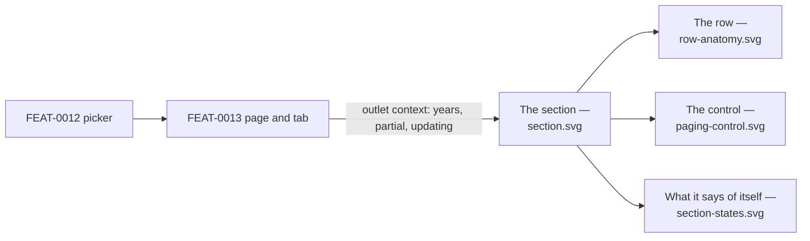

# Visual design — the contratos menores section

Static visual mockups for [FEAT-0011](../README.md)'s UI: the **contratos menores section**
mounted in [FEAT-0013](../../FEAT-0013-organo-contracts-page/README.md)'s outlet — its year
chooser, its two sorts, the row carrying every attribute the system holds, and R17's paging
control — using the project's Mantine stack
([ADR-0004](../../../architecture/0004-ui-stack-vite-mantine.md)) so implementation has a
concrete, faithful target.

These are **design artifacts, not code**: hand-authored SVG that mirrors the real Mantine
`AppShell`, `Card`, `Table`, `Select`, `Alert` and `Button` components with the project
theme. They are impl-agnostic reference; the buildable UI is delivered by tasks 8–11.

The Órgano's name and the tab above the section are
[FEAT-0013](../../FEAT-0013-organo-contracts-page/design/README.md)'s and are drawn only
as the frame this section is mounted in; the picker in the navbar is
[FEAT-0012](../../FEAT-0012-organos-visible-set-and-browse/design/README.md)'s.

## Elements shown here that are deliberately not built, or that read a rule one way

The feature's requirements fix what a row **carries** and what the section **says**; several
rendering choices below are the mockups', and are recorded so nobody builds them believing a
criterion demanded them.

- **The ordering is one `Select` of four entries**, not sortable column headers. R19 offers a
  closed set — two keys by two directions — and a four-option control cannot express anything
  outside it, which is the same closure the four explicit queries have on the server. Clickable
  headers were the obvious alternative and are deliberately not drawn: only two of six columns
  would respond, and the affordance would suggest a dynamic sort the design forecloses.
- **The duration's unreliability marker is on the column**, an `ⓘ` on the header plus a caption
  under the table, rather than a badge repeated on every row. The feature says the column is
  marked *"on every row rather than on the ones we could detect"* — one column-level statement
  covers every row and reads once; a per-row badge would be the same sentence 50 times.
- **Date and amount formatting** (`12 mar 2025`, `12.480,00 €`) are presentation, not data.
  R27's *exactly as stored* governs the text the source publishes — `obxecto`, the awardee's
  name, the duration string — and a date and a decimal still have to be rendered in some
  locale. The abbreviated Galician month follows the precedent in FEAT-0007's mockups.
- **The source identifier sits under the date**, dimmed and monospaced. No criterion places it;
  it is put there because it is an identifier a reader copies rather than reads, and because it
  is the tiebreaker that makes the ordering total.
- **The record count is worded `1 832 rexistros`.** R17 requires the count and the page total to
  be **stated**; the phrasing is the mockups'.
- **The `FONTE` column is an icon-only link**, so it needs an `aria-label` naming the contract it
  opens. A drawing cannot show that; the implementing task must not skip it.

**What is deliberately absent, and must stay absent**: no CPV filter, no free-text search over
`obxecto`, no column stating the awarding Órgano, no hint that anything was withheld, and no
empty state. The first two are SPEC-0005's recorded gaps, the third is #21, and the last two are
consequences of R28 and of presence being derived — see *How the design meets the spec*.

## Screens

| File | Screen | Covers |
| --- | --- | --- |
| [`section.svg`](section.svg) | The section, in place | Year chooser, ordering, the table, the duration caveat and the paging control, inside FEAT-0013's page (SPEC-0005 #16, #23, #27, #40, #41) |
| [`row-anatomy.svg`](row-anatomy.svg) | One row, annotated | Every field a row carries and why, and what the row deliberately does not say (SPEC-0005 #9, #10, #11, #21, #25, #39, #40, #41) |
| [`paging-control.svg`](paging-control.svg) | The `shared/ui` control, four states | First, middle, last and single page — the two ends disabled rather than hidden (SPEC-0005 #23, #24) |
| [`section-states.svg`](section-states.svg) | What the section says about itself | *Partial*, *no longer updated*, both at once, and loading a page (SPEC-0005 #7 third clause, #26) |



## Design language

The mockups reuse the `AppShell` chrome from `ui/src/app/layout/AppLayout.tsx` and the theme in
`ui/src/app/theme.ts`, and follow the tokens and status semantics of
[the administration-area design README](../../../design/administration-area/README.md) — `indigo`
primary, `md` radius, `gray.0`/white surfaces, uppercase dimmed letter-spaced table headers on a
`gray.0` header row, `gray.1` hairlines between rows, Galician chrome throughout.

### What this feature adds

- **A toolbar above the table, inside the card**: the year `Select` and the ordering `Select`,
  each under an uppercase dimmed label. Nothing else — the two absences above are absences, not
  disabled controls.
- **A six-column table** whose widths follow how the values are read: the date and its identifier
  stacked, `obxecto` given the width to wrap, the awardee with its fiscal id beneath, the amount
  right-aligned and bold under a two-line `IMPORTE / IVE INCLUÍDO` header, the duration, and the
  source link.
- **The two state statements are Mantine `Alert`s** in the semantics this product already uses:
  *partial* is informational and takes `indigo` light; *no longer updated* is **inert and takes
  grey**, the same reading a disabled account gets — it is not an error and must not be red.
- **The paging control is a single row** under a hairline: the record count on the left, the five
  controls on the right. Its buttons are `variant="default"`, and at the ends they are
  **disabled, not hidden**, so the control never changes shape under a reader.

## How the design meets the spec

- **One year, one ordering, one page (R19, #27)** — the chooser offers years and nothing else:
  no *all years* entry and no *undated* entry, because neither exists in the domain. The ordering
  control offers exactly four entries.
- **The row carries everything (R16, #16)** — `row-anatomy.svg` labels all seven values and states
  why each is there. There is no detail view to click into, which is why the row is wide.
- **VAT (#10)** — the amount column header carries `IVE INCLUÍDO`, and the annotation states the
  rule that any total derived from one carries it too.
- **The duration (#41)** — marked unreliable for the whole column, with the reason spelled out
  beneath the table rather than in a tooltip a reader may never open.
- **The awardee (#11, #21, #39)** — name and canonical fiscal id, as **text**. The crossing into
  an operador is drawn as absent on purpose: that route belongs to SPEC-0006's read feature, and
  a link to a route that 404s is worse than no link. No field states the awarding Órgano.
- **Nothing is ever absent on a row (R28)** — the mockups contain no placeholder, no dash and no
  zero, because a contract missing its date, amount or awardee is withheld. The row anatomy says
  so where a reader would otherwise ask what happens when a value is missing.
- **Paging (#23, #24)** — the control offers first, previous, next, last and a jump, states the
  record count and the page total, and disables the two ends at the two ends. Changing the year
  or the ordering returns to page 1; moving between pages changes neither the count, the page
  total nor the ordering.
- **The section states its own condition (#7 third clause, #26)** — `section-states.svg` draws
  *partial* and *no longer updated* as two independent statements and shows them together,
  because an Órgano unmarked halfway through its initial import is both. One combined status
  would have to lie in exactly that case.
- **There is no empty state, by construction** — the chooser offers only years that have visible
  contracts, so no choice a reader can make produces an empty list; and an Órgano with no visible
  contratos menores produces no summary, so no tab is drawn and this section never mounts.
- **Galician chrome (SPEC-0001 AC7)** — all copy in `ui/src/shared/lib/strings.ts`, this section's
  under its own namespace and the paging control's under a shared one, since two other specs take
  that control unchanged.

## Copy the screens introduce

The section's own namespace:

| Key | Galician |
| --- | --- |
| `yearLabel` | Ano |
| `sortLabel` | Ordenar por |
| `sort.dateDesc` | Data de publicación (máis recente primeiro) |
| `sort.dateAsc` | Data de publicación (máis antiga primeiro) |
| `sort.amountDesc` | Importe (maior primeiro) |
| `sort.amountAsc` | Importe (menor primeiro) |
| `columnDate` / `columnObxecto` / `columnAwardee` | Data / Obxecto / Adxudicatario |
| `columnAmount` / `columnAmountVat` | Importe / IVE incluído |
| `columnDuration` / `columnSource` | Duración / Fonte |
| `durationCaveat` | A fonte publica a miúdo unha duración por defecto do órgano no canto da do contrato, así que esta columna non se debe ler como un prazo real. |
| `sourceLinkLabel` | Ver a publicación na fonte oficial *(the icon link's accessible name)* |
| `partialTitle` / `partialBody` | Importación en curso / Aínda se están a importar os contratos deste órgano, así que o que ves aquí está incompleto e medra entre visitas. |
| `notUpdatedTitle` / `notUpdatedBody` | Este órgano xa non se actualiza / Os contratos xa importados seguen aquí, pero non se engadirán novos. |

The paging control's, in a **shared** namespace because SPEC-0006's and SPEC-0007's lists take
the same control:

| Key | Galician |
| --- | --- |
| `first` / `previous` / `next` / `last` | Primeira / Anterior / Seguinte / Última |
| `pageLabel` / `ofPages` | Páxina / de {n} |
| `records` | `{ singular: 'rexistro', plural: 'rexistros' }` |
| `navLabel` | Paxinación *(the control's landmark name, so it can be jumped to)* |

`records` travels as a singular/plural pair, the pattern `strings.ts` already uses for counted
nouns, so no call site can take one form and forget the other.

## Regenerating previews

The SVGs are self-contained (no external assets) and open directly in a browser. To rasterise
for review:

```sh
inkscape design/section.svg --export-type=png --export-filename=section.png -w 1280
```
