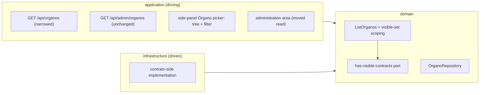

# FEAT-0012. Órganos: the visible set, and a `USER`'s routes into it

## Goal
Give a `USER` the two ways into an Órgano that
**[SPEC-0004](../../specs/SPEC-0004-import-manage-organos-contratacion.md)** now allows them —
the **read-only taxonomy tree** (R9) and a **name search** (R19) — over the **visible set** R9
scopes them to, and scope the catalogue at the endpoint that serves it rather than in the browser
that draws it.

**Both live in one control: an Órgano picker in the left side panel**, open on every page. It drops
down a selectable tree of the Órganos a reader may see, arranged by their taxonomy classification,
with a text box that filters it. Choosing an Órgano opens its contracts.

It delivers **R9's browse tree** whole, **R19** whole, the **narrowing of `GET /api/organos`** R1
and R2 now require, and the move of the administration area onto the read that still carries the
whole catalogue.

**It closes the oldest open criterion in the repo.** SPEC-0004 **#9** — *a user can browse the
taxonomy tree and select an Órgano from it* —
[FEAT-0007](../FEAT-0007-organos-taxonomia-classification/README.md) built the data for and
declined to render, recording that it belonged to "the contract-querying feature". SPEC-0004
recorded the deferral beside the criterion. This is that feature, and #9's deferral note can be
retired with it.

**Why it is its own feature rather than part of
[FEAT-0011](../FEAT-0011-contratos-menores-browsing/README.md).** Both were drafted together and
split on review. Everything here traces to **SPEC-0004** — its criteria #9 and #19–#26 — while
FEAT-0011 traces to SPEC-0005; `spec:` is singular in every feature in this repo, so a task author
following `feat:` → `spec:` from a name-search task would otherwise land in a spec with no
criterion to satisfy. The work is different in kind too: this feature **changes a shipped,
contract-tested endpoint and a shipped admin surface**, where FEAT-0011 adds new reads over new
tables.

The two meet at exactly one point, and it runs one way: **the picker opens an Órgano's contracts
page**, which [FEAT-0013](../FEAT-0013-organo-contracts-page/README.md) builds and FEAT-0011's
section is mounted inside. That is SPEC-0005 R14's requirement, satisfied from this side, so this
feature's picker task waits on FEAT-0013's page and nothing else crosses.

The design sits in the hexagonal server of
**[ADR-0002](../../architecture/0002-hexagonal-architecture.md)**. REST lives under
the reserved `/api/` prefix
(**[ADR-0006](../../architecture/0006-reserved-api-url-prefix.md)**), named per
**[ADR-0020](../../architecture/0020-actions-as-verbs-in-rest-paths.md)** and the
**[ADR-0016](../../architecture/0016-rest-resource-naming.md)** it supersedes, authored
contract-first (**[ADR-0010](../../architecture/0010-design-first-openapi-contract.md)**), verified
against the running instance by
**[ADR-0021](../../architecture/0021-openapi-contract-testing-with-schemathesis.md)**, guarded by
session security (**[ADR-0005](../../architecture/0005-session-based-authentication.md)**) and
carrying the rate-limit contract of
**[ADR-0012](../../architecture/0012-rate-limit-http-contract.md)**. The UI is the React Router SPA
(**[ADR-0003](../../architecture/0003-react-router-ui-served-by-backend.md)**) built with Vite +
Mantine (**[ADR-0004](../../architecture/0004-ui-stack-vite-mantine.md)**) in the feature-based
layout of
**[ADR-0015](../../architecture/0015-frontend-feature-based-shared-core-modularization.md)**, and
its journeys are proved against a stubbed API per
**[ADR-0018](../../architecture/0018-frontend-acceptance-tests-against-a-stubbed-api.md)**.

## Scope
- **Application (driving):** the **narrowing of the shipped `GET /api/organos`** to the visible set,
  with its OpenAPI description rewritten and its integration test reshaped.
- **UI — the Órgano picker in the left side panel (any authenticated user):** a dropdown over the
  narrowed catalogue and FEAT-0007's taxonomy read, showing a selectable tree arranged by taxonomy
  classification with unclassified Órganos at its root and branches left empty pruned, filtered by a
  text box. Choosing an Órgano opens its contracts. **No route, no page, no management control and
  no catalogue list.**
- **UI — the administration area:** FEAT-0007's taxonomy tree, classification worklist and Órgano
  table moved onto `GET /api/admin/organos`, so the management surfaces keep the whole catalogue
  after the narrowing.

**Out of scope (owned elsewhere):**
- **Everything about contracts.** The Órgano contracts page, the family split, the contratos
  menores section and its paging are
  [FEAT-0011](../FEAT-0011-contratos-menores-browsing/README.md)'s. This feature renders no contract
  and reads no contract table — the visible-set predicate is answered behind a port each contract
  family implements, not by this feature knowing what a contract is.
- **The taxonomy and the catalogue themselves** — [FEAT-0006](../FEAT-0006-organos-catalogue-import/README.md)
  imports the catalogue and [FEAT-0007](../FEAT-0007-organos-taxonomia-classification/README.md)
  owns the terms, the placements, the two reads and every management control. This feature adds one
  `USER` surface over them and moves the admin one onto a different read; it changes no taxonomy
  rule.
- **The `ADMIN` half of R19.** R19 says an administrator searching the administration area searches
  the whole catalogue. The admin section has no search today, and adding one is not what this
  feature is for; SPEC-0004 #26's second sentence therefore stays open, and is recorded below rather
  than quietly assumed.
- **A server-side search.** R19 is answered client-side over a list already held — see *The search
  costs a component, not a contract*.

## Design

### Hexagonal placement ([ADR-0002](../../architecture/0002-hexagonal-architecture.md))

### The scoping is the endpoint's, not the client's
SPEC-0004 R9 keeps every Órgano outside the **visible set** off the browse surfaces *and* out of
what is served to them. The scoping is therefore **by path**, and it needs no new endpoint:

| Path | Role | Returns | Built for |
| --- | --- | --- | --- |
| `GET /api/organos` | authenticated | **the visible set only** | the side-panel picker |
| `GET /api/admin/organos` | `ADMIN` | the whole catalogue | the administration area |

- **`GET /api/organos` is narrowed, not duplicated.** It stops returning the whole catalogue and
  returns the visible set instead. Its shape, its ordering under the Galician collation and its
  `termoId` are untouched, so the tree is built exactly as before — from a shorter list.
- **`GET /api/admin/organos` already exists**, built by
  [FEAT-0009](../FEAT-0009-contratos-menores-initial-import/README.md), `ADMIN`-gated, and already
  carrying the placement alongside the import mark — its contract says in as many words that it
  exists so "the administration UI swaps one read for the other rather than issuing both". This
  feature is what makes that swap necessary, and the endpoint that receives it is already shipped.
- **Nothing intersects anything client-side**, so there is no id-list endpoint, no two-read join,
  no filter step in the builder, and no window in which two reads disagree. A surface asks the
  endpoint that means what it wants.
- **The visible set is family-neutral by construction**, so a licitación-only Órgano appears the day
  that family lands: the predicate is *has a visible contract* rather than *has a visible contrato
  menor*. Today only `contrato_menor` can satisfy it, and this feature does not know that — it asks
  the port.

**What this costs is a change to shipped, contract-tested behaviour, and it is not small.**
`GET /api/organos` is `@Secured(IS_AUTHENTICATED)`, returns all 429 rows, has an integration test
named `user_reads_every_organo_with_its_name_state_and_placement`, and `openapi.yaml` still states
*"reading the catalogue is not an administration capability"* — the exact rule SPEC-0004 R1 now
revokes. Task 1 carries the narrowing, the contract rewrite and the test.

**Task 2 must land with or before it.** FEAT-0007's admin section reads `GET /api/organos` for its
taxonomy tree, its Órgano table and its unclassified worklist. Narrowed first, those surfaces
silently lose every Órgano without contracts — most of the catalogue, and precisely the ones an
administrator opens the section to file. Nothing errors, which is what makes it worth stating as an
ordering constraint rather than leaving to whoever picks the tasks up.

### How the visible set is derived
The predicate is *there exists at least one visible contract, of any family, whose Órgano is this
one*, evaluated **when the catalogue is read**. Nothing records it on `organo_contratacion` — no
column, no count, no flag.

- **The contract side owns the predicate.** Each contract family implements a port answering
  whether it holds visible contracts for a set of Órganos; the catalogue read composes the answers
  and does not reach into any family's tables or know how any family defines *visible*. A new
  family joins by adding an implementation, which is what keeps R9's *of any family* honest rather
  than aspirational.
- **Visibility is not a property the import knows**, and this is what rules out a marker the import
  maintains. *Visible* rather than *stored* is deliberate:
  [SPEC-0005](../../specs/SPEC-0005-import-browse-contratos-menores.md) R13 lets an administrator
  **remove** a contract — keeping it stored while removing it from every list — and restore it
  again. An Órgano therefore leaves and re-enters the set through an action that imports no row, so
  an import-maintained marker would be wrong in exactly the case the predicate was worded to catch.
  SPEC-0004 #21 requires both directions.
- **The question is cheap in the direction it is asked.** The catalogue is a few hundred rows and
  the question is *does at least one visible row exist for this Órgano* — a semi-join on an indexed
  foreign key, not an aggregate over millions.
  [ADR-0018](../../architecture/0018-operadores-as-a-stored-projection.md) reached the opposite
  conclusion for operadores because that projection carries *derived attributes* costing a
  top-1-per-group on every read; this one carries a **boolean per Órgano over a few hundred**.
- **Cost is measured, not assumed.** SPEC-0004 R20 puts this read on SPEC-0005 R24's reference
  environment and fixes no budget. If measurement shows the semi-join inadequate at real volumes,
  the replacement is a maintained marker **with an invalidation path for R13** — a change behind the
  same port, which is why this is settled here rather than raised as an architecture decision.

What that costs, stated rather than left to be found: the catalogue read is **no longer a
single-table scan**, and it gains one semi-join per contract family on a read the browse surface
makes on every visit. It also means nothing lets an administrator see the set as stored data, so
diagnosing *why is this Órgano not showing* means running the query rather than reading a column.

### What the picker drops down
The dropdown holds **one control doing R9's job and R19's**, and the two are states of it rather
than neighbours:

- **With the filter empty it shows the tree** (R9), assembled in the browser from the narrowed
  `GET /api/organos` and FEAT-0007's `GET /api/organos/taxonomia` by the **same pure builder the
  admin section already uses**. It offers a `USER` no control at all — no create, rename, move,
  delete or reassign — which is #9's second clause and the reason it is a *view* rather than the
  admin tree with its buttons hidden.
- **With text in the filter it shows the matches** (R19), and nothing else.

> **This is not the `USER` catalogue list R2 removes**, and the distinction is R2's own: neither
> state ever presents the catalogue *undifferentiated*. Empty, the control shows the catalogue
> **through the structure an administrator gave it**; filtered, it shows **only what the reader
> asked for by name**. #24's *a blank query offers nothing* is a rule about the **matches**, which
> are empty until something is typed — not a requirement that an unfiltered dropdown be blank,
> which would delete R9's tree from the only surface that renders it.

- **Unclassified Órganos sit at the root of the tree, beside the root terms.** SPEC-0004 R18 leaves
  every newly imported Órgano unclassified, so a tree of classified Órganos only would leave an
  Órgano holding a million contracts reachable from nowhere — which SPEC-0005 R14 forbids and #19
  tests. The builder already computes that bucket; what changes is that it renders **at the root**
  rather than as the admin section's separate worklist.
- **Empty branches are pruned, recursively.** A term whose whole subtree holds no Órgano of the
  visible set is omitted (#22) — a *recursive* condition, not a per-term one, since a parent whose
  own Órganos are all absent still shows when a descendant has one. A single-level check would prune
  exactly the intermediate terms a deep taxonomy is made of.

  The prune belongs to the **picker's** call, **not inside the shared builder**: the admin section
  renders terms that are legitimately empty, and a builder that dropped them would delete newly
  created terms from the management tree the moment they were made.

**Being in the side panel rather than on a page is what makes it worth building this way.** It is
present on every route, so a reader changes Órgano from wherever they are instead of navigating
back to an index and in again — which is the journey R14 describes, since every read in SPEC-0005
begins by choosing an Órgano. It also means **no `/organos` route exists**, and R19's *there is no
`USER`-facing catalogue list* stops being a rule anyone could accidentally break by adding a page:
there is no page to add a list to.

### The search costs a component, not a contract
R19 is answered **client-side, over the list the tree is already built from**. The catalogue is a
few hundred rows and the picker holds it, so the filter is over data in memory: no request per
keystroke, no debounce against the server, no query endpoint, and **no second definition of what
matches** that could disagree with the tree.

That agreement is a requirement, not a convenience — #26 requires the search to offer exactly what
the tree shows, in both directions, and one control over one list is what makes it true by
construction rather than by two implementations staying in step. Sharing a control, rather than
merely a data source, closes it further: there is no second component to drift.

- **Matching is partial, case- and accent-insensitive** (R19), which is not free in a browser: a
  naïve `toLowerCase().includes()` fails `avila` → `Ávila`, and this catalogue is full of accents.
  The comparison normalises both sides — decomposing and stripping diacritics — in a pure function
  unit-tested from both sides, beside the tree builder.
- **A query matching nothing says so** (#24), distinguishably from a filter not yet typed in — which
  shows the tree.
- **Each entry states whether the Órgano is inactive** (#23), since Órganos differing only by a
  trailing qualifier are ordinary here.

Were the catalogue ever to outgrow being held client-side, the filter would need a server-side read
— a decision for whichever feature meets that limit, against a measurement, not one to pre-empt at
a few hundred rows. SPEC-0004 R20 takes no latency budget for either state for the same reason.

### UI ([ADR-0003](../../architecture/0003-react-router-ui-served-by-backend.md), [ADR-0004](../../architecture/0004-ui-stack-vite-mantine.md), [ADR-0015](../../architecture/0015-frontend-feature-based-shared-core-modularization.md))

**No route is added.** The picker is chrome: it lives in the `AppShell` navbar that
`ui/src/app/layout/` already renders, above `nav.ts`'s sections, and is visible to any
authenticated user on every page. Selecting an Órgano navigates to **`/organo/{id}`** — FEAT-0011's
page, which shows that Órgano's name and a tab per contract family.

**Two problems disappear with the route**, and they were the two this feature was carrying:

- **the nav-label collision** — `strings.nav.organos` is `'Órganos'` for the admin entry, and a
  second `USER` entry would have sat beside it for an `ADMIN`. There is no second entry now; the
  picker is not a link;
- **the eager-chunk risk** — a `/organos` route importing `features/organos` would have pulled that
  slice's 39 files of `ADMIN` management into a `USER`'s bundle. Placement below solves it outright
  rather than by code-splitting a route that no longer exists.

**Where the code lands, and why it is not `features/organos`.** The shell may import from any layer
([ADR-0015](../../architecture/0015-frontend-feature-based-shared-core-modularization.md)), so
rendering a feature slice's component from it is legal — but it would make the navbar statically
depend on the admin slice on **every** route, which is precisely the eager-chunk problem the ADR
records. The picker is also not any feature's: it is navigation, used by the shell, consumed by
whatever page the reader lands on.

So the three pieces land where the ADR's own rules put them, and the trigger is the rule it states
— *a thing moves to `shared/` once a second consumer needs it*, which is now true of all three:

| Piece | Lands in | Second consumer that triggers the move |
| --- | --- | --- |
| the tree builder (`taxonomiaTree.ts`) | `shared/lib` | the picker, beside the admin section |
| the `Organo` type and the catalogue read | `shared/entities` | the picker, beside FEAT-0011's contracts page |
| the picker component itself | `shared/ui` | new; the shell renders it and no feature owns it |

`features/organos` keeps everything genuinely administrative — the modals, the pickers for
classification, the import controls — and the navbar never imports it.

**The picker shows which Órgano is currently open**, so a reader on a contracts page can see what
they are looking at and change it in one action rather than two. That is a property of putting it in
the chrome; on a separate index page the current selection would have nowhere to live.

All copy belongs in `ui/src/shared/lib/strings.ts` under its own namespace, which is the pattern
that module already uses, not in a strings module of its own.

**The screens are drawn in [`design/`](design/README.md)** — the picker's two states, its
loading/empty/failed states, and the administration area after the read swap. That README also
records the handful of details the mockups render that no criterion asks for, so nobody builds
against a picture.

## Sequencing (tasks, one small change each)
Each task names what it depends on; nothing depends on a task numbered after it.

1. **Narrow `GET /api/organos` to the visible set** *(backend, OpenAPI-first)*: the read returns
   only Órganos with at least one visible contract, in any family, through the port described under
   *How the visible set is derived*; its shape, its Galician-collated ordering and its `termoId`
   unchanged. Rewrites the operation description, which today asserts the rule SPEC-0004 R1 revoked,
   and reshapes the integration test named for the old behaviour.
   *(SPEC-0004 #20, #21; SPEC-0005 #48)*
2. **Move the administration area onto `GET /api/admin/organos`** *(frontend)*: FEAT-0007's taxonomy
   tree, classification worklist and Órgano table read the admin catalogue instead of the narrowed
   one, so the management surfaces keep the whole catalogue. **Lands with or before task 1.**
   *(SPEC-0004 #19 management half, #22 management half; guards #3, #8, #18)*
3. **The side-panel Órgano picker: the tree** *(frontend)*: the dropdown in the `AppShell` navbar
   and the three promotions it needs — the tree builder to `shared/lib`, the `Organo` type and
   catalogue read to `shared/entities`, the component to `shared/ui` — rendering the tree over the
   narrowed catalogue and FEAT-0007's taxonomy read, with **unclassified Órganos at its root**,
   **empty branches pruned recursively**, the currently-open Órgano shown as selected, selection
   navigating to **`/organo/{id}`**, and the loading/empty/failed-fetch states. No filter yet;
   no management control; the navbar imports nothing from `features/organos`.
   *Depends on tasks 1–2, and on
   [FEAT-0011](../FEAT-0011-contratos-menores-browsing/README.md)'s contracts page, which selection
   navigates to.* *(SPEC-0004 #9, #19, #22 browse half, and the deferred half of #2; SPEC-0005 #19,
   #20)*
4. **The picker's text filter** *(frontend)*: filtering the same list the tree is built from as the
   user types — partial, case- and accent-insensitive; each match stating whether the Órgano is
   inactive; a no-matches result distinguishable from an **untyped filter, which shows the tree**;
   and choosing a match opening the same Órgano the tree would. *Depends on task 3.*
   *(SPEC-0004 #23, #24, #25, #26 browse half)*

**Criteria this feature deliberately leaves incomplete:**

- **#26's second sentence** — *in the administration area both cover the whole catalogue* — needs an
  admin search, which does not exist and which this feature does not add. The browse half is task
  4's; the admin half waits for a feature that gives the administration area a search, and is
  recorded here so it is open **owned** rather than unowned.
- **#21's leaving half** is provable only once a contract can be made invisible: SPEC-0005 R13's
  removal belongs to the curation feature. An Órgano **entering** the visible set on its first
  visible contract is provable here; **leaving** it on its last is not.
- Every criterion about **importing, the taxonomy and classification** — #1, #3–#8 and #10–#18 —
  belongs to FEAT-0006 and FEAT-0007. This feature adds no management control and imports nothing.

## Edge cases
- **An unclassified Órgano in the visible set** — rendered at the **root** of the picker's tree,
  findable by name, and it opens its contracts like any other. This is the ordinary state of every
  newly imported Órgano, not an exception, and with no `USER` catalogue list to fall back on it is
  the whole reason R9 places it there. *(SPEC-0004 #19)*
- **An Órgano outside the visible set** — most of the catalogue — is absent from the picker in both
  its states **and from what it is served**, while the administration area shows it throughout.
  *(SPEC-0004 #20)*
- **The picker opened with an empty filter** shows the **tree**, not a flat list and not nothing.
  That is R9's affordance, and the reason it does not breach R2 or #24 is that the tree presents the
  catalogue through its structure while a list would present it undifferentiated.
  *(SPEC-0004 #9, #24)*
- **A term whose Órganos are all outside the set but whose descendant has one** — still shown. The
  prune is recursive; a per-term check would delete exactly the intermediate levels of a deep
  taxonomy. *(SPEC-0004 #22)*
- **A term that is legitimately empty in the administration area** — an administrator has just
  created it — is **still shown there**, which is why the prune lives in the browse call and not in
  the shared builder. *(SPEC-0004 #14)*
- **The admin section reading the narrowed catalogue** — the failure task 2 exists to prevent. If
  task 1 lands first, the management tree and the unclassified worklist silently lose every Órgano
  without contracts. Nothing errors, which is what makes it worth naming. *(SPEC-0004 #8, #18)*
- **An inactive Órgano that still holds visible contracts** — in the browse tree like any other, in
  its term if it has one and at the root if not, marked inactive in the search. *Inactive* is a fact
  about the source list, not about whether there is anything there. *(SPEC-0004 #19, #23)*
- **A filter matching nothing, and a filter not yet typed in** — the first says so, the second
  shows the tree. They must not render alike, and neither may fall back to listing the catalogue
  flat. *(SPEC-0004 #24)*
- **A name differing only by accent or case** — `avila` finds `Ávila`. A plain lowercase match would
  fail exactly the users who know the name. *(SPEC-0004 #25)*
- **The catalogue read and the taxonomy read disagreeing** — two requests, so an admin's edit can
  land between them. FEAT-0007 already decided this: an unresolvable `termoId` renders as
  unclassified rather than dropped or crashed on. With the catalogue narrowed the same rule holds,
  and no Órgano disappears, because the catalogue read is the one that lists them.
- **An empty visible set** — nothing imported yet — leaves the picker with nothing selectable, and
  it must say so **distinguishably from a failed read**. FEAT-0007 recorded the same hazard for its
  two reads and the same answer applies: a failed fetch shows an error with a retry, never an empty
  result. The picker is on every page, so this state is the one a reader meets first on a fresh
  deployment.
- **A reader on a contracts page whose Órgano leaves the visible set** — its last visible contract
  removed under SPEC-0005 R13 — finds it gone from the picker on the next read, while the page they
  are on still renders. Nothing forces them off it; the picker simply no longer offers it.
  *(SPEC-0004 #21)*
