# Visual design — the side-panel Órgano picker

Static visual mockups for [FEAT-0012](../README.md)'s one `USER` surface — the **Órgano
picker in the left side panel** — and for the administration area after it moves onto
`GET /api/admin/organos`. They render the two states of the picker (the taxonomy tree
with the filter empty, the matches with text in it), its loading/empty/failed states, and
the one screen where both catalogue reads are visible at once, using the project's
Mantine stack ([ADR-0004](../../../architecture/0004-ui-stack-vite-mantine.md)) so
implementation has a concrete, faithful target.

These are **design artifacts, not code**: hand-authored SVG that mirrors the real Mantine
`AppShell`, `Popover`, `TextInput`, `Tree`, `Card`, `Table`, `Badge` and `Button`
components with the project theme. They are impl-agnostic reference; the buildable UI is
delivered by the feature's tasks 2–4.

## Elements shown here that are deliberately not built

Rendered details that no criterion asks for, recorded here rather than left for someone
to build against a picture:

- The **highlighted matched substring** in `picker-search.svg` (`Deputación` in indigo)
  is illustration: R19 requires the match to be partial, case- and accent-insensitive, not
  that the matched run be marked in the result.
- The **term path caption** under each match (*Deputacións provinciais*, *Sen clasificar*)
  needs no contract — it is derivable from the taxonomy read the picker already holds —
  but task 4 asks only that each entry state whether the Órgano is **inactive**. Build it
  or drop it deliberately; it is not implied.
- The picker's tree deliberately carries **no count badges**, unlike the administration
  tree it shares a builder with. The picker's job is selection, and a per-term count is
  UI nobody asked for.

The counts on `admin-whole-catalogue.svg` (*18*, *64*, *12*, *429 órganos no catálogo*)
are FEAT-0007's shipped surfaces, unchanged by this feature except for the endpoint
behind them.

## Screens

| File | Screen | Covers |
| --- | --- | --- |
| [`picker-tree.svg`](picker-tree.svg) | Picker open, filter empty | The browse tree over the narrowed catalogue, unclassified Órganos at the root, recursive pruning, the open Órgano shown as selected (SPEC-0004 #9, #19, #22) |
| [`picker-search.svg`](picker-search.svg) | Picker open, text typed | Partial accent-insensitive matching, the inactive marker, and — as a dashed inset — the no-matches state (SPEC-0004 #23, #24, #25, #26) |
| [`picker-states.svg`](picker-states.svg) | Loading, empty visible set, failed read | The three states a reader meets on a fresh deployment, plus the closed control in both its forms (feature *edge cases*) |
| [`admin-whole-catalogue.svg`](admin-whole-catalogue.svg) | Administration area on `GET /api/admin/organos` | The management surfaces keeping the whole catalogue after the narrowing, and terms that are legitimately empty (SPEC-0004 #8, #14, #18, #20) |

```mermaid
flowchart LR
    shell["AppShell navbar<br/>(every route)"] --> closed["Picker, closed —<br/>picker-states.svg"]
    closed -->|opened| tree["Filter empty: the tree —<br/>picker-tree.svg"]
    tree -->|types a name| search["Filter typed: the matches —<br/>picker-search.svg"]
    tree -->|selects an Órgano| page["/organo/&#123;id&#125;<br/>(FEAT-0013)"]
    search -->|selects a match| page
    shell --> admin["Administración · Órganos —<br/>admin-whole-catalogue.svg"]
```



## Design language

The mockups reuse the existing `AppShell` chrome from `ui/src/app/layout/AppLayout.tsx`
and the theme in `ui/src/app/theme.ts`, and follow the tokens, chrome and status
semantics documented in
[FEAT-0004's design README](../../FEAT-0004-administration-area/design/README.md) —
`indigo` primary, `md` radius, `gray.0`/white surfaces, green/grey/red status semantics,
Galician chrome throughout.

### What this feature adds to the chrome

- **A picker above the nav sections, not a nav entry.** An uppercase dimmed `ÓRGANO`
  label and a bordered control sit at the top of the navbar, above `nav.ts`'s sections and
  separated from them by a hairline. It is not a link and adds no route, which is why the
  `strings.nav.organos` collision with the admin entry never arises.
- **The control names the open Órgano.** Closed, it shows the current Órgano in
  `fw={600}` or the dimmed placeholder *Escolle un órgano* when none is open — the
  affordance that only exists because the control lives in the chrome.
- **The dropdown is a popover, and it overlays what is behind it** — including the
  *Inicio* / *Acerca de* links in `picker-tree.svg`. That occlusion is the real behaviour
  of a Mantine `Popover`, not an omission in the drawing.
- **One control, two states.** The filter box is part of the dropdown, never a second
  surface: with it empty the body is the tree, with text in it the body is the matches.
  There is no second component that could drift out of step with the first (#26).
- **The `USER` session has no ADMINISTRACIÓN section**, which `picker-tree.svg` and
  `picker-search.svg` render as it is: the picker is the whole of a reader's way into an
  Órgano.

### Tree rows

Terms carry a chevron and `fw={500}` body text; Órganos are regular weight, one indent
level deeper than their term. **Unclassified Órganos render at the root**, without a
chevron, beside the root terms — not under a *Sen clasificar* heading, which is the
administration area's worklist and a different thing. The selected row uses the Mantine
`light` active state (`indigo.0` background, `indigo.8` text) with a check.

## How the design meets the spec

- **The tree (#9, #19, #22)** — `picker-tree.svg` shows the browse tree with no
  management control of any kind: no create, rename, move, delete or reassign. It is a
  view, not the admin tree with its buttons hidden, and the annotation says so.
  «Consellería de Facenda» is absent because its whole subtree holds no Órgano of the
  visible set, while a term whose *descendant* has one stays.
- **Search (#23, #25, #26)** — `picker-search.svg` types `deputacion` and matches
  `Deputación …`, over the same in-memory list the tree is built from. The fourth match
  differs from the third only by a trailing qualifier and is marked `INACTIVO` in grey —
  inert, not an error — which is exactly why #23 asks for the marker.
- **No matches vs. an untyped filter (#24)** — the dashed inset states the query back
  (*Ningún órgano coincide con «sanidde».*); the untyped filter shows the tree
  (`picker-tree.svg`). The two must not render alike, and neither falls back to a flat
  catalogue list.
- **Empty set vs. failed read (edge cases)** — `picker-states.svg` draws them as
  different things: *Aínda non hai órganos con contratos* is a correct answer, while a
  failed read is a red alert with *Tentar de novo*. Only the second offers a retry.
- **The administration area keeps the whole catalogue (#8, #14, #18, #20)** —
  `admin-whole-catalogue.svg` is the same administrator, on the same screen, with the
  narrowed picker in the navbar and the whole catalogue in the section. A term an
  administrator has just created (*Portos e augas*, 0) and a term whose Órganos hold no
  contracts (*Consellería de Facenda*) are both still shown, which is why the prune lives
  in the picker's call and not in the shared builder.
- **Galician chrome (SPEC-0001 AC7)** — every label, empty-state and refusal string is in
  Galician, to be added to `ui/src/shared/lib/strings.ts` under its own namespace.

## Copy the screens introduce

New user-facing text, to land in `strings.ts` under a picker namespace rather than a
module of its own:

| Key | Galician | Where |
| --- | --- | --- |
| `label` | Órgano | the navbar label above the control |
| `placeholder` | Escolle un órgano | closed, with no Órgano open |
| `searchPlaceholder` | Buscar un órgano… | the filter box |
| `noMatches` | Ningún órgano coincide con «…». | filter typed, nothing found |
| `noMatchesHelp` | Revisa a busca ou baléiraa para ver a árbore completa. | beneath it |
| `inactive` | Inactivo | the marker on a match |
| `unclassified` | Sen clasificar | a match with no term |
| `empty` | Aínda non hai órganos con contratos. | empty visible set |
| `emptyHelp` | Cando se importe o primeiro contrato dun órgano, aparecerá aquí. | beneath it |
| `errorTitle` | Non se puido cargar a lista de órganos. | failed read |

`strings.retry` (*Tentar de novo*) and `strings.loading` already exist and are reused.

## Regenerating previews

The SVGs are self-contained (no external assets) and open directly in a browser. To
rasterise for review:

```sh
inkscape design/picker-tree.svg --export-type=png --export-filename=picker-tree.png -w 1280
```
