# FEAT-0013. The Órgano page and its contract-family tabs

## Goal
Deliver **[SPEC-0005](../../specs/SPEC-0005-import-browse-contratos-menores.md) R15** — an Órgano's
contracts *presented split by contract family, each reachable independently, a family with no data
omitted rather than shown empty* — as the page every family's section is mounted in:
`/organo/{id}`, showing the Órgano's name and a tab per family that has data.

It delivers the **page and the split**, and **no contracts**. The contratos menores section that
fills the first tab is
[FEAT-0011](../FEAT-0011-contratos-menores-browsing/README.md)'s; the licitacións section that will
fill the second belongs to that spec's feature. This one owns what they have in common and nothing
either of them is about.

**Why it is its own feature.** R15 requires the split to be **additive** — *"a family the system
gains later takes its place alongside the others without this requirement changing"*. If the page
lived in the contratos menores feature, the licitacións feature would have to edit it, and under
**[ADR-0015](../../architecture/0015-frontend-feature-based-shared-core-modularization.md)** it
could not: `eslint-plugin-boundaries` forbids one feature slice importing another. A shell owned by
one family is a shell the next family cannot join. Owning it separately is what makes *appending a
tab* a real operation rather than a wish.

It is the third feature to trace SPEC-0005, alongside
[FEAT-0009](../FEAT-0009-contratos-menores-initial-import/README.md)'s import and FEAT-0011's read,
and the boundaries between them are one-way:

```mermaid
flowchart LR
    picker["FEAT-0012<br/>side-panel picker"] -->|navigates to| page["FEAT-0013<br/>/organo/&#123;id&#125;"]
    page -->|router mounts into| section["FEAT-0011<br/>contratos menores section"]
    page -.->|router will mount| lic["licitacións section<br/>(future spec)"]
```



The design sits in the hexagonal server of
**[ADR-0002](../../architecture/0002-hexagonal-architecture.md)**; its one read lives under the
reserved `/api/` prefix (**[ADR-0006](../../architecture/0006-reserved-api-url-prefix.md)**), named
per **[ADR-0020](../../architecture/0020-actions-as-verbs-in-rest-paths.md)** and the
**[ADR-0016](../../architecture/0016-rest-resource-naming.md)** it supersedes, authored
contract-first (**[ADR-0010](../../architecture/0010-design-first-openapi-contract.md)**), verified
by **[ADR-0021](../../architecture/0021-openapi-contract-testing-with-schemathesis.md)**, guarded by
session security (**[ADR-0005](../../architecture/0005-session-based-authentication.md)**) and
carrying **[ADR-0012](../../architecture/0012-rate-limit-http-contract.md)**'s rate-limit contract.
The UI is the React Router SPA
(**[ADR-0003](../../architecture/0003-react-router-ui-served-by-backend.md)**) with Vite + Mantine
(**[ADR-0004](../../architecture/0004-ui-stack-vite-mantine.md)**), laid out per ADR-0015 and proved
against a stubbed API per
**[ADR-0018](../../architecture/0018-frontend-acceptance-tests-against-a-stubbed-api.md)**.

## Scope
- **Application (driving):** the **Órgano member read**, `GET /api/organo/{id}` — the Órgano's own
  attributes and **one summary per contract family it holds visible data for** — composing a
  per-family summary port that each family's feature implements.
- **UI:** the `/organo/:id` **layout route** — the Órgano's name, the tab bar built from that read,
  the redirect from the bare path to the first family's tab, the page's own no-contracts state, and
  the `<Outlet/>` each family's section is mounted in, **carrying that family's entry as outlet
  context** — the section takes its summary out of it, and does not read it again.

**Out of scope (owned elsewhere):**
- **Every contract, and every control over contracts.** The contratos menores section — its year
  chooser, sorts, rows and paging — is
  [FEAT-0011](../FEAT-0011-contratos-menores-browsing/README.md)'s and mounts inside this page's
  outlet. This feature renders no contract and calls no contract list read.
- **Reaching the page.** The side-panel picker that navigates here is
  [FEAT-0012](../FEAT-0012-organos-visible-set-and-browse/README.md)'s, as is the visible-set
  scoping that decides which Órganos a reader can pick.
- **R18's *is this section partial / no longer updated*.** Those are statements a **family's
  section** makes about its own data, not the page's, and FEAT-0011 owns them for contratos
  menores. This feature's read **carries** them and renders none of them: what a summary means is
  its family's business, and the page treats every summary as opaque except for whether it exists.

## Design

### The tab is a route, and that is what keeps the split additive
`/organo/{id}` is a **layout route**: it renders the Órgano's name and the tab bar, and mounts the
active family's section in an `<Outlet/>`. Each family is a **child route** under it:

| Path | Renders |
| --- | --- |
| `/organo/{id}` | redirects to the first family that has data |
| `/organo/{id}/contratos-menores` | the page, with FEAT-0011's section in the outlet |
| `/organo/{id}/licitacions` | the page, with that family's section, when it exists |

**The composition happens in `app/router.tsx`, not in a component**, and that is the whole reason
this shape is worth having. ADR-0015 forbids one feature slice importing another, so a shell
component could never render a section it does not own — and a shell that owned every section would
make the licitacións feature edit the contratos menores slice. The router is in `app/`, which **may**
import from every feature, so it wires shell and section together while neither imports the other.
**A new family adds a registry entry, a label and a child route — and edits no other feature's
slice.** That is what *additive* has to mean once a router is involved: this feature's own registry
is where a family is declared, and declaring one there costs the contratos menores slice nothing.

**Deep links are per family**, which is what R15's *reachable independently* asks for. A reader
sharing a link shares the family they were looking at, and FEAT-0011's year, sort and page ride in
the query string beside it — belonging unambiguously to the section in the outlet, since only one is
mounted.

**The bare path redirects rather than rendering a chooser.** A reader arriving at `/organo/{id}`
wants contracts, not a menu; the first family with data is the one they get, and the redirect is
what makes the tab always match the URL.

### One member read builds the whole page
The tab bar must be built **before any section mounts**, so the page cannot ask each family to
answer for itself — a section that has not been rendered cannot report that it has no data. And the
page needs the Órgano's **name** at the same moment. Both come from the member the page is about:

| Method & path | Role | Purpose |
| --- | --- | --- |
| `GET /api/organo/{id}` | authenticated | the Órgano's own attributes, and one **summary per contract family** it holds visible data for |

```json
{
  "id": "…",
  "name": "Servizo Galego de Saúde",
  "families": {
    "contratosMenores": {
      "route": "contratos-menores",
      "summary": { "years": [2025, 2024, 2023], "partial": false, "updating": true }
    }
  }
}
```

- **A family present in `families` has visible data; one absent has none.** Presence is not a
  separate flag that could disagree with the summary beside it — it *is* the summary's existence,
  the same construction FEAT-0011 uses for whether a section exists. `families: {}` is an Órgano
  holding nothing, and it draws no tab bar.
- **The key names the family; the `route` beside it is the server's own statement of where that
  family is mounted.** The key is an identifier and stays stable, in camelCase like every other
  property; the path segment travels beside it as **data the server sends**, so a client needs no
  case conversion — and no table of its own — to turn a response into a link.
  **This UI is not that client.** React Router is given its route tree up front, so
  `app/router.tsx` names the segment literally whatever the response says; a table cannot be
  removed here, only moved. So the family registry names it too, beside the tab's label, and the
  page addresses a family from there — which also means a tab always points at a route this build
  has declared, where one built from `route` could point at a segment the router never learned.
  The segment is therefore written twice — in the registry and in the router's child route, which
  cannot read the registry because a static import of the slice's barrel would drag the whole slice
  into the eager chunk — and nothing but the property's `enum` holds those two and the server to
  the same value. The alternative was writing it twice *and* trusting the response, which is not
  fewer places. `route` stays in the contract for the clients that are not this one.
- **Each family's summary is owned by that family's feature**, not by this one. The
  `contratosMenores` entry nests it under `summary` — its years, its `partial` and `updating` are
  [FEAT-0011](../FEAT-0011-contratos-menores-browsing/README.md)'s schema and come from
  FEAT-0011's port; this feature composes the ports and publishes the envelope, and the nesting is
  what keeps `route` out of a schema it does not own. **A new family adds a property and implements
  a port; it changes no member that already exists.**
- **The page reads only the keys.** Which tabs to draw, which to redirect to, and whether to draw a
  bar at all are answered by `Object.keys(families)` matched against the family registry — and a
  key the registry does not know is ignored, so a server that learns a family before this build
  does draws no tab the router cannot follow. Every `summary` is opaque to this feature and is
  handed to the section that owns it.

> **This replaces two endpoints an earlier draft split**, and the consolidation is the user-visible
> point. That draft had `GET /api/organo/{id}/contratos/familias` here for the tabs, FEAT-0011's
> `GET /api/organo/{id}/contratos-menores/resumo` for the section, and the Órgano's **name** taken
> from FEAT-0012's catalogue list — three reads before a reader saw anything, two of them
> round-tripping in series because the tab had to exist before the section mounted. One member read
> answers all three, and the page renders its name, its tabs and its opening section's year chooser
> from a single response.
>
> **FEAT-0011 declined a member endpoint on the grounds that it would "add a member endpoint to
> serve one field"** — the name. That was right when the name was the only thing wanted from it.
> With the families and their summaries on the same response it is serving three purposes, and the
> objection stops applying.

**An Órgano outside a `USER`'s visible set answers 200 with `families: {}`**, not 404 and not 403.
SPEC-0004 R9 scopes what is **listed**; SPEC-0005 is explicit that it does not make an Órgano's
identity a secret. An unknown id is a 404.

### What the page renders when there is nothing
**No family with data means no tab bar**, and the page shows the Órgano's name and a plain statement
that the system holds no contracts for it. R18 forbids an empty *section*; a page saying plainly that
it holds nothing is not one, and it is better than a redirect with nowhere to go.

**Reaching that state is rare by construction.** SPEC-0004 R9 scopes FEAT-0012's picker to Órganos
that have contracts, so a reader following the picker never lands here. It is reached by a retained
link, or by the last visible contract being removed under SPEC-0005 R13 while a reader holds the URL.

**One tab is not a defect.** Until licitacións exists the bar carries a single tab. The alternative —
hiding the bar until a second family appears — would make the licitacións feature change this page's
structure rather than append to it, which is exactly what R15's *additive* wording exists to prevent.

### UI ([ADR-0015](../../architecture/0015-frontend-feature-based-shared-core-modularization.md))
The page is its own slice, `ui/src/features/organo/`, holding the layout component, the tab bar, the
member read and the redirect. It imports **no other feature**, and no other feature imports it.

- **The member read and its `Organo` type live in `shared/entities`**, beside the catalogue read
  FEAT-0012 promotes there — because two slices consume the response: this page reads the name and
  the family keys, and **each family's section reads its own entry** out of the same object. That is
  the second consumer ADR-0015's rule waits for.
- **`families` is typed as a record of opaque values** in `shared/entities`, never as a union of the
  known families. A shared module that knew what a `contratos-menores` summary contains would be
  `shared/` depending on a feature, which ADR-0015 forbids in exactly that direction. Each family's
  slice narrows its own entry; nothing else may.
- **The family's entry reaches the section through `<Outlet context={…}/>`**, read with
  `useOutletContext()`; the section narrows `family.summary` and nothing else does. That is what
  lets it have the years without importing this slice and without a second request: the router
  passes data, so neither feature imports the other. It is the same boundary trick the child routes
  already use, applied to data instead of composition. The entry is typed and the summary inside it
  is `unknown`, so reaching for a summary field on the entry is a compiler error rather than a
  silent `undefined`.
- The **family registry** — slug, tab label, child-route path — lives here, because it is what the
  tab bar renders and what the router's child routes are declared from. It is a list, and a family is
  an entry.
- All copy is Galician (SPEC-0001 AC7) in `ui/src/shared/lib/strings.ts` under this slice's
  namespace.

**The screens are drawn in [`design/`](design/README.md)** — the page as it ships, the tab bar as a
function of the `families` keys, and the four states in which it has no section to frame. The
outlet is drawn as a placeholder there for the same reason it is empty here: what fills it is
another feature's.

## Sequencing (tasks, one small change each)

1. **The Órgano member read** *(backend, OpenAPI-first)*: `GET /api/organo/{id}`, authenticated,
   returning the Órgano's attributes and the `families` map — each entry produced by that family's
   summary port, a family with no visible data producing no entry; the reused `organo-not-found`
   for an unknown Órgano; ADR-0012's headers. The `contratos-menores` entry's **schema is
   FEAT-0011's**, referenced rather than restated, so one feature owns each family's shape.
   *Depends on [FEAT-0011](../FEAT-0011-contratos-menores-browsing/README.md)'s summary port
   (its task 6).* *(SPEC-0005 #22 presence half, #26 contract half, #43)*
2. **The Órgano page and its tabs** *(frontend)*: the `features/organo` slice; the `/organo/:id`
   layout route rendering the Órgano's name, the tab bar built from the family keys, and an
   `<Outlet/>` **carrying the active family's summary as context**; the redirect from the bare path
   to the first family with data; the family registry; the no-contracts state; and the loading and
   failed-fetch states. Mounts no section — the outlet is empty until a family's route is declared.
   *Depends on task 1.* *(SPEC-0005 #22, #49 tab-absence half)*
3. **Mount the contratos menores section** *(frontend)*: the child route at
   `/organo/:id/contratos-menores` wiring FEAT-0011's section into this page's outlet, declared in
   `app/router.tsx` so neither slice imports the other. *Depends on task 2 and on FEAT-0011's
   section tasks.* *(SPEC-0005 #22 contratos-menores half)*

**Criteria this feature deliberately leaves incomplete:**

- **#22's licitacións clause** — *a family for which the system holds no data is omitted… and its
  absence causes no error in the families that remain* — is provable in the omission direction today
  (a family with no data has no tab) but not in the **remaining-families** direction, which needs a
  second family to remain. It completes with the licitacións feature.
- **#26 and #49's section halves** belong to FEAT-0011: this feature decides whether a *tab* exists,
  that one decides what the section inside it says.

## Edge cases
- **An Órgano with no contract data at all** — no tab bar, the name and a statement that nothing is
  held. Reached only by a retained link, since FEAT-0012's picker does not offer such an Órgano.
  *(SPEC-0005 #26 page half)*
- **An Órgano holding another family's contracts but none of this one** — the case R15 exists for:
  the families it holds get tabs, the one it does not is **absent from the bar**, not disabled and
  not an empty panel. *(SPEC-0005 #49)*
- **A child-route family that has no tab** — a link copied before those contracts were removed, or
  before that family existed — redirects to the first family that does, rather than rendering an
  empty panel or erroring. The tab bar is built from the read, so a URL cannot conjure a tab.
- **The last visible contract removed while a reader holds the page** — under SPEC-0005 R13 — the
  next load has no tab for that family, and the bare path redirects elsewhere or, if nothing
  remains, shows the no-contracts state.
- **The member read failing** must not render as *this Órgano has no contracts*: `families: {}` and a
  failed fetch are different, and the page shows an error with a retry for the second.
  FEAT-0007 recorded the same hazard, and the same answer applies. Consolidating three reads into
  one makes this **more** important, not less — a single failure now costs the name, the tabs and
  the opening section's chooser at once, so there is exactly one place that has to get it right.
- **An unknown Órgano id** — 404 from the member read, and a not-found state on the page rather
  than an empty tab bar.
