# FEAT-0013. The Órgano page and its contract-family tabs

## Goal
Deliver **[SPEC-0005](../../specs/SPEC-0005-import-browse-contratos-menores.md) R15** — an Órgano's
contracts *presented split by contract family, each reachable independently, a family with no data
omitted rather than shown empty* — as the page every family's section is mounted in:
`/organo/{id}`, showing the Órgano's name and a tab per family that has data.

It delivers the **page and the split**, and **no contracts**. The contratos menores section that
fills the first tab is
[FEAT-0011](../FEAT-0011-contratos-menores-browsing/README.md)'s; the licitacións section that will
fill the second belongs to that spec's feature. This one owns what they have in common and nothing
either of them is about.

**Why it is its own feature.** R15 requires the split to be **additive** — *"a family the system
gains later takes its place alongside the others without this requirement changing"*. If the page
lived in the contratos menores feature, the licitacións feature would have to edit it, and under
**[ADR-0015](../../architecture/0015-frontend-feature-based-shared-core-modularization.md)** it
could not: `eslint-plugin-boundaries` forbids one feature slice importing another. A shell owned by
one family is a shell the next family cannot join. Owning it separately is what makes *appending a
tab* a real operation rather than a wish.

It is the third feature to trace SPEC-0005, alongside
[FEAT-0009](../FEAT-0009-contratos-menores-initial-import/README.md)'s import and FEAT-0011's read,
and the boundaries between them are one-way:

```mermaid
flowchart LR
    picker["FEAT-0012<br/>side-panel picker"] -->|navigates to| page["FEAT-0013<br/>/organo/&#123;id&#125;"]
    page -->|router mounts into| section["FEAT-0011<br/>contratos menores section"]
    page -.->|router will mount| lic["licitacións section<br/>(future spec)"]
```

The design sits in the hexagonal server of
**[ADR-0002](../../architecture/0002-hexagonal-architecture.md)**; its one read lives under the
reserved `/api/` prefix (**[ADR-0006](../../architecture/0006-reserved-api-url-prefix.md)**), named
per **[ADR-0020](../../architecture/0020-actions-as-verbs-in-rest-paths.md)** and the
**[ADR-0016](../../architecture/0016-rest-resource-naming.md)** it supersedes, authored
contract-first (**[ADR-0010](../../architecture/0010-design-first-openapi-contract.md)**), verified
by **[ADR-0021](../../architecture/0021-openapi-contract-testing-with-schemathesis.md)**, guarded by
session security (**[ADR-0005](../../architecture/0005-session-based-authentication.md)**) and
carrying **[ADR-0012](../../architecture/0012-rate-limit-http-contract.md)**'s rate-limit contract.
The UI is the React Router SPA
(**[ADR-0003](../../architecture/0003-react-router-ui-served-by-backend.md)**) with Vite + Mantine
(**[ADR-0004](../../architecture/0004-ui-stack-vite-mantine.md)**), laid out per ADR-0015 and proved
against a stubbed API per
**[ADR-0018](../../architecture/0018-frontend-acceptance-tests-against-a-stubbed-api.md)**.

## Scope
- **Application (driving):** one authenticated read answering **which contract families this Órgano
  has data for**, composing the per-family ports FEAT-0012 already defines.
- **UI:** the `/organo/:id` **layout route** — the Órgano's name, the tab bar built from that read,
  the redirect from the bare path to the first family's tab, the page's own no-contracts state, and
  the `<Outlet/>` each family's section is mounted in.

**Out of scope (owned elsewhere):**
- **Every contract, and every control over contracts.** The contratos menores section — its year
  chooser, sorts, rows and paging — is
  [FEAT-0011](../FEAT-0011-contratos-menores-browsing/README.md)'s and mounts inside this page's
  outlet. This feature renders no contract and calls no contract list read.
- **Reaching the page.** The side-panel picker that navigates here is
  [FEAT-0012](../FEAT-0012-organos-visible-set-and-browse/README.md)'s, as is the visible-set
  scoping that decides which Órganos a reader can pick.
- **R18's *is this section partial / no longer updated*.** Those are statements a **family's
  section** makes about its own data, not the page's, and FEAT-0011 owns them for contratos
  menores.

## Design

### The tab is a route, and that is what keeps the split additive
`/organo/{id}` is a **layout route**: it renders the Órgano's name and the tab bar, and mounts the
active family's section in an `<Outlet/>`. Each family is a **child route** under it:

| Path | Renders |
| --- | --- |
| `/organo/{id}` | redirects to the first family that has data |
| `/organo/{id}/contratos-menores` | the page, with FEAT-0011's section in the outlet |
| `/organo/{id}/licitacions` | the page, with that family's section, when it exists |

**The composition happens in `app/router.tsx`, not in a component**, and that is the whole reason
this shape is worth having. ADR-0015 forbids one feature slice importing another, so a shell
component could never render a section it does not own — and a shell that owned every section would
make the licitacións feature edit the contratos menores slice. The router is in `app/`, which **may**
import from every feature, so it wires shell and section together while neither imports the other.
**A new family adds a child route and a tab; it changes no file this feature ships.**

**Deep links are per family**, which is what R15's *reachable independently* asks for. A reader
sharing a link shares the family they were looking at, and FEAT-0011's year, sort and page ride in
the query string beside it — belonging unambiguously to the section in the outlet, since only one is
mounted.

**The bare path redirects rather than rendering a chooser.** A reader arriving at `/organo/{id}`
wants contracts, not a menu; the first family with data is the one they get, and the redirect is
what makes the tab always match the URL.

### Which tabs exist: one read, reusing a port that already exists
The tab bar must be built **before any section mounts**, so the page cannot ask each family to
answer for itself — a section that has not been rendered cannot report that it has no data.

| Method & path | Role | Purpose |
| --- | --- | --- |
| `GET /api/organo/{id}/contratos/familias` | authenticated | the contract families this Órgano has visible data for |

- **It composes the per-family ports FEAT-0012 defines**, rather than introducing a mechanism. That
  feature already needs *does this family hold visible contracts for this Órgano* to scope the
  catalogue; this asks the same question about one Órgano and reports which families said yes.
- **A family joins by implementing that port**, which is the same act that makes it appear in the
  visible set. There is no second list of families to keep in step on the server.
- **The response is family slugs**, matching the child-route segments, so the client maps a
  response to a route without a lookup table that could disagree with the router.

> **This reverses a decision an earlier draft of FEAT-0011 took**, and the reversal is recorded
> rather than quiet. That draft rejected a families endpoint on the grounds that *"it would make
> every new family a change to a shared contract, and it answers a question each family already
> answers for itself"*. Both halves stop being true here: with tabs, presence is needed **before**
> any family is mounted, so no family can answer for itself; and because the endpoint composes a
> port rather than enumerating families in its own code, a new family changes an implementation, not
> a contract. What was over-engineering when each section could answer for itself is the smallest
> thing that works once the tab bar has to be drawn first.

### What the page renders when there is nothing
**No family with data means no tab bar**, and the page shows the Órgano's name and a plain statement
that the system holds no contracts for it. R18 forbids an empty *section*; a page saying plainly that
it holds nothing is not one, and it is better than a redirect with nowhere to go.

**Reaching that state is rare by construction.** SPEC-0004 R9 scopes FEAT-0012's picker to Órganos
that have contracts, so a reader following the picker never lands here. It is reached by a retained
link, or by the last visible contract being removed under SPEC-0005 R13 while a reader holds the URL.

**One tab is not a defect.** Until licitacións exists the bar carries a single tab. The alternative —
hiding the bar until a second family appears — would make the licitacións feature change this page's
structure rather than append to it, which is exactly what R15's *additive* wording exists to prevent.

### UI ([ADR-0015](../../architecture/0015-frontend-feature-based-shared-core-modularization.md))
The page is its own slice, `ui/src/features/organo/`, holding the layout component, the tab bar, the
families read and the redirect. It imports **no other feature**, and no other feature imports it.

- The **`Organo` type and the catalogue read** come from `shared/entities`, where FEAT-0012 promotes
  them — this page needs the Órgano's **name**, and that is the second consumer ADR-0015's rule waits
  for.
- The **family registry** — slug, tab label, child-route path — lives here, because it is what the
  tab bar renders and what the router's child routes are declared from. It is a list, and a family is
  an entry.
- All copy is Galician (SPEC-0001 AC7) in `ui/src/shared/lib/strings.ts` under this slice's
  namespace.

## Sequencing (tasks, one small change each)

1. **The families read** *(backend, OpenAPI-first)*: `GET /api/organo/{id}/contratos/familias`,
   authenticated, composing the per-family visible-contracts ports and returning the slugs of the
   families that have data; the reused `organo-not-found` for an unknown Órgano. *Depends on
   [FEAT-0012](../FEAT-0012-organos-visible-set-and-browse/README.md)'s port existing.*
   *(SPEC-0005 #22 presence half)*
2. **The Órgano page and its tabs** *(frontend)*: the `features/organo` slice; the `/organo/:id`
   layout route rendering the Órgano's name, the tab bar built from task 1, and an `<Outlet/>`; the
   redirect from the bare path to the first family with data; the family registry; the
   no-contracts state; and the loading and failed-fetch states. Mounts no section — the outlet is
   empty until a family's route is declared. *Depends on task 1.*
   *(SPEC-0005 #22, #49 tab-absence half)*
3. **Mount the contratos menores section** *(frontend)*: the child route at
   `/organo/:id/contratos-menores` wiring FEAT-0011's section into this page's outlet, declared in
   `app/router.tsx` so neither slice imports the other. *Depends on task 2 and on FEAT-0011's
   section tasks.* *(SPEC-0005 #22 contratos-menores half)*

**Criteria this feature deliberately leaves incomplete:**

- **#22's licitacións clause** — *a family for which the system holds no data is omitted… and its
  absence causes no error in the families that remain* — is provable in the omission direction today
  (a family with no data has no tab) but not in the **remaining-families** direction, which needs a
  second family to remain. It completes with the licitacións feature.
- **#26 and #49's section halves** belong to FEAT-0011: this feature decides whether a *tab* exists,
  that one decides what the section inside it says.

## Edge cases
- **An Órgano with no contract data at all** — no tab bar, the name and a statement that nothing is
  held. Reached only by a retained link, since FEAT-0012's picker does not offer such an Órgano.
  *(SPEC-0005 #26 page half)*
- **An Órgano holding another family's contracts but none of this one** — the case R15 exists for:
  the families it holds get tabs, the one it does not is **absent from the bar**, not disabled and
  not an empty panel. *(SPEC-0005 #49)*
- **A child-route family that has no tab** — a link copied before those contracts were removed, or
  before that family existed — redirects to the first family that does, rather than rendering an
  empty panel or erroring. The tab bar is built from the read, so a URL cannot conjure a tab.
- **The last visible contract removed while a reader holds the page** — under SPEC-0005 R13 — the
  next load has no tab for that family, and the bare path redirects elsewhere or, if nothing
  remains, shows the no-contracts state.
- **The families read failing** must not render as *this Órgano has no contracts*: an empty result
  and a failed fetch are different, and the page shows an error with a retry for the second.
  FEAT-0007 recorded the same hazard, and the same answer applies.
- **An unknown Órgano id** — 404 from the families read, and a not-found state on the page rather
  than an empty tab bar.
