# Visual design — the Órgano page and its family tabs

Static visual mockups for [FEAT-0013](../README.md): the `/organo/{id}` layout route —
the Órgano's name, the tab bar built from the member read's `families` keys, and the
outlet each family's section is mounted in. They render the page as it ships, the tab bar
as a function of what the read returns, and the four states in which the page has no
contracts to frame, using the project's Mantine stack
([ADR-0004](../../../architecture/0004-ui-stack-vite-mantine.md)) so implementation has a
concrete, faithful target.

These are **design artifacts, not code**: hand-authored SVG that mirrors the real Mantine
`AppShell`, `Tabs`, `Card`, `Alert` and `Button` components with the project theme. They
are impl-agnostic reference; the buildable UI is delivered by the feature's tasks 2–3.

**The page draws a frame and cedes the interior**, which is what makes these mockups
unusual: the largest region on the main screen is an outlet placeholder. That is not an
unfinished drawing — this feature *renders no contract*. The contratos menores section
that fills it is [FEAT-0011](../../FEAT-0011-contratos-menores-browsing/README.md)'s and
has its own design to answer for; drawing it here would put one feature's UI in another
feature's artifact, the same boundary
[ADR-0015](../../../architecture/0015-frontend-feature-based-shared-core-modularization.md)
draws in code.

## Elements shown here that are deliberately not built

- The **licitacións tab** in `organo-page-tabs.svg` is illustration, labelled as such on
  the sheet. No licitacións family exists; the row is there because R15's *additive*
  wording is only legible against the case it was written for.
- The **404 state** is drawn as its own panel, and the feature's read answers 404 for an
  unknown id — but the page's copy for it is proposed here, not specified by a criterion.
  Task 2 lists the no-contracts, loading and failed-fetch states; treat the not-found copy
  as a fourth of the same kind.
- The page carries **no subtitle under the Órgano's name**, unlike every other page in the
  product. That is deliberate: the tab bar is the page's subtitle, and inventing a line of
  descriptive copy would be inventing a field the read does not carry.

## Screens

| File | Screen | Covers |
| --- | --- | --- |
| [`organo-page.svg`](organo-page.svg) | The page as it ships | The Órgano's name, a single-family tab bar, the outlet the section mounts in, and the one-way seam with FEAT-0012's picker (SPEC-0005 #22) |
| [`organo-page-tabs.svg`](organo-page-tabs.svg) | The bar as a function of `families` | One family today, two when licitacións lands, a family absent from the bar rather than disabled, and no bar at all (SPEC-0005 #22, #49) |
| [`organo-page-states.svg`](organo-page-states.svg) | Loading, no contracts, failed read, unknown id | The four states that must not render alike (SPEC-0005 #26 page half, feature *edge cases*) |

```mermaid
flowchart LR
    picker["FEAT-0012 picker"] -->|navigates to| bare["/organo/&#123;id&#125;<br/>bare path"]
    bare -->|redirect to the first family with data| page["The page —<br/>organo-page.svg"]
    page -->|the families keys| bar["The tab bar —<br/>organo-page-tabs.svg"]
    page -->|nothing held, 404, failed read| states["Empty and failed —<br/>organo-page-states.svg"]
    page -->|outlet plus context| section["the FEAT-0011 section"]
```



## Design language

The mockups reuse the `AppShell` chrome from `ui/src/app/layout/AppLayout.tsx` and the
theme in `ui/src/app/theme.ts`, and follow the tokens, chrome and status semantics stated in
[the `frontend-design` skill](../../../../.claude/skills/frontend-design/SKILL.md) and rendered by
[the administration-area mockups](../../../design/administration-area/README.md) —
`indigo` primary, `md` radius, `gray.0`/white surfaces, green/grey/red status semantics,
Galician chrome throughout. `organo-page.svg` also carries
[FEAT-0012's picker](../../FEAT-0012-organos-visible-set-and-browse/design/README.md)
in the navbar, closed and naming the open Órgano, since that is how a reader arrives.

### What this feature adds

- **The page title is the Órgano's name**, at page-title size, with no subtitle beneath
  it — the tab bar is what says what the page holds.
- **Mantine `Tabs`, default variant**: 14px labels, the active one in `indigo.8` over a
  3px `indigo.6` underline, inactive in dimmed grey, on a `gray.3` hairline that runs the
  full content width. A single tab still draws the full bar.
- **The outlet is the page's largest region** and is drawn dashed, because what fills it
  is another feature's. Task 2 ships the page with it empty; task 3 declares the child
  route that fills it.
- **Numbered markers** on `organo-page.svg` tie the three seams — picker in, keys to bar,
  section out — to the annotations beneath, the same convention
  `admin-whole-catalogue.svg` uses in FEAT-0012's design folder.

## How the design meets the spec

- **The split (#22)** — `organo-page-tabs.svg` derives four bars from four responses. A
  family present in `families` gets a tab; one absent gets none. Nothing in the drawing
  reads a summary's contents, which is the point: the page answers *which tabs* from
  `Object.keys(families)` and hands every value to the section that owns it.
- **A family with no data is omitted, not shown empty (#49)** — the third row draws an
  Órgano holding only licitacións: contratos menores is **absent from the bar**, not a
  greyed-out tab and not a tab opening an empty panel.
- **Nothing held (#26 page half)** — `organo-page-states.svg` shows the name and a plain
  statement, with no tab bar at all. R18 forbids an empty *section*; a page saying plainly
  that it holds nothing is not one.
- **Empty ≠ failed ≠ unknown** — the same sheet renders the three as three different
  things, and only the failed read offers *Tentar de novo*. Consolidating three reads into
  one member read makes this more important, not less: one failure costs the name, the
  tabs and the opening section's chooser at once.
- **Deep links per family** — each tab is a child route, so the drawn bar is also the URL.
  The mockups do not draw a browser chrome; the paths are named in the annotations
  instead.
- **Galician chrome (SPEC-0001 AC7)** — every label and empty-state string is Galician, to
  be added to `ui/src/shared/lib/strings.ts` under this slice's namespace.

## Copy the screens introduce

| Key | Galician | Where |
| --- | --- | --- |
| `families.contratosMenores` | Contratos menores | the family registry's tab label |
| `tabsLabel` | Familias de contratos | the tab bar's accessible name, read but not drawn |
| `noContracts` | Non hai contratos para este órgano. | `families: {}` |
| `noContractsHelp` | Non hai ningún contrato deste órgano que se poida amosar aquí. | beneath it |
| `errorTitle` | Non se puido cargar este órgano. | the member read failed |
| `errorHelp` | Téntao de novo; se persiste, volve máis tarde. | beneath it |
| `notFoundTitle` | Non atopamos este órgano. | 404 from the member read |
| `notFoundHelp` | A ligazón pode estar mal, ou o órgano pode xa non existir no catálogo. Escolle un órgano no selector do panel lateral para seguir. | beneath it |

`strings.retry` (*Tentar de novo*) and `strings.loading` already exist and are reused. The
tab label lives in this slice's namespace because the family registry does — slug, label
and child-route path travel together.

`noContractsHelp` speaks for what the page can show rather than for what the system
stores. The two are the same thing for an Órgano answering `families: {}`, and not for
one whose families this build does not yet know — a claim that nothing is held *in any
family* would be one the response it was given contradicts.

`tabsLabel` is never drawn: a `tablist` with no visible label needs an accessible name,
and every other composite control in the product carries one.

## Regenerating previews

The SVGs are self-contained (no external assets) and open directly in a browser. To
rasterise for review:

```sh
inkscape design/organo-page.svg --export-type=png --export-filename=organo-page.png -w 1280
```
