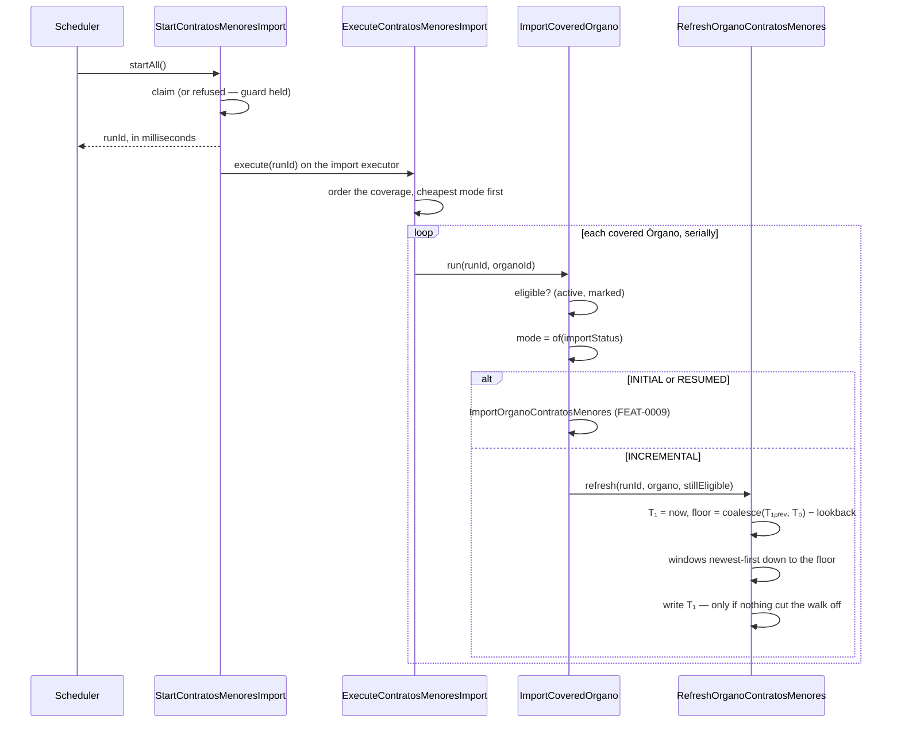
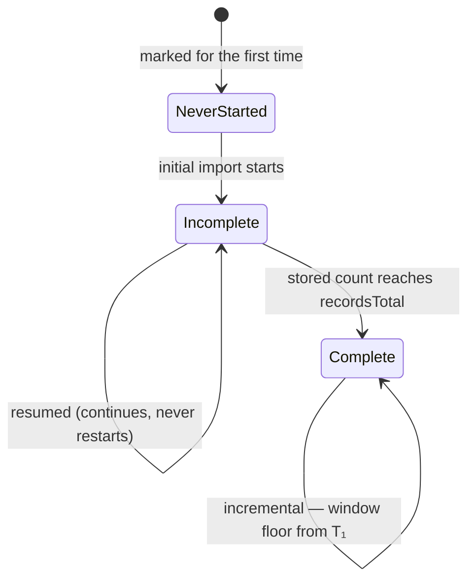

# FEAT-0014. Contratos menores: the incremental refresh and its scheduler

## Goal
Keep a loaded Órgano's **contratos menores** current without reloading its history, and make every
import happen **without an administrator asking for it**. This is the refresh slice of
**[SPEC-0005](../../specs/SPEC-0005-import-browse-contratos-menores.md)**, and the feature
[FEAT-0009](../FEAT-0009-contratos-menores-initial-import/README.md) named as *the next one* when it
shipped the load with its incremental branch deliberately unimplemented.

It delivers the **incremental** mode of R8 and its **window floor**; **R21**'s recurring run whole;
the **automatic** half of R9 that FEAT-0009 could not build without a scheduler; the *next scheduled
run* halves of R4 and R22 that make a refused mark a delay rather than a loss; the incremental
clause of R20 that a manual sweep of a loaded catalogue has been unable to honour; and the
**prioritisation R22 explicitly left to a feature**, which is this one because this is where several
imports being due at once stops being an edge case.

**Everything it needs already exists, and that is why it is small.** FEAT-0009 built the per-Órgano
three-state fact, the T₀ instant a window floor measures from, the run record, the system-wide
guard, the source adapter and the batch upsert — and left exactly one branch of the mode rule
returning a value nothing acts on. This feature implements that branch, adds the second instant it
measures from, and puts a cron in front of the trigger that already exists.

**No new architectural decision is taken, and none is needed.** The run state stays where
**[ADR-0017](../../architecture/0017-import-run-state-in-postgresql.md)** put it, the scheduler
follows the shape FEAT-0006 set for the catalogue import — while declining its executor, because
this one hands its work off in milliseconds and
**[ADR-0011](../../architecture/0011-blocking-io-virtual-threads.md)** governs request handling
rather than scheduled ticks — the source is reached through the client **[ADR-0014](../../architecture/0014-resilient-throttled-outbound-http-client.md)**
already paces, and the one schema change is a nullable column on a table this feature owns. A
feature that adds a column and a cron does not earn an ADR. The remaining citations are narrow and
named where they bite: **[ADR-0008](../../architecture/0008-domain-entities-carry-persistence-mapping-annotations.md)**
for the column on an aggregate that maps its own table,
**[ADR-0010](../../architecture/0010-design-first-openapi-contract.md)** because task 4 corrects a
description in the authored contract, and
**[ADR-0004](../../architecture/0004-ui-stack-vite-mantine.md)** /
**[ADR-0015](../../architecture/0015-frontend-feature-based-shared-core-modularization.md)** for
task 7's copy edit inside the admin Órganos slice.

## Scope
- **Domain (the refresh floor):** a second durable instant on the per-Órgano import state —
  **T₁**, how far that Órgano has been *refreshed* through — written only by a clean incremental
  run, and the rule that derives an incremental window's floor from it.
- **Domain (the walk):** `RefreshOrganoContratosMenores`, a **bounded** newest-first walk over the
  period since the floor, and the **lookback margin** R8 requires it to add for corrections.
- **Domain (the mode rule):** `ImportCoveredOrgano`'s `INCREMENTAL` branch stops skipping and
  walks, which is the single change that makes every trigger in the system — a mark, an
  administrator's button, the scheduler below — refresh a loaded Órgano.
- **Domain (the sweep's order):** `ExecuteContratosMenoresImport` takes the cheap Órganos first, so
  a catalogue's freshness is never hostage to one Órgano's multi-day load. This is R22's delegated
  decision, discharged rather than inherited.
- **Application (driving):** a `ContratosMenoresImportScheduler` firing the existing
  `StartContratosMenoresImport.startAll()` on a configured cron, treating a refusal as an ordinary
  outcome rather than a fault.
- **Infrastructure:** one migration adding the column, and the repository write for it.
- **Contract and UI:** the prose this feature **falsifies**. `docs/api/openapi.yaml` describes
  `SKIPPED` as *"there is no incremental mode to run yet"*; the admin area tells an administrator
  that nothing retries a refused import, that loaded Órganos *"non se actualizan sós"*, and that a
  failed run has to be triggered again by hand. All of it stops being true the day this ships, and
  none of it is optional to fix: the contract is lint-gated and the copy is what an administrator
  reads instead of the requirement.

**Out of scope (owned elsewhere):**
- **The historical re-read (R10) and contract removal/restore (R13)** stay with the curation
  feature FEAT-0009 named. The re-read is the only route to a correction older than this feature's
  window, and this feature does not narrow that gap — it defines the window whose far side the
  re-read exists to reach.
- **The import-run monitoring surface** — [SPEC-0007](../../specs/SPEC-0007-monitor-import-runs.md)'s
  run list, its filters, live progress and retention. This feature adds **no column to the run
  record**, on FEAT-0009's own rule that nothing there is justified by *SPEC-0007 will want it*.
  In particular it does **not** record that a run was triggered by the scheduler: SPEC-0005 asks
  nothing of the sort, SPEC-0007 R2 does, and the column lands with the requirement that needs it.
- **A per-Órgano *last refreshed* read**, and the *última actualización* caption an administrator
  would like beside the badge. It needs an endpoint no feature offers — the same gap FEAT-0009 and
  FEAT-0007 both recorded — and SPEC-0007 R15 is where Órgano-side import facts are surfaced.
- **Browsing.** Nothing here changes what a reader sees except that they see it sooner; the rows
  this feature refreshes are read by [FEAT-0011](../FEAT-0011-contratos-menores-browsing/README.md)
  exactly as the rows FEAT-0009 stored are.

## Design

### What is already built, and what this adds

| Mechanism | Built by | This feature |
| --- | --- | --- |
| Three-state per-Órgano fact (`NEVER_STARTED` / `INCOMPLETE` / `COMPLETE`) | FEAT-0009 | unchanged, and a refresh never moves it |
| `ContratosMenoresImportMode.of(status)` — the one mode rule | FEAT-0009 | unchanged |
| `INCREMENTAL` acted on | — | **this feature** |
| T₀ (`coveredThrough`), stamped once, never rewritten | FEAT-0009 | unchanged, and still never rewritten |
| T₁ (`refreshedThrough`), the incremental floor | — | **this feature** |
| The page loop: two guard asks, the batch store, the run advance, the eligibility ask | FEAT-0009 | **extracted, shared, unchanged in behaviour** |
| The **cursor** write inside that loop | FEAT-0009 | **stays with the initial walk alone** |
| Claim / guard / run record / per-Órgano coverage | FEAT-0009 | unchanged |
| The order a sweep takes its Órganos in | — | **this feature** (R22's delegation) |
| `startAll()` over every eligible Órgano | FEAT-0009 | unchanged — the scheduler calls it |
| A recurring trigger | — | **this feature** |

### The floor is a second instant, not a rewritten one

R8 requires an incremental window to cover **at least the period since that Órgano's last
successful import**. The obvious implementation — move `coveredThrough` forward after every
refresh — is the one thing FEAT-0009 built its repository port to make impossible, and it was right
to.

T₀ is *when the initial import's first window was taken*, and it has to survive every resumption of
that import unchanged; a port carrying an update for it is a port on which an off-by-one can be
written, and the symptom of that off-by-one is publications that fall outside every future window
and are reachable only by a historical re-read nobody runs. So this feature adds a **second,
nullable instant** rather than a setter for the first:

```
incremental floor = coalesce(refreshedThrough, coveredThrough) − lookback
```

- **`refreshedThrough` is null until the Órgano's first clean incremental run**, and the fallback
  to T₀ is what makes the very first refresh after an initial import cover everything published
  while that import was walking. An initial import of SERGAS runs for days; without the fallback
  those days would be a hole.
- **The two columns say different things and both are worth keeping.** T₀ is *the history below
  this instant is loaded*; T₁ is *nothing published before this instant is missing*. An Órgano
  loaded once and refreshed nightly for a year carries both, and only the pair explains what it
  holds.
- **The rule answers an `Instant`, and the walk converts it.** Turning it into a window boundary
  needs the day the source publishes in, and `Europe/Madrid` lives today as a private constant
  inside `ImportOrganoContratosMenores`. The floor rule is not given a second copy of it: it
  answers the instant, and each walk turns instants into dates in the one place that already knows
  how. A zone constant duplicated across two packages is one that eventually disagrees with itself.

### T₁ is stamped when a refresh starts, not when it finishes

The same reasoning that fixed T₀, applied to a much shorter walk. A refresh reads the source while
publications keep arriving; if T₁ were the moment the walk *ended*, everything published between
the last window's end and that moment would sit below the next run's floor and be read by nothing.
Stamping the instant the Órgano's refresh **begins** makes consecutive runs overlap by exactly the
duration of one refresh, which costs a re-read that R11 and R12 make a no-op.

**And it is written only when the walk finishes cleanly.** A refresh cut off by a source failure,
by an unmark, by the guard going or by the process dying leaves T₁ where it was, so the next run
re-reads the same period from the same floor.

**That is why an incremental walk needs no cursor, and deliberately has none.** FEAT-0009's cursor
exists because an initial import is a multi-day walk whose restart costs days at one request per
second; an incremental walk is a handful of windows whose restart costs seconds. Adding a second
resumption mechanism to save those seconds would be complexity bought with nothing, and it would
put a second writer on `cursor_date`, whose single-writer discipline is what makes resumption of an
interrupted *initial* import correct.



### A refresh has its own ending, because it has nothing to say about the three-state fact

`ContratosMenoresImportSummary` answers a `ContratosMenoresImportStatus`, and every value of it is
a statement about an **initial** import: `COMPLETE` means *the stored count reached the source's
own*, and `INCOMPLETE` means *resume this later*. A refresh can say neither. It leaves the Órgano
exactly as `COMPLETE` as it found it, and it never converges a count because it never reads a whole
history.

Two ways of forcing it into that type were considered and both are wrong. Answering `complete(...)`
works by accident and asserts something false. Answering anything else routes through
`ImportCoveredOrgano.endedOnItsOwnTerms`, which maps every non-`COMPLETE` clean ending to
`reachedTheHistoryFloor()` — so **every successful nightly refresh would store, and serve over
`GET /api/admin/import-run/{id}`, the sentence "Read every window down to the configured history
floor without the stored count matching the source's"**. The summary's constructor also forces a
stopped walk to `INCOMPLETE`, which of a loaded Órgano is simply untrue.

So the refresh answers **its own record: what it added, what it refreshed, and what cut it off if
anything did** — and no status at all, because the status is not a refresh's to move. Three
consequences follow, and they are the whole of the change:

- **`StopReason` is promoted out of `ContratosMenoresImportSummary`** into a type of its own in the
  same package. Being cut off by an unmark or by the guard going is a property of *any* walk, and
  it is what the shared page loop answers; nesting it inside one walk's summary was right when
  there was one walk.
- **`ImportCoveredOrgano` gains one settlement** — a clean refresh is `SUCCEEDED` with **no
  reason**, the only other ending that has nothing left to explain. Its existing
  `unmarkedMidWalk()` already reads correctly for a refresh, and the guard-lost case already
  answers `Optional.empty()`; neither needs a variant.
- **`reachedTheHistoryFloor()` keeps its single caller**, the initial walk, which is the only one
  that can reach a floor.

### The walk, and the middle the two walks share

An incremental walk differs from an initial one at both ends and nowhere in between. It starts at
today rather than at a cursor; it ends when it reaches a **date floor** rather than when the stored
count reaches the source's `recordsTotal`; and it settles T₁ rather than the `COMPLETE` status.
Between those two ends the two do the identical thing: fetch a page inside an 89-day window, store
the batch, advance the run, and ask two questions in a very specific order.

That order is not incidental. FEAT-0009's page loop asks the guard **twice** — once before
fetching, and once *after* the batch commits and *before* the progress write, because the progress
write renews the run's own last-advanced stamp and a walk that asked only before would be reading a
liveness it had just written itself — and asks eligibility **once, at the very bottom**, so a
withdrawn mark cannot leave a batch's contracts committed while its counts are not. It is written
down at length in that class because it is easy to get wrong.

**So the page loop is extracted and shared rather than written twice.** A second copy of it is the
likeliest way this feature introduces a defect in the *first* import, and the extraction is a
behaviour-preserving refactor with its own task and the existing tests as its safety net. The
alternative — one class taking a start point and an ending predicate — was rejected: the two walks
differ in what they *do* at each end, not only in where the ends are, and a class holding both
endings would carry the `recordsTotal` test and the date floor together while only ever using one.

**What the extraction may not take is the cursor write.** `recordProgress` today is two writes —
`updateCursorDate` and `importRuns.advance` — and only the second is shared. Moving both would hand
`cursor_date` a second writer, which is exactly what the previous section forbids. So the shared
reader owns the two guard asks, the fetch, the batch store, `importRuns.advance`, the eligibility
ask and the try/catch that keeps a bookkeeping failure from breaking the import; and it takes **one
caller-supplied hook, invoked immediately before the advance**, for whatever else that walk records
per batch. The initial walk's hook is the cursor write. The refresh's records nothing, and passing
an empty hook is the honest expression of that rather than a smell: a refresh keeps no resumption
state, which is R8's consequence and not an omission.

### The lookback margin, and what it really costs

R8 requires the window to cover the period since the last successful import **plus a lookback
margin for corrections**, because the source offers no *changed since* facility and a correction is
discoverable only by re-reading the period it falls in.

`conxugal.contratos-menores.import.lookback`, **default 30 days**. It is configuration on
FEAT-0009's own rule for that table: the **source's measured limits** — the three-month window, the
hundred-row page — are not configurable, because they are facts about the source rather than
guesses; the **educated guesses about it** — the 2018 history floor, and now this — are, because
they are the numbers a measurement would move. Nothing has measured how long after publication the
source rectifies an entry, and 30 days is chosen to be comfortably longer than a plausible
administrative correction cycle.

**Its cost is a re-read, and the re-read is not free.** In windows the margin is nearly invisible —
a 31-day period still fits in one 89-day window for almost every Órgano. In rows it is the last
month of **every marked Órgano, re-fetched and re-upserted every night, for ever**. For the largest
publisher that is the real figure worth knowing: SERGAS's ~1.4 million contracts over roughly seven
years average on the order of 17 000 a month, so its nightly refresh is on the order of 170 pages
fetched and 17 000 rows upserted — every one of them an update that changes nothing. That is
affordable and it is not nothing, and it is the number to revisit first if the nightly sweep ever
becomes a problem.

What the margin does **not** do is reach a correction older than itself. That is R10's job, it is
unbuilt, and this feature does not pretend otherwise: widening the lookback to cover a year would
multiply the figure above by twelve, which is the cost the historical re-read exists to keep off
the schedule.

### The sweep's order: cheap work first

R22 ends by leaving prioritisation to a feature — *"Prioritising which import runs first when
several are due is left to the feature; this requirement fixes only that they do not overlap."*
This is the feature where several are routinely due, so this is where it is decided.

Left alone, `claimAll()` enumerates every eligible Órgano — `NEVER_STARTED` ones included — and
`ExecuteContratosMenoresImport` walks them in whatever order the catalogue read returned. One
Órgano marked while the guard was held lands in the next sweep as an **initial** import, and if it
sits near the front of that list it holds the whole sweep for days while every other Órgano's
refresh waits behind it and every subsequent nightly tick is refused by the guard. Nothing is lost
— the floor absorbs it — but a catalogue's freshness would be hostage to the position of one row.

So **the coverage is ordered by mode at the start of the run: incremental first, then resumed, then
initial.** A nightly sweep therefore always finishes its cheap work, and a multi-day load runs
after it rather than in front of it.

- It is **re-derived once, when the run starts to execute**, from the per-Órgano state the mode rule
  already reads — not stored on the run. That keeps FEAT-0009's *no column on the run record*
  rule intact, and it is stable: the only mode change a run can produce is its own
  `INCOMPLETE → COMPLETE`, and the guard means nothing else is moving.
- It is **not a queue and not a priority scheme.** Every covered Órgano is still walked, still
  serially, still exactly once; only the order changes. R22's serialisation and reportability are
  untouched.

### The scheduler

One class, following `ImportOrganosScheduler`:

```java
@Scheduled(cron = "${conxugal.contratos-menores.import.schedule}", zoneId = "Europe/Madrid")
```

- **It calls `startAll()` and nothing else.** Every decision it could make has already been made
  somewhere better: which Órganos are eligible is `ClaimContratosMenoresImport`'s, which mode each
  takes is the per-Órgano state's, the order they are taken in is the section above, and whether an
  import may start at all is the guard's. A scheduler that filtered, ordered or chose modes would be
  a fourth trigger able to disagree with the other three, which is the defect FEAT-0009 centralised
  the rule to prevent.
- **A refusal is logged, not thrown.** `ImportAlreadyRunningException` reaching Micronaut's
  scheduled-task handler would be an error report for the system working exactly as R22 says it
  must.
- **It takes Micronaut's default `scheduled` executor, and declares none of its own.** FEAT-0006
  needed one because `ImportOrganosScheduler.run()` calls the catalogue import **synchronously** and
  holds its thread for the whole run. That reason does not carry here: `startAll()` claims and hands
  the walk to the `contratos-menores-import` executor FEAT-0009 already built for it, so the
  scheduler's own thread is occupied for milliseconds. It must not reuse `contratos-menores-import`
  — that is a `fixed` pool, and `@Scheduled` needs a `TaskScheduler` — but *not that one* is not an
  argument for *a new one*, and `CLAUDE.md` says to prefer the framework's default over custom
  wiring.
- **`0 0 5 * * *`** — daily, and **after** FEAT-0006's 03:00 catalogue import rather than beside
  it. Both would be safe under the guard, but one of two triggers firing at the same instant always
  loses, and losing nightly is not a schedule. Running after the catalogue means the day's
  deactivations are already applied, so an Órgano that stopped being published is not imported one
  last time.

**What a nightly sweep costs the source.** A loaded Órgano's refresh is one 89-day window covering
a ~31-day period, and the page loop stops as soon as the source returns a short page — so a quiet
Órgano costs a **single** request, and only one publishing more than a hundred contracts a month
costs more. Four hundred marked Órganos are therefore a few hundred requests, which at ADR-0014's
ceiling of one per second is on the order of **ten minutes** of traffic once a day, plus whatever
the handful of large publishers add. That is the figure that makes daily the right interval and
hourly indefensible, and it is why R25 needs nothing new here: the pace is the client's, and this
feature adds no second one.

### Automatic resumption comes free, and that is the point

R9 requires an interrupted initial import to be **resumed to completion automatically**, and
FEAT-0009 could only build the on-demand half. Nothing in this feature is aimed at it: `startAll()`
already covers every marked, active Órgano, and the mode rule already answers `RESUMED` for one
whose initial import is incomplete. The moment a recurring trigger exists, an Órgano left
half-loaded by a crash is picked up on the next tick without anybody noticing it was left.

The same mechanism recovers a **refused mark** (#33) and a **refused trigger**: R22 refuses rather
than queues, and R21's sweep is what makes that affordable — *the schedule is the queue*, as R22
puts it. Both are consequences of the scheduler covering everything marked, and neither needs code
of its own.

### The mode rule, after



The only edit is the last transition, and three things go with it: `ImportCoveredOrgano`'s
`alreadyLoaded()` settlement disappears, `ContratosMenoresImportMode`'s javadoc stops saying that
`INCREMENTAL` is implemented nowhere, and the `ImportRunOrgano` description in
[`docs/api/openapi.yaml`](../../api/openapi.yaml) stops telling clients that an Órgano is *"skipped
when its history is already complete and there is no incremental mode to run yet"*. The contract is
lint-gated, so that last one is not documentation housekeeping — it is part of the change.

**`ImportRunOrganoState.SKIPPED` loses its only producer and is kept anyway.** Rows written before
this feature still carry it, and an enum value removed is a stored row that no longer reads. Its
javadoc and the contract description both become historical rather than current.

## Sequencing (tasks, one small change each)

1. **The refresh floor on the per-Órgano import state** *(backend)*: a migration adding a nullable
   `refreshed_through` to `contrato_menor_import_state`, the field on
   `ContratosMenoresImportState`, an `updateRefreshedThrough` write on its repository port — beside
   the still-absent write for T₀ — and the `incrementalFloor(lookback)` rule, answering an
   `Instant` and borrowing no zone. *(SPEC-0005 #45 floor half)*
2. **Extract the shared window read** *(backend)*: the page loop — both guard asks in their
   documented order, the batch store, `importRuns.advance`, the eligibility ask and the try/catch
   around the bookkeeping — moves out of `ImportOrganoContratosMenores` into a collaborator both
   walks use, taking one per-batch hook so the **cursor write stays with the initial walk alone**.
   `StopReason` is promoted out of `ContratosMenoresImportSummary` in the same pass. That class
   keeps its start point, its step and its `recordsTotal` ending. Behaviour-preserving; the existing
   tests are the safety net. *(No new criterion — it must leave SPEC-0005 #14, #17 and #32 exactly
   as they were.)*
3. **The incremental walk** *(backend)*: `RefreshOrganoContratosMenores` — T₁ stamped at the start,
   the floor read from task 1, newest-first 89-day windows down to it, and T₁ written only when
   nothing cut the walk off — its own summary record carrying no status, and the `lookback`
   property on `ContratosMenoresImportConfiguration`. Reaches the source through the shared
   `contratosdegalicia` client, so the new mode inherits ADR-0014's pace rather than choosing one.
   *Depends on tasks 1 and 2.* *(SPEC-0005 #13 window half, #45 walk half, #38 incremental mode)*
4. **The incremental branch in the mode rule** *(backend)*: `ImportCoveredOrgano` walks an
   already-loaded Órgano instead of skipping it, with the clean-refresh settlement that ends
   `SUCCEEDED` and states no reason; `alreadyLoaded()`, the two javadocs promising `INCREMENTAL`
   does nothing, and the `ImportRunOrgano` description in `openapi.yaml` go with it. This is what
   makes a manual sweep and a re-mark refresh, before any scheduler exists. *Depends on task 3.*
   *(SPEC-0005 #29 incremental clause, #44, #47 incremental half)*
5. **The sweep's order** *(backend)*: `ExecuteContratosMenoresImport` orders the coverage it reads
   back by each Órgano's current mode — incremental, then resumed, then initial — derived once as
   the run starts and stored nowhere. Serial walking, per-Órgano reporting and the covered list
   itself are untouched. *Depends on task 4.* *(No spec criterion — it discharges the prioritisation
   SPEC-0005 R22 leaves to a feature.)*
6. **The scheduler** *(backend)*: `ContratosMenoresImportScheduler` on Micronaut's default
   `scheduled` executor, the `conxugal.contratos-menores.import.schedule` cron defaulting to
   `0 0 5 * * *`, and a refused claim logged rather than raised — with the integration tests that
   only exist once it fires: a scheduled run refused while a long import holds the guard, and the
   next tick claiming once it frees. *Depends on task 4* — without the incremental branch a sweep
   would skip every loaded Órgano; task 5's ordering is a freshness optimisation the scheduler works
   without, so the two can land in parallel. *(SPEC-0005 #31, #13 scheduled half, #5
   next-scheduled-run half, #33 next-scheduled-run half, #14 automatic half, #35)*
7. **The admin copy the scheduler makes true** *(frontend)*: five strings in
   `ui/src/shared/lib/strings.ts` are the opposite of what ships in task 6 — the run banner's
   `succeededNote` (*"Ata que exista o refresco periódico, estes órganos non se actualizan sós"*),
   the mark dialog's `guardNote` (*"Mentres non exista o refresco periódico, ningún proceso a
   retoma"*), and the `imported` badge tooltip's history frozen at the moment of import — with
   `failedNote` and `abandonedNote`, which both tell an administrator to trigger it again by hand,
   corrected in the same pass. *Depends on task 6.* *(No spec criterion; `ui/CLAUDE.md`'s i18n seam
   puts the copy in this file, and a requirement contradicted by the interface that reports it is
   not met in practice.)*

**Criteria this feature deliberately leaves incomplete:**

- **#38's historical re-read mode** waits on the curation feature; task 3 closes the incremental
  mode of the same criterion.
- **#15, #18 and #1's re-read and remove/restore clauses** are the curation feature's throughout.
  This feature does not touch them, and #53's only route out stays unbuilt with R10.
- **#32's *recorded as a refused run* half** remains [SPEC-0007](../../specs/SPEC-0007-monitor-import-runs.md)
  R4's. The scheduler's refusals are logged, not recorded, exactly as an administrator's are today
  — this feature adds refusals without adding a record for them, which is worth stating because it
  multiplies how many there are.
- **#14's progress-visibility half** is SPEC-0007 R5's, unchanged.

> **Four criteria FEAT-0009 deferred to nobody.** Its own list names #5, #14, #29, #33, #38 and #44
> as waiting on this feature; **#13, #31, #35 and #45** were left off it while being just as
> unbuildable without a scheduler. They are picked up here, and the omission is recorded rather than
> quietly closed so that a reader auditing FEAT-0009's list can see why it was short.

## Edge cases
- **An Órgano refreshed for the first time after its initial import** — `refreshedThrough` is null,
  so the floor falls back to T₀ and the window covers everything published while that import was
  walking. For a large Órgano that is days of publications, and it is the case the fallback exists
  for. *(SPEC-0005 #45)*
- **A refresh interrupted by a source failure** — that Órgano is recorded `FAILED`, T₁ is not
  written, and the next run re-reads the same period from the same floor. The run carries on to the
  Órganos after it. *(SPEC-0005 #36, #45)*
- **A refresh interrupted by an unmark** — stopped at a batch boundary, T₁ not written, everything
  read already stored, and the Órgano still `COMPLETE` because a refresh never moves that fact. A
  later re-mark refreshes from the unchanged floor, so the period it was cut off in is covered.
  *(SPEC-0005 #8, #44)*
- **A refresh whose run stops holding the guard** — the walk stops and writes nothing at all, T₁
  included; the run's record belongs to whoever claimed after it. Identical to FEAT-0009's
  handling, because it is the same shared page loop asking. *(SPEC-0005 #32)*
- **An Órgano marked, unmarked while *complete*, and marked again** — refreshed from T₁, not
  reloaded: it picks up everything published while it was unmarked and re-reads none of the history
  it holds. Contrast the Órgano unmarked while **incomplete**, which is resumed — the two differ
  only in whether the initial import had finished, which is the fact the three-state model exists
  to keep. *(SPEC-0005 #44, #46)*
- **The scheduler firing while any import runs** — including SPEC-0004's catalogue import — is
  refused by the guard, logged, and neither queued nor retried within that tick. The next tick
  claims. *(SPEC-0005 #32, #35)*
- **The scheduler down, or locked out, for a month** — the floor is T₁ from the last clean refresh,
  so the run that finally happens covers the entire gap in as many 89-day windows as it takes.
  Waiting costs freshness, never data, which is the property R8's floor exists to give R22.
  *(SPEC-0005 #35, #45)*
- **A half-loaded Órgano when the scheduler fires** — resumed, never treated as up to date, with no
  administrator involved. Free from the mode rule; it is the whole of R9's automatic half.
  *(SPEC-0005 #13, #14)*
- **A newly marked Órgano sharing a sweep with four hundred loaded ones** — the loaded ones refresh
  first and the multi-day load runs last, so a single mark cannot cost the catalogue its freshness.
  Both are still covered by the one run, and both still appear in its per-Órgano outcomes.
  *(SPEC-0005 R22's delegated prioritisation)*
- **An Órgano permanently `INCOMPLETE` because its initial walk reached the 2018 history floor
  without its count converging** — it is resumed on **every** scheduled run, for ever, and never
  becomes eligible for a refresh. FEAT-0009's walk makes that resumption nearly free — a cursor
  left *at* the floor asks the source for nothing, so the run is a no-op and a warning — and the
  new ordering puts it last. But the consequence is real and is recorded rather than fixed: **such
  an Órgano is never refreshed again**, so its new publications are reached by nothing this feature
  builds. No Órgano has been observed reaching the floor, the log line names any that does, and the
  answer is chosen against a real one rather than guessed at now. *(No spec criterion; SPEC-0005 R8
  assumes a walk converges.)*
- **A sweep of a fully loaded catalogue** — every covered Órgano refreshes, nothing fails, and the
  run settles `SUCCEEDED` having added almost nothing. That is the ordinary nightly outcome, and it
  reads as a success rather than as a run that did nothing because the verdict is read off what
  failed. *(SPEC-0005 #31)*
- **A run row written before this feature carrying `SKIPPED`** — still read, still rendered, still
  described by the contract; the state keeps its meaning as history even though nothing produces it
  any more.
- **A correction published outside the lookback** — not picked up, by design, and reachable only by
  R10's historical re-read. The window is what makes R11's refresh achievable at all; its far side
  is what the curation feature is for. *(SPEC-0005 #15, unowned here)*
- **The clock crossing a DST boundary between two runs** — the floor is an instant and the windows
  are dates converted in `Europe/Madrid` by the walk that owns that conversion. An hour either way
  is absorbed by the lookback, which is thirty days wide. *(SPEC-0005 #45)*
