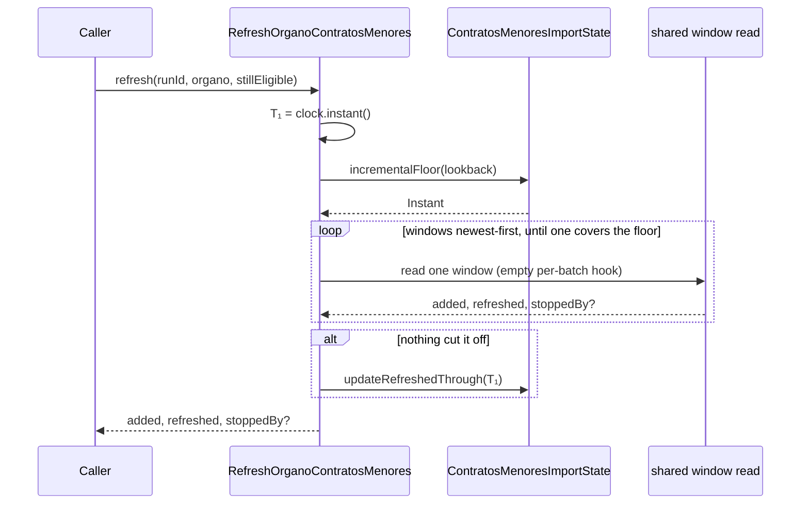

# The incremental walk

`RefreshOrganoContratosMenores`: one loaded Órgano's recent window, read newest-first down to the
floor [TASK-0001](TASK-0001-refresh-floor-on-import-state.md) computes, over the page loop
[TASK-0002](TASK-0002-extract-the-shared-window-read.md) extracted. Nothing calls it yet —
[TASK-0004](TASK-0004-incremental-branch-in-the-mode-rule.md) is what routes an Órgano here.

It reaches the source through the shared `contratosdegalicia` client, so the new mode inherits
[ADR-0014](../../architecture/0014-resilient-throttled-outbound-http-client.md)'s pace rather than
choosing one: this task adds no second pacing mechanism and no retry policy of its own.

## Scope

- **`lookback` on `ContratosMenoresImportConfiguration`** —
  `conxugal.contratos-menores.import.lookback`, a `Duration` defaulting to **30 days**. It is
  configuration on that class's own rule: the source's *measured limits* (the three-month window,
  the hundred-row page) are not configurable because they are facts about the source; the *educated
  guesses about it* — the 2018 history floor, and now this — are, because they are the numbers a
  measurement would move. Nothing has measured how long after publication the source rectifies an
  entry; 30 days is chosen to be comfortably longer than a plausible administrative correction
  cycle. R8 requires the margin because the source offers no *changed since* facility, so a
  correction is discoverable only by re-reading the period it falls in.

  **A negative or zero lookback is refused where the property binds**, in the record's compact
  constructor, the way `ContratosDeGaliciaResilienceConfiguration` refuses every `Duration` bound
  it takes. `incrementalFloor` subtracts whatever it is given, so a negative margin moves the floor
  *ahead* of T₁ and everything published in between falls below every future floor — the silent
  hole the second instant exists to prevent, arriving through a typo in a config file. Refusing it
  at the binding boundary fails the application at startup rather than at the first nightly sweep,
  which is why the check belongs here and not in the rule.
- **T₁ is stamped when the refresh starts, not when it finishes.** `clock.instant()` is read before
  the first window and held; a refresh reads the source while publications keep arriving, so an
  instant taken at the *end* would put everything published mid-walk below the next run's floor and
  in reach of nothing. Stamping the start makes consecutive runs overlap by exactly the duration of
  one refresh, which costs a re-read that SPEC-0005 R11 and R12 make a no-op.
- **The walk**: floor from `state.incrementalFloor(lookback)`, converted to a `LocalDate` in
  `Europe/Madrid`, then windows of `WINDOW_DAYS` ending at today, stepping back until one covers the
  floor. For almost every Órgano that is a single window.

  **The floor is clamped to today**, which the first draft of this task did not say and a review
  caught. A stored T₁ ahead of the reading node's clock by more than the lookback — skew between two
  nodes, or a lookback configured down to minutes — otherwise puts the floor past today and has the
  first window asked for with its start after its end. The source answers a window it cannot parse
  with a bare `500`, so the Órgano is recorded `FAILED` for what reads as an outage. Clamped, the
  same skew costs one day-wide window.
- **The zone is shared, not copied.** `SOURCE_ZONE` is `private static final` inside
  `ImportOrganoContratosMenores` today; it becomes package-private so both walks read the one
  constant. [TASK-0001](TASK-0001-refresh-floor-on-import-state.md) keeps the floor rule free of a
  zone precisely so that no second copy exists to disagree with the first, and answering the floor
  as an `Instant` would buy nothing if this class then declared `Europe/Madrid` again. `WINDOW_DAYS`
  is read from the same place, for the same reason.

  **Corrected while implementing:** both constants went to `ReadContratosMenoresWindow` beside
  `PAGE_SIZE` rather than staying on the initial walk. Widening them in place would have given the
  refresh a compile-time dependency on a sibling use case it never calls, and both are measured
  limits of the source — the category [TASK-0002](TASK-0002-extract-the-shared-window-read.md)
  already moved `PAGE_SIZE` there for. `WINDOW_DAYS`' own *"the step of a walk, not a property of
  one window"* justification stopped holding the moment there were two walks stepping by it.
- **T₁ is written only when the walk finishes cleanly** — `updateRefreshedThrough` after the last
  window, and never after a walk a source failure, an unmark or the guard going cut off. Those
  leave T₁ where it was, so the next run re-reads the same period from the same floor. **The write
  is not best-effort**: it follows the `COMPLETE` mark's precedent rather than the cursor's, so a
  failure propagates and the Órgano is recorded `FAILED` by
  [TASK-0004](TASK-0004-incremental-branch-in-the-mode-rule.md). The next run then re-reads the same
  period, which costs one duplicated read and no data.
- **No cursor, deliberately.** FEAT-0009's cursor exists because an initial import is a multi-day
  walk whose restart costs days at one request per second; a refresh is a handful of windows whose
  restart costs seconds. Its per-batch hook into the shared reader is **empty**, which is the honest
  expression of a walk that keeps no resumption state, and it keeps `cursor_date` single-writer.
- **Its own record, carrying no status.** `ContratosMenoresImportSummary` answers a
  `ContratosMenoresImportStatus`, and every value of it is a statement about an *initial* import: a
  refresh leaves the Órgano exactly as `COMPLETE` as it found it and never converges a count,
  because it never reads a whole history. So the refresh answers **what it added, what it refreshed,
  and what cut it off if anything did** — and no status.
- **The three-state fact is not touched.** `updateState` is not called from here, on any path.

- **Where it is proven.** Unit tests for the window arithmetic and the T₁ rules; and, against
  PostgreSQL beside the existing `OrganoContratosMenoresImportIntegrationTest`, the durable
  properties — T₁ written on a clean walk and left alone on an interrupted one, the fallback to T₀,
  and a long gap covered in as many windows as it takes. [TASK-0006](TASK-0006-the-scheduler.md)
  relies on this: its own tests are database-free, and it delegates the gap-coverage proof here.

**Out of scope:** the mode rule's branch and the settlement that records this walk's ending
(TASK-0004); any historical re-read (SPEC-0005 R10, the curation feature's).

## Acceptance criteria

- A refresh of an Órgano whose initial import completed re-reads **only a recent window**, not the
  whole history, and a correction published inside that window is picked up.
  ([SPEC-0005](../../specs/SPEC-0005-import-browse-contratos-menores.md) #13 window half, #47
  incremental half)
- An Órgano with `refreshedThrough` null refreshes from `coveredThrough − lookback`, so everything
  published while its initial import was walking is covered. (SPEC-0005 #45)
- A clean refresh writes T₁ **once**, equal to the instant the walk **began** — not to the instant
  it ended, and not to any window boundary. (SPEC-0005 #45)
- A refresh cut off by a source failure, by an unmark or by the guard going leaves
  `refreshed_through` **unchanged**, and a second refresh reads the same period from the same floor.
  (SPEC-0005 #36, #8, #32, #45)
- A refresh leaves the Órgano's `state` at `COMPLETE` and its `cursor_date` untouched, whatever its
  ending. (SPEC-0005 #44, #46)
- Two refreshes in succession over unchanged publications yield the same stored set: no duplicates,
  no attribute changes. (SPEC-0005 #17)
- An Órgano whose last clean refresh was a **year** ago is covered in **one** refresh, by as many
  89-day windows as that year plus the lookback takes — the scheduler having been down, or a long
  import elsewhere having held the guard, costs freshness and never data. (SPEC-0005 #35, #45)
- The refresh's record carries no `ContratosMenoresImportStatus` — its type does not mention one.
  (`updateState` is never called on any path, which the `COMPLETE`-preserving criterion above is
  what actually proves: the class holds the state repository for `updateRefreshedThrough`, so its
  absence cannot be shown by dependencies.)
- `lookback` defaults to 30 days with no configuration present, and is overridable by
  `conxugal.contratos-menores.import.lookback`.
- A negative or zero `conxugal.contratos-menores.import.lookback` is refused at startup rather than
  producing a floor ahead of T₁. **This needs `@Context` on the configuration record**, which the
  first draft of this task did not say: Micronaut builds a configuration bean the first time
  something asks for it, and everything that asks for this one hangs off a trigger — so without
  eager creation an unusable value binds silently at boot and fails at the first nightly sweep,
  which is the outcome the refusal exists to prevent.
- A refresh whose floor would fall after today — a T₁ ahead of the clock by more than the lookback —
  asks the source for a single day-wide window rather than one whose start is after its end.
- The source is reached through the same `contratosdegalicia` client the initial import uses; this
  class configures no timeout, no retry and no rate limit. (SPEC-0005 #38 incremental mode)
