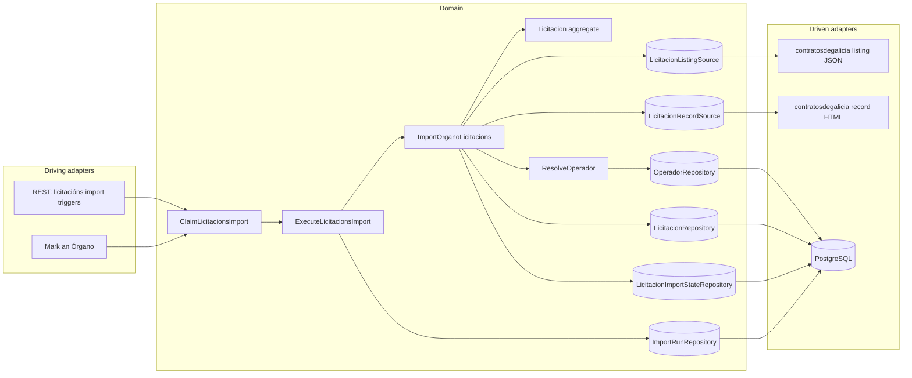
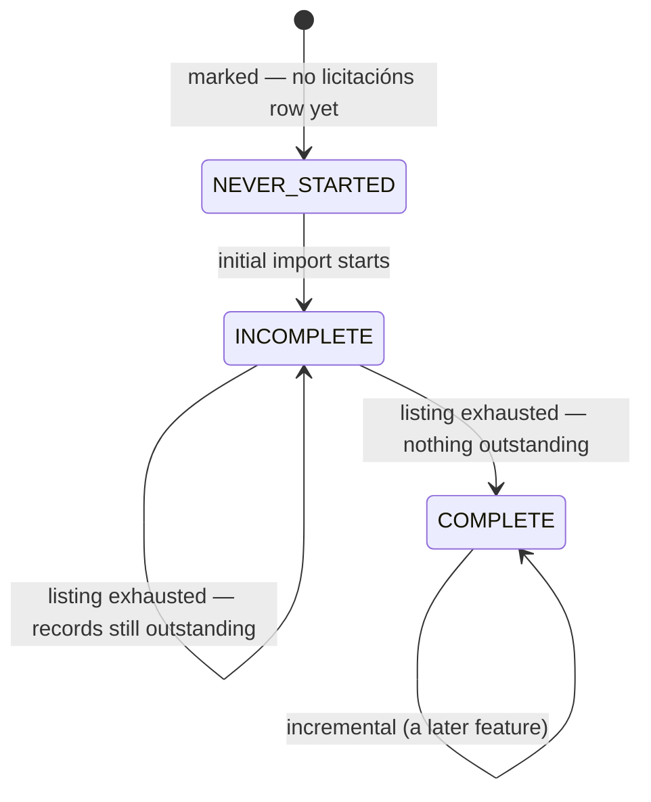
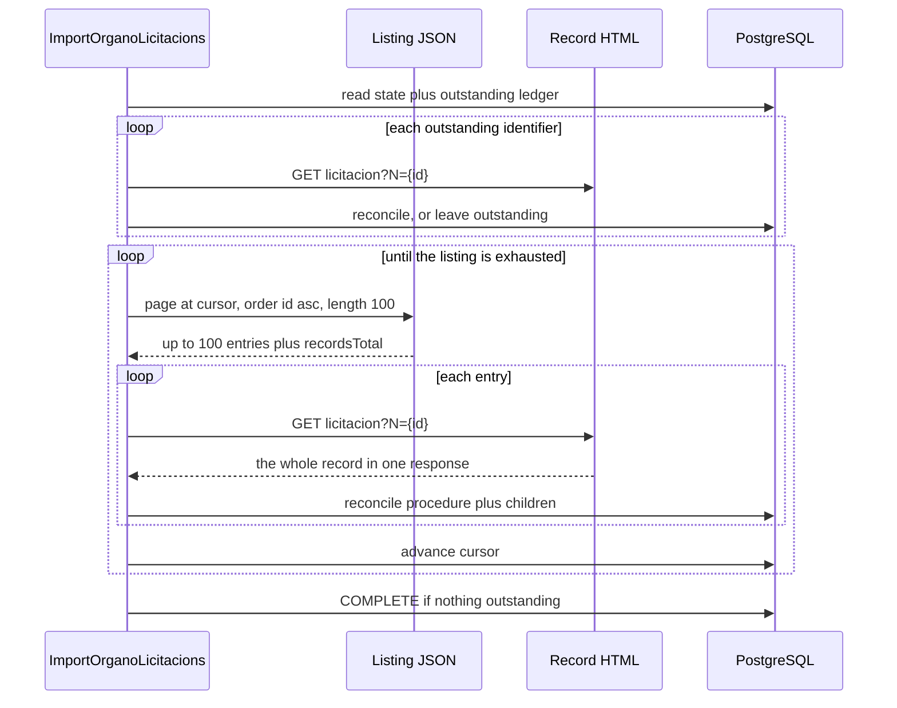
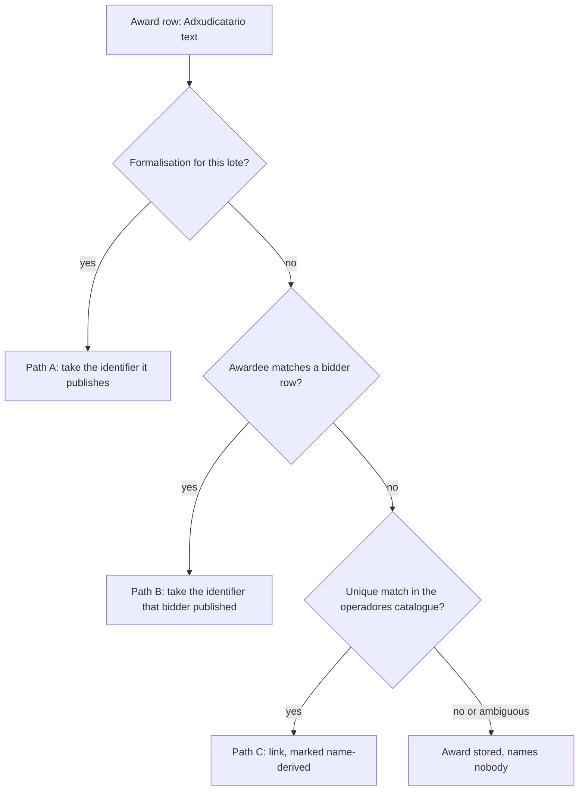

# FEAT-0015. Licitacións: the initial import and the stored procedure

## Goal

Make an Órgano's **licitacións** loadable: the system retrieves each marked Órgano's full
published tender history from contratosdegalicia.gal — the listing, and then **one record per
procedure** — and stores each procedure whole, with its lotes, classifications, bidders and
awards. This is the first buildable slice of
**[SPEC-0008](../../specs/SPEC-0008-import-browse-licitacions.md)**.

It delivers R3–R8 (R7 and R8 as *storage* obligations — every display obligation is the browsing
feature's); the **initial** and **resumed** modes of R9; the on-demand half of R10; R13's
reconciliation and R14's idempotence; the storage halves of R16, R17 and R18 — R17's **as amendment
1 restates it**, since the source identifies only 6% of consortia; R27's triggers, including the
mark that requests both families in order; R29's guard, **but not its yielding**; R30's two-level
failure isolation; and R33's as-published rule.

It exposes **no licitación read endpoint**. Nothing browses licitacións until the browsing feature
builds the family split, the year scoping, the CPV and state filters, the sort and the paging
control (R19–R26) over the rows stored here — the same order
[FEAT-0009](../FEAT-0009-contratos-menores-initial-import/README.md) and
[FEAT-0011](../FEAT-0011-contratos-menores-browsing/README.md) took for contratos menores. It puts
nothing new on screen either: the mark it rides on is already there, and R3 is satisfied by
**reusing** it rather than adding a second one.

**Far less is built here than FEAT-0009 had to build.** The system-wide guard, the run record, the
derived-abandoned read, the per-Órgano three-state fact, the mode rule, the throttled outbound
client, the operadores catalogue **and its derivation**, and **an ISO-8859-1 HTML parser against
this very source** all exist. What this feature adds is one more family behind that machinery, and
**one thing the machinery has never had to do: retrieve one page per stored record**. That single
property is what drives the cost, the resumption design and R29's deferral below.

The design sits in the hexagonal server of
**[ADR-0002](../../architecture/0002-hexagonal-architecture.md)**: the licitacións scraper is a
driven adapter behind a port, the REST endpoints are driving entry points, and the aggregate maps
to its tables under
**[ADR-0008](../../architecture/0008-domain-entities-carry-persistence-mapping-annotations.md)**
with typed identifiers under **[ADR-0019](../../architecture/0019-typed-aggregate-identifiers.md)**.
Retrieval is blocking I/O over virtual threads
(**[ADR-0011](../../architecture/0011-blocking-io-virtual-threads.md)**) through the resilient,
self-throttling client of
**[ADR-0014](../../architecture/0014-resilient-throttled-outbound-http-client.md)**, which is what
satisfies R31 without this feature choosing a rate. Durable run state follows
**[ADR-0017](../../architecture/0017-import-run-state-in-postgresql.md)**. REST lives under the
reserved `/api/` prefix (**[ADR-0006](../../architecture/0006-reserved-api-url-prefix.md)**), named
per **[ADR-0020](../../architecture/0020-actions-as-verbs-in-rest-paths.md)**, carries the
rate-limit contract of **[ADR-0012](../../architecture/0012-rate-limit-http-contract.md)**, is
authored contract-first (**[ADR-0010](../../architecture/0010-design-first-openapi-contract.md)**)
and guarded by session security
(**[ADR-0005](../../architecture/0005-session-based-authentication.md)**). Operadores are the
stored projection of **[ADR-0023](../../architecture/0023-operadores-as-a-stored-projection.md)**.

> **The source contract is measured, not assumed.** Every field, limit, size and frequency cited
> below was taken against the live site on **2026-08-20**, or on **2026-08-22** for the lote
> spellings, and is recorded in
> [`design/source-contract.md`](design/source-contract.md). **Seven** of those measurements
> correct SPEC-0008 or a sibling document:
>
> - the listing's `importe` is a **budget, not an award**;
> - **an award row publishes no fiscal identifier — the formalisation does**, which is what the
>   *Which operador an award belongs to* section is built on;
> - the listing **can** be ordered by last-modified date once the full DataTables payload is sent,
>   which
>   [FEAT-0009's contract](../FEAT-0009-contratos-menores-initial-import/design/source-contract.md)
>   concluded was impossible;
> - **a UTE's fiscal identifier is usually not published**, and a consortium is recognised by how
>   its entry is structured rather than by that identifier or its name;
> - **classification is not reliably per lote** even on a procedure that has them;
> - **lotes are 15 of 100 procedures** in a sample weighted to the large publishers, against the
>   4 of 100 the spec's own sample found — the spec now records both;
> - **a lote identifier is text, not a number** (`OU0028`, `LU4001`, `CO0642` were all observed),
>   and the four tables carrying a lote column do not spell one the same way — which is why the
>   join normalises before anything is compared.
>
> An eighth *confirms* rather than corrects: the two families **share one publication id space**,
> which is what keeps SPEC-0006 R4's tie-break total now that a second family feeds the catalogue.
>
> The ordering finding leaves a paragraph in FEAT-0009's own contract false — it still records
> that "ordering parameters were not made to work". Correcting it, and asking whether the full
> payload makes FEAT-0014's window walk cheaper, is a **follow-up this feature does not take**.

## The amendments this feature rests on

Four amendments were needed before any task here could be written against a criterion that says
what the design does. **All four have landed**, in the same change as this feature; they are
recorded below because each is load-bearing, and a reader of either spec should be able to see why
its wording changed.

| Amendment | Where | What it settles |
| --- | --- | --- |
| 1. The unidentified consortium | SPEC-0008 R16/R17/R18/R21, #20/#21/#22/#24; SPEC-0006 R3/R6/R8/R9/R16, #10/#17/#40/#41 | a UTE is an operador whether or not the source identifies it |
| 2. Classification not per lote | SPEC-0008 R8, #9/#10 | a CPV may hang off the procedure even where lotes exist |
| 3. The awardee resolved by name | SPEC-0008 R8/R18/R33, #46; SPEC-0006 R3 | the identifier is published by the formalisation, and derived for the minority without one |
| 4. Placeholders are unusable | SPEC-0006 R5, #8/#9 | a dash or `TEMP-…` is not an identity, defensively |

Each section below states the measurement the amendment rests on, so the evidence stays with the
reasoning rather than only in the spec's own summary.

### 1. SPEC-0008 R17 has to admit a UTE the source does not identify — and SPEC-0006 R16 with it

R17 requires a UTE to be stored "as an operador, identified by its **own published fiscal
identifier** under SPEC-0006 R3", and says such an identifier "begins with `U`". Measured over
**613 bidder rows in 250 procedures**, neither half holds:

| Consortium rows (nested `<ul>`) | 35 |
| --- | --- |
| carrying a real `U…` identifier | **2** |
| carrying `-` or empty | 25 |
| carrying a `TEMP-…` placeholder | 8 |
| published under a name **not** beginning `UTE` | **7** |

So a UTE does have a fiscal identifier of its own — `U88779475` and `U70551049` were both observed
— and the source publishes it for **6%** of them. R17's mechanism is right and unavailable.

**What identifies a UTE is the structure of the bidder cell**, not its identifier and not its name:
a consortium nests a second `<ul>` listing each member's own identifier and name. In 613 rows that
test was exact — never firing on a single-firm bidder, never missing a consortium — while the name
test would miss 7 of 35 and the `U`-prefix test would miss 33 of 35. This is not inference in the
sense SPEC-0006 R6 forbids: the markup **is** the publication, which is precisely what R17's own
"membership is published, not inferred" asks for.

**So a UTE is an operador whether or not the source identifies it**, and the amendment says how:

- **a UTE with a published fiscal identifier** is an operador under SPEC-0006 R3, exactly as R17
  says today — the 6% case, unchanged, and the **same** operador on every procedure naming it;
- **a UTE without one is an operador too**, catalogued under **the bid it made**: SPEC-0006 R3
  admits a second identity for exactly this party, and it holds no fiscal identifier. What the
  source's reticence costs is *continuity* — two bids by a similarly-named consortium are two
  entries — not the catalogue entry itself. Nothing is invented, so R5 is untouched: an entry that
  is never *matched* on anything can neither absorb another party's contract nor be
  re-partitioned later;
- **each member firm is an operador either way.** All **80** member entries measured carried an
  ordinary identifier, so the firms that make up an unidentified consortium are perfectly
  catalogueable, and the membership is stored in both cases;
- **membership relates two operadores** — a UTE has many members, a firm belongs to many UTEs —
  so it reads in both directions in every case, and there is no branch where *who was this
  consortium made of* has no page to answer it;
- **the award belongs to the UTE alone**, held by its own operador and entering no member's
  totals. The euro is counted once, in exactly one place, under both branches.

**This removes R18's per-row-name exception rather than creating one.** R18 holds that this family
stores no name of its own, because a name belongs on the operador an identifier resolves to. An
unidentified UTE now *has* such an operador, so its published name is held where every other
party's is, and the family stores **no per-row name at all**.

**This also amends the things the earlier draft did not name.** Each, as written, forbids what
the model requires:

- **SPEC-0008 R16 and #20** say a party whose identifier is unusable "is recorded as **no
  participant and no awardee**". R16 gains the consortium as its stated exception — it is
  catalogued, holding no identifier, rather than removed;
- **SPEC-0008 #21** requires the UTE stored "as an operador under its own fiscal identifier". It
  becomes: an operador in both branches, holding that identifier where the source published one
  and none where it did not, with *opening the UTE names its members* holding in both;
- **SPEC-0008 #22** ("the UTE's awarded total includes it") becomes satisfiable in both branches,
  because there is always a UTE operador for the award to be counted in;
- **SPEC-0008 #24** ends "this family holding **no per-row name of its own**", which is now true
  without qualification;
- **SPEC-0008 R21** described three ways a party is named, one of them "named but no route". It
  becomes two: catalogued and reachable, or not shown at all;
- **SPEC-0006 R3** gains the second identity, and **R6**, **R8**, **R9**, **R16**, **#10**,
  **#17**, **#40** and **#41** follow it through the catalogue's surfaces. **R6** in particular
  had to admit a stored *kind* — being a UTE — which is published structurally rather than
  derived, and so is not the classification that rule refuses.

**Why this is not a SPEC-0006 R5 blocker.** `-` and `TEMP-…` appear **only** on consortium rows:
0 of 578 single-firm rows carried either. Because the structural branch is taken *before* any
identifier is resolved, a placeholder is never handed to `FiscalIdentifier.of` — which, per
amendment 3, would otherwise catalogue one operador holding the identifier `-` for dozens of
unrelated consortia. The safety comes from this feature's own parser, not from another spec moving
first.

### 2. SPEC-0008 #9 and #10 have to admit a classification the source does not put on a lote

R8, and criteria **#9** and **#10** with it, hold that classification, award and formalisation live
"per lote where it has lotes, against the procedure where it does not", and that "nowhere is a
second copy of them held at procedure level".

The source does not honour that split for classification. On procedure 822054 — two lotes, two
separate awards — **every CPV and NUT row carries `_` in its lote column**, meaning the procedure as
a whole. So a model that requires a lote on every classification row of a procedure that has lotes
cannot store what the source publishes.

The amendment is to widen #9 and #10 for **classification only**: held per lote *where the source
publishes it per lote*, and against the procedure otherwise. The award and formalisation halves are
untouched — those genuinely are per lote, exactly as R8 says. This is raised rather than absorbed
into the model because #9 is the criterion that forbids the second copy, and a reader auditing the
model against #9 as written would rightly conclude the model is wrong.

### 3. SPEC-0008 has to admit an awardee resolved by name, for the minority that needs it

**The award row publishes no fiscal identifier** — over 119 award rows, not one carried one. But
the **formalisation does**, per lote, holding the contratista's name and identifier in one cell
(`EQUINSE, S.A. A41111220`), a UTE's own included. Measured over **284 award rows**:

| Route | | Award rows | Share |
| --- | --- | --- | --- |
| **A** | the **formalisation** publishes it | 164 | **58%** |
| **B** | the procedure's **bidder list** publishes it | 19 | 7% |
| **C** | name only — a catalogue match is the sole route | 101 | 36% |

**64% is published (183 of 284), and the split is almost exactly the state.** A *formalizado*
procedure publishes it for **95%** of its awards through the formalisation alone, and 96% counting
the one its bidder list answers; an *adxudicado* one, which has no formalisation yet, for none.
And what needs a name match is a **historical tail**: counted in *procedures* over a separate pass,
60 of 73 award-bearing *adxudicado* procedures had no identifier recoverable by any route, and 59
of those 60 were published 2008–2012. An initial import meets them; a routine run barely will.

*(The percentages are each rounded from the row counts, so they sum to 101; 64% is the true
published share, not the sum of the rounded 58 and 7. And the 60 is **procedures** — the route
table above counts **award rows**, and the two are not commensurable.)*

So the amendment is smaller than an earlier draft of this feature made it. R18 gains an ordered
lookup — formalisation, then bidder list, then catalogue — of which **only the last infers**, and
R33 admits that last step as its one exception. Its bounds are unchanged and still necessary: it
never creates an operador, links only on a unique match, and is recorded as derived. SPEC-0006 R3
gains the reciprocal, admitting an attachment whose identifier the contract did not publish.

**The honest caveat is that path C is weakest where it is needed.** The catalogue it matches
against is fed largely by contratos menores from 2018 onward, while the awards needing it are
mostly 2008–2012 — so the firms may simply not be there. That is a reason to expect a modest
yield, not a reason to skip the step, and R25 already accepts an award that names nobody.

### 4. SPEC-0006 R5 should treat a published placeholder as unusable — defensively

[SPEC-0006](../../specs/SPEC-0006-operadores-economicos.md) R5 made an identifier unusable only
when it was "absent, or empty once surrounding whitespace is ignored", and said "nothing beyond the
emptiness test is validated". Its criterion **#9** made the consequence normative: "a contract
published with an irregular but non-empty identifier **is** attached to an operador."

`-` is not empty, and neither is `TEMP-00934`. `FiscalIdentifier.of` implemented R5 exactly, so
`of("-")` returned a present value. Reached through the ordinary bidder path, that would have
catalogued **one** operador holding the fiscal identifier `-`, carrying the bids of dozens of
unrelated consortia under whichever name was published last, and every `TEMP-` value would have
become exactly the "invented or placeholder" operador R5 exists to forbid. Both failures were
silent.

**Amendment 1's structural branch closes that path**, because every measured `-` and `TEMP-` sat on a consortium row and
the structural branch never offers one to R3. So this is **a guard, not a blocker**: 578 of 578
single-firm rows carried an ordinary identifier, which is a measured negative over one sample rather
than a rule the source states. If a single-firm row ever publishes `-`, the widening is what stops
it corrupting the catalogue.

The edit is three parts, so it lands complete: R5's test widens from *empty* to *empty or a
published placeholder*, naming `-` and the `TEMP-` form; **#8** widens to match R5's new wording;
and **#9** is qualified, because as written it argues against the amended requirement.

**And the code half is owned here, by task 19.** `FiscalIdentifier.of` implements the emptiness
test only, and the shipped contratos menores path calls the same factory — so amending the spec
without widening the factory would leave FEAT-0010, whose four tasks are `done`, silently failing an
amended criterion it still claims. That feature's README is corrected with the change rather than
left recording the superseded rule.

## Scope

- **Domain (the procedure):** a `Licitacion` aggregate carrying what R7 requires as published —
  the awarding Órgano, publication date, last-modified date, expediente, object, state (**code and
  label both**, since two codes share one label), contract/procedure/tramitación types, number of
  lotes, base budget and estimated value — with a `LicitacionRepository` port.

  **The state and the three types are referenced entities, not columns on the procedure.** Each is
  a published vocabulary with a table and a port of its own, keyed on what the source publishes —
  the state's `code`, a type's `name` — so a value published on a thousand procedures is held once.
  Each keeps a surrogate `UUID` beside that key with an identifier type of its own under ADR-0019,
  because the three type vocabularies are structurally identical and only the compiler stops one
  reaching another's reference. `licitacion_state` carries **no constraint on its label**: 101 and
  102 are both *Histórico*, and a unique one would reject a real state. None of the four is seeded
  or validated against — an unseen value creates its row, which is what R33's store-as-published
  requires of an open set.

  **Its identity follows [ADR-0019](../../architecture/0019-typed-aggregate-identifiers.md)
  unchanged**: a `LicitacionId` wrapping a database-assigned `UUID`, with the source's publication
  identifier held beside it as the **natural key** a re-import matches on. That is exactly
  `ContratoMenor`'s shape — `ContratoMenorId(UUID)` plus `sourceId` — and an earlier draft of this
  feature got it wrong, making the source's `long` the identity itself. ADR-0019 decides the
  opposite ("the database keeps assigning the value"), and ADR-0023 gives the independent reason:
  keying on a published value puts it "in every foreign key — the thing that precedent exists to
  avoid", which here would be six child tables.

  **Four of those fields come from the listing entry, not the record** — publication date,
  last-modified date, and the state code and label. The record publishes only the state's *label*.
  So `StoreLicitacion` takes **both** the listing entry and the parsed record, and the outstanding
  ledger carries those four values with the identifier it holds, because a retried record arrives
  with no listing entry beside it.
- **Domain (the award point):** the R8 structure — a **lote** where the procedure has them and the
  procedure itself where it does not — each carrying its CPV and NUT classification (with the
  **optional** lote reference amendment 2 describes), its award (operador, amount, resolution,
  resolution date, stated execution period), its bidder list and its formalisation. One place per
  thing awarded, and no second copy at procedure level.
- **Domain (competition):** a **participation** per published bidder, marking which was awarded, and
  a **UTE membership** relating a consortium's operador to each member firm's — an N-M relation
  inside the catalogue rather than a list hung off a bid, so one shape serves an identified and an
  unidentified consortium alike and reads in both directions. **Every** party — a single-firm
  bidder, a member firm and a consortium — resolves to an operador under
  [SPEC-0006](../../specs/SPEC-0006-operadores-economicos.md) R3 and holds **no name of its own**
  on the row (R18); a consortium the source declines to identify is the operador R3 keys on its
  bid, and its published name lives on that operador (amendment 1). Each is a value type *and* a
  table, owned by named tasks below.
- **Domain (source ports):** a `LicitacionListingSource` answering one **(Órgano, offset, order)**
  page, and a `LicitacionRecordSource` answering one **procedure** whole. Two ports because they are
  two mechanisms — one JSON, one HTML — and a single port would hide from its caller that one call
  is a thousand times cheaper than the other.
- **Domain (per-Órgano, per-family import state):** the three-state fact, the resumption cursor and
  the **outstanding-record ledger** for **licitacións**, held apart from the contratos menores state
  so neither family's progress can be read as the other's (R4). **No covered-through instant**: T₀
  exists in `contrato_menor_import_state` because that family's incremental window is measured from
  it, and this family's incremental mode is driven by `modificado` ordering instead. Adding a column
  the incremental feature has not asked for is the speculative generality CLAUDE.md forbids.
- **Domain (the run record):** the change that lets **one run cover two families** for one Órgano,
  which R27 requires and the shipped schema forbids — see *One run, two families* below.
- **Domain (use cases):** `ClaimLicitacionsImport` decides who a run covers and whether it may
  start; `ExecuteLicitacionsImport` walks the covered Órganos and settles the verdict;
  `ImportOrganoLicitacions` takes one Órgano's turn — retry what is outstanding, walk the listing,
  retrieve each procedure, reconcile it, advance the state, and stop cleanly when the Órgano is
  unmarked mid-run.
- **Infrastructure:** migrations for the licitación and its child tables, the per-Órgano state and
  the run record's family column; their Micronaut Data JDBC repositories; and the contratosdegalicia
  adapters — a JSON listing client and an HTML record parser built on the **existing** jsoup
  precedent.
- **Application (driving):** the `ADMIN`-only triggers of the *API surface* section, and the mark
  wired to request **both** families in R27's fixed order.

**Out of scope (owned by later features):**

- **Browsing (R19–R26)** — the family split, the mandatory year scoping, the CPV and state filters,
  the sort, the paging control, R21's licitación page, R24's which-amount rule and R26's section
  states. All of it reads the rows this feature stores, and R32's latency measurement is taken over
  it.
- **The incremental mode (R11) and this family's place in the scheduler (R28)** — a later feature,
  the sibling of [FEAT-0014](../FEAT-0014-contratos-menores-incremental-refresh/README.md). **The
  consequence is stated rather than hidden**: until it lands, a loaded Órgano's licitacións go
  stale, an interrupted initial import resumes only when an administrator triggers it, and a mark
  refused under the guard is not recovered automatically for this family. Every mechanism that
  feature needs is built here with its incremental branch named and left unimplemented — and the
  measurement it most depends on, that the listing **can** be ordered by last-modified date, is
  settled in [`design/source-contract.md`](design/source-contract.md) rather than left for it to
  discover.
- **R29's yielding.** An initial import of SERGAS is ~16 800 requests and **~4.7 hours** at a
  courteous rate, so R29's obligation is real and this feature does not meet it: its initial import
  **holds the guard to completion**. It is deferred because it needs an **ADR taken against
  [ADR-0017](../../architecture/0017-import-run-state-in-postgresql.md)** — that record warns "a
  second insertion path would silently bypass the guard", which is exactly what re-claiming after a
  yield is — and because
  **[SPEC-0007](../../specs/SPEC-0007-monitor-import-runs.md) cannot yet describe a yielded run**,
  whose R4 vocabulary would read it as *abandoned*.

  **What that costs is a real collision, and both halves of it now ship.** The guard is system-wide
  across every importer, so the question is not whether a licitacións scheduler exists but whether
  **any** scheduled run does. FEAT-0006's daily catalogue import at 03:00 is shipped, and
  **FEAT-0014's contratos menores refresh at 05:00 now is too** (`conxugal.contratos-menores.import.schedule`,
  `0 0 5 * * *`). A 4.7-hour SERGAS walk begun at 02:00 **refuses both** — which was a prediction
  when this feature was drafted and is an observable consequence today.
  FEAT-0009 accepted the same cost and said so plainly; so does this. It is tolerable only because
  the population is small — the only publishers measured above 600 licitacións are SERGAS
  (16 798), Axencia Turismo de Galicia (1 064) and Augas de Galicia (625), with Portos de Galicia
  next at 385, so every other initial import finishes in minutes — and **the yielding feature must land before R28
  covers this family**, at which point the collision stops being occasional. **Criterion #40's
  yield clauses are unclaimed here.**
- **The historical re-read (R12), and removal/restore of a licitación, lote or participation
  (R15)** — the administrator corrections. R15 in particular changes what a re-import may re-add, so
  it lands with the surface that shows a licitación rather than the one that loads it. **R13's
  withdrawal marking is built here**, because an ordinary re-import produces it; what is deferred is
  the administrator's act and the restore.
- **Documents, mesas de contratación, appeals and the event history** — present on every record,
  the bulk of its 138 KB, and excluded by SPEC-0008's Scope.
- **The R32 latency measurement**, which measures reads that do not exist yet.

## Design

### Hexagonal placement ([ADR-0002](../../architecture/0002-hexagonal-architecture.md))

### One mark, two families, and a second import state

R3 reuses SPEC-0005 R4's mark exactly — there is no second column and no migration for it. What is
new is that **import progress is per family**, which R4 requires: an Órgano may have completed its
contratos menores history and never begun its licitacións one.

The existing `contrato_menor_import_state` table already holds that fact for one family. This
feature adds `licitacion_import_state` **beside** it rather than generalising both into one
family-keyed table, because **the two cursors are different kinds of thing**: contratos menores
resume from a *date* inside a windowed walk, and licitacións resume from an *offset* into an
ordered listing. A shared table would hold a nullable column for each and a discriminator deciding
which is meaningful — three columns to express what two tables express with none.

The mode rule is duplicated in the same spirit: `LicitacionImportMode.of(status)` mirrors the
shipped `ContratosMenoresImportMode.of(status)`, a four-line exhaustive switch over the same
three-state enum. Two small switches that can be read independently beat one rule parameterised by
family, and R4's requirement is precisely that neither family's progress is read as the other's —
easiest to guarantee when there is no shared code path to get wrong.

R4 falls out of this with no migration and no administrator action: every Órgano already marked has
**no** `licitacion_import_state` row, which *is* `NEVER_STARTED`, so the mode rule alone puts it in
the initial mode on the next run that covers it.

### One run, two families

R27 requires that marking an Órgano imports **both** families "within one run", and #38 requires the
outcome to name which Órganos were covered and which failed. **The shipped run record cannot express
that**, and this feature owns the change rather than asserting it away:

- `import_run.importer` is a single `TEXT NOT NULL` column — one run, one importer;
- `import_run_organo`'s primary key is `(run_id, organo_id)`, and its migration comment says the
  intent plainly: "no run can cover an Órgano twice". Two families for one Órgano is exactly that;
- `ImportRunRepository.claim(...)` is the **only** insertion path, enforced by `ImportRunArchTest`,
  so a second claim for the licitacións half would be refused by the guard the first one just took.

The change is the narrowest that satisfies R27 and #38 while keeping ADR-0017's single-insertion-path
property intact:

- **the coverage row gains a `family` column**, and its primary key becomes
  `(run_id, organo_id, family)`, so one run holds one outcome and one pair of counts per Órgano *per
  family* — which is what #38 has to read;
- **`Importer` gains `LICITACIONS`**, and gains **`AMBAS_FAMILIAS`** for a run that was asked for
  both contract families — named so rather than `CONTRATOS`, which reads as a superset of
  `CONTRATOS_MENORES` by name alone. The run-level column keeps its meaning — *what was triggered* — rather than
  becoming a derived summary of its coverage;
- **`claim` takes (Órgano, family) pairs** instead of Órganos, so the coverage is still enumerated
  up front in one insertion;
- **the run-level `added` and `refreshed` stay exactly as they are.** An earlier draft dropped them,
  on the reasoning that the coverage row already holds a pair and a cross-family total answers
  nothing #38 asks. Both halves of that were wrong. The coverage row holds a pair **only for a run
  that has coverage rows**, and the catalogue import has none: `ImportOrganos` settles through
  `complete(runId, verdict, added, refreshed)`, and `ImportRunRepository.complete`'s own contract
  says why — *"An importer covering no Órganos has no other way to record a count."* Dropping the
  columns would leave FEAT-0006's shipped 03:00 job recording its counts nowhere.

  So the split is by **where the question is asked**: #38's "how many **licitacións** were added and
  refreshed" is answered from the coverage rows, which are per Órgano *per family*; the run-level
  pair keeps being the run's own total, and for a two-family run that total is simply
  cross-family. Only its published **description** changes, since it says "contratos menores"
  today.

Two alternatives were rejected. **A run per family** breaks R27's "within one run" and would need the
second one to claim a guard the first holds. **Deriving the run-level importer from its coverage**
makes a `NOT NULL` column a computed one and loses the distinction between *a mark asked for both*
and *a run that happened to cover both*.

The `Importer` enum is also **published**, at `docs/api/openapi.yaml`, so this is an
authored-contract change under ADR-0010 and gated by ADR-0021's conformance test. Task 1 owns the
whole of it: the two new `importer` values, a new required `family` on `ImportRunOrgano`, and the
count descriptions on both schemas, which say "contratos menores" and are falsified by a second
family. **Nothing published is removed**, so the change is additive — which is what keeping the
run-level pair buys, beyond not breaking the catalogue import. Existing coverage rows are
backfilled to `CONTRATOS_MENORES` when the key is re-keyed.

**And a run covering two families needs a use case, not just a schema.** The shipped path is
`StartContratosMenoresImport` — claim, then execute on the `contratos-menores-import` executor —
and it runs one family. `StartMarkedOrganoImport` claims **one** run covering both families for the
marked Órgano and runs them in R27's order, on that same executor, because the guard admits one
import at a time and a second executor would only add a way to forget that. Its semantics are
fixed here rather than left to the task:

- **a failure in the first family does not stop the second.** They are separate coverage rows with
  separate outcomes, and R30's isolation applies between them exactly as between Órganos;
- **the run's verdict is the aggregate**: succeeded when both halves did, failed when both failed,
  and **partially succeeded** whenever they disagree — which is what #38 reads and what R30
  already requires of a mixed run;
- **the trigger is refused as a whole** when the guard is held, never half-claimed.

**The executors settle the run, and only one of them may.** Task 1 leaves
`ExecuteContratosMenoresImport` reading the run's coverage **filtered to its own family** — it must,
or a two-family run would walk each Órgano twice and settle the licitacións row on the contratos
menores outcome. But its verdict and its `complete` call are still the **whole run's**: `complete`
writes a terminal state and `finished_at`, which releases the system-wide guard. Left as it is, the
contratos menores half of a two-family run would finish, record a verdict and drop the guard while
every `LICITACIONS` row was still `PENDING` — and a licitacións-only run walked by that executor
would find nothing to do and record **succeeded**, because a run covering no Órganos settling as a
success is FEAT-0009's deliberate rule and the filter makes *nothing to walk* indistinguishable
from it.

Nothing is reachable today: only `ClaimContratosMenoresImport` and `ImportOrganos` claim, and
neither ever covers two families. It is recorded here because **the task that adds
`StartMarkedOrganoImport` and `ExecuteLicitacionsImport` is the one that makes it reachable**, and
it is that task's to settle — the plain answer being that a per-family executor advances and
settles only its own coverage rows, and the *run* is completed once, by whoever runs last, on the
aggregate rule above. Adding an early return for empty coverage instead would be wrong: it would
break a contratos menores sweep over an empty catalogue, which must still record a run that covered
nothing and succeeded.

### The walk: ordered by `id` ascending, resumed by offset

The listing returns an Órgano's whole history in 100-row pages and `recordsTotal` is the Órgano's
total, exactly as it is for contratos menores — so completeness is provable rather than guessed, and
progress is a real fraction for SPEC-0007 R5 to render.

The walk asks for **`id` ascending**. Not last-modified — that is the *incremental* feature's order,
and the source contract settles that it works — and not the default, because an initial import needs
an order that is **stable under concurrent publication**. Ordered by `id` ascending, a procedure
published mid-walk takes a higher identifier and appends at the end, so pages already read do not
shift beneath the walk. Ordered by publication or modification date, a single edit reshuffles the
history and offset paging silently skips rows.

The cursor is the **offset already consumed**, written after each page's procedures commit. A crash
between the commit and the cursor write leaves the cursor slightly behind what is stored, and the
resumption re-reads that overlap — safe because storing a procedure again refreshes it in place.
The resumption additionally **steps back one page** rather than trusting the offset exactly, on the
same reasoning FEAT-0009 applied to its window boundary — the stability argument above is sound
but unproven.

**What the step-back costs is stated honestly, because it is not one request.** The walk retrieves
one record per listing entry, so re-reading a page means **100 record fetches — about 13.8 MB at
the measured median**, not the single listing call the overlap might suggest. That is accepted for
a walk of thousands, and it is the price of not trusting an unmeasured property. The cheap fix —
skip an entry whose stored last-modified equals the listing's `modificado` — is deliberately **not**
built here: it is the incremental feature's mechanism, and building half of it early is how two
walks end up disagreeing about what *unchanged* means.

### What ends the walk, and what happens to a record that failed

**The walk ends when the listing is exhausted, not when a count matches.** This is stated as a design
decision because the obvious alternative — end when the stored count reaches `recordsTotal` — cannot
terminate. One permanently unparseable record out of 16 798 leaves the count short for ever: the
Órgano never reaches `COMPLETE`, is `RESUMED` on every subsequent run, and re-walks a history it has
already read. FEAT-0009 met the same shape and answered it with a configured history floor; this
family has a better answer available, because its listing has an end.

So:

- the walk advances until a page returns fewer entries than it asked for, or the offset passes
  `recordsTotal` — **re-read on every response**, since it moves while a multi-hour import runs;
- a procedure whose retrieval or parse fails is written to an **outstanding-record ledger** against
  the Órgano, and the walk carries on. It is one procedure's failure, never its Órgano's (R30);
- when the listing is exhausted the Órgano becomes **`COMPLETE` only if nothing is outstanding**.
  Otherwise it stays `INCOMPLETE`, which is honest — its history is not fully loaded — and is what
  makes it resumable;
- **a resumption retries the ledger first**, before continuing from the cursor. That is what makes
  #41's "retrieves it on a later run" reachable at all: the cursor has long since advanced past the
  failure, and with the incremental mode and R12's re-read both unbuilt, nothing else would ever
  return to it.

The ledger is a small table keyed by (Órgano, publication identifier) and is emptied as entries
succeed. It is not a retry queue with backoff and attempt counts — that is machinery for a problem
nobody has measured yet; it is a set of identifiers the next run tries once more.

### Holding the guard for hours means proving it is still held

[ADR-0017](../../architecture/0017-import-run-state-in-postgresql.md) derives abandonment from
`last_advanced_at` and warns what follows if a live run stops advancing: the bound passes, the
guard releases, the next trigger claims — "and if the first one then wakes and advances, both are
live and both are reading the source."

**That remedy already ships**, and this feature applies it rather than inventing it. FEAT-0009's
walk built it and FEAT-0014 extracted it into `ReadContratosMenoresWindow`, which asks
`importRuns.holdsGuard` **twice per page** — and its own reasoning is what task 15 must copy rather
than paraphrase:

- **once before fetching**, so a run already dead does not issue the page at all;
- **once after the batch commits and before the progress write** — the load-bearing one, because
  the progress write renews the run's own last-advanced stamp, so a walk that asked *only* at the
  top of the loop "would be reading a liveness it had just written itself, and a stall long enough
  to lose the guard would be invisible to it."

What this family changes is not the mechanism but its **granularity**. A contratos menores page is
one request; a licitacións page is one listing request plus up to 100 record fetches, ~13.8 MB. So
a guard lost at the top of a page is not detected again until that page's hundred records are
done, and the walk keeps reading a source another import may already be reading. Task 15 owns
deciding and stating that granularity — per page, or per page plus every N records — and bounding
the cost of whichever it picks, which is a real decision this family has and its sibling did not.

This is not SPEC-0007's progress *rendering*, which stays deferred. It is the writing that
rendering would read, and the guard's own correctness depends on it.

### The cost, and what this feature does about it

One record per procedure — **median 138 KB, mean 168 KB**. For SERGAS that is 16 798 requests and
~2.7 GB at the mean, about **4.7 hours** at one request per second. (The volume follows the mean;
the median is the figure to size a *single* page's step-back against, which is why both are
carried.)

This feature does not make that cheaper and does not pretend to. What it does is make it **wasted at
most once**: the cursor and the outstanding ledger live with the Órgano rather than with the run, so
pruning run history under SPEC-0007 R17 cannot strand a half-loaded Órgano, and an interrupted
import resumes rather than restarts. R29's yielding, which would keep the
guard free during those hours, is the deferred piece named in Scope.

### Retrieval and the two adapters ([ADR-0014](../../architecture/0014-resilient-throttled-outbound-http-client.md))

Both adapters ride the shared `contratosdegalicia` client id, so all of this feature's outbound
calls are configured as one source, and this feature chooses no rate. The R31 budget is enforced
across **every** family and the catalogue import together — but the id is not what enforces it, and
this is worth stating exactly because it reads the other way. The rate limiter, breaker and retry
are unqualified singletons the resilience interceptor injects without a qualifier, so *every*
client carrying the advice already shares one budget whatever id it binds; a different id would buy
a second set of transport settings and go on sharing the first budget silently. Giving a source a
budget of its own means qualifying the policy beans, which nothing has needed yet. That the budget
is shared matters more here than anywhere: the record walk is the longest sustained outbound stream
the system will ever produce, and it is what criterion #42 measures.

**The two adapters will be the third and fourth near-copy of one exchange.** The status-and-body
judgement, the `Table`/`Row` conversion pair and the strict date formatter are already duplicated
byte-for-byte between the contratos menores adapter and TASK-0007's, and TASK-0008 adds a third
reading of the first. Two copies were cheaper than an abstraction; at three, a fix to the
status-judgement applies in three places with nothing linking them. **This is the point at which a
shared helper in `infrastructure/http` stops being speculative** — TASK-0008 should either extract
it or record why it still should not.

Three things the adapters must get right, each measured rather than assumed:

- **The listing request always sends the whole DataTables payload**, including every
  `columns[i][name]`. The server resolves the order column by name; the abbreviated form answers
  `500`. There is no short equivalent and the adapter must not offer one.
- **The record is decoded as ISO-8859-1.** The listing is UTF-8 and the record is not; decoding the
  record as UTF-8 corrupts every accented name and object, which in Galician is most of them. This
  is not new ground — `ContratosDeGaliciaOrganoSourceAdapter` already parses ISO-8859-1 HTML from
  this same host with jsoup, and `PortadaClient` already returns raw bytes precisely so the charset
  is decided at parse time. The record adapter follows that precedent rather than inventing one.
- **A page is at most 100 rows.** An over-wide `length` answers a bare `500` with no
  machine-readable body, so the adapter stays inside the limit by construction rather than
  discovering it from the error.

### Parsing the record, and the three places the model must be looser than R8 reads

The parse is narrow — seven labelled `<dt>`/`<dd>` pairs, a reference block, a state paragraph and
five tables out of a 138 KB page whose bulk is documents and mesas — but three findings shape the
model, and each is a case where taking R8
literally would lose data the source publishes:

- **A classification row's lote is optional.** CPV and NUT tables carry a lote column, and on
  procedure 822054 — which has two lotes and two separate awards — every CPV row's lote cell is `_`.
  The lote reference is nullable on a classification row, with `_` read as *the procedure as a
  whole*. **This is the departure amendment 2 above exists to legitimise.**
- **A lote's existence comes from the award table, not the lotes table.** `Relación de lotes` was
  empty on that same procedure — header row only — while `Nº lotes` said `2` and the award table
  named both. A parse that discovered lotes from the lotes table would have found none and lost both
  awards. Descriptions and per-lote estimated values are optional extras.
- **The listing's `importe` is the base budget, not the award.** For 822054 it is `3378552.09`,
  which is the record's `Orzamento base de licitación`; the two lotes were awarded `3.052.743,72` and
  `206.996,66`. Taking it for an awarded amount would fill every R24 total and every operador
  history with budgets, silently and plausibly. **The awarded amount comes from the resolution table
  and from nowhere else.**

Two parsing hazards are named because they pass every test written against an ASCII stub: **amounts
are Galician-formatted text** in the record (`3.052.743,72 €`) though the listing's are JSON
numbers, and **dates come in several forms** — `DD-MM-YYYY` in the listing, and `DD-MM-YYYY`,
`DD-MM-YYYY HH:MM` or `DD-MM-YYYY HH:MM:SS` in the record. A third, measured later and recorded in
the source contract, is that three of the record's labels **repeat elsewhere in the page**, so a
document-wide lookup by label reads the wrong copy.

The award table's **`Part.` column states how many bidders that lote had**, which is a free
cross-check: a parse producing a different count has failed, and the procedure goes to the
outstanding ledger rather than being stored with a silently short bidder list — a short list is
indistinguishable from a genuine one and would understate competition for ever.

### The one figure stored on an unverified assumption

R18 requires the amount this family supplies to SPEC-0006 to be **VAT-inclusive**, so it is
comparable with a contrato menor's, and SPEC-0006 R9 states it as fact. **The source does not say.**
The base budget and estimated value label their own basis in the published text (`con IVE` /
`sen IVE`); the resolution's `Importe` carries no marker at all — 0 of 119 rows.

Inferred from ratios over 30 lotless awarded procedures, it **leans inclusive**: a median of 0.938
against the VAT-inclusive budget, and 0 of 30 exceeding it, where a VAT-exclusive figure would sit
near 0.83 of it before any competitive discount. That is consistent with R18 and is not proof of
it — the estimated value covers extensions, so the second ratio does not corroborate cleanly.

**It is named here because it is the largest unverified assumption this feature stores data
against.** If the figure is VAT-exclusive, every cross-family total in SPEC-0006 mixes bases
silently, which is the exact defect that spec labels everything to avoid. Nothing in the design
depends on resolving it now — the amount is stored as published either way under R33 — but the
first authoritative statement from the source, or one procedure whose formalisation restates the
figure with a marker, should settle it and is worth looking for before the browsing feature totals
anything.

### Reconciling a restated record (R13, R14)

Every retrieval of a record restates the whole procedure, so R13's reconciliation is the ordinary
path rather than an exception:

- the **procedure** is matched by its publication identifier and refreshed in place;
- its **lotes, classifications, bidders, awards and UTE memberships** are reconciled to what the
  record now publishes — one the source no longer publishes is **retained and marked withdrawn**,
  appearing in no list, history or total;
- **a membership stops being visible when no visible bid of its UTE still publishes it.**
  Memberships are named explicitly because they are easy to forget and expensive to forget:
  SPEC-0006 R7 counts "one visible UTE membership" toward an operador's reachability, so a member
  firm whose only tie is a membership no procedure still publishes would stay reachable through an
  invisible fact — which is exactly what SPEC-0006 #39 tests for.

  **For 33 of 35 consortia this is trivial**, because an unidentified UTE is an operador **per
  bid**: withdraw the bid and every membership under that UTE goes with it, since no other
  procedure can reach it. **For the identified minority it is not**, because one UTE operador can
  be published by several procedures with different member lists, and a membership procedure A no
  longer states may still be stated by procedure B. The rule is therefore *"no visible bid of this
  UTE publishes it"* rather than *"its bid was withdrawn"*, and the reconciliation re-derives that
  UTE's membership from the procedures that remain visible. **Task 14 owns the mechanism**; it is
  called out here because the cheap reading — follow the one bid — is right for the 94% and wrong
  for the rest;
- a **licitación absent from a later import is retained unchanged** (R14). Absence is not evidence of
  withdrawal, and the explicit removal that is (R15) is a later feature's.

The withdrawal marking is not tidiness. SPEC-0006 rests the reversibility half of its R12 privacy
analysis on **every** feeding family's removal rule being non-destructive and reversible; a
participation an ordinary import could erase, with no administrator act and no way back, would break
that promise for the whole catalogue.

### Operadores: extract the resolution, do not rewrite it

Every award and **every** bidder — single firm, member firm and consortium alike — resolves to an
operador under SPEC-0006 R3, and this family stores no name of its own on any of them. That is
R18's rule and it is why an unusable identifier leaves a party with nothing to display rather than
a name without a link. A consortium the source declines to identify still resolves to an operador,
keyed on its bid rather than on an identifier; amendment 1 is what admits that, and *Consortia*
below describes it.

**The resolution already ships.** [FEAT-0010](../FEAT-0010-operadores-economicos-base/README.md)'s
derivation is done and `contrato_menor.operador_economico_id` is written today — but the logic lives
*inside* `StoreContratosMenoresBatch` (`operadorAwarded`, and the `account` path that drives
`NomeRank.outranks`, `promoteName` and `retainName`) rather than in a reusable collaborator. So task
11 **extracts a `ResolveOperador` collaborator** out of it and calls that, rather than growing a
second copy: SPEC-0006 R4's ranking is subtle — nulls-first so undated contracts rank last, a
`(COALESCE(date,'-infinity'), source_id)` tuple comparison in the retain-name upsert — and a
divergent second copy is a realistic defect rather than a theoretical one.

That rule's tie-break is *"the higher contract identifier"*, which a second feeding family could have
made ambiguous. **It does not**: the two families share one publication id space, measured rather
than assumed — `licitacion?N=822054` returns the licitación and `licitacion?N=2001090` returns the
contrato menor, from the same address space and with no prefix distinguishing them. So `NomeRank`
needs no family discriminator and R4's ordering stays total across families.

**The lote is the half that id space does not settle**, and it is the one that bites. SPEC-0006
records this family's contract identity as *a publication identifier **together with a lote***,
while `NomeRank` is `(date, sourceId)` over a single `BIGINT`. Two lotes of one procedure awarded to
the same operador under two published spellings therefore tie **exactly** — same date, same
publication identifier — so `outranks` answers false in both directions and the displayed name falls
to whichever row was written last. SPEC-0006 #36 asserts that choice is deterministic *by
construction*, so this is a defect rather than an untidiness. Task 11 settles what a licitación award
supplies as its rank identity; the plain answer is that the lote joins the tuple, but it is a change
to a shipped type that contratos menores also rank on, which is why it is a task's decision and not
an aside here.

**R16's unusable-identifier rule holds for three of the four party kinds, and not for the fourth.**
A single-firm bidder, an awardee and a UTE **member** whose identifier is unusable yield no
operador, are recorded as neither participant nor awardee, leave **the licitación stored and still
visible**, and cost no other party on the procedure anything. A licitación can therefore show an
award and name nobody, which R25 accepts here and SPEC-0005 R28 refuses for contratos menores —
because there the award *was* the publication.

**A consortium is the exception, and it is the whole of amendment 1.** R16 as written would have an
unidentified UTE recorded as *no participant*, which is precisely what the model refuses to do: it
is catalogued as an operador holding no fiscal identifier, under its published name, with its
membership intact. The distinction
is not a softening of R16 — a party the source names and structures as a bidder **is** a bidder,
and R16's rule exists for a party the source names and cannot identify, which is a different case.
Stating the rule uniformly, as an earlier draft of this section did, contradicted the table below
it.

### Which operador an award belongs to

An award row names its awardee in text and publishes no identifier for it. Three routes exist, and
the order matters because only the last one infers:

**Paths A and B are not inference.** The formalisation publishes the contratista's identifier
beside its name, per lote, and the bidder list publishes every bidder's. Both are reading the
record, not guessing at it, and between them they cover **64%** of awards — and **96%** of those
on a formalised procedure.

**Path C is the only inferring step**, and it is bounded: it never creates an operador, links only
where exactly one catalogued operador matches the published name, and records the link as derived
so it stays distinguishable and reversible. Measured ambiguity is 1 name in 268, and that one is a
source typo.

**Path H is a supported outcome, not a failure.** R16 and R25 already say a licitación may show an
award and name nobody, and R25 refuses to make a resolvable awardee a condition of visibility. So
an unresolved awardee costs a link, never a procedure.

**Normalisation for matching is not normalisation for storage.** R33 stores every value as
published; the comparison used by paths B and C folds case, accents, punctuation and surrounding
whitespace and is used for **nothing but the comparison**. Nothing normalised is stored or
displayed. **Both** name-matching steps require a unique match — B is C's comparison scoped to one
procedure, so an ambiguous B is no more usable than an ambiguous C.

#### The lote join key, which the tables spell differently

Paths A and B both join on the lote, and the tables do not agree on how to write one. Measured over
**240 procedures** and recorded in [`design/source-contract.md`](design/source-contract.md): the
award, formalisation and NUT tables write **`_`** for a procedure-wide row while the bidder table
writes **`-`**; zero-padding varies *within* a table rather than between them (the award table
produced both `1` and `05`); and **a lote identifier is not always a number** — `OU0028`, `LU4001`
and `CO0642` were all observed, so a lote's identifier is **text**.

So the join normalises: **`_`, `-`, empty and blank all mean the procedure as a whole, leading
zeros are stripped, and what remains is compared as text.**

This is not a detail. Joined on the raw cell, the `Part.` cross-check below fails on **95 of 158**
award rows and every failure is an artefact; normalised, it agrees **158 of 158**. Since a `Part.`
mismatch is what sends a procedure to the outstanding ledger, the unnormalised join would fail
most procedures the source publishes perfectly well — and path A would silently demote to B or C
on every padded lote.

#### Where the formalisation and the award disagree

Two disagreements are possible and they are answered differently:

- **the formalisation names a different party than the resolution.** The award's name governs and
  path A is not taken. The resolution states who was awarded; a formalisation naming someone else
  is a fact about signing, and attributing the award to that party would put money against an
  operador the source never awarded it to;
- **the formalisation identifies a consortium the bidder row did not.** Then the consortium **is**
  identified, and is catalogued under that identifier (R17) — taken from the first of the bidder
  row and the formalisation that has one. This case is what makes *identified* a property of the
  procedure rather than of the bidder row, and it is why **the identifier is resolved before the
  operador is created**. Creating the bid's operador first would mint an identifier-less UTE that
  the formalisation then has to merge into the identified one — a retro-active re-partition of a
  row already written, which ADR-0023 rests on never having to do. Getting it wrong is not
  cosmetic either way: the bid would point at one operador and the award at another, and the
  identified one would hold an award and no members, which SPEC-0006 #40 forbids.

#### Splitting the `Contratista` cell

The formalisation publishes name and identifier in one cell — `EQUINSE, S.A. A41111220`. The split
takes a **trailing token that is shaped like a fiscal identifier**, and the remainder is the name.
Where the trailing token is not one, the cell yields **no identifier** and resolution falls to path
B — not to the outstanding ledger, since a formalisation this parse cannot split is not a broken
record, only one route to an identifier that did not answer.

#### What a restatement re-resolves, and why the tail closes

**The awardee link is recomputed on every restatement**, and a published identifier **supersedes a
derived one** — which may move the award to a different operador. That is the whole mechanism
behind the historical-tail argument: a procedure moving from *adxudicado* to *formalizado* gains a
formalisation, advances its last-modified date, and the run that re-reads it replaces a
name-derived link, or no link at all, with a published one. Without re-resolution the tail would
never close and R11's refresh would leave it exactly as it found it.

**Path C's outcome depends on the catalogue at the moment it runs**, so two Órganos imported in
opposite orders can resolve differently, and an award that matched nothing is not retried until
something restates the procedure. That is accepted rather than engineered around: re-resolution is
the convergence mechanism, and it arrives with the incremental feature.

### The name-rank identity gains a lote

SPEC-0006 R4 breaks a name tie by "the higher contract identifier", and `NomeRank` is
`(date, sourceId)` over one `BIGINT`. That is total for contratos menores and **not** for this
family: SPEC-0006 records a licitación's contract identity as *publication identifier **together
with a lote***, so two lotes of one procedure awarded to the same operador under two spellings tie
exactly — same date, same identifier — `outranks` answers false both ways, and the displayed name
falls to whichever row was written last. SPEC-0006 #36 asserts that choice is deterministic *by
construction*.

**So the rank tuple gains a lote**, and this feature settles it rather than leaving it to a task,
because `NomeRank` is a shipped type the contratos menores path also ranks on. Contratos menores
supply a constant for the new component — they have no lotes and never will — so their ordering is
unchanged, and the tuple stays total for both families. The alternative, a per-family
discriminator, was rejected: the two families share one publication id space (measured), so there
is nothing for a discriminator to disambiguate except the lote itself.

**And the identifier component itself now needs an answer.** Task 3 holds a licitación's
publication identifier as **text**, so that a source which stopped minting numeric identifiers
costs a parse rather than a migration and a re-import; `NomeRank.sourceId` is a `long`, which a
text identifier no longer fits. The naive fix is worse than the problem — compared as text, `"9"`
outranks `"10"`, silently corrupting the tie-break for the shipped contratos menores family whose
ranks are already populated. Task 21 owns both widenings, since they land on the same
`@Embeddable` and the same migration, and it owes a comparison that is numeric where both
identifiers are numeric and total where one is not. Nothing in this feature feeds an operador name
from a licitación before task 12, which depends on task 21, so no code meets the gap in the
meantime.

### Consortia: detected by structure, catalogued either way

**The parser takes the consortium branch before it resolves any identifier**, on the nested `<ul>`
that a UTE cell carries. That ordering is the whole design, and it does three things at once: it is
the only test that is exact (613 rows, no false positive, no miss, against 7 of 35 missed by a name
test); it is what keeps `-` and `TEMP-…` away from `FiscalIdentifier.of`, since neither was ever
observed on a single-firm row; and it means a UTE is recognised as one **before** any question
about its identity arises.

**A UTE is an operador either way**, and the source's reticence changes one thing only:

| | UTE with a `U…` identifier (2 of 35) | UTE without one (33 of 35) |
| --- | --- | --- |
| The consortium | an operador under R3, holding that identifier | an operador under R3, holding **none** |
| Reached across procedures | the **same** operador wherever it appears | a **separate** operador per bid |
| Found by | name **and** identifier lookup | name only |
| Its members | operadores under R3 | operadores under R3 |
| The membership | operador ↔ operador | operador ↔ operador |
| The award, if it won | held by the UTE operador | held by the UTE operador |
| Members' awarded totals | exclude it | exclude it |

**Membership relates two operadores**, so it reads in both directions in every case: *member → its
consortia* and *consortium → its members* are one relation asked from two ends, and neither branch
gives one of them up. That is the change amendment 1 buys — the earlier model hung membership off
the bid, which left an unidentified consortium with no page to answer the second question from.

**What the unidentified branch gives up is continuity, and only that.** Two bids by a consortium a
reader would call the same one are two operadores, because no published fact says they are one and
SPEC-0006 R5 forbids inventing the identifier that would. The system does not claim otherwise, and
because an identifier-less entry is never *matched* on anything, it can neither absorb another
party's contract nor be re-partitioned once written.

**The identifier is resolved before the operador is created**, which is what stops a procedure
holding its consortium twice. R17's *anywhere on the procedure* is load-bearing: a formalisation
often publishes an identifier the bidder row did not (`U86486669` on procedure 16938 was observed),
and taking the bidder row first would create an identifier-less operador that the formalisation
then has to merge away — the retro-active re-partition ADR-0023 warns against.

**No euro is counted twice under either branch**, which is the property R17 exists to protect: an
award to a consortium is held by the consortium's own operador and never attributed to a member.

### API surface

Two new `ADMIN`-only endpoints, plus one existing one whose behaviour changes, all authored in
`openapi.yaml` first ([ADR-0010](../../architecture/0010-design-first-openapi-contract.md)) and named
per [ADR-0020](../../architecture/0020-actions-as-verbs-in-rest-paths.md):

| Method | Path | Purpose |
| --- | --- | --- |
| `POST` | `/api/admin/licitacions/import` | Trigger over every marked, active Órgano (R27) |
| `POST` | `/api/admin/organo/{id}/licitacions/import` | Trigger over one Órgano (R27) |
| `PUT` | `/api/admin/organo/{id}/importable` | **Existing.** Now requests both families (R27) |

Both triggers answer `202` with a run identifier, refuse with the guard's reason when a run is live,
and refuse with ineligibility when the named Órgano is unmarked or inactive — two distinct reasons,
as R27 requires.

The run is read through the existing `GET /api/admin/import-run/{id}`, whose **response shape
changes**: its per-Órgano coverage now carries a family, and its `importer` enum gains two values.
That is a published-contract change, not the no-op an earlier draft of this feature claimed — but
an **additive** one, since nothing published is removed.

**Marking triggers both families in one run, contratos menores first.** R27 fixes the order so a
partly loaded Órgano is always partly loaded the same way, and it is that order because contratos
menores is the family a marked Órgano most often holds nothing of — settling it quickly and leaving
the long load last.

## Sequencing (tasks, one small change each)

**Twenty-three backend, two frontend.** Each names what it depends on. All four amendments have
landed, so no task waits on one.

Seven tasks start with nothing in front of them — **1, 3, 7, 8, 11, 19 and 24** — and the critical
path runs 3 → 4 → 5 → 6 → 22 → 12 → 13 → 14 → 15 → 16 → 18 → 25, twelve deep. Tasks 17 and 23 sit
one branch off it, at the same depth as 18.

1. **Per-family run coverage, `Importer`, and the published contract** — the migration adding
   `family` to `import_run_organo` and re-keying it `(run_id, organo_id, family)`; a new two-value
   `ContractFamily` enum for that column, **not** `Importer` (whose `ORGANOS` and `AMBAS_FAMILIAS`
   values are nonsense in a coverage row); `Importer` gaining `LICITACIONS` and `AMBAS_FAMILIAS` —
   named so rather than `CONTRATOS`, which reads as a superset of `CONTRATOS_MENORES` by name
   alone; `claim` taking (Órgano, family) pairs and `advance` / `finishOrgano` taking the family;
   and the `openapi.yaml` edits — the `importer` enum, a new `family` on `ImportRunOrgano`, and the
   count descriptions on both schemas, which say "contratos menores" — under ADR-0021's conformance
   test, plus the backfill of existing coverage rows to `CONTRATOS_MENORES`. The run-level `added`
   and `refreshed` are **kept**: they are the catalogue import's only count channel.
   *(SPEC-0008 #38 coverage half)*
2. **Licitacións per-Órgano import state, and the outstanding-record ledger** — the
   `licitacion_import_state` migration, its `LicitacionImportStatus` / `LicitacionImportMode` /
   repository, and the ledger table, with the contratos menores state deliberately untouched. The
   ledger carries the **four listing-sourced fields** beside its identifier, because a retried
   record arrives with no listing entry. *Depends on 3*, for the `LicitacionId` it is keyed by.
   *(SPEC-0008 #5 — the mode this state selects; the run that acts on it is task 16's)*
3. **`Licitacion` domain model + repository port** — a `LicitacionId` wrapping a database-assigned
   UUID under ADR-0019, the source's publication identifier beside it as the natural key — a
   **`PublicationId` wrapping text**, its own type so it cannot be confused with the identity, and
   text so that a source which stopped minting numeric identifiers costs a parse at the adapter
   rather than a column type and a re-import — the
   Órgano, both dates, expediente, object, the lote count, and the two economic figures as `Money`,
   plus the port. The **state** (code and label) and the **three types** are referenced entities
   with tables, identifier types and ports of their own, each upserting on what the source
   publishes so an unseen value costs a row rather than a rejected procedure. *(SPEC-0008 #7
   per-field half, #44)*
4. **Award points and competition value types** — lote (its identifier **text**, not a number),
   the **`Cpv` and `Nut` vocabularies** the regulated European lists are, each keyed on the code
   the list assigns and never on its wording, with the CPV/NUT classification **referring** to one
   and carrying its **nullable lote reference**, award (carrying **how its operador was resolved**,
   per amendment 3), formalisation, and participation — which under amendment 1 carries **no
   consortium marker and no published name**, a consortium being an operador like any other party.
   Each with its back-reference and withdrawal marker, plus the **shared lote normaliser**. Under
   R8's one-place rule with no second copy at procedure level. **UTE membership moved out of this
   family** and into the operadores catalogue, where both its ends live.
   *(SPEC-0008 #9 as amended, #10 storage half, #33 the reference R23's filter needs)*
5. **Licitacións store: the procedure and its award points** — migrations creating `licitacion`,
   the four vocabulary tables its state and types are keyed in,
   `licitacion_lote`, the two classification tables, `licitacion_award` and
   `licitacion_formalisation` (unique publication identifier, FK to the Órgano, a `licitacion_id` on
   **every** child so a lotless procedure can attach its rows, the natural key each child upserts
   on, and the withdrawal marker on all of them) and their JDBC repositories. *Depends on 3, 4.*
   *(SPEC-0008 #16 retention half, #17 no-duplicates half)*
6. **Licitacións store: the competition tables** — `licitacion_participation` and
   `operador_ute_membership` migrations and repositories, plus the catalogue change amendment 1
   needs: `operador_economico.fiscal_id` becomes **nullable** and the row gains a **`ute`
   marker**. A participation carries a nullable operador FK and nothing else about the party —
   no consortium marker, no published name. A membership is **operador ↔ operador**, keyed on the
   pair, carrying its own withdrawal marker so a member's reachability can follow it.
   *Depends on 4, 5.* *(SPEC-0008 #21 storage half; SPEC-0006 #40 storage half)*
7. **`LicitacionListingSource` port + JSON adapter** — one (Órgano, offset, order) page over the
   shared `contratosdegalicia` client, sending the **full DataTables payload**, surfacing
   `recordsTotal`, **refusing** an over-wide page before issuing a request, and failing cleanly when
   the source is unreachable or its response unusable. *(SPEC-0008 #41 source-failure half)*
8. **`LicitacionRecordSource` port, fetch and the labelled fields** — one procedure fetched on the
   same client and **decoded as ISO-8859-1** on the existing jsoup precedent, parsing the nine
   `<dt>`/`<dd>` scalars, with the Galician amount format and the record's date format handled
   here. It answers a source record, not an aggregate, so it depends on nothing.
   *(SPEC-0008 #7 per-field half, #44)*
9. **Record parse: the resolution, formalisation, CPV, NUT and lotes tables** — awards per lote,
   **with the `Part.` count per lote** that task 10 cross-checks against; the **formalisation, whose
   `Contratista` cell carries the awardee's name and fiscal identifier together** and is the primary
   route to it; classifications with a procedure-wide lote cell read as procedure-wide; and lotes
   taken from the award table rather than the lotes table. An **absent** table is an ordinary
   answer; only a table that is present and unreadable fails the record.
   *Depends on 4, 8.* *(SPEC-0008 #10 storage half, #9 as amended, #36 import-and-store half)*
10. **Record parse: bidders, consortium detection and the `Part.` cross-check** — a bidder row
    classified **by the nested `<ul>`**, never by its name or its identifier; a consortium's
    published name and its member entries parsed out of the inner list; and a count mismatch failing
    the procedure rather than storing a short list, on a lote whose bidder table was published. It
    answers **what the source published** — a party, its optional identifier, and its members where
    it has them — and decides nothing about how any of it is catalogued.
    *Depends on 4, 8, 9.* *(SPEC-0008 #19 storage half)*
11. **Extract `ResolveOperador`** — lift SPEC-0006 R3's resolution and R4's name ranking out of
    `StoreContratosMenoresBatch` (`operadorAwarded`, and the `account` path driving
    `NomeRank.outranks`, `promoteName` and `retainName`) into a collaborator both families call.
    A pure refactor of shipped code: it needs nothing from this feature and can land first.
    *Depends on nothing.* *(SPEC-0006 #33)*
12. **Resolve the awardee: formalisation, then bidder list, then catalogue** — path A from the
    formalisation's published identifier, path B from the procedure's own bidder rows, path C as a
    unique match over the catalogue, and an award stored with no operador where none hits; **a
    unique match required by B as well as C**; the award's own name governing where the
    formalisation names a different party; an award whose awardee is a **consortium row** taking no
    path, since task 13 attributes it; the match normalisation used for comparison only and never
    stored; and the resolution path recorded on the award. *Depends on 9, 22.*
    *(SPEC-0008 #46, #19 awarded-one half, #20 storage half, #23 storage half)*
13. **Consortia and their membership** — a UTE catalogued as an operador **always**, under the
    identifier **either** the bidder row **or the formalisation** publishes, and under its bid
    where neither does; **the identifier resolved before the operador is created**, so a
    procedure never mints an identifier-less UTE it then has to merge away; each member firm an
    operador; the membership stored as an **operador ↔ operador** pair in both cases; and the
    award attributed to the consortium's operador alone, entering no member's totals.
    *Depends on 6, 12.*
    *(SPEC-0008 #21 import half, as amendment 1 restates it; SPEC-0006 #40)*
14. **Reconciling a restated procedure** — `StoreLicitacion`, taking **the listing entry and the
    parsed record together**, matching by publication identifier, refreshing in place, and marking
    withdrawn any lote, classification, bidder, award, **formalisation or UTE membership** the
    record no longer publishes. A membership stops being visible when **no visible bid of its UTE
    still publishes it** — which for an unidentified UTE is its one bid, and for an identified one
    published by several procedures means re-deriving that UTE's membership from the procedures
    that remain. **The awardee link is re-resolved on every restatement** under a stated total
    order over the four resolution paths, so a published identifier supersedes a derived one even
    where that moves the award to a different operador — which is what closes the historical tail
    when a procedure formalises. *Depends on 5, 6, 9, 13.* *(SPEC-0008 #16 import half, #17)*
15. **A single Órgano's initial import** — the `id`-ascending walk paged at 100, one record per
    entry, **ending when the listing is exhausted**, the state row created at `INCOMPLETE` on first
    start, cursor advanced after each page, resumption stepping back one page and adding no
    duplicates, and a clean stop when the Órgano is unmarked mid-run, reported distinguishably from
    a stop on **guard loss**. It applies the **shipped** two-asks-per-page guard re-check of
    `ReadContratosMenoresWindow` and states the granularity this family needs, a page here being
    ~101 requests rather than one. *Depends on 1, 2, 7, 8, 14.* *(SPEC-0008 #6 unmarking half,
    #7 completeness half, #12 retained-and-resumed-on-demand halves only, #17)*
16. **Multi-Órgano orchestration and failure isolation** — eligibility filtering, Órganos processed
    serially, per-Órgano failure isolation, the shipped verdict rule read off the **failed** count,
    the guard-lost contract (stop walking, settle nothing — the record is the live run's), and the
    run's per-family per-Órgano states and counts. *Depends on 1, 15.*
    *(SPEC-0008 #3, #5 run half, #11 initial-and-resumed modes only, #38 outcome half, #41)*
17. **The licitacións triggers** — the two `POST` endpoints returning `202` and a run identifier,
    with the two distinct refusal reasons — the guard, and ineligibility. OpenAPI-first.
    *Depends on 16.* *(SPEC-0008 #1 trigger half, #38 trigger half, #40 refusal half)*
18. **`StartMarkedOrganoImport`: one run, both families** — the use case that claims a single run
    covering both families for a newly marked Órgano and runs them in R27's order on the existing
    import executor; a failure in the first family not stopping the second; the run's verdict the
    aggregate of the two, **partially succeeded** whenever they disagree; and the trigger refused as
    a whole when the guard is held. The mark endpoint's published `summary` and `description`, which
    say **contratos menores**, are corrected here. *Depends on 1, 16.*
    *(SPEC-0008 #4 immediate-and-refusal halves only, #38 outcome half)*
19. **Widen `FiscalIdentifier` to reject published placeholders** — amendment 4's code half: a lone
    dash and the `TEMP-…` form become unusable, so neither can become an identity. It is here rather
    than in FEAT-0010 because this is the family that meets them, but the shipped contratos menores
    path calls the same factory, so the change is cross-family and the three residual FEAT-0010
    paragraphs it falsifies are corrected with it. *Depends on nothing.* *(SPEC-0006 #8, #9)*
20. **The admin run banner, after the coverage re-key** *(frontend)* — task 1 makes a run over N
    Órganos return **2N** coverage entries, so
    `ui/src/features/organos/imports/importRunOutcome.ts` counting the coverage array directly for
    "N Órganos covered" doubles. Groups the count by Órgano, dedupes the failure list, adds `family`
    to the `ImportRunOrgano` TypeScript type and the two new `importer` values, and refreshes the
    WireMock stub dev and preview read — with `importRunOutcome.test.ts` and
    `ContratosMenoresImport.test.tsx`. **Lands with task 1 or immediately after**, since until it
    does the banner miscounts on trunk. *Depends on 1.* *(SPEC-0008 #38 display half)*
21. **`NomeRank` gains a lote component** — SPEC-0006 R4's tie-break is *"the higher contract
    identifier"*, and a licitación's contract identity is a publication identifier **together with
    a lote**, so two lotes of one procedure awarded to the same operador under two spellings tie
    exactly and the displayed name falls to whichever row was written last — which SPEC-0006 #36
    forbids by construction. A migration on **two shipped, populated tables**, the backfilled
    constant contratos menores supply, and the **two SQL row-value comparisons** in
    `JdbcOperadorRepository` that duplicate the rule. *Depends on 11.* *(SPEC-0006 #36)*
22. **Resolve the bidders** — every single-firm bidder resolved from its published identifier
    through task 11's collaborator and stored on its participation, holding **no name of its own**
    (R18). Consortium rows are still routed past it by task 10's classification — task 13
    catalogues those, because a UTE's identifier may come from the formalisation rather than the
    bidder row — so no placeholder identifier reaches R3 here either.
    *Depends on 6, 10, 11, 21.* *(SPEC-0008 #19 storage half, #24 storage half)*
23. **The outstanding-record ledger in the walk** — a record whose retrieval or parse fails written
    to the ledger while the walk carries on; a resumption retrying the ledger **before** the cursor;
    and `COMPLETE` gated on nothing being outstanding. The mechanism FEAT-0009 never had, and what
    makes #41's *"retrieves it on a later run"* reachable at all. *Depends on 15.*
    *(SPEC-0008 #41 retry half)*
24. **Rename the import executor** — `contratos-menores-import` is the qualifier both families now
    inject, and the constant lives on `StartContratosMenoresImport`. Moves it to a family-neutral
    home and name, with `application.yml`, `ContratosMenoresImportExecutorIntegrationTest` and the
    two FEAT-0014 documents that name the old string. Housekeeping, independent of everything else
    here. *Depends on nothing.*
25. **The mark's copy, now that it means both families** *(frontend)* — task 18 makes four strings
    in `ui/src/shared/lib/strings.ts` false: `markLabel` (*"Importar contratos menores"*, the
    switch's accessible name, asserted on by two component tests), `scopeNote`, `tooltip.none` and
    the mark dialog's family wording. *Depends on 18.*

**Criteria this feature deliberately leaves incomplete**, so no task is written against something it
cannot prove:

- **the incremental feature and its scheduler** own #13, #14 and #39 whole; **#4's *recovered by the
  next scheduled run* clause**; **#11's *incrementally* clause**; and **#12's *without administrator
  intervention* clause**;
- **the yielding ADR and SPEC-0007's outcome vocabulary** own **#40's yield clauses** and **#12's
  *or by yielding the import guard* clause**; #12's progress-visibility half is SPEC-0007 R5–R7's;
- **the curation feature** owns **#15** and **#18** whole, **#16's *an administrator can restore
  it* clause**, and **#1's** resume, historical-re-read and remove/restore clauses;
- **the browsing feature** owns **#2**, **#8** (VAT labelling wherever a figure is shown), **#6's
  *its section says it is no longer being updated* half**, the *displayed* halves of **#19**, **#20**
  and **#36**, and **#26–#35**, **#37** and **#45** whole — including **#10's *appears no more than
  once in any list or count* clause**, which is a rule about lists. **#36's import-and-store half is
  this feature's**, claimed by tasks 9 and 10 — an undecided procedure is imported and stored here
  and merely rendered there;
- **SPEC-0006's own features** own **#22**, **#21's *opening the UTE names its members* half**,
  **#23's and #24's history halves** and **#25**, which that spec's note marks *proved in
  SPEC-0006*;
- **#43** measures reads that do not exist yet;
- **#36's administrator view of undated licitacións** is carried **unowned by SPEC-0008 itself**,
  which adds licitacións to the anomalies surface SPEC-0005 R28 already owes.

Two notes on that list, both from writing the tasks against it:

- **#22 stays deferred, and task 13 proves its storage precondition anyway.** The criterion's own
  note says *"stated here, proved in SPEC-0006"*, and its *awarded total* needs a read nothing here
  builds — so it is not claimed. But amendment 1 rewrote it so the award always lands on a UTE
  operador, and the no-double-counting property has a **storage** form — no award row on a
  procedure points at a member operador — which task 13 asserts in both branches under SPEC-0006
  #40. The deferral is honest and the property is still tested.
- **#42 is claimed by no task, and that is now stated rather than implied.** Its subject is the
  aggregate request rate against the source staying inside the configured bound. Tasks 7 and 8 bind
  the shared `contratosdegalicia` client id, which is the *mechanism* — but binding a client id is
  not a measurement, and this feature takes none. It belongs with the yielding work, which is the
  first thing that has a reason to measure the walk's rate.

**#7 and #44 are claimed across tasks 3, 8 and 15.** Both are storage criteria with no display
clause. Tasks 3 and 8 prove the per-field half — every published field held as published — and
task 15 proves #7's other half, that after an initial import completes, **every** licitación the
source publishes for that Órgano is stored.

## Edge cases

- **An Órgano marked before this family existed** — has no `licitacion_import_state` row, which is
  `NEVER_STARTED`, so it takes the initial mode on the next run with no re-marking and no migration.
  Its contratos menores state is untouched by that run. *(SPEC-0008 #5)*
- **An Órgano that publishes no licitacións at all** — answers `recordsTotal: 0` and its first page
  returns nothing, so the listing is exhausted immediately and the import completes after a single
  request. A completed import, not a failure. *(SPEC-0008 #11)*
- **`recordsTotal` grows mid-walk**, over hours of importing. Re-read on every response; because the
  walk ends on an exhausted listing rather than a matched count, a figure that moved simply extends
  the walk instead of confusing its ending. *(SPEC-0008 #12)*
- **A single record's retrieval or parse fails** — written to the outstanding ledger, the Órgano's
  walk continues, and the next run retries it before resuming the cursor. This is R30's sharpest
  clause and the one this family adds: 16 798 retrievals per Órgano make an occasional failure a
  certainty rather than an incident. *(SPEC-0008 #41)*
- **A record that fails every time** — the Órgano stays `INCOMPLETE` for ever and is re-walked by
  every run. That is the honest state at the store, and the retry itself is cheap — one record
  fetch plus a listing walk, not 16 798 records. **What it is not cheap in is what a reader is
  told**: `INCOMPLETE` is exactly what SPEC-0008 #37 renders as *still filling*, so one bad record
  out of 16 798 would make SERGAS's licitacións section announce itself partial for ever. It clears
  when the record parses or when an administrator removes it under R15 — neither of which this
  feature builds, so the honest summary is that the state is correct and its **escape hatch is a
  later feature's**. *(SPEC-0008 #12, #37, #41)*
- **A bidder list whose length disagrees with the award table's `Part.` count** — the parse has
  failed and the procedure goes to the ledger, because a silently short list is indistinguishable
  from a genuine one and would understate competition for ever. *(SPEC-0008 #19, #41)*
- **A procedure with no award and no bidders** — open, pending, deserted or withdrawn. Stored and
  complete, not incomplete: 26 of the first 70 procedures sampled had no bidder table at all.
  *(SPEC-0008 #36)*
- **A procedure with lotes whose CPV rows carry no lote** — observed on 822054. The classification is
  stored against the procedure as a whole and the awards stay per lote. This is the case amendment 2
  legitimises; a model requiring a lote on every classification row could not store what the source
  publishes. *(SPEC-0008 #10)*
- **A procedure whose `Relación de lotes` is empty but whose award table names two lotes** — the
  lotes exist. Taken from the award table, with description and estimated value left absent.
  *(SPEC-0008 #10)*
- **A consortium published with `-` or a `TEMP-` placeholder** — 33 of 35 measured. Detected by its
  nested `<ul>` before any identifier is read, so the placeholder never reaches R3 and never
  becomes an identity. It is catalogued as an operador **keyed on this bid**, holding its published
  name and no fiscal identifier; its member firms are catalogued normally under theirs; the
  membership relates the two; and any award it won is held by that operador while entering no
  member's totals. A second procedure publishing a consortium under the same name is a **second**
  operador. *(SPEC-0008 #20, #21 as amended)*
- **One UTE bidding on two procedures under a published `U…` identifier** — 2 of 35 carry one on the
  bidder row, and more are identified by their formalisation. Both procedures resolve to the **same**
  operador, whose membership is the union of what they publish. This is the case that makes
  *"a membership stops being visible when no visible bid of its UTE still publishes it"* more than a
  restatement of *"its bid was withdrawn"*. *(SPEC-0008 #21 as amended; SPEC-0006 #40)*
- **A consortium published under a name that does not begin `UTE`** — 7 of 35, such as
  `MISTURAS-INGESAN`. Detected identically, because the test is the markup and not the name. A
  name-prefix test would have recorded it as a single firm bidding under a placeholder identifier.
  *(SPEC-0008 #21 as amended)*
- **Two bidders on one award point that both resolve to nobody** — they key alike, so the store
  holds **one** row and the second write takes the first's identity and overwrites its award
  marker. The parse cannot prevent it: one row out per source row still yields two values with the
  key `(procedure, lote, no operador)`. Amendment 1 shrank the exposure sharply — a consortium is
  catalogued now, so a null operador means only *an unusable identifier* — and 0 of 578 measured
  single-firm rows carried one. It is **not** fixed, only made rare, and the participation port
  says so rather than claiming the parse handles it. A discriminator would cost a column on a table
  that has no other use for one, and nothing measured yet justifies it. *(SPEC-0008 #19, #20)*
- **A single-firm bidder row carrying `-`** — never observed in 578 rows, and harmless if it appears:
  amendment 4's widening makes it yield no operador rather than joining a shared one. The structural
  branch is what makes this the unobserved case rather than the common one. *(SPEC-0008 #20)*
- **An award no route resolves** — no formalisation, the awardee absent from the bidder list or
  none published, and no unique catalogue match. The licitación is stored and **stays visible**,
  showing an award that names nobody: the deliberate departure from SPEC-0005 R28, which withholds
  exactly that row. Measured, this is **an old *adxudicado* procedure** — of 73 award-bearing
  *adxudicado* procedures, 60 had no identifier recoverable by any route and 59 of those were
  published 2008–2012 — so an initial import meets a tail of them and a routine run over current
  publications almost never does. *(SPEC-0008 #20, #36, #46)*
- **An award on a procedure not yet formalised** — the formalisation route does not exist yet, so
  the bidder list or the catalogue answers, and the award may name nobody until the procedure
  formalises. **R11's incremental refresh is what later fills it in**: a procedure moving to
  *formalizado* advances its last-modified date, so the run that re-reads it picks up the published
  identifier and the awardee stops being anonymous. That is a property of the two features
  together, and it is the reason this gap is not permanent. *(SPEC-0008 #46; #13 with the
  incremental feature)*
- **A publication date that cannot be interpreted** — the procedure is stored with the column null
  and never rejected; it is invisible to readers under R25, which is a rule about readers and changes
  nothing this feature does. Expected to be negligible: the source publishes dates in one fixed form.
  *(SPEC-0008 #36, #44)*
- **Two codes, one label** — 101 and 102 are both *Histórico*. The code is what the system is unique
  on; a store keyed on the label would reject a real row and a filter keyed on it would merge two
  states. *(SPEC-0008 #44)*
- **An unseen `estado` code** — code 7 was never observed and the set is not closed. Stored as
  published under R33, so an unknown code costs nothing. *(SPEC-0008 #44)*
- **A licitación and a contrato menor sharing a publication identifier** — cannot happen. The two
  families are addressed from one id space, so SPEC-0006 R4's higher-identifier tie-break stays total
  across families and `NomeRank` needs no family discriminator. Measured, not assumed.
- **Unmarked mid-import** — eligibility is checked between pages and the Órgano stops cleanly at a
  page boundary, keeping everything stored and leaving the cursor where it is. It stays
  `INCOMPLETE`, which is what makes a later re-mark resume rather than restart. *(SPEC-0008 #6, #11)*
- **Crash between a page's commit and its cursor write** — the cursor points behind what is stored;
  the resumption re-reads the overlap and the upsert makes it a no-op. *(SPEC-0008 #12, #17)*
- **A trigger arriving while any import runs** — including the catalogue import and contratos
  menores — is refused with the guard as its reason and recorded as refused, never queued. Until the
  scheduler covers this family, a refused mark is not recovered automatically. *(SPEC-0008 #40
  refusal half)*
- **An initial import of a large Órgano refuses both nightly schedulers** — FEAT-0006's 03:00
  catalogue import and FEAT-0014's 05:00 contratos menores sweep, for as long as ~4.7 hours. The
  known consequence of deferring R29's yielding, tolerable only while one Órgano dominates the
  population, and the reason the yielding feature must precede R28's coverage of this family.
  *(SPEC-0008 #40, deferred)*
- **A record decoded as UTF-8** — corrupts every accented name and object. The record is ISO-8859-1
  while the listing it came from is UTF-8, which is the kind of mismatch that passes every test
  written against an ASCII stub. *(SPEC-0008 #44)*
