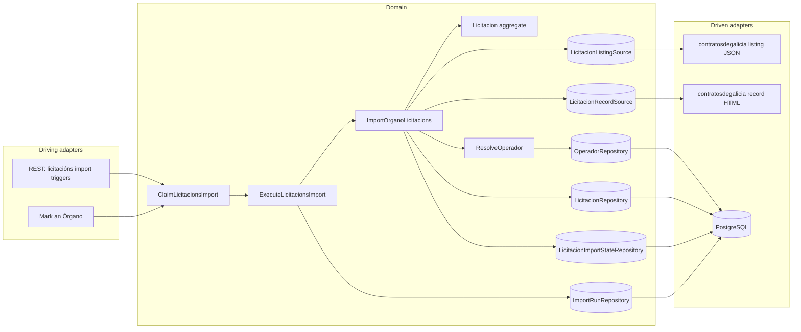
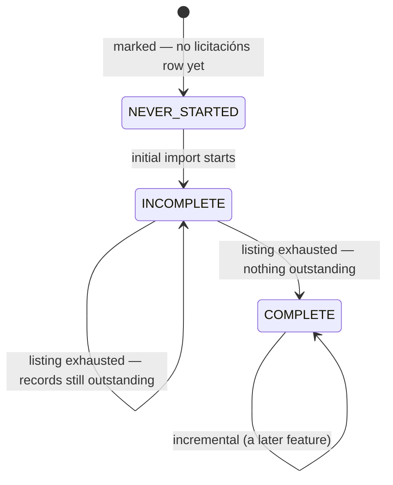
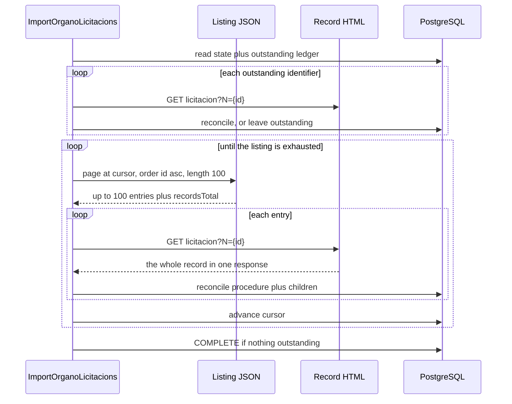
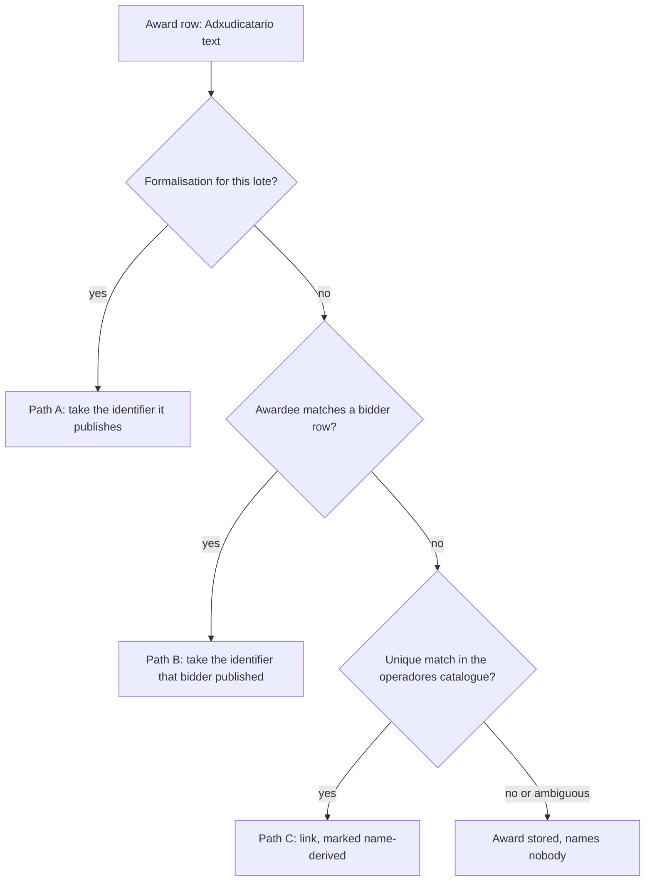

# FEAT-0015. Licitacións: the initial import and the stored procedure

## Goal

Make an Órgano's **licitacións** loadable: the system retrieves each marked Órgano's full
published tender history from contratosdegalicia.gal — the listing, and then **one record per
procedure** — and stores each procedure whole, with its lotes, classifications, bidders and
awards. This is the first buildable slice of
**[SPEC-0008](../../specs/SPEC-0008-import-browse-licitacions.md)**.

It delivers R3–R8 (R7 and R8 as *storage* obligations — every display obligation is the browsing
feature's); the **initial** and **resumed** modes of R9; the on-demand half of R10; R13's
reconciliation and R14's idempotence; the storage halves of R16, R17 and R18 — R17's **as amendment
1 restates it**, since the source identifies only 6% of consortia; R27's triggers, including the
mark that requests both families in order; R29's guard, **but not its yielding**; R30's two-level
failure isolation; and R33's as-published rule.

It exposes **no licitación read endpoint**. Nothing browses licitacións until the browsing feature
builds the family split, the year scoping, the CPV and state filters, the sort and the paging
control (R19–R26) over the rows stored here — the same order
[FEAT-0009](../FEAT-0009-contratos-menores-initial-import/README.md) and
[FEAT-0011](../FEAT-0011-contratos-menores-browsing/README.md) took for contratos menores. It puts
nothing new on screen either: the mark it rides on is already there, and R3 is satisfied by
**reusing** it rather than adding a second one.

**Far less is built here than FEAT-0009 had to build.** The system-wide guard, the run record, the
derived-abandoned read, the per-Órgano three-state fact, the mode rule, the throttled outbound
client, the operadores catalogue **and its derivation**, and **an ISO-8859-1 HTML parser against
this very source** all exist. What this feature adds is one more family behind that machinery, and
**one thing the machinery has never had to do: retrieve one page per stored record**. That single
property is what drives the cost, the resumption design and R29's deferral below.

The design sits in the hexagonal server of
**[ADR-0002](../../architecture/0002-hexagonal-architecture.md)**: the licitacións scraper is a
driven adapter behind a port, the REST endpoints are driving entry points, and the aggregate maps
to its tables under
**[ADR-0008](../../architecture/0008-domain-entities-carry-persistence-mapping-annotations.md)**
with typed identifiers under **[ADR-0019](../../architecture/0019-typed-aggregate-identifiers.md)**.
Retrieval is blocking I/O over virtual threads
(**[ADR-0011](../../architecture/0011-blocking-io-virtual-threads.md)**) through the resilient,
self-throttling client of
**[ADR-0014](../../architecture/0014-resilient-throttled-outbound-http-client.md)**, which is what
satisfies R31 without this feature choosing a rate. Durable run state follows
**[ADR-0017](../../architecture/0017-import-run-state-in-postgresql.md)**. REST lives under the
reserved `/api/` prefix (**[ADR-0006](../../architecture/0006-reserved-api-url-prefix.md)**), named
per **[ADR-0020](../../architecture/0020-actions-as-verbs-in-rest-paths.md)**, carries the
rate-limit contract of **[ADR-0012](../../architecture/0012-rate-limit-http-contract.md)**, is
authored contract-first (**[ADR-0010](../../architecture/0010-design-first-openapi-contract.md)**)
and guarded by session security
(**[ADR-0005](../../architecture/0005-session-based-authentication.md)**). Operadores are the
stored projection of **[ADR-0023](../../architecture/0023-operadores-as-a-stored-projection.md)**.

> **The source contract is measured, not assumed.** Every field, limit, size and frequency cited
> below was taken against the live site on **2026-08-20** and is recorded in
> [`design/source-contract.md`](design/source-contract.md). Five of those measurements
> **correct SPEC-0008 or a sibling document**: the listing's `importe` is a **budget, not an
> award**; **an award row publishes no fiscal identifier at all**, which is what the *Which
> operador an award belongs to* section exists to answer; the listing **can** be ordered by
> last-modified date once the full DataTables payload is sent, which
> [FEAT-0009's contract](../FEAT-0009-contratos-menores-initial-import/design/source-contract.md)
> concluded was impossible; **a UTE's fiscal identifier is usually not published**; and
> **classification is not reliably per lote** even on a procedure that has them. A sixth
> measurement *confirms* rather than corrects: the two families **share one publication id
> space**, which is what keeps SPEC-0006 R4's tie-break total now that a second family feeds the
> catalogue.
>
> The ordering finding leaves a paragraph in FEAT-0009's own contract false — it still records
> that "ordering parameters were not made to work". Correcting it, and asking whether the full
> payload makes FEAT-0014's window walk cheaper, is a **follow-up this feature does not take**.

## The amendments this feature rests on

Four amendments were needed before any task here could be written against a criterion that says
what the design does. **All four have landed**, in the same change as this feature; they are
recorded below because each is load-bearing, and a reader of either spec should be able to see why
its wording changed.

| Amendment | Where | What it settles |
| --- | --- | --- |
| 1. The unidentified consortium | SPEC-0008 R16/R17/R18, #20/#21/#22/#24; SPEC-0006 R16, R9, #40 | a UTE is recorded whether or not the source identifies it |
| 2. Classification not per lote | SPEC-0008 R8, #9/#10 | a CPV may hang off the procedure even where lotes exist |
| 3. The awardee resolved by name | SPEC-0008 R18/R33, #46; SPEC-0006 R3 | an award publishes no identifier, so one is derived — within bounds |
| 4. Placeholders are unusable | SPEC-0006 R5, #8/#9 | a dash or `TEMP-…` is not an identity, defensively |

Each section below states the measurement the amendment rests on, so the evidence stays with the
reasoning rather than only in the spec's own summary.

### 1. SPEC-0008 R17 has to admit a UTE the source does not identify — and SPEC-0006 R16 with it

R17 requires a UTE to be stored "as an operador, identified by its **own published fiscal
identifier** under SPEC-0006 R3", and says such an identifier "begins with `U`". Measured over
**613 bidder rows in 250 procedures**, neither half holds:

| Consortium rows (nested `<ul>`) | 35 |
| --- | --- |
| carrying a real `U…` identifier | **2** |
| carrying `-` or empty | 25 |
| carrying a `TEMP-…` placeholder | 8 |
| published under a name **not** beginning `UTE` | **7** |

So a UTE does have a fiscal identifier of its own — `U88779475` and `U70551049` were both observed
— and the source publishes it for **6%** of them. R17's mechanism is right and unavailable.

**What identifies a UTE is the structure of the bidder cell**, not its identifier and not its name:
a consortium nests a second `<ul>` listing each member's own identifier and name. In 613 rows that
test was exact — never firing on a single-firm bidder, never missing a consortium — while the name
test would miss 7 of 35 and the `U`-prefix test would miss 33 of 35. This is not inference in the
sense SPEC-0006 R6 forbids: the markup **is** the publication, which is precisely what R17's own
"membership is published, not inferred" asks for.

**So a UTE is recorded whether or not it is identified**, and the amendment says how:

- **a UTE with a published fiscal identifier** is an operador under SPEC-0006 R3, exactly as R17
  says today — the 6% case, unchanged;
- **a UTE without one** is recorded on the **participation** it made: its published name, its
  membership, and the fact that the bidder was a consortium. It is *not* catalogued as an operador,
  because SPEC-0006 R3 has no identity to catalogue it under and R5 rightly forbids inventing one;
- **each member firm is an operador either way.** All **80** member entries measured carried an
  ordinary identifier, so the firms that make up an unidentified consortium are perfectly
  catalogueable, and the membership is stored in both cases;
- **the award still belongs to the UTE alone.** Where the UTE is an operador the award is held by
  it; where it is not, the award names the consortium and holds **no operador**, so it enters no
  member's totals. Either way no euro is counted twice, which is the property R17 exists to
  protect.

**This is also the one exception to R18's no-per-row-name rule, and it needs stating.** R18 holds
that this family stores no name of its own, because a name belongs on the operador an identifier
resolves to. An unidentified UTE has no such operador, so the alternative to storing its published
name on the participation is losing it — and a licitación page would then show a bidder that is
nobody, which is worse than the rule R18 is protecting against. The exception is exactly one field
on exactly one row type.

**This also amends four things the earlier draft did not name.** Each, as written, forbids what
the model requires:

- **SPEC-0008 R16 and #20** say a party whose identifier is unusable "is recorded as **no
  participant and no awardee**" — precisely what an unidentified consortium now *is* recorded as.
  R16 gains the consortium as its stated exception;
- **SPEC-0008 #21** requires the UTE stored "as an operador under its own fiscal identifier" and
  "opening the UTE names its members". It becomes: catalogued where identified, recorded on the
  participation otherwise, with the *open the UTE* half holding only for the identified case;
- **SPEC-0008 #22** ("the UTE's awarded total includes it") is unsatisfiable for an uncatalogued
  consortium, which has no total to include it in. It needs the same split — and deferring it to
  SPEC-0006's features does **not** repair it, so the deferral below carries the note;
- **SPEC-0008 #24** ends "this family holding **no per-row name of its own**", which the
  participation's consortium name makes false. It narrows to *no per-row name for any party the
  catalogue can hold*, which is every party except an unidentified consortium — the same exception
  R18 takes, stated in the criterion that tests it;
- **SPEC-0006 R16 and #40** are the sibling half. R16 relates a member "to **the UTE operador**…
  identified by its own published fiscal identifier", and says a party with an unusable identifier
  yields "no participation to relate and no membership to hold"; #40 restates it normatively. Both
  must admit a membership whose consortium is not an operador, and **SPEC-0006 R9's *won through a
  UTE* section** needs a note for the same reason.

**Why this is not a SPEC-0006 R5 blocker.** `-` and `TEMP-…` appear **only** on consortium rows:
0 of 578 single-firm rows carried either. Because the structural branch is taken *before* any
identifier is resolved, a placeholder is never handed to `FiscalIdentifier.of` — which, per
amendment 3, would otherwise catalogue one operador holding the identifier `-` for dozens of
unrelated consortia. The safety comes from this feature's own parser, not from another spec moving
first.

### 2. SPEC-0008 #9 and #10 have to admit a classification the source does not put on a lote

R8, and criteria **#9** and **#10** with it, hold that classification, award and formalisation live
"per lote where it has lotes, against the procedure where it does not", and that "nowhere is a
second copy of them held at procedure level".

The source does not honour that split for classification. On procedure 822054 — two lotes, two
separate awards — **every CPV and NUT row carries `_` in its lote column**, meaning the procedure as
a whole. So a model that requires a lote on every classification row of a procedure that has lotes
cannot store what the source publishes.

The amendment is to widen #9 and #10 for **classification only**: held per lote *where the source
publishes it per lote*, and against the procedure otherwise. The award and formalisation halves are
untouched — those genuinely are per lote, exactly as R8 says. This is raised rather than absorbed
into the model because #9 is the criterion that forbids the second copy, and a reader auditing the
model against #9 as written would rightly conclude the model is wrong.

### 3. SPEC-0008 has to admit an awardee resolved by name, for the minority that needs it

**The award row publishes no fiscal identifier** — over 119 award rows, not one carried one. But
the **formalisation does**, per lote, holding the contratista's name and identifier in one cell
(`EQUINSE, S.A. A41111220`), a UTE's own included. Measured over **284 award rows**:

| Route | | Share |
| --- | --- | --- |
| **A** | the **formalisation** publishes it | **58%** |
| **B** | the procedure's **bidder list** publishes it | 7% |
| **C** | name only — a catalogue match is the sole route | 36% |

**65% is published, and the split is almost exactly the state.** A *formalizado* procedure
publishes it for **96%** of its awards; an *adxudicado* one, which has no formalisation yet, for
none. And the unresolved remainder is a **historical tail**: 59 of 60 such awards were published
2008–2012, against every recent *adxudicado* award resolving. An initial import meets them; a
routine run barely will.

So the amendment is smaller than an earlier draft of this feature made it. R18 gains an ordered
lookup — formalisation, then bidder list, then catalogue — of which **only the last infers**, and
R33 admits that last step as its one exception. Its bounds are unchanged and still necessary: it
never creates an operador, links only on a unique match, and is recorded as derived. SPEC-0006 R3
gains the reciprocal, admitting an attachment whose identifier the contract did not publish.

**The honest caveat is that path C is weakest where it is needed.** The catalogue it matches
against is fed largely by contratos menores from 2018 onward, while the awards needing it are
mostly 2008–2012 — so the firms may simply not be there. That is a reason to expect a modest
yield, not a reason to skip the step, and R25 already accepts an award that names nobody.

### 4. SPEC-0006 R5 should treat a published placeholder as unusable — defensively

[SPEC-0006](../../specs/SPEC-0006-operadores-economicos.md) R5 makes an identifier unusable only
when it is "absent, or empty once surrounding whitespace is ignored", and says "nothing beyond the
emptiness test is validated". Its criterion **#9** makes the consequence normative: "a contract
published with an irregular but non-empty identifier **is** attached to an operador."

`-` is not empty, and neither is `TEMP-00934`. `FiscalIdentifier.of` implements R5 exactly, so
`of("-")` returns a present value. Reached through the ordinary bidder path, that would catalogue
**one** operador holding the fiscal identifier `-`, carrying the bids of dozens of unrelated
consortia under whichever name was published last, and every `TEMP-` value would become exactly the
"invented or placeholder" operador R5 exists to forbid. Both failures are silent.

**Amendment 1's structural branch closes that path**, because every measured `-` and `TEMP-` sat on a consortium row and
the structural branch never offers one to R3. So this is **a guard, not a blocker**: 578 of 578
single-firm rows carried an ordinary identifier, which is a measured negative over one sample rather
than a rule the source states. If a single-firm row ever publishes `-`, the widening is what stops
it corrupting the catalogue.

The edit is three parts, so it lands complete: R5's test widens from *empty* to *empty or a
published placeholder*, naming `-` and the `TEMP-` form; **#8** widens to match R5's new wording;
and **#9** is qualified, because as written it argues against the amended requirement.

## Scope

- **Domain (the procedure):** a `Licitacion` aggregate carrying what R7 requires as published —
  the awarding Órgano, publication date, last-modified date, expediente, object, state (**code and
  label both**, since two codes share one label), contract/procedure/tramitación types, number of
  lotes, base budget and estimated value — keyed by the source's own publication identifier as its
  stable identity, with a `LicitacionRepository` port.
- **Domain (the award point):** the R8 structure — a **lote** where the procedure has them and the
  procedure itself where it does not — each carrying its CPV and NUT classification (with the
  **optional** lote reference amendment 2 describes), its award (operador, amount, resolution,
  resolution date, stated execution period), its bidder list and its formalisation. One place per
  thing awarded, and no second copy at procedure level.
- **Domain (competition):** a **participation** per published bidder, marking which was awarded, and
  a **UTE membership** between a consortium and each member firm, hung off the participation so one
  shape serves an identified and an unidentified consortium alike. A single-firm bidder and a member
  firm resolve to operadores under
  [SPEC-0006](../../specs/SPEC-0006-operadores-economicos.md) R3 and hold **no name of their own**
  (R18); an unidentified consortium carries its **published name** on the participation, which is
  R18's one exception (amendment 1). Each is a value type *and* a table, owned by named tasks below.
- **Domain (source ports):** a `LicitacionListingSource` answering one **(Órgano, offset, order)**
  page, and a `LicitacionRecordSource` answering one **procedure** whole. Two ports because they are
  two mechanisms — one JSON, one HTML — and a single port would hide from its caller that one call
  is a thousand times cheaper than the other.
- **Domain (per-Órgano, per-family import state):** the three-state fact, the resumption cursor and
  the **outstanding-record ledger** for **licitacións**, held apart from the contratos menores state
  so neither family's progress can be read as the other's (R4). **No covered-through instant**: T₀
  exists in `contrato_menor_import_state` because that family's incremental window is measured from
  it, and this family's incremental mode is driven by `modificado` ordering instead. Adding a column
  the incremental feature has not asked for is the speculative generality CLAUDE.md forbids.
- **Domain (the run record):** the change that lets **one run cover two families** for one Órgano,
  which R27 requires and the shipped schema forbids — see *One run, two families* below.
- **Domain (use cases):** `ClaimLicitacionsImport` decides who a run covers and whether it may
  start; `ExecuteLicitacionsImport` walks the covered Órganos and settles the verdict;
  `ImportOrganoLicitacions` takes one Órgano's turn — retry what is outstanding, walk the listing,
  retrieve each procedure, reconcile it, advance the state, and stop cleanly when the Órgano is
  unmarked mid-run.
- **Infrastructure:** migrations for the licitación and its child tables, the per-Órgano state and
  the run record's family column; their Micronaut Data JDBC repositories; and the contratosdegalicia
  adapters — a JSON listing client and an HTML record parser built on the **existing** jsoup
  precedent.
- **Application (driving):** the `ADMIN`-only triggers of the *API surface* section, and the mark
  wired to request **both** families in R27's fixed order.

**Out of scope (owned by later features):**

- **Browsing (R19–R26)** — the family split, the mandatory year scoping, the CPV and state filters,
  the sort, the paging control, R21's licitación page, R24's which-amount rule and R26's section
  states. All of it reads the rows this feature stores, and R32's latency measurement is taken over
  it.
- **The incremental mode (R11) and this family's place in the scheduler (R28)** — a later feature,
  the sibling of [FEAT-0014](../FEAT-0014-contratos-menores-incremental-refresh/README.md). **The
  consequence is stated rather than hidden**: until it lands, a loaded Órgano's licitacións go
  stale, an interrupted initial import resumes only when an administrator triggers it, and a mark
  refused under the guard is not recovered automatically for this family. Every mechanism that
  feature needs is built here with its incremental branch named and left unimplemented — and the
  measurement it most depends on, that the listing **can** be ordered by last-modified date, is
  settled in [`design/source-contract.md`](design/source-contract.md) rather than left for it to
  discover.
- **R29's yielding.** An initial import of SERGAS is ~16 800 requests and **~4.7 hours** at a
  courteous rate, so R29's obligation is real and this feature does not meet it: its initial import
  **holds the guard to completion**. It is deferred because it needs an **ADR taken against
  [ADR-0017](../../architecture/0017-import-run-state-in-postgresql.md)** — that record warns "a
  second insertion path would silently bypass the guard", which is exactly what re-claiming after a
  yield is — and because
  **[SPEC-0007](../../specs/SPEC-0007-monitor-import-runs.md) cannot yet describe a yielded run**,
  whose R4 vocabulary would read it as *abandoned*.

  **What that costs is a real collision, not a hypothetical one.** The guard is system-wide across
  every importer, so the question is not whether a licitacións scheduler exists but whether **any**
  scheduled run does. FEAT-0006's daily catalogue import at 03:00 is shipped, and FEAT-0014's
  contratos menores scheduler at 05:00 is drafted and will be. A 4.7-hour SERGAS walk begun at 02:00 **refuses both**.
  FEAT-0009 accepted the same cost and said so plainly; so does this. It is tolerable only because
  the population is small — the only publishers measured above 600 licitacións are SERGAS
  (16 798), Axencia Turismo de Galicia (1 064) and Augas de Galicia (625), with Portos de Galicia
  next at 385, so every other initial import finishes in minutes — and **the yielding feature must land before R28
  covers this family**, at which point the collision stops being occasional. **Criterion #40's
  yield clauses are unclaimed here.**
- **The historical re-read (R12), and removal/restore of a licitación, lote or participation
  (R15)** — the administrator corrections. R15 in particular changes what a re-import may re-add, so
  it lands with the surface that shows a licitación rather than the one that loads it. **R13's
  withdrawal marking is built here**, because an ordinary re-import produces it; what is deferred is
  the administrator's act and the restore.
- **Documents, mesas de contratación, appeals and the event history** — present on every record,
  the bulk of its 138 KB, and excluded by SPEC-0008's Scope.
- **The R32 latency measurement**, which measures reads that do not exist yet.

## Design

### Hexagonal placement ([ADR-0002](../../architecture/0002-hexagonal-architecture.md))

### One mark, two families, and a second import state

R3 reuses SPEC-0005 R4's mark exactly — there is no second column and no migration for it. What is
new is that **import progress is per family**, which R4 requires: an Órgano may have completed its
contratos menores history and never begun its licitacións one.

The existing `contrato_menor_import_state` table already holds that fact for one family. This
feature adds `licitacion_import_state` **beside** it rather than generalising both into one
family-keyed table, because **the two cursors are different kinds of thing**: contratos menores
resume from a *date* inside a windowed walk, and licitacións resume from an *offset* into an
ordered listing. A shared table would hold a nullable column for each and a discriminator deciding
which is meaningful — three columns to express what two tables express with none.

The mode rule is duplicated in the same spirit: `LicitacionImportMode.of(status)` mirrors the
shipped `ContratosMenoresImportMode.of(status)`, a four-line exhaustive switch over the same
three-state enum. Two small switches that can be read independently beat one rule parameterised by
family, and R4's requirement is precisely that neither family's progress is read as the other's —
easiest to guarantee when there is no shared code path to get wrong.

R4 falls out of this with no migration and no administrator action: every Órgano already marked has
**no** `licitacion_import_state` row, which *is* `NEVER_STARTED`, so the mode rule alone puts it in
the initial mode on the next run that covers it.

### One run, two families

R27 requires that marking an Órgano imports **both** families "within one run", and #38 requires the
outcome to name which Órganos were covered and which failed. **The shipped run record cannot express
that**, and this feature owns the change rather than asserting it away:

- `import_run.importer` is a single `TEXT NOT NULL` column — one run, one importer;
- `import_run_organo`'s primary key is `(run_id, organo_id)`, and its migration comment says the
  intent plainly: "no run can cover an Órgano twice". Two families for one Órgano is exactly that;
- `ImportRunRepository.claim(...)` is the **only** insertion path, enforced by `ImportRunArchTest`,
  so a second claim for the licitacións half would be refused by the guard the first one just took.

The change is the narrowest that satisfies R27 and #38 while keeping ADR-0017's single-insertion-path
property intact:

- **the coverage row gains a `family` column**, and its primary key becomes
  `(run_id, organo_id, family)`, so one run holds one outcome and one pair of counts per Órgano *per
  family* — which is what #38 has to read;
- **`Importer` gains `LICITACIONS`**, and gains **`CONTRATOS`** for a run that was asked for both
  contract families. The run-level column keeps its meaning — *what was triggered* — rather than
  becoming a derived summary of its coverage;
- **`claim` takes (Órgano, family) pairs** instead of Órganos, so the coverage is still enumerated
  up front in one insertion;
- **the run-level `added` and `refreshed` become per family too.** They are published today as
  "**contratos menores** new to the store across every Órgano this run covered"; summing two
  families into one pair would make #38's "how many **licitacións** were added and refreshed"
  unreadable from the run. They move onto the coverage row, which already has a pair, and the
  run-level pair is dropped rather than redefined — a cross-family total is a number nothing asked
  for.

Two alternatives were rejected. **A run per family** breaks R27's "within one run" and would need the
second one to claim a guard the first holds. **Deriving the run-level importer from its coverage**
makes a `NOT NULL` column a computed one and loses the distinction between *a mark asked for both*
and *a run that happened to cover both*.

The `Importer` enum is also **published**, at `docs/api/openapi.yaml`, so this is an authored-contract
change under ADR-0010 and gated by `scripts/openapi-lint.sh`. Task 1 owns the whole of it.

### The walk: ordered by `id` ascending, resumed by offset

The listing returns an Órgano's whole history in 100-row pages and `recordsTotal` is the Órgano's
total, exactly as it is for contratos menores — so completeness is provable rather than guessed, and
progress is a real fraction for SPEC-0007 R5 to render.

The walk asks for **`id` ascending**. Not last-modified — that is the *incremental* feature's order,
and the source contract settles that it works — and not the default, because an initial import needs
an order that is **stable under concurrent publication**. Ordered by `id` ascending, a procedure
published mid-walk takes a higher identifier and appends at the end, so pages already read do not
shift beneath the walk. Ordered by publication or modification date, a single edit reshuffles the
history and offset paging silently skips rows.

The cursor is the **offset already consumed**, written after each page's procedures commit. A crash
between the commit and the cursor write leaves the cursor slightly behind what is stored, and the
resumption re-reads that overlap — safe because storing a procedure again refreshes it in place.
The resumption additionally **steps back one page** rather than trusting the offset exactly, on the
same reasoning FEAT-0009 applied to its window boundary — the stability argument above is sound
but unproven.

**What the step-back costs is stated honestly, because it is not one request.** The walk retrieves
one record per listing entry, so re-reading a page means **100 record fetches — about 13.8 MB at
the measured median**, not the single listing call the overlap might suggest. That is accepted for
a walk of thousands, and it is the price of not trusting an unmeasured property. The cheap fix —
skip an entry whose stored last-modified equals the listing's `modificado` — is deliberately **not**
built here: it is the incremental feature's mechanism, and building half of it early is how two
walks end up disagreeing about what *unchanged* means.

### What ends the walk, and what happens to a record that failed

**The walk ends when the listing is exhausted, not when a count matches.** This is stated as a design
decision because the obvious alternative — end when the stored count reaches `recordsTotal` — cannot
terminate. One permanently unparseable record out of 16 798 leaves the count short for ever: the
Órgano never reaches `COMPLETE`, is `RESUMED` on every subsequent run, and re-walks a history it has
already read. FEAT-0009 met the same shape and answered it with a configured history floor; this
family has a better answer available, because its listing has an end.

So:

- the walk advances until a page returns fewer entries than it asked for, or the offset passes
  `recordsTotal` — **re-read on every response**, since it moves while a multi-hour import runs;
- a procedure whose retrieval or parse fails is written to an **outstanding-record ledger** against
  the Órgano, and the walk carries on. It is one procedure's failure, never its Órgano's (R30);
- when the listing is exhausted the Órgano becomes **`COMPLETE` only if nothing is outstanding**.
  Otherwise it stays `INCOMPLETE`, which is honest — its history is not fully loaded — and is what
  makes it resumable;
- **a resumption retries the ledger first**, before continuing from the cursor. That is what makes
  #41's "retrieves it on a later run" reachable at all: the cursor has long since advanced past the
  failure, and with the incremental mode and R12's re-read both unbuilt, nothing else would ever
  return to it.

The ledger is a small table keyed by (Órgano, publication identifier) and is emptied as entries
succeed. It is not a retry queue with backoff and attempt counts — that is machinery for a problem
nobody has measured yet; it is a set of identifiers the next run tries once more.

### The cost, and what this feature does about it

One record per procedure, at a **median of 138 KB**. For SERGAS that is 16 798 requests and ~2.8 GB —
about **4.7 hours** at one request per second.

This feature does not make that cheaper and does not pretend to. What it does is make it **wasted at
most once**: the cursor and the outstanding ledger live with the Órgano rather than with the run, so
pruning run history under SPEC-0007 R17 cannot strand a half-loaded Órgano, and an interrupted
import resumes rather than restarts. R29's yielding, which would keep the
guard free during those hours, is the deferred piece named in Scope.

### Retrieval and the two adapters ([ADR-0014](../../architecture/0014-resilient-throttled-outbound-http-client.md))

Both adapters ride the shared `contratosdegalicia` client id, so the R31 budget is enforced across
**every** family and the catalogue import together, and this feature chooses no rate. That matters
more here than anywhere: the record walk is the longest sustained outbound stream the system will
ever produce, and it is what criterion #42 measures.

Three things the adapters must get right, each measured rather than assumed:

- **The listing request always sends the whole DataTables payload**, including every
  `columns[i][name]`. The server resolves the order column by name; the abbreviated form answers
  `500`. There is no short equivalent and the adapter must not offer one.
- **The record is decoded as ISO-8859-1.** The listing is UTF-8 and the record is not; decoding the
  record as UTF-8 corrupts every accented name and object, which in Galician is most of them. This
  is not new ground — `ContratosDeGaliciaOrganoSourceAdapter` already parses ISO-8859-1 HTML from
  this same host with jsoup, and `PortadaClient` already returns raw bytes precisely so the charset
  is decided at parse time. The record adapter follows that precedent rather than inventing one.
- **A page is at most 100 rows.** An over-wide `length` answers a bare `500` with no
  machine-readable body, so the adapter stays inside the limit by construction rather than
  discovering it from the error.

### Parsing the record, and the three places the model must be looser than R8 reads

The parse is narrow — nine labelled `<dt>`/`<dd>` pairs and five tables out of a 138 KB page whose
bulk is documents and mesas — but three findings shape the model, and each is a case where taking R8
literally would lose data the source publishes:

- **A classification row's lote is optional.** CPV and NUT tables carry a lote column, and on
  procedure 822054 — which has two lotes and two separate awards — every CPV row's lote cell is `_`.
  The lote reference is nullable on a classification row, with `_` read as *the procedure as a
  whole*. **This is the departure amendment 2 above exists to legitimise.**
- **A lote's existence comes from the award table, not the lotes table.** `Relación de lotes` was
  empty on that same procedure — header row only — while `Nº lotes` said `2` and the award table
  named both. A parse that discovered lotes from the lotes table would have found none and lost both
  awards. Descriptions and per-lote estimated values are optional extras.
- **The listing's `importe` is the base budget, not the award.** For 822054 it is `3378552.09`,
  which is the record's `Orzamento base de licitación`; the two lotes were awarded `3.052.743,72` and
  `206.996,66`. Taking it for an awarded amount would fill every R24 total and every operador
  history with budgets, silently and plausibly. **The awarded amount comes from the resolution table
  and from nowhere else.**

Two parsing hazards are named because they pass every test written against an ASCII stub: **amounts
are Galician-formatted text** in the record (`3.052.743,72 EUR`) though the listing's are JSON
numbers, and **dates come in two forms** — `DD-MM-YYYY` in the listing, `DD-MM-YYYY HH:MM:SS` in the
record.

The award table's **`Part.` column states how many bidders that lote had**, which is a free
cross-check: a parse producing a different count has failed, and the procedure goes to the
outstanding ledger rather than being stored with a silently short bidder list — a short list is
indistinguishable from a genuine one and would understate competition for ever.

### Reconciling a restated record (R13, R14)

Every retrieval of a record restates the whole procedure, so R13's reconciliation is the ordinary
path rather than an exception:

- the **procedure** is matched by its publication identifier and refreshed in place;
- its **lotes, classifications, bidders, awards and UTE memberships** are reconciled to what the
  record now publishes — one the source no longer publishes is **retained and marked withdrawn**,
  appearing in no list, history or total;
- **a membership's visibility follows its participation's.** Memberships are named explicitly
  because they are easy to forget and expensive to forget: SPEC-0006 R7 counts "one visible UTE
  membership" toward an operador's reachability, so a member firm whose only tie is a membership
  under a withdrawn participation would stay reachable through an invisible fact — which is exactly
  what SPEC-0006 #39 tests for;
- a **licitación absent from a later import is retained unchanged** (R14). Absence is not evidence of
  withdrawal, and the explicit removal that is (R15) is a later feature's.

The withdrawal marking is not tidiness. SPEC-0006 rests the reversibility half of its R12 privacy
analysis on **every** feeding family's removal rule being non-destructive and reversible; a
participation an ordinary import could erase, with no administrator act and no way back, would break
that promise for the whole catalogue.

### Operadores: extract the resolution, do not rewrite it

Every award and every **single-firm** bidder resolves to an operador under SPEC-0006 R3, and this
family stores no name of its own on either. That is R18's rule and it is why an unusable identifier
leaves a party with nothing to display rather than a name without a link. **An unidentified UTE is
the single exception**, described under *Consortia* below and legitimised by amendment 1.

**The resolution already ships.** [FEAT-0010](../FEAT-0010-operadores-economicos-base/README.md)'s
derivation is done and `contrato_menor.operador_economico_id` is written today — but the logic lives
*inside* `StoreContratosMenoresBatch` (`operadorAwarded`, and the `account` path that drives
`NomeRank.outranks`, `promoteName` and `retainName`) rather than in a reusable collaborator. So task
11 **extracts a `ResolveOperador` collaborator** out of it and calls that, rather than growing a
second copy: SPEC-0006 R4's ranking is subtle — nulls-first so undated contracts rank last, a
`(COALESCE(date,'-infinity'), source_id)` tuple comparison in the retain-name upsert — and a
divergent second copy is a realistic defect rather than a theoretical one.

That rule's tie-break is *"the higher contract identifier"*, which a second feeding family could have
made ambiguous. **It does not**: the two families share one publication id space, measured rather
than assumed — `licitacion?N=822054` returns the licitación and `licitacion?N=2001090` returns the
contrato menor, from the same address space and with no prefix distinguishing them. So `NomeRank`
needs no family discriminator and R4's ordering stays total across families.

**The lote is the half that id space does not settle**, and it is the one that bites. SPEC-0006
records this family's contract identity as *a publication identifier **together with a lote***,
while `NomeRank` is `(date, sourceId)` over a single `BIGINT`. Two lotes of one procedure awarded to
the same operador under two published spellings therefore tie **exactly** — same date, same
publication identifier — so `outranks` answers false in both directions and the displayed name falls
to whichever row was written last. SPEC-0006 #36 asserts that choice is deterministic *by
construction*, so this is a defect rather than an untidiness. Task 11 settles what a licitación award
supplies as its rank identity; the plain answer is that the lote joins the tuple, but it is a change
to a shipped type that contratos menores also rank on, which is why it is a task's decision and not
an aside here.

**R16's unusable-identifier rule holds for three of the four party kinds, and not for the fourth.**
A single-firm bidder, an awardee and a UTE **member** whose identifier is unusable yield no
operador, are recorded as neither participant nor awardee, leave **the licitación stored and still
visible**, and cost no other party on the procedure anything. A licitación can therefore show an
award and name nobody, which R25 accepts here and SPEC-0005 R28 refuses for contratos menores —
because there the award *was* the publication.

**A consortium is the exception, and it is the whole of amendment 1.** R16 as written would have an
unidentified UTE recorded as *no participant*, which is precisely what the model refuses to do: it
is recorded as a participant, under its published name, with its membership intact. The distinction
is not a softening of R16 — a party the source names and structures as a bidder **is** a bidder,
and R16's rule exists for a party the source names and cannot identify, which is a different case.
Stating the rule uniformly, as an earlier draft of this section did, contradicted the table below
it.

### Which operador an award belongs to

An award row names its awardee in text and publishes no identifier for it. Three routes exist, and
the order matters because only the last one infers:

**Paths A and B are not inference.** The formalisation publishes the contratista's identifier
beside its name, per lote, and the bidder list publishes every bidder's. Both are reading the
record, not guessing at it, and between them they cover **65%** of awards — and **96%** of those
on a formalised procedure.

**Path C is the only inferring step**, and it is bounded: it never creates an operador, links only
where exactly one catalogued operador matches the published name, and records the link as derived
so it stays distinguishable and reversible. Measured ambiguity is 1 name in 268, and that one is a
source typo.

**Path H is a supported outcome, not a failure.** R16 and R25 already say a licitación may show an
award and name nobody, and R25 refuses to make a resolvable awardee a condition of visibility. So
an unresolved awardee costs a link, never a procedure.

**Normalisation for matching is not normalisation for storage.** R33 stores every value as
published; the comparison used by paths B and C folds case, accents, punctuation and surrounding
whitespace and is used for **nothing but the comparison**. Nothing normalised is stored or
displayed.

### Consortia: detected by structure, recorded either way

**The parser takes the consortium branch before it resolves any identifier**, on the nested `<ul>`
that a UTE cell carries. That ordering is the whole design, and it does three things at once: it is
the only test that is exact (613 rows, no false positive, no miss, against 7 of 35 missed by a name
test); it is what keeps `-` and `TEMP-…` away from `FiscalIdentifier.of`, since neither was ever
observed on a single-firm row; and it means a UTE is recognised as one **before** the question of
whether it can be catalogued arises.

What is stored then depends only on whether the source published an identifier:

| | UTE with a `U…` identifier (2 of 35) | UTE without one (33 of 35) |
| --- | --- | --- |
| The consortium | an operador under R3 | recorded on the participation, with its **published name** |
| Its members | operadores under R3 | operadores under R3 |
| The membership | stored | stored |
| The award, if it won | held by the UTE operador | names the consortium, holds no operador |
| Members' awarded totals | exclude it | exclude it |

**Membership hangs off the participation in both cases**, rather than off the UTE operador in one
and somewhere else in the other. That keeps one shape for a fact the source publishes one way, and
it follows R17's own observation that "a UTE is constituted for one procedure" — the consortium is a
property of a bid, and the member firms are the durable entities. A member's history reaches its
consortia through its memberships, and an identified UTE reaches its members through its
participations. **Only one of those directions survives for an uncatalogued consortium**, and this
says so rather than asserting parity: *member → its consortia* is answerable from the catalogue,
while *consortium → its members* has no catalogue entry to open and is answerable only on the
licitación's own page under R21 — a later feature's surface.

**No euro is counted twice under either branch**, which is the property R17 exists to protect: an
award to a consortium is never attributed to a member, whether or not the consortium is catalogued.

### API surface

Two new `ADMIN`-only endpoints, plus one existing one whose behaviour changes, all authored in
`openapi.yaml` first ([ADR-0010](../../architecture/0010-design-first-openapi-contract.md)) and named
per [ADR-0020](../../architecture/0020-actions-as-verbs-in-rest-paths.md):

| Method | Path | Purpose |
| --- | --- | --- |
| `POST` | `/api/admin/licitacions/import` | Trigger over every marked, active Órgano (R27) |
| `POST` | `/api/admin/organo/{id}/licitacions/import` | Trigger over one Órgano (R27) |
| `PUT` | `/api/admin/organo/{id}/importable` | **Existing.** Now requests both families (R27) |

Both triggers answer `202` with a run identifier, refuse with the guard's reason when a run is live,
and refuse with ineligibility when the named Órgano is unmarked or inactive — two distinct reasons,
as R27 requires.

The run is read through the existing `GET /api/admin/import-run/{id}`, whose **response shape
changes**: its per-Órgano coverage now carries a family, and its `importer` enum gains two values.
That is a published-contract change, not the no-op an earlier draft of this feature claimed.

**Marking triggers both families in one run, contratos menores first.** R27 fixes the order so a
partly loaded Órgano is always partly loaded the same way, and it is that order because contratos
menores is the family a marked Órgano most often holds nothing of — settling it quickly and leaving
the long load last.

## Sequencing (tasks, one small change each)

Seventeen backend, one frontend (task 18). Each names what it depends on, and the three tasks
an amendment blocks say so.

1. **Per-family run coverage, `Importer`, and the published contract** — the migration adding
   `family` to `import_run_organo`, re-keying it `(run_id, organo_id, family)` and moving `added`
   and `refreshed` onto it; a new two-value `ContractFamily` enum for that column, **not** `Importer`
   (whose `ORGANOS` and `AMBAS_FAMILIAS` values are nonsense in a coverage row); `Importer` gaining
   `LICITACIONS` and `AMBAS_FAMILIAS` — named so rather than `CONTRATOS`, which reads as a superset
   of `CONTRATOS_MENORES` by name alone; `claim` taking (Órgano, family) pairs; and the `openapi.yaml`
   edits, which are the `importer` enum on `ImportRun` **and a new `family` field on
   `ImportRunOrgano`**, under ADR-0021's conformance test. *(SPEC-0008 #38 coverage half)*
2. **Licitacións per-Órgano import state** — the `licitacion_import_state` migration, its
   `LicitacionImportStatus` / `LicitacionImportMode` / repository, and the outstanding-record ledger
   table, with the contratos menores state deliberately untouched. *(SPEC-0008 #5 state half)*
3. **`Licitacion` domain model + repository port** — a `LicitacionId` under ADR-0019, the publication
   identifier as stable identity, the Órgano, both dates, expediente, object, **state code and
   label**, the three types, the lote count, and the two economic figures as `Money`, plus the port.
   *(SPEC-0008 #7, #44)*
4. **Award points and competition value types** — lote, CPV/NUT classification with its **nullable
   lote reference**, award (carrying **how its operador was resolved**, per amendment 3),
   formalisation, participation (carrying the **consortium marker and published name**, per
   amendment 1) and UTE membership, under R8's one-place rule with no second copy at procedure level.
   *(SPEC-0008 #9 as amended, #10 storage half)*
5. **Licitacións store: the procedure and its award points** — migrations creating `licitacion`,
   `lote`, the two classification tables, `award` and `formalisation` (unique publication identifier,
   FK to the Órgano, the withdrawal marker R13 needs, and the `(organo_id, publication_date)` index
   the year-scoped read will want) and their JDBC repositories. *Depends on 3, 4.*
   *(SPEC-0008 #17 no-duplicates half)*
6. **Licitacións store: the competition tables** — `participation` and `ute_membership` migrations
   and repositories. A participation carries a nullable operador FK, a **consortium marker**, and the
   **published consortium name** that amendment 1 makes R18's one exception; a membership carries its
   participation and its member operador, and takes its visibility from that participation.
   *Depends on 4, 5.* *(SPEC-0008 #21 storage half)*
7. **`LicitacionListingSource` port + JSON adapter** — one (Órgano, offset, order) page over the
   shared `contratosdegalicia` client, sending the **full DataTables payload**, surfacing
   `recordsTotal`, and failing cleanly when the source is unreachable or its response unusable.
   *(SPEC-0008 #41 source-failure half, #42)*
8. **`LicitacionRecordSource` port, fetch and the labelled fields** — one procedure fetched on the
   same client and **decoded as ISO-8859-1** on the existing jsoup precedent, parsing the nine
   `<dt>`/`<dd>` scalars, with the Galician amount format and the two date formats handled here.
   *(SPEC-0008 #7, #44)*
9. **Record parse: the resolution, formalisation, CPV, NUT and lotes tables** — awards per lote;
   the **formalisation, whose `Contratista` cell carries the awardee's name and fiscal identifier
   together** and is the primary route to it; classifications with `_` read as procedure-wide; and
   lotes taken from the award table rather than the lotes table.
   *Depends on 3, 8.* *(SPEC-0008 #10 storage half, #9 as amended)*
10. **Record parse: bidders, consortium detection and the `Part.` cross-check** — a bidder row
    classified **by the nested `<ul>`**, never by its name or its identifier; a consortium's
    published name and its member entries parsed out of the inner list; and a count mismatch failing
    the procedure rather than storing a short list. *Depends on 8.* *(SPEC-0008 #19 storage half)*
11. **Extract `ResolveOperador`, and resolve bidders** — lift the resolution and name-ranking out of
    `StoreContratosMenoresBatch` behind a collaborator both families call, then resolve every
    single-firm bidder from its published identifier. Consortium rows are routed past it by task 10's
    classification, so no placeholder identifier reaches R3. Also settles what a licitación award
    supplies as its **name-rank identity**: `NomeRank` is `(date, sourceId)`, but SPEC-0006 records
    this family's contract identity as *publication identifier **together with a lote***, so two
    lotes of one procedure awarded to the same operador under different spellings would tie exactly
    and the displayed name would fall to arrival order — which SPEC-0006 #36 asserts cannot happen.
    *Depends on 6, 10.* *(SPEC-0008 #19 storage half)*
12. **Resolve the awardee: formalisation, then bidder list, then catalogue** — path A from the
    formalisation's published identifier, path B from the procedure's own bidder rows, path C as a
    unique match over SPEC-0006 R15's retained names, and an award stored with no operador where
    none hits; the match normalisation used for comparison only and never stored; and the
    resolution path recorded on the award. *Depends on 9, 11.* *(SPEC-0008 #19 awarded-one half, #20 storage half, #23 storage half, #24 storage half)*
13. **Consortia and their membership** — a UTE with a published identifier catalogued as an operador
    under R3; one without recorded on its participation with its published name; each member firm an
    operador either way; the membership stored in both cases; and the award attributed to the
    consortium alone, entering no member's totals. *Depends on 6, 12.* *(SPEC-0008 #21 import half, as amendment 1 restates it)*
14. **Reconciling a restated procedure** — `StoreLicitacion`, matching by publication identifier,
    refreshing in place, and marking withdrawn any lote, classification, bidder, award **or UTE
    membership** the record no longer publishes, a membership's visibility following its
    participation's. *Depends on 5, 6, 9, 13.* *(SPEC-0008 #16 import half, #17)*
15. **A single Órgano's initial import** — the `id`-ascending walk paged at 100, one record per
    entry, **ending when the listing is exhausted**, `COMPLETE` only when nothing is outstanding,
    the ledger retried before the cursor resumes, cursor advanced after each page, resumption
    stepping back one page and adding no duplicates, and a clean stop when the Órgano is unmarked
    mid-run. *Depends on 2, 7, 14.* *(SPEC-0008 #6 retrieval half, #12
    retained-and-resumed-on-demand halves only, #17, #41 retry half)*
16. **Multi-Órgano orchestration and failure isolation** — eligibility filtering, Órganos processed
    serially, per-Órgano failure isolation, **a failed record failing neither its Órgano nor the
    run**, and the run's per-family per-Órgano states and counts. *Depends on 1, 15.*
    *(SPEC-0008 #3, #11 initial-and-resumed modes only, #38 outcome half, #41)*
17. **Triggers, and the mark that requests both families** — the two `POST` endpoints returning
    `202` and a run identifier, the two distinct refusal reasons, and marking wired to request
    contratos menores then licitacións within one run. The published description of the existing
    mark endpoint ("Opt an Órgano into having its **contratos menores** imported") becomes false and
    is corrected here. OpenAPI-first. *Depends on 16.* *(SPEC-0008 #1 trigger half, #4
    immediate-and-refusal halves only, #38 trigger half, #40 refusal half)*
18. **The admin run banner, after the coverage re-key** *(frontend)* — task 1 makes a run over N
    Órganos return **2N** coverage entries, and `ui/src/features/organos/imports/importRunOutcome.ts`
    counts that array directly: marking one Órgano would report "2 Órganos covered" and "1 of 2
    completed" while the licitacións half still runs. Updates the count to group by Órgano, adds
    `family` to the `ImportRunOrgano` TypeScript type, and refreshes the WireMock stub the SPA
    acceptance tests read under ADR-0018. *Depends on 1, 17.* *(SPEC-0008 #38 display half)*

**Criteria this feature deliberately leaves incomplete**, so no task is written against something it
cannot prove:

- **the incremental feature and its scheduler** own #13, #14 and #39 whole; **#4's *recovered by the
  next scheduled run* clause**; **#11's *incrementally* clause**; and **#12's *without administrator
  intervention* clause**;
- **the yielding ADR and SPEC-0007's outcome vocabulary** own **#40's yield clauses** and **#12's
  *or by yielding the import guard* clause**; #12's progress-visibility half is SPEC-0007 R5–R7's;
- **the curation feature** owns **#15** and **#18** whole, and **#1's** resume, historical-re-read
  and remove/restore clauses;
- **the browsing feature** owns **#2**, **#8** (VAT labelling wherever a figure is shown), **#6's
  *its section says it is no longer being updated* half**, the *displayed* halves of **#19**, **#20**
  and **#36**, **#33**, and **#26–#35**, **#37** and **#45** whole. **#36's import-and-store half is
  this feature's** — an undecided procedure is imported and stored here and merely rendered there —
  which is why the edge cases below cite it;
- **SPEC-0006's own features** own **#22**, **#23's and #24's history halves** and **#25**, which
  that spec's note marks *proved in SPEC-0006*. **#22 is deferred but not intact**: it requires a
  UTE's awarded total to include the award, and 94% of consortia have no total to include it in, so
  amendment 1 rewrote it so the no-double-counting property it tests holds whether or not the
  consortium is catalogued. Handing it on unrepaired would have passed a broken criterion to
  someone with no reason to doubt it;
- **#43** measures reads that do not exist yet;
- **#36's administrator view of undated licitacións** is carried **unowned by SPEC-0008 itself**,
  which adds licitacións to the anomalies surface SPEC-0005 R28 already owes.

**#7 and #44 are claimed whole across tasks 3 and 8** — both are storage criteria with no display
clause, so an earlier draft's "storage half" split assigned a phantom other half to a feature that
would never claim it. The "half" wording is gone from both citations.

## Edge cases

- **An Órgano marked before this family existed** — has no `licitacion_import_state` row, which is
  `NEVER_STARTED`, so it takes the initial mode on the next run with no re-marking and no migration.
  Its contratos menores state is untouched by that run. *(SPEC-0008 #5)*
- **An Órgano that publishes no licitacións at all** — answers `recordsTotal: 0` and its first page
  returns nothing, so the listing is exhausted immediately and the import completes after a single
  request. A completed import, not a failure. *(SPEC-0008 #11)*
- **`recordsTotal` grows mid-walk**, over hours of importing. Re-read on every response; because the
  walk ends on an exhausted listing rather than a matched count, a figure that moved simply extends
  the walk instead of confusing its ending. *(SPEC-0008 #12)*
- **A single record's retrieval or parse fails** — written to the outstanding ledger, the Órgano's
  walk continues, and the next run retries it before resuming the cursor. This is R30's sharpest
  clause and the one this family adds: 16 798 retrievals per Órgano make an occasional failure a
  certainty rather than an incident. *(SPEC-0008 #41)*
- **A record that fails every time** — the Órgano stays `INCOMPLETE` for ever and is re-walked by
  every run. That is the honest state at the store, and the retry itself is cheap — one record
  fetch plus a listing walk, not 16 798 records. **What it is not cheap in is what a reader is
  told**: `INCOMPLETE` is exactly what SPEC-0008 #37 renders as *still filling*, so one bad record
  out of 16 798 would make SERGAS's licitacións section announce itself partial for ever. It clears
  when the record parses or when an administrator removes it under R15 — neither of which this
  feature builds, so the honest summary is that the state is correct and its **escape hatch is a
  later feature's**. *(SPEC-0008 #12, #37, #41)*
- **A bidder list whose length disagrees with the award table's `Part.` count** — the parse has
  failed and the procedure goes to the ledger, because a silently short list is indistinguishable
  from a genuine one and would understate competition for ever. *(SPEC-0008 #19, #41)*
- **A procedure with no award and no bidders** — open, pending, deserted or withdrawn. Stored and
  complete, not incomplete: 26 of the first 70 procedures sampled had no bidder table at all.
  *(SPEC-0008 #36)*
- **A procedure with lotes whose CPV rows carry no lote** — observed on 822054. The classification is
  stored against the procedure as a whole and the awards stay per lote. This is the case amendment 2
  legitimises; a model requiring a lote on every classification row could not store what the source
  publishes. *(SPEC-0008 #10)*
- **A procedure whose `Relación de lotes` is empty but whose award table names two lotes** — the
  lotes exist. Taken from the award table, with description and estimated value left absent.
  *(SPEC-0008 #10)*
- **A consortium published with `-` or a `TEMP-` placeholder** — 33 of 35 measured. Detected by its
  nested `<ul>` before any identifier is read, so the placeholder never reaches R3. It is recorded on
  its participation under its published name, its member firms are catalogued normally, the
  membership is stored, and any award it won names it while entering no member's totals.
  *(SPEC-0008 #20, #21 as amended)*
- **A consortium published under a name that does not begin `UTE`** — 7 of 35, such as
  `MISTURAS-INGESAN`. Detected identically, because the test is the markup and not the name. A
  name-prefix test would have recorded it as a single firm bidding under a placeholder identifier.
  *(SPEC-0008 #21 as amended)*
- **A single-firm bidder row carrying `-`** — never observed in 578 rows, and harmless if it appears:
  amendment 4's widening makes it yield no operador rather than joining a shared one. The structural
  branch is what makes this the unobserved case rather than the common one. *(SPEC-0008 #20)*
- **An award whose fiscal identifier is unusable** — the licitación is stored and **stays visible**,
  showing an award that names nobody. This is the deliberate departure from SPEC-0005 R28, which
  withholds exactly that row. *(SPEC-0008 #20, #36)*
- **A publication date that cannot be interpreted** — the procedure is stored with the column null
  and never rejected; it is invisible to readers under R25, which is a rule about readers and changes
  nothing this feature does. Expected to be negligible: the source publishes dates in one fixed form.
  *(SPEC-0008 #36, #44)*
- **Two codes, one label** — 101 and 102 are both *Histórico*. The code is what the system is unique
  on; a store keyed on the label would reject a real row and a filter keyed on it would merge two
  states. *(SPEC-0008 #33, #44)*
- **An unseen `estado` code** — code 7 was never observed and the set is not closed. Stored as
  published under R33, so an unknown code costs nothing. *(SPEC-0008 #44)*
- **A licitación and a contrato menor sharing a publication identifier** — cannot happen. The two
  families are addressed from one id space, so SPEC-0006 R4's higher-identifier tie-break stays total
  across families and `NomeRank` needs no family discriminator. Measured, not assumed.
- **Unmarked mid-import** — eligibility is checked between pages and the Órgano stops cleanly at a
  page boundary, keeping everything stored and leaving the cursor where it is. It stays
  `INCOMPLETE`, which is what makes a later re-mark resume rather than restart. *(SPEC-0008 #6, #11)*
- **Crash between a page's commit and its cursor write** — the cursor points behind what is stored;
  the resumption re-reads the overlap and the upsert makes it a no-op. *(SPEC-0008 #12, #17)*
- **A trigger arriving while any import runs** — including the catalogue import and contratos
  menores — is refused with the guard as its reason and recorded as refused, never queued. Until the
  scheduler covers this family, a refused mark is not recovered automatically. *(SPEC-0008 #40
  refusal half)*
- **An initial import of a large Órgano refuses both nightly schedulers** — FEAT-0006's 03:00
  catalogue import and FEAT-0014's 05:00 contratos menores sweep, for as long as ~4.7 hours. The
  known consequence of deferring R29's yielding, tolerable only while one Órgano dominates the
  population, and the reason the yielding feature must precede R28's coverage of this family.
  *(SPEC-0008 #40, deferred)*
- **A record decoded as UTF-8** — corrupts every accented name and object. The record is ISO-8859-1
  while the listing it came from is UTF-8, which is the kind of mismatch that passes every test
  written against an ASCII stub. *(SPEC-0008 #44)*
