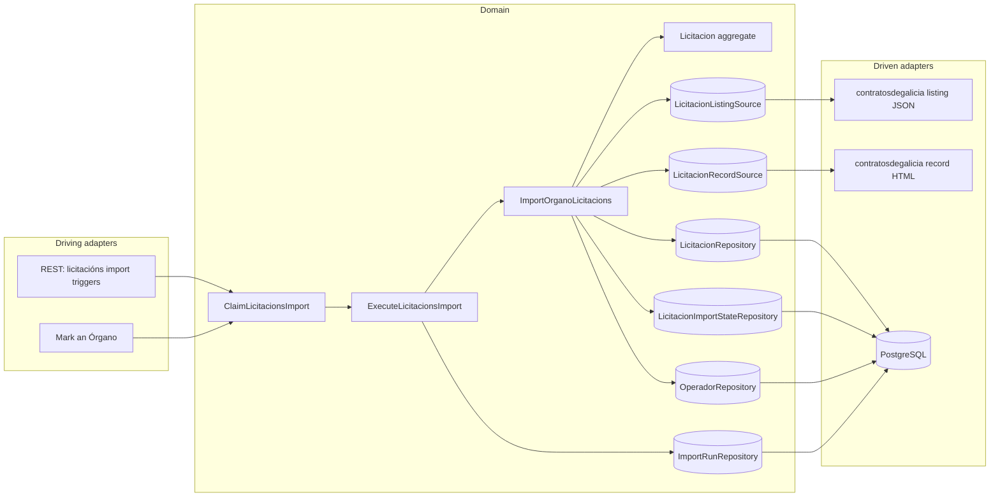
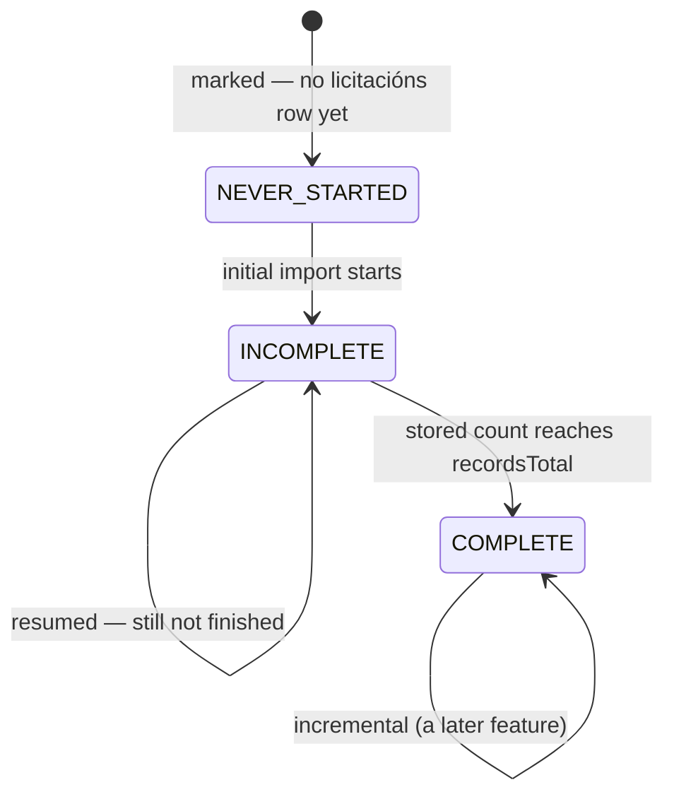
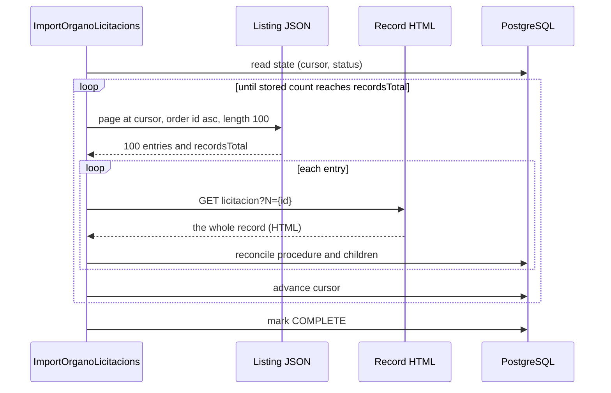

# FEAT-0015. Licitacións: the initial import and the stored procedure

## Goal

Make an Órgano's **licitacións** loadable: the system retrieves each marked Órgano's full
published tender history from contratosdegalicia.gal — the listing, and then **one record per
procedure** — and stores each procedure whole, with its lotes, classifications, bidders and
awards. This is the first buildable slice of
**[SPEC-0008](../../specs/SPEC-0008-import-browse-licitacions.md)**.

It delivers R3–R8 (R7 and R8 as *storage* obligations — every display obligation is the browsing
feature's); the **initial** and **resumed** modes of R9; the on-demand half of R10; R13's
reconciliation and R14's idempotence; the storage halves of R16, R17 and R18; R27's triggers,
including the mark that requests both families in order; R29's guard, **but not its yielding**;
R30's two-level failure isolation; and R33's as-published rule.

It exposes **no licitación read endpoint**. Nothing browses licitacións until the browsing feature
builds the family split, the year scoping, the CPV and state filters, the sort and the paging
control (R19–R26) over the rows stored here — the same order
[FEAT-0009](../FEAT-0009-contratos-menores-initial-import/README.md) and
[FEAT-0011](../FEAT-0011-contratos-menores-browsing/README.md) took for contratos menores. It puts
nothing new on screen either: the mark it rides on is already there, and R3 is satisfied by
**reusing** it rather than adding a second one.

**Far less is built here than FEAT-0009 had to build.** The system-wide guard, the run record, the
derived-abandoned read, the per-Órgano three-state fact, the mode rule, the throttled outbound
client and the operadores catalogue all exist. What this feature adds is one more family behind
the same machinery — and the two things that machinery has never had to do before: **retrieve one
page per stored record**, and **parse HTML**.

The design sits in the hexagonal server of
**[ADR-0002](../../architecture/0002-hexagonal-architecture.md)**: the licitacións scraper is a
driven adapter behind a port, the REST endpoints are driving entry points, and the aggregate maps
to its tables under
**[ADR-0008](../../architecture/0008-domain-entities-carry-persistence-mapping-annotations.md)**
with typed identifiers under **[ADR-0019](../../architecture/0019-typed-aggregate-identifiers.md)**.
Retrieval is blocking I/O over virtual threads
(**[ADR-0011](../../architecture/0011-blocking-io-virtual-threads.md)**) through the resilient,
self-throttling client of
**[ADR-0014](../../architecture/0014-resilient-throttled-outbound-http-client.md)**, which is what
satisfies R31 without this feature choosing a rate. Durable run state follows
**[ADR-0017](../../architecture/0017-import-run-state-in-postgresql.md)**. REST lives under the
reserved `/api/` prefix (**[ADR-0006](../../architecture/0006-reserved-api-url-prefix.md)**), named
per **[ADR-0020](../../architecture/0020-actions-as-verbs-in-rest-paths.md)**, carries the
rate-limit contract of **[ADR-0012](../../architecture/0012-rate-limit-http-contract.md)**, is
authored contract-first (**[ADR-0010](../../architecture/0010-design-first-openapi-contract.md)**)
and guarded by session security
(**[ADR-0005](../../architecture/0005-session-based-authentication.md)**). Operadores are the
stored projection of **[ADR-0023](../../architecture/0023-operadores-as-a-stored-projection.md)**.

> **The source contract is measured, not assumed.** Every field, limit, size and frequency cited
> below was taken against the live site on **2026-08-20** and is recorded in
> [`design/source-contract.md`](design/source-contract.md). Three of those measurements
> **correct SPEC-0008 or a sibling document**, and they are called out where they bite:
> the listing's `importe` is a **budget, not an award**; the listing **can** be ordered by
> last-modified date once the full DataTables payload is sent, which
> [FEAT-0009's contract](../FEAT-0009-contratos-menores-initial-import/design/source-contract.md)
> concluded was impossible; and **a UTE's fiscal identifier is usually not published**, which is
> the one prerequisite this feature cannot satisfy on its own.

## What this feature needs before it can be finished

One thing, named here so no task claims a criterion the system would currently get wrong.

**[SPEC-0006](../../specs/SPEC-0006-operadores-economicos.md) R5's unusable-identifier test has to
admit placeholders.** R5 makes an identifier unusable when it is "absent, or empty once
surrounding whitespace is ignored", and says "nothing beyond the emptiness test is validated".
Measured over 41 UTE bidder rows, the source publishes a real `U…` identifier for **2**; it
publishes `-` for **31** and a `TEMP-00934`-style placeholder for **8**. Neither is empty, so under
the rule as written every `-` UTE in the system becomes **one** operador holding the fiscal
identifier `-` — the bids and awards of dozens of unrelated consortia merged under whichever name
was published last — and every `TEMP-` placeholder becomes exactly the "invented or placeholder"
operador R5 exists to forbid.

The fix is narrow: widen R5 from *empty* to *empty or a published placeholder*, naming `-` and the
`TEMP-` form. Nothing else changes, because **R16 already says what follows** — the party yields no
operador, the licitación stays stored and visible, and every other party on the procedure is
unaffected. Task 9 is written against the amended rule and is the only task that depends on it;
tasks 1–8 and 10–12 do not.

Until it lands, this feature's UTE storage covers the 5% of UTEs that publish a real identifier
and records the rest as bidders with no operador — which is the amended rule's own outcome, reached
by leaving the placeholder unresolved rather than by inventing a test in the adapter.
**Criterion #21 is therefore not claimed by any task here.**

## Scope

- **Domain (the procedure):** a `Licitacion` aggregate carrying what R7 requires as published —
  the awarding Órgano, publication date, last-modified date, expediente, object, state (**code and
  label both**, since two codes share one label), contract/procedure/tramitación types, number of
  lotes, base budget and estimated value — keyed by the source's own publication identifier as its
  stable identity, with a `LicitacionRepository` port.
- **Domain (the award point):** the R8 structure — a **lote** where the procedure has them and the
  procedure itself where it does not — each carrying its CPV and NUT classification, its award
  (operador, amount, resolution, resolution date, stated execution period), its bidder list and its
  formalisation. One place per thing awarded, and no second copy at procedure level.
- **Domain (competition):** a **participation** per published bidder, marking which was awarded,
  and a **UTE membership** between a consortium and each member firm. Both resolve to operadores
  under [SPEC-0006](../../specs/SPEC-0006-operadores-economicos.md) R3 and hold **no name of their
  own** (R18).
- **Domain (source ports):** a `LicitacionListingSource` answering one **(Órgano, offset, order)**
  page, and a `LicitacionRecordSource` answering one **procedure** whole. Two ports because they are
  two mechanisms — one JSON, one HTML — and a single port would hide from its caller that one call
  is a thousand times cheaper than the other.
- **Domain (per-Órgano, per-family import state):** the three-state fact, the resumption cursor and
  the covered-through instant for **licitacións**, held apart from the contratos menores state so
  neither family's progress can be read as the other's (R4).
- **Domain (use cases):** `ClaimLicitacionsImport` decides who a run covers and whether it may
  start; `ExecuteLicitacionsImport` walks the covered Órganos and settles the verdict;
  `ImportOrganoLicitacions` takes one Órgano's turn — walk the listing, retrieve each procedure,
  reconcile it, advance the state, and stop cleanly when the Órgano is unmarked mid-run.
- **Infrastructure:** migrations for the licitación and its child tables and the per-Órgano state;
  their Micronaut Data JDBC repositories; and the contratosdegalicia adapters — a JSON listing
  client and an **HTML record parser**.
- **Application (driving):** the `ADMIN`-only triggers of the *API surface* section, and the mark
  wired to request **both** families in R27's fixed order.

**Out of scope (owned by later features):**

- **Browsing (R19–R26)** — the family split, the mandatory year scoping, the CPV and state filters,
  the sort, the paging control, R21's licitación page, R24's which-amount rule and R26's section
  states. All of it reads the rows this feature stores, and R32's latency measurement is taken over
  it.
- **The incremental mode (R11) and this family's place in the scheduler (R28)** — a later feature,
  the sibling of [FEAT-0014](../FEAT-0014-contratos-menores-incremental-refresh/README.md). **The
  consequence is stated rather than hidden**: until it lands, a loaded Órgano's licitacións go
  stale, an interrupted initial import resumes only when an administrator triggers it, and a mark
  refused under the guard is not recovered automatically for this family. Every mechanism that
  feature needs is built here with its incremental branch named and left unimplemented — and the
  measurement it most depends on, that the listing **can** be ordered by last-modified date, is
  settled in [`design/source-contract.md`](design/source-contract.md) rather than left for it to
  discover.
- **R29's yielding.** An initial import of SERGAS is ~16 800 requests and **~4.7 hours** at a
  courteous rate, so R29's obligation is real and this feature does not meet it: its initial import
  **holds the guard to completion**. That is deferred rather than dismissed for two reasons. It
  needs an **ADR taken against
  [ADR-0017](../../architecture/0017-import-run-state-in-postgresql.md)**, which SPEC-0008's own
  *Decisions taken* section requires and which warns that "a second insertion path would silently
  bypass the guard" — re-claiming after a yield is exactly that path. And it needs
  **[SPEC-0007](../../specs/SPEC-0007-monitor-import-runs.md) to be able to describe a yielded
  run**, which its R4 vocabulary cannot: a yielded run currently reads as *abandoned*. Shipping the
  yield before either exists would put a second guard-claiming path into the system with no record
  able to explain it. **Criterion #40's yield clauses are consequently unclaimed here**, and the
  first Órgano large enough to matter will hold the guard for an evening — which is acceptable only
  because R28's scheduler does not yet cover this family, so there is no daily run for it to starve.
- **The historical re-read (R12), and removal/restore of a licitación, lote or participation
  (R15)** — the administrator corrections. R15 in particular changes what a re-import may re-add, so
  it lands with the surface that shows a licitación rather than the one that loads it. **R13's
  withdrawal marking is built here**, because an ordinary re-import produces it; what is deferred is
  the administrator's act and the restore.
- **Documents, mesas de contratación, appeals and the event history** — present on every record,
  the bulk of its 138 KB, and excluded by SPEC-0008's Scope.
- **The R32 latency measurement**, which measures reads that do not exist yet.

## Design

### Hexagonal placement ([ADR-0002](../../architecture/0002-hexagonal-architecture.md))

### One mark, two families, and a second import state

R3 reuses SPEC-0005 R4's mark exactly — there is no second column and no migration for it. What is
new is that **import progress is per family**, which R4 requires: an Órgano may have completed its
contratos menores history and never begun its licitacións one.

The existing `contrato_menor_import_state` table already holds that fact for one family. This
feature adds `licitacion_import_state` **beside** it rather than generalising both into one
family-keyed table, because **the two cursors are different kinds of thing**: contratos menores
resume from a *date* inside a windowed walk, and licitacións resume from an *offset* into an
ordered listing. A shared table would hold a nullable column for each and a discriminator deciding
which is meaningful — three columns to express what two tables express with none.

The mode rule is duplicated in the same spirit: `LicitacionImportMode.of(status)` mirrors
`ContratosMenoresImportMode.of(status)` over the same three-state enum. Two eight-line switches
that can be read independently beat one rule parameterised by family, and R4's requirement is
precisely that neither family's progress is read as the other's — which is easiest to guarantee
when there is no shared code path to get wrong.

R4 falls out of this with no migration and no administrator action: every Órgano already marked has
**no** `licitacion_import_state` row, which *is* `NEVER_STARTED`, so the mode rule alone puts it in
the initial mode on the next run that covers it.

### The walk: ordered by `id` ascending, resumed by offset

The listing returns an Órgano's whole history in 100-row pages and `recordsTotal` is the Órgano's
total, exactly as it is for contratos menores — so completeness is provable rather than guessed, and
progress is a real fraction for SPEC-0007 R5 to render.

The walk asks for **`id` ascending**. Not last-modified — that is the *incremental* feature's order
and the source contract settles that it works — and not the default, because an initial import needs
an order that is **stable under concurrent publication**. Ordered by `id` ascending, a procedure
published mid-walk takes a higher identifier and appends at the end, so pages already read do not
shift beneath the walk. Ordered by publication or modification date, a single edit reshuffles the
history and offset paging silently skips rows.

The cursor is the **offset already consumed**, written after each page's procedures commit. A crash
between the commit and the cursor write leaves the cursor slightly behind what is stored, and the
resumption re-reads that overlap — safe because storing a procedure again refreshes it in place.
The resumption additionally **steps back one page** rather than trusting the offset exactly, on the
same reasoning FEAT-0009 applied to its window boundary: the stability argument above is sound but
unproven, and re-reading 100 entries costs one listing request against a walk of thousands.

**`recordsTotal` is re-read on every response** and tested only when the walk believes it is done, so
a figure that moved during a multi-hour import simply means the walk is not finished yet.

### The cost, and what this feature does about it

One record per procedure, at a **median of 138 KB**. For SERGAS that is 16 798 requests and ~2.8 GB —
about **4.7 hours** at one request per second.

This feature does not make that cheaper and does not pretend to. What it does is make it **wasted at
most once**: the cursor and the covered-through instant live with the Órgano rather than with the
run, so pruning run history under SPEC-0007 R17 cannot strand a half-loaded Órgano, and an interrupted
import resumes rather than restarts. R29's yielding, which would keep the guard free during those
hours, is the deferred piece named above.

### Retrieval and the two adapters ([ADR-0014](../../architecture/0014-resilient-throttled-outbound-http-client.md))

Both adapters ride the shared `contratosdegalicia` client id, so the R31 budget is enforced across
**every** family and the catalogue import together, and this feature chooses no rate. That matters
more here than anywhere: the record walk is the longest sustained outbound stream the system will
ever produce.

Three things the adapters must get right, each measured rather than assumed:

- **The listing request always sends the whole DataTables payload**, including every
  `columns[i][name]`. The server resolves the order column by name; the abbreviated form answers
  `500`. There is no short equivalent and the adapter must not offer one.
- **The record is decoded as ISO-8859-1.** The listing is UTF-8 and the record is not; decoding the
  record as UTF-8 corrupts every accented name and object, which in Galician is most of them.
- **A page is at most 100 rows.** An over-wide `length` answers a bare `500` with no
  machine-readable body, so the adapter stays inside the limit by construction rather than
  discovering it from the error.

### Parsing the record, and the three places the model must be looser than R8 reads

The record is HTML, and it is the first HTML this system parses. The parse is narrow — nine labelled
`<dt>`/`<dd>` pairs and five tables out of a 138 KB page whose bulk is documents and mesas — but three
findings shape the model, and each is a case where taking R8 literally would lose data the source
publishes:

- **A classification row's lote is optional.** CPV and NUT tables carry a lote column, and on
  procedure 822054 — which has two lotes and two separate awards — every CPV row's lote cell is `_`.
  So classification is not reliably per lote even where lotes exist. The lote reference is nullable
  on a classification row, with `_` read as *the procedure as a whole*.
- **A lote's existence comes from the award table, not the lotes table.** `Relación de lotes` was
  empty on that same procedure — header row only — while `Nº lotes` said `2` and the award table
  named both. A parse that discovered lotes from the lotes table would have found none and lost both
  awards. Descriptions and per-lote estimated values are optional extras.
- **The listing's `importe` is the base budget, not the award.** For 822054 it is `3378552.09`,
  which is the record's `Orzamento base de licitación`; the two lotes were awarded `3.052.743,72` and
  `206.996,66`. Taking it for an awarded amount would fill every R24 total and every operador
  history with budgets, silently and plausibly. **The awarded amount comes from the resolution table
  and from nowhere else.**

The award table's **`Part.` column states how many bidders that lote had**, which is a free
cross-check: a parse producing a different count has failed, and the procedure is recorded as failed
under R30 rather than stored short. A parse failure is one procedure's failure — never its Órgano's.

### Reconciling a restated record (R13, R14)

Every retrieval of a record restates the whole procedure, so R13's reconciliation is the ordinary
path rather than an exception:

- the **procedure** is matched by its publication identifier and refreshed in place;
- its **lotes, classifications, bidders and awards** are reconciled to what the record now
  publishes — one the source no longer publishes is **retained and marked withdrawn**, appearing in
  no list, history or total;
- a **licitación absent from a later import is retained unchanged** (R14). Absence is not evidence of
  withdrawal, and the explicit removal that is (R15) is a later feature's.

The withdrawal marking is not tidiness. SPEC-0006 rests the reversibility half of its R12 privacy
analysis on **every** feeding family's removal rule being non-destructive and reversible; a
participation an ordinary import could erase, with no administrator act and no way back, would break
that promise for the whole catalogue.

### Operadores: awardees, bidders, UTEs (R16, R17, R18)

Every award and every bidder resolves to an operador under SPEC-0006 R3, and **this family stores no
name of its own** — not on an award and not on a bidder. That is R18's rule and it is why an unusable
identifier leaves a party with nothing to display rather than a name without a link.

Unlike FEAT-0009, which declared a nullable operador column and never wrote it, **this feature
derives and writes them**, because [FEAT-0010](../FEAT-0010-operadores-economicos-base/README.md)'s
catalogue and matching rules already exist. A bidder list with no operadores would be a bidder list
with no content at all.

The rule is uniform across a bidder, an awardee and a UTE member: an unusable identifier yields no
operador, the party is recorded as neither participant nor awardee, **the licitación stays stored and
visible**, and every other party on the same procedure is unaffected. A licitación can therefore show
an award and name nobody, which R25 accepts here and SPEC-0005 R28 refuses for contratos menores —
because there the award *was* the publication.

A UTE is an operador in its own right, its members are operadores, the membership is stored, and
**the award belongs to the UTE alone**. What this feature cannot do until SPEC-0006 R5 is amended is
tell a published placeholder from an identifier — see *What this feature needs* above.

### API surface

Three `ADMIN`-only endpoints, authored in `openapi.yaml` first
([ADR-0010](../../architecture/0010-design-first-openapi-contract.md)) and named per
[ADR-0020](../../architecture/0020-actions-as-verbs-in-rest-paths.md):

| Method | Path | Purpose |
| --- | --- | --- |
| `POST` | `/api/admin/licitacions/import` | Trigger over every marked, active Órgano (R27) |
| `POST` | `/api/admin/organo/{id}/licitacions/import` | Trigger over one Órgano (R27) |
| `PUT` | `/api/admin/organo/{id}/importable` | **Existing.** Now requests both families (R27) |

Both triggers answer `202` with a run identifier, refuse with the guard's reason when a run is live,
and refuse with ineligibility when the named Órgano is unmarked or inactive — two distinct reasons,
as R27 requires. The run is read through the existing `GET /api/admin/import-run/{id}`, which needs
no change beyond `Importer` gaining a `LICITACIONS` value.

**Marking triggers both families in one run, contratos menores first.** R27 fixes the order so a
partly loaded Órgano is always partly loaded the same way, and it is that order because contratos
menores is the family a marked Órgano most often holds nothing of — settling it quickly and leaving
the long load last. The mark is refused as a whole when the guard is held.

## Sequencing (tasks, one small change each)

1. **`Importer.LICITACIONS` and the per-family import state** — the `licitacion_import_state`
   migration, its `LicitacionImportStatus` / `LicitacionImportMode` / repository, and the new
   `Importer` value, with the contratos menores state deliberately untouched. *(SPEC-0008 #5, #11
   state half)*
2. **`Licitacion` domain model + repository port** — a `LicitacionId` under ADR-0019, the
   publication identifier as stable identity, the Órgano, both dates, expediente, object, **state
   code and label**, the three types, the lote count, and the two economic figures as `Money`, plus
   the port. *(SPEC-0008 #7 storage half, #44 storage half)*
3. **Award points, lotes and classifications** — the lote, CPV/NUT classification, award and
   formalisation value types under R8's one-place rule, with the **nullable lote reference** the
   source contract requires and no second copy at procedure level. *(SPEC-0008 #9, #10 storage half)*
4. **Licitacións store** — the migrations creating `licitacion` and its child tables (unique
   publication identifier, FK to the Órgano, the withdrawal marker R13 needs, and the
   `(organo_id, publication_date)` index the year-scoped read will want) and the Micronaut Data JDBC
   repositories, including the upsert that makes re-import idempotent. *(SPEC-0008 #17)*
5. **`LicitacionListingSource` port + JSON adapter** — one (Órgano, offset, order) page over the
   shared `contratosdegalicia` client, sending the **full DataTables payload**, surfacing
   `recordsTotal`, and failing cleanly when the source is unreachable or its response unusable.
   *(SPEC-0008 #41 source-failure half)*
6. **`LicitacionRecordSource` port + HTML adapter** — one procedure whole, **decoded as
   ISO-8859-1**, parsing the nine labelled fields and the five tables, reading `_` as
   *procedure-wide*, taking lotes from the award table, and cross-checking each bidder list against
   the `Part.` count. *(SPEC-0008 #7 storage half, #10 storage half, #44)*
7. **Reconciling a restated procedure** — `StoreLicitacion`, matching by publication identifier,
   refreshing in place, and marking withdrawn any lote, bidder or award the record no longer
   publishes. *(SPEC-0008 #16 import half, #17)*
8. **Awardees and bidders as operadores** — resolving every award and every published bidder to an
   operador under SPEC-0006 R3, recording which was awarded, holding **no per-row name**, and
   leaving a party with an unusable identifier as neither participant nor awardee. *(SPEC-0008 #19,
   #20, #23 storage half, #24 storage half)*
9. **UTE membership** — the consortium as an operador, each member as an operador, and the
   membership between them, with the award attributed to the UTE alone. **Depends on the SPEC-0006 R5
   amendment named above**; it is the only task that does, and it claims no criterion until that
   lands. *(SPEC-0008 #21 import half — unclaimed pending the amendment)*
10. **A single Órgano's initial import** — the `id`-ascending walk paged at 100, one record per
    entry, ending when the stored count reaches `recordsTotal`; cursor advanced after each page,
    resumption stepping back one page and adding no duplicates, and a clean stop when the Órgano is
    unmarked mid-run. *(SPEC-0008 #6 retrieval half, #12 retained-and-resumed-on-demand halves
    only, #17)*
11. **Multi-Órgano orchestration and two-level failure isolation** — eligibility filtering, Órganos
    processed serially, per-Órgano failure isolation, and **a failed record retrieval failing neither
    its Órgano nor the run** — recorded, skipped, and left to a later run. *(SPEC-0008 #3, #11, #41)*
12. **Triggers, and the mark that requests both families** — the two `POST` endpoints returning
    `202` and a run identifier, the two distinct refusal reasons, and marking wired to request
    contratos menores then licitacións within one run. OpenAPI-first. *(SPEC-0008 #1 trigger half,
    #4, #38, #40 refusal half)*

**Criteria this feature deliberately leaves incomplete**, so no task is written against something it
cannot prove: **#13 and #14** whole (the incremental mode), **#12's *without administrator
intervention* clause** and its progress-visibility half — SPEC-0007 R5–R7's — and **#39** (this
family's place in the scheduler) wait on the incremental feature and its scheduler;
**#40's yield clauses** wait on the yielding ADR and on
SPEC-0007's outcome vocabulary; **#21** waits on the SPEC-0006 R5 amendment; **#18** (removal and
restore) and **#15's administrator route** are the curation feature's; **#36's administrator view of
undated licitacións** is carried unowned by SPEC-0008 itself; **#42** and **#43** are measurements
over surfaces that do not exist yet; and the *displayed* halves of
**#7, #8, #10, #16, #19, #20, #22–#37, #44 and #45** are owned by the browsing feature.

## Edge cases

- **An Órgano marked before this family existed** — has no `licitacion_import_state` row, which is
  `NEVER_STARTED`, so it takes the initial mode on the next run with no re-marking and no migration.
  Its contratos menores state is untouched by that run. *(SPEC-0008 #5)*
- **An Órgano that publishes no licitacións at all** — answers `recordsTotal: 0`, so its initial
  import completes after a single listing request rather than walking an empty history. A completed
  import, not a failure. *(SPEC-0008 #11)*
- **`recordsTotal` grows mid-walk**, over hours of importing. Re-read on every response and tested
  only when the walk believes it is done, so a moved figure means the walk is not finished.
  *(SPEC-0008 #12)*
- **A single record's retrieval or parse fails** — recorded, the Órgano's walk continues, and the
  procedure is left to a later run. This is R30's sharpest clause and the one this family adds:
  16 798 retrievals per Órgano make an occasional failure a certainty rather than an incident.
  *(SPEC-0008 #41)*
- **A bidder list whose length disagrees with the award table's `Part.` count** — the parse has
  failed. The procedure is recorded as failed rather than stored with a short bidder list, because a
  silently short list is indistinguishable from a genuine one and would understate competition
  forever. *(SPEC-0008 #19, #41)*
- **A procedure with no award and no bidders** — open, pending, deserted or withdrawn. Stored and
  complete, not incomplete: 26 of the first 70 procedures sampled had no bidder table at all.
  *(SPEC-0008 #36)*
- **A procedure with lotes whose CPV rows carry no lote** — observed on 822054. The classification is
  stored against the procedure as a whole and the awards stay per lote; a model requiring a lote on
  every classification row could not store what the source publishes. *(SPEC-0008 #10)*
- **A procedure whose `Relación de lotes` is empty but whose award table names two lotes** — the
  lotes exist. Taken from the award table, with description and estimated value left absent.
  *(SPEC-0008 #10)*
- **A UTE published with `-` or a `TEMP-` placeholder** — 39 of 41 measured. Yields no operador and
  no membership once SPEC-0006 R5 is amended; its member firms and every other bidder on the
  procedure are unaffected, and the licitación stays visible. *(SPEC-0008 #20; #21 pending)*
- **An award whose fiscal identifier is unusable** — the licitación is stored and **stays visible**,
  showing an award that names nobody. This is the deliberate departure from SPEC-0005 R28, which
  withholds exactly that row. *(SPEC-0008 #20, #36)*
- **A publication date that cannot be interpreted** — the procedure is stored with the column null
  and never rejected; it is invisible to readers under R25, which is a rule about readers and changes
  nothing this feature does. Expected to be negligible: the source publishes dates in one fixed form.
  *(SPEC-0008 #36, #44)*
- **Two codes, one label** — 101 and 102 are both *Histórico*. The code is what the system is unique
  on; a store keyed on the label would reject a real row and a filter keyed on it would merge two
  states. *(SPEC-0008 #33, #44)*
- **An unseen `estado` code** — code 7 was never observed and the set is not closed. Stored as
  published under R33, so an unknown code costs nothing. *(SPEC-0008 #44)*
- **Unmarked mid-import** — eligibility is checked between pages and the Órgano stops cleanly at a
  page boundary, keeping everything stored and leaving the cursor where it is. It stays
  `INCOMPLETE`, which is what makes a later re-mark resume rather than restart. *(SPEC-0008 #6, #11)*
- **Crash between a page's commit and its cursor write** — the cursor points behind what is stored;
  the resumption re-reads the overlap and the upsert makes it a no-op. *(SPEC-0008 #12, #17)*
- **A trigger arriving while any import runs** — including the catalogue import and contratos
  menores — is refused with the guard as its reason and recorded as refused, never queued. Until the
  scheduler covers this family, a refused mark is not recovered automatically. *(SPEC-0008 #40
  refusal half)*
- **An initial import of a large Órgano holds the guard for hours** — the known consequence of
  deferring R29's yielding. Tolerable only because no scheduled licitacións run exists yet to be
  starved; the yielding feature must land before R28 covers this family. *(SPEC-0008 #40, deferred)*
- **A record decoded as UTF-8** — corrupts every accented name and object. The record is ISO-8859-1
  while the listing it came from is UTF-8, which is the kind of mismatch that passes every test
  written against an ASCII stub. *(SPEC-0008 #44)*
